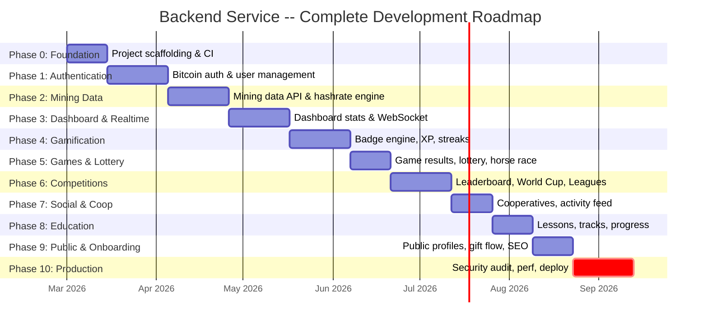
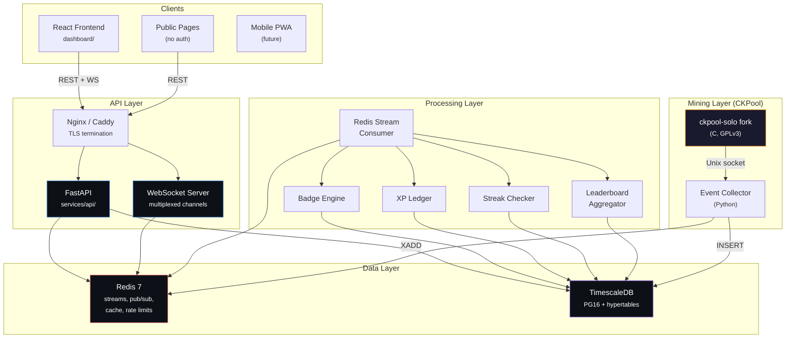

# Backend Service -- Development Roadmap

**Version:** 1.0
**Date:** February 2026
**Maintainer:** The Bitcoin Game Engineering Team
**Stack:** Python 3.12 + FastAPI + TimescaleDB + Redis + WebSocket

---

## Introduction

This document provides a high-level overview of the Backend Service development roadmap for The Bitcoin Game. The roadmap is organized into eleven phases, progressing from project scaffolding through gamification, competitions, and education to a full production deployment.

The Backend Service sits between the ckpool Event Collector (which feeds mining events into Redis Streams + TimescaleDB) and the React frontend. It provides a FastAPI-based REST/WebSocket API that translates raw mining data into the gamified experience: authentication via Bitcoin message signing, real-time dashboard data, badges, XP, streaks, leaderboards, competitions, and education tracking.

For the mining engine roadmap, see the [CKPool Service Roadmap](../../ckpool-service/roadmap/00-overview.md).

---

## Visual Timeline



---

## Phase Dependency Graph

```mermaid
graph LR
    P0["Phase 0<br/>Foundation"]
    P1["Phase 1<br/>Authentication"]
    P2["Phase 2<br/>Mining Data"]
    P3["Phase 3<br/>Dashboard &<br/>Realtime"]
    P4["Phase 4<br/>Gamification"]
    P5["Phase 5<br/>Games &<br/>Lottery"]
    P6["Phase 6<br/>Competitions"]
    P7["Phase 7<br/>Social &<br/>Cooperatives"]
    P8["Phase 8<br/>Education"]
    P9["Phase 9<br/>Public &<br/>Onboarding"]
    P10["Phase 10<br/>Production"]

    P0 -->|"Scaffolding ready"| P1
    P1 -->|"Auth + users"| P2
    P2 -->|"Mining data flowing"| P3
    P2 -->|"Share/diff data"| P4
    P3 -->|"WebSocket infra"| P4
    P4 -->|"Badge/XP engine"| P5
    P4 -->|"Gamification tables"| P6
    P5 -->|"Game results"| P6
    P6 -->|"Leaderboard + WC"| P7
    P4 -->|"Streak data"| P7
    P7 -->|"Social infra"| P8
    P8 -->|"Education done"| P9
    P1 -->|"Public profile"| P9
    P9 -->|"All features"| P10

    style P10 fill:#4a1a1a,stroke:#f85149
    style P4 fill:#3a2a1a,stroke:#d4a843
```



---

## Phase Index

| Phase | Name | Duration | Start | End | Status | Document |
|---|---|---|---|---|---|---|
| **0** | Foundation & Scaffolding | 2 weeks | Mar 1 | Mar 14 | Not Started | [phase-00-foundation.md](./phase-00-foundation.md) |
| **1** | Authentication & Users | 3 weeks | Mar 15 | Apr 4 | Not Started | [phase-01-authentication.md](./phase-01-authentication.md) |
| **2** | Mining Data API | 3 weeks | Apr 5 | Apr 25 | Not Started | [phase-02-mining-data.md](./phase-02-mining-data.md) |
| **3** | Dashboard & Realtime | 3 weeks | Apr 26 | May 16 | Not Started | [phase-03-dashboard-realtime.md](./phase-03-dashboard-realtime.md) |
| **4** | Gamification Engine | 3 weeks | May 17 | Jun 6 | Not Started | [phase-04-gamification.md](./phase-04-gamification.md) |
| **5** | Games & Lottery | 2 weeks | Jun 7 | Jun 20 | Not Started | phase-05-games.md |
| **6** | Competitions | 3 weeks | Jun 21 | Jul 11 | Not Started | phase-06-competitions.md |
| **7** | Social & Cooperatives | 2 weeks | Jul 12 | Jul 25 | Not Started | phase-07-social.md |
| **8** | Education | 2 weeks | Jul 26 | Aug 8 | Not Started | phase-08-education.md |
| **9** | Public & Onboarding | 2 weeks | Aug 9 | Aug 22 | Not Started | phase-09-public.md |
| **10** | Production Hardening | 3 weeks | Aug 23 | Sep 12 | Not Started | phase-10-production.md |

---

## Summary Statistics

| Phase | New Tables | Endpoints | WS Channels | Background Tasks | Complexity |
|---|---|---|---|---|---|
| 0 -- Foundation | 0 (baseline) | 5 | 0 | 0 | Low |
| 1 -- Authentication | 3 | 15 | 0 | 1 | Medium |
| 2 -- Mining Data | 4 | 17 | 0 | 3 | High |
| 3 -- Dashboard & Realtime | 2 | 5 | 4 | 2 | High |
| 4 -- Gamification | 6 | 9 | 1 | 3 | High |
| 5 -- Games & Lottery | 5 | 8 | 1 | 2 | Medium |
| 6 -- Competitions | 8 | 14 | 1 | 3 | High |
| 7 -- Social & Cooperatives | 6 | 10 | 1 | 2 | Medium |
| 8 -- Education | 5 | 8 | 0 | 1 | Low |
| 9 -- Public & Onboarding | 3 | 7 | 0 | 1 | Low |
| 10 -- Production | 2 | 4 | 0 | 2 | High |
| **Totals** | **~44** | **~102** | **4 (multiplexed)** | **~20** | -- |

---

## Architecture Overview



---

## Phase Summaries

**Phase 0 -- Foundation & Scaffolding:** FastAPI project scaffolding with modular layout, Docker Compose integration, Alembic migrations baseline, middleware (CORS, rate limiting, structured logging), pytest infrastructure, and CI pipeline.

**Phase 1 -- Authentication & Users:** Bitcoin message signing auth (challenge-response), JWT RS256 tokens, user auto-creation, profile CRUD, settings CRUD (JSONB), and API key management with argon2 hashing.

**Phase 2 -- Mining Data API:** Redis Stream consumer for real-time mining events, worker status tracking, share pagination (keyset cursor), hashrate computation and snapshots, personal bests with percentile ranking, and difficulty visualization data.

**Phase 3 -- Dashboard & Realtime:** WebSocket server with channel multiplexing, Redis pub/sub bridge for real-time event delivery, dashboard stats aggregation, global activity feed, upcoming events, and frontend integration stubs (TanStack Query + WebSocket client).

**Phase 4 -- Gamification Engine:** Badge trigger engine (5 trigger types, 20 badge definitions), XP ledger with source tracking, level thresholds matching the frontend exactly, streak tracking (Monday-to-Sunday UTC weeks), denormalized gamification state for O(1) reads.

**Phase 5 -- Games & Lottery:** Game result recording (Hammer, Horse Race, Slots, Scratch Card), weekly lottery system (shares-as-tickets), game leaderboards, and block-found game variant triggers.

**Phase 6 -- Competitions:** Leaderboard aggregation (4 views: weekly/monthly/all-time/country), World Cup state machine (registration, groups, knockout, finals), league system with promotion/relegation zones, and competition share cards.

**Phase 7 -- Social & Cooperatives:** Cooperative creation/join/leave, cooperative stats aggregation, activity feed system (global + per-user), notification delivery, and social share cards.

**Phase 8 -- Education:** Lesson and track content management, progress tracking, quiz engine, education badges integration, and "Down the Rabbit Hole" completion tracking.

**Phase 9 -- Public & Onboarding:** Public miner profiles, public leaderboard (no auth required), "How It Works" content API, gift/onboarding flow, and SEO-friendly routes.

**Phase 10 -- Production Hardening:** Security audit, load testing (10K concurrent users), database optimization (indexes, partitioning, vacuum), monitoring/alerting, backup strategy, and deployment automation.

---

## Dependencies (Detailed)

| Dependency | From | To | What Must Be Done |
|---|---|---|---|
| Scaffolding ready | Phase 0 | Phase 1 | FastAPI app boots, DB connects, CI green, Docker Compose up |
| Auth + users | Phase 1 | Phase 2 | JWT auth works, users table populated, middleware active |
| Mining data flowing | Phase 2 | Phase 3 | Workers/shares/hashrate endpoints return real data from Redis + DB |
| Share/diff data | Phase 2 | Phase 4 | Share counts and best-diff values available for badge triggers |
| WebSocket infra | Phase 3 | Phase 4 | WS server operational, can push badge/XP notifications |
| Badge/XP engine | Phase 4 | Phase 5 | Badges can be triggered, XP granted, streaks tracked |
| Gamification tables | Phase 4 | Phase 6 | user_gamification table populated for leaderboard ranking |
| Game results | Phase 5 | Phase 6 | Game scores stored for competition leaderboards |
| Leaderboard + WC | Phase 6 | Phase 7 | Competition data available for cooperative stats |
| Streak data | Phase 4 | Phase 7 | Streak calendar available for social sharing |
| Social infra | Phase 7 | Phase 8 | Activity feed supports education events |
| Education done | Phase 8 | Phase 9 | Lesson progress available for public profiles |
| Public profile | Phase 1 | Phase 9 | User profiles viewable without auth |
| All features | Phase 9 | Phase 10 | Every feature complete, ready for production hardening |

### Parallel Work Opportunities

- **Phase 1 + Phase 2 overlap (1 week):** Mining data consumer can start while auth finalizes, using test users.
- **Phase 4 features are independent:** Badge engine, XP ledger, and streak checker have no internal dependencies.
- **Phase 5 and Phase 6 partial overlap:** Game result storage can start while competition logic is designed.
- **Phase 7 + Phase 8 overlap:** Education content management has no dependency on social features.
- **Phase 10 runs parallel with Phase 9 tail:** Load testing can begin while public pages finalize.

---

## Resource Requirements

| Phase | Engineers | Infrastructure | External Dependencies |
|---|---|---|---|
| 0 | 1 Python/FastAPI | Docker, CI runner | None |
| 1 | 1--2 (Python + Crypto) | Same + Redis | coincurve library, BIP-322 test vectors |
| 2 | 1--2 (Python + DB) | Same | Event Collector running (Phase 1 of CKPool) |
| 3 | 2 (Python + Frontend) | Same | TanStack Query (frontend) |
| 4 | 2 (Python + Game Design) | Same | Badge definitions frozen with product team |
| 5 | 1 Python | Same | None |
| 6 | 2 (Python + Product) | Same | World Cup rules finalized |
| 7 | 1 Python | Same | None |
| 8 | 1 Python + Content | Same | Lesson content authored |
| 9 | 1 Python + Frontend | Same | None |
| 10 | 2--3 (Python + DevOps + Security) | Production servers, monitoring stack | Sentry, PagerDuty |

---

## Technology Stack

| Component | Technology | Version | Purpose |
|---|---|---|---|
| Language | Python | 3.12+ | Type hints, asyncio, performance |
| Framework | FastAPI | 0.115+ | REST + WebSocket, async, OpenAPI |
| ORM | SQLAlchemy | 2.0+ | Async ORM, Alembic migrations |
| Database | TimescaleDB | PG16 | Time-series + relational |
| Cache/Streams | Redis | 7.x | Streams, pub/sub, rate limiting, cache |
| Auth | PyJWT + coincurve | -- | RS256 JWT, Bitcoin signature verification |
| Validation | Pydantic | 2.x | Request/response models |
| Testing | pytest + pytest-asyncio | -- | Async tests, httpx.AsyncClient |
| Linting | ruff | -- | Fast Python linter + formatter |
| Type checking | mypy | -- | Strict mode |
| CI | GitHub Actions | -- | Build, lint, type-check, test |
| Containerization | Docker + Compose | -- | Local dev + production |

---

## Project Structure

```
services/api/
  Dockerfile
  pyproject.toml
  alembic.ini
  alembic/
    env.py
    versions/
      001_baseline.py
      002_auth_tables.py
      ...
  src/
    tbg/
      __init__.py
      main.py                  # FastAPI app factory
      config.py                # Settings (pydantic-settings)
      database.py              # async engine + session
      redis_client.py          # Redis connection pool
      middleware/
        __init__.py
        cors.py
        rate_limit.py
        request_id.py
        error_handler.py
        logging.py
      auth/
        __init__.py
        router.py              # /auth/* endpoints
        dependencies.py        # get_current_user, require_auth
        bitcoin.py             # Message signing verification
        jwt.py                 # Token create/verify
        models.py              # Pydantic schemas
        service.py             # Business logic
      users/
        router.py
        models.py
        service.py
      mining/
        router.py
        models.py
        service.py
        consumer.py            # Redis Stream consumer
        hashrate.py            # Hashrate computation
      dashboard/
        router.py
        models.py
        service.py
      ws/
        router.py
        manager.py             # WebSocket connection manager
        channels.py            # Channel definitions
        bridge.py              # Redis pub/sub bridge
      gamification/
        router.py
        models.py
        service.py
        badge_engine.py        # Badge trigger processing
        xp.py                  # XP calculation
        streaks.py             # Streak tracking
      games/
        router.py
        models.py
        service.py
      competitions/
        router.py
        models.py
        leaderboard.py
        worldcup.py
        leagues.py
      social/
        router.py
        models.py
        activity.py
        cooperatives.py
      education/
        router.py
        models.py
        service.py
      public/
        router.py
        models.py
        service.py
      db/
        models.py              # SQLAlchemy ORM models
        base.py                # Base model class
  tests/
    conftest.py
    test_health.py
    auth/
      test_bitcoin.py
      test_auth_flow.py
      test_jwt.py
    mining/
      test_workers.py
      test_shares.py
      test_hashrate.py
    ...
```

---

## Risk Register

| Risk | Probability | Impact | Mitigation |
|---|---|---|---|
| Redis Stream consumer falls behind under load | Medium | High | Consumer group with multiple workers, backpressure monitoring |
| WebSocket connection limits hit on single server | Medium | Medium | Horizontal scaling, sticky sessions, connection pooling |
| Badge engine processes same event twice | Medium | High | Idempotent processing with deduplication keys |
| JWT key rotation causes auth failures | Low | High | Graceful key rotation with overlap period |
| TimescaleDB query performance degrades with data growth | Medium | Medium | Continuous aggregates, retention policies, index tuning |
| Bitcoin signature verification fails for new address types | Low | Medium | Comprehensive test vectors, future-proof address parsing |
| Frontend/backend schema drift | High | Medium | OpenAPI spec auto-generation, contract tests |
| Rate limiting too aggressive for legitimate users | Medium | Medium | Per-user rate limits, configurable thresholds, monitoring |
| Streak checker misses UTC boundary | Low | High | Extensive boundary tests, NTP sync, cron with retry |
| CKPool event schema changes break consumer | Low | High | Schema versioning, backward-compatible parsing |

---

## Milestones

```mermaid
graph LR
    M1["Milestone 1<br/>Mar 14<br/><b>API Boots</b><br/>Health endpoint live"]
    M2["Milestone 2<br/>Apr 4<br/><b>Auth Working</b><br/>Bitcoin sign-in flow"]
    M3["Milestone 3<br/>Apr 25<br/><b>Mining Data Live</b><br/>Real-time workers/shares"]
    M4["Milestone 4<br/>May 16<br/><b>Dashboard Connected</b><br/>Frontend shows real data"]
    M5["Milestone 5<br/>Jun 6<br/><b>Gamification Engine</b><br/>Badges, XP, streaks"]
    M6["Milestone 6<br/>Jul 11<br/><b>Competitions Live</b><br/>Leaderboard + World Cup"]
    M7["Milestone 7<br/>Aug 22<br/><b>Feature Complete</b><br/>All endpoints operational"]
    M8["Milestone 8<br/>Sep 12<br/><b>Production Ready</b><br/>Load tested, secured"]

    M1 --> M2 --> M3 --> M4 --> M5 --> M6 --> M7 --> M8

    style M8 fill:#4a1a1a,stroke:#f85149
    style M5 fill:#3a2a1a,stroke:#d4a843
```



| Milestone | Date | Gate Criteria |
|---|---|---|
| **M1: API Boots** | Mar 14, 2026 | FastAPI starts, health endpoint returns 200, DB connected, CI green |
| **M2: Auth Working** | Apr 4, 2026 | Bitcoin message signing auth flow end-to-end, JWT issued, user created |
| **M3: Mining Data Live** | Apr 25, 2026 | Workers, shares, hashrate endpoints return real data from Redis + DB |
| **M4: Dashboard Connected** | May 16, 2026 | Frontend Dashboard page shows real-time data via REST + WebSocket |
| **M5: Gamification Engine** | Jun 6, 2026 | Mining event triggers badge, grants XP, updates streak, pushes WS notification |
| **M6: Competitions Live** | Jul 11, 2026 | Leaderboard, World Cup bracket, and Leagues all operational |
| **M7: Feature Complete** | Aug 22, 2026 | All ~102 endpoints operational, all WS channels active |
| **M8: Production Ready** | Sep 12, 2026 | Load test passed (10K concurrent), security audit done, monitoring live |

---

## Total Database Schema

The complete schema across all phases includes approximately 44 tables:

| Category | Tables | Phase |
|---|---|---|
| Core (existing) | users, workers, shares, blocks, weekly_best_diff, mining_events, rate_limit_events, schema_migrations, hourly_shares (mat. view), daily_shares (mat. view) | Baseline |
| Auth | refresh_tokens, api_keys, user_settings | 1 |
| Mining | personal_bests, user_daily_stats, hashrate_snapshots, network_difficulty | 2 |
| Dashboard | activity_feed, upcoming_events | 3 |
| Gamification | badge_definitions, user_badges, xp_ledger, user_gamification, streak_calendar, badge_stats | 4 |
| Games | game_results, lottery_tickets, lottery_draws, game_leaderboards, game_configs | 5 |
| Competitions | leaderboard_snapshots, world_cup_events, world_cup_teams, world_cup_matches, league_definitions, league_memberships, league_seasons, competition_results | 6 |
| Social | cooperatives, cooperative_members, cooperative_stats, activity_events, notifications, notification_preferences | 7 |
| Education | education_tracks, education_lessons, lesson_progress, quiz_attempts, education_badges | 8 |
| Public | gift_codes, onboarding_sessions, public_stats_cache | 9 |
| Production | audit_log, system_health | 10 |

---

## API Endpoint Summary

| Category | Count | Auth Required | Rate Limit |
|---|---|---|---|
| Health & Meta | 5 | No | None |
| Authentication | 6 | Partial | Strict |
| User Management | 9 | Yes | Standard |
| Mining Data | 17 | Yes | Standard |
| Dashboard & Realtime | 5 | Yes | Standard |
| Gamification | 9 | Yes | Standard |
| Games | 8 | Yes | Standard |
| Competitions | 14 | Yes | Standard |
| Social & Coop | 10 | Yes | Standard |
| Education | 8 | Yes | Standard |
| Public | 7 | No | Relaxed |
| Admin | 4 | Yes (admin) | Strict |
| **Total** | **~102** | -- | -- |

---

## WebSocket Channel Summary

All WebSocket communication goes through a single endpoint (`ws://api/ws?token={jwt}`) with JSON-based channel multiplexing:

| Channel | Description | Message Types | Phase |
|---|---|---|---|
| `mining` | Real-time mining events | share_submitted, worker_status, hashrate_update, best_diff | 3 |
| `dashboard` | Dashboard live updates | stats_update, feed_item, event_reminder | 3 |
| `gamification` | Badge/XP/level notifications | badge_earned, xp_gained, level_up, streak_update | 4 |
| `competition` | Competition live data | leaderboard_update, match_update, league_update | 6 |

---

## Background Task Summary

| Task | Schedule | Phase | Description |
|---|---|---|---|
| Token cleanup | Every 1h | 1 | Remove expired refresh tokens |
| Redis stream consumer | Continuous | 2 | Process mining events from Redis Streams |
| Hashrate snapshots | Every 5m | 2 | Snapshot user hashrates to hypertable |
| Worker timeout checker | Every 30s | 2 | Mark workers offline if no share in 5 minutes |
| Dashboard stats aggregator | Every 10s | 3 | Aggregate stats for dashboard endpoint |
| Activity feed pruner | Every 1h | 3 | Trim activity feed to 1000 entries |
| Badge trigger processor | Continuous | 4 | Process events and check badge triggers |
| Streak checker | Mon 00:05 UTC | 4 | Check weekly streak for all active users |
| XP recalculator | Every 1h | 4 | Verify XP totals against ledger (consistency) |
| Lottery draw | Sun 23:59 UTC | 5 | Run weekly lottery draw |
| Game leaderboard refresh | Every 5m | 5 | Update game leaderboard caches |
| Leaderboard snapshot | Mon 00:00 UTC | 6 | Snapshot weekly leaderboard for history |
| World Cup scheduler | Hourly | 6 | Advance World Cup state machine |
| League relegation | Weekly | 6 | Process league promotions/relegations |
| Coop stats aggregator | Every 15m | 7 | Aggregate cooperative member stats |
| Notification sender | Continuous | 7 | Process notification queue |
| Public stats cache | Every 5m | 9 | Refresh public stats cache |
| DB vacuum/analyze | Daily 04:00 | 10 | Database maintenance |
| Backup verification | Daily 05:00 | 10 | Verify backup integrity |
| Health check reporter | Every 30s | 10 | Report system health to monitoring |

---

## Definition of Done

The Backend Service is considered production-ready when **all** of the following are met:

### Functional Completeness

- [ ] All ~102 REST endpoints operational and documented (OpenAPI)
- [ ] WebSocket server handles 4 channels with < 100ms delivery
- [ ] Bitcoin message signing auth works for P2PKH, P2WPKH, and P2TR addresses
- [ ] Badge engine triggers correctly for all 20 badge definitions
- [ ] XP ledger matches frontend level thresholds exactly
- [ ] Streak checker handles all UTC boundary edge cases
- [ ] Leaderboard shows 4 views (weekly/monthly/all-time/country)
- [ ] World Cup state machine advances through all stages
- [ ] Education progress persists and unlocks badges

### Reliability

- [ ] Zero crashes in 14-day staging environment window
- [ ] All background tasks survive Redis/DB restart
- [ ] WebSocket reconnection works within 5 seconds
- [ ] Rate limiting prevents abuse without blocking legitimate users
- [ ] Idempotent event processing (no duplicate badges/XP)

### Performance

- [ ] 10,000 concurrent REST + WS connections
- [ ] REST endpoint P99 < 200ms
- [ ] WebSocket message delivery P99 < 100ms
- [ ] Share pagination (100K+ rows) < 200ms
- [ ] Dashboard stats aggregation < 50ms

### Security

- [ ] JWT RS256 with key rotation support
- [ ] API keys hashed with argon2
- [ ] All user input validated (Pydantic strict mode)
- [ ] SQL injection impossible (parameterized queries only)
- [ ] Rate limiting on all public endpoints
- [ ] CORS configured for production domains only
- [ ] No secrets in logs or error responses

### Observability

- [ ] Structured JSON logging with request ID correlation
- [ ] Prometheus metrics for all endpoints and background tasks
- [ ] Grafana dashboards for API latency, error rates, WS connections
- [ ] PagerDuty alerts for critical failures
- [ ] OpenAPI spec auto-generated and accurate

### Testing

- [ ] Overall test coverage > 85%
- [ ] Auth module > 90%
- [ ] Gamification module > 90%
- [ ] All 102 endpoints have integration tests
- [ ] Load test report generated and reviewed

---

*For detailed implementation plans, click through to the individual phase documents above.*
*This roadmap is a living document. Update as timelines shift and scope evolves.*
