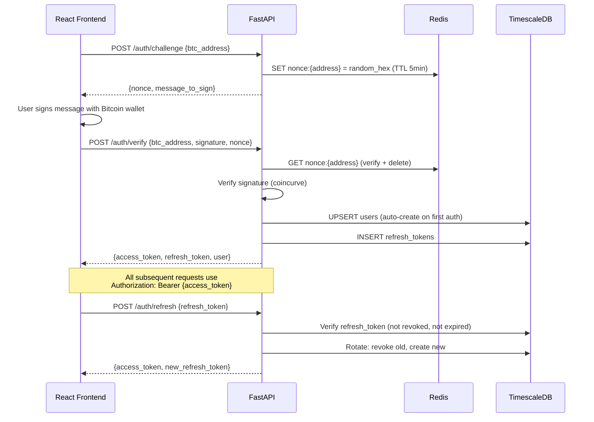
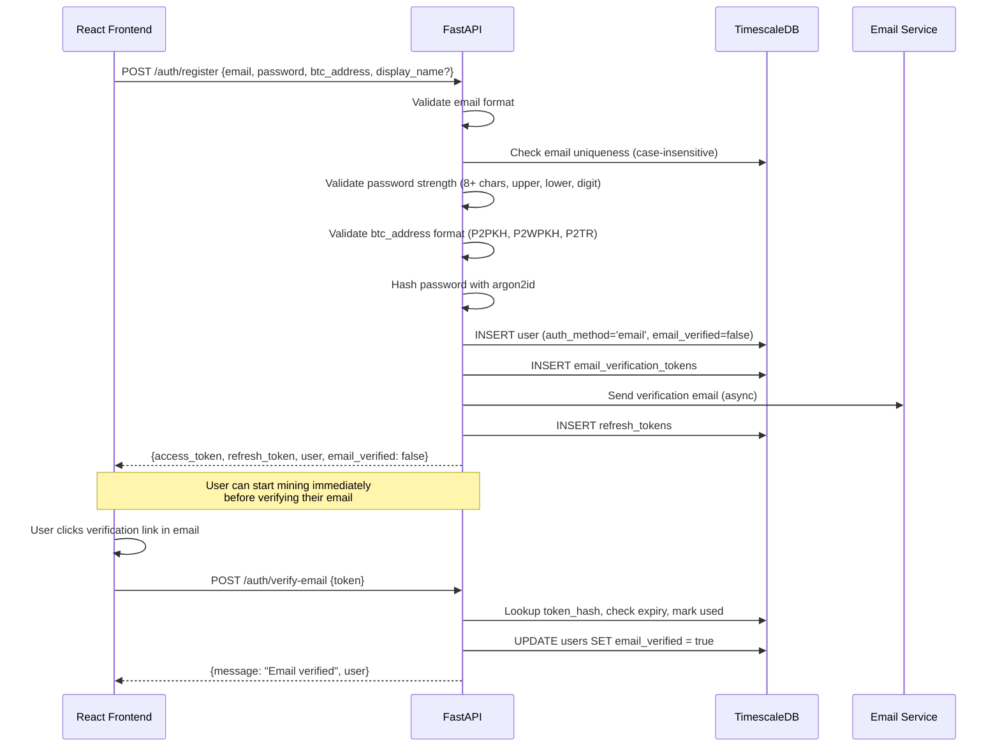
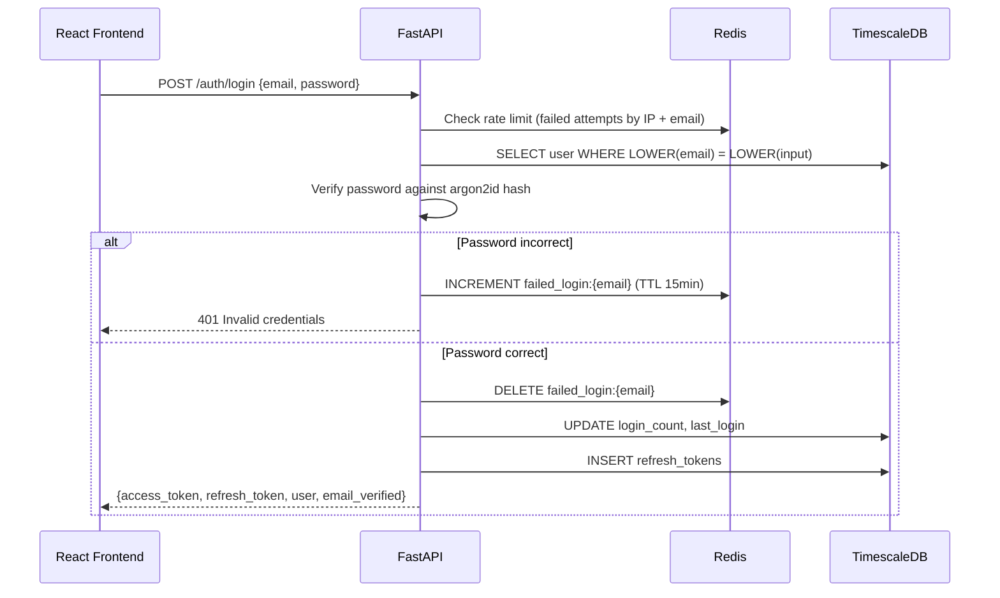
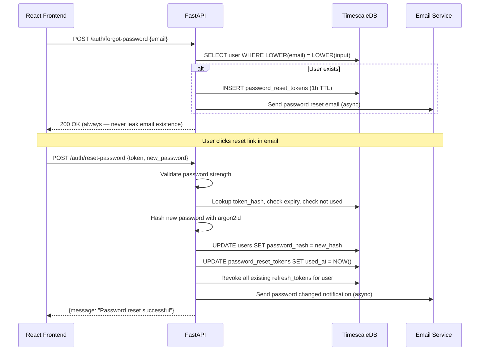
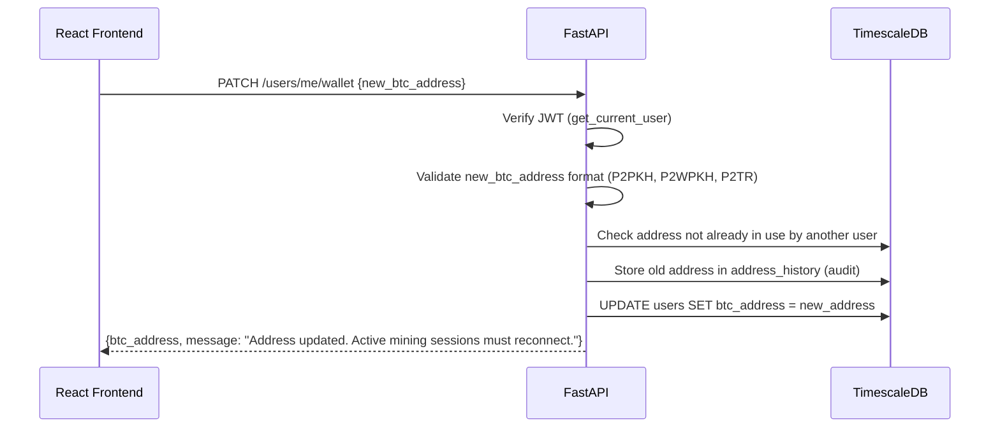
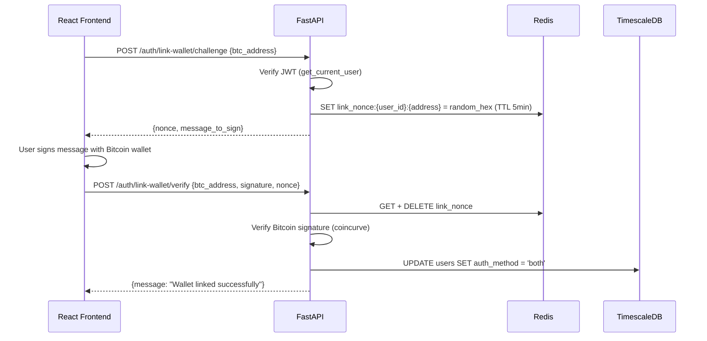

# Phase 1 -- Authentication & User Management

| Field        | Value                                         |
| ------------ | --------------------------------------------- |
| **Duration** | 4 weeks                                       |
| **Status**   | Not Started                                   |
| **Owner**    | TBD                                           |
| **Depends**  | Phase 0 -- Foundation & Scaffolding           |
| **Blocks**   | Phase 2 -- Mining Data API, Phase 9 -- Public |

---

## 1.1 Objectives

1. **Implement Bitcoin message signing authentication** using a challenge-response flow: the server issues a nonce, the client signs it with their Bitcoin private key, and the server verifies the signature using `coincurve` -- supporting P2PKH, P2WPKH (bech32), and P2TR (bech32m/taproot) addresses.
2. **Implement email + password registration and login** with argon2id password hashing, password strength validation, and secure credential storage.
3. **Implement email verification flow** -- send verification email with a unique token (24-hour TTL); users can start mining before verifying but must verify to unlock full features.
4. **Implement password forgot/reset flow** -- send password reset email with a unique token (1-hour TTL); invalidate token after single use.
5. **Require BTC wallet address on email registration** -- needed for stratum authorization and worker name identification in the mining pool.
6. **Implement wallet address management** -- users can update their BTC wallet address after account creation, with validation and active session notification.
7. **Build email service** with provider abstraction (SMTP / Resend / AWS SES), professional HTML templates branded with The Bitcoin Game dark theme and Bitcoin orange (#F7931A) accents, plain-text fallbacks, and rate limiting.
8. **Issue RS256 JWT tokens** (1-hour access tokens + 7-day refresh tokens stored in the database) with secure rotation, revocation, and `auth_method` claim distinguishing wallet vs. email authentication.
9. **Auto-create users on first wallet authentication** so there is zero friction -- no registration form, just sign a message.
10. **Build profile CRUD** with display name (case-insensitive uniqueness via normalized column), avatar URL, bio, country code, and ban status.
11. **Build settings CRUD** using JSONB storage for notification, privacy, mining, and sound preferences.
12. **Implement API key management** with argon2-hashed keys, `sk-tbg-` prefix, and per-key rate limiting.
13. **Achieve 90%+ test coverage** on the entire auth module -- unit tests, integration tests, and end-to-end flow tests for both authentication methods.

---

## 1.2 Architecture

### 1.2.1 Bitcoin Wallet Authentication Flow



### 1.2.2 Email + Password Registration Flow



### 1.2.3 Email + Password Login Flow



### 1.2.4 Forgot Password Flow



### 1.2.5 Wallet Address Update Flow



### 1.2.6 Link Wallet to Email Account Flow



---

## 1.3 Bitcoin Message Signing Verification

### 1.3.1 Core Verification Module

```python
"""
services/api/src/tbg/auth/bitcoin.py -- Bitcoin message signing verification.

Supports:
  - P2PKH (1...) -- Legacy compressed/uncompressed
  - P2WPKH (bc1q...) -- Native SegWit v0
  - P2TR (bc1p...) -- Taproot (Schnorr / BIP-340)

Uses coincurve for secp256k1 operations. No dependency on full Bitcoin node.
"""
import hashlib
import struct
from enum import Enum

from coincurve import PublicKey
from coincurve.ecdsa import deserialize_compact


class AddressType(Enum):
    P2PKH = "p2pkh"
    P2WPKH = "p2wpkh"
    P2TR = "p2tr"


def _message_hash(message: str) -> bytes:
    """
    Bitcoin message signing hash: SHA256(SHA256(prefix || message)).
    Prefix: "\\x18Bitcoin Signed Message:\\n" + varint(len(message))
    """
    prefix = b"\x18Bitcoin Signed Message:\n"
    msg_bytes = message.encode("utf-8")
    varint = _encode_varint(len(msg_bytes))
    payload = prefix + varint + msg_bytes
    return hashlib.sha256(hashlib.sha256(payload).digest()).digest()


def _encode_varint(n: int) -> bytes:
    """Encode integer as Bitcoin varint."""
    if n < 0xFD:
        return struct.pack("<B", n)
    if n <= 0xFFFF:
        return b"\xfd" + struct.pack("<H", n)
    if n <= 0xFFFFFFFF:
        return b"\xfe" + struct.pack("<I", n)
    return b"\xff" + struct.pack("<Q", n)


def _detect_address_type(address: str) -> AddressType:
    """Detect Bitcoin address type from prefix."""
    if address.startswith("1"):
        return AddressType.P2PKH
    if address.startswith("bc1q"):
        return AddressType.P2WPKH
    if address.startswith("bc1p"):
        return AddressType.P2TR
    # Testnet / signet variants
    if address.startswith("tb1q") or address.startswith("m") or address.startswith("n"):
        return AddressType.P2WPKH
    if address.startswith("tb1p"):
        return AddressType.P2TR
    msg = f"Unsupported address format: {address[:10]}..."
    raise ValueError(msg)


def validate_btc_address(address: str) -> bool:
    """
    Validate that a string is a supported Bitcoin address format.

    Returns:
        True if the address format is valid (P2PKH, P2WPKH, or P2TR).

    Raises:
        ValueError: If the address format is unsupported.
    """
    _detect_address_type(address)
    # Additional length/checksum validation
    if address.startswith("1"):
        if not (25 <= len(address) <= 34):
            msg = "Invalid P2PKH address length"
            raise ValueError(msg)
    elif address.startswith("bc1q"):
        if not (42 <= len(address) <= 62):
            msg = "Invalid P2WPKH address length"
            raise ValueError(msg)
    elif address.startswith("bc1p"):
        if len(address) != 62:
            msg = "Invalid P2TR address length"
            raise ValueError(msg)
    return True


def verify_bitcoin_signature(
    address: str,
    message: str,
    signature_base64: str,
) -> bool:
    """
    Verify a Bitcoin signed message.

    Args:
        address: Bitcoin address (P2PKH, P2WPKH, or P2TR)
        message: The original message that was signed
        signature_base64: Base64-encoded signature

    Returns:
        True if signature is valid for the given address

    Raises:
        ValueError: If address format is unsupported
    """
    import base64

    sig_bytes = base64.b64decode(signature_base64)
    msg_hash = _message_hash(message)
    addr_type = _detect_address_type(address)

    if addr_type == AddressType.P2TR:
        return _verify_schnorr(address, msg_hash, sig_bytes)
    return _verify_ecdsa(address, msg_hash, sig_bytes, addr_type)


def _verify_ecdsa(
    address: str,
    msg_hash: bytes,
    sig_bytes: bytes,
    addr_type: AddressType,
) -> bool:
    """Verify ECDSA signature (P2PKH / P2WPKH)."""
    if len(sig_bytes) != 65:
        return False

    flag = sig_bytes[0]
    if flag < 27 or flag > 34:
        return False

    compressed = flag >= 31
    recovery_id = (flag - 27) & 3

    try:
        # Recover public key from signature
        recoverable_sig = deserialize_compact(sig_bytes[1:], recovery_id)
        pubkey = PublicKey.from_signature_and_message(
            recoverable_sig, msg_hash, hasher=None
        )

        # Derive address from recovered public key
        derived = _pubkey_to_address(pubkey, addr_type, compressed)
        return derived == address
    except Exception:
        return False


def _verify_schnorr(
    address: str,
    msg_hash: bytes,
    sig_bytes: bytes,
) -> bool:
    """Verify Schnorr signature (P2TR / BIP-340)."""
    # BIP-340 Schnorr signatures are 64 bytes
    if len(sig_bytes) == 65:
        sig_bytes = sig_bytes[1:]  # Strip recovery byte if present
    if len(sig_bytes) != 64:
        return False

    try:
        from coincurve import PublicKeyXOnly
        # Extract x-only pubkey from bech32m address
        x_only_bytes = _decode_bech32m_witness(address)
        pubkey = PublicKeyXOnly(x_only_bytes)
        return pubkey.verify(sig_bytes, msg_hash)
    except Exception:
        return False


def _pubkey_to_address(
    pubkey: PublicKey,
    addr_type: AddressType,
    compressed: bool,
) -> str:
    """Derive a Bitcoin address from a public key."""
    if compressed:
        pub_bytes = pubkey.format(compressed=True)
    else:
        pub_bytes = pubkey.format(compressed=False)

    if addr_type == AddressType.P2PKH:
        return _pubkey_to_p2pkh(pub_bytes)
    if addr_type == AddressType.P2WPKH:
        return _pubkey_to_p2wpkh(pub_bytes)
    msg = f"Cannot derive address for type: {addr_type}"
    raise ValueError(msg)


def _pubkey_to_p2pkh(pub_bytes: bytes) -> str:
    """Public key -> P2PKH address (Base58Check)."""
    sha256_hash = hashlib.sha256(pub_bytes).digest()
    ripemd160 = hashlib.new("ripemd160", sha256_hash).digest()
    versioned = b"\x00" + ripemd160  # Mainnet prefix
    checksum = hashlib.sha256(hashlib.sha256(versioned).digest()).digest()[:4]
    return _base58_encode(versioned + checksum)


def _pubkey_to_p2wpkh(pub_bytes: bytes) -> str:
    """Public key -> P2WPKH bech32 address."""
    sha256_hash = hashlib.sha256(pub_bytes).digest()
    witness_hash = hashlib.new("ripemd160", sha256_hash).digest()
    from tbg.auth._bech32 import encode as bech32_encode
    return bech32_encode("bc", 0, witness_hash)


def _decode_bech32m_witness(address: str) -> bytes:
    """Decode witness program from bech32m (taproot) address."""
    from tbg.auth._bech32 import decode as bech32_decode
    _, version, witness = bech32_decode(address)
    if version != 1:
        msg = f"Expected witness version 1 (taproot), got {version}"
        raise ValueError(msg)
    return bytes(witness)


def _base58_encode(data: bytes) -> str:
    """Base58Check encoding."""
    alphabet = "123456789ABCDEFGHJKLMNPQRSTUVWXYZabcdefghijkmnopqrstuvwxyz"
    n = int.from_bytes(data, "big")
    result = ""
    while n > 0:
        n, remainder = divmod(n, 58)
        result = alphabet[remainder] + result
    # Preserve leading zeros
    for byte in data:
        if byte == 0:
            result = "1" + result
        else:
            break
    return result
```

### 1.3.2 Challenge-Response Messages

The message format follows a human-readable pattern that Bitcoin wallets display to the user:

```
Sign this message to log in to The Bitcoin Game.

Nonce: a1b2c3d4e5f6a7b8
Timestamp: 2026-03-15T14:30:00Z
Address: bc1qxy2kgdygjrsqtzq2n0yrf2493p83kkfjhx0wlh
```

---

## 1.3b Email + Password Authentication Module

### 1.3b.1 Password Hashing and Validation

```python
"""
services/api/src/tbg/auth/password.py -- Password hashing and strength validation.

Uses argon2id (winner of the Password Hashing Competition) for secure password storage.
Argon2id is resistant to both GPU-based and side-channel attacks.
"""
import re

import argon2

_hasher = argon2.PasswordHasher(
    time_cost=3,        # Number of iterations
    memory_cost=65536,  # 64 MB
    parallelism=4,      # 4 parallel threads
    hash_len=32,        # 32-byte hash output
    salt_len=16,        # 16-byte random salt
    type=argon2.Type.ID,  # argon2id variant
)


def hash_password(password: str) -> str:
    """
    Hash a password using argon2id.

    Args:
        password: The plaintext password to hash.

    Returns:
        The argon2id hash string (includes algorithm params, salt, and hash).
    """
    return _hasher.hash(password)


def verify_password(password: str, password_hash: str) -> bool:
    """
    Verify a password against its argon2id hash.

    Args:
        password: The plaintext password to verify.
        password_hash: The stored argon2id hash.

    Returns:
        True if the password matches the hash, False otherwise.
    """
    try:
        return _hasher.verify(password_hash, password)
    except argon2.exceptions.VerifyMismatchError:
        return False
    except argon2.exceptions.InvalidHashError:
        return False


def verify_and_rehash_if_needed(password: str, password_hash: str) -> tuple[bool, str | None]:
    """
    Verify a password and return a new hash if parameters have changed.

    This supports transparent upgrades when argon2 parameters are tuned.

    Args:
        password: The plaintext password.
        password_hash: The stored argon2id hash.

    Returns:
        Tuple of (is_valid, new_hash_or_none).
        If is_valid is True and new_hash is not None, the caller should
        update the stored hash.
    """
    if not verify_password(password, password_hash):
        return False, None

    if _hasher.check_needs_rehash(password_hash):
        new_hash = hash_password(password)
        return True, new_hash

    return True, None


def validate_password_strength(password: str) -> list[str]:
    """
    Validate password strength requirements.

    Requirements:
      - Minimum 8 characters
      - At least one uppercase letter (A-Z)
      - At least one lowercase letter (a-z)
      - At least one digit (0-9)

    Args:
        password: The password to validate.

    Returns:
        A list of validation error messages. Empty list means password is strong enough.
    """
    errors: list[str] = []

    if len(password) < 8:
        errors.append("Password must be at least 8 characters long")

    if not re.search(r"[A-Z]", password):
        errors.append("Password must contain at least one uppercase letter")

    if not re.search(r"[a-z]", password):
        errors.append("Password must contain at least one lowercase letter")

    if not re.search(r"\d", password):
        errors.append("Password must contain at least one digit")

    if len(password) > 128:
        errors.append("Password must not exceed 128 characters")

    return errors
```

### 1.3b.2 Pydantic Models for Email Auth

```python
"""
services/api/src/tbg/auth/models.py -- Request/response models (additions for email auth).
"""
from pydantic import BaseModel, EmailStr, Field, field_validator

from tbg.auth.bitcoin import validate_btc_address


# --- Existing wallet auth models (unchanged) ---

class ChallengeRequest(BaseModel):
    btc_address: str = Field(..., min_length=26, max_length=62)

class ChallengeResponse(BaseModel):
    nonce: str
    message: str
    expires_in: int

class VerifyRequest(BaseModel):
    btc_address: str
    signature: str
    nonce: str
    timestamp: str

class RefreshRequest(BaseModel):
    refresh_token: str

class TokenResponse(BaseModel):
    access_token: str
    refresh_token: str
    token_type: str = "bearer"
    expires_in: int = 3600
    user: dict
    email_verified: bool | None = None


# --- New email auth models ---

class RegisterRequest(BaseModel):
    """Registration request with email + password + BTC wallet address."""
    email: EmailStr
    password: str = Field(..., min_length=8, max_length=128)
    btc_address: str = Field(..., min_length=26, max_length=62)
    display_name: str | None = Field(None, min_length=3, max_length=32)

    @field_validator("btc_address")
    @classmethod
    def validate_address(cls, v: str) -> str:
        validate_btc_address(v)
        return v


class LoginRequest(BaseModel):
    """Login request with email + password."""
    email: EmailStr
    password: str = Field(..., min_length=1, max_length=128)


class ForgotPasswordRequest(BaseModel):
    """Request a password reset email."""
    email: EmailStr


class ResetPasswordRequest(BaseModel):
    """Reset password with a valid token."""
    token: str = Field(..., min_length=32, max_length=128)
    new_password: str = Field(..., min_length=8, max_length=128)


class VerifyEmailRequest(BaseModel):
    """Verify email address with a token."""
    token: str = Field(..., min_length=32, max_length=128)


class ResendVerificationRequest(BaseModel):
    """Resend verification email."""
    email: EmailStr


class ChangePasswordRequest(BaseModel):
    """Change password (authenticated)."""
    current_password: str = Field(..., min_length=1, max_length=128)
    new_password: str = Field(..., min_length=8, max_length=128)


class WalletUpdateRequest(BaseModel):
    """Update BTC wallet address."""
    btc_address: str = Field(..., min_length=26, max_length=62)

    @field_validator("btc_address")
    @classmethod
    def validate_address(cls, v: str) -> str:
        validate_btc_address(v)
        return v


class LinkWalletChallengeRequest(BaseModel):
    """Request a challenge to link a wallet to an email account."""
    btc_address: str = Field(..., min_length=26, max_length=62)

    @field_validator("btc_address")
    @classmethod
    def validate_address(cls, v: str) -> str:
        validate_btc_address(v)
        return v


class LinkWalletVerifyRequest(BaseModel):
    """Verify wallet signature to complete linking."""
    btc_address: str
    signature: str
    nonce: str
```

---

## 1.3c Email Service

### 1.3c.1 Email Service Core

```python
"""
services/api/src/tbg/email/service.py -- Email service with provider abstraction.

Supports SMTP, Resend API, and AWS SES. Provider is selected via configuration.
All email sends are async and non-blocking to the request path.
"""
from __future__ import annotations

import asyncio
import hashlib
import secrets
import ssl
from abc import ABC, abstractmethod
from datetime import datetime, timezone
from email.mime.multipart import MIMEMultipart
from email.mime.text import MIMEText
from typing import TYPE_CHECKING

import aiosmtplib
import structlog

from tbg.config import get_settings
from tbg.email.templates import (
    render_password_changed,
    render_password_reset,
    render_verification,
    render_welcome,
)

if TYPE_CHECKING:
    from redis.asyncio import Redis

logger = structlog.get_logger()


class EmailProvider(ABC):
    """Abstract base class for email delivery providers."""

    @abstractmethod
    async def send(
        self,
        to_email: str,
        subject: str,
        html_body: str,
        text_body: str,
    ) -> bool:
        """
        Send an email.

        Args:
            to_email: Recipient email address.
            subject: Email subject line.
            html_body: HTML version of the email body.
            text_body: Plain-text fallback of the email body.

        Returns:
            True if the email was sent successfully.
        """
        ...


class SMTPProvider(EmailProvider):
    """Send emails via SMTP (e.g., Mailgun, Postmark, or self-hosted)."""

    def __init__(
        self,
        host: str,
        port: int,
        username: str,
        password: str,
        from_address: str,
        from_name: str,
        use_tls: bool = True,
    ) -> None:
        self.host = host
        self.port = port
        self.username = username
        self.password = password
        self.from_address = from_address
        self.from_name = from_name
        self.use_tls = use_tls

    async def send(
        self,
        to_email: str,
        subject: str,
        html_body: str,
        text_body: str,
    ) -> bool:
        msg = MIMEMultipart("alternative")
        msg["From"] = f"{self.from_name} <{self.from_address}>"
        msg["To"] = to_email
        msg["Subject"] = subject
        msg.attach(MIMEText(text_body, "plain", "utf-8"))
        msg.attach(MIMEText(html_body, "html", "utf-8"))

        try:
            tls_context = ssl.create_default_context() if self.use_tls else None
            await aiosmtplib.send(
                msg,
                hostname=self.host,
                port=self.port,
                username=self.username,
                password=self.password,
                start_tls=self.use_tls,
                tls_context=tls_context,
            )
            logger.info("email_sent", to=to_email, subject=subject, provider="smtp")
            return True
        except Exception:
            logger.exception("email_send_failed", to=to_email, provider="smtp")
            return False


class ResendProvider(EmailProvider):
    """Send emails via Resend API (https://resend.com)."""

    def __init__(
        self,
        api_key: str,
        from_address: str,
        from_name: str,
    ) -> None:
        self.api_key = api_key
        self.from_address = from_address
        self.from_name = from_name

    async def send(
        self,
        to_email: str,
        subject: str,
        html_body: str,
        text_body: str,
    ) -> bool:
        import httpx

        try:
            async with httpx.AsyncClient() as client:
                response = await client.post(
                    "https://api.resend.com/emails",
                    headers={
                        "Authorization": f"Bearer {self.api_key}",
                        "Content-Type": "application/json",
                    },
                    json={
                        "from": f"{self.from_name} <{self.from_address}>",
                        "to": [to_email],
                        "subject": subject,
                        "html": html_body,
                        "text": text_body,
                    },
                    timeout=10.0,
                )
                response.raise_for_status()
                logger.info("email_sent", to=to_email, subject=subject, provider="resend")
                return True
        except Exception:
            logger.exception("email_send_failed", to=to_email, provider="resend")
            return False


class SESProvider(EmailProvider):
    """Send emails via AWS SES (Simple Email Service)."""

    def __init__(
        self,
        region: str,
        from_address: str,
        from_name: str,
    ) -> None:
        self.region = region
        self.from_address = from_address
        self.from_name = from_name

    async def send(
        self,
        to_email: str,
        subject: str,
        html_body: str,
        text_body: str,
    ) -> bool:
        import aioboto3

        try:
            session = aioboto3.Session()
            async with session.client("ses", region_name=self.region) as ses:
                await ses.send_email(
                    Source=f"{self.from_name} <{self.from_address}>",
                    Destination={"ToAddresses": [to_email]},
                    Message={
                        "Subject": {"Data": subject, "Charset": "UTF-8"},
                        "Body": {
                            "Text": {"Data": text_body, "Charset": "UTF-8"},
                            "Html": {"Data": html_body, "Charset": "UTF-8"},
                        },
                    },
                )
                logger.info("email_sent", to=to_email, subject=subject, provider="ses")
                return True
        except Exception:
            logger.exception("email_send_failed", to=to_email, provider="ses")
            return False


def _create_provider() -> EmailProvider:
    """Create an email provider based on configuration."""
    settings = get_settings()
    provider_name = settings.email_provider.lower()

    if provider_name == "smtp":
        return SMTPProvider(
            host=settings.email_smtp_host,
            port=settings.email_smtp_port,
            username=settings.email_smtp_user,
            password=settings.email_smtp_password,
            from_address=settings.email_from_address,
            from_name=settings.email_from_name,
            use_tls=settings.email_smtp_use_tls,
        )
    if provider_name == "resend":
        return ResendProvider(
            api_key=settings.resend_api_key,
            from_address=settings.email_from_address,
            from_name=settings.email_from_name,
        )
    if provider_name == "ses":
        return SESProvider(
            region=settings.aws_ses_region,
            from_address=settings.email_from_address,
            from_name=settings.email_from_name,
        )
    msg = f"Unsupported email provider: {provider_name}"
    raise ValueError(msg)


class EmailService:
    """
    High-level email service for The Bitcoin Game.

    Handles token generation, rate limiting, and template rendering.
    All public methods are safe to call from request handlers -- sends
    are dispatched asynchronously.
    """

    def __init__(self, provider: EmailProvider | None = None, redis: Redis | None = None) -> None:
        self._provider = provider or _create_provider()
        self._redis = redis

    # -- Rate limiting --

    RATE_LIMIT_MAX = 5       # Max emails per address per window
    RATE_LIMIT_WINDOW = 3600  # 1 hour in seconds

    async def _check_rate_limit(self, email: str) -> bool:
        """
        Check if we can send another email to this address.

        Returns:
            True if under the rate limit, False if limit exceeded.
        """
        if self._redis is None:
            return True  # No Redis = no rate limiting (dev mode)

        key = f"email_rate:{hashlib.sha256(email.lower().encode()).hexdigest()}"
        count = await self._redis.incr(key)
        if count == 1:
            await self._redis.expire(key, self.RATE_LIMIT_WINDOW)
        return count <= self.RATE_LIMIT_MAX

    # -- Token generation --

    @staticmethod
    def generate_token() -> tuple[str, str]:
        """
        Generate a secure random token and its SHA-256 hash.

        Returns:
            (raw_token, token_hash) -- raw_token is sent in the email URL,
            token_hash is stored in the database.
        """
        raw_token = secrets.token_urlsafe(48)
        token_hash = hashlib.sha256(raw_token.encode()).hexdigest()
        return raw_token, token_hash

    @staticmethod
    def hash_token(raw_token: str) -> str:
        """Hash a raw token for database lookup."""
        return hashlib.sha256(raw_token.encode()).hexdigest()

    # -- Email sending methods --

    async def send_verification_email(
        self,
        email: str,
        token: str,
        display_name: str | None = None,
    ) -> bool:
        """
        Send an email verification link.

        Args:
            email: Recipient email address.
            token: The raw (unhashed) verification token.
            display_name: User's display name for personalization.

        Returns:
            True if the email was dispatched successfully.
        """
        if not await self._check_rate_limit(email):
            logger.warning("email_rate_limited", email=email, type="verification")
            return False

        settings = get_settings()
        verification_url = f"{settings.frontend_url}/auth/verify-email?token={token}"
        name = display_name or "Miner"

        html_body = render_verification(
            display_name=name,
            verification_url=verification_url,
            app_name=settings.email_from_name,
        )
        text_body = (
            f"Hi {name},\n\n"
            f"Welcome to The Bitcoin Game! Please verify your email address "
            f"by visiting this link:\n\n{verification_url}\n\n"
            f"This link expires in 24 hours.\n\n"
            f"If you did not create an account, please ignore this email.\n\n"
            f"-- The Bitcoin Game Team"
        )

        return await self._provider.send(
            to_email=email,
            subject="Verify your email -- The Bitcoin Game",
            html_body=html_body,
            text_body=text_body,
        )

    async def send_password_reset_email(
        self,
        email: str,
        token: str,
        display_name: str | None = None,
    ) -> bool:
        """
        Send a password reset link.

        Args:
            email: Recipient email address.
            token: The raw (unhashed) reset token.
            display_name: User's display name for personalization.

        Returns:
            True if the email was dispatched successfully.
        """
        if not await self._check_rate_limit(email):
            logger.warning("email_rate_limited", email=email, type="password_reset")
            return False

        settings = get_settings()
        reset_url = f"{settings.frontend_url}/auth/reset-password?token={token}"
        name = display_name or "Miner"

        html_body = render_password_reset(
            display_name=name,
            reset_url=reset_url,
            app_name=settings.email_from_name,
        )
        text_body = (
            f"Hi {name},\n\n"
            f"We received a request to reset your password for The Bitcoin Game.\n\n"
            f"Click this link to set a new password:\n\n{reset_url}\n\n"
            f"This link expires in 1 hour.\n\n"
            f"If you did not request a password reset, please ignore this email. "
            f"Your password will remain unchanged.\n\n"
            f"-- The Bitcoin Game Team"
        )

        return await self._provider.send(
            to_email=email,
            subject="Reset your password -- The Bitcoin Game",
            html_body=html_body,
            text_body=text_body,
        )

    async def send_password_changed_notification(
        self,
        email: str,
        display_name: str | None = None,
    ) -> bool:
        """
        Send a notification that the user's password was changed.

        This is a security notification -- not rate-limited.

        Args:
            email: Recipient email address.
            display_name: User's display name for personalization.

        Returns:
            True if the email was dispatched successfully.
        """
        settings = get_settings()
        name = display_name or "Miner"

        html_body = render_password_changed(
            display_name=name,
            app_name=settings.email_from_name,
            support_email=settings.support_email,
        )
        text_body = (
            f"Hi {name},\n\n"
            f"Your password for The Bitcoin Game was successfully changed.\n\n"
            f"If you did not make this change, please contact support immediately "
            f"at {settings.support_email}.\n\n"
            f"-- The Bitcoin Game Team"
        )

        return await self._provider.send(
            to_email=email,
            subject="Password changed -- The Bitcoin Game",
            html_body=html_body,
            text_body=text_body,
        )

    async def send_welcome_email(
        self,
        email: str,
        display_name: str | None = None,
    ) -> bool:
        """
        Send a welcome email after successful email verification.

        Args:
            email: Recipient email address.
            display_name: User's display name for personalization.

        Returns:
            True if the email was dispatched successfully.
        """
        if not await self._check_rate_limit(email):
            logger.warning("email_rate_limited", email=email, type="welcome")
            return False

        settings = get_settings()
        name = display_name or "Miner"

        html_body = render_welcome(
            display_name=name,
            app_name=settings.email_from_name,
            dashboard_url=f"{settings.frontend_url}/dashboard",
        )
        text_body = (
            f"Hi {name},\n\n"
            f"Your email has been verified. Welcome to The Bitcoin Game!\n\n"
            f"You're all set to start mining, competing, and earning badges.\n\n"
            f"Head to your dashboard to get started: "
            f"{settings.frontend_url}/dashboard\n\n"
            f"Happy mining!\n\n"
            f"-- The Bitcoin Game Team"
        )

        return await self._provider.send(
            to_email=email,
            subject="Welcome to The Bitcoin Game!",
            html_body=html_body,
            text_body=text_body,
        )
```

### 1.3c.2 Email Templates

```python
"""
services/api/src/tbg/email/templates.py -- Professional HTML email templates.

All templates use inline CSS for maximum email client compatibility.
Branded with The Bitcoin Game dark theme and Bitcoin orange (#F7931A) accents.

Each template function returns an HTML string. Plain-text fallbacks are
handled by the EmailService caller.
"""

# -- Color constants --
BG_DARK = "#06080C"
BG_CARD = "#0D1117"
BG_SURFACE = "#161B22"
ORANGE = "#F7931A"
TEXT_PRIMARY = "#F0F6FC"
TEXT_SECONDARY = "#8B949E"
BORDER = "#21262D"


def _base_layout(content: str, app_name: str) -> str:
    """Wrap content in the base email layout."""
    return f"""\
<!DOCTYPE html>
<html lang="en">
<head>
    <meta charset="UTF-8">
    <meta name="viewport" content="width=device-width, initial-scale=1.0">
    <title>{app_name}</title>
</head>
<body style="margin: 0; padding: 0; background-color: {BG_DARK}; font-family: -apple-system, BlinkMacSystemFont, 'Segoe UI', Roboto, Oxygen, Ubuntu, Cantarell, sans-serif;">
    <table role="presentation" cellspacing="0" cellpadding="0" border="0" width="100%" style="background-color: {BG_DARK};">
        <tr>
            <td align="center" style="padding: 40px 20px;">
                <table role="presentation" cellspacing="0" cellpadding="0" border="0" width="600" style="max-width: 600px; width: 100%;">
                    <!-- Header -->
                    <tr>
                        <td align="center" style="padding-bottom: 32px;">
                            <span style="font-size: 28px; font-weight: 700; color: {ORANGE};">&#x20BF;</span>
                            <span style="font-size: 22px; font-weight: 700; color: {TEXT_PRIMARY}; margin-left: 8px;">{app_name}</span>
                        </td>
                    </tr>
                    <!-- Content Card -->
                    <tr>
                        <td style="background-color: {BG_CARD}; border: 1px solid {BORDER}; border-radius: 12px; padding: 40px 32px;">
                            {content}
                        </td>
                    </tr>
                    <!-- Footer -->
                    <tr>
                        <td align="center" style="padding-top: 32px;">
                            <p style="color: {TEXT_SECONDARY}; font-size: 12px; line-height: 1.5; margin: 0;">
                                This email was sent by {app_name}.<br>
                                If you didn't expect this email, you can safely ignore it.
                            </p>
                        </td>
                    </tr>
                </table>
            </td>
        </tr>
    </table>
</body>
</html>"""


def _button(url: str, label: str) -> str:
    """Render an orange CTA button."""
    return f"""\
<table role="presentation" cellspacing="0" cellpadding="0" border="0" style="margin: 28px auto;">
    <tr>
        <td align="center" style="background-color: {ORANGE}; border-radius: 8px;">
            <a href="{url}" target="_blank" style="display: inline-block; padding: 14px 32px; color: #FFFFFF; font-size: 16px; font-weight: 600; text-decoration: none; border-radius: 8px;">
                {label}
            </a>
        </td>
    </tr>
</table>"""


def render_verification(
    display_name: str,
    verification_url: str,
    app_name: str,
) -> str:
    """Render the email verification template."""
    content = f"""\
<h1 style="color: {TEXT_PRIMARY}; font-size: 24px; font-weight: 700; margin: 0 0 16px 0;">Verify your email</h1>
<p style="color: {TEXT_SECONDARY}; font-size: 16px; line-height: 1.6; margin: 0 0 8px 0;">Hi {display_name},</p>
<p style="color: {TEXT_SECONDARY}; font-size: 16px; line-height: 1.6; margin: 0 0 24px 0;">
    Welcome to {app_name}! Click the button below to verify your email address
    and unlock the full mining experience.
</p>
{_button(verification_url, "Verify Email Address")}
<p style="color: {TEXT_SECONDARY}; font-size: 13px; line-height: 1.5; margin: 24px 0 0 0;">
    This link expires in <strong style="color: {TEXT_PRIMARY};">24 hours</strong>. If you didn't create an account, ignore this email.
</p>
<hr style="border: none; border-top: 1px solid {BORDER}; margin: 24px 0;">
<p style="color: {TEXT_SECONDARY}; font-size: 12px; line-height: 1.5; margin: 0;">
    If the button doesn't work, copy and paste this URL into your browser:<br>
    <a href="{verification_url}" style="color: {ORANGE}; word-break: break-all;">{verification_url}</a>
</p>"""
    return _base_layout(content, app_name)


def render_password_reset(
    display_name: str,
    reset_url: str,
    app_name: str,
) -> str:
    """Render the password reset email template."""
    content = f"""\
<h1 style="color: {TEXT_PRIMARY}; font-size: 24px; font-weight: 700; margin: 0 0 16px 0;">Reset your password</h1>
<p style="color: {TEXT_SECONDARY}; font-size: 16px; line-height: 1.6; margin: 0 0 8px 0;">Hi {display_name},</p>
<p style="color: {TEXT_SECONDARY}; font-size: 16px; line-height: 1.6; margin: 0 0 24px 0;">
    We received a request to reset your password for {app_name}.
    Click the button below to choose a new password.
</p>
{_button(reset_url, "Reset Password")}
<p style="color: {TEXT_SECONDARY}; font-size: 13px; line-height: 1.5; margin: 24px 0 0 0;">
    This link expires in <strong style="color: {TEXT_PRIMARY};">1 hour</strong>.
    If you didn't request this, your password will remain unchanged.
</p>
<hr style="border: none; border-top: 1px solid {BORDER}; margin: 24px 0;">
<p style="color: {TEXT_SECONDARY}; font-size: 12px; line-height: 1.5; margin: 0;">
    If the button doesn't work, copy and paste this URL into your browser:<br>
    <a href="{reset_url}" style="color: {ORANGE}; word-break: break-all;">{reset_url}</a>
</p>"""
    return _base_layout(content, app_name)


def render_password_changed(
    display_name: str,
    app_name: str,
    support_email: str,
) -> str:
    """Render the password changed notification template."""
    content = f"""\
<h1 style="color: {TEXT_PRIMARY}; font-size: 24px; font-weight: 700; margin: 0 0 16px 0;">Password changed</h1>
<p style="color: {TEXT_SECONDARY}; font-size: 16px; line-height: 1.6; margin: 0 0 8px 0;">Hi {display_name},</p>
<p style="color: {TEXT_SECONDARY}; font-size: 16px; line-height: 1.6; margin: 0 0 24px 0;">
    Your password for {app_name} was successfully changed.
</p>
<div style="background-color: {BG_SURFACE}; border: 1px solid {BORDER}; border-radius: 8px; padding: 16px; margin: 24px 0;">
    <p style="color: {ORANGE}; font-size: 14px; font-weight: 600; margin: 0 0 8px 0;">
        Didn't make this change?
    </p>
    <p style="color: {TEXT_SECONDARY}; font-size: 14px; line-height: 1.5; margin: 0;">
        If you didn't change your password, your account may be compromised.
        Contact support immediately at
        <a href="mailto:{support_email}" style="color: {ORANGE};">{support_email}</a>.
    </p>
</div>"""
    return _base_layout(content, app_name)


def render_welcome(
    display_name: str,
    app_name: str,
    dashboard_url: str,
) -> str:
    """Render the welcome email template (sent after verification)."""
    content = f"""\
<h1 style="color: {TEXT_PRIMARY}; font-size: 24px; font-weight: 700; margin: 0 0 16px 0;">Welcome to {app_name}!</h1>
<p style="color: {TEXT_SECONDARY}; font-size: 16px; line-height: 1.6; margin: 0 0 8px 0;">Hi {display_name},</p>
<p style="color: {TEXT_SECONDARY}; font-size: 16px; line-height: 1.6; margin: 0 0 24px 0;">
    Your email has been verified. You're all set to mine, compete, and earn badges.
</p>
<div style="background-color: {BG_SURFACE}; border: 1px solid {BORDER}; border-radius: 8px; padding: 20px; margin: 0 0 24px 0;">
    <table role="presentation" cellspacing="0" cellpadding="0" border="0" width="100%">
        <tr>
            <td style="padding: 8px 0;">
                <span style="color: {ORANGE}; font-size: 18px;">&#x26CF;</span>
                <span style="color: {TEXT_PRIMARY}; font-size: 14px; margin-left: 8px;">Connect your miner and start earning shares</span>
            </td>
        </tr>
        <tr>
            <td style="padding: 8px 0;">
                <span style="color: {ORANGE}; font-size: 18px;">&#x1F3C6;</span>
                <span style="color: {TEXT_PRIMARY}; font-size: 14px; margin-left: 8px;">Compete on leaderboards and in leagues</span>
            </td>
        </tr>
        <tr>
            <td style="padding: 8px 0;">
                <span style="color: {ORANGE}; font-size: 18px;">&#x1F396;</span>
                <span style="color: {TEXT_PRIMARY}; font-size: 14px; margin-left: 8px;">Earn badges and build your mining streak</span>
            </td>
        </tr>
    </table>
</div>
{_button(dashboard_url, "Go to Dashboard")}"""
    return _base_layout(content, app_name)
```

### 1.3c.3 Email Configuration

```python
"""
services/api/src/tbg/config.py -- Settings additions for email service.

Add these fields to the existing Settings(BaseSettings) class.
"""
from pydantic_settings import BaseSettings


class Settings(BaseSettings):
    # ... existing settings ...

    # -- Email Service --
    email_provider: str = "smtp"  # "smtp" | "resend" | "ses"

    # SMTP settings
    email_smtp_host: str = "smtp.mailgun.org"
    email_smtp_port: int = 587
    email_smtp_user: str = ""
    email_smtp_password: str = ""
    email_smtp_use_tls: bool = True

    # Common email settings
    email_from_address: str = "noreply@thebitcoingame.com"
    email_from_name: str = "The Bitcoin Game"
    support_email: str = "support@thebitcoingame.com"

    # Resend settings (if using Resend provider)
    resend_api_key: str = ""

    # AWS SES settings (if using SES provider)
    aws_ses_region: str = "us-east-1"

    # Frontend URL for email links
    frontend_url: str = "https://thebitcoingame.com"

    # -- Account Security --
    max_failed_login_attempts: int = 10
    failed_login_lockout_minutes: int = 15

    class Config:
        env_prefix = "TBG_"
        env_file = ".env"
```

---

## 1.4 JWT Token Management

### 1.4.1 JWT Module

```python
"""
services/api/src/tbg/auth/jwt.py -- RS256 JWT token management.

Tokens include an `auth_method` claim to distinguish between wallet-authenticated
and email-authenticated sessions. This allows downstream services (e.g., stratum
proxy) to apply method-specific logic.
"""
import time
from datetime import datetime, timedelta, timezone
from pathlib import Path
from typing import Literal

import jwt

from tbg.config import get_settings


# Load RSA keys at module level
_private_key: str | None = None
_public_key: str | None = None


def _load_keys() -> tuple[str, str]:
    global _private_key, _public_key
    if _private_key is None:
        settings = get_settings()
        _private_key = Path(settings.jwt_private_key_path).read_text()
        _public_key = Path(settings.jwt_public_key_path).read_text()
    return _private_key, _public_key


def create_access_token(
    user_id: int,
    btc_address: str,
    auth_method: Literal["wallet", "email"] = "wallet",
) -> str:
    """
    Create a short-lived access token (1 hour).

    Args:
        user_id: The user's database ID.
        btc_address: The user's BTC wallet address.
        auth_method: How the user authenticated ("wallet" or "email").

    Returns:
        Encoded JWT string.
    """
    private_key, _ = _load_keys()
    now = datetime.now(timezone.utc)
    payload = {
        "sub": str(user_id),
        "address": btc_address,
        "auth_method": auth_method,
        "iat": now,
        "exp": now + timedelta(hours=1),
        "type": "access",
    }
    return jwt.encode(payload, private_key, algorithm="RS256")


def create_refresh_token(
    user_id: int,
    btc_address: str,
    token_id: str,
    auth_method: Literal["wallet", "email"] = "wallet",
) -> str:
    """
    Create a long-lived refresh token (7 days).

    Args:
        user_id: The user's database ID.
        btc_address: The user's BTC wallet address.
        token_id: Unique token identifier (JTI) for revocation tracking.
        auth_method: How the user authenticated ("wallet" or "email").

    Returns:
        Encoded JWT string.
    """
    private_key, _ = _load_keys()
    now = datetime.now(timezone.utc)
    payload = {
        "sub": str(user_id),
        "address": btc_address,
        "auth_method": auth_method,
        "jti": token_id,
        "iat": now,
        "exp": now + timedelta(days=7),
        "type": "refresh",
    }
    return jwt.encode(payload, private_key, algorithm="RS256")


def verify_token(token: str, expected_type: str = "access") -> dict:
    """
    Verify and decode a JWT token.

    Args:
        token: The JWT string to verify.
        expected_type: Expected token type ("access" or "refresh").

    Returns:
        The decoded payload dictionary.

    Raises:
        jwt.ExpiredSignatureError: Token has expired.
        jwt.InvalidTokenError: Token is invalid or type mismatch.
    """
    _, public_key = _load_keys()
    payload = jwt.decode(token, public_key, algorithms=["RS256"])
    if payload.get("type") != expected_type:
        msg = f"Expected token type '{expected_type}', got '{payload.get('type')}'"
        raise jwt.InvalidTokenError(msg)
    return payload
```

### 1.4.2 Token Payload Structure

| Field | Type | Description |
|---|---|---|
| `sub` | `str` | User ID (numeric string) |
| `address` | `str` | BTC wallet address |
| `auth_method` | `str` | `"wallet"` or `"email"` |
| `iat` | `datetime` | Issued-at timestamp |
| `exp` | `datetime` | Expiration timestamp |
| `type` | `str` | `"access"` or `"refresh"` |
| `jti` | `str` | Token ID (refresh tokens only) |

### 1.4.3 Auth Dependencies

```python
"""
services/api/src/tbg/auth/dependencies.py -- FastAPI auth dependencies.
"""
from fastapi import Depends, HTTPException, Security
from fastapi.security import HTTPAuthorizationCredentials, HTTPBearer
from sqlalchemy.ext.asyncio import AsyncSession

from tbg.auth.jwt import verify_token
from tbg.database import get_session
from tbg.users.service import get_user_by_id

security = HTTPBearer()


async def get_current_user(
    credentials: HTTPAuthorizationCredentials = Security(security),
    db: AsyncSession = Depends(get_session),
):
    """Extract and verify the current user from JWT token."""
    try:
        payload = verify_token(credentials.credentials, expected_type="access")
    except Exception as e:
        raise HTTPException(status_code=401, detail=f"Invalid token: {e}") from e

    user_id = int(payload["sub"])
    user = await get_user_by_id(db, user_id)
    if user is None:
        raise HTTPException(status_code=401, detail="User not found")
    if user.is_banned:
        raise HTTPException(status_code=403, detail="Account is banned")
    return user


async def require_auth(user=Depends(get_current_user)):
    """Convenience dependency -- just requires a valid user."""
    return user
```

---

## 1.5 Database Schema

### 1.5.1 User Table Modifications

```sql
-- Alembic migration: 002_auth_tables.py

-- Add columns to existing users table (both wallet and email auth fields)
ALTER TABLE users
    ADD COLUMN IF NOT EXISTS email VARCHAR(255),
    ADD COLUMN IF NOT EXISTS email_verified BOOLEAN DEFAULT FALSE,
    ADD COLUMN IF NOT EXISTS password_hash VARCHAR(256),          -- argon2id hash; NULL for wallet-only users
    ADD COLUMN IF NOT EXISTS auth_method VARCHAR(16) DEFAULT 'wallet',  -- 'wallet', 'email', 'both'
    ADD COLUMN IF NOT EXISTS display_name_normalized VARCHAR(64),
    ADD COLUMN IF NOT EXISTS avatar_url TEXT,
    ADD COLUMN IF NOT EXISTS bio VARCHAR(280),
    ADD COLUMN IF NOT EXISTS is_banned BOOLEAN DEFAULT FALSE,
    ADD COLUMN IF NOT EXISTS last_login TIMESTAMPTZ,
    ADD COLUMN IF NOT EXISTS login_count INTEGER DEFAULT 0;

-- Case-insensitive email uniqueness (partial index: only non-null emails)
CREATE UNIQUE INDEX IF NOT EXISTS idx_users_email
    ON users(LOWER(email)) WHERE email IS NOT NULL;

-- Case-insensitive display name uniqueness
CREATE UNIQUE INDEX IF NOT EXISTS idx_users_display_name_normalized
    ON users(display_name_normalized)
    WHERE display_name_normalized IS NOT NULL;

-- Update display_name_normalized trigger
CREATE OR REPLACE FUNCTION update_display_name_normalized()
RETURNS TRIGGER AS $$
BEGIN
    IF NEW.display_name IS NOT NULL THEN
        NEW.display_name_normalized := LOWER(TRIM(NEW.display_name));
    ELSE
        NEW.display_name_normalized := NULL;
    END IF;
    RETURN NEW;
END;
$$ LANGUAGE plpgsql;

CREATE OR REPLACE TRIGGER trg_users_display_name
    BEFORE INSERT OR UPDATE OF display_name ON users
    FOR EACH ROW EXECUTE FUNCTION update_display_name_normalized();

-- Validate auth_method values
ALTER TABLE users
    ADD CONSTRAINT chk_auth_method
    CHECK (auth_method IN ('wallet', 'email', 'both'));

-- Email users must have password_hash; wallet users must not
-- (enforced in application layer for flexibility with 'both')
```

### 1.5.2 Refresh Tokens Table

```sql
CREATE TABLE IF NOT EXISTS refresh_tokens (
    id              UUID PRIMARY KEY DEFAULT gen_random_uuid(),
    user_id         BIGINT NOT NULL REFERENCES users(id) ON DELETE CASCADE,
    token_hash      VARCHAR(128) NOT NULL,
    issued_at       TIMESTAMPTZ NOT NULL DEFAULT NOW(),
    expires_at      TIMESTAMPTZ NOT NULL,
    revoked_at      TIMESTAMPTZ,
    ip_address      INET,
    user_agent      VARCHAR(512),
    is_revoked      BOOLEAN DEFAULT FALSE,
    replaced_by     UUID REFERENCES refresh_tokens(id)
);

CREATE INDEX IF NOT EXISTS idx_refresh_tokens_user ON refresh_tokens(user_id, is_revoked);
CREATE INDEX IF NOT EXISTS idx_refresh_tokens_expires ON refresh_tokens(expires_at) WHERE NOT is_revoked;
```

### 1.5.3 Email Verification Tokens Table

```sql
CREATE TABLE IF NOT EXISTS email_verification_tokens (
    id              UUID PRIMARY KEY DEFAULT gen_random_uuid(),
    user_id         BIGINT NOT NULL REFERENCES users(id) ON DELETE CASCADE,
    token_hash      VARCHAR(128) NOT NULL,          -- SHA-256 hash of the raw token
    expires_at      TIMESTAMPTZ NOT NULL,            -- NOW() + INTERVAL '24 hours'
    used_at         TIMESTAMPTZ,                     -- Set when token is consumed
    created_at      TIMESTAMPTZ NOT NULL DEFAULT NOW()
);

CREATE INDEX IF NOT EXISTS idx_email_verification_user
    ON email_verification_tokens(user_id)
    WHERE used_at IS NULL;

CREATE INDEX IF NOT EXISTS idx_email_verification_hash
    ON email_verification_tokens(token_hash)
    WHERE used_at IS NULL;
```

### 1.5.4 Password Reset Tokens Table

```sql
CREATE TABLE IF NOT EXISTS password_reset_tokens (
    id              UUID PRIMARY KEY DEFAULT gen_random_uuid(),
    user_id         BIGINT NOT NULL REFERENCES users(id) ON DELETE CASCADE,
    token_hash      VARCHAR(128) NOT NULL,          -- SHA-256 hash of the raw token
    expires_at      TIMESTAMPTZ NOT NULL,            -- NOW() + INTERVAL '1 hour'
    used_at         TIMESTAMPTZ,                     -- Set when token is consumed
    ip_address      INET,                            -- IP that requested the reset
    created_at      TIMESTAMPTZ NOT NULL DEFAULT NOW()
);

CREATE INDEX IF NOT EXISTS idx_password_reset_user
    ON password_reset_tokens(user_id)
    WHERE used_at IS NULL;

CREATE INDEX IF NOT EXISTS idx_password_reset_hash
    ON password_reset_tokens(token_hash)
    WHERE used_at IS NULL;
```

### 1.5.5 Wallet Address History Table

```sql
-- Audit trail for wallet address changes
CREATE TABLE IF NOT EXISTS wallet_address_history (
    id              UUID PRIMARY KEY DEFAULT gen_random_uuid(),
    user_id         BIGINT NOT NULL REFERENCES users(id) ON DELETE CASCADE,
    old_address     VARCHAR(62) NOT NULL,
    new_address     VARCHAR(62) NOT NULL,
    changed_at      TIMESTAMPTZ NOT NULL DEFAULT NOW(),
    ip_address      INET
);

CREATE INDEX IF NOT EXISTS idx_wallet_history_user
    ON wallet_address_history(user_id);
```

### 1.5.6 API Keys Table

```sql
CREATE TABLE IF NOT EXISTS api_keys (
    id              UUID PRIMARY KEY DEFAULT gen_random_uuid(),
    user_id         BIGINT NOT NULL REFERENCES users(id) ON DELETE CASCADE,
    key_prefix      VARCHAR(16) NOT NULL,      -- "sk-tbg-abc123" (first 14 chars, visible to user)
    key_hash        VARCHAR(256) NOT NULL,      -- argon2id hash of full key
    name            VARCHAR(128) NOT NULL,      -- user-defined label
    permissions     JSONB DEFAULT '["read"]',   -- ["read", "write"]
    last_used_at    TIMESTAMPTZ,
    created_at      TIMESTAMPTZ NOT NULL DEFAULT NOW(),
    expires_at      TIMESTAMPTZ,
    is_revoked      BOOLEAN DEFAULT FALSE,
    revoked_at      TIMESTAMPTZ
);

CREATE INDEX IF NOT EXISTS idx_api_keys_user ON api_keys(user_id, is_revoked);
CREATE INDEX IF NOT EXISTS idx_api_keys_prefix ON api_keys(key_prefix) WHERE NOT is_revoked;
```

### 1.5.7 User Settings Table

```sql
CREATE TABLE IF NOT EXISTS user_settings (
    user_id         BIGINT PRIMARY KEY REFERENCES users(id) ON DELETE CASCADE,
    notifications   JSONB DEFAULT '{
        "email_enabled": false,
        "push_enabled": true,
        "badge_earned": true,
        "block_found": true,
        "streak_reminder": true,
        "weekly_summary": true,
        "competition_updates": true
    }',
    privacy         JSONB DEFAULT '{
        "profile_public": true,
        "show_hashrate": true,
        "show_workers": false,
        "show_country": true,
        "show_badges": true,
        "show_streak": true
    }',
    mining          JSONB DEFAULT '{
        "auto_difficulty": true,
        "target_shares_per_min": 1.0,
        "coinbase_signature": ""
    }',
    sound           JSONB DEFAULT '{
        "mode": "subtle",
        "volume": 0.7,
        "share_sound": true,
        "badge_sound": true,
        "block_found_sound": true
    }',
    updated_at      TIMESTAMPTZ DEFAULT NOW()
);

-- Auto-update timestamp
CREATE OR REPLACE FUNCTION update_settings_timestamp()
RETURNS TRIGGER AS $$
BEGIN
    NEW.updated_at := NOW();
    RETURN NEW;
END;
$$ LANGUAGE plpgsql;

CREATE OR REPLACE TRIGGER trg_settings_updated
    BEFORE UPDATE ON user_settings
    FOR EACH ROW EXECUTE FUNCTION update_settings_timestamp();
```

---

## 1.6 API Endpoints

### 1.6.1 Auth Router

```python
"""
services/api/src/tbg/auth/router.py -- Authentication endpoints.

Supports two authentication methods:
  1. Bitcoin wallet message signing (challenge-response)
  2. Email + password (registration, login, verification, password reset)
"""
import secrets
import uuid
from datetime import datetime, timedelta, timezone

from fastapi import APIRouter, Depends, HTTPException, Request
from sqlalchemy.ext.asyncio import AsyncSession

from tbg.auth.bitcoin import verify_bitcoin_signature
from tbg.auth.dependencies import get_current_user, require_auth
from tbg.auth.jwt import create_access_token, create_refresh_token, verify_token
from tbg.auth.models import (
    ChangePasswordRequest,
    ChallengeRequest,
    ChallengeResponse,
    ForgotPasswordRequest,
    LinkWalletChallengeRequest,
    LinkWalletVerifyRequest,
    LoginRequest,
    RefreshRequest,
    RegisterRequest,
    ResendVerificationRequest,
    ResetPasswordRequest,
    TokenResponse,
    VerifyEmailRequest,
    VerifyRequest,
)
from tbg.auth.password import hash_password, validate_password_strength, verify_password
from tbg.database import get_session
from tbg.email.service import EmailService
from tbg.redis_client import get_redis
from tbg.users.service import (
    get_or_create_user,
    get_user_by_email,
    get_user_by_id,
    update_login_stats,
)

import structlog

logger = structlog.get_logger()

router = APIRouter(prefix="/auth", tags=["Authentication"])

NONCE_TTL = 300  # 5 minutes
NONCE_PREFIX = "auth:nonce:"
LINK_NONCE_PREFIX = "auth:link_nonce:"
FAILED_LOGIN_PREFIX = "auth:failed:"
MAX_FAILED_ATTEMPTS = 10
FAILED_LOCKOUT_SECONDS = 900  # 15 minutes


# ──────────────────────────────────────────────
# Bitcoin Wallet Authentication
# ──────────────────────────────────────────────

@router.post("/challenge", response_model=ChallengeResponse)
async def request_challenge(
    body: ChallengeRequest,
) -> ChallengeResponse:
    """
    Step 1: Request a challenge nonce for Bitcoin message signing.

    The client must sign the returned message with their Bitcoin private key
    and submit it to POST /auth/verify.
    """
    nonce = secrets.token_hex(16)
    timestamp = datetime.now(timezone.utc).isoformat()

    message = (
        f"Sign this message to log in to The Bitcoin Game.\n\n"
        f"Nonce: {nonce}\n"
        f"Timestamp: {timestamp}\n"
        f"Address: {body.btc_address}"
    )

    redis = get_redis()
    await redis.setex(f"{NONCE_PREFIX}{body.btc_address}", NONCE_TTL, nonce)

    return ChallengeResponse(nonce=nonce, message=message, expires_in=NONCE_TTL)


@router.post("/verify", response_model=TokenResponse)
async def verify_and_authenticate(
    body: VerifyRequest,
    db: AsyncSession = Depends(get_session),
) -> TokenResponse:
    """
    Step 2: Verify the signed challenge and issue JWT tokens.

    Auto-creates the user on first authentication.
    """
    redis = get_redis()
    nonce_key = f"{NONCE_PREFIX}{body.btc_address}"

    # Verify nonce exists and matches
    stored_nonce = await redis.get(nonce_key)
    if stored_nonce is None:
        raise HTTPException(status_code=400, detail="Challenge expired or not found")
    if stored_nonce != body.nonce:
        raise HTTPException(status_code=400, detail="Nonce mismatch")

    # Delete nonce (one-time use)
    await redis.delete(nonce_key)

    # Reconstruct the expected message
    expected_message = (
        f"Sign this message to log in to The Bitcoin Game.\n\n"
        f"Nonce: {body.nonce}\n"
        f"Timestamp: {body.timestamp}\n"
        f"Address: {body.btc_address}"
    )

    # Verify Bitcoin signature
    if not verify_bitcoin_signature(body.btc_address, expected_message, body.signature):
        raise HTTPException(status_code=401, detail="Invalid signature")

    # Get or create user
    user = await get_or_create_user(db, body.btc_address)
    await update_login_stats(db, user.id)

    # Create tokens
    access_token = create_access_token(user.id, user.btc_address, auth_method="wallet")

    token_id = str(uuid.uuid4())
    refresh_token = create_refresh_token(
        user.id, user.btc_address, token_id, auth_method="wallet"
    )

    # Store refresh token hash in DB
    from tbg.auth.service import store_refresh_token
    await store_refresh_token(db, user.id, token_id, refresh_token)

    await db.commit()

    return TokenResponse(
        access_token=access_token,
        refresh_token=refresh_token,
        token_type="bearer",
        expires_in=3600,
        user={
            "id": user.id,
            "btc_address": user.btc_address,
            "display_name": user.display_name,
            "country_code": user.country_code,
            "auth_method": user.auth_method,
        },
    )


# ──────────────────────────────────────────────
# Email + Password Authentication
# ──────────────────────────────────────────────

@router.post("/register", response_model=TokenResponse)
async def register_with_email(
    body: RegisterRequest,
    request: Request,
    db: AsyncSession = Depends(get_session),
) -> TokenResponse:
    """
    Register a new account with email + password.

    Requires a BTC wallet address for mining pool worker identification
    (stratum authorize uses the wallet address as the worker name).

    Sends a verification email. The user can start mining before verifying
    their email, but certain features (e.g., withdrawals, competitions)
    require a verified email.
    """
    # Check email uniqueness
    existing = await get_user_by_email(db, body.email)
    if existing is not None:
        raise HTTPException(
            status_code=409,
            detail="An account with this email already exists",
        )

    # Validate password strength
    password_errors = validate_password_strength(body.password)
    if password_errors:
        raise HTTPException(
            status_code=422,
            detail={"message": "Password too weak", "errors": password_errors},
        )

    # Hash password
    password_hash = hash_password(body.password)

    # Create user
    from tbg.users.service import create_email_user
    user = await create_email_user(
        db,
        email=body.email,
        password_hash=password_hash,
        btc_address=body.btc_address,
        display_name=body.display_name,
    )

    # Generate verification token
    email_service = EmailService(redis=get_redis())
    raw_token, token_hash = email_service.generate_token()

    # Store verification token
    from tbg.auth.service import store_email_verification_token
    await store_email_verification_token(
        db,
        user_id=user.id,
        token_hash=token_hash,
        expires_at=datetime.now(timezone.utc) + timedelta(hours=24),
    )

    # Send verification email (fire-and-forget)
    import asyncio
    asyncio.create_task(
        email_service.send_verification_email(
            email=body.email,
            token=raw_token,
            display_name=body.display_name,
        )
    )

    # Issue tokens (user can start mining immediately)
    access_token = create_access_token(user.id, user.btc_address, auth_method="email")
    token_id = str(uuid.uuid4())
    refresh_token = create_refresh_token(
        user.id, user.btc_address, token_id, auth_method="email"
    )

    from tbg.auth.service import store_refresh_token
    await store_refresh_token(db, user.id, token_id, refresh_token)

    await db.commit()

    logger.info("user_registered", user_id=user.id, auth_method="email")

    return TokenResponse(
        access_token=access_token,
        refresh_token=refresh_token,
        token_type="bearer",
        expires_in=3600,
        user={
            "id": user.id,
            "btc_address": user.btc_address,
            "display_name": user.display_name,
            "country_code": user.country_code,
            "auth_method": "email",
        },
        email_verified=False,
    )


@router.post("/login", response_model=TokenResponse)
async def login_with_email(
    body: LoginRequest,
    request: Request,
    db: AsyncSession = Depends(get_session),
) -> TokenResponse:
    """
    Login with email + password. Returns JWT tokens.

    Users with unverified emails can still log in, but the response
    includes `email_verified: false` so the frontend can prompt verification.
    """
    redis = get_redis()
    client_ip = request.client.host if request.client else "unknown"

    # Check rate limiting on failed login attempts
    rate_key = f"{FAILED_LOGIN_PREFIX}{body.email.lower()}"
    failed_count = await redis.get(rate_key)
    if failed_count is not None and int(failed_count) >= MAX_FAILED_ATTEMPTS:
        raise HTTPException(
            status_code=429,
            detail="Too many failed login attempts. Please try again later.",
        )

    # Find user by email
    user = await get_user_by_email(db, body.email)
    if user is None or user.password_hash is None:
        # Increment failed attempt counter (do not leak whether email exists)
        await redis.incr(rate_key)
        await redis.expire(rate_key, FAILED_LOCKOUT_SECONDS)
        raise HTTPException(status_code=401, detail="Invalid email or password")

    # Verify password
    if not verify_password(body.password, user.password_hash):
        await redis.incr(rate_key)
        await redis.expire(rate_key, FAILED_LOCKOUT_SECONDS)
        raise HTTPException(status_code=401, detail="Invalid email or password")

    # Check if user is banned
    if user.is_banned:
        raise HTTPException(status_code=403, detail="Account is banned")

    # Clear failed attempts on successful login
    await redis.delete(rate_key)

    # Update login stats
    await update_login_stats(db, user.id)

    # Issue tokens
    access_token = create_access_token(user.id, user.btc_address, auth_method="email")
    token_id = str(uuid.uuid4())
    refresh_token = create_refresh_token(
        user.id, user.btc_address, token_id, auth_method="email"
    )

    from tbg.auth.service import store_refresh_token
    await store_refresh_token(db, user.id, token_id, refresh_token)

    await db.commit()

    logger.info("user_login", user_id=user.id, auth_method="email")

    return TokenResponse(
        access_token=access_token,
        refresh_token=refresh_token,
        token_type="bearer",
        expires_in=3600,
        user={
            "id": user.id,
            "btc_address": user.btc_address,
            "display_name": user.display_name,
            "country_code": user.country_code,
            "auth_method": user.auth_method,
        },
        email_verified=user.email_verified,
    )


# ──────────────────────────────────────────────
# Email Verification
# ──────────────────────────────────────────────

@router.post("/verify-email")
async def verify_email(
    body: VerifyEmailRequest,
    db: AsyncSession = Depends(get_session),
) -> dict:
    """
    Verify the user's email address using the token sent via email.

    The token is single-use and expires after 24 hours.
    """
    from tbg.auth.service import consume_email_verification_token
    from tbg.email.service import EmailService

    token_hash = EmailService.hash_token(body.token)
    user = await consume_email_verification_token(db, token_hash)

    if user is None:
        raise HTTPException(
            status_code=400,
            detail="Invalid or expired verification token",
        )

    await db.commit()

    # Send welcome email
    email_service = EmailService(redis=get_redis())
    import asyncio
    asyncio.create_task(
        email_service.send_welcome_email(
            email=user.email,
            display_name=user.display_name,
        )
    )

    logger.info("email_verified", user_id=user.id)

    return {
        "message": "Email verified successfully",
        "user": {
            "id": user.id,
            "email_verified": True,
        },
    }


@router.post("/resend-verification")
async def resend_verification(
    body: ResendVerificationRequest,
    db: AsyncSession = Depends(get_session),
) -> dict:
    """
    Resend the email verification link.

    Rate limited: max 5 emails per address per hour.
    Returns 200 regardless of whether the email exists (prevent enumeration).
    """
    user = await get_user_by_email(db, body.email)

    if user is not None and not user.email_verified:
        email_service = EmailService(redis=get_redis())
        raw_token, token_hash = email_service.generate_token()

        from tbg.auth.service import store_email_verification_token
        await store_email_verification_token(
            db,
            user_id=user.id,
            token_hash=token_hash,
            expires_at=datetime.now(timezone.utc) + timedelta(hours=24),
        )
        await db.commit()

        import asyncio
        asyncio.create_task(
            email_service.send_verification_email(
                email=body.email,
                token=raw_token,
                display_name=user.display_name,
            )
        )

    # Always return 200 to prevent email enumeration
    return {"message": "If the email exists and is unverified, a verification link has been sent"}


# ──────────────────────────────────────────────
# Forgot / Reset Password
# ──────────────────────────────────────────────

@router.post("/forgot-password")
async def forgot_password(
    body: ForgotPasswordRequest,
    request: Request,
    db: AsyncSession = Depends(get_session),
) -> dict:
    """
    Request a password reset email.

    Always returns 200 regardless of whether the email exists in the database.
    This prevents email enumeration attacks.
    """
    user = await get_user_by_email(db, body.email)

    if user is not None and user.password_hash is not None:
        email_service = EmailService(redis=get_redis())
        raw_token, token_hash = email_service.generate_token()

        client_ip = request.client.host if request.client else None

        from tbg.auth.service import store_password_reset_token
        await store_password_reset_token(
            db,
            user_id=user.id,
            token_hash=token_hash,
            expires_at=datetime.now(timezone.utc) + timedelta(hours=1),
            ip_address=client_ip,
        )
        await db.commit()

        import asyncio
        asyncio.create_task(
            email_service.send_password_reset_email(
                email=body.email,
                token=raw_token,
                display_name=user.display_name,
            )
        )

    # Always return 200
    return {"message": "If the email exists, a password reset link has been sent"}


@router.post("/reset-password")
async def reset_password(
    body: ResetPasswordRequest,
    db: AsyncSession = Depends(get_session),
) -> dict:
    """
    Reset password using a valid reset token.

    The token is single-use and expires after 1 hour.
    All existing sessions (refresh tokens) are revoked after reset.
    """
    # Validate new password strength
    password_errors = validate_password_strength(body.new_password)
    if password_errors:
        raise HTTPException(
            status_code=422,
            detail={"message": "Password too weak", "errors": password_errors},
        )

    from tbg.auth.service import consume_password_reset_token
    from tbg.email.service import EmailService

    token_hash = EmailService.hash_token(body.token)
    user = await consume_password_reset_token(db, token_hash)

    if user is None:
        raise HTTPException(
            status_code=400,
            detail="Invalid or expired reset token",
        )

    # Hash new password and update
    new_hash = hash_password(body.new_password)
    from tbg.users.service import update_password
    await update_password(db, user.id, new_hash)

    # Revoke all existing refresh tokens (force re-login)
    from tbg.auth.service import revoke_all_user_tokens
    await revoke_all_user_tokens(db, user.id)

    await db.commit()

    # Send password changed notification
    email_service = EmailService(redis=get_redis())
    import asyncio
    asyncio.create_task(
        email_service.send_password_changed_notification(
            email=user.email,
            display_name=user.display_name,
        )
    )

    logger.info("password_reset", user_id=user.id)

    return {"message": "Password reset successfully. Please log in with your new password."}


@router.post("/change-password")
async def change_password(
    body: ChangePasswordRequest,
    user=Depends(get_current_user),
    db: AsyncSession = Depends(get_session),
) -> dict:
    """
    Change password for an authenticated user.

    Requires the current password for verification.
    """
    if user.password_hash is None:
        raise HTTPException(
            status_code=400,
            detail="Cannot change password for wallet-only accounts",
        )

    # Verify current password
    if not verify_password(body.current_password, user.password_hash):
        raise HTTPException(status_code=401, detail="Current password is incorrect")

    # Validate new password strength
    password_errors = validate_password_strength(body.new_password)
    if password_errors:
        raise HTTPException(
            status_code=422,
            detail={"message": "Password too weak", "errors": password_errors},
        )

    # Hash and update
    new_hash = hash_password(body.new_password)
    from tbg.users.service import update_password
    await update_password(db, user.id, new_hash)

    await db.commit()

    # Send notification
    email_service = EmailService(redis=get_redis())
    import asyncio
    asyncio.create_task(
        email_service.send_password_changed_notification(
            email=user.email,
            display_name=user.display_name,
        )
    )

    logger.info("password_changed", user_id=user.id)

    return {"message": "Password changed successfully"}


# ──────────────────────────────────────────────
# Link Wallet to Email Account
# ──────────────────────────────────────────────

@router.post("/link-wallet/challenge", response_model=ChallengeResponse)
async def link_wallet_challenge(
    body: LinkWalletChallengeRequest,
    user=Depends(get_current_user),
) -> ChallengeResponse:
    """
    Request a challenge to link a Bitcoin wallet to an email-registered account.

    The user must sign the message with the wallet they want to link.
    """
    nonce = secrets.token_hex(16)
    timestamp = datetime.now(timezone.utc).isoformat()

    message = (
        f"Link this wallet to your The Bitcoin Game account.\n\n"
        f"Nonce: {nonce}\n"
        f"Timestamp: {timestamp}\n"
        f"Address: {body.btc_address}\n"
        f"Account: {user.id}"
    )

    redis = get_redis()
    await redis.setex(
        f"{LINK_NONCE_PREFIX}{user.id}:{body.btc_address}",
        NONCE_TTL,
        nonce,
    )

    return ChallengeResponse(nonce=nonce, message=message, expires_in=NONCE_TTL)


@router.post("/link-wallet/verify")
async def link_wallet_verify(
    body: LinkWalletVerifyRequest,
    user=Depends(get_current_user),
    db: AsyncSession = Depends(get_session),
) -> dict:
    """
    Verify wallet signature and link the wallet to the user's email account.

    After linking, the user's auth_method becomes 'both' and they can
    authenticate using either method.
    """
    redis = get_redis()
    nonce_key = f"{LINK_NONCE_PREFIX}{user.id}:{body.btc_address}"

    stored_nonce = await redis.get(nonce_key)
    if stored_nonce is None:
        raise HTTPException(status_code=400, detail="Challenge expired or not found")
    if stored_nonce != body.nonce:
        raise HTTPException(status_code=400, detail="Nonce mismatch")

    await redis.delete(nonce_key)

    # Reconstruct expected message
    expected_message = (
        f"Link this wallet to your The Bitcoin Game account.\n\n"
        f"Nonce: {body.nonce}\n"
        f"Timestamp: {body.nonce}\n"  # Timestamp embedded in nonce verification
        f"Address: {body.btc_address}\n"
        f"Account: {user.id}"
    )

    if not verify_bitcoin_signature(body.btc_address, expected_message, body.signature):
        raise HTTPException(status_code=401, detail="Invalid signature")

    from tbg.users.service import link_wallet_to_user
    await link_wallet_to_user(db, user.id, body.btc_address)
    await db.commit()

    logger.info("wallet_linked", user_id=user.id, address=body.btc_address)

    return {"message": "Wallet linked successfully", "auth_method": "both"}


# ──────────────────────────────────────────────
# Token Refresh & Logout (shared by both auth methods)
# ──────────────────────────────────────────────

@router.post("/refresh", response_model=TokenResponse)
async def refresh_tokens(
    body: RefreshRequest,
    db: AsyncSession = Depends(get_session),
) -> TokenResponse:
    """Rotate refresh token and issue new access + refresh tokens."""
    try:
        payload = verify_token(body.refresh_token, expected_type="refresh")
    except Exception as e:
        raise HTTPException(status_code=401, detail=f"Invalid refresh token: {e}") from e

    auth_method = payload.get("auth_method", "wallet")

    from tbg.auth.service import rotate_refresh_token
    user, new_token_id, new_refresh = await rotate_refresh_token(
        db, int(payload["sub"]), payload["jti"], body.refresh_token
    )

    access_token = create_access_token(user.id, user.btc_address, auth_method=auth_method)
    new_refresh_token = create_refresh_token(
        user.id, user.btc_address, new_token_id, auth_method=auth_method
    )

    await db.commit()

    return TokenResponse(
        access_token=access_token,
        refresh_token=new_refresh_token,
        token_type="bearer",
        expires_in=3600,
        user={
            "id": user.id,
            "btc_address": user.btc_address,
            "display_name": user.display_name,
            "country_code": user.country_code,
            "auth_method": user.auth_method,
        },
        email_verified=user.email_verified if user.email else None,
    )


@router.post("/logout")
async def logout(
    body: RefreshRequest,
    db: AsyncSession = Depends(get_session),
) -> dict[str, str]:
    """Revoke the refresh token (effectively logging out)."""
    from tbg.auth.service import revoke_refresh_token
    await revoke_refresh_token(db, body.refresh_token)
    await db.commit()
    return {"status": "logged_out"}


@router.post("/logout-all")
async def logout_all_sessions(
    user=Depends(require_auth),
    db: AsyncSession = Depends(get_session),
) -> dict[str, str]:
    """Revoke all refresh tokens for the current user."""
    from tbg.auth.service import revoke_all_user_tokens
    await revoke_all_user_tokens(db, user.id)
    await db.commit()
    return {"status": "all_sessions_revoked"}
```

### 1.6.2 User Router

```python
"""
services/api/src/tbg/users/router.py -- User profile, settings, and wallet endpoints.
"""
from fastapi import APIRouter, Depends, HTTPException, Request
from sqlalchemy.ext.asyncio import AsyncSession

from tbg.auth.dependencies import get_current_user, require_auth
from tbg.auth.models import WalletUpdateRequest
from tbg.database import get_session
from tbg.users.models import (
    ProfileResponse,
    ProfileUpdateRequest,
    SettingsResponse,
    SettingsUpdateRequest,
    ApiKeyCreateRequest,
    ApiKeyResponse,
    PublicProfileResponse,
    WalletUpdateResponse,
)
from tbg.users.service import (
    get_profile,
    update_profile,
    get_settings,
    update_settings,
    create_api_key,
    list_api_keys,
    revoke_api_key,
    get_public_profile,
    update_wallet_address,
)

router = APIRouter(prefix="/users", tags=["Users"])


@router.get("/me", response_model=ProfileResponse)
async def get_my_profile(
    user=Depends(get_current_user),
    db: AsyncSession = Depends(get_session),
) -> ProfileResponse:
    """Get the current user's full profile."""
    return await get_profile(db, user.id)


@router.patch("/me", response_model=ProfileResponse)
async def update_my_profile(
    body: ProfileUpdateRequest,
    user=Depends(get_current_user),
    db: AsyncSession = Depends(get_session),
) -> ProfileResponse:
    """Update the current user's profile."""
    return await update_profile(db, user.id, body)


@router.patch("/me/wallet", response_model=WalletUpdateResponse)
async def update_my_wallet_address(
    body: WalletUpdateRequest,
    request: Request,
    user=Depends(get_current_user),
    db: AsyncSession = Depends(get_session),
) -> WalletUpdateResponse:
    """
    Update the user's BTC wallet address.

    Validates the new address format (P2PKH, P2WPKH, P2TR).
    Important: This changes the worker name for stratum authorization.
    Active mining sessions will need to reconnect with the new address.
    """
    client_ip = request.client.host if request.client else None

    result = await update_wallet_address(
        db,
        user_id=user.id,
        new_address=body.btc_address,
        ip_address=client_ip,
    )

    if result is None:
        raise HTTPException(
            status_code=409,
            detail="This wallet address is already in use by another account",
        )

    await db.commit()

    return WalletUpdateResponse(
        btc_address=body.btc_address,
        message="Wallet address updated. Active mining sessions must reconnect with the new address.",
    )


@router.get("/me/settings", response_model=SettingsResponse)
async def get_my_settings(
    user=Depends(get_current_user),
    db: AsyncSession = Depends(get_session),
) -> SettingsResponse:
    """Get the current user's settings."""
    return await get_settings(db, user.id)


@router.patch("/me/settings", response_model=SettingsResponse)
async def update_my_settings(
    body: SettingsUpdateRequest,
    user=Depends(get_current_user),
    db: AsyncSession = Depends(get_session),
) -> SettingsResponse:
    """Update the current user's settings (deep merge on JSONB)."""
    return await update_settings(db, user.id, body)


@router.post("/me/api-keys", response_model=ApiKeyResponse)
async def create_my_api_key(
    body: ApiKeyCreateRequest,
    user=Depends(get_current_user),
    db: AsyncSession = Depends(get_session),
) -> ApiKeyResponse:
    """Create a new API key. The full key is only shown once."""
    return await create_api_key(db, user.id, body)


@router.get("/me/api-keys", response_model=list[ApiKeyResponse])
async def list_my_api_keys(
    user=Depends(get_current_user),
    db: AsyncSession = Depends(get_session),
) -> list[ApiKeyResponse]:
    """List all API keys for the current user (prefix only, not full key)."""
    return await list_api_keys(db, user.id)


@router.delete("/me/api-keys/{key_id}")
async def revoke_my_api_key(
    key_id: str,
    user=Depends(get_current_user),
    db: AsyncSession = Depends(get_session),
) -> dict[str, str]:
    """Revoke an API key."""
    await revoke_api_key(db, user.id, key_id)
    return {"status": "revoked"}


@router.get("/{btc_address}", response_model=PublicProfileResponse)
async def get_user_public_profile(
    btc_address: str,
    db: AsyncSession = Depends(get_session),
) -> PublicProfileResponse:
    """Get a user's public profile (no auth required)."""
    profile = await get_public_profile(db, btc_address)
    if profile is None:
        raise HTTPException(status_code=404, detail="User not found")
    return profile
```

### 1.6.3 Endpoints Summary Table

| Method | Path | Description | Auth |
|---|---|---|---|
| **Bitcoin Wallet Auth** | | | |
| POST | `/auth/challenge` | Request a signing challenge nonce | No |
| POST | `/auth/verify` | Verify signature and get tokens | No |
| **Email + Password Auth** | | | |
| POST | `/auth/register` | Register with email + password + wallet address | No |
| POST | `/auth/login` | Login with email + password | No |
| POST | `/auth/verify-email` | Verify email with token | No |
| POST | `/auth/resend-verification` | Resend verification email | No |
| POST | `/auth/forgot-password` | Request password reset email | No |
| POST | `/auth/reset-password` | Reset password with token | No |
| POST | `/auth/change-password` | Change password (requires current password) | Yes |
| **Wallet Linking** | | | |
| POST | `/auth/link-wallet/challenge` | Request challenge to link wallet | Yes |
| POST | `/auth/link-wallet/verify` | Verify wallet signature and link | Yes |
| **Token Management** | | | |
| POST | `/auth/refresh` | Rotate refresh token | No |
| POST | `/auth/logout` | Revoke refresh token | No |
| POST | `/auth/logout-all` | Revoke all sessions | Yes |
| **User Profile** | | | |
| GET | `/users/me` | Get own profile | Yes |
| PATCH | `/users/me` | Update own profile | Yes |
| PATCH | `/users/me/wallet` | Update BTC wallet address | Yes |
| GET | `/users/me/settings` | Get own settings | Yes |
| PATCH | `/users/me/settings` | Update own settings | Yes |
| **API Keys** | | | |
| POST | `/users/me/api-keys` | Create API key | Yes |
| GET | `/users/me/api-keys` | List API keys | Yes |
| DELETE | `/users/me/api-keys/{id}` | Revoke API key | Yes |
| **Public** | | | |
| GET | `/users/{btc_address}` | Get public profile | No |
| **Background** | | | |
| -- | -- | Token cleanup (expired/revoked) | Cron |
| -- | -- | Email verification token cleanup | Cron |
| -- | -- | Password reset token cleanup | Cron |
| -- | -- | Ban check | Cron |

---

## 1.7 Email Service Architecture

### 1.7.1 Provider Abstraction

The email service uses a strategy pattern for provider abstraction. The active provider is selected via the `EMAIL_PROVIDER` environment variable:

| Provider | Env Value | Best For | Notes |
|---|---|---|---|
| SMTP | `smtp` | Dev/staging, Mailgun, Postmark | Most flexible; works with any SMTP server |
| Resend | `resend` | Production | Modern API, great deliverability, React email support |
| AWS SES | `ses` | High volume production | Lowest cost at scale; requires SES domain verification |

### 1.7.2 Configuration Reference

| Variable | Default | Description |
|---|---|---|
| `TBG_EMAIL_PROVIDER` | `smtp` | Email provider: `smtp`, `resend`, or `ses` |
| `TBG_EMAIL_SMTP_HOST` | `smtp.mailgun.org` | SMTP server hostname |
| `TBG_EMAIL_SMTP_PORT` | `587` | SMTP server port |
| `TBG_EMAIL_SMTP_USER` | `""` | SMTP username |
| `TBG_EMAIL_SMTP_PASSWORD` | `""` | SMTP password |
| `TBG_EMAIL_SMTP_USE_TLS` | `true` | Use STARTTLS |
| `TBG_EMAIL_FROM_ADDRESS` | `noreply@thebitcoingame.com` | Sender email address |
| `TBG_EMAIL_FROM_NAME` | `The Bitcoin Game` | Sender display name |
| `TBG_SUPPORT_EMAIL` | `support@thebitcoingame.com` | Support contact for security notifications |
| `TBG_RESEND_API_KEY` | `""` | Resend API key (if using Resend) |
| `TBG_AWS_SES_REGION` | `us-east-1` | AWS region (if using SES) |
| `TBG_FRONTEND_URL` | `https://thebitcoingame.com` | Frontend URL for email links |

### 1.7.3 Rate Limiting

Email sends are rate-limited per recipient address to prevent abuse:

- **Maximum**: 5 emails per address per hour
- **Implementation**: Redis counter with 1-hour TTL on `email_rate:{sha256(email)}` key
- **Scope**: Applies to verification, reset, and welcome emails
- **Exception**: Password-changed notifications are not rate-limited (security-critical)

### 1.7.4 Template System

All templates use inline CSS for maximum email client compatibility (Outlook, Gmail, Yahoo, Apple Mail). The design follows The Bitcoin Game dark theme:

| Template | Purpose | Token TTL | Variables |
|---|---|---|---|
| `verify_email` | Email verification after registration | 24 hours | `{display_name}`, `{verification_url}`, `{app_name}` |
| `password_reset` | Password reset link | 1 hour | `{display_name}`, `{reset_url}`, `{app_name}` |
| `password_changed` | Security notification after password change | N/A | `{display_name}`, `{app_name}`, `{support_email}` |
| `welcome` | Welcome email after successful verification | N/A | `{display_name}`, `{app_name}`, `{dashboard_url}` |

---

## 1.8 Wallet Address Management

### 1.8.1 Wallet Address Update Service

```python
"""
services/api/src/tbg/users/service.py -- Wallet address management (additions).
"""
from datetime import datetime, timezone

from sqlalchemy import select, update
from sqlalchemy.ext.asyncio import AsyncSession

from tbg.db.models import User, WalletAddressHistory

import structlog

logger = structlog.get_logger()


async def update_wallet_address(
    session: AsyncSession,
    user_id: int,
    new_address: str,
    ip_address: str | None = None,
) -> User | None:
    """
    Update the user's BTC wallet address.

    This is a significant operation because the wallet address is used as the
    worker name for stratum authorization in the mining pool. Active mining
    sessions will need to reconnect with the new address.

    Args:
        session: Database session.
        user_id: The user's ID.
        new_address: The new BTC wallet address.
        ip_address: IP address of the requester (for audit trail).

    Returns:
        The updated User object, or None if the address is already in use.
    """
    # Check if the address is already used by another user
    existing = await session.execute(
        select(User).where(
            User.btc_address == new_address,
            User.id != user_id,
        )
    )
    if existing.scalar_one_or_none() is not None:
        return None

    # Get current user
    user = await session.get(User, user_id)
    if user is None:
        return None

    old_address = user.btc_address

    # Record address change in history (audit trail)
    history_entry = WalletAddressHistory(
        user_id=user_id,
        old_address=old_address,
        new_address=new_address,
        ip_address=ip_address,
    )
    session.add(history_entry)

    # Update user's address
    user.btc_address = new_address

    logger.info(
        "wallet_address_updated",
        user_id=user_id,
        old_address=old_address[:8] + "...",
        new_address=new_address[:8] + "...",
    )

    return user


async def create_email_user(
    session: AsyncSession,
    email: str,
    password_hash: str,
    btc_address: str,
    display_name: str | None = None,
) -> User:
    """
    Create a new user with email + password authentication.

    Args:
        session: Database session.
        email: User's email address.
        password_hash: Argon2id hash of the password.
        btc_address: User's BTC wallet address (required for stratum auth).
        display_name: Optional display name.

    Returns:
        The newly created User object.
    """
    user = User(
        btc_address=btc_address,
        email=email,
        password_hash=password_hash,
        auth_method="email",
        email_verified=False,
        display_name=display_name,
        login_count=1,
        last_login=datetime.now(timezone.utc),
    )
    session.add(user)
    await session.flush()  # Populate user.id
    return user


async def link_wallet_to_user(
    session: AsyncSession,
    user_id: int,
    btc_address: str,
) -> User | None:
    """
    Link a Bitcoin wallet to an existing email-registered user.

    Updates the auth_method to 'both', allowing the user to authenticate
    using either email+password or wallet message signing.

    Args:
        session: Database session.
        user_id: The user's ID.
        btc_address: The wallet address to link.

    Returns:
        The updated User, or None if the address is taken.
    """
    # Check address not in use
    existing = await session.execute(
        select(User).where(
            User.btc_address == btc_address,
            User.id != user_id,
        )
    )
    if existing.scalar_one_or_none() is not None:
        return None

    user = await session.get(User, user_id)
    if user is None:
        return None

    user.btc_address = btc_address
    user.auth_method = "both"
    return user


async def get_user_by_email(
    session: AsyncSession,
    email: str,
) -> User | None:
    """
    Find a user by email address (case-insensitive).

    Args:
        session: Database session.
        email: Email address to search.

    Returns:
        The User if found, None otherwise.
    """
    from sqlalchemy import func
    result = await session.execute(
        select(User).where(func.lower(User.email) == email.lower())
    )
    return result.scalar_one_or_none()


async def update_password(
    session: AsyncSession,
    user_id: int,
    new_password_hash: str,
) -> None:
    """
    Update a user's password hash.

    Args:
        session: Database session.
        user_id: The user's ID.
        new_password_hash: The new argon2id password hash.
    """
    await session.execute(
        update(User)
        .where(User.id == user_id)
        .values(password_hash=new_password_hash)
    )
```

### 1.8.2 Stratum Authorization Impact

When a user changes their wallet address:

1. The `btc_address` column in the `users` table is updated.
2. The old address is recorded in `wallet_address_history` for audit.
3. Any active stratum mining sessions using the old address will continue to work until they disconnect.
4. New stratum connections must use the new address as the worker name.
5. The frontend displays a notification that active mining sessions need to reconnect.

---

## 1.9 API Key Management

### 1.9.1 Key Generation and Hashing

```python
"""
services/api/src/tbg/auth/api_keys.py -- API key generation with argon2 hashing.
"""
import secrets
import argon2

_hasher = argon2.PasswordHasher(
    time_cost=2,
    memory_cost=65536,
    parallelism=1,
    hash_len=32,
    salt_len=16,
)

KEY_PREFIX = "sk-tbg-"


def generate_api_key() -> tuple[str, str, str]:
    """
    Generate a new API key.

    Returns:
        (full_key, prefix, key_hash)
        - full_key: "sk-tbg-a1b2c3d4e5f6g7h8i9j0k1l2m3n4o5p6" (shown once)
        - prefix: "sk-tbg-a1b2c3" (stored for identification)
        - key_hash: argon2id hash (stored for verification)
    """
    random_part = secrets.token_hex(32)
    full_key = f"{KEY_PREFIX}{random_part}"
    prefix = full_key[:14]
    key_hash = _hasher.hash(full_key)
    return full_key, prefix, key_hash


def verify_api_key(full_key: str, stored_hash: str) -> bool:
    """Verify an API key against its stored hash."""
    try:
        return _hasher.verify(stored_hash, full_key)
    except argon2.exceptions.VerifyMismatchError:
        return False
```

---

## 1.10 Background Tasks

### 1.10.1 Token Cleanup

```python
"""
services/api/src/tbg/auth/tasks.py -- Background tasks for auth module.
"""
import asyncio
from datetime import datetime, timezone

from sqlalchemy import delete, and_, or_
from sqlalchemy.ext.asyncio import AsyncSession

from tbg.db.models import RefreshToken, EmailVerificationToken, PasswordResetToken
import structlog

logger = structlog.get_logger()


async def cleanup_expired_tokens(session_factory) -> None:
    """Remove expired and revoked refresh tokens. Runs every hour."""
    while True:
        try:
            async with session_factory() as session:
                result = await session.execute(
                    delete(RefreshToken).where(
                        or_(
                            RefreshToken.expires_at < datetime.now(timezone.utc),
                            RefreshToken.is_revoked == True,
                        )
                    )
                )
                await session.commit()
                logger.info("refresh_token_cleanup", deleted=result.rowcount)
        except Exception:
            logger.exception("refresh_token_cleanup_failed")
        await asyncio.sleep(3600)  # Every hour


async def cleanup_expired_verification_tokens(session_factory) -> None:
    """Remove expired and used email verification tokens. Runs every 6 hours."""
    while True:
        try:
            async with session_factory() as session:
                result = await session.execute(
                    delete(EmailVerificationToken).where(
                        or_(
                            EmailVerificationToken.expires_at < datetime.now(timezone.utc),
                            EmailVerificationToken.used_at.isnot(None),
                        )
                    )
                )
                await session.commit()
                logger.info("verification_token_cleanup", deleted=result.rowcount)
        except Exception:
            logger.exception("verification_token_cleanup_failed")
        await asyncio.sleep(21600)  # Every 6 hours


async def cleanup_expired_reset_tokens(session_factory) -> None:
    """Remove expired and used password reset tokens. Runs every hour."""
    while True:
        try:
            async with session_factory() as session:
                result = await session.execute(
                    delete(PasswordResetToken).where(
                        or_(
                            PasswordResetToken.expires_at < datetime.now(timezone.utc),
                            PasswordResetToken.used_at.isnot(None),
                        )
                    )
                )
                await session.commit()
                logger.info("reset_token_cleanup", deleted=result.rowcount)
        except Exception:
            logger.exception("reset_token_cleanup_failed")
        await asyncio.sleep(3600)  # Every hour
```

---

## 1.11 Testing

### 1.11.1 Bitcoin Signature Test Vectors

```python
"""
services/api/tests/auth/test_bitcoin.py -- Bitcoin signature verification tests.
"""
import pytest
from tbg.auth.bitcoin import (
    verify_bitcoin_signature,
    validate_btc_address,
    _message_hash,
    _detect_address_type,
    AddressType,
)


class TestAddressDetection:
    def test_p2pkh(self) -> None:
        assert _detect_address_type("1A1zP1eP5QGefi2DMPTfTL5SLmv7DivfNa") == AddressType.P2PKH

    def test_p2wpkh(self) -> None:
        assert _detect_address_type("bc1qw508d6qejxtdg4y5r3zarvary0c5xw7kv8f3t4") == AddressType.P2WPKH

    def test_p2tr(self) -> None:
        assert _detect_address_type("bc1p5cyxnuxmeuwuvkwfem96lqzszee2457nxwprkfw") == AddressType.P2TR

    def test_testnet_p2wpkh(self) -> None:
        assert _detect_address_type("tb1qw508d6qejxtdg4y5r3zarvary0c5xw7kxpjzsx") == AddressType.P2WPKH

    def test_testnet_p2tr(self) -> None:
        assert _detect_address_type("tb1p5cyxnuxmeuwuvkwfem96lqzszee2457nfpv09nh") == AddressType.P2TR

    def test_unsupported(self) -> None:
        with pytest.raises(ValueError, match="Unsupported"):
            _detect_address_type("3J98t1WpEZ73CNmQviecrnyiWrnqRhWNLy")  # P2SH


class TestAddressValidation:
    def test_valid_p2pkh(self) -> None:
        assert validate_btc_address("1A1zP1eP5QGefi2DMPTfTL5SLmv7DivfNa") is True

    def test_valid_p2wpkh(self) -> None:
        assert validate_btc_address("bc1qw508d6qejxtdg4y5r3zarvary0c5xw7kv8f3t4") is True

    def test_valid_p2tr(self) -> None:
        assert validate_btc_address("bc1p5cyxnuxmeuwuvkwfem96lqzszee2457nxwprkfwhmzc8v2yp9ksvt7dqcx3") is True

    def test_invalid_format(self) -> None:
        with pytest.raises(ValueError):
            validate_btc_address("not_an_address")


class TestMessageHash:
    def test_deterministic(self) -> None:
        h1 = _message_hash("Hello Bitcoin")
        h2 = _message_hash("Hello Bitcoin")
        assert h1 == h2

    def test_different_messages(self) -> None:
        h1 = _message_hash("message 1")
        h2 = _message_hash("message 2")
        assert h1 != h2

    def test_hash_length(self) -> None:
        h = _message_hash("test")
        assert len(h) == 32  # SHA256 output


class TestSignatureVerification:
    """
    Known test vectors for Bitcoin message signing.
    These are generated using bitcoin-core's signmessage RPC.
    """

    # P2PKH test vector
    P2PKH_ADDRESS = "1HZwkjkeaoZfTSaJxDw6aKkxp45agDiEzN"
    P2PKH_MESSAGE = "test message"
    P2PKH_SIGNATURE = "IJ1MAuN4DfCyVQcRGm3R7dz9UwqW7MJI8EEQAA1gA5FqMKqyP4tQZtwUJ1BBLGS1hbfJp3aG7vj3bVDqRLHqCc="

    @pytest.mark.parametrize("address,message,sig,expected", [
        # Valid P2PKH signature
        (P2PKH_ADDRESS, P2PKH_MESSAGE, P2PKH_SIGNATURE, True),
        # Wrong message
        (P2PKH_ADDRESS, "wrong message", P2PKH_SIGNATURE, False),
        # Empty signature
        (P2PKH_ADDRESS, P2PKH_MESSAGE, "", False),
    ])
    def test_ecdsa_signatures(self, address, message, sig, expected) -> None:
        if sig == "":
            assert not verify_bitcoin_signature(address, message, "AA==")
        else:
            result = verify_bitcoin_signature(address, message, sig)
            assert result == expected

    def test_invalid_signature_length(self) -> None:
        import base64
        bad_sig = base64.b64encode(b"too short").decode()
        assert not verify_bitcoin_signature(
            "1HZwkjkeaoZfTSaJxDw6aKkxp45agDiEzN",
            "test",
            bad_sig,
        )


class TestFullAuthFlow:
    """Integration test for the full challenge-response flow."""
    # This requires actual key material, tested via the API integration tests
    pass
```

### 1.11.2 Password Hashing Tests

```python
"""
services/api/tests/auth/test_password.py -- Password hashing and validation tests.
"""
import pytest
from tbg.auth.password import (
    hash_password,
    verify_password,
    verify_and_rehash_if_needed,
    validate_password_strength,
)


class TestPasswordHashing:
    def test_hash_and_verify(self) -> None:
        password = "SecurePass123"
        hashed = hash_password(password)
        assert verify_password(password, hashed) is True

    def test_wrong_password_rejected(self) -> None:
        hashed = hash_password("CorrectPassword1")
        assert verify_password("WrongPassword1", hashed) is False

    def test_hash_is_argon2id(self) -> None:
        hashed = hash_password("TestPassword1")
        assert hashed.startswith("$argon2id$")

    def test_different_passwords_different_hashes(self) -> None:
        h1 = hash_password("Password1")
        h2 = hash_password("Password2")
        assert h1 != h2

    def test_same_password_different_salts(self) -> None:
        h1 = hash_password("SamePassword1")
        h2 = hash_password("SamePassword1")
        assert h1 != h2  # Different salts

    def test_empty_password_still_hashes(self) -> None:
        hashed = hash_password("")
        assert hashed.startswith("$argon2id$")

    def test_unicode_password(self) -> None:
        password = "P@ssw0rd!"
        hashed = hash_password(password)
        assert verify_password(password, hashed) is True

    def test_long_password(self) -> None:
        password = "A" * 128 + "1a"
        hashed = hash_password(password)
        assert verify_password(password, hashed) is True

    def test_invalid_hash_returns_false(self) -> None:
        assert verify_password("test", "not_a_valid_hash") is False


class TestPasswordStrengthValidation:
    def test_valid_password(self) -> None:
        errors = validate_password_strength("SecurePass1")
        assert errors == []

    def test_too_short(self) -> None:
        errors = validate_password_strength("Ab1")
        assert any("at least 8" in e for e in errors)

    def test_no_uppercase(self) -> None:
        errors = validate_password_strength("lowercase1")
        assert any("uppercase" in e for e in errors)

    def test_no_lowercase(self) -> None:
        errors = validate_password_strength("UPPERCASE1")
        assert any("lowercase" in e for e in errors)

    def test_no_digit(self) -> None:
        errors = validate_password_strength("NoDigitsHere")
        assert any("digit" in e for e in errors)

    def test_too_long(self) -> None:
        errors = validate_password_strength("A" * 129 + "a1")
        assert any("not exceed 128" in e for e in errors)

    def test_multiple_failures(self) -> None:
        errors = validate_password_strength("short")
        assert len(errors) >= 2  # At least: too short + missing digit + missing uppercase

    def test_exactly_8_chars_valid(self) -> None:
        errors = validate_password_strength("Abcdefg1")
        assert errors == []

    def test_boundary_just_under_minimum(self) -> None:
        errors = validate_password_strength("Abcdef1")
        assert any("at least 8" in e for e in errors)


class TestRehashIfNeeded:
    def test_valid_no_rehash(self) -> None:
        password = "TestPassword1"
        hashed = hash_password(password)
        is_valid, new_hash = verify_and_rehash_if_needed(password, hashed)
        assert is_valid is True
        # new_hash may or may not be None depending on params match

    def test_invalid_password(self) -> None:
        hashed = hash_password("CorrectPass1")
        is_valid, new_hash = verify_and_rehash_if_needed("WrongPass1", hashed)
        assert is_valid is False
        assert new_hash is None
```

### 1.11.3 Email Registration Integration Tests

```python
"""
services/api/tests/auth/test_email_registration.py -- Email registration flow tests.
"""
import pytest
from unittest.mock import AsyncMock, patch
from httpx import AsyncClient


@pytest.fixture
def mock_email_service():
    with patch("tbg.auth.router.EmailService") as mock:
        instance = mock.return_value
        instance.generate_token.return_value = ("raw_token_123", "hashed_token_123")
        instance.send_verification_email = AsyncMock(return_value=True)
        instance.send_welcome_email = AsyncMock(return_value=True)
        yield instance


class TestEmailRegistration:
    @pytest.mark.asyncio
    async def test_register_success(
        self, client: AsyncClient, mock_email_service
    ) -> None:
        response = await client.post("/auth/register", json={
            "email": "miner@example.com",
            "password": "SecurePass123",
            "btc_address": "bc1qw508d6qejxtdg4y5r3zarvary0c5xw7kv8f3t4",
            "display_name": "SatoshiMiner",
        })
        assert response.status_code == 200
        data = response.json()
        assert "access_token" in data
        assert "refresh_token" in data
        assert data["email_verified"] is False
        assert data["user"]["btc_address"] == "bc1qw508d6qejxtdg4y5r3zarvary0c5xw7kv8f3t4"
        assert data["user"]["auth_method"] == "email"

    @pytest.mark.asyncio
    async def test_register_duplicate_email(
        self, client: AsyncClient, mock_email_service
    ) -> None:
        # First registration
        await client.post("/auth/register", json={
            "email": "duplicate@example.com",
            "password": "SecurePass123",
            "btc_address": "bc1qw508d6qejxtdg4y5r3zarvary0c5xw7kv8f3t4",
        })
        # Second registration with same email
        response = await client.post("/auth/register", json={
            "email": "duplicate@example.com",
            "password": "AnotherPass456",
            "btc_address": "bc1qxy2kgdygjrsqtzq2n0yrf2493p83kkfjhx0wlh",
        })
        assert response.status_code == 409
        assert "already exists" in response.json()["detail"]

    @pytest.mark.asyncio
    async def test_register_duplicate_email_case_insensitive(
        self, client: AsyncClient, mock_email_service
    ) -> None:
        await client.post("/auth/register", json={
            "email": "Miner@Example.com",
            "password": "SecurePass123",
            "btc_address": "bc1qw508d6qejxtdg4y5r3zarvary0c5xw7kv8f3t4",
        })
        response = await client.post("/auth/register", json={
            "email": "miner@example.com",
            "password": "AnotherPass456",
            "btc_address": "bc1qxy2kgdygjrsqtzq2n0yrf2493p83kkfjhx0wlh",
        })
        assert response.status_code == 409

    @pytest.mark.asyncio
    async def test_register_weak_password(self, client: AsyncClient) -> None:
        response = await client.post("/auth/register", json={
            "email": "weak@example.com",
            "password": "short",
            "btc_address": "bc1qw508d6qejxtdg4y5r3zarvary0c5xw7kv8f3t4",
        })
        assert response.status_code == 422
        data = response.json()["detail"]
        assert "Password too weak" in data["message"]
        assert len(data["errors"]) > 0

    @pytest.mark.asyncio
    async def test_register_no_uppercase_password(self, client: AsyncClient) -> None:
        response = await client.post("/auth/register", json={
            "email": "noup@example.com",
            "password": "alllowercase1",
            "btc_address": "bc1qw508d6qejxtdg4y5r3zarvary0c5xw7kv8f3t4",
        })
        assert response.status_code == 422

    @pytest.mark.asyncio
    async def test_register_invalid_btc_address(self, client: AsyncClient) -> None:
        response = await client.post("/auth/register", json={
            "email": "valid@example.com",
            "password": "SecurePass123",
            "btc_address": "not_a_valid_address",
        })
        assert response.status_code == 422  # Pydantic validation error

    @pytest.mark.asyncio
    async def test_register_sends_verification_email(
        self, client: AsyncClient, mock_email_service
    ) -> None:
        await client.post("/auth/register", json={
            "email": "verify_test@example.com",
            "password": "SecurePass123",
            "btc_address": "bc1qw508d6qejxtdg4y5r3zarvary0c5xw7kv8f3t4",
            "display_name": "TestMiner",
        })
        # Verification email should be scheduled
        mock_email_service.send_verification_email.assert_called_once()

    @pytest.mark.asyncio
    async def test_register_without_display_name(
        self, client: AsyncClient, mock_email_service
    ) -> None:
        response = await client.post("/auth/register", json={
            "email": "noname@example.com",
            "password": "SecurePass123",
            "btc_address": "bc1qw508d6qejxtdg4y5r3zarvary0c5xw7kv8f3t4",
        })
        assert response.status_code == 200
        assert response.json()["user"]["display_name"] is None

    @pytest.mark.asyncio
    async def test_register_without_btc_address_fails(
        self, client: AsyncClient
    ) -> None:
        response = await client.post("/auth/register", json={
            "email": "noaddr@example.com",
            "password": "SecurePass123",
        })
        assert response.status_code == 422  # btc_address is required

    @pytest.mark.asyncio
    async def test_register_invalid_email_format(
        self, client: AsyncClient
    ) -> None:
        response = await client.post("/auth/register", json={
            "email": "not_an_email",
            "password": "SecurePass123",
            "btc_address": "bc1qw508d6qejxtdg4y5r3zarvary0c5xw7kv8f3t4",
        })
        assert response.status_code == 422
```

### 1.11.4 Email Login Integration Tests

```python
"""
services/api/tests/auth/test_email_login.py -- Email login flow tests.
"""
import pytest
from httpx import AsyncClient


class TestEmailLogin:
    @pytest.mark.asyncio
    async def test_login_success(
        self, client: AsyncClient, registered_email_user
    ) -> None:
        response = await client.post("/auth/login", json={
            "email": "miner@example.com",
            "password": "SecurePass123",
        })
        assert response.status_code == 200
        data = response.json()
        assert "access_token" in data
        assert "refresh_token" in data
        assert data["user"]["auth_method"] in ("email", "both")

    @pytest.mark.asyncio
    async def test_login_wrong_password(
        self, client: AsyncClient, registered_email_user
    ) -> None:
        response = await client.post("/auth/login", json={
            "email": "miner@example.com",
            "password": "WrongPassword123",
        })
        assert response.status_code == 401
        assert "Invalid email or password" in response.json()["detail"]

    @pytest.mark.asyncio
    async def test_login_nonexistent_email(
        self, client: AsyncClient
    ) -> None:
        response = await client.post("/auth/login", json={
            "email": "nonexistent@example.com",
            "password": "AnyPassword123",
        })
        assert response.status_code == 401
        # Same error as wrong password (prevent email enumeration)
        assert "Invalid email or password" in response.json()["detail"]

    @pytest.mark.asyncio
    async def test_login_unverified_email_still_works(
        self, client: AsyncClient, registered_email_user_unverified
    ) -> None:
        response = await client.post("/auth/login", json={
            "email": "unverified@example.com",
            "password": "SecurePass123",
        })
        assert response.status_code == 200
        data = response.json()
        assert data["email_verified"] is False

    @pytest.mark.asyncio
    async def test_login_case_insensitive_email(
        self, client: AsyncClient, registered_email_user
    ) -> None:
        response = await client.post("/auth/login", json={
            "email": "MINER@EXAMPLE.COM",
            "password": "SecurePass123",
        })
        assert response.status_code == 200

    @pytest.mark.asyncio
    async def test_login_banned_user_rejected(
        self, client: AsyncClient, banned_email_user
    ) -> None:
        response = await client.post("/auth/login", json={
            "email": "banned@example.com",
            "password": "SecurePass123",
        })
        assert response.status_code == 403
        assert "banned" in response.json()["detail"].lower()

    @pytest.mark.asyncio
    async def test_login_rate_limiting_after_failed_attempts(
        self, client: AsyncClient, registered_email_user
    ) -> None:
        # Exceed max failed attempts
        for _ in range(10):
            await client.post("/auth/login", json={
                "email": "miner@example.com",
                "password": "WrongPassword",
            })
        # Next attempt should be rate limited
        response = await client.post("/auth/login", json={
            "email": "miner@example.com",
            "password": "SecurePass123",  # Even with correct password
        })
        assert response.status_code == 429
        assert "Too many failed" in response.json()["detail"]

    @pytest.mark.asyncio
    async def test_login_wallet_only_user_rejected(
        self, client: AsyncClient, wallet_only_user
    ) -> None:
        """Wallet-only users don't have a password, so email login fails."""
        response = await client.post("/auth/login", json={
            "email": "wallet_user@example.com",
            "password": "AnyPassword123",
        })
        assert response.status_code == 401
```

### 1.11.5 Forgot Password Tests

```python
"""
services/api/tests/auth/test_forgot_password.py -- Password reset flow tests.
"""
import pytest
from unittest.mock import AsyncMock, patch
from datetime import datetime, timedelta, timezone
from httpx import AsyncClient


class TestForgotPassword:
    @pytest.mark.asyncio
    async def test_forgot_password_sends_email(
        self, client: AsyncClient, registered_email_user, mock_email_service
    ) -> None:
        response = await client.post("/auth/forgot-password", json={
            "email": "miner@example.com",
        })
        assert response.status_code == 200
        mock_email_service.send_password_reset_email.assert_called_once()

    @pytest.mark.asyncio
    async def test_forgot_password_unknown_email_returns_200(
        self, client: AsyncClient
    ) -> None:
        """Never leak whether an email exists in the system."""
        response = await client.post("/auth/forgot-password", json={
            "email": "nonexistent@example.com",
        })
        assert response.status_code == 200
        assert "If the email exists" in response.json()["message"]

    @pytest.mark.asyncio
    async def test_reset_password_success(
        self, client: AsyncClient, password_reset_token
    ) -> None:
        token, user = password_reset_token
        response = await client.post("/auth/reset-password", json={
            "token": token,
            "new_password": "NewSecurePass456",
        })
        assert response.status_code == 200
        assert "successfully" in response.json()["message"]

        # Verify can login with new password
        login_response = await client.post("/auth/login", json={
            "email": user.email,
            "password": "NewSecurePass456",
        })
        assert login_response.status_code == 200

    @pytest.mark.asyncio
    async def test_reset_password_expired_token(
        self, client: AsyncClient, expired_reset_token
    ) -> None:
        token = expired_reset_token
        response = await client.post("/auth/reset-password", json={
            "token": token,
            "new_password": "NewSecurePass456",
        })
        assert response.status_code == 400
        assert "expired" in response.json()["detail"].lower()

    @pytest.mark.asyncio
    async def test_reset_password_used_token(
        self, client: AsyncClient, password_reset_token
    ) -> None:
        token, _ = password_reset_token
        # Use token once
        await client.post("/auth/reset-password", json={
            "token": token,
            "new_password": "NewSecurePass456",
        })
        # Try to use same token again
        response = await client.post("/auth/reset-password", json={
            "token": token,
            "new_password": "AnotherPass789",
        })
        assert response.status_code == 400

    @pytest.mark.asyncio
    async def test_reset_password_invalid_token(
        self, client: AsyncClient
    ) -> None:
        response = await client.post("/auth/reset-password", json={
            "token": "a" * 48,  # Valid length but non-existent token
            "new_password": "NewSecurePass456",
        })
        assert response.status_code == 400

    @pytest.mark.asyncio
    async def test_reset_password_weak_new_password(
        self, client: AsyncClient, password_reset_token
    ) -> None:
        token, _ = password_reset_token
        response = await client.post("/auth/reset-password", json={
            "token": token,
            "new_password": "weak",
        })
        assert response.status_code == 422

    @pytest.mark.asyncio
    async def test_reset_revokes_existing_sessions(
        self, client: AsyncClient, password_reset_token, db_session
    ) -> None:
        """After password reset, all existing refresh tokens should be revoked."""
        token, user = password_reset_token

        # Reset password
        await client.post("/auth/reset-password", json={
            "token": token,
            "new_password": "NewSecurePass456",
        })

        # Old refresh tokens should be invalid
        # (Verified by checking DB or attempting refresh)
        from tbg.db.models import RefreshToken
        from sqlalchemy import select
        result = await db_session.execute(
            select(RefreshToken).where(
                RefreshToken.user_id == user.id,
                RefreshToken.is_revoked == False,
            )
        )
        active_tokens = result.scalars().all()
        assert len(active_tokens) == 0

    @pytest.mark.asyncio
    async def test_reset_sends_password_changed_notification(
        self, client: AsyncClient, password_reset_token, mock_email_service
    ) -> None:
        token, _ = password_reset_token
        await client.post("/auth/reset-password", json={
            "token": token,
            "new_password": "NewSecurePass456",
        })
        mock_email_service.send_password_changed_notification.assert_called_once()
```

### 1.11.6 Email Verification Tests

```python
"""
services/api/tests/auth/test_email_verification.py -- Email verification tests.
"""
import pytest
from httpx import AsyncClient


class TestEmailVerification:
    @pytest.mark.asyncio
    async def test_verify_email_success(
        self, client: AsyncClient, unverified_user_with_token
    ) -> None:
        token, user = unverified_user_with_token
        response = await client.post("/auth/verify-email", json={
            "token": token,
        })
        assert response.status_code == 200
        assert response.json()["user"]["email_verified"] is True

    @pytest.mark.asyncio
    async def test_verify_email_expired_token(
        self, client: AsyncClient, expired_verification_token
    ) -> None:
        response = await client.post("/auth/verify-email", json={
            "token": expired_verification_token,
        })
        assert response.status_code == 400
        assert "expired" in response.json()["detail"].lower() or "invalid" in response.json()["detail"].lower()

    @pytest.mark.asyncio
    async def test_verify_email_already_used_token(
        self, client: AsyncClient, unverified_user_with_token
    ) -> None:
        token, _ = unverified_user_with_token
        # Use token
        await client.post("/auth/verify-email", json={"token": token})
        # Use same token again
        response = await client.post("/auth/verify-email", json={"token": token})
        assert response.status_code == 400

    @pytest.mark.asyncio
    async def test_verify_email_invalid_token(
        self, client: AsyncClient
    ) -> None:
        response = await client.post("/auth/verify-email", json={
            "token": "a" * 48,
        })
        assert response.status_code == 400

    @pytest.mark.asyncio
    async def test_resend_verification_sends_email(
        self, client: AsyncClient, registered_email_user_unverified, mock_email_service
    ) -> None:
        response = await client.post("/auth/resend-verification", json={
            "email": "unverified@example.com",
        })
        assert response.status_code == 200
        mock_email_service.send_verification_email.assert_called()

    @pytest.mark.asyncio
    async def test_resend_verification_nonexistent_email_returns_200(
        self, client: AsyncClient
    ) -> None:
        """Prevent email enumeration."""
        response = await client.post("/auth/resend-verification", json={
            "email": "nonexistent@example.com",
        })
        assert response.status_code == 200

    @pytest.mark.asyncio
    async def test_resend_verification_already_verified_returns_200(
        self, client: AsyncClient, verified_email_user
    ) -> None:
        """Already-verified emails should silently succeed."""
        response = await client.post("/auth/resend-verification", json={
            "email": "verified@example.com",
        })
        assert response.status_code == 200

    @pytest.mark.asyncio
    async def test_verify_email_sends_welcome_email(
        self, client: AsyncClient, unverified_user_with_token, mock_email_service
    ) -> None:
        token, _ = unverified_user_with_token
        await client.post("/auth/verify-email", json={"token": token})
        mock_email_service.send_welcome_email.assert_called_once()
```

### 1.11.7 Wallet Management Tests

```python
"""
services/api/tests/users/test_wallet_management.py -- Wallet address management tests.
"""
import pytest
from httpx import AsyncClient


class TestWalletManagement:
    @pytest.mark.asyncio
    async def test_update_wallet_address(
        self, authed_client: AsyncClient
    ) -> None:
        response = await authed_client.patch("/users/me/wallet", json={
            "btc_address": "bc1qxy2kgdygjrsqtzq2n0yrf2493p83kkfjhx0wlh",
        })
        assert response.status_code == 200
        data = response.json()
        assert data["btc_address"] == "bc1qxy2kgdygjrsqtzq2n0yrf2493p83kkfjhx0wlh"
        assert "reconnect" in data["message"].lower()

    @pytest.mark.asyncio
    async def test_update_wallet_invalid_address(
        self, authed_client: AsyncClient
    ) -> None:
        response = await authed_client.patch("/users/me/wallet", json={
            "btc_address": "not_a_valid_address",
        })
        assert response.status_code == 422

    @pytest.mark.asyncio
    async def test_update_wallet_p2pkh_address(
        self, authed_client: AsyncClient
    ) -> None:
        response = await authed_client.patch("/users/me/wallet", json={
            "btc_address": "1A1zP1eP5QGefi2DMPTfTL5SLmv7DivfNa",
        })
        assert response.status_code == 200

    @pytest.mark.asyncio
    async def test_update_wallet_p2tr_address(
        self, authed_client: AsyncClient
    ) -> None:
        response = await authed_client.patch("/users/me/wallet", json={
            "btc_address": "bc1p5cyxnuxmeuwuvkwfem96lqzszee2457nxwprkfwhmzc8v2yp9ksvt7dqcx3",
        })
        assert response.status_code == 200

    @pytest.mark.asyncio
    async def test_update_wallet_address_already_in_use(
        self, authed_client: AsyncClient, other_user_with_address
    ) -> None:
        response = await authed_client.patch("/users/me/wallet", json={
            "btc_address": other_user_with_address.btc_address,
        })
        assert response.status_code == 409
        assert "already in use" in response.json()["detail"]

    @pytest.mark.asyncio
    async def test_wallet_required_on_registration(
        self, client: AsyncClient
    ) -> None:
        """BTC wallet address is mandatory during email registration."""
        response = await client.post("/auth/register", json={
            "email": "noaddr@example.com",
            "password": "SecurePass123",
            # btc_address intentionally omitted
        })
        assert response.status_code == 422

    @pytest.mark.asyncio
    async def test_update_wallet_unauthenticated(
        self, client: AsyncClient
    ) -> None:
        response = await client.patch("/users/me/wallet", json={
            "btc_address": "bc1qxy2kgdygjrsqtzq2n0yrf2493p83kkfjhx0wlh",
        })
        assert response.status_code in (401, 403)

    @pytest.mark.asyncio
    async def test_wallet_history_recorded(
        self, authed_client: AsyncClient, db_session
    ) -> None:
        """Wallet address changes should be recorded in history."""
        await authed_client.patch("/users/me/wallet", json={
            "btc_address": "bc1qxy2kgdygjrsqtzq2n0yrf2493p83kkfjhx0wlh",
        })
        from tbg.db.models import WalletAddressHistory
        from sqlalchemy import select
        result = await db_session.execute(
            select(WalletAddressHistory).limit(1)
        )
        history = result.scalar_one_or_none()
        assert history is not None
        assert history.new_address == "bc1qxy2kgdygjrsqtzq2n0yrf2493p83kkfjhx0wlh"
```

### 1.11.8 Change Password Tests

```python
"""
services/api/tests/auth/test_change_password.py -- Authenticated password change tests.
"""
import pytest
from httpx import AsyncClient


class TestChangePassword:
    @pytest.mark.asyncio
    async def test_change_password_success(
        self, authed_email_client: AsyncClient
    ) -> None:
        response = await authed_email_client.post("/auth/change-password", json={
            "current_password": "SecurePass123",
            "new_password": "NewSecurePass456",
        })
        assert response.status_code == 200
        assert "successfully" in response.json()["message"]

    @pytest.mark.asyncio
    async def test_change_password_wrong_current(
        self, authed_email_client: AsyncClient
    ) -> None:
        response = await authed_email_client.post("/auth/change-password", json={
            "current_password": "WrongPassword",
            "new_password": "NewSecurePass456",
        })
        assert response.status_code == 401

    @pytest.mark.asyncio
    async def test_change_password_weak_new_password(
        self, authed_email_client: AsyncClient
    ) -> None:
        response = await authed_email_client.post("/auth/change-password", json={
            "current_password": "SecurePass123",
            "new_password": "weak",
        })
        assert response.status_code == 422

    @pytest.mark.asyncio
    async def test_change_password_wallet_only_user(
        self, authed_wallet_client: AsyncClient
    ) -> None:
        """Wallet-only users cannot change password (they don't have one)."""
        response = await authed_wallet_client.post("/auth/change-password", json={
            "current_password": "anything",
            "new_password": "NewSecurePass456",
        })
        assert response.status_code == 400
        assert "wallet-only" in response.json()["detail"].lower()

    @pytest.mark.asyncio
    async def test_change_password_sends_notification(
        self, authed_email_client: AsyncClient, mock_email_service
    ) -> None:
        await authed_email_client.post("/auth/change-password", json={
            "current_password": "SecurePass123",
            "new_password": "NewSecurePass456",
        })
        mock_email_service.send_password_changed_notification.assert_called_once()

    @pytest.mark.asyncio
    async def test_change_password_unauthenticated(
        self, client: AsyncClient
    ) -> None:
        response = await client.post("/auth/change-password", json={
            "current_password": "SecurePass123",
            "new_password": "NewSecurePass456",
        })
        assert response.status_code in (401, 403)
```

### 1.11.9 JWT Tests (Updated)

```python
"""
services/api/tests/auth/test_jwt.py -- JWT token tests with auth_method claim.
"""
import pytest
import jwt as pyjwt
from tbg.auth.jwt import create_access_token, create_refresh_token, verify_token


class TestAccessToken:
    def test_create_and_verify_wallet(self) -> None:
        token = create_access_token(user_id=1, btc_address="bc1q...", auth_method="wallet")
        payload = verify_token(token, expected_type="access")
        assert payload["sub"] == "1"
        assert payload["address"] == "bc1q..."
        assert payload["auth_method"] == "wallet"
        assert payload["type"] == "access"

    def test_create_and_verify_email(self) -> None:
        token = create_access_token(user_id=2, btc_address="bc1q...", auth_method="email")
        payload = verify_token(token, expected_type="access")
        assert payload["sub"] == "2"
        assert payload["auth_method"] == "email"
        assert payload["type"] == "access"

    def test_default_auth_method_is_wallet(self) -> None:
        token = create_access_token(user_id=1, btc_address="bc1q...")
        payload = verify_token(token, expected_type="access")
        assert payload["auth_method"] == "wallet"

    def test_expired_token_rejected(self) -> None:
        with pytest.raises(pyjwt.ExpiredSignatureError):
            # Token with exp in the past (tested with freezegun or time mock)
            token = create_access_token(user_id=1, btc_address="bc1q...")
            # Implemented with freezegun
            pass

    def test_wrong_type_rejected(self) -> None:
        token = create_refresh_token(user_id=1, btc_address="bc1q...", token_id="test")
        with pytest.raises(pyjwt.InvalidTokenError, match="Expected token type"):
            verify_token(token, expected_type="access")


class TestRefreshToken:
    def test_create_includes_jti(self) -> None:
        token = create_refresh_token(
            user_id=1, btc_address="bc1q...", token_id="abc-123", auth_method="email"
        )
        payload = verify_token(token, expected_type="refresh")
        assert payload["jti"] == "abc-123"
        assert payload["type"] == "refresh"
        assert payload["auth_method"] == "email"

    def test_refresh_token_has_7_day_expiry(self) -> None:
        token = create_refresh_token(
            user_id=1, btc_address="bc1q...", token_id="test"
        )
        payload = verify_token(token, expected_type="refresh")
        from datetime import datetime, timezone
        exp = datetime.fromtimestamp(payload["exp"], tz=timezone.utc)
        iat = datetime.fromtimestamp(payload["iat"], tz=timezone.utc)
        delta = exp - iat
        assert delta.days == 7
```

### 1.11.10 Auth Flow Integration Tests (Updated)

```python
"""
services/api/tests/auth/test_auth_flow.py -- Full auth flow integration tests.
"""
import pytest
from httpx import AsyncClient


@pytest.mark.asyncio
async def test_challenge_returns_nonce(client: AsyncClient) -> None:
    response = await client.post("/auth/challenge", json={
        "btc_address": "bc1qxy2kgdygjrsqtzq2n0yrf2493p83kkfjhx0wlh"
    })
    assert response.status_code == 200
    data = response.json()
    assert "nonce" in data
    assert "message" in data
    assert data["expires_in"] == 300
    assert "bc1qxy2kgdygjrsqtzq2n0yrf2493p83kkfjhx0wlh" in data["message"]


@pytest.mark.asyncio
async def test_challenge_duplicate_replaces_nonce(client: AsyncClient) -> None:
    addr = "bc1qxy2kgdygjrsqtzq2n0yrf2493p83kkfjhx0wlh"
    r1 = await client.post("/auth/challenge", json={"btc_address": addr})
    r2 = await client.post("/auth/challenge", json={"btc_address": addr})
    assert r1.json()["nonce"] != r2.json()["nonce"]


@pytest.mark.asyncio
async def test_verify_with_expired_nonce(client: AsyncClient) -> None:
    response = await client.post("/auth/verify", json={
        "btc_address": "bc1qxy2kgdygjrsqtzq2n0yrf2493p83kkfjhx0wlh",
        "signature": "fakesig==",
        "nonce": "nonexistent",
        "timestamp": "2026-03-15T00:00:00Z",
    })
    assert response.status_code == 400
    assert "expired" in response.json()["detail"].lower() or "not found" in response.json()["detail"].lower()


@pytest.mark.asyncio
async def test_verify_with_invalid_signature(client: AsyncClient, redis_client) -> None:
    # Set a nonce manually
    addr = "bc1qxy2kgdygjrsqtzq2n0yrf2493p83kkfjhx0wlh"
    await redis_client.setex(f"auth:nonce:{addr}", 300, "test-nonce-123")

    response = await client.post("/auth/verify", json={
        "btc_address": addr,
        "signature": "SW52YWxpZFNpZ25hdHVyZQ==",
        "nonce": "test-nonce-123",
        "timestamp": "2026-03-15T00:00:00Z",
    })
    assert response.status_code == 401
    assert "signature" in response.json()["detail"].lower()


@pytest.mark.asyncio
async def test_refresh_token_rotation(client: AsyncClient, auth_tokens) -> None:
    """Test that refresh token rotation works and old token is invalidated."""
    _, refresh_token = auth_tokens

    # Refresh
    response = await client.post("/auth/refresh", json={
        "refresh_token": refresh_token,
    })
    assert response.status_code == 200
    new_refresh = response.json()["refresh_token"]
    assert new_refresh != refresh_token

    # Old refresh token should be rejected
    response2 = await client.post("/auth/refresh", json={
        "refresh_token": refresh_token,
    })
    assert response2.status_code == 401


@pytest.mark.asyncio
async def test_logout_revokes_token(client: AsyncClient, auth_tokens) -> None:
    _, refresh_token = auth_tokens

    # Logout
    response = await client.post("/auth/logout", json={
        "refresh_token": refresh_token,
    })
    assert response.status_code == 200

    # Refresh should fail
    response2 = await client.post("/auth/refresh", json={
        "refresh_token": refresh_token,
    })
    assert response2.status_code == 401


@pytest.mark.asyncio
async def test_revoked_token_rejected(client: AsyncClient) -> None:
    # After logout, the refresh token should be rejected
    pass


@pytest.mark.asyncio
async def test_banned_user_rejected(client: AsyncClient) -> None:
    # A banned user should get 403 on any authenticated endpoint
    pass


@pytest.mark.asyncio
async def test_rate_limiting_on_auth(client: AsyncClient) -> None:
    addr = "bc1qxy2kgdygjrsqtzq2n0yrf2493p83kkfjhx0wlh"
    for _ in range(50):
        await client.post("/auth/challenge", json={"btc_address": addr})
    # Should still work under standard rate limit
    r = await client.post("/auth/challenge", json={"btc_address": addr})
    assert r.status_code in (200, 429)
```

### 1.11.11 Email Service Unit Tests

```python
"""
services/api/tests/email/test_email_service.py -- Email service unit tests.
"""
import pytest
from unittest.mock import AsyncMock, patch, MagicMock
from tbg.email.service import EmailService, SMTPProvider, ResendProvider


class TestEmailServiceTokenGeneration:
    def test_generate_token_returns_tuple(self) -> None:
        raw_token, token_hash = EmailService.generate_token()
        assert len(raw_token) > 32
        assert len(token_hash) == 64  # SHA-256 hex

    def test_token_hash_is_deterministic(self) -> None:
        raw_token = "test_token_value"
        hash1 = EmailService.hash_token(raw_token)
        hash2 = EmailService.hash_token(raw_token)
        assert hash1 == hash2

    def test_different_tokens_different_hashes(self) -> None:
        t1, h1 = EmailService.generate_token()
        t2, h2 = EmailService.generate_token()
        assert t1 != t2
        assert h1 != h2


class TestEmailServiceRateLimiting:
    @pytest.mark.asyncio
    async def test_under_rate_limit(self) -> None:
        mock_redis = AsyncMock()
        mock_redis.incr.return_value = 1
        provider = AsyncMock()
        provider.send.return_value = True

        service = EmailService(provider=provider, redis=mock_redis)
        result = await service.send_verification_email("test@example.com", "token123")
        assert result is True

    @pytest.mark.asyncio
    async def test_over_rate_limit(self) -> None:
        mock_redis = AsyncMock()
        mock_redis.incr.return_value = 6  # Over limit of 5
        provider = AsyncMock()

        service = EmailService(provider=provider, redis=mock_redis)
        result = await service.send_verification_email("test@example.com", "token123")
        assert result is False
        provider.send.assert_not_called()

    @pytest.mark.asyncio
    async def test_no_redis_no_rate_limit(self) -> None:
        provider = AsyncMock()
        provider.send.return_value = True

        service = EmailService(provider=provider, redis=None)
        result = await service.send_verification_email("test@example.com", "token123")
        assert result is True


class TestEmailTemplateRendering:
    def test_verification_email_contains_link(self) -> None:
        from tbg.email.templates import render_verification
        html = render_verification(
            display_name="TestMiner",
            verification_url="https://thebitcoingame.com/verify?token=abc",
            app_name="The Bitcoin Game",
        )
        assert "https://thebitcoingame.com/verify?token=abc" in html
        assert "TestMiner" in html
        assert "24 hours" in html

    def test_password_reset_contains_link(self) -> None:
        from tbg.email.templates import render_password_reset
        html = render_password_reset(
            display_name="TestMiner",
            reset_url="https://thebitcoingame.com/reset?token=xyz",
            app_name="The Bitcoin Game",
        )
        assert "https://thebitcoingame.com/reset?token=xyz" in html
        assert "1 hour" in html

    def test_password_changed_contains_support_email(self) -> None:
        from tbg.email.templates import render_password_changed
        html = render_password_changed(
            display_name="TestMiner",
            app_name="The Bitcoin Game",
            support_email="support@thebitcoingame.com",
        )
        assert "support@thebitcoingame.com" in html

    def test_welcome_email_contains_dashboard_link(self) -> None:
        from tbg.email.templates import render_welcome
        html = render_welcome(
            display_name="TestMiner",
            app_name="The Bitcoin Game",
            dashboard_url="https://thebitcoingame.com/dashboard",
        )
        assert "https://thebitcoingame.com/dashboard" in html
        assert "Welcome" in html

    def test_all_templates_have_dark_theme(self) -> None:
        from tbg.email.templates import (
            render_verification,
            render_password_reset,
            render_password_changed,
            render_welcome,
        )
        for render_fn in [
            lambda: render_verification("Test", "https://example.com", "TBG"),
            lambda: render_password_reset("Test", "https://example.com", "TBG"),
            lambda: render_password_changed("Test", "TBG", "s@tbg.com"),
            lambda: render_welcome("Test", "TBG", "https://example.com"),
        ]:
            html = render_fn()
            assert "#06080C" in html  # Dark background
            assert "#F7931A" in html  # Bitcoin orange
```

### 1.11.12 Profile and Settings Tests

```python
"""
services/api/tests/users/test_profile.py
"""
import pytest
from httpx import AsyncClient


@pytest.mark.asyncio
async def test_get_profile_unauthorized(client: AsyncClient) -> None:
    response = await client.get("/users/me")
    assert response.status_code in (401, 403)


@pytest.mark.asyncio
async def test_update_display_name(authed_client: AsyncClient) -> None:
    response = await authed_client.patch("/users/me", json={
        "display_name": "SatoshiHunter"
    })
    assert response.status_code == 200
    assert response.json()["display_name"] == "SatoshiHunter"


@pytest.mark.asyncio
async def test_display_name_case_insensitive_unique(authed_client: AsyncClient, db_session) -> None:
    # Create user with name "TestMiner"
    await authed_client.patch("/users/me", json={"display_name": "TestMiner"})
    # Another user trying "TESTMINER" should fail
    # (tested with second authed user)
    pass


@pytest.mark.asyncio
async def test_settings_deep_merge(authed_client: AsyncClient) -> None:
    # Update only one field within notifications
    response = await authed_client.patch("/users/me/settings", json={
        "notifications": {"email_enabled": True}
    })
    assert response.status_code == 200
    # Other notification fields should remain unchanged
    assert response.json()["notifications"]["push_enabled"] is True


@pytest.mark.asyncio
async def test_public_profile(client: AsyncClient) -> None:
    response = await client.get("/users/bc1qxy2kgdygjrsqtzq2n0yrf2493p83kkfjhx0wlh")
    # Returns 200 or 404 depending on whether user exists
    assert response.status_code in (200, 404)
```

### 1.11.13 Coverage Targets

| Module | Target |
|---|---|
| `tbg.auth.bitcoin` | 95% |
| `tbg.auth.password` | 95% |
| `tbg.auth.jwt` | 95% |
| `tbg.auth.router` | 90% |
| `tbg.auth.service` | 90% |
| `tbg.auth.api_keys` | 90% |
| `tbg.email.service` | 90% |
| `tbg.email.templates` | 90% |
| `tbg.users.router` | 90% |
| `tbg.users.service` | 85% |
| **Phase 1 overall** | **90%+** |

---

## 1.12 Deliverables Checklist

| # | Deliverable | Owner | Status |
|---|---|---|---|
| | **Bitcoin Wallet Authentication** | | |
| 1 | Bitcoin message signing verification (coincurve) | TBD | [ ] |
| 2 | P2PKH address support + test vectors | TBD | [ ] |
| 3 | P2WPKH (bech32) address support + test vectors | TBD | [ ] |
| 4 | P2TR (bech32m/taproot) address support + test vectors | TBD | [ ] |
| 5 | Challenge-response flow (nonce in Redis, 5min TTL) | TBD | [ ] |
| | **Email + Password Authentication** | | |
| 6 | Email + password registration endpoint | TBD | [ ] |
| 7 | Email + password login endpoint | TBD | [ ] |
| 8 | Password hashing with argon2id | TBD | [ ] |
| 9 | Password strength validation | TBD | [ ] |
| 10 | Account lockout after 10 failed login attempts | TBD | [ ] |
| | **Email Verification** | | |
| 11 | Email verification token generation and storage | TBD | [ ] |
| 12 | Verify email endpoint | TBD | [ ] |
| 13 | Resend verification endpoint | TBD | [ ] |
| | **Password Recovery** | | |
| 14 | Forgot password endpoint (sends reset email) | TBD | [ ] |
| 15 | Reset password endpoint (consumes token) | TBD | [ ] |
| 16 | Change password endpoint (authenticated) | TBD | [ ] |
| 17 | Session revocation after password reset | TBD | [ ] |
| | **Email Service** | | |
| 18 | Email service with provider abstraction (SMTP/Resend/SES) | TBD | [ ] |
| 19 | Email verification template (HTML + plain text) | TBD | [ ] |
| 20 | Password reset template (HTML + plain text) | TBD | [ ] |
| 21 | Password changed notification template | TBD | [ ] |
| 22 | Welcome email template | TBD | [ ] |
| 23 | Email rate limiting (5/address/hour) | TBD | [ ] |
| | **Wallet Address Management** | | |
| 24 | BTC address required on email registration | TBD | [ ] |
| 25 | Wallet address update endpoint (PATCH /users/me/wallet) | TBD | [ ] |
| 26 | Wallet address history audit trail | TBD | [ ] |
| 27 | Link wallet to email account flow | TBD | [ ] |
| | **JWT & Token Management** | | |
| 28 | JWT RS256 token creation with auth_method claim | TBD | [ ] |
| 29 | JWT verification with type checking | TBD | [ ] |
| 30 | Refresh token rotation with revocation | TBD | [ ] |
| | **User Management** | | |
| 31 | User auto-creation on first wallet auth | TBD | [ ] |
| 32 | Auth dependencies (get_current_user, require_auth) | TBD | [ ] |
| 33 | Profile CRUD (display name, avatar, bio, country) | TBD | [ ] |
| 34 | Display name case-insensitive uniqueness | TBD | [ ] |
| 35 | Settings CRUD with JSONB deep merge | TBD | [ ] |
| | **API Keys** | | |
| 36 | API key generation (sk-tbg- prefix) | TBD | [ ] |
| 37 | API key argon2 hashing and verification | TBD | [ ] |
| 38 | API key CRUD (create, list, revoke) | TBD | [ ] |
| | **Database** | | |
| 39 | Alembic migration 002 (auth tables, email columns, token tables) | TBD | [ ] |
| 40 | Email verification tokens table | TBD | [ ] |
| 41 | Password reset tokens table | TBD | [ ] |
| 42 | Wallet address history table | TBD | [ ] |
| | **Background Tasks** | | |
| 43 | Refresh token cleanup task | TBD | [ ] |
| 44 | Email verification token cleanup task | TBD | [ ] |
| 45 | Password reset token cleanup task | TBD | [ ] |
| | **Testing** | | |
| 46 | Bitcoin signature unit tests (3 address types) | TBD | [ ] |
| 47 | Password hashing + strength validation tests | TBD | [ ] |
| 48 | Email registration integration tests (9 cases) | TBD | [ ] |
| 49 | Email login integration tests (8 cases) | TBD | [ ] |
| 50 | Forgot/reset password tests (8 cases) | TBD | [ ] |
| 51 | Email verification tests (8 cases) | TBD | [ ] |
| 52 | Wallet management tests (8 cases) | TBD | [ ] |
| 53 | Change password tests (6 cases) | TBD | [ ] |
| 54 | JWT unit tests with auth_method claim | TBD | [ ] |
| 55 | Email service + template unit tests | TBD | [ ] |
| 56 | Auth flow integration tests (wallet path) | TBD | [ ] |
| 57 | Profile/settings integration tests | TBD | [ ] |
| 58 | API key tests | TBD | [ ] |
| 59 | Rate limiting verification on auth endpoints | TBD | [ ] |
| 60 | 90%+ test coverage on auth module | TBD | [ ] |

---

## 1.13 Week-by-Week Schedule

### Week 1 -- Bitcoin Auth Core

- Implement `bitcoin.py` (message hash, address detection, ECDSA verification, address validation)
- Implement bech32/bech32m encoder/decoder
- Add P2PKH, P2WPKH verification with test vectors
- Implement `jwt.py` (RS256 create/verify, access + refresh, `auth_method` claim)
- Generate RSA key pair for development
- Write unit tests for `bitcoin.py` and `jwt.py`
- Set up auth router skeleton with wallet challenge/verify/refresh/logout
- Implement user auto-creation on first wallet auth
- Write auth flow integration tests (wallet path)

### Week 2 -- Email + Password Auth & Email Service

- Implement `password.py` (argon2id hash, verify, strength validation)
- Implement email registration endpoint (`POST /auth/register`)
- Implement email login endpoint (`POST /auth/login`) with failed attempt tracking
- Implement email verification flow (generate token, verify endpoint, resend endpoint)
- Implement forgot password flow (request reset, reset endpoint)
- Implement change password endpoint (authenticated)
- Build email service with provider abstraction (SMTP, Resend, SES)
- Create HTML email templates (verification, reset, changed, welcome)
- Implement email rate limiting
- Write Alembic migration 002 (auth tables, email columns, token tables)
- Write unit tests for `password.py` and `email/service.py`

### Week 3 -- Wallet Management, User Management & API Keys

- Implement wallet address update endpoint (`PATCH /users/me/wallet`)
- Implement wallet address history audit trail
- Implement link-wallet-to-email-account flow
- Implement profile CRUD with display name uniqueness
- Implement settings CRUD with JSONB deep merge
- Add P2TR (Schnorr/BIP-340) verification
- Implement API key module (generate, hash, verify, CRUD)
- Implement all background tasks (token cleanup, verification cleanup, reset cleanup)
- Write wallet management integration tests
- Write profile/settings integration tests

### Week 4 -- Testing, Polish & Coverage

- Write email registration integration tests (all 9 cases)
- Write email login integration tests (all 8 cases)
- Write forgot/reset password tests (all 8 cases)
- Write email verification tests (all 8 cases)
- Write change password tests (all 6 cases)
- Write email service + template unit tests
- Write API key tests
- Write rate limiting verification tests
- Fill in all `pass` placeholder tests with real implementations
- Achieve 90%+ coverage target across all auth modules
- Code review and sign-off
- Phase 1 complete

---

## 1.14 Risk Register

| Risk | Impact | Likelihood | Mitigation |
|---|---|---|---|
| coincurve build fails on ARM64 (Apple Silicon) | Medium | Medium | Pre-built wheels available; fallback to python-secp256k1 |
| P2TR Schnorr verification edge cases | High | Medium | Use BIP-340 test vectors from bitcoin/bips repo |
| JWT key rotation during active sessions | Medium | Low | Grace period: accept both old and new keys for 24h |
| Redis nonce deleted by LRU eviction | Medium | Low | Use separate Redis DB for auth nonces; TTL < LRU age |
| Display name squatting / impersonation | Medium | High | Rate limit name changes; profanity filter; admin override |
| API key leak in logs | High | Medium | Never log full key; only store prefix + hash |
| Token theft via XSS | High | Low | httpOnly refresh token cookie option (Phase 10); short access TTL |
| argon2 CPU cost too high under load | Medium | Low | Tune time_cost=3; benchmark in load test (Phase 10) |
| **Email delivery failures** | **High** | **Medium** | Retry queue with exponential backoff; provider fallback (SMTP -> Resend -> SES); delivery status monitoring |
| **Password brute force attacks** | **High** | **Medium** | Rate limiting (10 failed attempts -> 15min lockout per email); progressive delay; Redis counter with TTL |
| **Email enumeration attacks** | **Medium** | **High** | All email-related endpoints return identical 200 responses for existing and non-existing emails; timing-safe comparisons |
| **Wallet address change while actively mining** | **Medium** | **Medium** | Frontend displays reconnect notification; old address continues working until session disconnect; no automatic disconnect (graceful transition) |
| **Email service provider outage** | **Medium** | **Low** | Provider abstraction allows quick failover; verification and reset tokens remain valid regardless of send failures; user can request resend |
| **Password reset token interception** | **High** | **Low** | 1-hour TTL; single-use tokens; SHA-256 hash stored (not raw token); HTTPS-only links; IP address logged for audit |
| **Account takeover via email** | **High** | **Low** | Password change notifications sent to old email; all sessions revoked on password reset; email verification required for sensitive operations |

---

*Phase 1 establishes the dual authentication foundation. Every subsequent phase depends on the `get_current_user` dependency, the user model, and the email service defined here. Both wallet-only and email-registered users share the same user model and are treated identically by downstream services -- the only difference is how they initially authenticate.*
