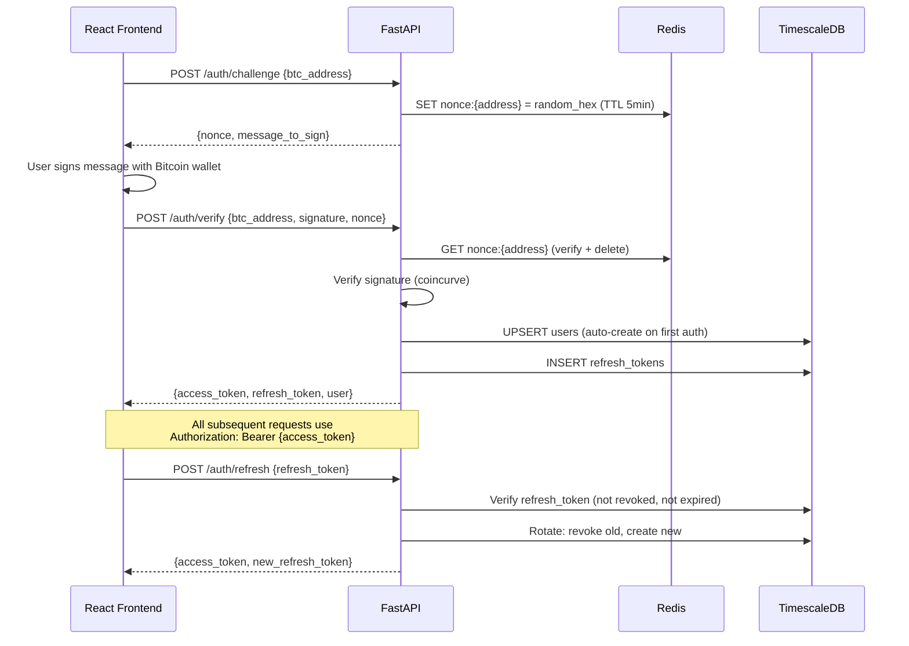

# Phase 1 -- Authentication & User Management

| Field        | Value                                         |
| ------------ | --------------------------------------------- |
| **Duration** | 3 weeks                                       |
| **Status**   | Not Started                                   |
| **Owner**    | TBD                                           |
| **Depends**  | Phase 0 -- Foundation & Scaffolding           |
| **Blocks**   | Phase 2 -- Mining Data API, Phase 9 -- Public |

---

## 1.1 Objectives

1. **Implement Bitcoin message signing authentication** using a challenge-response flow: the server issues a nonce, the client signs it with their Bitcoin private key, and the server verifies the signature using `coincurve` -- supporting P2PKH, P2WPKH (bech32), and P2TR (bech32m/taproot) addresses.
2. **Issue RS256 JWT tokens** (1-hour access tokens + 7-day refresh tokens stored in the database) with secure rotation and revocation.
3. **Auto-create users on first authentication** so there is zero friction -- no registration form, just sign a message.
4. **Build profile CRUD** with display name (case-insensitive uniqueness via normalized column), avatar URL, bio, country code, and ban status.
5. **Build settings CRUD** using JSONB storage for notification, privacy, mining, and sound preferences.
6. **Implement API key management** with argon2-hashed keys, `sk-tbg-` prefix, and per-key rate limiting.

---

## 1.2 Architecture



---

## 1.3 Bitcoin Message Signing Verification

### 1.3.1 Core Verification Module

```python
"""
services/api/src/tbg/auth/bitcoin.py — Bitcoin message signing verification.

Supports:
  - P2PKH (1...) — Legacy compressed/uncompressed
  - P2WPKH (bc1q...) — Native SegWit v0
  - P2TR (bc1p...) — Taproot (Schnorr / BIP-340)

Uses coincurve for secp256k1 operations. No dependency on full Bitcoin node.
"""
import hashlib
import struct
from enum import Enum

from coincurve import PublicKey
from coincurve.ecdsa import deserialize_compact


class AddressType(Enum):
    P2PKH = "p2pkh"
    P2WPKH = "p2wpkh"
    P2TR = "p2tr"


def _message_hash(message: str) -> bytes:
    """
    Bitcoin message signing hash: SHA256(SHA256(prefix || message)).
    Prefix: "\\x18Bitcoin Signed Message:\\n" + varint(len(message))
    """
    prefix = b"\x18Bitcoin Signed Message:\n"
    msg_bytes = message.encode("utf-8")
    varint = _encode_varint(len(msg_bytes))
    payload = prefix + varint + msg_bytes
    return hashlib.sha256(hashlib.sha256(payload).digest()).digest()


def _encode_varint(n: int) -> bytes:
    """Encode integer as Bitcoin varint."""
    if n < 0xFD:
        return struct.pack("<B", n)
    if n <= 0xFFFF:
        return b"\xfd" + struct.pack("<H", n)
    if n <= 0xFFFFFFFF:
        return b"\xfe" + struct.pack("<I", n)
    return b"\xff" + struct.pack("<Q", n)


def _detect_address_type(address: str) -> AddressType:
    """Detect Bitcoin address type from prefix."""
    if address.startswith("1"):
        return AddressType.P2PKH
    if address.startswith("bc1q"):
        return AddressType.P2WPKH
    if address.startswith("bc1p"):
        return AddressType.P2TR
    # Testnet / signet variants
    if address.startswith("tb1q") or address.startswith("m") or address.startswith("n"):
        return AddressType.P2WPKH
    if address.startswith("tb1p"):
        return AddressType.P2TR
    msg = f"Unsupported address format: {address[:10]}..."
    raise ValueError(msg)


def verify_bitcoin_signature(
    address: str,
    message: str,
    signature_base64: str,
) -> bool:
    """
    Verify a Bitcoin signed message.

    Args:
        address: Bitcoin address (P2PKH, P2WPKH, or P2TR)
        message: The original message that was signed
        signature_base64: Base64-encoded signature

    Returns:
        True if signature is valid for the given address

    Raises:
        ValueError: If address format is unsupported
    """
    import base64

    sig_bytes = base64.b64decode(signature_base64)
    msg_hash = _message_hash(message)
    addr_type = _detect_address_type(address)

    if addr_type == AddressType.P2TR:
        return _verify_schnorr(address, msg_hash, sig_bytes)
    return _verify_ecdsa(address, msg_hash, sig_bytes, addr_type)


def _verify_ecdsa(
    address: str,
    msg_hash: bytes,
    sig_bytes: bytes,
    addr_type: AddressType,
) -> bool:
    """Verify ECDSA signature (P2PKH / P2WPKH)."""
    if len(sig_bytes) != 65:
        return False

    flag = sig_bytes[0]
    if flag < 27 or flag > 34:
        return False

    compressed = flag >= 31
    recovery_id = (flag - 27) & 3

    try:
        # Recover public key from signature
        recoverable_sig = deserialize_compact(sig_bytes[1:], recovery_id)
        pubkey = PublicKey.from_signature_and_message(
            recoverable_sig, msg_hash, hasher=None
        )

        # Derive address from recovered public key
        derived = _pubkey_to_address(pubkey, addr_type, compressed)
        return derived == address
    except Exception:
        return False


def _verify_schnorr(
    address: str,
    msg_hash: bytes,
    sig_bytes: bytes,
) -> bool:
    """Verify Schnorr signature (P2TR / BIP-340)."""
    # BIP-340 Schnorr signatures are 64 bytes
    if len(sig_bytes) == 65:
        sig_bytes = sig_bytes[1:]  # Strip recovery byte if present
    if len(sig_bytes) != 64:
        return False

    try:
        from coincurve import PublicKeyXOnly
        # Extract x-only pubkey from bech32m address
        x_only_bytes = _decode_bech32m_witness(address)
        pubkey = PublicKeyXOnly(x_only_bytes)
        return pubkey.verify(sig_bytes, msg_hash)
    except Exception:
        return False


def _pubkey_to_address(
    pubkey: PublicKey,
    addr_type: AddressType,
    compressed: bool,
) -> str:
    """Derive a Bitcoin address from a public key."""
    if compressed:
        pub_bytes = pubkey.format(compressed=True)
    else:
        pub_bytes = pubkey.format(compressed=False)

    if addr_type == AddressType.P2PKH:
        return _pubkey_to_p2pkh(pub_bytes)
    if addr_type == AddressType.P2WPKH:
        return _pubkey_to_p2wpkh(pub_bytes)
    msg = f"Cannot derive address for type: {addr_type}"
    raise ValueError(msg)


def _pubkey_to_p2pkh(pub_bytes: bytes) -> str:
    """Public key -> P2PKH address (Base58Check)."""
    sha256_hash = hashlib.sha256(pub_bytes).digest()
    ripemd160 = hashlib.new("ripemd160", sha256_hash).digest()
    versioned = b"\x00" + ripemd160  # Mainnet prefix
    checksum = hashlib.sha256(hashlib.sha256(versioned).digest()).digest()[:4]
    return _base58_encode(versioned + checksum)


def _pubkey_to_p2wpkh(pub_bytes: bytes) -> str:
    """Public key -> P2WPKH bech32 address."""
    sha256_hash = hashlib.sha256(pub_bytes).digest()
    witness_hash = hashlib.new("ripemd160", sha256_hash).digest()
    from tbg.auth._bech32 import encode as bech32_encode
    return bech32_encode("bc", 0, witness_hash)


def _decode_bech32m_witness(address: str) -> bytes:
    """Decode witness program from bech32m (taproot) address."""
    from tbg.auth._bech32 import decode as bech32_decode
    _, version, witness = bech32_decode(address)
    if version != 1:
        msg = f"Expected witness version 1 (taproot), got {version}"
        raise ValueError(msg)
    return bytes(witness)


def _base58_encode(data: bytes) -> str:
    """Base58Check encoding."""
    alphabet = "123456789ABCDEFGHJKLMNPQRSTUVWXYZabcdefghijkmnopqrstuvwxyz"
    n = int.from_bytes(data, "big")
    result = ""
    while n > 0:
        n, remainder = divmod(n, 58)
        result = alphabet[remainder] + result
    # Preserve leading zeros
    for byte in data:
        if byte == 0:
            result = "1" + result
        else:
            break
    return result
```

### 1.3.2 Challenge-Response Messages

The message format follows a human-readable pattern that Bitcoin wallets display to the user:

```
Sign this message to log in to The Bitcoin Game.

Nonce: a1b2c3d4e5f6a7b8
Timestamp: 2026-03-15T14:30:00Z
Address: bc1qxy2kgdygjrsqtzq2n0yrf2493p83kkfjhx0wlh
```

---

## 1.4 JWT Token Management

### 1.4.1 JWT Module

```python
"""
services/api/src/tbg/auth/jwt.py — RS256 JWT token management.
"""
import time
from datetime import datetime, timedelta, timezone
from pathlib import Path

import jwt

from tbg.config import get_settings


# Load RSA keys at module level
_private_key: str | None = None
_public_key: str | None = None


def _load_keys() -> tuple[str, str]:
    global _private_key, _public_key
    if _private_key is None:
        settings = get_settings()
        _private_key = Path(settings.jwt_private_key_path).read_text()
        _public_key = Path(settings.jwt_public_key_path).read_text()
    return _private_key, _public_key


def create_access_token(user_id: int, btc_address: str) -> str:
    """Create a short-lived access token (1 hour)."""
    private_key, _ = _load_keys()
    now = datetime.now(timezone.utc)
    payload = {
        "sub": str(user_id),
        "address": btc_address,
        "iat": now,
        "exp": now + timedelta(hours=1),
        "type": "access",
    }
    return jwt.encode(payload, private_key, algorithm="RS256")


def create_refresh_token(user_id: int, btc_address: str, token_id: str) -> str:
    """Create a long-lived refresh token (7 days)."""
    private_key, _ = _load_keys()
    now = datetime.now(timezone.utc)
    payload = {
        "sub": str(user_id),
        "address": btc_address,
        "jti": token_id,
        "iat": now,
        "exp": now + timedelta(days=7),
        "type": "refresh",
    }
    return jwt.encode(payload, private_key, algorithm="RS256")


def verify_token(token: str, expected_type: str = "access") -> dict:
    """
    Verify and decode a JWT token.

    Raises:
        jwt.ExpiredSignatureError: Token has expired
        jwt.InvalidTokenError: Token is invalid
    """
    _, public_key = _load_keys()
    payload = jwt.decode(token, public_key, algorithms=["RS256"])
    if payload.get("type") != expected_type:
        msg = f"Expected token type '{expected_type}', got '{payload.get('type')}'"
        raise jwt.InvalidTokenError(msg)
    return payload
```

### 1.4.2 Auth Dependencies

```python
"""
services/api/src/tbg/auth/dependencies.py — FastAPI auth dependencies.
"""
from fastapi import Depends, HTTPException, Security
from fastapi.security import HTTPAuthorizationCredentials, HTTPBearer
from sqlalchemy.ext.asyncio import AsyncSession

from tbg.auth.jwt import verify_token
from tbg.database import get_session
from tbg.users.service import get_user_by_id

security = HTTPBearer()


async def get_current_user(
    credentials: HTTPAuthorizationCredentials = Security(security),
    db: AsyncSession = Depends(get_session),
):
    """Extract and verify the current user from JWT token."""
    try:
        payload = verify_token(credentials.credentials, expected_type="access")
    except Exception as e:
        raise HTTPException(status_code=401, detail=f"Invalid token: {e}") from e

    user_id = int(payload["sub"])
    user = await get_user_by_id(db, user_id)
    if user is None:
        raise HTTPException(status_code=401, detail="User not found")
    if user.is_banned:
        raise HTTPException(status_code=403, detail="Account is banned")
    return user


async def require_auth(user=Depends(get_current_user)):
    """Convenience dependency — just requires a valid user."""
    return user
```

---

## 1.5 Database Schema

### 1.5.1 User Table Modifications

```sql
-- Alembic migration: 002_auth_tables.py

-- Add columns to existing users table
ALTER TABLE users
    ADD COLUMN IF NOT EXISTS display_name_normalized VARCHAR(64),
    ADD COLUMN IF NOT EXISTS avatar_url TEXT,
    ADD COLUMN IF NOT EXISTS bio VARCHAR(280),
    ADD COLUMN IF NOT EXISTS is_banned BOOLEAN DEFAULT FALSE,
    ADD COLUMN IF NOT EXISTS last_login TIMESTAMPTZ,
    ADD COLUMN IF NOT EXISTS login_count INTEGER DEFAULT 0;

-- Case-insensitive display name uniqueness
CREATE UNIQUE INDEX IF NOT EXISTS idx_users_display_name_normalized
    ON users(display_name_normalized)
    WHERE display_name_normalized IS NOT NULL;

-- Update display_name_normalized trigger
CREATE OR REPLACE FUNCTION update_display_name_normalized()
RETURNS TRIGGER AS $$
BEGIN
    IF NEW.display_name IS NOT NULL THEN
        NEW.display_name_normalized := LOWER(TRIM(NEW.display_name));
    ELSE
        NEW.display_name_normalized := NULL;
    END IF;
    RETURN NEW;
END;
$$ LANGUAGE plpgsql;

CREATE OR REPLACE TRIGGER trg_users_display_name
    BEFORE INSERT OR UPDATE OF display_name ON users
    FOR EACH ROW EXECUTE FUNCTION update_display_name_normalized();
```

### 1.5.2 Refresh Tokens Table

```sql
CREATE TABLE IF NOT EXISTS refresh_tokens (
    id              UUID PRIMARY KEY DEFAULT gen_random_uuid(),
    user_id         BIGINT NOT NULL REFERENCES users(id) ON DELETE CASCADE,
    token_hash      VARCHAR(128) NOT NULL,
    issued_at       TIMESTAMPTZ NOT NULL DEFAULT NOW(),
    expires_at      TIMESTAMPTZ NOT NULL,
    revoked_at      TIMESTAMPTZ,
    ip_address      INET,
    user_agent      VARCHAR(512),
    is_revoked      BOOLEAN DEFAULT FALSE,
    replaced_by     UUID REFERENCES refresh_tokens(id)
);

CREATE INDEX IF NOT EXISTS idx_refresh_tokens_user ON refresh_tokens(user_id, is_revoked);
CREATE INDEX IF NOT EXISTS idx_refresh_tokens_expires ON refresh_tokens(expires_at) WHERE NOT is_revoked;
```

### 1.5.3 API Keys Table

```sql
CREATE TABLE IF NOT EXISTS api_keys (
    id              UUID PRIMARY KEY DEFAULT gen_random_uuid(),
    user_id         BIGINT NOT NULL REFERENCES users(id) ON DELETE CASCADE,
    key_prefix      VARCHAR(16) NOT NULL,      -- "sk-tbg-abc123" (first 14 chars, visible to user)
    key_hash        VARCHAR(256) NOT NULL,      -- argon2id hash of full key
    name            VARCHAR(128) NOT NULL,      -- user-defined label
    permissions     JSONB DEFAULT '["read"]',   -- ["read", "write"]
    last_used_at    TIMESTAMPTZ,
    created_at      TIMESTAMPTZ NOT NULL DEFAULT NOW(),
    expires_at      TIMESTAMPTZ,
    is_revoked      BOOLEAN DEFAULT FALSE,
    revoked_at      TIMESTAMPTZ
);

CREATE INDEX IF NOT EXISTS idx_api_keys_user ON api_keys(user_id, is_revoked);
CREATE INDEX IF NOT EXISTS idx_api_keys_prefix ON api_keys(key_prefix) WHERE NOT is_revoked;
```

### 1.5.4 User Settings Table

```sql
CREATE TABLE IF NOT EXISTS user_settings (
    user_id         BIGINT PRIMARY KEY REFERENCES users(id) ON DELETE CASCADE,
    notifications   JSONB DEFAULT '{
        "email_enabled": false,
        "push_enabled": true,
        "badge_earned": true,
        "block_found": true,
        "streak_reminder": true,
        "weekly_summary": true,
        "competition_updates": true
    }',
    privacy         JSONB DEFAULT '{
        "profile_public": true,
        "show_hashrate": true,
        "show_workers": false,
        "show_country": true,
        "show_badges": true,
        "show_streak": true
    }',
    mining          JSONB DEFAULT '{
        "auto_difficulty": true,
        "target_shares_per_min": 1.0,
        "coinbase_signature": ""
    }',
    sound           JSONB DEFAULT '{
        "mode": "subtle",
        "volume": 0.7,
        "share_sound": true,
        "badge_sound": true,
        "block_found_sound": true
    }',
    updated_at      TIMESTAMPTZ DEFAULT NOW()
);

-- Auto-update timestamp
CREATE OR REPLACE FUNCTION update_settings_timestamp()
RETURNS TRIGGER AS $$
BEGIN
    NEW.updated_at := NOW();
    RETURN NEW;
END;
$$ LANGUAGE plpgsql;

CREATE OR REPLACE TRIGGER trg_settings_updated
    BEFORE UPDATE ON user_settings
    FOR EACH ROW EXECUTE FUNCTION update_settings_timestamp();
```

---

## 1.6 API Endpoints

### 1.6.1 Auth Router

```python
"""
services/api/src/tbg/auth/router.py — Authentication endpoints.
"""
import secrets
from datetime import datetime, timezone

from fastapi import APIRouter, Depends, HTTPException
from sqlalchemy.ext.asyncio import AsyncSession

from tbg.auth.bitcoin import verify_bitcoin_signature
from tbg.auth.jwt import create_access_token, create_refresh_token, verify_token
from tbg.auth.models import (
    ChallengeRequest,
    ChallengeResponse,
    VerifyRequest,
    TokenResponse,
    RefreshRequest,
)
from tbg.database import get_session
from tbg.redis_client import get_redis
from tbg.users.service import get_or_create_user, update_login_stats

router = APIRouter(prefix="/auth", tags=["Authentication"])

NONCE_TTL = 300  # 5 minutes
NONCE_PREFIX = "auth:nonce:"


@router.post("/challenge", response_model=ChallengeResponse)
async def request_challenge(
    body: ChallengeRequest,
) -> ChallengeResponse:
    """
    Step 1: Request a challenge nonce for Bitcoin message signing.

    The client must sign the returned message with their Bitcoin private key
    and submit it to POST /auth/verify.
    """
    nonce = secrets.token_hex(16)
    timestamp = datetime.now(timezone.utc).isoformat()

    message = (
        f"Sign this message to log in to The Bitcoin Game.\n\n"
        f"Nonce: {nonce}\n"
        f"Timestamp: {timestamp}\n"
        f"Address: {body.btc_address}"
    )

    redis = get_redis()
    await redis.setex(f"{NONCE_PREFIX}{body.btc_address}", NONCE_TTL, nonce)

    return ChallengeResponse(nonce=nonce, message=message, expires_in=NONCE_TTL)


@router.post("/verify", response_model=TokenResponse)
async def verify_and_authenticate(
    body: VerifyRequest,
    db: AsyncSession = Depends(get_session),
) -> TokenResponse:
    """
    Step 2: Verify the signed challenge and issue JWT tokens.

    Auto-creates the user on first authentication.
    """
    redis = get_redis()
    nonce_key = f"{NONCE_PREFIX}{body.btc_address}"

    # Verify nonce exists and matches
    stored_nonce = await redis.get(nonce_key)
    if stored_nonce is None:
        raise HTTPException(status_code=400, detail="Challenge expired or not found")
    if stored_nonce != body.nonce:
        raise HTTPException(status_code=400, detail="Nonce mismatch")

    # Delete nonce (one-time use)
    await redis.delete(nonce_key)

    # Reconstruct the expected message
    expected_message = (
        f"Sign this message to log in to The Bitcoin Game.\n\n"
        f"Nonce: {body.nonce}\n"
        f"Timestamp: {body.timestamp}\n"
        f"Address: {body.btc_address}"
    )

    # Verify Bitcoin signature
    if not verify_bitcoin_signature(body.btc_address, expected_message, body.signature):
        raise HTTPException(status_code=401, detail="Invalid signature")

    # Get or create user
    user = await get_or_create_user(db, body.btc_address)
    await update_login_stats(db, user.id)

    # Create tokens
    access_token = create_access_token(user.id, user.btc_address)

    import uuid
    token_id = str(uuid.uuid4())
    refresh_token = create_refresh_token(user.id, user.btc_address, token_id)

    # Store refresh token hash in DB
    from tbg.auth.service import store_refresh_token
    await store_refresh_token(db, user.id, token_id, refresh_token)

    await db.commit()

    return TokenResponse(
        access_token=access_token,
        refresh_token=refresh_token,
        token_type="bearer",
        expires_in=3600,
        user={
            "id": user.id,
            "btc_address": user.btc_address,
            "display_name": user.display_name,
            "country_code": user.country_code,
        },
    )


@router.post("/refresh", response_model=TokenResponse)
async def refresh_tokens(
    body: RefreshRequest,
    db: AsyncSession = Depends(get_session),
) -> TokenResponse:
    """Rotate refresh token and issue new access + refresh tokens."""
    try:
        payload = verify_token(body.refresh_token, expected_type="refresh")
    except Exception as e:
        raise HTTPException(status_code=401, detail=f"Invalid refresh token: {e}") from e

    from tbg.auth.service import rotate_refresh_token
    user, new_token_id, new_refresh = await rotate_refresh_token(
        db, int(payload["sub"]), payload["jti"], body.refresh_token
    )

    access_token = create_access_token(user.id, user.btc_address)
    new_refresh_token = create_refresh_token(user.id, user.btc_address, new_token_id)

    await db.commit()

    return TokenResponse(
        access_token=access_token,
        refresh_token=new_refresh_token,
        token_type="bearer",
        expires_in=3600,
        user={
            "id": user.id,
            "btc_address": user.btc_address,
            "display_name": user.display_name,
            "country_code": user.country_code,
        },
    )


@router.post("/logout")
async def logout(
    body: RefreshRequest,
    db: AsyncSession = Depends(get_session),
) -> dict[str, str]:
    """Revoke the refresh token (effectively logging out)."""
    from tbg.auth.service import revoke_refresh_token
    await revoke_refresh_token(db, body.refresh_token)
    await db.commit()
    return {"status": "logged_out"}


@router.post("/logout-all")
async def logout_all_sessions(
    user=Depends(require_auth),
    db: AsyncSession = Depends(get_session),
) -> dict[str, str]:
    """Revoke all refresh tokens for the current user."""
    from tbg.auth.service import revoke_all_user_tokens
    await revoke_all_user_tokens(db, user.id)
    await db.commit()
    return {"status": "all_sessions_revoked"}
```

### 1.6.2 User Router

```python
"""
services/api/src/tbg/users/router.py — User profile and settings endpoints.
"""
from fastapi import APIRouter, Depends, HTTPException
from sqlalchemy.ext.asyncio import AsyncSession

from tbg.auth.dependencies import get_current_user, require_auth
from tbg.database import get_session
from tbg.users.models import (
    ProfileResponse,
    ProfileUpdateRequest,
    SettingsResponse,
    SettingsUpdateRequest,
    ApiKeyCreateRequest,
    ApiKeyResponse,
    PublicProfileResponse,
)
from tbg.users.service import (
    get_profile,
    update_profile,
    get_settings,
    update_settings,
    create_api_key,
    list_api_keys,
    revoke_api_key,
    get_public_profile,
)

router = APIRouter(prefix="/users", tags=["Users"])


@router.get("/me", response_model=ProfileResponse)
async def get_my_profile(
    user=Depends(get_current_user),
    db: AsyncSession = Depends(get_session),
) -> ProfileResponse:
    """Get the current user's full profile."""
    return await get_profile(db, user.id)


@router.patch("/me", response_model=ProfileResponse)
async def update_my_profile(
    body: ProfileUpdateRequest,
    user=Depends(get_current_user),
    db: AsyncSession = Depends(get_session),
) -> ProfileResponse:
    """Update the current user's profile."""
    return await update_profile(db, user.id, body)


@router.get("/me/settings", response_model=SettingsResponse)
async def get_my_settings(
    user=Depends(get_current_user),
    db: AsyncSession = Depends(get_session),
) -> SettingsResponse:
    """Get the current user's settings."""
    return await get_settings(db, user.id)


@router.patch("/me/settings", response_model=SettingsResponse)
async def update_my_settings(
    body: SettingsUpdateRequest,
    user=Depends(get_current_user),
    db: AsyncSession = Depends(get_session),
) -> SettingsResponse:
    """Update the current user's settings (deep merge on JSONB)."""
    return await update_settings(db, user.id, body)


@router.post("/me/api-keys", response_model=ApiKeyResponse)
async def create_my_api_key(
    body: ApiKeyCreateRequest,
    user=Depends(get_current_user),
    db: AsyncSession = Depends(get_session),
) -> ApiKeyResponse:
    """Create a new API key. The full key is only shown once."""
    return await create_api_key(db, user.id, body)


@router.get("/me/api-keys", response_model=list[ApiKeyResponse])
async def list_my_api_keys(
    user=Depends(get_current_user),
    db: AsyncSession = Depends(get_session),
) -> list[ApiKeyResponse]:
    """List all API keys for the current user (prefix only, not full key)."""
    return await list_api_keys(db, user.id)


@router.delete("/me/api-keys/{key_id}")
async def revoke_my_api_key(
    key_id: str,
    user=Depends(get_current_user),
    db: AsyncSession = Depends(get_session),
) -> dict[str, str]:
    """Revoke an API key."""
    await revoke_api_key(db, user.id, key_id)
    return {"status": "revoked"}


@router.get("/{btc_address}", response_model=PublicProfileResponse)
async def get_user_public_profile(
    btc_address: str,
    db: AsyncSession = Depends(get_session),
) -> PublicProfileResponse:
    """Get a user's public profile (no auth required)."""
    profile = await get_public_profile(db, btc_address)
    if profile is None:
        raise HTTPException(status_code=404, detail="User not found")
    return profile
```

### 1.6.3 Endpoints Summary Table

| Method | Path | Description | Auth |
|---|---|---|---|
| POST | `/auth/challenge` | Request a signing challenge nonce | No |
| POST | `/auth/verify` | Verify signature and get tokens | No |
| POST | `/auth/refresh` | Rotate refresh token | No |
| POST | `/auth/logout` | Revoke refresh token | No |
| POST | `/auth/logout-all` | Revoke all sessions | Yes |
| GET | `/users/me` | Get own profile | Yes |
| PATCH | `/users/me` | Update own profile | Yes |
| GET | `/users/me/settings` | Get own settings | Yes |
| PATCH | `/users/me/settings` | Update own settings | Yes |
| POST | `/users/me/api-keys` | Create API key | Yes |
| GET | `/users/me/api-keys` | List API keys | Yes |
| DELETE | `/users/me/api-keys/{id}` | Revoke API key | Yes |
| GET | `/users/{btc_address}` | Get public profile | No |
| -- | -- | **Background: token cleanup** | Cron |
| -- | -- | **Background: ban check** | Cron |

---

## 1.7 API Key Management

### 1.7.1 Key Generation and Hashing

```python
"""
services/api/src/tbg/auth/api_keys.py — API key generation with argon2 hashing.
"""
import secrets
import argon2

_hasher = argon2.PasswordHasher(
    time_cost=2,
    memory_cost=65536,
    parallelism=1,
    hash_len=32,
    salt_len=16,
)

KEY_PREFIX = "sk-tbg-"


def generate_api_key() -> tuple[str, str, str]:
    """
    Generate a new API key.

    Returns:
        (full_key, prefix, key_hash)
        - full_key: "sk-tbg-a1b2c3d4e5f6g7h8i9j0k1l2m3n4o5p6" (shown once)
        - prefix: "sk-tbg-a1b2c3" (stored for identification)
        - key_hash: argon2id hash (stored for verification)
    """
    random_part = secrets.token_hex(32)
    full_key = f"{KEY_PREFIX}{random_part}"
    prefix = full_key[:14]
    key_hash = _hasher.hash(full_key)
    return full_key, prefix, key_hash


def verify_api_key(full_key: str, stored_hash: str) -> bool:
    """Verify an API key against its stored hash."""
    try:
        return _hasher.verify(stored_hash, full_key)
    except argon2.exceptions.VerifyMismatchError:
        return False
```

---

## 1.8 Background Tasks

### 1.8.1 Token Cleanup

```python
"""
services/api/src/tbg/auth/tasks.py — Background tasks for auth module.
"""
import asyncio
from datetime import datetime, timezone

from sqlalchemy import delete, and_
from sqlalchemy.ext.asyncio import AsyncSession

from tbg.db.models import RefreshToken
import structlog

logger = structlog.get_logger()


async def cleanup_expired_tokens(session_factory) -> None:
    """Remove expired and revoked refresh tokens. Runs every hour."""
    while True:
        try:
            async with session_factory() as session:
                result = await session.execute(
                    delete(RefreshToken).where(
                        and_(
                            RefreshToken.expires_at < datetime.now(timezone.utc),
                        )
                    )
                )
                await session.commit()
                logger.info("token_cleanup", deleted=result.rowcount)
        except Exception:
            logger.exception("token_cleanup_failed")
        await asyncio.sleep(3600)  # Every hour
```

---

## 1.9 Testing

### 1.9.1 Bitcoin Signature Test Vectors

```python
"""
services/api/tests/auth/test_bitcoin.py — Bitcoin signature verification tests.
"""
import pytest
from tbg.auth.bitcoin import (
    verify_bitcoin_signature,
    _message_hash,
    _detect_address_type,
    AddressType,
)


class TestAddressDetection:
    def test_p2pkh(self) -> None:
        assert _detect_address_type("1A1zP1eP5QGefi2DMPTfTL5SLmv7DivfNa") == AddressType.P2PKH

    def test_p2wpkh(self) -> None:
        assert _detect_address_type("bc1qw508d6qejxtdg4y5r3zarvary0c5xw7kv8f3t4") == AddressType.P2WPKH

    def test_p2tr(self) -> None:
        assert _detect_address_type("bc1p5cyxnuxmeuwuvkwfem96lqzszee2457nxwprkfw") == AddressType.P2TR

    def test_testnet_p2wpkh(self) -> None:
        assert _detect_address_type("tb1qw508d6qejxtdg4y5r3zarvary0c5xw7kxpjzsx") == AddressType.P2WPKH

    def test_testnet_p2tr(self) -> None:
        assert _detect_address_type("tb1p5cyxnuxmeuwuvkwfem96lqzszee2457nfpv09nh") == AddressType.P2TR

    def test_unsupported(self) -> None:
        with pytest.raises(ValueError, match="Unsupported"):
            _detect_address_type("3J98t1WpEZ73CNmQviecrnyiWrnqRhWNLy")  # P2SH


class TestMessageHash:
    def test_deterministic(self) -> None:
        h1 = _message_hash("Hello Bitcoin")
        h2 = _message_hash("Hello Bitcoin")
        assert h1 == h2

    def test_different_messages(self) -> None:
        h1 = _message_hash("message 1")
        h2 = _message_hash("message 2")
        assert h1 != h2

    def test_hash_length(self) -> None:
        h = _message_hash("test")
        assert len(h) == 32  # SHA256 output


class TestSignatureVerification:
    """
    Known test vectors for Bitcoin message signing.
    These are generated using bitcoin-core's signmessage RPC.
    """

    # P2PKH test vector
    P2PKH_ADDRESS = "1HZwkjkeaoZfTSaJxDw6aKkxp45agDiEzN"
    P2PKH_MESSAGE = "test message"
    P2PKH_SIGNATURE = "IJ1MAuN4DfCyVQcRGm3R7dz9UwqW7MJI8EEQAA1gA5FqMKqyP4tQZtwUJ1BBLGS1hbfJp3aG7vj3bVDqRLHqCc="

    @pytest.mark.parametrize("address,message,sig,expected", [
        # Valid P2PKH signature
        (P2PKH_ADDRESS, P2PKH_MESSAGE, P2PKH_SIGNATURE, True),
        # Wrong message
        (P2PKH_ADDRESS, "wrong message", P2PKH_SIGNATURE, False),
        # Empty signature
        (P2PKH_ADDRESS, P2PKH_MESSAGE, "", False),
    ])
    def test_ecdsa_signatures(self, address, message, sig, expected) -> None:
        if sig == "":
            assert not verify_bitcoin_signature(address, message, "AA==")
        else:
            result = verify_bitcoin_signature(address, message, sig)
            assert result == expected

    def test_invalid_signature_length(self) -> None:
        import base64
        bad_sig = base64.b64encode(b"too short").decode()
        assert not verify_bitcoin_signature(
            "1HZwkjkeaoZfTSaJxDw6aKkxp45agDiEzN",
            "test",
            bad_sig,
        )


class TestFullAuthFlow:
    """Integration test for the full challenge-response flow."""

    # This requires actual key material, tested via the API integration tests
    pass
```

### 1.9.2 Auth Flow Integration Tests

```python
"""
services/api/tests/auth/test_auth_flow.py — Full auth flow integration tests.
"""
import pytest
from httpx import AsyncClient


@pytest.mark.asyncio
async def test_challenge_returns_nonce(client: AsyncClient) -> None:
    response = await client.post("/auth/challenge", json={
        "btc_address": "bc1qxy2kgdygjrsqtzq2n0yrf2493p83kkfjhx0wlh"
    })
    assert response.status_code == 200
    data = response.json()
    assert "nonce" in data
    assert "message" in data
    assert data["expires_in"] == 300
    assert "bc1qxy2kgdygjrsqtzq2n0yrf2493p83kkfjhx0wlh" in data["message"]


@pytest.mark.asyncio
async def test_challenge_duplicate_replaces_nonce(client: AsyncClient) -> None:
    addr = "bc1qxy2kgdygjrsqtzq2n0yrf2493p83kkfjhx0wlh"
    r1 = await client.post("/auth/challenge", json={"btc_address": addr})
    r2 = await client.post("/auth/challenge", json={"btc_address": addr})
    assert r1.json()["nonce"] != r2.json()["nonce"]


@pytest.mark.asyncio
async def test_verify_with_expired_nonce(client: AsyncClient) -> None:
    response = await client.post("/auth/verify", json={
        "btc_address": "bc1qxy2kgdygjrsqtzq2n0yrf2493p83kkfjhx0wlh",
        "signature": "fakesig==",
        "nonce": "nonexistent",
        "timestamp": "2026-03-15T00:00:00Z",
    })
    assert response.status_code == 400
    assert "expired" in response.json()["detail"].lower() or "not found" in response.json()["detail"].lower()


@pytest.mark.asyncio
async def test_verify_with_invalid_signature(client: AsyncClient, redis_client) -> None:
    # Set a nonce manually
    addr = "bc1qxy2kgdygjrsqtzq2n0yrf2493p83kkfjhx0wlh"
    await redis_client.setex(f"auth:nonce:{addr}", 300, "test-nonce-123")

    response = await client.post("/auth/verify", json={
        "btc_address": addr,
        "signature": "SW52YWxpZFNpZ25hdHVyZQ==",
        "nonce": "test-nonce-123",
        "timestamp": "2026-03-15T00:00:00Z",
    })
    assert response.status_code == 401
    assert "signature" in response.json()["detail"].lower()


@pytest.mark.asyncio
async def test_refresh_token_rotation(client: AsyncClient) -> None:
    # This test requires a valid initial token pair
    # Tested via fixture that creates a test user with tokens
    pass


@pytest.mark.asyncio
async def test_revoked_token_rejected(client: AsyncClient) -> None:
    # After logout, the refresh token should be rejected
    pass


@pytest.mark.asyncio
async def test_banned_user_rejected(client: AsyncClient) -> None:
    # A banned user should get 403 on any authenticated endpoint
    pass


@pytest.mark.asyncio
async def test_rate_limiting_on_auth(client: AsyncClient) -> None:
    addr = "bc1qxy2kgdygjrsqtzq2n0yrf2493p83kkfjhx0wlh"
    for _ in range(50):
        await client.post("/auth/challenge", json={"btc_address": addr})
    # Should still work under standard rate limit
    r = await client.post("/auth/challenge", json={"btc_address": addr})
    assert r.status_code in (200, 429)
```

### 1.9.3 JWT Tests

```python
"""
services/api/tests/auth/test_jwt.py — JWT token tests.
"""
import pytest
import time
from unittest.mock import patch
from tbg.auth.jwt import create_access_token, create_refresh_token, verify_token


class TestAccessToken:
    def test_create_and_verify(self) -> None:
        token = create_access_token(user_id=1, btc_address="bc1q...")
        payload = verify_token(token, expected_type="access")
        assert payload["sub"] == "1"
        assert payload["address"] == "bc1q..."
        assert payload["type"] == "access"

    def test_expired_token_rejected(self) -> None:
        import jwt as pyjwt
        with pytest.raises(pyjwt.ExpiredSignatureError):
            # Token with exp in the past
            token = create_access_token(user_id=1, btc_address="bc1q...")
            # Manually decode and re-encode with past exp
            pass  # Implemented with freezegun or time mock

    def test_wrong_type_rejected(self) -> None:
        import jwt as pyjwt
        token = create_refresh_token(user_id=1, btc_address="bc1q...", token_id="test")
        with pytest.raises(pyjwt.InvalidTokenError, match="Expected token type"):
            verify_token(token, expected_type="access")


class TestRefreshToken:
    def test_create_includes_jti(self) -> None:
        token = create_refresh_token(user_id=1, btc_address="bc1q...", token_id="abc-123")
        payload = verify_token(token, expected_type="refresh")
        assert payload["jti"] == "abc-123"
        assert payload["type"] == "refresh"
```

### 1.9.4 Profile and Settings Tests

```python
"""
services/api/tests/users/test_profile.py
"""
import pytest
from httpx import AsyncClient


@pytest.mark.asyncio
async def test_get_profile_unauthorized(client: AsyncClient) -> None:
    response = await client.get("/users/me")
    assert response.status_code in (401, 403)


@pytest.mark.asyncio
async def test_update_display_name(authed_client: AsyncClient) -> None:
    response = await authed_client.patch("/users/me", json={
        "display_name": "SatoshiHunter"
    })
    assert response.status_code == 200
    assert response.json()["display_name"] == "SatoshiHunter"


@pytest.mark.asyncio
async def test_display_name_case_insensitive_unique(authed_client: AsyncClient, db_session) -> None:
    # Create user with name "TestMiner"
    await authed_client.patch("/users/me", json={"display_name": "TestMiner"})
    # Another user trying "TESTMINER" should fail
    # (tested with second authed user)
    pass


@pytest.mark.asyncio
async def test_settings_deep_merge(authed_client: AsyncClient) -> None:
    # Update only one field within notifications
    response = await authed_client.patch("/users/me/settings", json={
        "notifications": {"email_enabled": True}
    })
    assert response.status_code == 200
    # Other notification fields should remain unchanged
    assert response.json()["notifications"]["push_enabled"] is True


@pytest.mark.asyncio
async def test_public_profile(client: AsyncClient) -> None:
    response = await client.get("/users/bc1qxy2kgdygjrsqtzq2n0yrf2493p83kkfjhx0wlh")
    # Returns 200 or 404 depending on whether user exists
    assert response.status_code in (200, 404)
```

### 1.9.5 Coverage Targets

| Module | Target |
|---|---|
| `tbg.auth.bitcoin` | 95% |
| `tbg.auth.jwt` | 95% |
| `tbg.auth.router` | 90% |
| `tbg.auth.service` | 90% |
| `tbg.auth.api_keys` | 90% |
| `tbg.users.router` | 90% |
| `tbg.users.service` | 85% |
| **Phase 1 overall** | **90%+** |

---

## 1.10 Deliverables Checklist

| # | Deliverable | Owner | Status |
|---|---|---|---|
| 1 | Bitcoin message signing verification (coincurve) | TBD | [ ] |
| 2 | P2PKH address support + test vectors | TBD | [ ] |
| 3 | P2WPKH (bech32) address support + test vectors | TBD | [ ] |
| 4 | P2TR (bech32m/taproot) address support + test vectors | TBD | [ ] |
| 5 | Challenge-response flow (nonce in Redis, 5min TTL) | TBD | [ ] |
| 6 | JWT RS256 token creation (1h access, 7d refresh) | TBD | [ ] |
| 7 | JWT verification with type checking | TBD | [ ] |
| 8 | Refresh token rotation with revocation | TBD | [ ] |
| 9 | User auto-creation on first auth | TBD | [ ] |
| 10 | Auth dependencies (get_current_user, require_auth) | TBD | [ ] |
| 11 | Profile CRUD (display name, avatar, bio, country) | TBD | [ ] |
| 12 | Display name case-insensitive uniqueness | TBD | [ ] |
| 13 | Settings CRUD with JSONB deep merge | TBD | [ ] |
| 14 | API key generation (sk-tbg- prefix) | TBD | [ ] |
| 15 | API key argon2 hashing and verification | TBD | [ ] |
| 16 | API key CRUD (create, list, revoke) | TBD | [ ] |
| 17 | Alembic migration 002 (auth tables) | TBD | [ ] |
| 18 | Token cleanup background task | TBD | [ ] |
| 19 | Auth integration tests (challenge, verify, refresh, logout) | TBD | [ ] |
| 20 | Bitcoin signature unit tests (3 address types) | TBD | [ ] |
| 21 | JWT unit tests (create, verify, expiry, type mismatch) | TBD | [ ] |
| 22 | Profile/settings integration tests | TBD | [ ] |
| 23 | API key tests | TBD | [ ] |
| 24 | Rate limiting verification on auth endpoints | TBD | [ ] |
| 25 | 90%+ test coverage on auth module | TBD | [ ] |

---

## 1.11 Week-by-Week Schedule

### Week 1 -- Bitcoin Auth Core

- Implement bitcoin.py (message hash, address detection, ECDSA verification)
- Implement bech32/bech32m encoder/decoder
- Add P2PKH, P2WPKH verification with test vectors
- Implement jwt.py (RS256 create/verify, access + refresh)
- Generate RSA key pair for development
- Write unit tests for bitcoin.py and jwt.py
- Set up auth router skeleton

### Week 2 -- Auth Flow & User Management

- Implement challenge-response endpoints
- Implement verify endpoint with auto-user-creation
- Implement refresh token rotation and logout
- Add auth dependencies (get_current_user)
- Implement profile CRUD with display name uniqueness
- Implement settings CRUD with JSONB deep merge
- Write Alembic migration 002
- Write auth flow integration tests

### Week 3 -- API Keys, P2TR & Polish

- Add P2TR (Schnorr/BIP-340) verification
- Implement API key module (generate, hash, verify, CRUD)
- Implement token cleanup background task
- Write API key tests
- Write rate limiting verification tests
- Achieve 90%+ coverage target
- Code review and sign-off
- Phase 1 complete

---

## 1.12 Risk Register

| Risk | Impact | Likelihood | Mitigation |
|---|---|---|---|
| coincurve build fails on ARM64 (Apple Silicon) | Medium | Medium | Pre-built wheels available; fallback to python-secp256k1 |
| P2TR Schnorr verification edge cases | High | Medium | Use BIP-340 test vectors from bitcoin/bips repo |
| JWT key rotation during active sessions | Medium | Low | Grace period: accept both old and new keys for 24h |
| Redis nonce deleted by LRU eviction | Medium | Low | Use separate Redis DB for auth nonces; TTL < LRU age |
| Display name squatting / impersonation | Medium | High | Rate limit name changes; profanity filter; admin override |
| API key leak in logs | High | Medium | Never log full key; only store prefix + hash |
| Token theft via XSS | High | Low | httpOnly refresh token cookie option (Phase 10); short access TTL |
| argon2 CPU cost too high under load | Medium | Low | Tune time_cost=2; benchmark in load test (Phase 10) |

---

*Phase 1 establishes the authentication foundation. Every subsequent phase depends on the `get_current_user` dependency and the user model defined here.*
