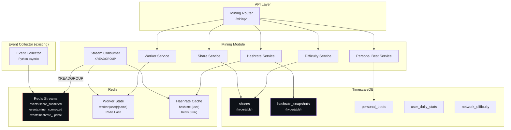

# Phase 2 -- Mining Data API

| Field        | Value                                            |
| ------------ | ------------------------------------------------ |
| **Duration** | 3 weeks                                          |
| **Status**   | Not Started                                      |
| **Owner**    | TBD                                              |
| **Depends**  | Phase 1 -- Authentication & Users                |
| **Blocks**   | Phase 3 -- Dashboard & Realtime, Phase 4 -- Gamification |

---

## 2.1 Objectives

1. **Build a Redis Stream consumer** that reads mining events from the Event Collector's streams (XREADGROUP with consumer group `tbg-api-consumers`) and maintains live worker state in Redis.
2. **Implement worker status tracking** using Redis hashes for O(1) lookups: online/offline state, current hashrate (1m/5m/1h/24h), last share timestamp, and current difficulty.
3. **Build paginated share endpoints** using keyset/cursor pagination (not OFFSET) for consistent performance regardless of table size.
4. **Implement hashrate computation** using the formula `(sum_diff * 2^32) / time_window` and store snapshots every 5 minutes in a TimescaleDB hypertable.
5. **Track personal bests** (week/month/all-time) with percentile rank computation against all active miners.

---

## 2.2 Architecture



---

## 2.3 Redis Stream Consumer

### 2.3.1 Consumer Implementation

```python
"""
services/api/src/tbg/mining/consumer.py — Redis Stream consumer for mining events.

Reads from the Event Collector's Redis Streams using XREADGROUP.
Maintains live worker state in Redis hashes for O(1) dashboard lookups.
"""
import asyncio
import json
from datetime import datetime, timezone

import redis.asyncio as redis
import structlog

from tbg.config import get_settings

logger = structlog.get_logger()

CONSUMER_GROUP = "tbg-api-consumers"
CONSUMER_NAME = "api-worker-{instance_id}"
STREAMS = [
    "events:share_submitted",
    "events:miner_connected",
    "events:miner_disconnected",
    "events:hashrate_update",
    "events:diff_updated",
    "events:share_best_diff",
    "events:new_block_network",
    "events:block_found",
]


class MiningEventConsumer:
    """Consumes mining events from Redis Streams and updates live state."""

    def __init__(self, redis_client: redis.Redis, instance_id: str = "0") -> None:
        self.redis = redis_client
        self.consumer_name = CONSUMER_NAME.format(instance_id=instance_id)
        self._running = False

    async def setup(self) -> None:
        """Create consumer groups if they don't exist."""
        for stream in STREAMS:
            try:
                await self.redis.xgroup_create(
                    name=stream,
                    groupname=CONSUMER_GROUP,
                    id="0",
                    mkstream=True,
                )
                logger.info("consumer_group_created", stream=stream)
            except redis.ResponseError as e:
                if "BUSYGROUP" not in str(e):
                    raise
                # Group already exists, that's fine

    async def start(self) -> None:
        """Start consuming events in an infinite loop."""
        await self.setup()
        self._running = True
        logger.info("consumer_started", consumer=self.consumer_name)

        while self._running:
            try:
                results = await self.redis.xreadgroup(
                    groupname=CONSUMER_GROUP,
                    consumername=self.consumer_name,
                    streams={stream: ">" for stream in STREAMS},
                    count=100,
                    block=1000,  # 1 second block
                )

                for stream_name, messages in results:
                    for msg_id, fields in messages:
                        await self._process_event(stream_name, msg_id, fields)
                        # ACK the message
                        await self.redis.xack(stream_name, CONSUMER_GROUP, msg_id)

            except redis.ConnectionError:
                logger.warning("consumer_redis_connection_lost")
                await asyncio.sleep(5)
            except Exception:
                logger.exception("consumer_error")
                await asyncio.sleep(1)

    async def stop(self) -> None:
        """Gracefully stop the consumer."""
        self._running = False
        logger.info("consumer_stopped", consumer=self.consumer_name)

    async def _process_event(
        self,
        stream: str,
        msg_id: str,
        fields: dict,
    ) -> None:
        """Route event to the appropriate handler."""
        event_type = stream.split(":")[-1]  # "events:share_submitted" -> "share_submitted"

        handlers = {
            "share_submitted": self._handle_share,
            "miner_connected": self._handle_connect,
            "miner_disconnected": self._handle_disconnect,
            "hashrate_update": self._handle_hashrate,
            "diff_updated": self._handle_diff_update,
            "share_best_diff": self._handle_best_diff,
            "new_block_network": self._handle_network_block,
            "block_found": self._handle_block_found,
        }

        handler = handlers.get(event_type)
        if handler:
            await handler(fields)
        else:
            logger.warning("unknown_event_type", event_type=event_type)

    async def _handle_share(self, fields: dict) -> None:
        """Update worker state on share submission."""
        user = fields.get("user", "")
        worker = fields.get("worker", "")
        key = f"worker:{user}:{worker}"

        pipe = self.redis.pipeline()
        pipe.hset(key, mapping={
            "last_share": fields.get("ts", ""),
            "current_diff": fields.get("diff", "0"),
            "last_sdiff": fields.get("sdiff", "0"),
            "is_online": "1",
            "accepted": str(int(fields.get("accepted", "true") == "true")),
        })
        pipe.hincrby(key, "shares_session", 1)
        pipe.expire(key, 600)  # TTL 10 minutes (offline detection)
        await pipe.execute()

    async def _handle_connect(self, fields: dict) -> None:
        """Set worker online state."""
        user = fields.get("user", "")
        worker = fields.get("worker", "")
        key = f"worker:{user}:{worker}"

        await self.redis.hset(key, mapping={
            "is_online": "1",
            "connected_at": fields.get("ts", ""),
            "ip": fields.get("ip", ""),
            "useragent": fields.get("useragent", ""),
            "initial_diff": fields.get("initial_diff", "1"),
            "shares_session": "0",
        })
        await self.redis.expire(key, 600)

    async def _handle_disconnect(self, fields: dict) -> None:
        """Set worker offline state."""
        user = fields.get("user", "")
        worker = fields.get("worker", "")
        key = f"worker:{user}:{worker}"
        await self.redis.hset(key, "is_online", "0")

    async def _handle_hashrate(self, fields: dict) -> None:
        """Update worker hashrate in Redis."""
        user = fields.get("user", "")
        worker = fields.get("worker", "")
        key = f"worker:{user}:{worker}"

        await self.redis.hset(key, mapping={
            "hashrate_1m": fields.get("hashrate_1m", "0"),
            "hashrate_5m": fields.get("hashrate_5m", "0"),
            "hashrate_1h": fields.get("hashrate_1h", "0"),
            "hashrate_1d": fields.get("hashrate_1d", "0"),
        })
        await self.redis.expire(key, 600)

        # Also update aggregate user hashrate
        user_hr_key = f"hashrate:{user}"
        # Sum across all workers for this user
        await self.redis.set(
            user_hr_key,
            fields.get("hashrate_5m", "0"),
            ex=600,
        )

    async def _handle_diff_update(self, fields: dict) -> None:
        """Log difficulty change."""
        logger.debug("diff_updated", user=fields.get("user"), new_diff=fields.get("new_diff"))

    async def _handle_best_diff(self, fields: dict) -> None:
        """Publish best-diff event to pub/sub for real-time notification."""
        await self.redis.publish(
            "pubsub:best_diff",
            json.dumps(fields),
        )

    async def _handle_network_block(self, fields: dict) -> None:
        """Update cached network difficulty."""
        await self.redis.set(
            "network:difficulty",
            fields.get("diff", "0"),
            ex=1200,  # 20 minutes
        )
        await self.redis.set(
            "network:height",
            fields.get("height", "0"),
            ex=1200,
        )

    async def _handle_block_found(self, fields: dict) -> None:
        """Publish block-found event for celebration."""
        await self.redis.publish(
            "pubsub:block_found",
            json.dumps(fields),
        )
```

---

## 2.4 Database Schema

### 2.4.1 Personal Bests Table

```sql
-- Alembic migration: 003_mining_tables.py

CREATE TABLE IF NOT EXISTS personal_bests (
    id              BIGSERIAL PRIMARY KEY,
    user_id         BIGINT NOT NULL REFERENCES users(id) ON DELETE CASCADE,
    timeframe       VARCHAR(16) NOT NULL,  -- 'week', 'month', 'alltime'
    period_key      VARCHAR(16),           -- '2026-W12', '2026-03', NULL (alltime)
    best_difficulty DOUBLE PRECISION NOT NULL,
    share_time      TIMESTAMPTZ NOT NULL,
    worker_name     VARCHAR(128),
    percentile      DOUBLE PRECISION,      -- rank percentile (0-100)
    created_at      TIMESTAMPTZ DEFAULT NOW(),
    updated_at      TIMESTAMPTZ DEFAULT NOW(),
    UNIQUE(user_id, timeframe, period_key)
);

CREATE INDEX IF NOT EXISTS idx_personal_bests_user ON personal_bests(user_id, timeframe);
CREATE INDEX IF NOT EXISTS idx_personal_bests_ranking ON personal_bests(timeframe, period_key, best_difficulty DESC);
```

### 2.4.2 User Daily Stats Table

```sql
CREATE TABLE IF NOT EXISTS user_daily_stats (
    user_id         BIGINT NOT NULL REFERENCES users(id) ON DELETE CASCADE,
    day             DATE NOT NULL,
    total_shares    BIGINT DEFAULT 0,
    accepted_shares BIGINT DEFAULT 0,
    rejected_shares BIGINT DEFAULT 0,
    best_diff       DOUBLE PRECISION DEFAULT 0,
    avg_diff        DOUBLE PRECISION DEFAULT 0,
    uptime_minutes  INTEGER DEFAULT 0,
    workers_seen    SMALLINT DEFAULT 0,
    PRIMARY KEY (user_id, day)
);

CREATE INDEX IF NOT EXISTS idx_daily_stats_day ON user_daily_stats(day DESC);
```

### 2.4.3 Hashrate Snapshots Hypertable

```sql
CREATE TABLE IF NOT EXISTS hashrate_snapshots (
    time            TIMESTAMPTZ NOT NULL,
    user_id         BIGINT NOT NULL REFERENCES users(id),
    worker_name     VARCHAR(128),
    hashrate_1m     DOUBLE PRECISION DEFAULT 0,
    hashrate_5m     DOUBLE PRECISION DEFAULT 0,
    hashrate_1h     DOUBLE PRECISION DEFAULT 0,
    hashrate_24h    DOUBLE PRECISION DEFAULT 0
);

SELECT create_hypertable('hashrate_snapshots', 'time',
    chunk_time_interval => INTERVAL '1 day',
    if_not_exists => TRUE
);

CREATE INDEX IF NOT EXISTS idx_hashrate_user_time
    ON hashrate_snapshots(user_id, time DESC);

-- Compression after 7 days
ALTER TABLE hashrate_snapshots SET (
    timescaledb.compress,
    timescaledb.compress_segmentby = 'user_id',
    timescaledb.compress_orderby = 'time DESC'
);
SELECT add_compression_policy('hashrate_snapshots', INTERVAL '7 days', if_not_exists => TRUE);

-- Retention: keep 90 days
SELECT add_retention_policy('hashrate_snapshots', INTERVAL '90 days', if_not_exists => TRUE);
```

### 2.4.4 Network Difficulty Table

```sql
CREATE TABLE IF NOT EXISTS network_difficulty (
    time            TIMESTAMPTZ NOT NULL,
    block_height    INTEGER NOT NULL,
    difficulty      DOUBLE PRECISION NOT NULL,
    block_hash      VARCHAR(64)
);

SELECT create_hypertable('network_difficulty', 'time',
    chunk_time_interval => INTERVAL '30 days',
    if_not_exists => TRUE
);

CREATE INDEX IF NOT EXISTS idx_network_diff_height ON network_difficulty(block_height DESC);
```

---

## 2.5 Hashrate Computation

### 2.5.1 Hashrate Engine

```python
"""
services/api/src/tbg/mining/hashrate.py — Hashrate computation and snapshot service.

Hashrate formula:
    hashrate (H/s) = (sum_of_share_difficulties * 2^32) / time_window_seconds

For a user submitting shares with difficulty D over T seconds:
    hashrate = (D_total * 4294967296) / T
"""
import time
from datetime import datetime, timedelta, timezone

from sqlalchemy import select, func, and_
from sqlalchemy.ext.asyncio import AsyncSession

from tbg.db.models import Share, HashrateSnapshot, Worker
import structlog

logger = structlog.get_logger()

# 2^32
HASHRATE_MULTIPLIER = 4_294_967_296


def compute_hashrate(total_difficulty: float, time_window_seconds: float) -> float:
    """
    Compute hashrate from share difficulty sum over a time window.

    Args:
        total_difficulty: Sum of all share difficulties in the window
        time_window_seconds: Duration of the window in seconds

    Returns:
        Hashrate in H/s (hashes per second)
    """
    if time_window_seconds <= 0:
        return 0.0
    return (total_difficulty * HASHRATE_MULTIPLIER) / time_window_seconds


async def compute_user_hashrate(
    session: AsyncSession,
    user_id: int,
    btc_address: str,
    window_minutes: int = 5,
) -> dict[str, float]:
    """
    Compute hashrate for a user across multiple time windows.

    Returns hashrates for 1m, 5m, 1h, 24h windows.
    """
    now = datetime.now(timezone.utc)
    results = {}

    for label, minutes in [("1m", 1), ("5m", 5), ("1h", 60), ("24h", 1440)]:
        window_start = now - timedelta(minutes=minutes)
        window_seconds = minutes * 60

        query = select(func.sum(Share.share_diff)).where(
            and_(
                Share.btc_address == btc_address,
                Share.time >= window_start,
                Share.is_valid == True,  # noqa: E712
            )
        )
        result = await session.execute(query)
        total_diff = result.scalar() or 0.0

        results[f"hashrate_{label}"] = compute_hashrate(total_diff, window_seconds)

    return results


async def snapshot_all_hashrates(
    session: AsyncSession,
    redis_client,
) -> int:
    """
    Snapshot current hashrates for all active workers.
    Called every 5 minutes by background task.

    Returns the number of snapshots created.
    """
    now = datetime.now(timezone.utc)
    count = 0

    # Get all online workers from Redis
    keys = []
    async for key in redis_client.scan_iter(match="worker:*"):
        keys.append(key)

    for key in keys:
        worker_data = await redis_client.hgetall(key)
        if not worker_data or worker_data.get("is_online") != "1":
            continue

        # Parse key: "worker:{btc_address}:{worker_name}"
        parts = key.split(":", 2)
        if len(parts) < 3:
            continue

        btc_address = parts[1]
        worker_name = parts[2]

        # Lookup user_id
        from tbg.db.models import User
        user_result = await session.execute(
            select(User.id).where(User.btc_address == btc_address)
        )
        user_id = user_result.scalar()
        if user_id is None:
            continue

        snapshot = HashrateSnapshot(
            time=now,
            user_id=user_id,
            worker_name=worker_name,
            hashrate_1m=float(worker_data.get("hashrate_1m", 0)),
            hashrate_5m=float(worker_data.get("hashrate_5m", 0)),
            hashrate_1h=float(worker_data.get("hashrate_1h", 0)),
            hashrate_24h=float(worker_data.get("hashrate_1d", 0)),
        )
        session.add(snapshot)
        count += 1

    await session.commit()
    logger.info("hashrate_snapshots_created", count=count)
    return count
```

---

## 2.6 Share Pagination (Keyset/Cursor)

### 2.6.1 Cursor-Based Pagination

```python
"""
services/api/src/tbg/mining/service.py — Mining data service with cursor pagination.
"""
import base64
import json
from datetime import datetime, timezone

from sqlalchemy import select, and_, func, desc
from sqlalchemy.ext.asyncio import AsyncSession

from tbg.db.models import Share, Worker, PersonalBest
from tbg.mining.models import SharePage, ShareItem, CursorInfo

# Maximum page size
MAX_PAGE_SIZE = 100
DEFAULT_PAGE_SIZE = 50


def encode_cursor(time: datetime, share_id: str) -> str:
    """Encode a cursor from timestamp + share ID."""
    payload = json.dumps({"t": time.isoformat(), "id": share_id})
    return base64.urlsafe_b64encode(payload.encode()).decode()


def decode_cursor(cursor: str) -> tuple[datetime, str]:
    """Decode a cursor to timestamp + share ID."""
    payload = json.loads(base64.urlsafe_b64decode(cursor.encode()))
    return datetime.fromisoformat(payload["t"]), payload["id"]


async def get_shares(
    session: AsyncSession,
    btc_address: str,
    cursor: str | None = None,
    limit: int = DEFAULT_PAGE_SIZE,
    worker_name: str | None = None,
    valid_only: bool = False,
) -> SharePage:
    """
    Get paginated shares for a user using keyset pagination.

    Keyset pagination is O(1) regardless of offset, unlike OFFSET
    which is O(n) because PostgreSQL must scan and discard rows.

    Cursor encodes (time, share_id) of the last item seen.
    """
    limit = min(limit, MAX_PAGE_SIZE)

    query = select(Share).where(Share.btc_address == btc_address)

    if worker_name:
        query = query.where(Share.worker_name == worker_name)
    if valid_only:
        query = query.where(Share.is_valid == True)  # noqa: E712

    # Apply cursor (keyset condition)
    if cursor:
        cursor_time, cursor_id = decode_cursor(cursor)
        query = query.where(
            Share.time < cursor_time  # Strictly less than for DESC ordering
        )

    query = query.order_by(desc(Share.time)).limit(limit + 1)

    result = await session.execute(query)
    rows = result.scalars().all()

    has_more = len(rows) > limit
    items = rows[:limit]

    next_cursor = None
    if has_more and items:
        last = items[-1]
        next_cursor = encode_cursor(last.time, str(last.time.timestamp()))

    return SharePage(
        items=[ShareItem.from_orm(s) for s in items],
        cursor=CursorInfo(
            next=next_cursor,
            has_more=has_more,
        ),
        total_count=None,  # Expensive to compute; omit in paginated responses
    )


async def get_share_stats(
    session: AsyncSession,
    btc_address: str,
) -> dict:
    """Get aggregate share statistics (from continuous aggregates)."""
    # Today's stats from hourly_shares materialized view
    today = datetime.now(timezone.utc).date()

    query = select(
        func.sum(func.coalesce(Share.share_diff, 0)).label("total_diff"),
        func.count().label("total_shares"),
        func.count().filter(Share.is_valid == True).label("accepted"),  # noqa: E712
        func.count().filter(Share.is_valid == False).label("rejected"),  # noqa: E712
        func.max(Share.share_diff).label("best_diff_today"),
    ).where(
        and_(
            Share.btc_address == btc_address,
            Share.time >= datetime.combine(today, datetime.min.time(), timezone.utc),
        )
    )
    result = await session.execute(query)
    row = result.one()

    return {
        "total_shares_today": row.total_shares,
        "accepted_today": row.accepted,
        "rejected_today": row.rejected,
        "accept_rate": (row.accepted / row.total_shares * 100) if row.total_shares > 0 else 0,
        "best_diff_today": row.best_diff_today or 0,
    }
```

---

## 2.7 Personal Bests and Percentile Ranking

```python
"""
services/api/src/tbg/mining/personal_bests.py — Personal best tracking with percentile rank.
"""
from datetime import datetime, timezone

from sqlalchemy import select, func, and_, update
from sqlalchemy.ext.asyncio import AsyncSession

from tbg.db.models import PersonalBest


async def get_personal_bests(
    session: AsyncSession,
    user_id: int,
) -> list[dict]:
    """Get all personal bests for a user (week, month, alltime)."""
    now = datetime.now(timezone.utc)
    iso_week = now.strftime("%G-W%V")
    iso_month = now.strftime("%Y-%m")

    query = select(PersonalBest).where(
        and_(
            PersonalBest.user_id == user_id,
            PersonalBest.period_key.in_([iso_week, iso_month, None]),
        )
    )
    result = await session.execute(query)
    bests = result.scalars().all()

    return [
        {
            "timeframe": b.timeframe,
            "period": b.period_key,
            "difficulty": b.best_difficulty,
            "timestamp": b.share_time.isoformat(),
            "worker": b.worker_name,
            "percentile": b.percentile,
        }
        for b in bests
    ]


async def compute_percentile(
    session: AsyncSession,
    timeframe: str,
    period_key: str | None,
    difficulty: float,
) -> float:
    """
    Compute percentile rank for a given difficulty.

    Percentile = (count of users with lower best) / (total users) * 100
    """
    query = select(func.count()).where(
        and_(
            PersonalBest.timeframe == timeframe,
            PersonalBest.period_key == period_key if period_key else PersonalBest.period_key.is_(None),
            PersonalBest.best_difficulty < difficulty,
        )
    )
    lower_count = (await session.execute(query)).scalar() or 0

    total_query = select(func.count()).where(
        and_(
            PersonalBest.timeframe == timeframe,
            PersonalBest.period_key == period_key if period_key else PersonalBest.period_key.is_(None),
        )
    )
    total = (await session.execute(total_query)).scalar() or 1

    return round((lower_count / total) * 100, 1)
```

---

## 2.8 API Endpoints

### 2.8.1 Mining Router

```python
"""
services/api/src/tbg/mining/router.py — Mining data endpoints.
"""
from fastapi import APIRouter, Depends, Query
from sqlalchemy.ext.asyncio import AsyncSession

from tbg.auth.dependencies import get_current_user
from tbg.database import get_session
from tbg.redis_client import get_redis
from tbg.mining.service import get_shares, get_share_stats
from tbg.mining.hashrate import compute_user_hashrate
from tbg.mining.personal_bests import get_personal_bests
from tbg.mining.models import (
    SharePage,
    WorkerResponse,
    WorkerListResponse,
    HashrateResponse,
    PersonalBestResponse,
    MiningStatsResponse,
    DifficultyScatterResponse,
    DifficultyDistributionResponse,
    NetworkInfoResponse,
    UptimeCalendarResponse,
)

router = APIRouter(prefix="/mining", tags=["Mining"])


@router.get("/workers", response_model=WorkerListResponse)
async def list_workers(user=Depends(get_current_user)) -> WorkerListResponse:
    """List all workers for the current user with live state from Redis."""
    redis = get_redis()
    workers = []
    async for key in redis.scan_iter(match=f"worker:{user.btc_address}:*"):
        data = await redis.hgetall(key)
        worker_name = key.split(":", 2)[2]
        workers.append(WorkerResponse(
            name=worker_name,
            is_online=data.get("is_online") == "1",
            hashrate_1m=float(data.get("hashrate_1m", 0)),
            hashrate_5m=float(data.get("hashrate_5m", 0)),
            hashrate_1h=float(data.get("hashrate_1h", 0)),
            hashrate_24h=float(data.get("hashrate_1d", 0)),
            current_diff=float(data.get("current_diff", 0)),
            last_share=data.get("last_share"),
            ip=data.get("ip"),
            useragent=data.get("useragent"),
        ))
    return WorkerListResponse(workers=workers, total=len(workers))


@router.get("/workers/{worker_name}", response_model=WorkerResponse)
async def get_worker(
    worker_name: str,
    user=Depends(get_current_user),
) -> WorkerResponse:
    """Get details for a specific worker."""
    redis = get_redis()
    key = f"worker:{user.btc_address}:{worker_name}"
    data = await redis.hgetall(key)
    if not data:
        from fastapi import HTTPException
        raise HTTPException(status_code=404, detail="Worker not found")
    return WorkerResponse(
        name=worker_name,
        is_online=data.get("is_online") == "1",
        hashrate_1m=float(data.get("hashrate_1m", 0)),
        hashrate_5m=float(data.get("hashrate_5m", 0)),
        hashrate_1h=float(data.get("hashrate_1h", 0)),
        hashrate_24h=float(data.get("hashrate_1d", 0)),
        current_diff=float(data.get("current_diff", 0)),
        last_share=data.get("last_share"),
        ip=data.get("ip"),
        useragent=data.get("useragent"),
    )


@router.get("/shares", response_model=SharePage)
async def list_shares(
    cursor: str | None = Query(None),
    limit: int = Query(50, ge=1, le=100),
    worker: str | None = Query(None),
    valid_only: bool = Query(False),
    user=Depends(get_current_user),
    db: AsyncSession = Depends(get_session),
) -> SharePage:
    """Get paginated shares for the current user (keyset/cursor pagination)."""
    return await get_shares(db, user.btc_address, cursor, limit, worker, valid_only)


@router.get("/shares/stats")
async def share_statistics(
    user=Depends(get_current_user),
    db: AsyncSession = Depends(get_session),
) -> dict:
    """Get aggregate share statistics for today."""
    return await get_share_stats(db, user.btc_address)


@router.get("/hashrate", response_model=HashrateResponse)
async def get_hashrate(
    user=Depends(get_current_user),
    db: AsyncSession = Depends(get_session),
) -> HashrateResponse:
    """Get current hashrate across all time windows."""
    rates = await compute_user_hashrate(db, user.id, user.btc_address)
    return HashrateResponse(**rates)


@router.get("/hashrate/history")
async def hashrate_history(
    range: str = Query("24h", regex="^(1h|24h|7d|30d)$"),
    user=Depends(get_current_user),
    db: AsyncSession = Depends(get_session),
) -> list[dict]:
    """Get historical hashrate data from snapshots hypertable."""
    from tbg.mining.service import get_hashrate_history
    return await get_hashrate_history(db, user.id, range)


@router.get("/difficulty/scatter", response_model=DifficultyScatterResponse)
async def difficulty_scatter(
    range: str = Query("24h", regex="^(1h|24h|7d|30d)$"),
    user=Depends(get_current_user),
    db: AsyncSession = Depends(get_session),
) -> DifficultyScatterResponse:
    """Get difficulty scatter plot data for share visualization."""
    from tbg.mining.service import get_difficulty_scatter
    return await get_difficulty_scatter(db, user.btc_address, range)


@router.get("/difficulty/distribution", response_model=DifficultyDistributionResponse)
async def difficulty_distribution(
    user=Depends(get_current_user),
    db: AsyncSession = Depends(get_session),
) -> DifficultyDistributionResponse:
    """Get difficulty distribution histogram data."""
    from tbg.mining.service import get_difficulty_distribution
    return await get_difficulty_distribution(db, user.btc_address)


@router.get("/personal-bests", response_model=list[PersonalBestResponse])
async def personal_bests(
    user=Depends(get_current_user),
    db: AsyncSession = Depends(get_session),
) -> list[PersonalBestResponse]:
    """Get personal best difficulties (week, month, alltime) with percentile rank."""
    return await get_personal_bests(db, user.id)


@router.get("/blocks")
async def blocks_found(
    user=Depends(get_current_user),
    db: AsyncSession = Depends(get_session),
) -> list[dict]:
    """Get blocks found by this user or the pool."""
    from tbg.mining.service import get_blocks
    return await get_blocks(db, user.id)


@router.get("/summary", response_model=MiningStatsResponse)
async def mining_summary(
    user=Depends(get_current_user),
    db: AsyncSession = Depends(get_session),
) -> MiningStatsResponse:
    """Aggregated mining summary (used by dashboard)."""
    from tbg.mining.service import get_mining_summary
    return await get_mining_summary(db, user.id, user.btc_address)


@router.get("/uptime", response_model=UptimeCalendarResponse)
async def uptime_calendar(
    user=Depends(get_current_user),
    db: AsyncSession = Depends(get_session),
) -> UptimeCalendarResponse:
    """Get 90-day uptime calendar (GitHub-style heatmap)."""
    from tbg.mining.service import get_uptime_calendar
    return await get_uptime_calendar(db, user.id)


@router.get("/network", response_model=NetworkInfoResponse)
async def network_info() -> NetworkInfoResponse:
    """Get current network difficulty and block height (cached in Redis)."""
    redis = get_redis()
    diff = await redis.get("network:difficulty")
    height = await redis.get("network:height")
    return NetworkInfoResponse(
        difficulty=float(diff) if diff else 0,
        block_height=int(height) if height else 0,
    )
```

### 2.8.2 Endpoints Summary Table

| Method | Path | Description | Auth |
|---|---|---|---|
| GET | `/mining/workers` | List all workers (live from Redis) | Yes |
| GET | `/mining/workers/{name}` | Get specific worker details | Yes |
| GET | `/mining/shares` | Paginated shares (cursor) | Yes |
| GET | `/mining/shares/stats` | Aggregate share statistics | Yes |
| GET | `/mining/hashrate` | Current hashrate (4 windows) | Yes |
| GET | `/mining/hashrate/history` | Historical hashrate (1h/24h/7d/30d) | Yes |
| GET | `/mining/difficulty/scatter` | Difficulty scatter plot data | Yes |
| GET | `/mining/difficulty/distribution` | Difficulty distribution histogram | Yes |
| GET | `/mining/personal-bests` | Personal bests with percentile | Yes |
| GET | `/mining/blocks` | Blocks found (pool + user) | Yes |
| GET | `/mining/summary` | Aggregated mining stats | Yes |
| GET | `/mining/uptime` | 90-day uptime calendar | Yes |
| GET | `/mining/network` | Network difficulty + height | Yes |
| -- | -- | **Background: hashrate snapshots** | Every 5m |
| -- | -- | **Background: worker timeout** | Every 30s |
| -- | -- | **Background: stream consumer** | Continuous |
| -- | -- | **Background: daily stats** | Daily 00:05 |

---

## 2.9 Background Tasks

### 2.9.1 Worker Timeout Checker

```python
async def check_worker_timeouts(redis_client) -> None:
    """Mark workers as offline if no share in 5 minutes. Runs every 30s."""
    while True:
        try:
            import time
            now = time.time()
            async for key in redis_client.scan_iter(match="worker:*"):
                data = await redis_client.hgetall(key)
                if data.get("is_online") == "1":
                    last_share = float(data.get("last_share", 0))
                    if now - last_share > 300:  # 5 minutes
                        await redis_client.hset(key, "is_online", "0")
        except Exception:
            pass
        await asyncio.sleep(30)
```

### 2.9.2 Daily Stats Aggregator

```python
async def aggregate_daily_stats(session_factory) -> None:
    """Aggregate share stats into user_daily_stats. Runs daily at 00:05 UTC."""
    while True:
        try:
            async with session_factory() as session:
                yesterday = (datetime.now(timezone.utc) - timedelta(days=1)).date()
                # INSERT INTO user_daily_stats SELECT ... FROM shares WHERE ...
                await session.execute(text("""
                    INSERT INTO user_daily_stats (user_id, day, total_shares, accepted_shares, rejected_shares, best_diff, avg_diff)
                    SELECT u.id, :day, COUNT(*), COUNT(*) FILTER (WHERE s.is_valid),
                           COUNT(*) FILTER (WHERE NOT s.is_valid), MAX(s.share_diff), AVG(s.share_diff)
                    FROM shares s JOIN users u ON s.btc_address = u.btc_address
                    WHERE s.time >= :start AND s.time < :end
                    GROUP BY u.id
                    ON CONFLICT (user_id, day) DO UPDATE SET
                        total_shares = EXCLUDED.total_shares,
                        accepted_shares = EXCLUDED.accepted_shares,
                        rejected_shares = EXCLUDED.rejected_shares,
                        best_diff = EXCLUDED.best_diff,
                        avg_diff = EXCLUDED.avg_diff
                """), {
                    "day": yesterday,
                    "start": datetime.combine(yesterday, datetime.min.time(), timezone.utc),
                    "end": datetime.combine(yesterday + timedelta(days=1), datetime.min.time(), timezone.utc),
                })
                await session.commit()
        except Exception:
            logger.exception("daily_stats_failed")
        await asyncio.sleep(86400)  # 24 hours
```

---

## 2.10 Testing

### 2.10.1 Hashrate Formula Unit Tests

```python
"""
services/api/tests/mining/test_hashrate.py
"""
import pytest
from tbg.mining.hashrate import compute_hashrate, HASHRATE_MULTIPLIER


class TestHashrateComputation:
    def test_basic_computation(self) -> None:
        # 1000 difficulty over 60 seconds
        result = compute_hashrate(1000, 60)
        expected = (1000 * HASHRATE_MULTIPLIER) / 60
        assert result == pytest.approx(expected)

    def test_zero_time_returns_zero(self) -> None:
        assert compute_hashrate(1000, 0) == 0.0

    def test_negative_time_returns_zero(self) -> None:
        assert compute_hashrate(1000, -1) == 0.0

    def test_zero_difficulty_returns_zero(self) -> None:
        assert compute_hashrate(0, 60) == 0.0

    def test_bitaxe_typical_hashrate(self) -> None:
        # Bitaxe ~500 GH/s, submitting ~1 share/sec at diff ~500
        # Over 5 minutes: 300 shares * 500 diff = 150000 total diff
        result = compute_hashrate(150_000, 300)
        # Expected: ~2.15 TH/s (reasonable for accumulated diff)
        assert result > 0

    def test_large_difficulty(self) -> None:
        # 1 billion difficulty over 1 hour
        result = compute_hashrate(1_000_000_000, 3600)
        assert result > 0
        assert isinstance(result, float)

    def test_hashrate_multiplier_is_2_pow_32(self) -> None:
        assert HASHRATE_MULTIPLIER == 2**32
        assert HASHRATE_MULTIPLIER == 4_294_967_296
```

### 2.10.2 Cursor Pagination Tests

```python
"""
services/api/tests/mining/test_shares.py
"""
import pytest
from httpx import AsyncClient


@pytest.mark.asyncio
async def test_shares_default_pagination(authed_client: AsyncClient) -> None:
    response = await authed_client.get("/mining/shares")
    assert response.status_code == 200
    data = response.json()
    assert "items" in data
    assert "cursor" in data
    assert isinstance(data["items"], list)


@pytest.mark.asyncio
async def test_shares_cursor_pagination(authed_client: AsyncClient) -> None:
    # Get first page
    r1 = await authed_client.get("/mining/shares?limit=10")
    assert r1.status_code == 200
    page1 = r1.json()

    if page1["cursor"]["has_more"]:
        # Get second page using cursor
        cursor = page1["cursor"]["next"]
        r2 = await authed_client.get(f"/mining/shares?limit=10&cursor={cursor}")
        assert r2.status_code == 200
        page2 = r2.json()

        # Verify no overlap between pages
        ids1 = {item["timestamp"] for item in page1["items"]}
        ids2 = {item["timestamp"] for item in page2["items"]}
        assert ids1.isdisjoint(ids2)

        # Verify ordering (descending by time)
        if page1["items"] and page2["items"]:
            assert page1["items"][-1]["timestamp"] > page2["items"][0]["timestamp"]


@pytest.mark.asyncio
async def test_shares_limit_cap(authed_client: AsyncClient) -> None:
    response = await authed_client.get("/mining/shares?limit=500")
    assert response.status_code == 200
    # Should cap at MAX_PAGE_SIZE (100)
    assert len(response.json()["items"]) <= 100


@pytest.mark.asyncio
async def test_shares_filter_by_worker(authed_client: AsyncClient) -> None:
    response = await authed_client.get("/mining/shares?worker=bitaxe-living-room")
    assert response.status_code == 200


@pytest.mark.asyncio
async def test_shares_filter_valid_only(authed_client: AsyncClient) -> None:
    response = await authed_client.get("/mining/shares?valid_only=true")
    assert response.status_code == 200
    for item in response.json()["items"]:
        assert item["is_valid"] is True
```

### 2.10.3 Event Consumer Tests

```python
"""
services/api/tests/mining/test_consumer.py
"""
import pytest
from unittest.mock import AsyncMock, MagicMock
from tbg.mining.consumer import MiningEventConsumer


@pytest.mark.asyncio
async def test_consumer_setup_creates_groups() -> None:
    mock_redis = AsyncMock()
    mock_redis.xgroup_create = AsyncMock()

    consumer = MiningEventConsumer(mock_redis, instance_id="test")
    await consumer.setup()

    assert mock_redis.xgroup_create.call_count == 8  # 8 streams


@pytest.mark.asyncio
async def test_consumer_handles_busygroup() -> None:
    import redis.asyncio as redis
    mock_redis = AsyncMock()
    mock_redis.xgroup_create = AsyncMock(side_effect=redis.ResponseError("BUSYGROUP"))

    consumer = MiningEventConsumer(mock_redis, instance_id="test")
    await consumer.setup()  # Should not raise


@pytest.mark.asyncio
async def test_handle_share_updates_worker_state() -> None:
    mock_redis = AsyncMock()
    mock_pipeline = AsyncMock()
    mock_redis.pipeline.return_value = mock_pipeline
    mock_pipeline.execute = AsyncMock(return_value=[True, 1, True])

    consumer = MiningEventConsumer(mock_redis, instance_id="test")
    await consumer._handle_share({
        "user": "bc1qtest",
        "worker": "bitaxe-1",
        "ts": "1708617600.123",
        "diff": "1024",
        "sdiff": "2048",
        "accepted": "true",
    })

    mock_pipeline.hset.assert_called_once()
    mock_pipeline.hincrby.assert_called_once()
    mock_pipeline.expire.assert_called_once()


@pytest.mark.asyncio
async def test_handle_connect_sets_online() -> None:
    mock_redis = AsyncMock()
    consumer = MiningEventConsumer(mock_redis, instance_id="test")
    await consumer._handle_connect({
        "user": "bc1qtest",
        "worker": "bitaxe-1",
        "ts": "1708617600",
        "ip": "192.168.1.1",
        "useragent": "Bitaxe/2.1.0",
        "initial_diff": "1024",
    })

    mock_redis.hset.assert_called_once()
    call_kwargs = mock_redis.hset.call_args
    assert "is_online" in call_kwargs[1]["mapping"]
    assert call_kwargs[1]["mapping"]["is_online"] == "1"


@pytest.mark.asyncio
async def test_handle_disconnect_sets_offline() -> None:
    mock_redis = AsyncMock()
    consumer = MiningEventConsumer(mock_redis, instance_id="test")
    await consumer._handle_disconnect({
        "user": "bc1qtest",
        "worker": "bitaxe-1",
    })
    mock_redis.hset.assert_called_with(
        "worker:bc1qtest:bitaxe-1", "is_online", "0"
    )
```

### 2.10.4 Performance Test

```python
"""
services/api/tests/mining/test_performance.py — Performance benchmarks.
"""
import pytest
import time


@pytest.mark.asyncio
@pytest.mark.slow
async def test_shares_pagination_100k_rows(authed_client, seed_100k_shares) -> None:
    """
    Verify that share pagination with 100K+ rows completes under 200ms.

    The seed_100k_shares fixture inserts 100,000 rows into the shares
    hypertable before the test runs.
    """
    start = time.monotonic()
    response = await authed_client.get("/mining/shares?limit=50")
    elapsed = time.monotonic() - start

    assert response.status_code == 200
    assert len(response.json()["items"]) == 50
    assert elapsed < 0.200, f"Query took {elapsed:.3f}s, expected < 200ms"

    # Verify cursor-based second page is also fast
    cursor = response.json()["cursor"]["next"]
    start2 = time.monotonic()
    response2 = await authed_client.get(f"/mining/shares?limit=50&cursor={cursor}")
    elapsed2 = time.monotonic() - start2

    assert response2.status_code == 200
    assert elapsed2 < 0.200, f"Cursor query took {elapsed2:.3f}s, expected < 200ms"
```

### 2.10.5 Integration Tests

```python
"""
services/api/tests/mining/test_endpoints.py — Integration tests for all 17 mining endpoints.
"""
import pytest
from httpx import AsyncClient


@pytest.mark.asyncio
@pytest.mark.parametrize("endpoint,status", [
    ("/mining/workers", 200),
    ("/mining/shares", 200),
    ("/mining/shares/stats", 200),
    ("/mining/hashrate", 200),
    ("/mining/hashrate/history?range=24h", 200),
    ("/mining/difficulty/scatter?range=24h", 200),
    ("/mining/difficulty/distribution", 200),
    ("/mining/personal-bests", 200),
    ("/mining/blocks", 200),
    ("/mining/summary", 200),
    ("/mining/uptime", 200),
    ("/mining/network", 200),
])
async def test_mining_endpoints_return_200(
    authed_client: AsyncClient, endpoint: str, status: int
) -> None:
    response = await authed_client.get(endpoint)
    assert response.status_code == status


@pytest.mark.asyncio
async def test_mining_endpoints_require_auth(client: AsyncClient) -> None:
    endpoints = [
        "/mining/workers",
        "/mining/shares",
        "/mining/hashrate",
        "/mining/personal-bests",
        "/mining/summary",
    ]
    for endpoint in endpoints:
        response = await client.get(endpoint)
        assert response.status_code in (401, 403), f"{endpoint} should require auth"
```

### 2.10.6 Coverage Targets

| Module | Target |
|---|---|
| `tbg.mining.consumer` | 85% |
| `tbg.mining.hashrate` | 95% |
| `tbg.mining.service` | 85% |
| `tbg.mining.personal_bests` | 85% |
| `tbg.mining.router` | 80% |
| **Phase 2 overall** | **85%+** |

---

## 2.11 Deliverables Checklist

| # | Deliverable | Owner | Status |
|---|---|---|---|
| 1 | Redis Stream consumer (XREADGROUP, 8 event types) | TBD | [ ] |
| 2 | Consumer group setup with idempotent creation | TBD | [ ] |
| 3 | Worker state in Redis hashes (online/offline, hashrate, last share) | TBD | [ ] |
| 4 | Worker timeout checker (30s interval, 5m threshold) | TBD | [ ] |
| 5 | Workers list endpoint (live from Redis) | TBD | [ ] |
| 6 | Worker detail endpoint | TBD | [ ] |
| 7 | Share pagination with keyset/cursor (not OFFSET) | TBD | [ ] |
| 8 | Share statistics endpoint | TBD | [ ] |
| 9 | Hashrate computation (`sum_diff * 2^32 / time`) | TBD | [ ] |
| 10 | Hashrate snapshots hypertable (5-min intervals) | TBD | [ ] |
| 11 | Hashrate history endpoint (1h/24h/7d/30d) | TBD | [ ] |
| 12 | Personal bests table + service (week/month/alltime) | TBD | [ ] |
| 13 | Percentile rank computation | TBD | [ ] |
| 14 | Difficulty scatter plot endpoint | TBD | [ ] |
| 15 | Difficulty distribution histogram endpoint | TBD | [ ] |
| 16 | Blocks found endpoint | TBD | [ ] |
| 17 | Mining summary endpoint (dashboard aggregate) | TBD | [ ] |
| 18 | Uptime calendar endpoint (90-day heatmap) | TBD | [ ] |
| 19 | Network info endpoint (cached in Redis) | TBD | [ ] |
| 20 | Daily stats aggregator background task | TBD | [ ] |
| 21 | Alembic migration 003 (mining tables) | TBD | [ ] |
| 22 | Hashrate formula unit tests | TBD | [ ] |
| 23 | Cursor pagination unit + integration tests | TBD | [ ] |
| 24 | Event consumer tests with mock Redis Streams | TBD | [ ] |
| 25 | Performance test (100K+ shares < 200ms) | TBD | [ ] |
| 26 | All 17 endpoint integration tests | TBD | [ ] |
| 27 | 85%+ coverage on mining module | TBD | [ ] |

---

## 2.12 Week-by-Week Schedule

### Week 1 -- Consumer & Worker State

- Implement Redis Stream consumer (XREADGROUP)
- Set up consumer group creation
- Implement all 8 event handlers
- Build worker state tracking in Redis hashes
- Build worker timeout checker background task
- Implement workers list and detail endpoints
- Write consumer tests with mock Redis

### Week 2 -- Shares & Hashrate

- Implement keyset/cursor pagination for shares
- Build share statistics endpoint
- Implement hashrate computation engine
- Build hashrate snapshots hypertable and background task
- Implement hashrate history endpoint
- Build network info endpoint (Redis cached)
- Write Alembic migration 003
- Write pagination unit and integration tests

### Week 3 -- Personal Bests, Difficulty & Polish

- Implement personal bests tracking and percentile ranking
- Build difficulty scatter plot endpoint
- Build difficulty distribution histogram endpoint
- Implement blocks found endpoint
- Build mining summary (dashboard aggregate)
- Build uptime calendar endpoint
- Implement daily stats aggregator
- Write performance test (100K+ shares)
- Write all remaining integration tests
- Achieve 85%+ coverage
- Code review and sign-off

---

## 2.13 Risk Register

| Risk | Impact | Likelihood | Mitigation |
|---|---|---|---|
| Redis Stream consumer falls behind under high share rate | High | Medium | Multiple consumer workers in group, backpressure alerting |
| Keyset pagination edge case (identical timestamps) | Medium | Low | Include secondary sort key (share_diff or row ctid) |
| Hashrate snapshots cause DB bloat | Medium | Medium | Compression policy after 7 days, retention after 90 days |
| Worker timeout too aggressive (Bitaxe goes quiet briefly) | Medium | Medium | Configurable threshold, grace period before marking offline |
| SCAN_ITER on Redis for worker listing slow at scale | Medium | Medium | Use a Redis Set to track active worker keys per user |
| Percentile computation slow with many users | Medium | Low | Pre-compute percentiles in background task, cache result |
| TimescaleDB hypertable migration on existing data | High | Low | Run migration during maintenance window, test on staging first |

---

*Phase 2 bridges the gap between raw mining events and the dashboard. Once these endpoints work, the frontend can replace all mock data with real API calls.*
