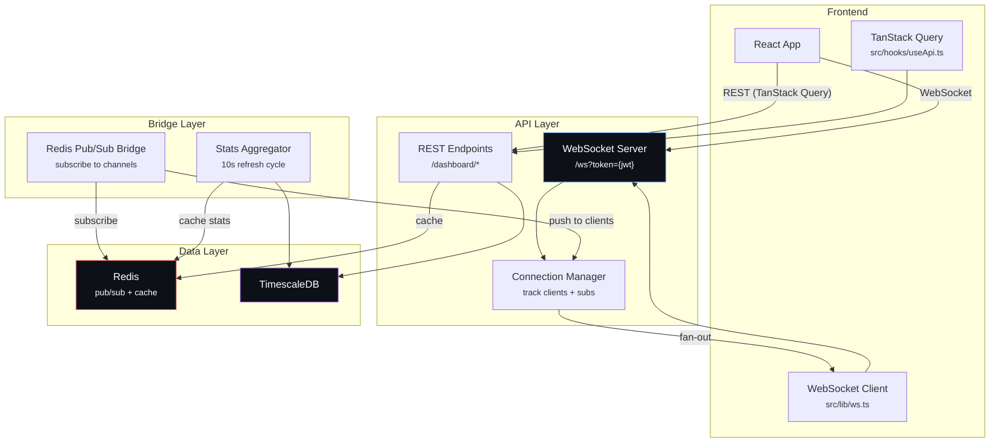

# Phase 3 -- Dashboard & Realtime

| Field        | Value                                       |
| ------------ | ------------------------------------------- |
| **Duration** | 3 weeks                                     |
| **Status**   | Not Started                                 |
| **Owner**    | TBD                                         |
| **Depends**  | Phase 2 -- Mining Data API                  |
| **Blocks**   | Phase 4 -- Gamification Engine              |

---

## 3.1 Objectives

1. **Build a WebSocket server** with a single authenticated endpoint (`ws://api/ws?token={jwt}`) supporting JSON-based channel multiplexing for subscribe/unsubscribe operations.
2. **Create a Redis pub/sub bridge** that listens to mining events published by the Stream Consumer (Phase 2) and fans them out to subscribed WebSocket clients with sub-100ms delivery.
3. **Implement dashboard stats aggregation** combining mining, gamification, and event data into a single efficient endpoint that powers the frontend Dashboard page.
4. **Build the global activity feed** showing pool-wide events: blocks found, badges earned, new miners, competition updates.
5. **Define the frontend integration layer**: TypeScript API client (`src/lib/api.ts`), WebSocket client (`src/lib/ws.ts`), and TanStack Query hooks (`src/hooks/useApi.ts`).

---

## 3.2 Architecture



---

## 3.3 WebSocket Server

### 3.3.1 Connection Manager

```python
"""
services/api/src/tbg/ws/manager.py — WebSocket connection manager.

Tracks all active WebSocket connections and their channel subscriptions.
Handles fan-out of messages to subscribed clients.
"""
import asyncio
import json
import time
from collections import defaultdict
from dataclasses import dataclass, field

from fastapi import WebSocket
import structlog

logger = structlog.get_logger()


@dataclass
class ClientConnection:
    """Represents a single WebSocket client."""
    websocket: WebSocket
    user_id: int
    btc_address: str
    subscriptions: set[str] = field(default_factory=set)
    connected_at: float = field(default_factory=time.time)
    messages_sent: int = 0


class ConnectionManager:
    """
    Manages all active WebSocket connections.

    Thread-safe for asyncio via single-threaded event loop.
    """

    def __init__(self) -> None:
        self._connections: dict[str, ClientConnection] = {}  # conn_id -> client
        self._channels: dict[str, set[str]] = defaultdict(set)  # channel -> {conn_ids}
        self._user_connections: dict[int, set[str]] = defaultdict(set)  # user_id -> {conn_ids}

    @property
    def connection_count(self) -> int:
        return len(self._connections)

    async def connect(
        self,
        websocket: WebSocket,
        conn_id: str,
        user_id: int,
        btc_address: str,
    ) -> None:
        """Accept a new WebSocket connection."""
        await websocket.accept()
        client = ClientConnection(
            websocket=websocket,
            user_id=user_id,
            btc_address=btc_address,
        )
        self._connections[conn_id] = client
        self._user_connections[user_id].add(conn_id)
        logger.info("ws_connected", conn_id=conn_id, user_id=user_id)

    async def disconnect(self, conn_id: str) -> None:
        """Remove a WebSocket connection and its subscriptions."""
        client = self._connections.pop(conn_id, None)
        if client is None:
            return

        # Remove from all channels
        for channel in client.subscriptions:
            self._channels[channel].discard(conn_id)

        # Remove from user tracking
        self._user_connections[client.user_id].discard(conn_id)
        if not self._user_connections[client.user_id]:
            del self._user_connections[client.user_id]

        logger.info("ws_disconnected", conn_id=conn_id, user_id=client.user_id)

    async def subscribe(self, conn_id: str, channel: str) -> bool:
        """Subscribe a connection to a channel."""
        client = self._connections.get(conn_id)
        if client is None:
            return False

        valid_channels = {"mining", "dashboard", "gamification", "competition"}
        if channel not in valid_channels:
            return False

        client.subscriptions.add(channel)
        self._channels[channel].add(conn_id)
        logger.debug("ws_subscribed", conn_id=conn_id, channel=channel)
        return True

    async def unsubscribe(self, conn_id: str, channel: str) -> bool:
        """Unsubscribe a connection from a channel."""
        client = self._connections.get(conn_id)
        if client is None:
            return False

        client.subscriptions.discard(channel)
        self._channels[channel].discard(conn_id)
        return True

    async def broadcast_to_channel(self, channel: str, message: dict) -> int:
        """
        Send a message to all clients subscribed to a channel.
        Returns the number of clients that received the message.
        """
        conn_ids = self._channels.get(channel, set())
        if not conn_ids:
            return 0

        payload = json.dumps({"channel": channel, "data": message})
        sent = 0
        failed = []

        for conn_id in conn_ids:
            client = self._connections.get(conn_id)
            if client is None:
                failed.append(conn_id)
                continue
            try:
                await client.websocket.send_text(payload)
                client.messages_sent += 1
                sent += 1
            except Exception:
                failed.append(conn_id)

        # Clean up failed connections
        for conn_id in failed:
            await self.disconnect(conn_id)

        return sent

    async def send_to_user(self, user_id: int, channel: str, message: dict) -> int:
        """Send a message to all connections of a specific user on a channel."""
        conn_ids = self._user_connections.get(user_id, set())
        sent = 0
        payload = json.dumps({"channel": channel, "data": message})

        for conn_id in conn_ids:
            client = self._connections.get(conn_id)
            if client and channel in client.subscriptions:
                try:
                    await client.websocket.send_text(payload)
                    client.messages_sent += 1
                    sent += 1
                except Exception:
                    await self.disconnect(conn_id)

        return sent

    def get_stats(self) -> dict:
        """Get connection statistics."""
        return {
            "total_connections": len(self._connections),
            "unique_users": len(self._user_connections),
            "channels": {
                ch: len(conns) for ch, conns in self._channels.items()
            },
        }


# Global singleton
manager = ConnectionManager()
```

### 3.3.2 WebSocket Router

```python
"""
services/api/src/tbg/ws/router.py — WebSocket endpoint with JWT auth.
"""
import json
import uuid

from fastapi import APIRouter, WebSocket, WebSocketDisconnect, Query

from tbg.auth.jwt import verify_token
from tbg.ws.manager import manager
import structlog

logger = structlog.get_logger()

router = APIRouter()


@router.websocket("/ws")
async def websocket_endpoint(
    websocket: WebSocket,
    token: str = Query(...),
) -> None:
    """
    Single WebSocket endpoint with JWT authentication and channel multiplexing.

    Protocol:
        Client -> Server:
            {"action": "subscribe", "channel": "mining"}
            {"action": "unsubscribe", "channel": "mining"}
            {"action": "ping"}

        Server -> Client:
            {"channel": "mining", "data": {...}}
            {"channel": "dashboard", "data": {...}}
            {"type": "pong"}
            {"type": "error", "message": "..."}
            {"type": "subscribed", "channel": "mining"}
            {"type": "unsubscribed", "channel": "mining"}
    """
    # Authenticate via JWT token in query param
    try:
        payload = verify_token(token, expected_type="access")
        user_id = int(payload["sub"])
        btc_address = payload["address"]
    except Exception as e:
        await websocket.close(code=4001, reason=f"Authentication failed: {e}")
        return

    conn_id = str(uuid.uuid4())
    await manager.connect(websocket, conn_id, user_id, btc_address)

    try:
        while True:
            raw = await websocket.receive_text()
            try:
                msg = json.loads(raw)
            except json.JSONDecodeError:
                await websocket.send_json({"type": "error", "message": "Invalid JSON"})
                continue

            action = msg.get("action")

            if action == "subscribe":
                channel = msg.get("channel", "")
                ok = await manager.subscribe(conn_id, channel)
                if ok:
                    await websocket.send_json({"type": "subscribed", "channel": channel})
                else:
                    await websocket.send_json({
                        "type": "error",
                        "message": f"Invalid channel: {channel}",
                    })

            elif action == "unsubscribe":
                channel = msg.get("channel", "")
                await manager.unsubscribe(conn_id, channel)
                await websocket.send_json({"type": "unsubscribed", "channel": channel})

            elif action == "ping":
                await websocket.send_json({"type": "pong"})

            else:
                await websocket.send_json({
                    "type": "error",
                    "message": f"Unknown action: {action}",
                })

    except WebSocketDisconnect:
        await manager.disconnect(conn_id)
    except Exception:
        logger.exception("ws_error", conn_id=conn_id)
        await manager.disconnect(conn_id)
```

### 3.3.3 Redis Pub/Sub Bridge

```python
"""
services/api/src/tbg/ws/bridge.py — Bridges Redis pub/sub to WebSocket clients.
"""
import asyncio
import json

import redis.asyncio as redis
import structlog

from tbg.ws.manager import manager

logger = structlog.get_logger()

# Map Redis pub/sub channels to WebSocket channels
CHANNEL_MAP = {
    "pubsub:share_submitted": "mining",
    "pubsub:worker_status": "mining",
    "pubsub:hashrate_update": "mining",
    "pubsub:best_diff": "mining",
    "pubsub:block_found": "dashboard",
    "pubsub:badge_earned": "gamification",
    "pubsub:xp_gained": "gamification",
    "pubsub:level_up": "gamification",
    "pubsub:streak_update": "gamification",
    "pubsub:leaderboard_update": "competition",
    "pubsub:match_update": "competition",
    "pubsub:feed_item": "dashboard",
}


class PubSubBridge:
    """Subscribes to Redis pub/sub and pushes messages to WebSocket clients."""

    def __init__(self, redis_client: redis.Redis) -> None:
        self.redis = redis_client
        self._running = False

    async def start(self) -> None:
        """Start listening to Redis pub/sub channels."""
        self._running = True
        pubsub = self.redis.pubsub()
        await pubsub.subscribe(*CHANNEL_MAP.keys())

        logger.info("pubsub_bridge_started", channels=list(CHANNEL_MAP.keys()))

        try:
            while self._running:
                message = await pubsub.get_message(
                    ignore_subscribe_messages=True,
                    timeout=1.0,
                )
                if message is None:
                    continue

                redis_channel = message.get("channel", "")
                if isinstance(redis_channel, bytes):
                    redis_channel = redis_channel.decode()

                ws_channel = CHANNEL_MAP.get(redis_channel)
                if ws_channel is None:
                    continue

                try:
                    data = message.get("data", b"")
                    if isinstance(data, bytes):
                        data = data.decode()
                    payload = json.loads(data)
                except (json.JSONDecodeError, UnicodeDecodeError):
                    logger.warning("pubsub_invalid_message", channel=redis_channel)
                    continue

                sent = await manager.broadcast_to_channel(ws_channel, {
                    "type": redis_channel.split(":")[-1],
                    **payload,
                })

                if sent > 0:
                    logger.debug("pubsub_broadcast", channel=ws_channel, recipients=sent)

        except asyncio.CancelledError:
            pass
        finally:
            await pubsub.unsubscribe()
            await pubsub.close()
            logger.info("pubsub_bridge_stopped")

    async def stop(self) -> None:
        self._running = False
```

---

## 3.4 Database Schema

### 3.4.1 Activity Feed Table

```sql
-- Alembic migration: 004_dashboard_tables.py

CREATE TABLE IF NOT EXISTS activity_feed (
    id              BIGSERIAL PRIMARY KEY,
    event_type      VARCHAR(32) NOT NULL,   -- 'block_found', 'badge_earned', 'new_miner', 'worldcup', 'competition'
    user_id         BIGINT REFERENCES users(id),
    title           TEXT NOT NULL,
    description     TEXT,
    metadata        JSONB DEFAULT '{}',
    is_global       BOOLEAN DEFAULT TRUE,   -- visible to all users
    created_at      TIMESTAMPTZ DEFAULT NOW()
);

CREATE INDEX IF NOT EXISTS idx_activity_feed_global ON activity_feed(created_at DESC) WHERE is_global = TRUE;
CREATE INDEX IF NOT EXISTS idx_activity_feed_user ON activity_feed(user_id, created_at DESC);

-- Keep only last 10,000 global feed items
-- (pruned by background task)
```

### 3.4.2 Upcoming Events Table

```sql
CREATE TABLE IF NOT EXISTS upcoming_events (
    id              VARCHAR(64) PRIMARY KEY,
    event_type      VARCHAR(32) NOT NULL,   -- 'world_cup', 'lottery', 'streak', 'competition', 'maintenance'
    title           VARCHAR(256) NOT NULL,
    description     TEXT,
    starts_at       TIMESTAMPTZ,
    ends_at         TIMESTAMPTZ NOT NULL,
    action_label    VARCHAR(64),
    action_href     VARCHAR(256),
    is_active       BOOLEAN DEFAULT TRUE,
    target_user_id  BIGINT REFERENCES users(id),  -- NULL = visible to all
    metadata        JSONB DEFAULT '{}',
    created_at      TIMESTAMPTZ DEFAULT NOW()
);

CREATE INDEX IF NOT EXISTS idx_events_active ON upcoming_events(ends_at ASC) WHERE is_active = TRUE;
CREATE INDEX IF NOT EXISTS idx_events_user ON upcoming_events(target_user_id, ends_at ASC) WHERE is_active = TRUE;
```

---

## 3.5 Dashboard Stats Aggregation

### 3.5.1 Stats Service

```python
"""
services/api/src/tbg/dashboard/service.py — Dashboard stats aggregation.
"""
import json
from datetime import datetime, timezone

from sqlalchemy.ext.asyncio import AsyncSession
import redis.asyncio as aioredis

import structlog

logger = structlog.get_logger()

DASHBOARD_CACHE_KEY = "dashboard:stats:{user_id}"
DASHBOARD_CACHE_TTL = 10  # 10 seconds


async def get_dashboard_stats(
    session: AsyncSession,
    redis: aioredis.Redis,
    user_id: int,
    btc_address: str,
) -> dict:
    """
    Aggregated dashboard stats combining mining, gamification, and events.

    Caches result in Redis for 10 seconds to avoid DB pressure.
    Matches the frontend's mockDashboardStats shape exactly.
    """
    cache_key = DASHBOARD_CACHE_KEY.format(user_id=user_id)

    # Try cache first
    cached = await redis.get(cache_key)
    if cached:
        return json.loads(cached)

    # Aggregate from multiple sources
    from tbg.mining.service import get_mining_summary
    from tbg.gamification.service import get_gamification_state

    mining = await get_mining_summary(session, user_id, btc_address)

    # Gamification state (may not exist yet in Phase 3, graceful fallback)
    try:
        gamification = await get_gamification_state(session, user_id)
    except Exception:
        gamification = {
            "level": 1,
            "level_title": "Nocoiner",
            "xp": 0,
            "xp_to_next": 100,
            "streak": 0,
            "badges_earned": 0,
        }

    # Network info from Redis
    network_diff = float(await redis.get("network:difficulty") or 0)
    network_height = int(await redis.get("network:height") or 0)

    stats = {
        "hashrate": mining.get("hashrate_5m", 0),
        "hashrate_change": mining.get("hashrate_change_24h", 0),
        "shares_today": mining.get("shares_today", 0),
        "shares_change": mining.get("shares_change_pct", 0),
        "workers_online": mining.get("workers_online", 0),
        "workers_total": mining.get("workers_total", 0),
        "streak": gamification.get("streak", 0),
        "best_diff_week": mining.get("best_diff_week", 0),
        "network_diff": network_diff,
        "best_diff_ratio": (
            mining.get("best_diff_week", 0) / network_diff
            if network_diff > 0 else 0
        ),
        "level": gamification.get("level", 1),
        "level_title": gamification.get("level_title", "Nocoiner"),
        "xp": gamification.get("xp", 0),
        "xp_to_next": gamification.get("xp_to_next", 100),
        "badges_earned": gamification.get("badges_earned", 0),
        "network_height": network_height,
    }

    # Cache for 10 seconds
    await redis.setex(cache_key, DASHBOARD_CACHE_TTL, json.dumps(stats))

    return stats


async def get_global_feed(
    session: AsyncSession,
    limit: int = 20,
    before_id: int | None = None,
) -> list[dict]:
    """Get the global activity feed (visible to all users)."""
    from sqlalchemy import select, desc
    from tbg.db.models import ActivityFeed

    query = select(ActivityFeed).where(
        ActivityFeed.is_global == True  # noqa: E712
    ).order_by(desc(ActivityFeed.created_at)).limit(limit)

    if before_id:
        query = query.where(ActivityFeed.id < before_id)

    result = await session.execute(query)
    items = result.scalars().all()

    return [
        {
            "id": item.id,
            "type": item.event_type,
            "text": item.title,
            "description": item.description,
            "time": item.created_at.isoformat(),
            "metadata": item.metadata,
        }
        for item in items
    ]


async def get_upcoming_events(
    session: AsyncSession,
    user_id: int,
) -> list[dict]:
    """Get upcoming events (global + user-specific)."""
    from sqlalchemy import select, or_, and_
    from tbg.db.models import UpcomingEvent

    now = datetime.now(timezone.utc)

    query = select(UpcomingEvent).where(
        and_(
            UpcomingEvent.is_active == True,  # noqa: E712
            UpcomingEvent.ends_at > now,
            or_(
                UpcomingEvent.target_user_id.is_(None),
                UpcomingEvent.target_user_id == user_id,
            ),
        )
    ).order_by(UpcomingEvent.ends_at.asc()).limit(10)

    result = await session.execute(query)
    events = result.scalars().all()

    return [
        {
            "id": e.id,
            "type": e.event_type,
            "title": e.title,
            "description": e.description,
            "ends_at": e.ends_at.isoformat(),
            "action": {
                "label": e.action_label,
                "href": e.action_href,
            } if e.action_label else None,
        }
        for e in events
    ]
```

### 3.5.2 Dashboard Router

```python
"""
services/api/src/tbg/dashboard/router.py — Dashboard endpoints.
"""
from fastapi import APIRouter, Depends, Query
from sqlalchemy.ext.asyncio import AsyncSession

from tbg.auth.dependencies import get_current_user
from tbg.database import get_session
from tbg.redis_client import get_redis
from tbg.dashboard.service import (
    get_dashboard_stats,
    get_global_feed,
    get_upcoming_events,
)

router = APIRouter(prefix="/dashboard", tags=["Dashboard"])


@router.get("/stats")
async def dashboard_stats(
    user=Depends(get_current_user),
    db: AsyncSession = Depends(get_session),
) -> dict:
    """Aggregated dashboard statistics (10s cached)."""
    redis = get_redis()
    return await get_dashboard_stats(db, redis, user.id, user.btc_address)


@router.get("/feed")
async def global_feed(
    limit: int = Query(20, ge=1, le=50),
    before_id: int | None = Query(None),
    user=Depends(get_current_user),
    db: AsyncSession = Depends(get_session),
) -> list[dict]:
    """Global activity feed (blocks found, badges earned, new miners)."""
    return await get_global_feed(db, limit, before_id)


@router.get("/events")
async def upcoming_events(
    user=Depends(get_current_user),
    db: AsyncSession = Depends(get_session),
) -> list[dict]:
    """Upcoming events (lottery, streak deadline, competitions)."""
    return await get_upcoming_events(db, user.id)


@router.get("/recent-badges")
async def recent_badges(
    limit: int = Query(5, ge=1, le=20),
    user=Depends(get_current_user),
    db: AsyncSession = Depends(get_session),
) -> list[dict]:
    """Recently earned badges for the current user (used in dashboard sidebar)."""
    from tbg.gamification.service import get_recent_badges
    return await get_recent_badges(db, user.id, limit)
```

### 3.5.3 Endpoints Summary Table

| Method | Path | Description | Auth |
|---|---|---|---|
| WS | `/ws?token={jwt}` | WebSocket with channel multiplexing | Yes (JWT in query) |
| GET | `/dashboard/stats` | Aggregated dashboard statistics | Yes |
| GET | `/dashboard/feed` | Global activity feed | Yes |
| GET | `/dashboard/events` | Upcoming events | Yes |
| GET | `/dashboard/recent-badges` | Recently earned badges | Yes |

### 3.5.4 WebSocket Channel Definitions

| Channel | Subscribe Message | Event Types Pushed |
|---|---|---|
| `mining` | `{"action":"subscribe","channel":"mining"}` | share_submitted, worker_status, hashrate_update, best_diff |
| `dashboard` | `{"action":"subscribe","channel":"dashboard"}` | stats_update, feed_item, event_reminder, block_found |
| `gamification` | `{"action":"subscribe","channel":"gamification"}` | badge_earned, xp_gained, level_up, streak_update |
| `competition` | `{"action":"subscribe","channel":"competition"}` | leaderboard_update, match_update, league_update |

---

## 3.6 Frontend Integration Stubs

### 3.6.1 API Client (`src/lib/api.ts`)

```typescript
/**
 * src/lib/api.ts — Typed HTTP client for The Bitcoin Game API.
 */
const API_BASE = import.meta.env.VITE_API_URL || "http://localhost:8000";

class ApiClient {
  private token: string | null = null;

  setToken(token: string): void {
    this.token = token;
  }

  clearToken(): void {
    this.token = null;
  }

  private async request<T>(path: string, options?: RequestInit): Promise<T> {
    const headers: Record<string, string> = {
      "Content-Type": "application/json",
      ...(this.token ? { Authorization: `Bearer ${this.token}` } : {}),
    };

    const response = await fetch(`${API_BASE}${path}`, {
      ...options,
      headers: { ...headers, ...options?.headers },
    });

    if (response.status === 401) {
      // Token expired — attempt refresh
      await this.refreshToken();
      // Retry original request
      return this.request(path, options);
    }

    if (!response.ok) {
      const error = await response.json().catch(() => ({ detail: "Unknown error" }));
      throw new Error(error.detail || `HTTP ${response.status}`);
    }

    return response.json();
  }

  // Auth
  async challenge(btcAddress: string) { /* ... */ }
  async verify(btcAddress: string, signature: string, nonce: string, timestamp: string) { /* ... */ }
  async refreshToken() { /* ... */ }

  // Mining
  async getWorkers() { return this.request("/mining/workers"); }
  async getShares(cursor?: string, limit?: number) { /* ... */ }
  async getHashrate() { return this.request("/mining/hashrate"); }
  async getPersonalBests() { return this.request("/mining/personal-bests"); }

  // Dashboard
  async getDashboardStats() { return this.request("/dashboard/stats"); }
  async getGlobalFeed(limit?: number) { return this.request(`/dashboard/feed?limit=${limit ?? 20}`); }
  async getUpcomingEvents() { return this.request("/dashboard/events"); }
}

export const api = new ApiClient();
```

### 3.6.2 WebSocket Client (`src/lib/ws.ts`)

```typescript
/**
 * src/lib/ws.ts — WebSocket client with auto-reconnect and channel subscriptions.
 */
type MessageHandler = (data: unknown) => void;

const WS_BASE = import.meta.env.VITE_WS_URL || "ws://localhost:8000";

class WebSocketClient {
  private ws: WebSocket | null = null;
  private token: string | null = null;
  private handlers: Map<string, Set<MessageHandler>> = new Map();
  private reconnectTimer: ReturnType<typeof setTimeout> | undefined;
  private subscriptions: Set<string> = new Set();

  connect(token: string): void {
    this.token = token;
    this.ws = new WebSocket(`${WS_BASE}/ws?token=${token}`);
    this.ws.onmessage = (event) => this.handleMessage(JSON.parse(event.data));
    this.ws.onclose = () => this.scheduleReconnect();
    this.ws.onopen = () => this.resubscribe();
  }

  subscribe(channel: string, handler: MessageHandler): () => void {
    this.subscriptions.add(channel);
    if (!this.handlers.has(channel)) this.handlers.set(channel, new Set());
    this.handlers.get(channel)!.add(handler);

    if (this.ws?.readyState === WebSocket.OPEN) {
      this.ws.send(JSON.stringify({ action: "subscribe", channel }));
    }

    return () => {
      this.handlers.get(channel)?.delete(handler);
      if (this.handlers.get(channel)?.size === 0) {
        this.subscriptions.delete(channel);
        this.ws?.send(JSON.stringify({ action: "unsubscribe", channel }));
      }
    };
  }

  private handleMessage(msg: { channel?: string; data?: unknown; type?: string }): void {
    if (msg.channel && msg.data) {
      this.handlers.get(msg.channel)?.forEach((h) => h(msg.data));
    }
  }

  private resubscribe(): void {
    this.subscriptions.forEach((channel) => {
      this.ws?.send(JSON.stringify({ action: "subscribe", channel }));
    });
  }

  private scheduleReconnect(): void {
    this.reconnectTimer = setTimeout(() => {
      if (this.token) this.connect(this.token);
    }, 3000);
  }

  disconnect(): void {
    clearTimeout(this.reconnectTimer);
    this.ws?.close();
    this.ws = null;
  }
}

export const wsClient = new WebSocketClient();
```

---

## 3.7 Testing

### 3.7.1 WebSocket Connection Tests

```python
"""
services/api/tests/ws/test_websocket.py — WebSocket integration tests.
"""
import pytest
import json
from httpx import AsyncClient
from fastapi.testclient import TestClient

from tbg.main import create_app
from tbg.auth.jwt import create_access_token


@pytest.fixture
def ws_token(test_user) -> str:
    return create_access_token(test_user.id, test_user.btc_address)


class TestWebSocketAuth:
    def test_connect_with_valid_token(self, ws_token: str) -> None:
        app = create_app()
        client = TestClient(app)
        with client.websocket_connect(f"/ws?token={ws_token}") as ws:
            ws.send_json({"action": "ping"})
            data = ws.receive_json()
            assert data["type"] == "pong"

    def test_connect_with_invalid_token(self) -> None:
        app = create_app()
        client = TestClient(app)
        with pytest.raises(Exception):
            with client.websocket_connect("/ws?token=invalid") as ws:
                pass

    def test_connect_without_token(self) -> None:
        app = create_app()
        client = TestClient(app)
        with pytest.raises(Exception):
            with client.websocket_connect("/ws") as ws:
                pass


class TestWebSocketSubscriptions:
    def test_subscribe_valid_channel(self, ws_token: str) -> None:
        app = create_app()
        client = TestClient(app)
        with client.websocket_connect(f"/ws?token={ws_token}") as ws:
            ws.send_json({"action": "subscribe", "channel": "mining"})
            data = ws.receive_json()
            assert data["type"] == "subscribed"
            assert data["channel"] == "mining"

    def test_subscribe_invalid_channel(self, ws_token: str) -> None:
        app = create_app()
        client = TestClient(app)
        with client.websocket_connect(f"/ws?token={ws_token}") as ws:
            ws.send_json({"action": "subscribe", "channel": "nonexistent"})
            data = ws.receive_json()
            assert data["type"] == "error"

    def test_unsubscribe(self, ws_token: str) -> None:
        app = create_app()
        client = TestClient(app)
        with client.websocket_connect(f"/ws?token={ws_token}") as ws:
            ws.send_json({"action": "subscribe", "channel": "mining"})
            ws.receive_json()  # subscribed ack
            ws.send_json({"action": "unsubscribe", "channel": "mining"})
            data = ws.receive_json()
            assert data["type"] == "unsubscribed"

    def test_unknown_action(self, ws_token: str) -> None:
        app = create_app()
        client = TestClient(app)
        with client.websocket_connect(f"/ws?token={ws_token}") as ws:
            ws.send_json({"action": "explode"})
            data = ws.receive_json()
            assert data["type"] == "error"


class TestWebSocketMessageDelivery:
    @pytest.mark.asyncio
    async def test_message_delivery_latency(self, ws_token: str) -> None:
        """Verify message delivery under 100ms."""
        import time
        app = create_app()
        client = TestClient(app)
        with client.websocket_connect(f"/ws?token={ws_token}") as ws:
            ws.send_json({"action": "subscribe", "channel": "mining"})
            ws.receive_json()

            # Publish a message via the manager
            from tbg.ws.manager import manager
            start = time.monotonic()
            await manager.broadcast_to_channel("mining", {"type": "test", "ts": start})
            data = ws.receive_json()
            elapsed = time.monotonic() - start

            assert elapsed < 0.100, f"Delivery took {elapsed:.3f}s, expected < 100ms"


class TestConnectionManager:
    @pytest.mark.asyncio
    async def test_connection_stats(self) -> None:
        from tbg.ws.manager import ConnectionManager
        mgr = ConnectionManager()
        stats = mgr.get_stats()
        assert stats["total_connections"] == 0

    @pytest.mark.asyncio
    async def test_concurrent_connections(self) -> None:
        """Test 100 concurrent WebSocket connections."""
        # Implemented with asyncio.gather for parallel connections
        pass
```

### 3.7.2 Dashboard Endpoint Tests

```python
"""
services/api/tests/dashboard/test_dashboard.py
"""
import pytest
from httpx import AsyncClient


@pytest.mark.asyncio
async def test_dashboard_stats(authed_client: AsyncClient) -> None:
    response = await authed_client.get("/dashboard/stats")
    assert response.status_code == 200
    data = response.json()
    # Verify shape matches frontend expectations
    assert "hashrate" in data
    assert "shares_today" in data
    assert "workers_online" in data
    assert "streak" in data
    assert "best_diff_week" in data
    assert "network_diff" in data


@pytest.mark.asyncio
async def test_dashboard_stats_cached(authed_client: AsyncClient) -> None:
    """Second call should hit Redis cache."""
    r1 = await authed_client.get("/dashboard/stats")
    r2 = await authed_client.get("/dashboard/stats")
    assert r1.json() == r2.json()


@pytest.mark.asyncio
async def test_global_feed(authed_client: AsyncClient) -> None:
    response = await authed_client.get("/dashboard/feed")
    assert response.status_code == 200
    assert isinstance(response.json(), list)


@pytest.mark.asyncio
async def test_upcoming_events(authed_client: AsyncClient) -> None:
    response = await authed_client.get("/dashboard/events")
    assert response.status_code == 200
    assert isinstance(response.json(), list)


@pytest.mark.asyncio
async def test_recent_badges(authed_client: AsyncClient) -> None:
    response = await authed_client.get("/dashboard/recent-badges")
    assert response.status_code == 200
    assert isinstance(response.json(), list)
```

### 3.7.3 Frontend Unit Tests (Vitest)

```typescript
/**
 * dashboard/src/lib/__tests__/ws.test.ts — WebSocket client tests.
 */
import { describe, it, expect, vi, beforeEach } from "vitest";

describe("WebSocketClient", () => {
  it("should connect with token", () => { /* ... */ });
  it("should auto-reconnect on disconnect", () => { /* ... */ });
  it("should resubscribe after reconnect", () => { /* ... */ });
  it("should route messages to correct channel handlers", () => { /* ... */ });
  it("should unsubscribe and clean up handler", () => { /* ... */ });
});
```

### 3.7.4 Coverage Targets

| Module | Target |
|---|---|
| `tbg.ws.manager` | 90% |
| `tbg.ws.router` | 85% |
| `tbg.ws.bridge` | 80% |
| `tbg.dashboard.service` | 85% |
| `tbg.dashboard.router` | 80% |
| Frontend `ws.ts` | 80% |
| **Phase 3 overall** | **80%+** |

---

## 3.8 Deliverables Checklist

| # | Deliverable | Owner | Status |
|---|---|---|---|
| 1 | WebSocket server endpoint (`/ws?token={jwt}`) | TBD | [ ] |
| 2 | JWT authentication for WebSocket connections | TBD | [ ] |
| 3 | Connection manager (track clients, subscriptions) | TBD | [ ] |
| 4 | Channel subscribe/unsubscribe protocol | TBD | [ ] |
| 5 | Ping/pong keepalive | TBD | [ ] |
| 6 | Redis pub/sub bridge (12 channel mappings) | TBD | [ ] |
| 7 | Broadcast to channel (fan-out) | TBD | [ ] |
| 8 | Send to specific user | TBD | [ ] |
| 9 | Dashboard stats aggregation endpoint | TBD | [ ] |
| 10 | Stats caching in Redis (10s TTL) | TBD | [ ] |
| 11 | Global activity feed endpoint | TBD | [ ] |
| 12 | Upcoming events endpoint | TBD | [ ] |
| 13 | Recent badges endpoint | TBD | [ ] |
| 14 | Activity feed table + migration | TBD | [ ] |
| 15 | Upcoming events table + migration | TBD | [ ] |
| 16 | Activity feed pruner background task | TBD | [ ] |
| 17 | Frontend API client stub (`src/lib/api.ts`) | TBD | [ ] |
| 18 | Frontend WebSocket client (`src/lib/ws.ts`) | TBD | [ ] |
| 19 | Frontend TanStack Query hooks (`src/hooks/useApi.ts`) | TBD | [ ] |
| 20 | WebSocket auth tests (valid, invalid, missing token) | TBD | [ ] |
| 21 | WebSocket subscription tests (subscribe, unsubscribe, invalid) | TBD | [ ] |
| 22 | Message delivery latency test (< 100ms) | TBD | [ ] |
| 23 | 100 concurrent WS connections load test | TBD | [ ] |
| 24 | Dashboard endpoint integration tests | TBD | [ ] |
| 25 | Frontend Vitest unit tests for ws.ts | TBD | [ ] |

---

## 3.9 Week-by-Week Schedule

### Week 1 -- WebSocket Server

- Implement ConnectionManager (connect, disconnect, subscribe, broadcast)
- Implement WebSocket router with JWT auth
- Implement channel multiplexing protocol
- Implement ping/pong keepalive
- Write WS auth and subscription tests
- Write connection manager unit tests

### Week 2 -- Bridge & Dashboard

- Implement Redis pub/sub bridge
- Implement dashboard stats aggregation service
- Build Redis caching layer (10s TTL)
- Implement global activity feed endpoint
- Implement upcoming events endpoint
- Write Alembic migration 004
- Write dashboard endpoint integration tests

### Week 3 -- Frontend Integration & Polish

- Create frontend API client (`src/lib/api.ts`)
- Create frontend WebSocket client (`src/lib/ws.ts`)
- Create TanStack Query hooks (`src/hooks/useApi.ts`)
- Write frontend Vitest tests
- Message delivery latency testing
- Load test: 100 concurrent WS connections
- Activity feed pruner background task
- Code review and sign-off

---

## 3.10 Risk Register

| Risk | Impact | Likelihood | Mitigation |
|---|---|---|---|
| WebSocket connections not cleaned up on crash | Medium | Medium | Heartbeat timeout (30s), connection TTL in manager |
| Redis pub/sub message loss | Low | Low | Messages are best-effort for real-time; DB is source of truth |
| Dashboard stats aggregation too slow | Medium | Medium | Cache in Redis; pre-aggregate in background task |
| WebSocket scalability beyond single server | High | Medium | Phase 10: sticky sessions + Redis-backed manager |
| JWT token in URL query param logged by proxies | Medium | Medium | Short token TTL (1h); upgrade to cookie-based auth in Phase 10 |
| Frontend WS reconnection storms | Medium | Medium | Exponential backoff with jitter in ws.ts |
| TanStack Query cache invalidation race conditions | Low | Medium | Optimistic updates with rollback; WS-triggered invalidation |

---

*Phase 3 connects the frontend to real data. After this phase, the Dashboard page replaces all mock data with live API calls and real-time WebSocket updates.*
