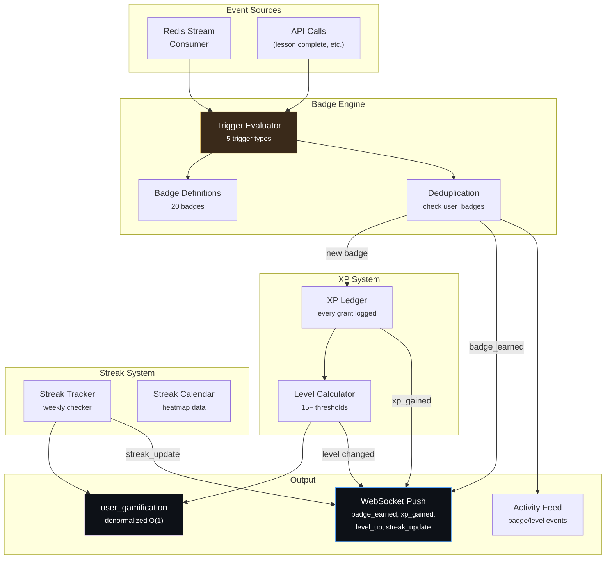

# Phase 4 -- Gamification Engine

| Field        | Value                                                   |
| ------------ | ------------------------------------------------------- |
| **Duration** | 3 weeks                                                 |
| **Status**   | Not Started                                             |
| **Owner**    | TBD                                                     |
| **Depends**  | Phase 2 -- Mining Data, Phase 3 -- Dashboard & Realtime |
| **Blocks**   | Phase 5 -- Games, Phase 6 -- Competitions               |

---

## 4.1 Objectives

1. **Build a badge trigger engine** supporting 5 trigger types (`share_count`, `best_diff`, `streak`, `block_found`, `event`) that processes mining events and awards badges idempotently.
2. **Seed 20 badge definitions** from the frontend's `dashboard/src/mocks/badges.ts` with exact matching slugs, names, descriptions, categories, rarities, and XP rewards.
3. **Implement an XP ledger** where every XP grant is logged with its source, enabling audit trails and the ability to recompute totals from the ledger.
4. **Define level thresholds** (15+ levels) that match the frontend EXACTLY -- if the frontend shows "Level 7: Hash Veteran at 10600 XP", the backend must agree.
5. **Build streak tracking** with ISO weeks (Monday 00:00:00 UTC through Sunday 23:59:59 UTC), a weekly checker that runs on Monday at 00:00 UTC, and a streak calendar for the heatmap visualization.

---

## 4.2 Architecture



---

## 4.3 Badge Trigger Engine

### 4.3.1 Trigger Types

| Trigger Type | Description | Evaluation | Example |
|---|---|---|---|
| `share_count` | Total accepted shares reaches threshold | On every share event, check cumulative count | "Hash Thousand" at 1,000 shares |
| `best_diff` | Best difficulty exceeds threshold | On every `share_best_diff` event | "Billion Club" at 1B diff |
| `streak` | Consecutive weeks of mining | Weekly checker on Monday 00:00 UTC | "Quarter Master" at 12 weeks |
| `block_found` | User finds a Bitcoin block | On `block_found` event | "Block Finder" |
| `event` | Triggered by specific application events | On lesson complete, coop create, etc. | "Down the Rabbit Hole" |

### 4.3.2 Badge Engine Implementation

```python
"""
services/api/src/tbg/gamification/badge_engine.py — Badge trigger processing.

The badge engine evaluates incoming events against badge definitions
and awards badges idempotently. Every badge award also grants XP.
"""
import json
from datetime import datetime, timezone
from typing import Any

from sqlalchemy import select, and_
from sqlalchemy.ext.asyncio import AsyncSession
import redis.asyncio as aioredis
import structlog

from tbg.db.models import BadgeDefinition, UserBadge, User
from tbg.gamification.xp import grant_xp
from tbg.ws.manager import manager

logger = structlog.get_logger()


class BadgeEngine:
    """
    Evaluates events and awards badges.

    Key design decisions:
    - Idempotent: checking user_badges before insert prevents duplicates
    - Ledgered: every XP grant is logged in xp_ledger
    - Real-time: badge_earned pushed via WebSocket immediately
    """

    def __init__(self, session: AsyncSession, redis: aioredis.Redis) -> None:
        self.session = session
        self.redis = redis

    async def process_share_event(
        self,
        user_id: int,
        btc_address: str,
        share_diff: float,
        total_shares: int,
    ) -> list[str]:
        """Process a share submission and check share_count + best_diff triggers."""
        awarded = []

        # --- Share count triggers ---
        share_badges = {
            1: "first_share",
            1_000: "shares_1k",
            1_000_000: "shares_1m",
        }
        for threshold, slug in share_badges.items():
            if total_shares >= threshold:
                if await self._award_if_new(user_id, slug):
                    awarded.append(slug)

        # --- Best difficulty triggers ---
        diff_badges = {
            1_000_000: "diff_1e6",
            1_000_000_000: "diff_1e9",
            1_000_000_000_000: "diff_1e12",
        }
        for threshold, slug in diff_badges.items():
            if share_diff >= threshold:
                if await self._award_if_new(user_id, slug):
                    awarded.append(slug)

        return awarded

    async def process_block_found(
        self,
        user_id: int,
        block_height: int,
        block_hash: str,
    ) -> list[str]:
        """Process a block found event."""
        awarded = []
        if await self._award_if_new(
            user_id,
            "block_finder",
            metadata={"height": block_height, "hash": block_hash},
        ):
            awarded.append("block_finder")
        return awarded

    async def process_streak(
        self,
        user_id: int,
        current_streak: int,
    ) -> list[str]:
        """Process a streak update and check streak triggers."""
        awarded = []

        streak_badges = {
            4: "streak_4",
            12: "streak_12",
            52: "streak_52",
        }
        for threshold, slug in streak_badges.items():
            if current_streak >= threshold:
                if await self._award_if_new(user_id, slug):
                    awarded.append(slug)

        return awarded

    async def process_event_trigger(
        self,
        user_id: int,
        event_slug: str,
        metadata: dict[str, Any] | None = None,
    ) -> list[str]:
        """Process a generic event trigger (lesson complete, coop create, etc.)."""
        awarded = []

        event_badges = {
            "education_track_complete": "rabbit_hole_complete",
            "coop_created": "coop_founder",
            "coop_block_found": "coop_block",
            "gift_sent": "orange_piller",
            "node_verified": "node_runner",
            "node_pruned_verified": "node_pruned",
            "node_archival_verified": "node_archival",
            "worldcup_joined": "world_cup_participant",
            "worldcup_won": "world_cup_winner",
        }

        badge_slug = event_badges.get(event_slug)
        if badge_slug:
            if await self._award_if_new(user_id, badge_slug, metadata=metadata):
                awarded.append(badge_slug)

        return awarded

    async def check_weekly_diff_champion(self) -> str | None:
        """
        Award 'weekly_diff_champion' to the user with the highest
        best_diff of the week. Called by the weekly checker.
        """
        from tbg.db.models import PersonalBest
        now = datetime.now(timezone.utc)
        iso_week = now.strftime("%G-W%V")

        query = (
            select(PersonalBest)
            .where(
                and_(
                    PersonalBest.timeframe == "week",
                    PersonalBest.period_key == iso_week,
                )
            )
            .order_by(PersonalBest.best_difficulty.desc())
            .limit(1)
        )
        result = await self.session.execute(query)
        champion = result.scalar_one_or_none()

        if champion:
            if await self._award_if_new(champion.user_id, "weekly_diff_champion"):
                return "weekly_diff_champion"
        return None

    async def _award_if_new(
        self,
        user_id: int,
        badge_slug: str,
        metadata: dict[str, Any] | None = None,
    ) -> bool:
        """
        Award a badge if the user doesn't already have it.
        Returns True if newly awarded, False if already earned.

        This is the core idempotency guarantee.
        """
        # Check if already earned
        existing = await self.session.execute(
            select(UserBadge).where(
                and_(
                    UserBadge.user_id == user_id,
                    UserBadge.badge_slug == badge_slug,
                )
            )
        )
        if existing.scalar_one_or_none() is not None:
            return False

        # Get badge definition
        badge_def = await self.session.execute(
            select(BadgeDefinition).where(BadgeDefinition.slug == badge_slug)
        )
        badge = badge_def.scalar_one_or_none()
        if badge is None:
            logger.warning("badge_not_found", slug=badge_slug)
            return False

        # Award badge
        now = datetime.now(timezone.utc)
        user_badge = UserBadge(
            user_id=user_id,
            badge_slug=badge_slug,
            earned_at=now,
            metadata=metadata or {},
        )
        self.session.add(user_badge)

        # Grant XP
        await grant_xp(
            session=self.session,
            user_id=user_id,
            amount=badge.xp_reward,
            source="badge",
            reference=badge_slug,
        )

        # Update badge stats
        await self._update_badge_stats(badge_slug)

        # Flush to get IDs
        await self.session.flush()

        # Push WebSocket notification
        await manager.send_to_user(user_id, "gamification", {
            "type": "badge_earned",
            "badge": {
                "slug": badge.slug,
                "name": badge.name,
                "description": badge.description,
                "rarity": badge.rarity,
                "xp_reward": badge.xp_reward,
                "category": badge.category,
            },
            "earned_at": now.isoformat(),
        })

        # Add to activity feed
        from tbg.db.models import ActivityFeed
        feed_item = ActivityFeed(
            event_type="badge_earned",
            user_id=user_id,
            title=f"earned {badge.name} badge",
            metadata={"badge_slug": badge_slug, "rarity": badge.rarity},
            is_global=True,
        )
        self.session.add(feed_item)

        logger.info("badge_awarded", user_id=user_id, badge=badge_slug, xp=badge.xp_reward)
        return True

    async def _update_badge_stats(self, badge_slug: str) -> None:
        """Update badge earn count in badge_stats table."""
        from sqlalchemy import text
        await self.session.execute(
            text("""
                INSERT INTO badge_stats (badge_slug, total_earned, last_earned_at)
                VALUES (:slug, 1, NOW())
                ON CONFLICT (badge_slug) DO UPDATE SET
                    total_earned = badge_stats.total_earned + 1,
                    last_earned_at = NOW()
            """),
            {"slug": badge_slug},
        )
```

---

## 4.4 Database Schema

### 4.4.1 Badge Definitions Table

```sql
-- Alembic migration: 005_gamification_tables.py

CREATE TABLE IF NOT EXISTS badge_definitions (
    slug            VARCHAR(64) PRIMARY KEY,
    name            VARCHAR(128) NOT NULL,
    description     TEXT NOT NULL,
    category        VARCHAR(32) NOT NULL,      -- 'mining', 'streak', 'competition', 'social', 'node'
    rarity          VARCHAR(16) NOT NULL,      -- 'common', 'rare', 'epic', 'legendary'
    xp_reward       INTEGER NOT NULL DEFAULT 50,
    trigger_type    VARCHAR(32) NOT NULL,      -- 'share_count', 'best_diff', 'streak', 'block_found', 'event'
    trigger_config  JSONB DEFAULT '{}',        -- {"threshold": 1000} or {"event": "education_track_complete"}
    icon_url        TEXT,
    sort_order      INTEGER DEFAULT 0,
    is_active       BOOLEAN DEFAULT TRUE,
    created_at      TIMESTAMPTZ DEFAULT NOW()
);

-- Seed all 20 badge definitions
INSERT INTO badge_definitions (slug, name, description, category, rarity, xp_reward, trigger_type, trigger_config, sort_order) VALUES
    ('first_share', 'First Hash', 'Submit your very first share to the pool', 'mining', 'common', 50, 'share_count', '{"threshold": 1}', 1),
    ('shares_1k', 'Hash Thousand', 'Submit 1,000 shares — you''re getting the hang of this', 'mining', 'common', 100, 'share_count', '{"threshold": 1000}', 2),
    ('shares_1m', 'Megahash', 'One million shares submitted. A true mining machine.', 'mining', 'rare', 200, 'share_count', '{"threshold": 1000000}', 3),
    ('block_finder', 'Block Finder', 'Find a Bitcoin block solo. The ultimate achievement.', 'mining', 'legendary', 500, 'block_found', '{}', 4),
    ('diff_1e6', 'Million Club', 'Achieve a best difficulty above 1,000,000', 'mining', 'common', 50, 'best_diff', '{"threshold": 1000000}', 5),
    ('diff_1e9', 'Billion Club', 'Achieve a best difficulty above 1,000,000,000', 'mining', 'rare', 100, 'best_diff', '{"threshold": 1000000000}', 6),
    ('diff_1e12', 'Trillion Club', 'Achieve a best difficulty above 1,000,000,000,000', 'mining', 'epic', 200, 'best_diff', '{"threshold": 1000000000000}', 7),
    ('weekly_diff_champion', 'Diff Champion', 'Achieve the highest difficulty of the week globally', 'mining', 'epic', 300, 'event', '{"event": "weekly_diff_champion"}', 8),
    ('streak_4', 'Month Strong', 'Maintain a 4-week consecutive mining streak', 'streak', 'common', 100, 'streak', '{"threshold": 4}', 9),
    ('streak_12', 'Quarter Master', 'Maintain a 12-week consecutive mining streak', 'streak', 'rare', 200, 'streak', '{"threshold": 12}', 10),
    ('streak_52', 'Year of Mining', 'Mine every single week for an entire year', 'streak', 'legendary', 500, 'streak', '{"threshold": 52}', 11),
    ('node_runner', 'Node Runner', 'Verified running a Bitcoin full node', 'node', 'rare', 150, 'event', '{"event": "node_verified"}', 12),
    ('node_pruned', 'Pruned but Proud', 'Running a pruned Bitcoin node — still counts!', 'node', 'common', 100, 'event', '{"event": "node_pruned_verified"}', 13),
    ('node_archival', 'Archival Node', 'Running a full archival Bitcoin node', 'node', 'epic', 250, 'event', '{"event": "node_archival_verified"}', 14),
    ('world_cup_participant', 'World Cup Miner', 'Participate in any Bitcoin Mining World Cup event', 'competition', 'rare', 200, 'event', '{"event": "worldcup_joined"}', 15),
    ('world_cup_winner', 'World Champion', 'Your country wins the Bitcoin Mining World Cup', 'competition', 'legendary', 500, 'event', '{"event": "worldcup_won"}', 16),
    ('orange_piller', 'Orange Piller', 'Gift a Bitaxe to a nocoiner and bring them into Bitcoin', 'social', 'rare', 200, 'event', '{"event": "gift_sent"}', 17),
    ('rabbit_hole_complete', 'Down the Rabbit Hole', 'Complete an entire education track', 'social', 'common', 150, 'event', '{"event": "education_track_complete"}', 18),
    ('coop_founder', 'Cooperative Founder', 'Create a mining cooperative and rally other miners', 'social', 'rare', 150, 'event', '{"event": "coop_created"}', 19),
    ('coop_block', 'Team Block', 'Your cooperative finds a Bitcoin block together', 'social', 'legendary', 500, 'event', '{"event": "coop_block_found"}', 20)
ON CONFLICT (slug) DO NOTHING;
```

### 4.4.2 User Badges Table

```sql
CREATE TABLE IF NOT EXISTS user_badges (
    id              BIGSERIAL PRIMARY KEY,
    user_id         BIGINT NOT NULL REFERENCES users(id) ON DELETE CASCADE,
    badge_slug      VARCHAR(64) NOT NULL REFERENCES badge_definitions(slug),
    earned_at       TIMESTAMPTZ NOT NULL DEFAULT NOW(),
    metadata        JSONB DEFAULT '{}',
    UNIQUE(user_id, badge_slug)
);

CREATE INDEX IF NOT EXISTS idx_user_badges_user ON user_badges(user_id, earned_at DESC);
CREATE INDEX IF NOT EXISTS idx_user_badges_slug ON user_badges(badge_slug);
```

### 4.4.3 XP Ledger Table

```sql
CREATE TABLE IF NOT EXISTS xp_ledger (
    id              BIGSERIAL PRIMARY KEY,
    user_id         BIGINT NOT NULL REFERENCES users(id) ON DELETE CASCADE,
    amount          INTEGER NOT NULL,
    source          VARCHAR(32) NOT NULL,      -- 'badge', 'share', 'personal_best', 'lesson', 'track', 'streak', 'competition'
    reference       VARCHAR(128),              -- badge slug, lesson ID, etc.
    created_at      TIMESTAMPTZ NOT NULL DEFAULT NOW()
);

CREATE INDEX IF NOT EXISTS idx_xp_ledger_user ON xp_ledger(user_id, created_at DESC);
CREATE INDEX IF NOT EXISTS idx_xp_ledger_source ON xp_ledger(source, created_at DESC);
```

### 4.4.4 User Gamification Table (Denormalized)

```sql
CREATE TABLE IF NOT EXISTS user_gamification (
    user_id             BIGINT PRIMARY KEY REFERENCES users(id) ON DELETE CASCADE,
    total_xp            INTEGER NOT NULL DEFAULT 0,
    level               SMALLINT NOT NULL DEFAULT 1,
    level_title         VARCHAR(64) NOT NULL DEFAULT 'Nocoiner',
    xp_to_next_level    INTEGER NOT NULL DEFAULT 100,
    badges_earned       SMALLINT NOT NULL DEFAULT 0,
    current_streak      SMALLINT NOT NULL DEFAULT 0,
    longest_streak      SMALLINT NOT NULL DEFAULT 0,
    last_streak_week    VARCHAR(8),            -- '2026-W12' (last week with mining activity)
    total_shares_alltime BIGINT NOT NULL DEFAULT 0,
    best_diff_alltime   DOUBLE PRECISION NOT NULL DEFAULT 0,
    updated_at          TIMESTAMPTZ DEFAULT NOW()
);
```

### 4.4.5 Streak Calendar Table

```sql
CREATE TABLE IF NOT EXISTS streak_calendar (
    user_id         BIGINT NOT NULL REFERENCES users(id) ON DELETE CASCADE,
    week_key        VARCHAR(8) NOT NULL,       -- '2026-W12' (ISO week)
    week_start      DATE NOT NULL,
    has_activity    BOOLEAN NOT NULL DEFAULT FALSE,
    share_count     BIGINT DEFAULT 0,
    best_diff       DOUBLE PRECISION DEFAULT 0,
    PRIMARY KEY (user_id, week_key)
);

CREATE INDEX IF NOT EXISTS idx_streak_calendar_user ON streak_calendar(user_id, week_start DESC);
```

### 4.4.6 Badge Stats Table

```sql
CREATE TABLE IF NOT EXISTS badge_stats (
    badge_slug      VARCHAR(64) PRIMARY KEY REFERENCES badge_definitions(slug),
    total_earned    INTEGER NOT NULL DEFAULT 0,
    last_earned_at  TIMESTAMPTZ,
    earn_percentage DOUBLE PRECISION DEFAULT 0  -- % of active users who have this badge
);
```

---

## 4.5 XP System

### 4.5.1 XP Sources and Amounts

| Source | Amount | Trigger | Frequency |
|---|---|---|---|
| `badge` | 50--500 (per badge) | Badge earned | Per badge |
| `share` | 1 | Every 100 accepted shares | High |
| `personal_best` | 50 | New personal best (any timeframe) | Medium |
| `lesson` | 25 | Complete a lesson | Per lesson |
| `track` | 50 | Complete an education track | Per track |
| `streak` | 25 | Weekly streak extended | Weekly |
| `competition` | 200 | Win a competition match | Per match |

### 4.5.2 XP Ledger Implementation

```python
"""
services/api/src/tbg/gamification/xp.py — XP ledger and level computation.
"""
from datetime import datetime, timezone

from sqlalchemy import select, func
from sqlalchemy.ext.asyncio import AsyncSession

from tbg.db.models import XpLedger, UserGamification
from tbg.gamification.levels import compute_level, LEVEL_THRESHOLDS
from tbg.ws.manager import manager

import structlog

logger = structlog.get_logger()


async def grant_xp(
    session: AsyncSession,
    user_id: int,
    amount: int,
    source: str,
    reference: str | None = None,
) -> int:
    """
    Grant XP to a user. Every grant is logged in the ledger.

    Returns the user's new total XP.
    """
    if amount <= 0:
        return 0

    # Log in ledger
    entry = XpLedger(
        user_id=user_id,
        amount=amount,
        source=source,
        reference=reference,
        created_at=datetime.now(timezone.utc),
    )
    session.add(entry)

    # Update denormalized total
    gamification = await _get_or_create_gamification(session, user_id)
    old_level = gamification.level
    old_xp = gamification.total_xp

    gamification.total_xp += amount

    # Recompute level
    new_level, new_title, xp_to_next = compute_level(gamification.total_xp)
    gamification.level = new_level
    gamification.level_title = new_title
    gamification.xp_to_next_level = xp_to_next
    gamification.updated_at = datetime.now(timezone.utc)

    await session.flush()

    # Push XP gained notification
    await manager.send_to_user(user_id, "gamification", {
        "type": "xp_gained",
        "amount": amount,
        "source": source,
        "total_xp": gamification.total_xp,
        "level": new_level,
    })

    # Push level up notification if level changed
    if new_level > old_level:
        await manager.send_to_user(user_id, "gamification", {
            "type": "level_up",
            "old_level": old_level,
            "new_level": new_level,
            "title": new_title,
            "total_xp": gamification.total_xp,
        })

        # Add to activity feed
        from tbg.db.models import ActivityFeed
        feed_item = ActivityFeed(
            event_type="level_up",
            user_id=user_id,
            title=f"reached Level {new_level}: {new_title}",
            is_global=True,
        )
        session.add(feed_item)

        logger.info("level_up", user_id=user_id, old=old_level, new=new_level, title=new_title)

    return gamification.total_xp


async def _get_or_create_gamification(
    session: AsyncSession,
    user_id: int,
) -> UserGamification:
    """Get or create the denormalized gamification row."""
    result = await session.execute(
        select(UserGamification).where(UserGamification.user_id == user_id)
    )
    gamification = result.scalar_one_or_none()

    if gamification is None:
        gamification = UserGamification(
            user_id=user_id,
            total_xp=0,
            level=1,
            level_title="Nocoiner",
            xp_to_next_level=100,
            badges_earned=0,
            current_streak=0,
            longest_streak=0,
        )
        session.add(gamification)
        await session.flush()

    return gamification


async def verify_xp_consistency(session: AsyncSession, user_id: int) -> bool:
    """
    Verify that the denormalized total_xp matches the ledger sum.
    Used by the hourly consistency checker.
    """
    ledger_total = await session.execute(
        select(func.sum(XpLedger.amount)).where(XpLedger.user_id == user_id)
    )
    actual_total = ledger_total.scalar() or 0

    gamification = await _get_or_create_gamification(session, user_id)
    if gamification.total_xp != actual_total:
        logger.warning(
            "xp_inconsistency",
            user_id=user_id,
            denormalized=gamification.total_xp,
            ledger=actual_total,
        )
        gamification.total_xp = actual_total
        new_level, new_title, xp_to_next = compute_level(actual_total)
        gamification.level = new_level
        gamification.level_title = new_title
        gamification.xp_to_next_level = xp_to_next
        return False

    return True
```

### 4.5.3 Level Thresholds

```python
"""
services/api/src/tbg/gamification/levels.py — Level thresholds.

CRITICAL: These MUST match the frontend exactly.
If the frontend shows "Level 7: Hash Veteran at 10600 XP", this file must agree.
"""

# (level, title, xp_threshold)
LEVEL_THRESHOLDS: list[tuple[int, str, int]] = [
    (1, "Nocoiner", 0),
    (2, "Curious Cat", 100),
    (3, "Hash Pupil", 600),
    (4, "Solo Miner", 1_600),
    (5, "Difficulty Hunter", 4_100),
    (6, "Share Collector", 7_100),
    (7, "Hash Veteran", 10_600),
    (8, "Block Chaser", 14_600),
    (9, "Nonce Grinder", 19_600),
    (10, "Hashrate Warrior", 29_600),
    (15, "Diff Hunter", 79_600),
    (20, "Mining Veteran", 179_600),
    (25, "Satoshi's Apprentice", 429_600),
    (30, "Cypherpunk", 929_600),
    (50, "Timechain Guardian", 4_929_600),
]


def compute_level(total_xp: int) -> tuple[int, str, int]:
    """
    Compute level, title, and XP remaining to next level.

    Args:
        total_xp: User's total XP

    Returns:
        (level, title, xp_to_next_level)
    """
    current_level = 1
    current_title = "Nocoiner"
    xp_for_next = 100  # XP needed for level 2

    for i, (level, title, threshold) in enumerate(LEVEL_THRESHOLDS):
        if total_xp >= threshold:
            current_level = level
            current_title = title
            # XP to next level
            if i + 1 < len(LEVEL_THRESHOLDS):
                xp_for_next = LEVEL_THRESHOLDS[i + 1][2] - total_xp
            else:
                xp_for_next = 0  # Max level
        else:
            xp_for_next = threshold - total_xp
            break

    return current_level, current_title, max(0, xp_for_next)
```

---

## 4.6 Streak System

### 4.6.1 Streak Tracker

```python
"""
services/api/src/tbg/gamification/streaks.py — Weekly streak tracking.

Streak definition:
  - A "week" is Monday 00:00:00 UTC through Sunday 23:59:59 UTC (ISO week)
  - A user has "activity" in a week if they submitted at least 1 accepted share
  - The streak is the count of consecutive weeks with activity
  - The streak checker runs on Monday at 00:00 UTC
  - If a user had no activity in the previous week, their streak resets to 0
"""
from datetime import datetime, date, timedelta, timezone

from sqlalchemy import select, func, and_, update
from sqlalchemy.ext.asyncio import AsyncSession

from tbg.db.models import StreakCalendar, UserGamification, Share, User
from tbg.gamification.badge_engine import BadgeEngine
from tbg.gamification.xp import grant_xp
from tbg.ws.manager import manager

import structlog

logger = structlog.get_logger()


def get_iso_week_key(dt: datetime | date) -> str:
    """Get ISO week key like '2026-W12'."""
    if isinstance(dt, datetime):
        dt = dt.date()
    return dt.strftime("%G-W%V")


def get_week_start(dt: datetime | date) -> date:
    """Get Monday (start of ISO week) for a given date."""
    if isinstance(dt, datetime):
        dt = dt.date()
    return dt - timedelta(days=dt.weekday())


async def update_streak_calendar(
    session: AsyncSession,
    user_id: int,
    btc_address: str,
) -> None:
    """
    Update the streak calendar for the current week.
    Called periodically or on share submission.
    """
    now = datetime.now(timezone.utc)
    week_key = get_iso_week_key(now)
    week_start = get_week_start(now)

    # Check if entry exists
    result = await session.execute(
        select(StreakCalendar).where(
            and_(
                StreakCalendar.user_id == user_id,
                StreakCalendar.week_key == week_key,
            )
        )
    )
    entry = result.scalar_one_or_none()

    if entry is None:
        # Count shares this week
        week_start_dt = datetime.combine(week_start, datetime.min.time(), timezone.utc)
        share_query = select(
            func.count().label("count"),
            func.max(Share.share_diff).label("best"),
        ).where(
            and_(
                Share.btc_address == btc_address,
                Share.time >= week_start_dt,
                Share.is_valid == True,  # noqa: E712
            )
        )
        share_result = await session.execute(share_query)
        row = share_result.one()

        entry = StreakCalendar(
            user_id=user_id,
            week_key=week_key,
            week_start=week_start,
            has_activity=row.count > 0,
            share_count=row.count,
            best_diff=row.best or 0,
        )
        session.add(entry)
    else:
        # Update existing entry
        entry.has_activity = True
        entry.share_count = (entry.share_count or 0) + 1

    await session.flush()


async def run_weekly_streak_check(session: AsyncSession, redis) -> int:
    """
    Weekly streak checker. Runs every Monday at 00:00 UTC.

    For every active user:
    1. Check if they had activity in the previous week
    2. If yes: increment streak, grant streak XP, check streak badges
    3. If no: reset streak to 0

    Returns the number of users processed.
    """
    now = datetime.now(timezone.utc)
    prev_week_key = get_iso_week_key(now - timedelta(weeks=1))

    # Get all users with gamification state
    users_query = select(UserGamification)
    result = await session.execute(users_query)
    users = result.scalars().all()

    badge_engine = BadgeEngine(session, redis)
    processed = 0

    for gam in users:
        # Check if user had activity last week
        cal_result = await session.execute(
            select(StreakCalendar).where(
                and_(
                    StreakCalendar.user_id == gam.user_id,
                    StreakCalendar.week_key == prev_week_key,
                    StreakCalendar.has_activity == True,  # noqa: E712
                )
            )
        )
        had_activity = cal_result.scalar_one_or_none() is not None

        if had_activity:
            # Extend streak
            gam.current_streak += 1
            gam.last_streak_week = prev_week_key

            if gam.current_streak > gam.longest_streak:
                gam.longest_streak = gam.current_streak

            # Grant streak XP
            await grant_xp(session, gam.user_id, 25, "streak", f"week-{prev_week_key}")

            # Check streak badges
            await badge_engine.process_streak(gam.user_id, gam.current_streak)

            # Push notification
            await manager.send_to_user(gam.user_id, "gamification", {
                "type": "streak_update",
                "streak": gam.current_streak,
                "longest": gam.longest_streak,
                "week": prev_week_key,
            })
        else:
            # Reset streak
            if gam.current_streak > 0:
                logger.info(
                    "streak_broken",
                    user_id=gam.user_id,
                    was=gam.current_streak,
                )
                gam.current_streak = 0

                await manager.send_to_user(gam.user_id, "gamification", {
                    "type": "streak_update",
                    "streak": 0,
                    "broken": True,
                })

        gam.updated_at = datetime.now(timezone.utc)
        processed += 1

    await session.commit()
    logger.info("streak_check_complete", users=processed)
    return processed


async def get_streak_calendar(
    session: AsyncSession,
    user_id: int,
    weeks: int = 52,
) -> list[dict]:
    """Get streak calendar data for heatmap visualization."""
    query = (
        select(StreakCalendar)
        .where(StreakCalendar.user_id == user_id)
        .order_by(StreakCalendar.week_start.desc())
        .limit(weeks)
    )
    result = await session.execute(query)
    entries = result.scalars().all()

    return [
        {
            "week": e.week_key,
            "week_start": e.week_start.isoformat(),
            "has_activity": e.has_activity,
            "share_count": e.share_count,
            "best_diff": e.best_diff,
        }
        for e in reversed(entries)
    ]
```

---

## 4.7 API Endpoints

### 4.7.1 Gamification Router

```python
"""
services/api/src/tbg/gamification/router.py — Gamification endpoints.
"""
from fastapi import APIRouter, Depends, Query
from sqlalchemy.ext.asyncio import AsyncSession

from tbg.auth.dependencies import get_current_user
from tbg.database import get_session
from tbg.gamification.service import (
    get_badge_catalog,
    get_badge_detail,
    get_earned_badges,
    get_xp_summary,
    get_xp_history,
    get_gamification_state,
    get_all_levels,
)
from tbg.gamification.streaks import get_streak_calendar

router = APIRouter(prefix="/gamification", tags=["Gamification"])


@router.get("/badges")
async def badge_catalog(
    category: str | None = Query(None),
    db: AsyncSession = Depends(get_session),
) -> list[dict]:
    """Get the full badge catalog with earn percentages."""
    return await get_badge_catalog(db, category)


@router.get("/badges/{slug}")
async def badge_detail(
    slug: str,
    db: AsyncSession = Depends(get_session),
) -> dict:
    """Get details for a specific badge including recent earners."""
    return await get_badge_detail(db, slug)


@router.get("/badges/earned")
async def earned_badges(
    user=Depends(get_current_user),
    db: AsyncSession = Depends(get_session),
) -> list[dict]:
    """Get all badges earned by the current user."""
    return await get_earned_badges(db, user.id)


@router.get("/xp")
async def xp_summary(
    user=Depends(get_current_user),
    db: AsyncSession = Depends(get_session),
) -> dict:
    """Get XP summary (total, level, progress to next level)."""
    return await get_xp_summary(db, user.id)


@router.get("/xp/history")
async def xp_history(
    limit: int = Query(50, ge=1, le=200),
    user=Depends(get_current_user),
    db: AsyncSession = Depends(get_session),
) -> list[dict]:
    """Get XP ledger history (most recent grants)."""
    return await get_xp_history(db, user.id, limit)


@router.get("/streak")
async def streak_info(
    user=Depends(get_current_user),
    db: AsyncSession = Depends(get_session),
) -> dict:
    """Get current and longest streak info."""
    state = await get_gamification_state(db, user.id)
    return {
        "current_streak": state.get("current_streak", 0),
        "longest_streak": state.get("longest_streak", 0),
        "last_active_week": state.get("last_streak_week"),
    }


@router.get("/streak/calendar")
async def streak_calendar(
    weeks: int = Query(52, ge=4, le=104),
    user=Depends(get_current_user),
    db: AsyncSession = Depends(get_session),
) -> list[dict]:
    """Get streak calendar for heatmap (up to 104 weeks)."""
    return await get_streak_calendar(db, user.id, weeks)


@router.get("/state")
async def gamification_state(
    user=Depends(get_current_user),
    db: AsyncSession = Depends(get_session),
) -> dict:
    """Get full gamification state (combines XP, level, streak, badges)."""
    return await get_gamification_state(db, user.id)


@router.get("/levels")
async def level_definitions() -> list[dict]:
    """Get all level definitions and thresholds."""
    return await get_all_levels()
```

### 4.7.2 Endpoints Summary Table

| Method | Path | Description | Auth |
|---|---|---|---|
| GET | `/gamification/badges` | Full badge catalog | No |
| GET | `/gamification/badges/{slug}` | Badge detail + recent earners | No |
| GET | `/gamification/badges/earned` | User's earned badges | Yes |
| GET | `/gamification/xp` | XP summary (total, level, progress) | Yes |
| GET | `/gamification/xp/history` | XP ledger history | Yes |
| GET | `/gamification/streak` | Current/longest streak | Yes |
| GET | `/gamification/streak/calendar` | Streak calendar heatmap | Yes |
| GET | `/gamification/state` | Full gamification state | Yes |
| GET | `/gamification/levels` | Level definitions and thresholds | No |

---

## 4.8 Testing

### 4.8.1 Badge Trigger Unit Tests

```python
"""
services/api/tests/gamification/test_badge_engine.py
"""
import pytest
from unittest.mock import AsyncMock, patch
from tbg.gamification.badge_engine import BadgeEngine


@pytest.mark.asyncio
class TestShareCountTriggers:
    async def test_first_share(self, db_session, redis_client, test_user) -> None:
        engine = BadgeEngine(db_session, redis_client)
        awarded = await engine.process_share_event(
            user_id=test_user.id,
            btc_address=test_user.btc_address,
            share_diff=1000,
            total_shares=1,
        )
        assert "first_share" in awarded

    async def test_1k_shares(self, db_session, redis_client, test_user) -> None:
        engine = BadgeEngine(db_session, redis_client)
        awarded = await engine.process_share_event(
            user_id=test_user.id,
            btc_address=test_user.btc_address,
            share_diff=1000,
            total_shares=1000,
        )
        assert "shares_1k" in awarded

    async def test_below_threshold_no_badge(self, db_session, redis_client, test_user) -> None:
        engine = BadgeEngine(db_session, redis_client)
        awarded = await engine.process_share_event(
            user_id=test_user.id,
            btc_address=test_user.btc_address,
            share_diff=1000,
            total_shares=999,
        )
        assert "shares_1k" not in awarded


@pytest.mark.asyncio
class TestBestDiffTriggers:
    async def test_million_club(self, db_session, redis_client, test_user) -> None:
        engine = BadgeEngine(db_session, redis_client)
        awarded = await engine.process_share_event(
            user_id=test_user.id,
            btc_address=test_user.btc_address,
            share_diff=1_500_000,
            total_shares=100,
        )
        assert "diff_1e6" in awarded

    async def test_billion_club(self, db_session, redis_client, test_user) -> None:
        engine = BadgeEngine(db_session, redis_client)
        awarded = await engine.process_share_event(
            user_id=test_user.id,
            btc_address=test_user.btc_address,
            share_diff=2_000_000_000,
            total_shares=100,
        )
        assert "diff_1e9" in awarded
        assert "diff_1e6" in awarded  # Also awards lower tiers


@pytest.mark.asyncio
class TestBlockFoundTrigger:
    async def test_block_finder_badge(self, db_session, redis_client, test_user) -> None:
        engine = BadgeEngine(db_session, redis_client)
        awarded = await engine.process_block_found(
            user_id=test_user.id,
            block_height=850001,
            block_hash="0000000000000000000234abc",
        )
        assert "block_finder" in awarded


@pytest.mark.asyncio
class TestDuplicatePrevention:
    async def test_same_badge_not_awarded_twice(self, db_session, redis_client, test_user) -> None:
        engine = BadgeEngine(db_session, redis_client)
        # First award
        awarded1 = await engine.process_share_event(
            user_id=test_user.id,
            btc_address=test_user.btc_address,
            share_diff=1000,
            total_shares=1,
        )
        assert "first_share" in awarded1
        await db_session.commit()

        # Second call — should NOT award again
        awarded2 = await engine.process_share_event(
            user_id=test_user.id,
            btc_address=test_user.btc_address,
            share_diff=1000,
            total_shares=2,
        )
        assert "first_share" not in awarded2
```

### 4.8.2 Level Computation Tests

```python
"""
services/api/tests/gamification/test_levels.py — Level threshold tests.

CRITICAL: These must match the frontend EXACTLY.
"""
import pytest
from tbg.gamification.levels import compute_level, LEVEL_THRESHOLDS


class TestLevelThresholds:
    @pytest.mark.parametrize("xp,expected_level,expected_title", [
        (0, 1, "Nocoiner"),
        (50, 1, "Nocoiner"),
        (100, 2, "Curious Cat"),
        (599, 2, "Curious Cat"),
        (600, 3, "Hash Pupil"),
        (1_600, 4, "Solo Miner"),
        (4_100, 5, "Difficulty Hunter"),
        (7_100, 6, "Share Collector"),
        (10_600, 7, "Hash Veteran"),
        (14_600, 8, "Block Chaser"),
        (19_600, 9, "Nonce Grinder"),
        (29_600, 10, "Hashrate Warrior"),
        (79_600, 15, "Diff Hunter"),
        (179_600, 20, "Mining Veteran"),
        (429_600, 25, "Satoshi's Apprentice"),
        (929_600, 30, "Cypherpunk"),
        (4_929_600, 50, "Timechain Guardian"),
        (10_000_000, 50, "Timechain Guardian"),
    ])
    def test_level_at_xp(self, xp: int, expected_level: int, expected_title: str) -> None:
        level, title, _ = compute_level(xp)
        assert level == expected_level, f"At {xp} XP: expected level {expected_level}, got {level}"
        assert title == expected_title, f"At {xp} XP: expected '{expected_title}', got '{title}'"

    def test_xp_to_next_level_at_zero(self) -> None:
        _, _, xp_to_next = compute_level(0)
        assert xp_to_next == 100  # Need 100 XP for level 2

    def test_xp_to_next_level_at_boundary(self) -> None:
        _, _, xp_to_next = compute_level(100)
        assert xp_to_next == 500  # Need 500 more for level 3 (at 600)

    def test_xp_to_next_level_at_max(self) -> None:
        _, _, xp_to_next = compute_level(5_000_000)
        assert xp_to_next == 0  # Max level reached

    def test_thresholds_are_sorted(self) -> None:
        thresholds = [t[2] for t in LEVEL_THRESHOLDS]
        assert thresholds == sorted(thresholds)

    def test_all_levels_have_unique_thresholds(self) -> None:
        thresholds = [t[2] for t in LEVEL_THRESHOLDS]
        assert len(thresholds) == len(set(thresholds))
```

### 4.8.3 Streak Boundary Tests

```python
"""
services/api/tests/gamification/test_streaks.py — Streak boundary tests.
"""
import pytest
from datetime import datetime, date, timedelta, timezone
from tbg.gamification.streaks import (
    get_iso_week_key,
    get_week_start,
    run_weekly_streak_check,
)


class TestWeekBoundaries:
    def test_monday_is_week_start(self) -> None:
        # Monday 2026-03-16
        dt = date(2026, 3, 16)
        assert dt.weekday() == 0  # Monday
        assert get_week_start(dt) == dt

    def test_sunday_maps_to_previous_monday(self) -> None:
        # Sunday 2026-03-22
        dt = date(2026, 3, 22)
        assert dt.weekday() == 6  # Sunday
        assert get_week_start(dt) == date(2026, 3, 16)

    def test_wednesday_maps_to_monday(self) -> None:
        dt = date(2026, 3, 18)
        assert get_week_start(dt) == date(2026, 3, 16)

    def test_iso_week_key_format(self) -> None:
        dt = date(2026, 3, 16)
        key = get_iso_week_key(dt)
        assert key == "2026-W12"

    def test_year_boundary_week(self) -> None:
        # Dec 29, 2025 (Monday) is ISO week 2026-W01 in some years
        # Verify the function handles this correctly
        dt = date(2025, 12, 29)
        key = get_iso_week_key(dt)
        assert key.startswith("202")  # Valid ISO week

    def test_utc_midnight_boundary(self) -> None:
        # 23:59:59 UTC Sunday should still be in the current week
        dt = datetime(2026, 3, 22, 23, 59, 59, tzinfo=timezone.utc)
        assert get_iso_week_key(dt) == "2026-W12"

        # 00:00:00 UTC Monday should be the NEXT week
        dt_next = datetime(2026, 3, 23, 0, 0, 0, tzinfo=timezone.utc)
        assert get_iso_week_key(dt_next) == "2026-W13"


@pytest.mark.asyncio
class TestStreakChecker:
    async def test_streak_extends_with_activity(self, db_session, redis_client, test_user_with_gamification) -> None:
        # Setup: user has streak of 3, had activity last week
        # Run checker
        # Assert: streak is now 4
        pass

    async def test_streak_resets_without_activity(self, db_session, redis_client, test_user_with_gamification) -> None:
        # Setup: user has streak of 5, NO activity last week
        # Run checker
        # Assert: streak is now 0
        pass

    async def test_streak_badge_awarded_at_threshold(self, db_session, redis_client, test_user_with_gamification) -> None:
        # Setup: user has streak of 3, had activity last week
        # Run checker -> streak becomes 4
        # Assert: "streak_4" badge awarded
        pass

    async def test_streak_xp_granted_weekly(self, db_session, redis_client, test_user_with_gamification) -> None:
        # Run checker for user with activity
        # Assert: 25 XP granted with source="streak"
        pass
```

### 4.8.4 Integration Test: Full Event to Badge to XP Pipeline

```python
"""
services/api/tests/gamification/test_integration.py — Full pipeline test.
"""
import pytest


@pytest.mark.asyncio
async def test_share_event_triggers_badge_grants_xp_pushes_ws(
    db_session, redis_client, test_user,
) -> None:
    """
    Full integration test:
    1. Process a share event
    2. Badge engine awards "first_share"
    3. XP ledger records 50 XP
    4. User gamification state updated
    5. WebSocket notification pushed
    """
    from tbg.gamification.badge_engine import BadgeEngine
    from tbg.db.models import XpLedger, UserGamification
    from sqlalchemy import select, func

    engine = BadgeEngine(db_session, redis_client)

    # Process first share
    awarded = await engine.process_share_event(
        user_id=test_user.id,
        btc_address=test_user.btc_address,
        share_diff=1_500_000,
        total_shares=1,
    )
    await db_session.commit()

    # Verify badges awarded
    assert "first_share" in awarded
    assert "diff_1e6" in awarded  # 1.5M > 1M threshold

    # Verify XP ledger
    xp_total = await db_session.execute(
        select(func.sum(XpLedger.amount)).where(XpLedger.user_id == test_user.id)
    )
    total = xp_total.scalar()
    assert total == 100  # 50 (first_share) + 50 (diff_1e6)

    # Verify gamification state
    gam = await db_session.execute(
        select(UserGamification).where(UserGamification.user_id == test_user.id)
    )
    state = gam.scalar_one()
    assert state.total_xp == 100
    assert state.badges_earned >= 2
    assert state.level == 2  # 100 XP = Level 2 "Curious Cat"
```

### 4.8.5 Coverage Targets

| Module | Target |
|---|---|
| `tbg.gamification.badge_engine` | 95% |
| `tbg.gamification.xp` | 95% |
| `tbg.gamification.levels` | 100% |
| `tbg.gamification.streaks` | 90% |
| `tbg.gamification.router` | 85% |
| `tbg.gamification.service` | 85% |
| **Phase 4 overall** | **90%+** |

---

## 4.9 Deliverables Checklist

| # | Deliverable | Owner | Status |
|---|---|---|---|
| 1 | Badge definitions table with 20 seeded badges | TBD | [ ] |
| 2 | User badges table with idempotent award logic | TBD | [ ] |
| 3 | Badge engine: share_count trigger | TBD | [ ] |
| 4 | Badge engine: best_diff trigger | TBD | [ ] |
| 5 | Badge engine: streak trigger | TBD | [ ] |
| 6 | Badge engine: block_found trigger | TBD | [ ] |
| 7 | Badge engine: event trigger (generic) | TBD | [ ] |
| 8 | Duplicate badge prevention (idempotent) | TBD | [ ] |
| 9 | XP ledger table (every grant logged) | TBD | [ ] |
| 10 | XP grant function with level recomputation | TBD | [ ] |
| 11 | Level thresholds (15 levels, matches frontend EXACTLY) | TBD | [ ] |
| 12 | Level-up WebSocket notification | TBD | [ ] |
| 13 | User gamification denormalized table | TBD | [ ] |
| 14 | Streak calendar table | TBD | [ ] |
| 15 | Streak tracker (weekly check, Mon 00:00 UTC) | TBD | [ ] |
| 16 | Streak extend/break logic | TBD | [ ] |
| 17 | Streak XP grant (25 per week) | TBD | [ ] |
| 18 | Badge stats table (earn percentage) | TBD | [ ] |
| 19 | Badge catalog endpoint (with earn percentages) | TBD | [ ] |
| 20 | Badge detail endpoint (with recent earners) | TBD | [ ] |
| 21 | Earned badges endpoint | TBD | [ ] |
| 22 | XP summary endpoint | TBD | [ ] |
| 23 | XP history endpoint (ledger) | TBD | [ ] |
| 24 | Streak info + calendar endpoints | TBD | [ ] |
| 25 | Full gamification state endpoint | TBD | [ ] |
| 26 | Levels definition endpoint | TBD | [ ] |
| 27 | Alembic migration 005 (gamification tables) | TBD | [ ] |
| 28 | Badge trigger unit tests (all 5 types) | TBD | [ ] |
| 29 | Level computation tests (matching frontend EXACTLY) | TBD | [ ] |
| 30 | Streak boundary tests (UTC midnight, year boundary) | TBD | [ ] |
| 31 | Full pipeline integration test (event -> badge -> XP -> WS) | TBD | [ ] |
| 32 | Duplicate badge prevention test | TBD | [ ] |
| 33 | XP consistency verification task | TBD | [ ] |
| 34 | 90%+ coverage on gamification module | TBD | [ ] |

---

## 4.10 Week-by-Week Schedule

### Week 1 -- Badge Engine & XP

- Create Alembic migration 005 (all 6 gamification tables)
- Seed 20 badge definitions
- Implement badge engine with all 5 trigger types
- Implement idempotent award logic
- Implement XP ledger and grant function
- Implement level thresholds (must match frontend)
- Write badge trigger unit tests
- Write level computation tests

### Week 2 -- Streaks & Notifications

- Implement streak calendar tracking
- Build weekly streak checker (Monday 00:00 UTC)
- Implement streak extend/break logic
- Implement streak XP grant
- Wire badge/XP/level notifications to WebSocket
- Wire events to activity feed
- Write streak boundary tests
- Write full pipeline integration test

### Week 3 -- Endpoints & Polish

- Implement all 9 gamification endpoints
- Build badge catalog with earn percentages
- Build badge detail with recent earners
- Implement XP history endpoint
- Implement gamification state endpoint
- Build XP consistency verification task
- Implement badge stats updater
- Write endpoint integration tests
- Achieve 90%+ coverage
- Code review and sign-off

---

## 4.11 Risk Register

| Risk | Impact | Likelihood | Mitigation |
|---|---|---|---|
| Badge engine processes same event twice (duplicate badge) | High | Medium | Unique constraint on (user_id, badge_slug); check before insert |
| Level thresholds drift from frontend | High | Medium | Unit test each threshold; shared JSON config (future) |
| Streak checker misses UTC boundary | High | Low | Extensive boundary tests; run at 00:05 not 00:00; idempotent |
| XP ledger grows unbounded | Medium | Low | Archival policy after 1 year; summary table for fast reads |
| Badge engine blocks on WebSocket push | Medium | Low | Fire-and-forget WS push; timeout after 1s |
| Streak calendar gaps (user joins mid-year) | Low | Medium | Only create entries for weeks with activity; no backfill needed |
| badge_stats earn_percentage drifts | Low | Medium | Recompute in background task weekly; cache in Redis |
| Event trigger race condition (two requests grant same badge) | Medium | Low | Database UNIQUE constraint is the final guard; SELECT before INSERT |

---

*Phase 4 is the heart of the gamification platform. Every mining event now has meaning: shares grant XP, difficulties unlock badges, consistency earns streaks, and finding a block triggers the ultimate celebration.*
