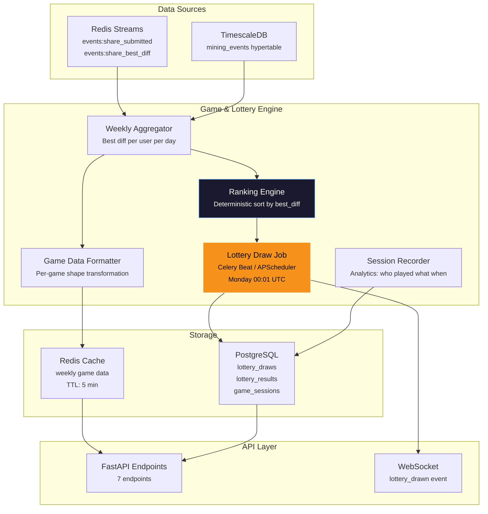
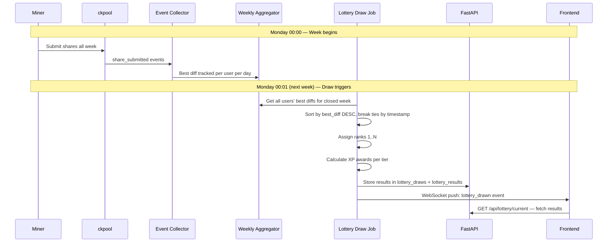

# Phase 5 — Games & Weekly Lottery System

| Field        | Value                                          |
| ------------ | ---------------------------------------------- |
| **Duration** | 4 weeks                                        |
| **Status**   | Not Started                                    |
| **Owner**    | TBD                                            |
| **Depends**  | Phase 4 — Gamification Engine (XP, Badges, Streaks) |
| **Blocks**   | Phase 6 — Competition & Leaderboards           |

---

## 5.1 Objectives

1. **Build a deterministic weekly lottery system** that ranks all participants by their best difficulty share each week — no randomness, pure mining performance.
2. **Serve game-specific data endpoints** so each frontend game (Hammer, Horse Race, Slots, Scratch Card) receives the user's weekly mining data in the exact shape it needs.
3. **Record game session analytics** to track when users play games, which games are most popular, and correlate engagement with mining activity.
4. **Award XP based on weekly lottery ranking** — Top 10 earns 100 XP, Top 50 earns 50 XP, Top 100 earns 25 XP, and all participants earn 10 XP.
5. **Automate the weekly draw cycle** via a scheduled job that runs every Monday at 00:01 UTC, closing the previous week's lottery and opening the new one.

---

## 5.2 Architecture Overview



---

## 5.3 Weekly Lottery System

### 5.3.1 Lottery Mechanics

The lottery is **deterministic** — there is no randomness. Every user who submits at least one share during the week (Monday 00:00 UTC to Sunday 23:59:59 UTC) automatically enters the lottery. Users are ranked by their single best difficulty share of the week. Ties are broken by timestamp (earlier submission wins).



### 5.3.2 XP Award Tiers

| Rank Range | XP Awarded | Label            |
|------------|------------|------------------|
| 1–10       | 100 XP     | Top 10           |
| 11–50      | 50 XP      | Top 50           |
| 51–100     | 25 XP      | Top 100          |
| 101+       | 10 XP      | Participated     |
| 0 shares   | 0 XP       | Did not mine     |

### 5.3.3 Weekly Draw Job Implementation

```python
"""
lottery_draw.py — Automated weekly lottery draw.

Runs every Monday at 00:01 UTC via APScheduler or Celery Beat.
Deterministic: ranks all participants by best difficulty, awards XP.
"""

import logging
from datetime import datetime, timedelta, timezone
from uuid import uuid4

from sqlalchemy.ext.asyncio import AsyncSession
from sqlalchemy import select, func, text

from app.models.lottery import LotteryDraw, LotteryResult
from app.models.gamification import XPTransaction
from app.services.xp_engine import award_xp
from app.services.notification_service import notify_user
from app.services.websocket_manager import broadcast

logger = logging.getLogger("lottery_draw")

# XP tier configuration
XP_TIERS = [
    (10, 100),    # ranks 1-10: 100 XP
    (50, 50),     # ranks 11-50: 50 XP
    (100, 25),    # ranks 51-100: 25 XP
    (None, 10),   # ranks 101+: 10 XP (participation)
]


def calculate_xp_for_rank(rank: int) -> int:
    """Determine XP award based on rank tier."""
    for max_rank, xp in XP_TIERS:
        if max_rank is None or rank <= max_rank:
            return xp
    return 0


async def get_week_boundaries(reference_time: datetime) -> tuple[datetime, datetime]:
    """
    Calculate ISO week boundaries.
    Week starts Monday 00:00:00 UTC, ends Sunday 23:59:59.999 UTC.
    """
    # Find the Monday of the week that just ended
    days_since_monday = reference_time.weekday()  # Monday=0
    week_end = reference_time.replace(
        hour=0, minute=0, second=0, microsecond=0
    ) - timedelta(microseconds=1)  # Sunday 23:59:59.999999
    week_start = week_end - timedelta(days=6)
    week_start = week_start.replace(hour=0, minute=0, second=0, microsecond=0)
    return week_start, week_end


async def run_lottery_draw(db: AsyncSession) -> LotteryDraw:
    """
    Execute the weekly lottery draw.

    1. Determine the week boundaries (closed week)
    2. Query all users' best difficulty for the week
    3. Rank deterministically (best_diff DESC, timestamp ASC for ties)
    4. Create LotteryDraw and LotteryResult records
    5. Award XP per tier
    6. Broadcast results via WebSocket
    """
    now = datetime.now(timezone.utc)
    week_start, week_end = await get_week_boundaries(now)

    logger.info(
        "Running lottery draw for week %s to %s",
        week_start.isoformat(),
        week_end.isoformat(),
    )

    # Check for duplicate draw
    existing = await db.execute(
        select(LotteryDraw).where(
            LotteryDraw.week_start == week_start,
            LotteryDraw.status == "completed",
        )
    )
    if existing.scalar_one_or_none():
        logger.warning("Draw already completed for week %s", week_start)
        return existing.scalar_one_or_none()

    # Query: best difficulty per user for the week, with timestamp of that share
    ranked_users = await db.execute(
        text("""
            WITH weekly_best AS (
                SELECT
                    payload->>'user' AS user_id,
                    MAX((payload->>'sdiff')::float) AS best_difficulty,
                    MIN(ts) FILTER (
                        WHERE (payload->>'sdiff')::float = (
                            SELECT MAX((p2.payload->>'sdiff')::float)
                            FROM mining_events p2
                            WHERE p2.payload->>'user' = mining_events.payload->>'user'
                              AND p2.ts BETWEEN :week_start AND :week_end
                              AND p2.event_type = 'share_submitted'
                              AND (p2.payload->>'accepted')::boolean = true
                        )
                    ) AS best_timestamp,
                    COUNT(*) AS total_shares
                FROM mining_events
                WHERE event_type = 'share_submitted'
                  AND (payload->>'accepted')::boolean = true
                  AND ts BETWEEN :week_start AND :week_end
                GROUP BY payload->>'user'
            )
            SELECT
                user_id,
                best_difficulty,
                best_timestamp,
                total_shares,
                ROW_NUMBER() OVER (
                    ORDER BY best_difficulty DESC, best_timestamp ASC
                ) AS rank
            FROM weekly_best
            ORDER BY rank
        """),
        {"week_start": week_start, "week_end": week_end},
    )
    results = ranked_users.fetchall()

    # Create draw record
    draw = LotteryDraw(
        id=str(uuid4()),
        week_start=week_start,
        week_end=week_end,
        total_participants=len(results),
        total_shares=sum(r.total_shares for r in results),
        drawn_at=now,
        status="completed",
    )
    db.add(draw)

    # Create result records and award XP
    for row in results:
        xp_amount = calculate_xp_for_rank(row.rank)

        result = LotteryResult(
            id=str(uuid4()),
            draw_id=draw.id,
            user_id=row.user_id,
            rank=row.rank,
            best_difficulty=row.best_difficulty,
            ticket_count=row.total_shares,
            xp_awarded=xp_amount,
            game_played=None,  # Updated when user plays a game
        )
        db.add(result)

        # Award XP
        await award_xp(
            db,
            user_id=row.user_id,
            amount=xp_amount,
            source="lottery",
            reference_id=draw.id,
            description=f"Weekly Lottery Rank #{row.rank}",
        )

        # Notify top performers
        if row.rank <= 10:
            await notify_user(
                user_id=row.user_id,
                category="gamification",
                title="Top 10 Weekly Lottery!",
                body=f"You ranked #{row.rank} this week with difficulty {row.best_difficulty:.2f}. +{xp_amount} XP!",
            )

    await db.commit()

    # Broadcast to all connected clients
    await broadcast("lottery_drawn", {
        "draw_id": draw.id,
        "week_start": week_start.isoformat(),
        "week_end": week_end.isoformat(),
        "total_participants": draw.total_participants,
    })

    logger.info(
        "Lottery draw complete: %d participants, top diff: %.2f",
        draw.total_participants,
        results[0].best_difficulty if results else 0,
    )

    return draw
```

### 5.3.4 Scheduler Configuration

```python
"""
scheduler.py — APScheduler configuration for periodic jobs.
"""

from apscheduler.schedulers.asyncio import AsyncIOScheduler
from apscheduler.triggers.cron import CronTrigger

from app.services.lottery_draw import run_lottery_draw
from app.db import get_async_session


scheduler = AsyncIOScheduler()


async def scheduled_lottery_draw():
    """Wrapper to inject DB session into lottery draw."""
    async with get_async_session() as db:
        await run_lottery_draw(db)


# Weekly lottery draw: Monday 00:01 UTC
scheduler.add_job(
    scheduled_lottery_draw,
    trigger=CronTrigger(
        day_of_week="mon",
        hour=0,
        minute=1,
        timezone="UTC",
    ),
    id="weekly_lottery_draw",
    name="Weekly Lottery Draw",
    replace_existing=True,
    misfire_grace_time=3600,  # Allow 1h late execution
)
```

---

## 5.4 Game Data Endpoints

Each of the 4 frontend games requires the user's weekly mining data in a specific format. All games share a common base (`WeeklyGameData`) and add game-specific transformations.

### 5.4.1 Frontend WeeklyGameData Shape

This is the contract between backend and frontend. The frontend expects exactly this shape.

```typescript
interface WeeklyGameData {
  weekStart: string;            // ISO 8601, e.g. "2026-02-16T00:00:00Z"
  weekEnd: string;              // ISO 8601, e.g. "2026-02-22T23:59:59Z"
  bestDifficulty: number;       // User's best diff this week
  bestHash: string;             // The actual hash that achieved best diff
  networkDifficulty: number;    // Current network difficulty
  progressRatio: number;        // bestDifficulty / networkDifficulty (0..1, log scale)
  dailyBestDiffs: number[];     // [Mon, Tue, Wed, Thu, Fri, Sat, Sun] — 7 entries
  totalShares: number;          // Total shares submitted this week
  weeklyRank: number;           // User's rank in the lottery
  percentile: number;           // Percentile (0-100, higher = better)
  blockFound: boolean;          // Did this user find a block this week?
}
```

### 5.4.2 Per-Game Data Transformations

```python
"""
game_data_service.py — Transform weekly mining data into per-game formats.
"""

import math
from typing import Optional
from datetime import datetime, timezone

from app.models.user import User
from app.schemas.game import WeeklyGameData


def get_progress_ratio(best_diff: float, network_diff: float) -> float:
    """
    Calculate progress ratio on log scale.
    Returns 0.0 to 1.0 where 1.0 means best_diff >= network_diff.
    """
    if best_diff <= 0 or network_diff <= 0:
        return 0.0
    ratio = math.log10(best_diff) / math.log10(network_diff)
    return min(ratio, 1.0)


async def get_weekly_game_data(
    user_id: str,
    week_start: datetime,
    week_end: datetime,
    db,
) -> WeeklyGameData:
    """
    Build the canonical WeeklyGameData shape from mining events.
    This is the base data all 4 games consume.
    """
    # Query best difficulty for the week
    best_share = await db.execute(text("""
        SELECT
            MAX((payload->>'sdiff')::float) AS best_difficulty,
            -- Get the hash of the best share
            (SELECT payload->>'hash'
             FROM mining_events
             WHERE event_type = 'share_submitted'
               AND payload->>'user' = :user_id
               AND ts BETWEEN :start AND :end
               AND (payload->>'accepted')::boolean = true
             ORDER BY (payload->>'sdiff')::float DESC
             LIMIT 1
            ) AS best_hash,
            COUNT(*) AS total_shares
        FROM mining_events
        WHERE event_type = 'share_submitted'
          AND payload->>'user' = :user_id
          AND ts BETWEEN :start AND :end
          AND (payload->>'accepted')::boolean = true
    """), {
        "user_id": user_id,
        "start": week_start,
        "end": week_end,
    })
    row = best_share.fetchone()

    # Query daily best diffs (Mon=0 through Sun=6)
    daily_diffs = await db.execute(text("""
        SELECT
            EXTRACT(ISODOW FROM ts)::int AS dow,
            MAX((payload->>'sdiff')::float) AS best_diff
        FROM mining_events
        WHERE event_type = 'share_submitted'
          AND payload->>'user' = :user_id
          AND ts BETWEEN :start AND :end
          AND (payload->>'accepted')::boolean = true
        GROUP BY EXTRACT(ISODOW FROM ts)::int
        ORDER BY dow
    """), {"user_id": user_id, "start": week_start, "end": week_end})

    daily_map = {r.dow: r.best_diff for r in daily_diffs.fetchall()}
    daily_best_diffs = [daily_map.get(d, 0.0) for d in range(1, 8)]

    # Get network difficulty from latest block event
    net_diff_row = await db.execute(text("""
        SELECT (payload->>'diff')::float AS diff
        FROM mining_events
        WHERE event_type = 'new_block_network'
        ORDER BY ts DESC
        LIMIT 1
    """))
    network_diff = net_diff_row.scalar() or 86_388_558_925_171.0

    # Check for block found this week
    block_found = await db.execute(text("""
        SELECT EXISTS(
            SELECT 1 FROM mining_events
            WHERE event_type = 'block_found'
              AND payload->>'user' = :user_id
              AND ts BETWEEN :start AND :end
        )
    """), {"user_id": user_id, "start": week_start, "end": week_end})

    best_diff = row.best_difficulty or 0.0

    # Get rank from lottery results if draw has run
    rank_row = await db.execute(text("""
        SELECT lr.rank, ld.total_participants
        FROM lottery_results lr
        JOIN lottery_draws ld ON ld.id = lr.draw_id
        WHERE lr.user_id = :user_id
          AND ld.week_start = :start
    """), {"user_id": user_id, "start": week_start})
    rank_data = rank_row.fetchone()

    weekly_rank = rank_data.rank if rank_data else 0
    total_participants = rank_data.total_participants if rank_data else 1
    percentile = (
        ((total_participants - weekly_rank) / total_participants * 100)
        if total_participants > 0 and weekly_rank > 0
        else 0.0
    )

    return WeeklyGameData(
        week_start=week_start.isoformat(),
        week_end=week_end.isoformat(),
        best_difficulty=best_diff,
        best_hash=row.best_hash or "",
        network_difficulty=network_diff,
        progress_ratio=get_progress_ratio(best_diff, network_diff),
        daily_best_diffs=daily_best_diffs,
        total_shares=row.total_shares or 0,
        weekly_rank=weekly_rank,
        percentile=round(percentile, 1),
        block_found=block_found.scalar(),
    )
```

### 5.4.3 Game-Specific Descriptions

| Game         | Data Consumed                                | Visualization                                    |
|--------------|----------------------------------------------|--------------------------------------------------|
| **Hammer**   | `bestDifficulty`, `networkDifficulty`, `progressRatio` | Log-scale progress bar — hammer smashing toward network diff |
| **Horse Race** | `dailyBestDiffs[0..6]` (Mon–Sun)          | 7 horses racing, each horse's speed = that day's best diff |
| **Slots**    | `bestHash` (hex chars extracted)             | 3 hex characters from best share hash = slot reels |
| **Scratch Card** | `bestDifficulty`, `weeklyRank`, `percentile` | Scratch-off revealing your best diff and rank     |

### 5.4.4 Slots Hash Extraction

```python
def extract_slot_reels(best_hash: str) -> list[str]:
    """
    Extract 3 hex characters from the best share hash for the slot machine.
    Uses characters at positions 2, 4, 6 (after the 0x prefix area).
    These are deterministic — same hash always produces same reels.
    """
    if not best_hash or len(best_hash) < 8:
        return ["0", "0", "0"]
    # Skip leading zeros (which most hashes have)
    # Find first non-zero character
    start = 0
    for i, c in enumerate(best_hash):
        if c != '0':
            start = i
            break
    # Extract 3 characters with spacing
    chars = []
    for offset in [0, 2, 4]:
        idx = start + offset
        if idx < len(best_hash):
            chars.append(best_hash[idx])
        else:
            chars.append("0")
    return chars
```

---

## 5.5 Game Sessions

Game sessions record when a user "plays" a game — views their weekly results in one of the 4 game formats. This is purely for analytics.

### 5.5.1 Session Recording

```python
"""
game_session_service.py — Record game play events for analytics.
"""

from datetime import datetime, timezone
from uuid import uuid4

from sqlalchemy.ext.asyncio import AsyncSession

from app.models.game import GameSession


VALID_GAME_TYPES = {"hammer", "horse_race", "slots", "scratch_card"}


async def record_game_session(
    db: AsyncSession,
    user_id: str,
    game_type: str,
    week_start: datetime,
    result_data: dict | None = None,
) -> GameSession:
    """
    Record that a user played a specific game for a given week.
    """
    if game_type not in VALID_GAME_TYPES:
        raise ValueError(f"Invalid game type: {game_type}")

    session = GameSession(
        id=str(uuid4()),
        user_id=user_id,
        game_type=game_type,
        week_start=week_start,
        played_at=datetime.now(timezone.utc),
        result_data=result_data or {},
    )
    db.add(session)

    # Also update the lottery result with which game was played
    from sqlalchemy import update
    from app.models.lottery import LotteryResult, LotteryDraw
    await db.execute(
        update(LotteryResult)
        .where(
            LotteryResult.user_id == user_id,
            LotteryResult.draw_id.in_(
                select(LotteryDraw.id).where(LotteryDraw.week_start == week_start)
            ),
        )
        .values(game_played=game_type)
    )

    await db.commit()
    return session
```

---

## 5.6 Database Schema

```sql
-- ================================================================
-- Phase 5: Games & Lottery Tables
-- ================================================================

-- Weekly lottery draws
CREATE TABLE lottery_draws (
    id              UUID PRIMARY KEY DEFAULT gen_random_uuid(),
    week_start      TIMESTAMPTZ NOT NULL,
    week_end        TIMESTAMPTZ NOT NULL,
    total_participants INTEGER NOT NULL DEFAULT 0,
    total_shares    BIGINT NOT NULL DEFAULT 0,
    drawn_at        TIMESTAMPTZ,
    status          VARCHAR(20) NOT NULL DEFAULT 'pending'
                    CHECK (status IN ('pending', 'in_progress', 'completed', 'failed')),
    created_at      TIMESTAMPTZ NOT NULL DEFAULT NOW(),
    updated_at      TIMESTAMPTZ NOT NULL DEFAULT NOW(),

    CONSTRAINT uq_lottery_draws_week UNIQUE (week_start)
);

CREATE INDEX idx_lottery_draws_status ON lottery_draws (status);
CREATE INDEX idx_lottery_draws_week ON lottery_draws (week_start DESC);

-- Individual lottery results per user per draw
CREATE TABLE lottery_results (
    id              UUID PRIMARY KEY DEFAULT gen_random_uuid(),
    draw_id         UUID NOT NULL REFERENCES lottery_draws(id) ON DELETE CASCADE,
    user_id         VARCHAR(128) NOT NULL,
    rank            INTEGER NOT NULL,
    best_difficulty DOUBLE PRECISION NOT NULL,
    ticket_count    BIGINT NOT NULL DEFAULT 0,
    xp_awarded      INTEGER NOT NULL DEFAULT 0,
    game_played     VARCHAR(20)
                    CHECK (game_played IS NULL OR game_played IN (
                        'hammer', 'horse_race', 'slots', 'scratch_card'
                    )),
    created_at      TIMESTAMPTZ NOT NULL DEFAULT NOW(),

    CONSTRAINT uq_lottery_results_draw_user UNIQUE (draw_id, user_id)
);

CREATE INDEX idx_lottery_results_user ON lottery_results (user_id);
CREATE INDEX idx_lottery_results_draw_rank ON lottery_results (draw_id, rank);
CREATE INDEX idx_lottery_results_user_created ON lottery_results (user_id, created_at DESC);

-- Game session analytics
CREATE TABLE game_sessions (
    id              UUID PRIMARY KEY DEFAULT gen_random_uuid(),
    user_id         VARCHAR(128) NOT NULL,
    game_type       VARCHAR(20) NOT NULL
                    CHECK (game_type IN ('hammer', 'horse_race', 'slots', 'scratch_card')),
    week_start      TIMESTAMPTZ NOT NULL,
    played_at       TIMESTAMPTZ NOT NULL DEFAULT NOW(),
    result_data     JSONB NOT NULL DEFAULT '{}'::jsonb,

    CONSTRAINT uq_game_sessions_user_game_week
        UNIQUE (user_id, game_type, week_start)
);

CREATE INDEX idx_game_sessions_user ON game_sessions (user_id, played_at DESC);
CREATE INDEX idx_game_sessions_type ON game_sessions (game_type, played_at DESC);
CREATE INDEX idx_game_sessions_week ON game_sessions (week_start);

-- ================================================================
-- Materialized view for fast weekly rankings (rebuilt by draw job)
-- ================================================================

CREATE MATERIALIZED VIEW weekly_rankings AS
SELECT
    payload->>'user' AS user_id,
    MAX((payload->>'sdiff')::float) AS best_difficulty,
    COUNT(*) AS total_shares,
    MIN(ts) FILTER (
        WHERE (payload->>'sdiff')::float = (
            SELECT MAX((p2.payload->>'sdiff')::float)
            FROM mining_events p2
            WHERE p2.payload->>'user' = mining_events.payload->>'user'
              AND p2.event_type = 'share_submitted'
              AND (p2.payload->>'accepted')::boolean = true
              AND p2.ts >= date_trunc('week', NOW() - INTERVAL '7 days')
              AND p2.ts < date_trunc('week', NOW())
        )
    ) AS best_timestamp,
    ROW_NUMBER() OVER (
        ORDER BY MAX((payload->>'sdiff')::float) DESC
    ) AS rank
FROM mining_events
WHERE event_type = 'share_submitted'
  AND (payload->>'accepted')::boolean = true
  AND ts >= date_trunc('week', NOW() - INTERVAL '7 days')
  AND ts < date_trunc('week', NOW())
GROUP BY payload->>'user';

CREATE UNIQUE INDEX idx_weekly_rankings_user ON weekly_rankings (user_id);
CREATE INDEX idx_weekly_rankings_rank ON weekly_rankings (rank);
```

---

## 5.7 API Endpoints

| # | Method | Path                                    | Description                                    | Auth     |
|---|--------|-----------------------------------------|------------------------------------------------|----------|
| 1 | GET    | `/api/games/weekly-data`                | Get current user's weekly game data            | Required |
| 2 | GET    | `/api/games/weekly-data/{game_type}`    | Get game-specific data (hammer/horse/slots/scratch) | Required |
| 3 | GET    | `/api/games/history`                    | Get user's game session history (paginated)    | Required |
| 4 | POST   | `/api/games/play`                       | Record a game session (analytics)              | Required |
| 5 | GET    | `/api/lottery/current`                  | Get current/latest lottery draw results        | Required |
| 6 | GET    | `/api/lottery/week/{week_start}`        | Get lottery results for a specific week        | Required |
| 7 | GET    | `/api/lottery/stats`                    | Get user's lottery statistics (all-time)       | Required |

### 5.7.1 Endpoint Implementations

```python
"""
routes/games.py — Game data and lottery endpoints.
"""

from datetime import datetime, timezone
from typing import Optional

from fastapi import APIRouter, Depends, HTTPException, Query
from sqlalchemy.ext.asyncio import AsyncSession

from app.auth import get_current_user
from app.db import get_db
from app.schemas.game import (
    WeeklyGameData,
    GameSessionCreate,
    GameSessionResponse,
    LotteryDrawResponse,
    LotteryStatsResponse,
)
from app.services.game_data_service import get_weekly_game_data
from app.services.game_session_service import record_game_session
from app.services.lottery_service import (
    get_current_draw,
    get_draw_by_week,
    get_user_lottery_stats,
)
from app.utils.week import get_current_week_boundaries

router = APIRouter(prefix="/api/games", tags=["games"])
lottery_router = APIRouter(prefix="/api/lottery", tags=["lottery"])


# --- Game Data Endpoints ---

@router.get("/weekly-data", response_model=WeeklyGameData)
async def get_weekly_data(
    user=Depends(get_current_user),
    db: AsyncSession = Depends(get_db),
):
    """Get the current user's weekly mining data for all games."""
    week_start, week_end = get_current_week_boundaries()
    return await get_weekly_game_data(user.id, week_start, week_end, db)


@router.get("/weekly-data/{game_type}", response_model=WeeklyGameData)
async def get_game_specific_data(
    game_type: str,
    user=Depends(get_current_user),
    db: AsyncSession = Depends(get_db),
):
    """Get game-specific weekly data."""
    valid_types = {"hammer", "horse_race", "slots", "scratch_card"}
    if game_type not in valid_types:
        raise HTTPException(400, f"Invalid game type. Must be one of: {valid_types}")
    week_start, week_end = get_current_week_boundaries()
    data = await get_weekly_game_data(user.id, week_start, week_end, db)
    return data


@router.get("/history", response_model=list[GameSessionResponse])
async def get_game_history(
    limit: int = Query(20, ge=1, le=100),
    offset: int = Query(0, ge=0),
    game_type: Optional[str] = Query(None),
    user=Depends(get_current_user),
    db: AsyncSession = Depends(get_db),
):
    """Get user's game session history with pagination."""
    query = select(GameSession).where(
        GameSession.user_id == user.id
    )
    if game_type:
        query = query.where(GameSession.game_type == game_type)
    query = query.order_by(GameSession.played_at.desc()).offset(offset).limit(limit)
    result = await db.execute(query)
    return result.scalars().all()


@router.post("/play", response_model=GameSessionResponse, status_code=201)
async def play_game(
    body: GameSessionCreate,
    user=Depends(get_current_user),
    db: AsyncSession = Depends(get_db),
):
    """Record that the user played a game (for analytics)."""
    week_start, _ = get_current_week_boundaries()
    return await record_game_session(
        db, user.id, body.game_type, week_start, body.result_data
    )


# --- Lottery Endpoints ---

@lottery_router.get("/current", response_model=LotteryDrawResponse)
async def get_current_lottery(
    user=Depends(get_current_user),
    db: AsyncSession = Depends(get_db),
):
    """Get the most recent lottery draw with user's result."""
    draw = await get_current_draw(db, user.id)
    if not draw:
        raise HTTPException(404, "No lottery draws found")
    return draw


@lottery_router.get("/week/{week_start}", response_model=LotteryDrawResponse)
async def get_lottery_by_week(
    week_start: datetime,
    user=Depends(get_current_user),
    db: AsyncSession = Depends(get_db),
):
    """Get lottery results for a specific week."""
    draw = await get_draw_by_week(db, week_start, user.id)
    if not draw:
        raise HTTPException(404, "No lottery draw found for this week")
    return draw


@lottery_router.get("/stats", response_model=LotteryStatsResponse)
async def get_lottery_stats(
    user=Depends(get_current_user),
    db: AsyncSession = Depends(get_db),
):
    """Get user's all-time lottery statistics."""
    return await get_user_lottery_stats(db, user.id)
```

### 5.7.2 Response Schemas

```python
"""
schemas/game.py — Pydantic schemas for game and lottery endpoints.
"""

from datetime import datetime
from typing import Optional

from pydantic import BaseModel, Field


class WeeklyGameData(BaseModel):
    week_start: str
    week_end: str
    best_difficulty: float = 0.0
    best_hash: str = ""
    network_difficulty: float = 0.0
    progress_ratio: float = Field(0.0, ge=0.0, le=1.0)
    daily_best_diffs: list[float] = Field(default_factory=lambda: [0.0] * 7)
    total_shares: int = 0
    weekly_rank: int = 0
    percentile: float = Field(0.0, ge=0.0, le=100.0)
    block_found: bool = False


class GameSessionCreate(BaseModel):
    game_type: str = Field(..., pattern=r"^(hammer|horse_race|slots|scratch_card)$")
    result_data: dict = Field(default_factory=dict)


class GameSessionResponse(BaseModel):
    id: str
    game_type: str
    week_start: datetime
    played_at: datetime
    result_data: dict

    class Config:
        from_attributes = True


class LotteryResultEntry(BaseModel):
    rank: int
    user_id: str
    display_name: str = ""
    best_difficulty: float
    xp_awarded: int
    game_played: Optional[str] = None


class LotteryDrawResponse(BaseModel):
    id: str
    week_start: datetime
    week_end: datetime
    total_participants: int
    total_shares: int
    drawn_at: Optional[datetime] = None
    status: str
    my_result: Optional[LotteryResultEntry] = None
    top_10: list[LotteryResultEntry] = []


class LotteryStatsResponse(BaseModel):
    total_weeks_participated: int
    best_rank: int
    average_rank: float
    total_xp_from_lottery: int
    most_played_game: Optional[str] = None
    weeks_in_top_10: int
    weeks_in_top_50: int
    weeks_in_top_100: int
    current_streak: int  # consecutive weeks participated
```

---

## 5.8 Testing

### 5.8.1 Unit Tests

| # | Test Case                                      | Module                   | Assertions                                                          |
|---|------------------------------------------------|--------------------------|---------------------------------------------------------------------|
| 1 | Ranking algorithm — basic ordering             | `test_lottery_draw.py`   | Users sorted by best_diff DESC                                     |
| 2 | Ranking algorithm — tie-breaking by timestamp  | `test_lottery_draw.py`   | Same diff: earlier timestamp gets better rank                       |
| 3 | XP tier calculation — rank 1                   | `test_lottery_draw.py`   | Returns 100 XP                                                     |
| 4 | XP tier calculation — rank 10                  | `test_lottery_draw.py`   | Returns 100 XP                                                     |
| 5 | XP tier calculation — rank 11                  | `test_lottery_draw.py`   | Returns 50 XP                                                      |
| 6 | XP tier calculation — rank 50                  | `test_lottery_draw.py`   | Returns 50 XP                                                      |
| 7 | XP tier calculation — rank 51                  | `test_lottery_draw.py`   | Returns 25 XP                                                      |
| 8 | XP tier calculation — rank 100                 | `test_lottery_draw.py`   | Returns 25 XP                                                      |
| 9 | XP tier calculation — rank 101                 | `test_lottery_draw.py`   | Returns 10 XP                                                      |
| 10| XP tier calculation — rank 10000               | `test_lottery_draw.py`   | Returns 10 XP                                                      |
| 11| Week boundary — Monday 00:00 UTC               | `test_week_utils.py`     | Correct week_start and week_end                                     |
| 12| Week boundary — Sunday 23:59 UTC               | `test_week_utils.py`     | Same week as Saturday                                               |
| 13| Week boundary — New Year crossover             | `test_week_utils.py`     | ISO week handles year boundary correctly                             |
| 14| Progress ratio — log scale                     | `test_game_data.py`      | Returns value between 0 and 1                                       |
| 15| Progress ratio — zero difficulty               | `test_game_data.py`      | Returns 0.0, no division error                                      |
| 16| Progress ratio — diff equals network           | `test_game_data.py`      | Returns 1.0                                                         |
| 17| Slot reel extraction — valid hash              | `test_game_data.py`      | Returns 3 hex characters                                            |
| 18| Slot reel extraction — empty hash              | `test_game_data.py`      | Returns ["0", "0", "0"]                                             |
| 19| Daily best diffs — missing days                | `test_game_data.py`      | Missing days filled with 0.0                                        |
| 20| Daily best diffs — all 7 days present          | `test_game_data.py`      | Array has exactly 7 entries                                         |
| 21| Game session — valid game type                 | `test_game_session.py`   | Session recorded successfully                                       |
| 22| Game session — invalid game type               | `test_game_session.py`   | Raises ValueError                                                   |
| 23| Game session — duplicate prevention            | `test_game_session.py`   | UNIQUE constraint enforced per user/game/week                       |
| 24| WeeklyGameData schema — frontend shape match   | `test_schemas.py`        | All fields match TypeScript interface                               |

### 5.8.2 Integration Tests

| # | Test Case                                      | Description                                                          |
|---|------------------------------------------------|----------------------------------------------------------------------|
| 1 | Full lottery draw cycle                        | Seed shares → run draw → verify ranks, XP awards, notifications      |
| 2 | Lottery with 0 participants                    | No shares in week → draw completes with 0 participants, no errors    |
| 3 | Lottery with single participant                | One user → rank 1, awarded 100 XP                                    |
| 4 | Lottery with tied difficulties                 | Two users same best_diff → earlier timestamp ranks higher            |
| 5 | Duplicate draw prevention                      | Run draw twice for same week → second run returns existing draw      |
| 6 | GET /api/games/weekly-data                     | Returns correct shape with all fields                                |
| 7 | GET /api/games/weekly-data/hammer              | Returns data with progress_ratio                                     |
| 8 | GET /api/games/weekly-data — no shares         | Returns zeros for all fields, no error                               |
| 9 | POST /api/games/play — record session          | Session created, lottery_result updated with game_played              |
| 10| GET /api/lottery/current                       | Returns latest draw with user's result                               |
| 11| GET /api/lottery/week/{date}                   | Returns specific week's results                                      |
| 12| GET /api/lottery/stats                         | Returns all-time lottery statistics                                  |
| 13| Large scale draw — 10,000 participants         | Draw completes in <30 seconds, all ranks correct                     |

### 5.8.3 Coverage Target

- **Unit tests:** 90%+ line coverage on `lottery_draw.py`, `game_data_service.py`, `game_session_service.py`
- **Integration tests:** All 7 API endpoints tested with auth, invalid input, edge cases
- **Overall phase coverage target:** 85%+

```bash
# Run Phase 5 tests
pytest tests/phase5/ -v --cov=app/services/lottery --cov=app/services/game_data \
    --cov=app/routes/games --cov-report=term-missing --cov-fail-under=85

# Run with timing for performance regression detection
pytest tests/phase5/test_lottery_draw.py -v --durations=10
```

---

## 5.9 Deliverables Checklist

- [ ] `lottery_draws` table created with migration
- [ ] `lottery_results` table created with migration
- [ ] `game_sessions` table created with migration
- [ ] `weekly_rankings` materialized view created
- [ ] Lottery draw job (`lottery_draw.py`) implemented
- [ ] APScheduler configured for Monday 00:01 UTC
- [ ] XP tier calculation function with all 4 tiers
- [ ] Duplicate draw prevention (idempotent)
- [ ] Weekly aggregator queries (best diff per user per day)
- [ ] `WeeklyGameData` shape matching frontend TypeScript interface
- [ ] Game-specific data transformations (Hammer, Horse Race, Slots, Scratch Card)
- [ ] Slot reel extraction from hash
- [ ] Progress ratio calculation (log scale)
- [ ] Game session recording with analytics
- [ ] `GET /api/games/weekly-data` endpoint
- [ ] `GET /api/games/weekly-data/{game_type}` endpoint
- [ ] `GET /api/games/history` endpoint with pagination
- [ ] `POST /api/games/play` endpoint
- [ ] `GET /api/lottery/current` endpoint
- [ ] `GET /api/lottery/week/{week_start}` endpoint
- [ ] `GET /api/lottery/stats` endpoint
- [ ] WebSocket broadcast on lottery_drawn event
- [ ] Unit tests: 24 test cases (ranking, XP, week boundaries, game data)
- [ ] Integration tests: 13 test cases (full cycle, edge cases, endpoints)
- [ ] Coverage report: 85%+ across all Phase 5 modules

---

## 5.10 Week-by-Week Schedule

### Week 1 — Database & Lottery Core

- Create database migration for `lottery_draws`, `lottery_results`, `game_sessions`
- Implement `calculate_xp_for_rank()` with all 4 tiers
- Implement week boundary utilities (ISO week calculation)
- Build weekly aggregator query (best diff per user per day)
- Implement ranking engine (deterministic sort by best_diff, tie-break by timestamp)
- Write unit tests for XP calculation and week boundaries

### Week 2 — Lottery Draw Job & Game Data

- Implement full `run_lottery_draw()` function
- Configure APScheduler for Monday 00:01 UTC
- Implement duplicate draw prevention
- Build `get_weekly_game_data()` service
- Implement `get_progress_ratio()` (log scale)
- Implement slot reel extraction from hash
- Build daily best diffs query (Mon–Sun)
- Write unit tests for game data transformations

### Week 3 — API Endpoints & Sessions

- Implement all 7 API endpoints
- Build game session recording service
- Implement response schemas matching frontend shapes
- Add Redis caching for weekly game data (5 min TTL)
- WebSocket broadcast on `lottery_drawn` event
- Implement `GET /api/lottery/stats` aggregation
- Write integration tests for all endpoints

### Week 4 — Integration & Polish

- End-to-end testing: seed shares → draw → verify game data
- Large-scale test with 10,000 simulated participants
- Performance optimization: query plans, indexes
- Edge case testing: 0 shares, single participant, tied diffs
- Coverage report generation and gap filling
- Code review and cleanup
- Phase 5 sign-off

---

## 5.11 Risk Register

| Risk                                                  | Impact | Likelihood | Mitigation                                                          |
|-------------------------------------------------------|--------|------------|---------------------------------------------------------------------|
| Weekly aggregation query too slow on large datasets   | High   | Medium     | Materialized view `weekly_rankings` rebuilt before draw; proper indexes |
| Draw job runs during high-traffic period              | Medium | Low        | Monday 00:01 UTC is low-traffic; job is read-heavy, not blocking    |
| Missed draw (server down at Monday 00:01)             | High   | Low        | `misfire_grace_time=3600`; manual trigger endpoint; idempotent      |
| Tie-breaking timestamp granularity insufficient       | Low    | Low        | TimescaleDB stores microsecond precision; astronomically unlikely   |
| Frontend shape mismatch with backend response         | High   | Medium     | TypeScript interface documented as contract; schema validation tests |
| Redis cache stale after draw completes                | Medium | Medium     | Invalidate cache key on draw completion; 5 min TTL is safety net   |
| Game session spam (user plays same game repeatedly)   | Low    | Medium     | UNIQUE constraint per user/game/week; rate limiting on POST          |

---

*Phase 5 builds on Phase 4's XP and badge infrastructure. The lottery system is the bridge between raw mining performance and the frontend game experiences.*
