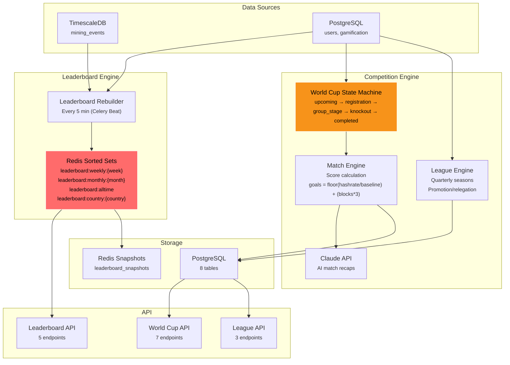
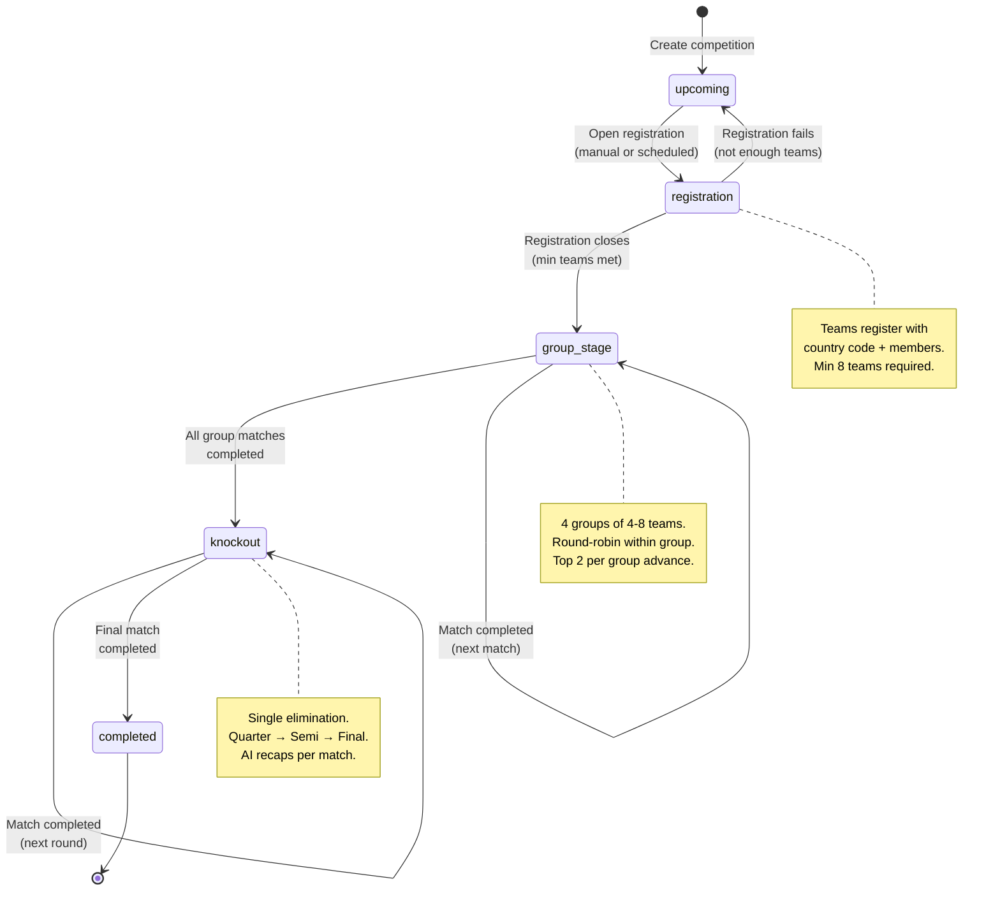
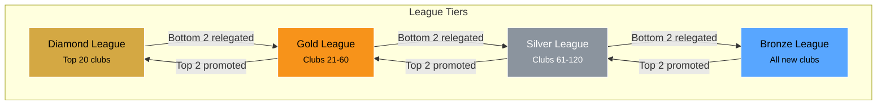

# Phase 6 — Competition & Leaderboards

| Field        | Value                                          |
| ------------ | ---------------------------------------------- |
| **Duration** | 5 weeks                                        |
| **Status**   | Not Started                                    |
| **Owner**    | TBD                                            |
| **Depends**  | Phase 5 — Games & Weekly Lottery System        |
| **Blocks**   | Phase 7 — Social & Cooperatives               |

---

## 6.1 Objectives

1. **Build a Redis-backed leaderboard system** with 4 periods (weekly, monthly, all-time, country) using sorted sets for O(log N) ranking operations, rebuilt every 5 minutes.
2. **Implement a full World Cup tournament state machine** with 5 states (upcoming, registration, group_stage, knockout, completed), team management, match scoring, and AI-generated match recaps.
3. **Build a league system** with club-based quarterly seasons, promotion/relegation zones, and ranked tables.
4. **Create 15 API endpoints** serving competition data to the frontend's LeaderboardPage (4 tabs), WorldCupPage (state machine + match detail + bracket), and LeaguesPage (hub + table).
5. **Generate AI match recaps** via Claude API after each match completion, providing narrative summaries of mining competition results.

---

## 6.2 Architecture Overview



---

## 6.3 Leaderboard System

### 6.3.1 Redis Sorted Set Architecture

Redis sorted sets provide O(log N) rank queries and O(N log N) rebuilds. Each leaderboard period has its own sorted set key.

```
leaderboard:weekly:{YYYY-WW}           — Best difficulty this ISO week
leaderboard:monthly:{YYYY-MM}          — Best difficulty this month
leaderboard:alltime                     — Best difficulty ever
leaderboard:country:{country_code}      — Best difficulty per country (all-time)
```

```python
"""
leaderboard_service.py — Redis sorted set leaderboard management.
"""

import logging
from datetime import datetime, timezone
from typing import Optional

import redis.asyncio as redis
from sqlalchemy import text
from sqlalchemy.ext.asyncio import AsyncSession

logger = logging.getLogger("leaderboard")


class LeaderboardService:
    """
    Manages 4 leaderboard periods using Redis sorted sets.
    Rebuilt every 5 minutes from TimescaleDB mining_events.
    """

    def __init__(self, redis_client: redis.Redis, db_session_factory):
        self.redis = redis_client
        self.db_factory = db_session_factory

    # --- Key Helpers ---

    @staticmethod
    def weekly_key(week: str = None) -> str:
        if not week:
            now = datetime.now(timezone.utc)
            week = now.strftime("%G-%V")
        return f"leaderboard:weekly:{week}"

    @staticmethod
    def monthly_key(month: str = None) -> str:
        if not month:
            now = datetime.now(timezone.utc)
            month = now.strftime("%Y-%m")
        return f"leaderboard:monthly:{month}"

    @staticmethod
    def alltime_key() -> str:
        return "leaderboard:alltime"

    @staticmethod
    def country_key(country_code: str) -> str:
        return f"leaderboard:country:{country_code}"

    # --- Rebuild Operations ---

    async def rebuild_weekly(self, db: AsyncSession) -> int:
        """
        Rebuild the current week's leaderboard from TimescaleDB.

        Uses ZADD with best_difficulty as score.
        Redis sorted sets sort ascending by default, so we use
        raw difficulty values and reverse when querying.
        """
        key = self.weekly_key()
        now = datetime.now(timezone.utc)

        # ISO week boundaries
        iso_year, iso_week, _ = now.isocalendar()
        # Monday 00:00 of current ISO week
        from datetime import timedelta
        week_start = datetime.fromisocalendar(iso_year, iso_week, 1).replace(
            tzinfo=timezone.utc
        )

        results = await db.execute(text("""
            SELECT
                payload->>'user' AS user_id,
                MAX((payload->>'sdiff')::float) AS best_difficulty
            FROM mining_events
            WHERE event_type = 'share_submitted'
              AND (payload->>'accepted')::boolean = true
              AND ts >= :week_start
            GROUP BY payload->>'user'
        """), {"week_start": week_start})

        rows = results.fetchall()
        if not rows:
            return 0

        # Pipeline for atomic rebuild
        pipe = self.redis.pipeline()
        pipe.delete(key)
        for row in rows:
            pipe.zadd(key, {row.user_id: row.best_difficulty})
        pipe.expire(key, 8 * 86400)  # Expire after 8 days
        await pipe.execute()

        logger.info("Rebuilt weekly leaderboard: %d users", len(rows))
        return len(rows)

    async def rebuild_monthly(self, db: AsyncSession) -> int:
        """Rebuild the current month's leaderboard."""
        key = self.monthly_key()
        now = datetime.now(timezone.utc)
        month_start = now.replace(day=1, hour=0, minute=0, second=0, microsecond=0)

        results = await db.execute(text("""
            SELECT
                payload->>'user' AS user_id,
                MAX((payload->>'sdiff')::float) AS best_difficulty
            FROM mining_events
            WHERE event_type = 'share_submitted'
              AND (payload->>'accepted')::boolean = true
              AND ts >= :month_start
            GROUP BY payload->>'user'
        """), {"month_start": month_start})

        rows = results.fetchall()
        if not rows:
            return 0

        pipe = self.redis.pipeline()
        pipe.delete(key)
        for row in rows:
            pipe.zadd(key, {row.user_id: row.best_difficulty})
        pipe.expire(key, 35 * 86400)  # Expire after 35 days
        await pipe.execute()

        return len(rows)

    async def rebuild_alltime(self, db: AsyncSession) -> int:
        """Rebuild the all-time leaderboard."""
        key = self.alltime_key()

        results = await db.execute(text("""
            SELECT
                payload->>'user' AS user_id,
                MAX((payload->>'sdiff')::float) AS best_difficulty
            FROM mining_events
            WHERE event_type = 'share_submitted'
              AND (payload->>'accepted')::boolean = true
            GROUP BY payload->>'user'
        """))

        rows = results.fetchall()
        if not rows:
            return 0

        pipe = self.redis.pipeline()
        pipe.delete(key)
        for row in rows:
            pipe.zadd(key, {row.user_id: row.best_difficulty})
        await pipe.execute()

        return len(rows)

    async def rebuild_country(self, db: AsyncSession) -> dict[str, int]:
        """Rebuild per-country leaderboards."""
        results = await db.execute(text("""
            SELECT
                u.country_code,
                me.payload->>'user' AS user_id,
                MAX((me.payload->>'sdiff')::float) AS best_difficulty
            FROM mining_events me
            JOIN users u ON u.btc_address = me.payload->>'user'
            WHERE me.event_type = 'share_submitted'
              AND (me.payload->>'accepted')::boolean = true
              AND u.country_code IS NOT NULL
            GROUP BY u.country_code, me.payload->>'user'
        """))

        rows = results.fetchall()
        country_data: dict[str, list] = {}
        for row in rows:
            country_data.setdefault(row.country_code, []).append(
                (row.user_id, row.best_difficulty)
            )

        counts = {}
        pipe = self.redis.pipeline()
        for country, entries in country_data.items():
            key = self.country_key(country)
            pipe.delete(key)
            for user_id, diff in entries:
                pipe.zadd(key, {user_id: diff})
            pipe.expire(key, 86400)
            counts[country] = len(entries)
        await pipe.execute()

        return counts

    # --- Query Operations ---

    async def get_leaderboard(
        self,
        key: str,
        offset: int = 0,
        limit: int = 50,
    ) -> list[dict]:
        """
        Get ranked leaderboard entries.
        Uses ZREVRANGE for descending order (highest diff first).
        """
        entries = await self.redis.zrevrange(
            key, offset, offset + limit - 1, withscores=True
        )
        results = []
        for i, (user_id, score) in enumerate(entries):
            user_id_str = user_id.decode() if isinstance(user_id, bytes) else user_id
            results.append({
                "rank": offset + i + 1,
                "user_id": user_id_str,
                "best_difficulty": score,
            })
        return results

    async def get_user_rank(self, key: str, user_id: str) -> Optional[dict]:
        """Get a specific user's rank and score."""
        rank = await self.redis.zrevrank(key, user_id)
        if rank is None:
            return None
        score = await self.redis.zscore(key, user_id)
        total = await self.redis.zcard(key)
        return {
            "rank": rank + 1,
            "best_difficulty": score,
            "total_participants": total,
            "percentile": round((total - rank) / total * 100, 1) if total > 0 else 0,
        }

    async def get_total_count(self, key: str) -> int:
        """Get total number of entries in a leaderboard."""
        return await self.redis.zcard(key)
```

### 6.3.2 Leaderboard Rebuild Scheduler

```python
"""
Scheduled job: rebuild all leaderboards every 5 minutes.
"""

from apscheduler.triggers.interval import IntervalTrigger

scheduler.add_job(
    rebuild_all_leaderboards,
    trigger=IntervalTrigger(minutes=5),
    id="leaderboard_rebuild",
    name="Rebuild All Leaderboards",
    replace_existing=True,
)


async def rebuild_all_leaderboards():
    async with get_async_session() as db:
        svc = LeaderboardService(redis_client, lambda: db)
        weekly = await svc.rebuild_weekly(db)
        monthly = await svc.rebuild_monthly(db)
        alltime = await svc.rebuild_alltime(db)
        countries = await svc.rebuild_country(db)
        logger.info(
            "Leaderboards rebuilt: weekly=%d, monthly=%d, alltime=%d, countries=%d",
            weekly, monthly, alltime, len(countries),
        )
```

### 6.3.3 Leaderboard Snapshot Persistence

```python
"""
Persist leaderboard snapshots to PostgreSQL for historical analysis.
"""

async def snapshot_leaderboard(
    db: AsyncSession,
    redis_client: redis.Redis,
    period: str,
    key: str,
    top_n: int = 100,
):
    """Save top N entries to leaderboard_snapshots table."""
    entries = await redis_client.zrevrange(key, 0, top_n - 1, withscores=True)
    snapshot_data = [
        {"rank": i + 1, "user_id": uid.decode(), "score": score}
        for i, (uid, score) in enumerate(entries)
    ]

    await db.execute(text("""
        INSERT INTO leaderboard_snapshots (period, period_key, snapshot_data, total_participants)
        VALUES (:period, :key, :data, :total)
    """), {
        "period": period,
        "key": key.split(":")[-1],
        "data": json.dumps(snapshot_data),
        "total": await redis_client.zcard(key),
    })
    await db.commit()
```

---

## 6.4 World Cup Tournament System

### 6.4.1 State Machine



### 6.4.2 Match Scoring Formula

```python
"""
match_scoring.py — World Cup match scoring engine.

Goals are calculated from real mining performance during the match window.
"""

import math
from datetime import datetime
from dataclasses import dataclass


@dataclass
class TeamMatchStats:
    team_id: str
    country_code: str
    total_hashrate: float       # TH/s during match window
    blocks_found: int           # Blocks found during match window
    total_shares: int           # Shares submitted during match window
    best_difficulty: float      # Best share difficulty during match


# Baseline hashrate: 1 TH/s = 1 goal potential
BASELINE_HASHRATE_THS = 1.0

# Block bonus: each block found = 3 goals
BLOCK_GOAL_BONUS = 3


def calculate_goals(stats: TeamMatchStats) -> int:
    """
    Calculate goals for a team in a match.

    Formula: goals = floor(team_hashrate / baseline_hashrate) + (blocks_found * 3)

    The baseline ensures even small teams can score.
    Blocks found are a massive bonus (3 goals each).
    """
    hashrate_goals = math.floor(stats.total_hashrate / BASELINE_HASHRATE_THS)
    block_goals = stats.blocks_found * BLOCK_GOAL_BONUS
    return hashrate_goals + block_goals


def resolve_match(
    home: TeamMatchStats,
    away: TeamMatchStats,
) -> dict:
    """
    Resolve a match between two teams.
    Returns match result with scores and events.
    """
    home_goals = calculate_goals(home)
    away_goals = calculate_goals(away)

    # Determine winner
    if home_goals > away_goals:
        winner = home.team_id
        result = "home_win"
    elif away_goals > home_goals:
        winner = away.team_id
        result = "away_win"
    else:
        winner = None
        result = "draw"

    return {
        "home_goals": home_goals,
        "away_goals": away_goals,
        "winner": winner,
        "result": result,
        "home_stats": {
            "hashrate": home.total_hashrate,
            "blocks_found": home.blocks_found,
            "shares": home.total_shares,
            "best_diff": home.best_difficulty,
        },
        "away_stats": {
            "hashrate": away.total_hashrate,
            "blocks_found": away.blocks_found,
            "shares": away.total_shares,
            "best_diff": away.best_difficulty,
        },
    }
```

### 6.4.3 AI Match Recaps

```python
"""
ai_recap.py — Generate narrative match recaps via Claude API.
"""

import logging
from typing import Optional

import anthropic

logger = logging.getLogger("ai_recap")

RECAP_SYSTEM_PROMPT = """You are a sports commentator for The Bitcoin Game, a Bitcoin mining
gamification platform. You write exciting, concise match recaps for the Mining World Cup.
Keep recaps to 3-4 paragraphs. Use mining metaphors (hashrate as "firepower",
blocks found as "hat tricks", etc.). Be enthusiastic but factual about the numbers.
Never invent statistics — only reference the data provided."""


async def generate_match_recap(
    match_data: dict,
    home_country: str,
    away_country: str,
    competition_name: str,
    round_name: str,
) -> Optional[str]:
    """
    Generate an AI recap of a completed match.

    Args:
        match_data: Result from resolve_match() including scores and stats
        home_country: Home team country name
        away_country: Away team country name
        competition_name: e.g. "Mining World Cup 2026"
        round_name: e.g. "Group A - Matchday 1" or "Quarter-Final"
    """
    try:
        client = anthropic.AsyncAnthropic()

        prompt = f"""Write a match recap for:

**{competition_name} — {round_name}**
{home_country} {match_data['home_goals']} - {match_data['away_goals']} {away_country}

Home team ({home_country}) stats:
- Combined hashrate: {match_data['home_stats']['hashrate']:.2f} TH/s
- Blocks found: {match_data['home_stats']['blocks_found']}
- Total shares: {match_data['home_stats']['shares']:,}
- Best difficulty: {match_data['home_stats']['best_diff']:.2f}

Away team ({away_country}) stats:
- Combined hashrate: {match_data['away_stats']['hashrate']:.2f} TH/s
- Blocks found: {match_data['away_stats']['blocks_found']}
- Total shares: {match_data['away_stats']['shares']:,}
- Best difficulty: {match_data['away_stats']['best_diff']:.2f}

Result: {match_data['result'].replace('_', ' ').title()}"""

        response = await client.messages.create(
            model="claude-sonnet-4-20250514",
            max_tokens=500,
            system=RECAP_SYSTEM_PROMPT,
            messages=[{"role": "user", "content": prompt}],
        )

        recap = response.content[0].text
        logger.info("Generated recap for %s vs %s", home_country, away_country)
        return recap

    except Exception:
        logger.exception("Failed to generate AI recap")
        return None
```

### 6.4.4 World Cup Service

```python
"""
competition_service.py — World Cup tournament management.
"""

from datetime import datetime, timezone
from enum import Enum
from uuid import uuid4

from sqlalchemy.ext.asyncio import AsyncSession
from sqlalchemy import select, update

from app.models.competition import (
    Competition,
    CompetitionTeam,
    CompetitionRegistration,
    Match,
)
from app.services.match_scoring import resolve_match, TeamMatchStats
from app.services.ai_recap import generate_match_recap


class CompetitionStatus(str, Enum):
    UPCOMING = "upcoming"
    REGISTRATION = "registration"
    GROUP_STAGE = "group_stage"
    KNOCKOUT = "knockout"
    COMPLETED = "completed"


VALID_TRANSITIONS = {
    CompetitionStatus.UPCOMING: [CompetitionStatus.REGISTRATION],
    CompetitionStatus.REGISTRATION: [
        CompetitionStatus.GROUP_STAGE,
        CompetitionStatus.UPCOMING,  # Rollback if not enough teams
    ],
    CompetitionStatus.GROUP_STAGE: [CompetitionStatus.KNOCKOUT],
    CompetitionStatus.KNOCKOUT: [CompetitionStatus.COMPLETED],
    CompetitionStatus.COMPLETED: [],
}


class CompetitionService:
    def __init__(self, db: AsyncSession):
        self.db = db

    async def transition_state(
        self,
        competition_id: str,
        new_status: CompetitionStatus,
    ) -> Competition:
        """
        Transition a competition to a new state.
        Validates the transition is allowed.
        """
        comp = await self.db.get(Competition, competition_id)
        if not comp:
            raise ValueError(f"Competition {competition_id} not found")

        current = CompetitionStatus(comp.status)
        if new_status not in VALID_TRANSITIONS[current]:
            raise ValueError(
                f"Invalid transition: {current.value} → {new_status.value}. "
                f"Allowed: {[s.value for s in VALID_TRANSITIONS[current]]}"
            )

        # State-specific validation
        if new_status == CompetitionStatus.GROUP_STAGE:
            teams = await self.db.execute(
                select(CompetitionTeam).where(
                    CompetitionTeam.competition_id == competition_id
                )
            )
            team_count = len(teams.scalars().all())
            if team_count < 8:
                raise ValueError(
                    f"Need at least 8 teams to start group stage. Have: {team_count}"
                )

        comp.status = new_status.value
        comp.updated_at = datetime.now(timezone.utc)
        await self.db.commit()
        return comp

    async def complete_match(self, match_id: str) -> Match:
        """
        Complete a match: calculate scores, generate recap, update standings.
        """
        match = await self.db.get(Match, match_id)
        if not match or match.status != "in_progress":
            raise ValueError("Match not found or not in progress")

        # Gather team stats from mining events during match window
        home_stats = await self._get_team_stats(
            match.home_team_id, match.start_time, match.end_time
        )
        away_stats = await self._get_team_stats(
            match.away_team_id, match.start_time, match.end_time
        )

        # Calculate match result
        result = resolve_match(home_stats, away_stats)

        # Update match record
        match.home_goals = result["home_goals"]
        match.away_goals = result["away_goals"]
        match.winner_team_id = result["winner"]
        match.status = "completed"
        match.completed_at = datetime.now(timezone.utc)
        match.match_stats = result

        # Generate AI recap
        home_team = await self.db.get(CompetitionTeam, match.home_team_id)
        away_team = await self.db.get(CompetitionTeam, match.away_team_id)
        comp = await self.db.get(Competition, match.competition_id)

        recap = await generate_match_recap(
            match_data=result,
            home_country=home_team.country_name,
            away_country=away_team.country_name,
            competition_name=comp.name,
            round_name=match.round_name,
        )
        match.ai_recap = recap

        await self.db.commit()
        return match

    async def _get_team_stats(
        self,
        team_id: str,
        start_time: datetime,
        end_time: datetime,
    ) -> TeamMatchStats:
        """Aggregate mining stats for a team during a match window."""
        team = await self.db.get(CompetitionTeam, team_id)
        members = await self.db.execute(
            select(CompetitionRegistration).where(
                CompetitionRegistration.team_id == team_id,
                CompetitionRegistration.status == "approved",
            )
        )
        member_ids = [m.user_id for m in members.scalars().all()]

        if not member_ids:
            return TeamMatchStats(
                team_id=team_id,
                country_code=team.country_code,
                total_hashrate=0.0,
                blocks_found=0,
                total_shares=0,
                best_difficulty=0.0,
            )

        # Query aggregated stats from mining_events
        user_list = ",".join(f"'{uid}'" for uid in member_ids)
        stats = await self.db.execute(text(f"""
            SELECT
                COALESCE(SUM(
                    CASE WHEN event_type = 'hashrate_update'
                    THEN (payload->>'hashrate_1h')::float ELSE 0 END
                ), 0) AS total_hashrate,
                COUNT(*) FILTER (
                    WHERE event_type = 'block_found'
                ) AS blocks_found,
                COUNT(*) FILTER (
                    WHERE event_type = 'share_submitted'
                      AND (payload->>'accepted')::boolean = true
                ) AS total_shares,
                COALESCE(MAX(
                    CASE WHEN event_type = 'share_submitted'
                    THEN (payload->>'sdiff')::float END
                ), 0) AS best_difficulty
            FROM mining_events
            WHERE payload->>'user' IN ({user_list})
              AND ts BETWEEN :start AND :end
        """), {"start": start_time, "end": end_time})

        row = stats.fetchone()
        return TeamMatchStats(
            team_id=team_id,
            country_code=team.country_code,
            total_hashrate=row.total_hashrate / 1e12,  # Convert to TH/s
            blocks_found=row.blocks_found,
            total_shares=row.total_shares,
            best_difficulty=row.best_difficulty,
        )
```

---

## 6.5 League System

### 6.5.1 League Structure



### 6.5.2 League Service

```python
"""
league_service.py — Quarterly league management with promotion/relegation.
"""

from datetime import datetime, timezone
from sqlalchemy.ext.asyncio import AsyncSession
from sqlalchemy import select, text


class LeagueService:
    def __init__(self, db: AsyncSession):
        self.db = db

    async def get_league_table(self, league_id: str) -> list[dict]:
        """
        Get the current league standings.
        Clubs ranked by: points (3 for win, 1 for draw) → best_diff → total_shares.
        """
        results = await self.db.execute(text("""
            SELECT
                lc.id,
                lc.club_name,
                lc.country_code,
                lc.member_count,
                lc.total_hashrate,
                lc.points,
                lc.wins,
                lc.draws,
                lc.losses,
                lc.best_difficulty,
                lc.total_shares,
                ROW_NUMBER() OVER (
                    ORDER BY lc.points DESC, lc.best_difficulty DESC, lc.total_shares DESC
                ) AS position
            FROM league_clubs lc
            WHERE lc.league_id = :league_id
              AND lc.status = 'active'
            ORDER BY position
        """), {"league_id": league_id})

        rows = results.fetchall()
        total = len(rows)

        table = []
        for row in rows:
            zone = None
            if row.position <= 2:
                zone = "promotion"
            elif row.position > total - 2:
                zone = "relegation"

            table.append({
                "position": row.position,
                "club_id": str(row.id),
                "club_name": row.club_name,
                "country_code": row.country_code,
                "member_count": row.member_count,
                "total_hashrate": row.total_hashrate,
                "points": row.points,
                "wins": row.wins,
                "draws": row.draws,
                "losses": row.losses,
                "best_difficulty": row.best_difficulty,
                "total_shares": row.total_shares,
                "zone": zone,
            })

        return table

    async def process_season_end(self, league_id: str):
        """
        Process end of quarterly season.
        Promote top 2, relegate bottom 2.
        """
        table = await self.get_league_table(league_id)
        league = await self.db.get(League, league_id)

        promoted = [c for c in table if c["zone"] == "promotion"]
        relegated = [c for c in table if c["zone"] == "relegation"]

        # Find the league above and below
        league_above = await self.db.execute(
            select(League).where(League.tier == league.tier - 1)
        )
        league_below = await self.db.execute(
            select(League).where(League.tier == league.tier + 1)
        )

        # Move promoted clubs up
        if league_above_obj := league_above.scalar_one_or_none():
            for club in promoted:
                await self.db.execute(text("""
                    UPDATE league_clubs
                    SET league_id = :new_league, points = 0, wins = 0,
                        draws = 0, losses = 0
                    WHERE id = :club_id
                """), {"new_league": str(league_above_obj.id), "club_id": club["club_id"]})

        # Move relegated clubs down
        if league_below_obj := league_below.scalar_one_or_none():
            for club in relegated:
                await self.db.execute(text("""
                    UPDATE league_clubs
                    SET league_id = :new_league, points = 0, wins = 0,
                        draws = 0, losses = 0
                    WHERE id = :club_id
                """), {"new_league": str(league_below_obj.id), "club_id": club["club_id"]})

        await self.db.commit()
```

---

## 6.6 Database Schema

```sql
-- ================================================================
-- Phase 6: Competition & Leaderboard Tables
-- ================================================================

-- Leaderboard snapshots (historical persistence from Redis)
CREATE TABLE leaderboard_snapshots (
    id                  UUID PRIMARY KEY DEFAULT gen_random_uuid(),
    period              VARCHAR(20) NOT NULL
                        CHECK (period IN ('weekly', 'monthly', 'alltime', 'country')),
    period_key          VARCHAR(20) NOT NULL,
    snapshot_data       JSONB NOT NULL DEFAULT '[]'::jsonb,
    total_participants  INTEGER NOT NULL DEFAULT 0,
    created_at          TIMESTAMPTZ NOT NULL DEFAULT NOW()
);

CREATE INDEX idx_lb_snapshots_period ON leaderboard_snapshots (period, period_key, created_at DESC);

-- Country-level aggregated rankings
CREATE TABLE country_rankings (
    id              UUID PRIMARY KEY DEFAULT gen_random_uuid(),
    country_code    VARCHAR(3) NOT NULL,
    country_name    VARCHAR(100) NOT NULL,
    miner_count     INTEGER NOT NULL DEFAULT 0,
    total_hashrate  DOUBLE PRECISION NOT NULL DEFAULT 0,
    best_difficulty DOUBLE PRECISION NOT NULL DEFAULT 0,
    period          VARCHAR(20) NOT NULL DEFAULT 'alltime',
    updated_at      TIMESTAMPTZ NOT NULL DEFAULT NOW(),

    CONSTRAINT uq_country_rankings_country_period UNIQUE (country_code, period)
);

CREATE INDEX idx_country_rankings_period ON country_rankings (period, miner_count DESC);

-- Competitions (World Cup, etc.)
CREATE TABLE competitions (
    id              UUID PRIMARY KEY DEFAULT gen_random_uuid(),
    name            VARCHAR(200) NOT NULL,
    type            VARCHAR(30) NOT NULL CHECK (type IN ('world_cup', 'tournament', 'challenge')),
    status          VARCHAR(30) NOT NULL DEFAULT 'upcoming'
                    CHECK (status IN ('upcoming', 'registration', 'group_stage', 'knockout', 'completed')),
    start_date      TIMESTAMPTZ NOT NULL,
    end_date        TIMESTAMPTZ NOT NULL,
    config          JSONB NOT NULL DEFAULT '{}'::jsonb,
    created_at      TIMESTAMPTZ NOT NULL DEFAULT NOW(),
    updated_at      TIMESTAMPTZ NOT NULL DEFAULT NOW()
);

CREATE INDEX idx_competitions_status ON competitions (status);
CREATE INDEX idx_competitions_dates ON competitions (start_date, end_date);

-- Teams within a competition
CREATE TABLE competition_teams (
    id              UUID PRIMARY KEY DEFAULT gen_random_uuid(),
    competition_id  UUID NOT NULL REFERENCES competitions(id) ON DELETE CASCADE,
    country_code    VARCHAR(3) NOT NULL,
    country_name    VARCHAR(100) NOT NULL,
    group_name      VARCHAR(10),
    captain_user_id VARCHAR(128),
    member_count    INTEGER NOT NULL DEFAULT 0,
    total_hashrate  DOUBLE PRECISION NOT NULL DEFAULT 0,
    points          INTEGER NOT NULL DEFAULT 0,
    wins            INTEGER NOT NULL DEFAULT 0,
    draws           INTEGER NOT NULL DEFAULT 0,
    losses          INTEGER NOT NULL DEFAULT 0,
    goals_for       INTEGER NOT NULL DEFAULT 0,
    goals_against   INTEGER NOT NULL DEFAULT 0,
    status          VARCHAR(20) NOT NULL DEFAULT 'active',
    created_at      TIMESTAMPTZ NOT NULL DEFAULT NOW(),

    CONSTRAINT uq_comp_teams_comp_country UNIQUE (competition_id, country_code)
);

CREATE INDEX idx_comp_teams_comp ON competition_teams (competition_id);
CREATE INDEX idx_comp_teams_group ON competition_teams (competition_id, group_name);

-- Individual registrations for competition teams
CREATE TABLE competition_registrations (
    id              UUID PRIMARY KEY DEFAULT gen_random_uuid(),
    competition_id  UUID NOT NULL REFERENCES competitions(id) ON DELETE CASCADE,
    team_id         UUID NOT NULL REFERENCES competition_teams(id) ON DELETE CASCADE,
    user_id         VARCHAR(128) NOT NULL,
    status          VARCHAR(20) NOT NULL DEFAULT 'approved'
                    CHECK (status IN ('pending', 'approved', 'rejected')),
    registered_at   TIMESTAMPTZ NOT NULL DEFAULT NOW(),

    CONSTRAINT uq_comp_reg_comp_user UNIQUE (competition_id, user_id)
);

CREATE INDEX idx_comp_reg_team ON competition_registrations (team_id);
CREATE INDEX idx_comp_reg_user ON competition_registrations (user_id);

-- Matches (group stage and knockout)
CREATE TABLE matches (
    id              UUID PRIMARY KEY DEFAULT gen_random_uuid(),
    competition_id  UUID NOT NULL REFERENCES competitions(id) ON DELETE CASCADE,
    round_name      VARCHAR(50) NOT NULL,
    round_number    INTEGER NOT NULL DEFAULT 1,
    home_team_id    UUID NOT NULL REFERENCES competition_teams(id),
    away_team_id    UUID NOT NULL REFERENCES competition_teams(id),
    home_goals      INTEGER,
    away_goals      INTEGER,
    winner_team_id  UUID REFERENCES competition_teams(id),
    status          VARCHAR(20) NOT NULL DEFAULT 'scheduled'
                    CHECK (status IN ('scheduled', 'in_progress', 'completed', 'cancelled')),
    start_time      TIMESTAMPTZ NOT NULL,
    end_time        TIMESTAMPTZ NOT NULL,
    completed_at    TIMESTAMPTZ,
    match_stats     JSONB NOT NULL DEFAULT '{}'::jsonb,
    ai_recap        TEXT,
    created_at      TIMESTAMPTZ NOT NULL DEFAULT NOW()
);

CREATE INDEX idx_matches_comp ON matches (competition_id, round_number);
CREATE INDEX idx_matches_status ON matches (status);
CREATE INDEX idx_matches_teams ON matches (home_team_id, away_team_id);

-- Leagues (quarterly seasons)
CREATE TABLE leagues (
    id              UUID PRIMARY KEY DEFAULT gen_random_uuid(),
    name            VARCHAR(100) NOT NULL,
    tier            INTEGER NOT NULL DEFAULT 4,
    season          VARCHAR(20) NOT NULL,
    status          VARCHAR(20) NOT NULL DEFAULT 'active'
                    CHECK (status IN ('active', 'completed', 'upcoming')),
    start_date      TIMESTAMPTZ NOT NULL,
    end_date        TIMESTAMPTZ NOT NULL,
    config          JSONB NOT NULL DEFAULT '{}'::jsonb,
    created_at      TIMESTAMPTZ NOT NULL DEFAULT NOW(),
    updated_at      TIMESTAMPTZ NOT NULL DEFAULT NOW()
);

CREATE INDEX idx_leagues_tier ON leagues (tier);
CREATE INDEX idx_leagues_season ON leagues (season, status);

-- Clubs within leagues
CREATE TABLE league_clubs (
    id              UUID PRIMARY KEY DEFAULT gen_random_uuid(),
    league_id       UUID NOT NULL REFERENCES leagues(id) ON DELETE CASCADE,
    club_name       VARCHAR(100) NOT NULL,
    country_code    VARCHAR(3),
    captain_user_id VARCHAR(128),
    member_count    INTEGER NOT NULL DEFAULT 0,
    total_hashrate  DOUBLE PRECISION NOT NULL DEFAULT 0,
    points          INTEGER NOT NULL DEFAULT 0,
    wins            INTEGER NOT NULL DEFAULT 0,
    draws           INTEGER NOT NULL DEFAULT 0,
    losses          INTEGER NOT NULL DEFAULT 0,
    best_difficulty DOUBLE PRECISION NOT NULL DEFAULT 0,
    total_shares    BIGINT NOT NULL DEFAULT 0,
    status          VARCHAR(20) NOT NULL DEFAULT 'active',
    created_at      TIMESTAMPTZ NOT NULL DEFAULT NOW(),
    updated_at      TIMESTAMPTZ NOT NULL DEFAULT NOW()
);

CREATE INDEX idx_league_clubs_league ON league_clubs (league_id);
CREATE INDEX idx_league_clubs_points ON league_clubs (league_id, points DESC);
```

---

## 6.7 API Endpoints

| # | Method | Path                                              | Description                                       | Auth     |
|---|--------|---------------------------------------------------|---------------------------------------------------|----------|
| 1 | GET    | `/api/leaderboard/weekly`                         | Weekly leaderboard (paginated)                    | Optional |
| 2 | GET    | `/api/leaderboard/monthly`                        | Monthly leaderboard (paginated)                   | Optional |
| 3 | GET    | `/api/leaderboard/alltime`                        | All-time leaderboard (paginated)                  | Optional |
| 4 | GET    | `/api/leaderboard/country`                        | Country rankings                                  | Optional |
| 5 | GET    | `/api/leaderboard/me`                             | Current user's rank across all periods            | Required |
| 6 | GET    | `/api/competitions`                               | List competitions (active + recent)               | Optional |
| 7 | GET    | `/api/competitions/{id}`                          | Competition detail (groups, bracket)              | Optional |
| 8 | GET    | `/api/competitions/{id}/groups`                   | Group standings                                   | Optional |
| 9 | GET    | `/api/competitions/{id}/matches`                  | All matches (paginated, filterable by round)      | Optional |
| 10| GET    | `/api/competitions/{id}/matches/{match_id}`       | Match detail with stats + AI recap                | Optional |
| 11| POST   | `/api/competitions/{id}/register`                 | Register for a competition team                   | Required |
| 12| GET    | `/api/competitions/{id}/my-team`                  | Get user's team in this competition               | Required |
| 13| GET    | `/api/leagues`                                    | List active leagues                               | Optional |
| 14| GET    | `/api/leagues/{id}`                               | League detail with table and zones                | Optional |
| 15| GET    | `/api/leagues/{id}/results`                       | League match results (paginated)                  | Optional |

### 6.7.1 Leaderboard Endpoint Implementation

```python
"""
routes/leaderboard.py — Leaderboard API endpoints.
"""

from fastapi import APIRouter, Depends, Query
from typing import Optional

from app.auth import get_current_user_optional, get_current_user
from app.services.leaderboard_service import LeaderboardService

router = APIRouter(prefix="/api/leaderboard", tags=["leaderboard"])


@router.get("/weekly")
async def weekly_leaderboard(
    offset: int = Query(0, ge=0),
    limit: int = Query(50, ge=1, le=100),
    lb: LeaderboardService = Depends(get_leaderboard_service),
):
    """Weekly leaderboard — rebuilt every 5 minutes."""
    key = lb.weekly_key()
    entries = await lb.get_leaderboard(key, offset, limit)
    total = await lb.get_total_count(key)
    # Enrich with user display names
    enriched = await enrich_leaderboard_entries(entries, lb.db_factory)
    return {"entries": enriched, "total": total, "offset": offset, "limit": limit}


@router.get("/monthly")
async def monthly_leaderboard(
    offset: int = Query(0, ge=0),
    limit: int = Query(50, ge=1, le=100),
    lb: LeaderboardService = Depends(get_leaderboard_service),
):
    """Monthly leaderboard."""
    key = lb.monthly_key()
    entries = await lb.get_leaderboard(key, offset, limit)
    total = await lb.get_total_count(key)
    enriched = await enrich_leaderboard_entries(entries, lb.db_factory)
    return {"entries": enriched, "total": total, "offset": offset, "limit": limit}


@router.get("/alltime")
async def alltime_leaderboard(
    offset: int = Query(0, ge=0),
    limit: int = Query(50, ge=1, le=100),
    lb: LeaderboardService = Depends(get_leaderboard_service),
):
    """All-time leaderboard."""
    key = lb.alltime_key()
    entries = await lb.get_leaderboard(key, offset, limit)
    total = await lb.get_total_count(key)
    enriched = await enrich_leaderboard_entries(entries, lb.db_factory)
    return {"entries": enriched, "total": total, "offset": offset, "limit": limit}


@router.get("/country")
async def country_leaderboard(
    lb: LeaderboardService = Depends(get_leaderboard_service),
    db=Depends(get_db),
):
    """Country rankings aggregated from all miners."""
    results = await db.execute(text("""
        SELECT country_code, country_name, miner_count,
               total_hashrate, best_difficulty
        FROM country_rankings
        WHERE period = 'alltime'
        ORDER BY miner_count DESC
    """))
    return {"countries": [dict(r._mapping) for r in results.fetchall()]}


@router.get("/me")
async def my_rankings(
    user=Depends(get_current_user),
    lb: LeaderboardService = Depends(get_leaderboard_service),
):
    """Get current user's rank across all leaderboard periods."""
    weekly = await lb.get_user_rank(lb.weekly_key(), user.id)
    monthly = await lb.get_user_rank(lb.monthly_key(), user.id)
    alltime = await lb.get_user_rank(lb.alltime_key(), user.id)
    return {
        "weekly": weekly,
        "monthly": monthly,
        "alltime": alltime,
    }
```

---

## 6.8 Testing

### 6.8.1 Unit Tests

| # | Test Case                                            | Module                      | Assertions                                              |
|---|------------------------------------------------------|-----------------------------|---------------------------------------------------------|
| 1 | Redis ZADD + ZREVRANGE ordering                      | `test_leaderboard.py`       | Higher score = higher rank                              |
| 2 | Redis ZREVRANK returns correct 0-indexed rank        | `test_leaderboard.py`       | User with highest score → rank 0                        |
| 3 | Leaderboard rebuild — empty dataset                  | `test_leaderboard.py`       | Returns 0, no Redis error                               |
| 4 | Leaderboard rebuild — 10K users                      | `test_leaderboard.py`       | Completes in <5 seconds                                 |
| 5 | Match scoring — hashrate only                        | `test_match_scoring.py`     | goals = floor(hashrate / baseline)                      |
| 6 | Match scoring — blocks found bonus                   | `test_match_scoring.py`     | blocks * 3 added to goals                               |
| 7 | Match scoring — zero hashrate                        | `test_match_scoring.py`     | goals = 0 + block bonus                                 |
| 8 | Match scoring — draw result                          | `test_match_scoring.py`     | winner = None, result = "draw"                          |
| 9 | World Cup state: upcoming → registration             | `test_competition.py`       | Transition succeeds                                     |
| 10| World Cup state: registration → group_stage (8 teams)| `test_competition.py`       | Transition succeeds                                     |
| 11| World Cup state: registration → group_stage (3 teams)| `test_competition.py`       | Raises ValueError (min 8)                               |
| 12| World Cup state: group_stage → upcoming (invalid)    | `test_competition.py`       | Raises ValueError                                       |
| 13| World Cup state: completed → registration (invalid)  | `test_competition.py`       | Raises ValueError                                       |
| 14| League table — promotion zone (top 2)                | `test_league.py`            | zone = "promotion"                                      |
| 15| League table — relegation zone (bottom 2)            | `test_league.py`            | zone = "relegation"                                     |
| 16| League table — ordering by points, then diff         | `test_league.py`            | Correct tiebreaker order                                |
| 17| League promotion/relegation processing               | `test_league.py`            | Clubs moved to correct leagues                          |
| 18| AI recap — mock Claude API call                      | `test_ai_recap.py`          | Returns string, handles API failure gracefully          |

### 6.8.2 Integration Tests

| # | Test Case                                            | Description                                                        |
|---|------------------------------------------------------|--------------------------------------------------------------------|
| 1 | Leaderboard rebuild + query cycle                    | Seed events → rebuild → query top 50 → verify ordering             |
| 2 | Leaderboard rebuild with 10K+ users                  | Performance: rebuild + query completes in <10 seconds              |
| 3 | Full World Cup lifecycle                             | Create → register teams → group stage → knockout → completed       |
| 4 | Match completion with AI recap                       | Seed mining data → complete match → verify scores and recap        |
| 5 | GET /api/leaderboard/weekly                          | Returns paginated entries with correct ranks                       |
| 6 | GET /api/leaderboard/me                              | Returns user's rank across all periods                             |
| 7 | GET /api/competitions/{id}                           | Returns full competition detail with groups                        |
| 8 | POST /api/competitions/{id}/register                 | Registers user for their country's team                            |
| 9 | GET /api/competitions/{id}/matches/{id}              | Returns match detail with stats and AI recap                       |
| 10| GET /api/leagues/{id}                                | Returns league table with promotion/relegation zones               |
| 11| All 15 endpoints with auth + validation              | Happy path + error cases for all endpoints                         |

### 6.8.3 Coverage Target

- **Unit tests:** 90%+ on `leaderboard_service.py`, `match_scoring.py`, `competition_service.py`, `league_service.py`
- **Integration tests:** All 15 endpoints tested
- **Overall phase coverage target:** 85%+

```bash
pytest tests/phase6/ -v --cov=app/services/leaderboard --cov=app/services/competition \
    --cov=app/services/league --cov=app/routes/leaderboard --cov=app/routes/competition \
    --cov=app/routes/league --cov-report=term-missing --cov-fail-under=85
```

---

## 6.9 Deliverables Checklist

- [ ] Redis sorted set leaderboard implementation (`ZADD`, `ZREVRANGE`, `ZREVRANK`)
- [ ] Weekly leaderboard rebuild (every 5 min via scheduler)
- [ ] Monthly leaderboard rebuild
- [ ] All-time leaderboard rebuild
- [ ] Country leaderboard rebuild
- [ ] Leaderboard snapshot persistence to PostgreSQL
- [ ] `leaderboard_snapshots` table migration
- [ ] `country_rankings` table migration
- [ ] `competitions` table migration
- [ ] `competition_teams` table migration
- [ ] `competition_registrations` table migration
- [ ] `matches` table migration
- [ ] `leagues` table migration
- [ ] `league_clubs` table migration
- [ ] World Cup state machine with 5 states and transition validation
- [ ] Match scoring formula: `goals = floor(hashrate/baseline) + (blocks * 3)`
- [ ] AI match recap generation via Claude API
- [ ] League table with promotion/relegation zones
- [ ] Season-end promotion/relegation processing
- [ ] All 15 API endpoints implemented
- [ ] Leaderboard user enrichment (display names, country, badges)
- [ ] Unit tests: 18 test cases
- [ ] Integration tests: 11 test cases (including 10K user load test)
- [ ] Coverage report: 85%+ across all Phase 6 modules
- [ ] WebSocket events: leaderboard_updated, match_completed, competition_state_changed

---

## 6.10 Week-by-Week Schedule

### Week 1 — Redis Leaderboard Engine

- Implement `LeaderboardService` with all sorted set operations
- Build weekly, monthly, all-time, and country rebuild functions
- Configure 5-minute rebuild scheduler
- Create `leaderboard_snapshots` and `country_rankings` tables
- Write leaderboard unit tests
- Implement leaderboard API endpoints (5)

### Week 2 — World Cup Tournament Core

- Create `competitions`, `competition_teams`, `competition_registrations`, `matches` tables
- Implement World Cup state machine with transition validation
- Build team registration flow
- Implement match scoring formula
- Write state machine unit tests

### Week 3 — Match Engine & AI Recaps

- Implement `complete_match()` with stats aggregation
- Integrate Claude API for AI match recaps
- Build group standings calculation
- Implement knockout bracket progression
- Write match scoring and AI recap tests
- Implement competition API endpoints (7)

### Week 4 — League System

- Create `leagues` and `league_clubs` tables
- Implement league table with promotion/relegation zones
- Build season-end processing (promote top 2, relegate bottom 2)
- Implement league API endpoints (3)
- Write league unit and integration tests

### Week 5 — Integration & Polish

- End-to-end testing: full World Cup lifecycle
- Leaderboard rebuild with 10K+ users performance test
- All 15 endpoints integration tests
- WebSocket event broadcasting
- Coverage report and gap filling
- Code review and Phase 6 sign-off

---

## 6.11 Risk Register

| Risk                                                  | Impact | Likelihood | Mitigation                                                          |
|-------------------------------------------------------|--------|------------|---------------------------------------------------------------------|
| Redis sorted set memory at 100K+ users                | Medium | Low        | ~50 bytes per entry; 100K users = ~5 MB per leaderboard             |
| Leaderboard rebuild query too slow                    | High   | Medium     | Use materialized views; partial rebuild (delta) for all-time        |
| Claude API rate limits on AI recaps                   | Medium | Medium     | Queue recaps; retry with backoff; fallback to template recap        |
| World Cup state machine race conditions               | High   | Low        | Pessimistic locking on competition row; state transitions are atomic|
| Match scoring ties in knockout rounds                 | Medium | Medium     | Tiebreaker: best_difficulty wins; then total_shares; then coin flip |
| Country leaderboard accuracy with user-declared flags | Low    | Medium     | Country is self-reported; no verification needed for fun metric     |
| AI recap generates inappropriate content              | Medium | Low        | System prompt constraints; post-generation content filter           |

---

*Phase 6 introduces the competitive layer that makes mining social. The leaderboard drives daily engagement; the World Cup creates seasonal excitement; leagues provide long-term club identity.*
