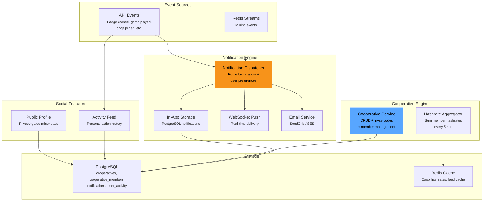
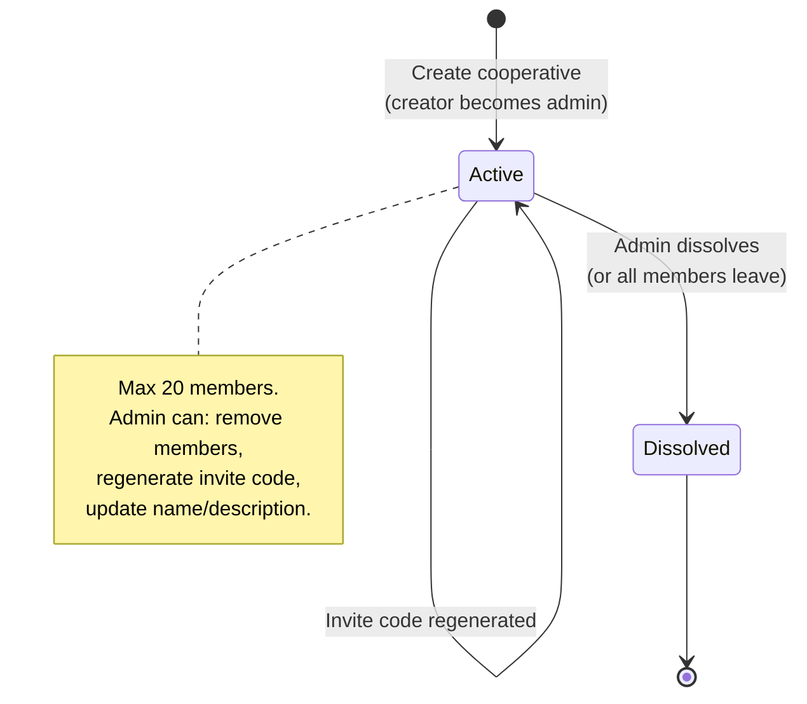
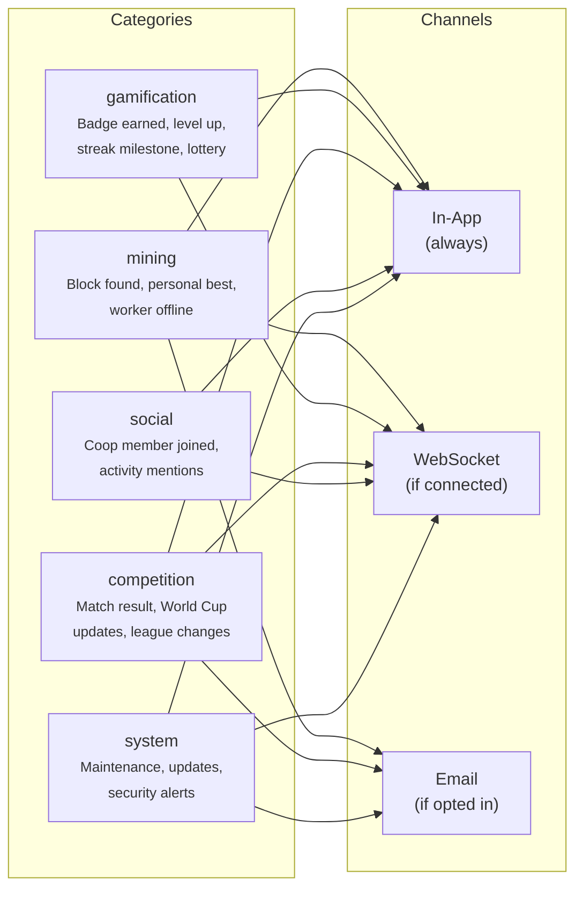

# Phase 7 — Social & Cooperatives

| Field        | Value                                          |
| ------------ | ---------------------------------------------- |
| **Duration** | 4 weeks                                        |
| **Status**   | Not Started                                    |
| **Owner**    | TBD                                            |
| **Depends**  | Phase 6 — Competition & Leaderboards           |
| **Blocks**   | Phase 8 — Education System                     |

---

## 7.1 Objectives

1. **Build a cooperative CRUD system** with server-generated invite codes, a max 20 members cap, combined hashrate aggregation, and role-based access (admin vs member).
2. **Implement a real-time notification system** supporting in-app, WebSocket push, and optional email delivery across 5 categories (mining, gamification, competition, social, system).
3. **Build an activity feed** that tracks all user actions (shares, badges, games, competition events) as a personal history timeline.
4. **Create public miner profiles** that respect user privacy settings — `publicProfile`, `showOnLeaderboard`, and `showCountryFlag` from the `settingsStore`.
5. **Deliver 17 API endpoints** serving the frontend's CoopDashboard, NotificationPanel, ActivityFeed, and PublicMinerProfile pages.

---

## 7.2 Architecture Overview



---

## 7.3 Cooperative System

### 7.3.1 Cooperative Lifecycle



### 7.3.2 Invite Code Generation

```python
"""
invite_code.py — Secure invite code generation for cooperatives.
"""

import secrets
import string

# 8-char alphanumeric codes: 36^8 = ~2.8 trillion possible codes
INVITE_CODE_LENGTH = 8
INVITE_CODE_CHARSET = string.ascii_uppercase + string.digits


def generate_invite_code() -> str:
    """
    Generate a cryptographically secure 8-character alphanumeric invite code.
    Example: "A4K9X2M7"
    """
    return ''.join(
        secrets.choice(INVITE_CODE_CHARSET) for _ in range(INVITE_CODE_LENGTH)
    )


def validate_invite_code(code: str) -> bool:
    """Validate invite code format before database lookup."""
    if not code or len(code) != INVITE_CODE_LENGTH:
        return False
    return all(c in INVITE_CODE_CHARSET for c in code.upper())
```

### 7.3.3 Cooperative Service

```python
"""
cooperative_service.py — Full cooperative lifecycle management.
"""

import logging
from datetime import datetime, timezone
from uuid import uuid4

from sqlalchemy import select, func, update, delete
from sqlalchemy.ext.asyncio import AsyncSession

from app.models.cooperative import Cooperative, CooperativeMember
from app.schemas.cooperative import CooperativeCreate, CooperativeUpdate
from app.services.invite_code import generate_invite_code
from app.services.notification_service import notify_user

logger = logging.getLogger("cooperative")

MAX_MEMBERS_PER_COOP = 20


class CooperativeService:
    def __init__(self, db: AsyncSession):
        self.db = db

    async def create(
        self,
        creator_id: str,
        data: CooperativeCreate,
    ) -> Cooperative:
        """
        Create a new cooperative.
        The creator automatically becomes the admin.
        """
        # Check if user is already in a cooperative
        existing = await self.db.execute(
            select(CooperativeMember).where(
                CooperativeMember.user_id == creator_id,
                CooperativeMember.status == "active",
            )
        )
        if existing.scalar_one_or_none():
            raise ValueError("You are already a member of a cooperative")

        # Generate unique invite code
        invite_code = generate_invite_code()
        while await self._invite_code_exists(invite_code):
            invite_code = generate_invite_code()

        coop = Cooperative(
            id=str(uuid4()),
            name=data.name,
            description=data.description or "",
            invite_code=invite_code,
            admin_user_id=creator_id,
            member_count=1,
            total_hashrate=0.0,
            status="active",
            created_at=datetime.now(timezone.utc),
        )
        self.db.add(coop)

        # Add creator as admin member
        member = CooperativeMember(
            id=str(uuid4()),
            cooperative_id=coop.id,
            user_id=creator_id,
            role="admin",
            status="active",
            joined_at=datetime.now(timezone.utc),
        )
        self.db.add(member)
        await self.db.commit()

        logger.info("Cooperative created: %s by %s", coop.name, creator_id)
        return coop

    async def join_by_invite_code(
        self,
        user_id: str,
        invite_code: str,
    ) -> CooperativeMember:
        """
        Join a cooperative using an invite code.
        Validates: code exists, coop active, user not in another coop, max members.
        """
        # Find cooperative by invite code
        coop = await self.db.execute(
            select(Cooperative).where(
                Cooperative.invite_code == invite_code.upper(),
                Cooperative.status == "active",
            )
        )
        coop = coop.scalar_one_or_none()
        if not coop:
            raise ValueError("Invalid or expired invite code")

        # Check if user is already in a cooperative
        existing = await self.db.execute(
            select(CooperativeMember).where(
                CooperativeMember.user_id == user_id,
                CooperativeMember.status == "active",
            )
        )
        if existing.scalar_one_or_none():
            raise ValueError("You are already a member of a cooperative")

        # Check max members
        if coop.member_count >= MAX_MEMBERS_PER_COOP:
            raise ValueError(
                f"This cooperative is full ({MAX_MEMBERS_PER_COOP} members max)"
            )

        # Add member
        member = CooperativeMember(
            id=str(uuid4()),
            cooperative_id=coop.id,
            user_id=user_id,
            role="member",
            status="active",
            joined_at=datetime.now(timezone.utc),
        )
        self.db.add(member)

        # Update member count
        coop.member_count += 1
        await self.db.commit()

        # Notify admin
        await notify_user(
            user_id=coop.admin_user_id,
            category="social",
            title="New Member Joined!",
            body=f"A new member joined {coop.name}.",
        )

        logger.info("User %s joined coop %s", user_id, coop.name)
        return member

    async def leave(self, user_id: str, coop_id: str) -> None:
        """
        Leave a cooperative.
        If admin leaves, the next member becomes admin.
        If last member leaves, cooperative is dissolved.
        """
        member = await self.db.execute(
            select(CooperativeMember).where(
                CooperativeMember.cooperative_id == coop_id,
                CooperativeMember.user_id == user_id,
                CooperativeMember.status == "active",
            )
        )
        member = member.scalar_one_or_none()
        if not member:
            raise ValueError("You are not a member of this cooperative")

        coop = await self.db.get(Cooperative, coop_id)
        member.status = "left"
        member.left_at = datetime.now(timezone.utc)
        coop.member_count -= 1

        if coop.member_count <= 0:
            # Last member — dissolve
            coop.status = "dissolved"
            logger.info("Cooperative %s dissolved (last member left)", coop.name)
        elif member.role == "admin":
            # Transfer admin to next oldest member
            next_admin = await self.db.execute(
                select(CooperativeMember)
                .where(
                    CooperativeMember.cooperative_id == coop_id,
                    CooperativeMember.status == "active",
                    CooperativeMember.user_id != user_id,
                )
                .order_by(CooperativeMember.joined_at.asc())
                .limit(1)
            )
            next_admin = next_admin.scalar_one_or_none()
            if next_admin:
                next_admin.role = "admin"
                coop.admin_user_id = next_admin.user_id
                await notify_user(
                    user_id=next_admin.user_id,
                    category="social",
                    title="You're the New Admin!",
                    body=f"You are now the admin of {coop.name}.",
                )

        await self.db.commit()

    async def remove_member(
        self,
        admin_id: str,
        coop_id: str,
        target_user_id: str,
    ) -> None:
        """Remove a member (admin only). Cannot remove yourself."""
        coop = await self.db.get(Cooperative, coop_id)
        if not coop or coop.admin_user_id != admin_id:
            raise ValueError("Only the admin can remove members")

        if admin_id == target_user_id:
            raise ValueError("Cannot remove yourself. Use leave instead.")

        member = await self.db.execute(
            select(CooperativeMember).where(
                CooperativeMember.cooperative_id == coop_id,
                CooperativeMember.user_id == target_user_id,
                CooperativeMember.status == "active",
            )
        )
        member = member.scalar_one_or_none()
        if not member:
            raise ValueError("User is not a member of this cooperative")

        member.status = "removed"
        member.left_at = datetime.now(timezone.utc)
        coop.member_count -= 1
        await self.db.commit()

        await notify_user(
            user_id=target_user_id,
            category="social",
            title="Removed from Cooperative",
            body=f"You were removed from {coop.name}.",
        )

    async def regenerate_invite_code(
        self,
        admin_id: str,
        coop_id: str,
    ) -> str:
        """Regenerate the invite code (admin only)."""
        coop = await self.db.get(Cooperative, coop_id)
        if not coop or coop.admin_user_id != admin_id:
            raise ValueError("Only the admin can regenerate invite codes")

        new_code = generate_invite_code()
        while await self._invite_code_exists(new_code):
            new_code = generate_invite_code()

        coop.invite_code = new_code
        await self.db.commit()
        return new_code

    async def _invite_code_exists(self, code: str) -> bool:
        result = await self.db.execute(
            select(Cooperative).where(Cooperative.invite_code == code)
        )
        return result.scalar_one_or_none() is not None
```

### 7.3.4 Hashrate Aggregation

```python
"""
coop_hashrate.py — Aggregate member hashrates for cooperatives.
Runs every 5 minutes via scheduler.
"""

async def update_coop_hashrates(db: AsyncSession, redis_client):
    """
    Sum all active members' latest hashrate for each cooperative.
    Cache in Redis with 5-min TTL.
    """
    coops = await db.execute(
        select(Cooperative).where(Cooperative.status == "active")
    )

    for coop in coops.scalars().all():
        members = await db.execute(
            select(CooperativeMember.user_id).where(
                CooperativeMember.cooperative_id == coop.id,
                CooperativeMember.status == "active",
            )
        )
        member_ids = [m.user_id for m in members.scalars().all()]

        if not member_ids:
            coop.total_hashrate = 0.0
            continue

        user_list = ",".join(f"'{uid}'" for uid in member_ids)
        result = await db.execute(text(f"""
            SELECT COALESCE(SUM(latest_hr.hashrate_1h), 0) AS total
            FROM (
                SELECT DISTINCT ON (payload->>'user')
                    (payload->>'hashrate_1h')::float AS hashrate_1h
                FROM mining_events
                WHERE event_type = 'hashrate_update'
                  AND payload->>'user' IN ({user_list})
                ORDER BY payload->>'user', ts DESC
            ) latest_hr
        """))

        total_hr = result.scalar() or 0.0
        coop.total_hashrate = total_hr

        # Cache in Redis
        await redis_client.setex(
            f"coop:hashrate:{coop.id}",
            300,  # 5 min TTL
            str(total_hr),
        )

    await db.commit()
```

---

## 7.4 Notification System

### 7.4.1 Notification Categories and Delivery



### 7.4.2 Notification Service

```python
"""
notification_service.py — Multi-channel notification delivery.
"""

import logging
from datetime import datetime, timezone
from uuid import uuid4
from typing import Optional

from sqlalchemy.ext.asyncio import AsyncSession
from sqlalchemy import select

from app.models.notification import Notification
from app.models.user import UserSettings
from app.services.websocket_manager import send_to_user
from app.services.email_service import send_email

logger = logging.getLogger("notifications")

# Categories that support email delivery
EMAIL_ELIGIBLE_CATEGORIES = {"mining", "competition", "system"}


async def notify_user(
    user_id: str,
    category: str,
    title: str,
    body: str,
    link: Optional[str] = None,
    data: Optional[dict] = None,
    db: Optional[AsyncSession] = None,
) -> Notification:
    """
    Send a notification to a user through all applicable channels.

    1. Always store in-app (PostgreSQL)
    2. Push via WebSocket if user is connected
    3. Send email if user has opted in for this category
    """
    # Get DB session if not provided
    if db is None:
        from app.db import get_async_session
        async with get_async_session() as db:
            return await _deliver_notification(
                db, user_id, category, title, body, link, data
            )
    return await _deliver_notification(
        db, user_id, category, title, body, link, data
    )


async def _deliver_notification(
    db: AsyncSession,
    user_id: str,
    category: str,
    title: str,
    body: str,
    link: Optional[str],
    data: Optional[dict],
) -> Notification:
    """Internal: create and deliver notification through all channels."""

    # 1. Store in-app notification
    notification = Notification(
        id=str(uuid4()),
        user_id=user_id,
        category=category,
        title=title,
        body=body,
        link=link,
        data=data or {},
        is_read=False,
        created_at=datetime.now(timezone.utc),
    )
    db.add(notification)
    await db.commit()

    # 2. WebSocket push
    await send_to_user(user_id, "notification", {
        "id": notification.id,
        "category": category,
        "title": title,
        "body": body,
        "link": link,
        "created_at": notification.created_at.isoformat(),
    })

    # 3. Email (if user opted in)
    if category in EMAIL_ELIGIBLE_CATEGORIES:
        settings = await db.execute(
            select(UserSettings).where(UserSettings.user_id == user_id)
        )
        settings = settings.scalar_one_or_none()
        if settings and settings.notification_preferences.get(category, {}).get("email"):
            await send_email(
                to_user_id=user_id,
                subject=title,
                body_text=body,
                category=category,
            )

    return notification


async def get_unread_count(db: AsyncSession, user_id: str) -> int:
    """Get count of unread notifications for a user."""
    result = await db.execute(
        select(func.count(Notification.id)).where(
            Notification.user_id == user_id,
            Notification.is_read == False,
        )
    )
    return result.scalar() or 0


async def mark_read(db: AsyncSession, notification_id: str, user_id: str) -> None:
    """Mark a single notification as read."""
    await db.execute(
        update(Notification)
        .where(
            Notification.id == notification_id,
            Notification.user_id == user_id,
        )
        .values(is_read=True, read_at=datetime.now(timezone.utc))
    )
    await db.commit()


async def mark_all_read(db: AsyncSession, user_id: str) -> int:
    """Mark all notifications as read. Returns count of updated rows."""
    result = await db.execute(
        update(Notification)
        .where(
            Notification.user_id == user_id,
            Notification.is_read == False,
        )
        .values(is_read=True, read_at=datetime.now(timezone.utc))
    )
    await db.commit()
    return result.rowcount
```

### 7.4.3 WebSocket Manager

```python
"""
websocket_manager.py — WebSocket connection management for real-time push.
"""

import logging
from typing import Optional

from fastapi import WebSocket

logger = logging.getLogger("websocket")


class WebSocketManager:
    """
    Manages WebSocket connections per user.
    Supports multiple connections per user (e.g., desktop + mobile).
    """

    def __init__(self):
        # user_id → set of active WebSocket connections
        self._connections: dict[str, set[WebSocket]] = {}

    async def connect(self, user_id: str, ws: WebSocket) -> None:
        await ws.accept()
        if user_id not in self._connections:
            self._connections[user_id] = set()
        self._connections[user_id].add(ws)
        logger.info("WebSocket connected: %s (total: %d)",
                     user_id, len(self._connections[user_id]))

    async def disconnect(self, user_id: str, ws: WebSocket) -> None:
        if user_id in self._connections:
            self._connections[user_id].discard(ws)
            if not self._connections[user_id]:
                del self._connections[user_id]
        logger.info("WebSocket disconnected: %s", user_id)

    async def send_to_user(
        self,
        user_id: str,
        event_type: str,
        data: dict,
    ) -> int:
        """
        Send a message to all of a user's active WebSocket connections.
        Returns number of connections messaged.
        """
        connections = self._connections.get(user_id, set())
        sent = 0
        dead = set()
        for ws in connections:
            try:
                await ws.send_json({"type": event_type, "data": data})
                sent += 1
            except Exception:
                dead.add(ws)

        # Clean up dead connections
        for ws in dead:
            connections.discard(ws)
        if user_id in self._connections and not self._connections[user_id]:
            del self._connections[user_id]

        return sent

    async def broadcast(self, event_type: str, data: dict) -> int:
        """Send to all connected users."""
        total = 0
        for user_id in list(self._connections.keys()):
            total += await self.send_to_user(user_id, event_type, data)
        return total

    def is_connected(self, user_id: str) -> bool:
        return user_id in self._connections and len(self._connections[user_id]) > 0


# Global instance
ws_manager = WebSocketManager()
send_to_user = ws_manager.send_to_user
broadcast = ws_manager.broadcast
```

---

## 7.5 Activity Feed & Public Profile

### 7.5.1 Activity Feed Service

```python
"""
activity_service.py — Record and query user activity for personal feed.
"""

from datetime import datetime, timezone
from uuid import uuid4

from sqlalchemy import select
from sqlalchemy.ext.asyncio import AsyncSession

from app.models.activity import UserActivity


ACTIVITY_TYPES = {
    "share_submitted", "block_found", "badge_earned", "level_up",
    "streak_milestone", "game_played", "lottery_rank", "coop_joined",
    "coop_left", "competition_registered", "match_completed",
    "lesson_completed", "track_completed", "settings_updated",
}


async def record_activity(
    db: AsyncSession,
    user_id: str,
    activity_type: str,
    title: str,
    description: str = "",
    data: dict = None,
    link: str = None,
) -> UserActivity:
    """Record a user activity event for the personal feed."""
    if activity_type not in ACTIVITY_TYPES:
        raise ValueError(f"Invalid activity type: {activity_type}")

    activity = UserActivity(
        id=str(uuid4()),
        user_id=user_id,
        activity_type=activity_type,
        title=title,
        description=description,
        data=data or {},
        link=link,
        created_at=datetime.now(timezone.utc),
    )
    db.add(activity)
    await db.commit()
    return activity


async def get_user_feed(
    db: AsyncSession,
    user_id: str,
    limit: int = 20,
    offset: int = 0,
    activity_type: str = None,
) -> list[UserActivity]:
    """Get a user's activity feed (personal history)."""
    query = select(UserActivity).where(UserActivity.user_id == user_id)
    if activity_type:
        query = query.where(UserActivity.activity_type == activity_type)
    query = query.order_by(UserActivity.created_at.desc()).offset(offset).limit(limit)
    result = await db.execute(query)
    return result.scalars().all()
```

### 7.5.2 Public Miner Profile

```python
"""
public_profile_service.py — Privacy-gated public miner profiles.
"""

from sqlalchemy import select
from sqlalchemy.ext.asyncio import AsyncSession

from app.models.user import User, UserSettings


async def get_public_profile(
    db: AsyncSession,
    user_id: str,
) -> dict | None:
    """
    Get a user's public profile.
    Respects privacy settings:
    - privacy.publicProfile must be True, otherwise 404
    - privacy.showOnLeaderboard controls rank visibility
    - privacy.showCountryFlag controls country visibility
    """
    user = await db.execute(
        select(User).where(User.id == user_id)
    )
    user = user.scalar_one_or_none()
    if not user:
        return None

    settings = await db.execute(
        select(UserSettings).where(UserSettings.user_id == user_id)
    )
    settings = settings.scalar_one_or_none()

    # Check public profile setting
    privacy = settings.privacy if settings else {}
    if not privacy.get("publicProfile", False):
        return None  # Profile is private → 404

    profile = {
        "user_id": user.id,
        "display_name": user.display_name,
        "avatar_url": user.avatar_url,
        "joined_at": user.created_at.isoformat(),
    }

    # Conditionally include country
    if privacy.get("showCountryFlag", False):
        profile["country_code"] = user.country_code

    # Conditionally include leaderboard rank
    if privacy.get("showOnLeaderboard", False):
        from app.services.leaderboard_service import LeaderboardService
        # Get rank from Redis
        lb = LeaderboardService(redis_client, None)
        rank_data = await lb.get_user_rank(lb.alltime_key(), user_id)
        profile["leaderboard_rank"] = rank_data

    return profile


async def get_public_stats(
    db: AsyncSession,
    user_id: str,
) -> dict | None:
    """
    Get a user's public mining statistics.
    Only available if publicProfile is enabled.
    """
    # First check privacy
    settings = await db.execute(
        select(UserSettings).where(UserSettings.user_id == user_id)
    )
    settings = settings.scalar_one_or_none()
    privacy = settings.privacy if settings else {}
    if not privacy.get("publicProfile", False):
        return None

    # Query aggregated stats
    stats = await db.execute(text("""
        SELECT
            COUNT(*) FILTER (WHERE event_type = 'share_submitted' AND (payload->>'accepted')::boolean) AS total_shares,
            MAX((payload->>'sdiff')::float) FILTER (WHERE event_type = 'share_submitted') AS best_difficulty,
            COUNT(*) FILTER (WHERE event_type = 'block_found') AS blocks_found
        FROM mining_events
        WHERE payload->>'user' = :user_id
    """), {"user_id": user_id})

    row = stats.fetchone()
    return {
        "total_shares": row.total_shares or 0,
        "best_difficulty": row.best_difficulty or 0.0,
        "blocks_found": row.blocks_found or 0,
    }
```

---

## 7.6 Database Schema

```sql
-- ================================================================
-- Phase 7: Social & Cooperative Tables
-- ================================================================

-- Cooperatives
CREATE TABLE cooperatives (
    id              UUID PRIMARY KEY DEFAULT gen_random_uuid(),
    name            VARCHAR(100) NOT NULL,
    description     TEXT NOT NULL DEFAULT '',
    invite_code     VARCHAR(8) NOT NULL UNIQUE,
    admin_user_id   VARCHAR(128) NOT NULL,
    member_count    INTEGER NOT NULL DEFAULT 0
                    CHECK (member_count >= 0 AND member_count <= 20),
    total_hashrate  DOUBLE PRECISION NOT NULL DEFAULT 0,
    status          VARCHAR(20) NOT NULL DEFAULT 'active'
                    CHECK (status IN ('active', 'dissolved')),
    created_at      TIMESTAMPTZ NOT NULL DEFAULT NOW(),
    updated_at      TIMESTAMPTZ NOT NULL DEFAULT NOW()
);

CREATE UNIQUE INDEX idx_coop_invite ON cooperatives (invite_code) WHERE status = 'active';
CREATE INDEX idx_coop_admin ON cooperatives (admin_user_id);
CREATE INDEX idx_coop_status ON cooperatives (status);

-- Cooperative members
CREATE TABLE cooperative_members (
    id              UUID PRIMARY KEY DEFAULT gen_random_uuid(),
    cooperative_id  UUID NOT NULL REFERENCES cooperatives(id) ON DELETE CASCADE,
    user_id         VARCHAR(128) NOT NULL,
    role            VARCHAR(10) NOT NULL DEFAULT 'member'
                    CHECK (role IN ('admin', 'member')),
    status          VARCHAR(10) NOT NULL DEFAULT 'active'
                    CHECK (status IN ('active', 'left', 'removed')),
    joined_at       TIMESTAMPTZ NOT NULL DEFAULT NOW(),
    left_at         TIMESTAMPTZ,

    CONSTRAINT uq_coop_member_active UNIQUE (cooperative_id, user_id)
);

CREATE INDEX idx_coop_members_user ON cooperative_members (user_id, status);
CREATE INDEX idx_coop_members_coop ON cooperative_members (cooperative_id, status);

-- Notifications (multi-channel)
CREATE TABLE notifications (
    id              UUID PRIMARY KEY DEFAULT gen_random_uuid(),
    user_id         VARCHAR(128) NOT NULL,
    category        VARCHAR(20) NOT NULL
                    CHECK (category IN ('mining', 'gamification', 'competition', 'social', 'system')),
    title           VARCHAR(200) NOT NULL,
    body            TEXT NOT NULL,
    link            VARCHAR(500),
    data            JSONB NOT NULL DEFAULT '{}'::jsonb,
    is_read         BOOLEAN NOT NULL DEFAULT FALSE,
    read_at         TIMESTAMPTZ,
    created_at      TIMESTAMPTZ NOT NULL DEFAULT NOW()
);

CREATE INDEX idx_notif_user_unread ON notifications (user_id, is_read, created_at DESC);
CREATE INDEX idx_notif_user_cat ON notifications (user_id, category, created_at DESC);
CREATE INDEX idx_notif_created ON notifications (created_at DESC);

-- Notification retention: auto-delete after 90 days
-- (handled by pg_cron or application-level cleanup job)

-- User activity feed (personal action history)
CREATE TABLE user_activity (
    id              UUID PRIMARY KEY DEFAULT gen_random_uuid(),
    user_id         VARCHAR(128) NOT NULL,
    activity_type   VARCHAR(30) NOT NULL,
    title           VARCHAR(200) NOT NULL,
    description     TEXT NOT NULL DEFAULT '',
    data            JSONB NOT NULL DEFAULT '{}'::jsonb,
    link            VARCHAR(500),
    created_at      TIMESTAMPTZ NOT NULL DEFAULT NOW()
);

CREATE INDEX idx_activity_user ON user_activity (user_id, created_at DESC);
CREATE INDEX idx_activity_type ON user_activity (user_id, activity_type, created_at DESC);

-- Partition user_activity by month for performance
-- (implement with pg_partman or manual PARTITION BY RANGE)
```

---

## 7.7 API Endpoints

| # | Method | Path                                       | Description                                     | Auth     |
|---|--------|--------------------------------------------|-------------------------------------------------|----------|
| 1 | POST   | `/api/coops`                               | Create a new cooperative                        | Required |
| 2 | GET    | `/api/coops/mine`                          | Get user's cooperative (if any)                 | Required |
| 3 | POST   | `/api/coops/join`                          | Join via invite code                            | Required |
| 4 | POST   | `/api/coops/{id}/leave`                    | Leave cooperative                               | Required |
| 5 | GET    | `/api/coops/{id}/members`                  | List cooperative members                        | Required |
| 6 | DELETE | `/api/coops/{id}/members/{user_id}`        | Remove a member (admin only)                    | Required |
| 7 | POST   | `/api/coops/{id}/regenerate-code`          | Regenerate invite code (admin only)             | Required |
| 8 | GET    | `/api/coops/{id}/hashrate`                 | Get cooperative combined hashrate               | Required |
| 9 | GET    | `/api/coops/{id}/stats`                    | Get cooperative aggregated stats                | Required |
| 10| GET    | `/api/notifications`                       | List notifications (paginated, filterable)      | Required |
| 11| POST   | `/api/notifications/{id}/read`             | Mark notification as read                       | Required |
| 12| POST   | `/api/notifications/read-all`              | Mark all notifications as read                  | Required |
| 13| GET    | `/api/notifications/unread-count`          | Get unread notification count                   | Required |
| 14| GET    | `/api/activity`                            | Get user's activity feed (paginated)            | Required |
| 15| GET    | `/api/public/miners/{user_id}`             | Get public miner profile                        | Optional |
| 16| GET    | `/api/public/miners/{user_id}/stats`       | Get public miner mining stats                   | Optional |
| 17| WS     | `/ws`                                      | WebSocket connection for real-time notifications| Required |

### 7.7.1 WebSocket Endpoint

```python
"""
routes/websocket.py — WebSocket endpoint for real-time notifications.
"""

from fastapi import APIRouter, WebSocket, WebSocketDisconnect, Depends

from app.auth import get_ws_user
from app.services.websocket_manager import ws_manager

router = APIRouter()


@router.websocket("/ws")
async def websocket_endpoint(ws: WebSocket):
    """
    WebSocket connection for real-time notifications.
    Auth: JWT token passed as query param or in first message.
    """
    # Authenticate
    user = await get_ws_user(ws)
    if not user:
        await ws.close(code=4001, reason="Unauthorized")
        return

    await ws_manager.connect(user.id, ws)

    try:
        while True:
            # Keep connection alive, handle client messages
            data = await ws.receive_json()
            msg_type = data.get("type")

            if msg_type == "ping":
                await ws.send_json({"type": "pong"})
            elif msg_type == "mark_read":
                notification_id = data.get("id")
                if notification_id:
                    from app.services.notification_service import mark_read
                    async with get_async_session() as db:
                        await mark_read(db, notification_id, user.id)

    except WebSocketDisconnect:
        await ws_manager.disconnect(user.id, ws)
    except Exception:
        await ws_manager.disconnect(user.id, ws)
```

---

## 7.8 Testing

### 7.8.1 Unit Tests

| # | Test Case                                       | Module                      | Assertions                                           |
|---|------------------------------------------------|-----------------------------|----------------------------------------------------- |
| 1 | Create cooperative                              | `test_cooperative.py`       | Coop created, creator is admin, member_count=1       |
| 2 | Generate invite code — format                  | `test_invite_code.py`       | 8 chars, alphanumeric uppercase                       |
| 3 | Generate invite code — uniqueness              | `test_invite_code.py`       | 1000 codes → no duplicates                           |
| 4 | Validate invite code — valid                   | `test_invite_code.py`       | Returns True                                          |
| 5 | Validate invite code — too short               | `test_invite_code.py`       | Returns False                                         |
| 6 | Validate invite code — invalid chars           | `test_invite_code.py`       | Returns False                                         |
| 7 | Join cooperative — success                     | `test_cooperative.py`       | Member added, member_count incremented                |
| 8 | Join cooperative — already in a coop           | `test_cooperative.py`       | Raises ValueError                                     |
| 9 | Join cooperative — coop full (20 members)      | `test_cooperative.py`       | Raises ValueError "full"                              |
| 10| Join cooperative — invalid invite code         | `test_cooperative.py`       | Raises ValueError "Invalid"                           |
| 11| Leave cooperative — member                     | `test_cooperative.py`       | Status → "left", member_count decremented             |
| 12| Leave cooperative — admin (transfer)           | `test_cooperative.py`       | Next member becomes admin                             |
| 13| Leave cooperative — last member (dissolve)     | `test_cooperative.py`       | Coop status → "dissolved"                             |
| 14| Remove member — by admin                       | `test_cooperative.py`       | Member removed, notification sent                     |
| 15| Remove member — by non-admin                   | `test_cooperative.py`       | Raises ValueError "Only the admin"                    |
| 16| Notification — in-app stored                   | `test_notification.py`      | Record in notifications table                         |
| 17| Notification — category validation             | `test_notification.py`      | Invalid category → constraint violation               |
| 18| Mark read — single                             | `test_notification.py`      | is_read=True, read_at set                             |
| 19| Mark all read                                  | `test_notification.py`      | All user's unread → read                              |
| 20| Privacy — public profile disabled              | `test_public_profile.py`    | Returns None                                          |
| 21| Privacy — public profile enabled               | `test_public_profile.py`    | Returns profile dict                                  |
| 22| Privacy — country flag hidden                  | `test_public_profile.py`    | No country_code in response                           |
| 23| Privacy — leaderboard rank hidden              | `test_public_profile.py`    | No leaderboard_rank in response                       |

### 7.8.2 Integration Tests

| # | Test Case                                       | Description                                                     |
|---|------------------------------------------------|------------------------------------------------------------------|
| 1 | Full cooperative lifecycle                      | Create → join (3 members) → leave → remove → dissolve            |
| 2 | Invite code join + regeneration                 | Join with code → admin regenerates → old code invalid            |
| 3 | Max member enforcement                         | Fill to 20 → attempt 21st → rejected                            |
| 4 | Notification via WebSocket                      | Connect WS → trigger event → verify push received               |
| 5 | Notification preferences respected              | Disable mining notifs → submit share → no notification           |
| 6 | Email notification delivery                     | Enable email for mining → mock SendGrid → verify call           |
| 7 | Public profile — disabled → 404                | Set publicProfile=false → GET /public/miners/{id} → 404         |
| 8 | Public profile — enabled → full data            | Set publicProfile=true → GET returns profile with stats         |
| 9 | Activity feed — chronological ordering          | Multiple events → feed returns newest first                      |
| 10| All 17 endpoints — auth + validation           | Happy path + error cases for all endpoints                       |
| 11| Coop hashrate aggregation                      | 3 members with hashrate → coop total = sum                      |

### 7.8.3 Coverage Target

- **Unit tests:** 90%+ on `cooperative_service.py`, `notification_service.py`, `activity_service.py`, `public_profile_service.py`
- **Integration tests:** All 17 endpoints + WebSocket
- **Overall phase coverage target:** 85%+

```bash
pytest tests/phase7/ -v --cov=app/services/cooperative --cov=app/services/notification \
    --cov=app/services/activity --cov=app/services/public_profile \
    --cov=app/routes/cooperative --cov=app/routes/notification \
    --cov-report=term-missing --cov-fail-under=85
```

---

## 7.9 Deliverables Checklist

- [ ] `cooperatives` table created with migration
- [ ] `cooperative_members` table created with migration
- [ ] `notifications` table created with migration
- [ ] `user_activity` table created with migration
- [ ] Cooperative CRUD service (create, get, update)
- [ ] Invite code generation (8-char, cryptographically secure)
- [ ] Join by invite code with all validations
- [ ] Leave cooperative (with admin transfer and dissolution)
- [ ] Remove member (admin only)
- [ ] Regenerate invite code (admin only)
- [ ] Max 20 members enforcement
- [ ] Coop hashrate aggregation (5-min scheduler)
- [ ] Notification dispatcher (in-app + WebSocket + email)
- [ ] 5 notification categories supported
- [ ] Notification preferences from settingsStore respected
- [ ] WebSocket manager (multi-connection per user)
- [ ] WebSocket endpoint with JWT auth
- [ ] Mark read (single and all)
- [ ] Activity feed recording and querying
- [ ] Public miner profile (privacy-gated)
- [ ] Public miner stats (privacy-gated)
- [ ] All 17 API endpoints implemented
- [ ] Unit tests: 23 test cases
- [ ] Integration tests: 11 test cases (including WebSocket)
- [ ] Coverage report: 85%+ across all Phase 7 modules

---

## 7.10 Week-by-Week Schedule

### Week 1 — Cooperative Core

- Create database migrations for all 4 tables
- Implement invite code generation and validation
- Build cooperative CRUD service (create, join, leave, remove)
- Implement max member enforcement
- Write cooperative unit tests (tests 1-15)

### Week 2 — Notification System

- Implement notification dispatcher (3 channels)
- Build WebSocket manager with multi-connection support
- Implement WebSocket endpoint with JWT auth
- Build notification preferences integration (settingsStore)
- Implement email delivery via SendGrid/SES
- Write notification unit tests (tests 16-19)

### Week 3 — Activity Feed & Public Profiles

- Build activity feed recording and querying
- Implement public profile service with privacy gates
- Implement public stats endpoint
- Build coop hashrate aggregation scheduler
- Write privacy unit tests (tests 20-23)
- Implement all 17 API endpoints

### Week 4 — Integration & Polish

- Full cooperative lifecycle integration test
- WebSocket notification delivery test
- Privacy enforcement end-to-end test
- All 17 endpoints integration tests
- Performance: notification delivery latency <100ms
- Coverage report and gap filling
- Code review and Phase 7 sign-off

---

## 7.11 Risk Register

| Risk                                                  | Impact | Likelihood | Mitigation                                                          |
|-------------------------------------------------------|--------|------------|---------------------------------------------------------------------|
| WebSocket connections drop silently                   | Medium | High       | Heartbeat ping/pong every 30s; auto-reconnect on frontend           |
| Notification table grows unbounded                    | High   | High       | 90-day retention policy; pg_cron cleanup job; index on created_at   |
| Email delivery failures (SendGrid down)               | Medium | Low        | Queue-based delivery; retry 3x; in-app always works                 |
| Invite code collisions                                | Low    | Very Low   | 2.8 trillion possible codes; uniqueness enforced in DB              |
| Cooperative admin goes inactive                       | Medium | Medium     | Future: auto-transfer after 90 days; current: manual intervention   |
| Public profile scraping / enumeration                 | Medium | Medium     | Rate limiting on public endpoints; no user enumeration endpoint     |
| WebSocket memory leak at scale                        | High   | Low        | Connection limits per user (max 5); periodic cleanup of dead sockets|

---

*Phase 7 introduces the social layer that turns solo mining into a community experience. Cooperatives provide team identity, notifications keep users engaged, and public profiles enable social proof.*
