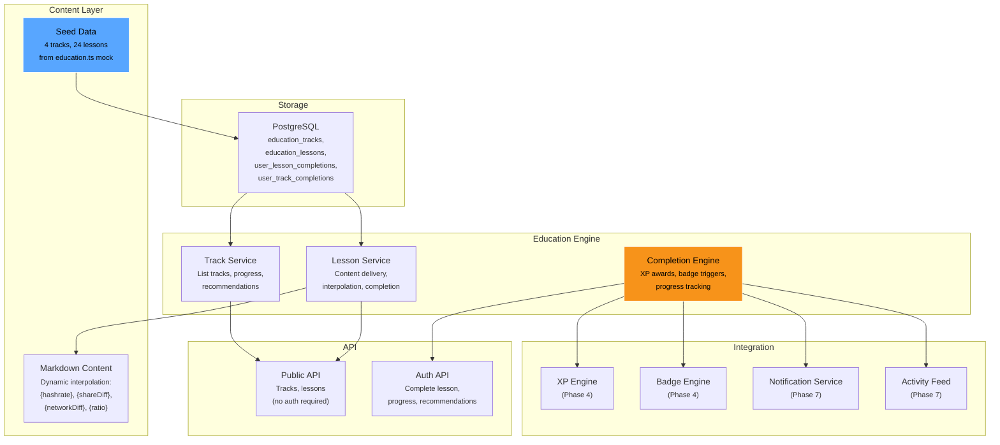
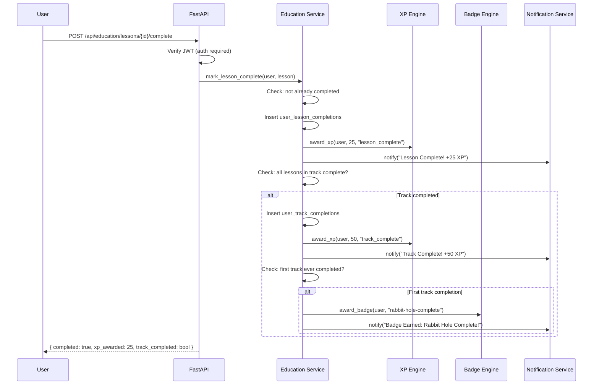

# Phase 8 — Education System

| Field        | Value                                          |
| ------------ | ---------------------------------------------- |
| **Duration** | 3 weeks                                        |
| **Status**   | Not Started                                    |
| **Owner**    | TBD                                            |
| **Depends**  | Phase 7 — Social & Cooperatives               |
| **Blocks**   | Phase 9 — Frontend Integration                 |

---

## 8.1 Objectives

1. **Seed 4 education tracks with 24 lessons** from the frontend mock data (`dashboard/src/mocks/education.ts`), storing Markdown content with dynamic interpolation placeholders.
2. **Track lesson and track completion** with XP awards (25 XP per lesson, 50 XP bonus per track completion) integrated with the Phase 4 gamification engine.
3. **Award the "Rabbit Hole Complete" badge** on the user's first track completion, demonstrating the badge system's real-world trigger.
4. **Serve content publicly for SEO** while gating completion tracking behind authentication.
5. **Build 6 API endpoints** with content recommendations based on user progress.

---

## 8.2 Architecture Overview



---

## 8.3 Content Structure

### 8.3.1 Track and Lesson Inventory

The education content is seeded from `dashboard/src/mocks/education.ts`. All 4 tracks and 24 lessons are stored server-side as Markdown.

| Track | Title                              | Lessons | Est. Minutes | Lesson Topics                                                     |
|-------|------------------------------------|---------|--------------|--------------------------------------------------------------------|
| 1     | What's Happening on My Bitaxe?     | 5       | 20           | Mining, Hashes, Difficulty, Block Lottery, Why It Matters          |
| 2     | Understanding Bitcoin               | 8       | 45           | Money, How BTC Works, Halving, vs TradFi, Wallets, Sending/Receiving, Lightning, Future |
| 3     | Securing Your Bitcoin               | 5       | 30           | Hardware Wallets, Seed Phrases, Self-Custody, Setup, Backup       |
| 4     | Running a Node                      | 6       | 35           | Why Run a Node, Hardware, Setup, Connecting Miner, Maintenance, Badge |

**Total: 24 lessons, ~130 minutes of estimated reading time.**

### 8.3.2 Dynamic Interpolation

Lesson content contains placeholders that are replaced with the user's real mining data at read time. This makes the education content personal and relevant.

| Placeholder       | Source                                     | Example Value           |
|-------------------|--------------------------------------------|-------------------------|
| `{hashrate}`      | User's latest 1h hashrate from Redis       | "500 GH/s"              |
| `{shareDiff}`     | User's current share difficulty             | "65,536"                |
| `{networkDiff}`   | Current network difficulty                  | "86,388,558,925,171"    |
| `{ratio}`         | networkDiff / shareDiff                     | "1,318,131,824"         |

```python
"""
content_interpolator.py — Replace dynamic placeholders in lesson Markdown.
"""

import re
from typing import Optional


PLACEHOLDER_PATTERN = re.compile(r'\{(\w+)\}')


def interpolate_content(
    markdown: str,
    user_data: dict[str, str],
) -> str:
    """
    Replace {placeholder} tokens in Markdown content with user-specific data.
    Unknown placeholders are left as-is (no error).
    """
    def replacer(match):
        key = match.group(1)
        return user_data.get(key, match.group(0))

    return PLACEHOLDER_PATTERN.sub(replacer, markdown)


def format_number(value: float) -> str:
    """Format a number with commas for display."""
    if value >= 1_000_000_000_000:
        return f"{value / 1_000_000_000_000:.1f}T"
    elif value >= 1_000_000_000:
        return f"{value / 1_000_000_000:.1f}G"
    elif value >= 1_000_000:
        return f"{value / 1_000_000:.1f}M"
    elif value >= 1_000:
        return f"{value:,.0f}"
    else:
        return f"{value:.2f}"


async def get_user_interpolation_data(
    user_id: str,
    db,
    redis_client,
) -> dict[str, str]:
    """
    Build the interpolation data dict for a specific user.
    Falls back to defaults if user has no mining data.
    """
    # Get latest hashrate from Redis
    hashrate_key = f"user:hashrate:{user_id}"
    hashrate_raw = await redis_client.get(hashrate_key)
    hashrate = float(hashrate_raw) if hashrate_raw else 500_000_000_000  # 500 GH/s default

    # Get share difficulty
    share_diff = await redis_client.get(f"user:share_diff:{user_id}")
    share_diff = float(share_diff) if share_diff else 65536.0

    # Get network difficulty
    net_diff = await redis_client.get("network:difficulty")
    net_diff = float(net_diff) if net_diff else 86_388_558_925_171.0

    ratio = net_diff / share_diff if share_diff > 0 else 0

    return {
        "hashrate": f"{format_number(hashrate)} H/s",
        "shareDiff": format_number(share_diff),
        "networkDiff": format_number(net_diff),
        "ratio": format_number(ratio),
    }
```

---

## 8.4 Completion and XP System

### 8.4.1 Completion Flow



### 8.4.2 Education Service

```python
"""
education_service.py — Track/lesson management and completion tracking.
"""

import logging
from datetime import datetime, timezone
from uuid import uuid4
from typing import Optional

from sqlalchemy import select, func
from sqlalchemy.ext.asyncio import AsyncSession

from app.models.education import (
    EducationTrack,
    EducationLesson,
    UserLessonCompletion,
    UserTrackCompletion,
)
from app.services.xp_engine import award_xp
from app.services.badge_engine import award_badge
from app.services.notification_service import notify_user
from app.services.activity_service import record_activity
from app.services.content_interpolator import (
    interpolate_content,
    get_user_interpolation_data,
)

logger = logging.getLogger("education")

LESSON_XP = 25
TRACK_BONUS_XP = 50
RABBIT_HOLE_BADGE_ID = "rabbit-hole-complete"


class EducationService:
    def __init__(self, db: AsyncSession, redis_client=None):
        self.db = db
        self.redis = redis_client

    # --- Public Content (no auth) ---

    async def list_tracks(self) -> list[EducationTrack]:
        """List all education tracks with lesson counts."""
        result = await self.db.execute(
            select(EducationTrack).order_by(EducationTrack.order)
        )
        return result.scalars().all()

    async def get_track(self, track_id: str) -> Optional[EducationTrack]:
        """Get a track with its lessons."""
        return await self.db.get(EducationTrack, track_id)

    async def get_lesson_content(
        self,
        track_id: str,
        lesson_id: str,
        user_id: Optional[str] = None,
    ) -> dict:
        """
        Get lesson content with dynamic interpolation.
        If user_id is provided, personalize content with their mining data.
        """
        lesson = await self.db.execute(
            select(EducationLesson).where(
                EducationLesson.id == lesson_id,
                EducationLesson.track_id == track_id,
            )
        )
        lesson = lesson.scalar_one_or_none()
        if not lesson:
            return None

        content = lesson.content

        # Interpolate with user data if authenticated
        if user_id and self.redis:
            user_data = await get_user_interpolation_data(
                user_id, self.db, self.redis
            )
            content = interpolate_content(content, user_data)

        return {
            "id": lesson.id,
            "track_id": lesson.track_id,
            "order": lesson.order,
            "title": lesson.title,
            "estimated_minutes": lesson.estimated_minutes,
            "content": content,
        }

    # --- Completion Tracking (auth required) ---

    async def complete_lesson(
        self,
        user_id: str,
        track_id: str,
        lesson_id: str,
    ) -> dict:
        """
        Mark a lesson as complete.
        Awards XP, checks track completion, triggers badge if applicable.
        """
        # Verify lesson exists
        lesson = await self.db.execute(
            select(EducationLesson).where(
                EducationLesson.id == lesson_id,
                EducationLesson.track_id == track_id,
            )
        )
        lesson = lesson.scalar_one_or_none()
        if not lesson:
            raise ValueError("Lesson not found")

        # Check if already completed (idempotent)
        existing = await self.db.execute(
            select(UserLessonCompletion).where(
                UserLessonCompletion.user_id == user_id,
                UserLessonCompletion.lesson_id == lesson_id,
            )
        )
        if existing.scalar_one_or_none():
            return {
                "completed": True,
                "already_completed": True,
                "xp_awarded": 0,
                "track_completed": False,
            }

        # Mark lesson complete
        completion = UserLessonCompletion(
            id=str(uuid4()),
            user_id=user_id,
            track_id=track_id,
            lesson_id=lesson_id,
            completed_at=datetime.now(timezone.utc),
        )
        self.db.add(completion)

        # Award lesson XP
        await award_xp(
            self.db,
            user_id=user_id,
            amount=LESSON_XP,
            source="education",
            reference_id=lesson_id,
            description=f"Completed: {lesson.title}",
        )

        # Record activity
        await record_activity(
            self.db,
            user_id=user_id,
            activity_type="lesson_completed",
            title=f"Completed lesson: {lesson.title}",
            link=f"/education/{track_id}/{lesson_id}",
        )

        result = {
            "completed": True,
            "already_completed": False,
            "xp_awarded": LESSON_XP,
            "track_completed": False,
            "badge_earned": None,
        }

        # Check if track is now complete
        track_completed = await self._check_track_completion(user_id, track_id)
        if track_completed:
            result["track_completed"] = True
            result["xp_awarded"] += TRACK_BONUS_XP

            # Check for Rabbit Hole Complete badge (first track ever)
            badge = await self._check_rabbit_hole_badge(user_id)
            if badge:
                result["badge_earned"] = RABBIT_HOLE_BADGE_ID

        await self.db.commit()

        # Notify
        await notify_user(
            user_id=user_id,
            category="gamification",
            title=f"Lesson Complete! +{LESSON_XP} XP",
            body=f'You completed "{lesson.title}".',
            link=f"/education/{track_id}",
        )

        return result

    async def _check_track_completion(
        self,
        user_id: str,
        track_id: str,
    ) -> bool:
        """Check if all lessons in a track are completed by this user."""
        # Count total lessons in track
        total = await self.db.execute(
            select(func.count(EducationLesson.id)).where(
                EducationLesson.track_id == track_id
            )
        )
        total_lessons = total.scalar()

        # Count completed lessons
        completed = await self.db.execute(
            select(func.count(UserLessonCompletion.id)).where(
                UserLessonCompletion.user_id == user_id,
                UserLessonCompletion.track_id == track_id,
            )
        )
        completed_lessons = completed.scalar()

        if completed_lessons >= total_lessons:
            # Check if track completion already recorded
            existing = await self.db.execute(
                select(UserTrackCompletion).where(
                    UserTrackCompletion.user_id == user_id,
                    UserTrackCompletion.track_id == track_id,
                )
            )
            if not existing.scalar_one_or_none():
                # Record track completion
                tc = UserTrackCompletion(
                    id=str(uuid4()),
                    user_id=user_id,
                    track_id=track_id,
                    completed_at=datetime.now(timezone.utc),
                )
                self.db.add(tc)

                # Award track bonus XP
                track = await self.db.get(EducationTrack, track_id)
                await award_xp(
                    self.db,
                    user_id=user_id,
                    amount=TRACK_BONUS_XP,
                    source="education",
                    reference_id=track_id,
                    description=f"Track Complete: {track.title}",
                )

                await record_activity(
                    self.db,
                    user_id=user_id,
                    activity_type="track_completed",
                    title=f"Completed track: {track.title}",
                    link=f"/education/{track_id}",
                )

                await notify_user(
                    user_id=user_id,
                    category="gamification",
                    title=f"Track Complete! +{TRACK_BONUS_XP} XP",
                    body=f'You finished the entire "{track.title}" track!',
                )

                return True
        return False

    async def _check_rabbit_hole_badge(self, user_id: str) -> bool:
        """Award 'Rabbit Hole Complete' badge on first track completion."""
        count = await self.db.execute(
            select(func.count(UserTrackCompletion.id)).where(
                UserTrackCompletion.user_id == user_id
            )
        )
        if count.scalar() == 1:  # Just completed their first track
            badge = await award_badge(
                self.db,
                user_id=user_id,
                badge_id=RABBIT_HOLE_BADGE_ID,
            )
            if badge:
                await notify_user(
                    user_id=user_id,
                    category="gamification",
                    title="Badge Earned: Rabbit Hole Complete!",
                    body="You completed your first education track. Welcome down the rabbit hole.",
                )
                return True
        return False

    # --- Progress & Recommendations ---

    async def get_progress(self, user_id: str) -> dict:
        """Get user's education progress across all tracks."""
        tracks = await self.list_tracks()
        progress = []

        for track in tracks:
            total = await self.db.execute(
                select(func.count(EducationLesson.id)).where(
                    EducationLesson.track_id == track.id
                )
            )
            total_lessons = total.scalar()

            completed = await self.db.execute(
                select(func.count(UserLessonCompletion.id)).where(
                    UserLessonCompletion.user_id == user_id,
                    UserLessonCompletion.track_id == track.id,
                )
            )
            completed_lessons = completed.scalar()

            # Get completed lesson IDs
            completed_ids = await self.db.execute(
                select(UserLessonCompletion.lesson_id).where(
                    UserLessonCompletion.user_id == user_id,
                    UserLessonCompletion.track_id == track.id,
                )
            )

            track_complete = await self.db.execute(
                select(UserTrackCompletion).where(
                    UserTrackCompletion.user_id == user_id,
                    UserTrackCompletion.track_id == track.id,
                )
            )

            progress.append({
                "track_id": track.id,
                "track_title": track.title,
                "total_lessons": total_lessons,
                "completed_lessons": completed_lessons,
                "completed_lesson_ids": [r for r in completed_ids.scalars().all()],
                "percent": round(completed_lessons / total_lessons * 100) if total_lessons > 0 else 0,
                "track_completed": track_complete.scalar_one_or_none() is not None,
            })

        return {
            "tracks": progress,
            "total_lessons": sum(t["total_lessons"] for t in progress),
            "total_completed": sum(t["completed_lessons"] for t in progress),
            "tracks_completed": sum(1 for t in progress if t["track_completed"]),
        }

    async def get_recommendations(self, user_id: str) -> list[dict]:
        """
        Recommend next lessons based on user progress.
        Strategy:
        1. In-progress tracks: next uncompleted lesson
        2. Not-started tracks: first lesson
        3. Prioritize tracks by completion %
        """
        progress = await self.get_progress(user_id)
        recommendations = []

        for track in progress["tracks"]:
            if track["track_completed"]:
                continue

            # Find next uncompleted lesson in this track
            lessons = await self.db.execute(
                select(EducationLesson)
                .where(EducationLesson.track_id == track["track_id"])
                .order_by(EducationLesson.order)
            )

            for lesson in lessons.scalars().all():
                if lesson.id not in track["completed_lesson_ids"]:
                    recommendations.append({
                        "track_id": track["track_id"],
                        "track_title": track["track_title"],
                        "lesson_id": lesson.id,
                        "lesson_title": lesson.title,
                        "estimated_minutes": lesson.estimated_minutes,
                        "track_progress": track["percent"],
                        "reason": "in_progress" if track["percent"] > 0 else "not_started",
                    })
                    break

        # Sort: in-progress tracks first (by highest completion %), then not-started
        recommendations.sort(
            key=lambda r: (0 if r["reason"] == "in_progress" else 1, -r["track_progress"])
        )

        return recommendations
```

---

## 8.5 Database Schema

```sql
-- ================================================================
-- Phase 8: Education Tables
-- ================================================================

-- Education tracks
CREATE TABLE education_tracks (
    id                  VARCHAR(10) PRIMARY KEY,
    title               VARCHAR(200) NOT NULL,
    description         TEXT NOT NULL,
    lesson_count        INTEGER NOT NULL DEFAULT 0,
    estimated_minutes   INTEGER NOT NULL DEFAULT 0,
    "order"             INTEGER NOT NULL DEFAULT 0,
    is_published        BOOLEAN NOT NULL DEFAULT TRUE,
    created_at          TIMESTAMPTZ NOT NULL DEFAULT NOW(),
    updated_at          TIMESTAMPTZ NOT NULL DEFAULT NOW()
);

-- Education lessons (content stored as Markdown)
CREATE TABLE education_lessons (
    id                  VARCHAR(10) PRIMARY KEY,
    track_id            VARCHAR(10) NOT NULL REFERENCES education_tracks(id) ON DELETE CASCADE,
    "order"             INTEGER NOT NULL,
    title               VARCHAR(200) NOT NULL,
    estimated_minutes   INTEGER NOT NULL DEFAULT 5,
    content             TEXT NOT NULL,
    is_published        BOOLEAN NOT NULL DEFAULT TRUE,
    created_at          TIMESTAMPTZ NOT NULL DEFAULT NOW(),
    updated_at          TIMESTAMPTZ NOT NULL DEFAULT NOW(),

    CONSTRAINT uq_lesson_track_order UNIQUE (track_id, "order")
);

CREATE INDEX idx_lesson_track ON education_lessons (track_id, "order");

-- User lesson completions
CREATE TABLE user_lesson_completions (
    id              UUID PRIMARY KEY DEFAULT gen_random_uuid(),
    user_id         VARCHAR(128) NOT NULL,
    track_id        VARCHAR(10) NOT NULL REFERENCES education_tracks(id),
    lesson_id       VARCHAR(10) NOT NULL REFERENCES education_lessons(id),
    completed_at    TIMESTAMPTZ NOT NULL DEFAULT NOW(),

    CONSTRAINT uq_user_lesson UNIQUE (user_id, lesson_id)
);

CREATE INDEX idx_user_lesson_user ON user_lesson_completions (user_id, track_id);
CREATE INDEX idx_user_lesson_completed ON user_lesson_completions (completed_at DESC);

-- User track completions
CREATE TABLE user_track_completions (
    id              UUID PRIMARY KEY DEFAULT gen_random_uuid(),
    user_id         VARCHAR(128) NOT NULL,
    track_id        VARCHAR(10) NOT NULL REFERENCES education_tracks(id),
    completed_at    TIMESTAMPTZ NOT NULL DEFAULT NOW(),

    CONSTRAINT uq_user_track UNIQUE (user_id, track_id)
);

CREATE INDEX idx_user_track_user ON user_track_completions (user_id);

-- ================================================================
-- Seed Data: 4 Tracks + 24 Lessons
-- ================================================================

INSERT INTO education_tracks (id, title, description, lesson_count, estimated_minutes, "order") VALUES
('1', 'What''s Happening on My Bitaxe?', 'Understand what your little miner is actually doing, from hashes to shares to the block lottery.', 5, 20, 1),
('2', 'Understanding Bitcoin', 'From digital money to the lightning network — everything you need to know about Bitcoin.', 8, 45, 2),
('3', 'Securing Your Bitcoin', 'Learn how to properly secure your Bitcoin with hardware wallets, seed phrases, and best practices.', 5, 30, 3),
('4', 'Running a Node', 'Set up your own Bitcoin full node and connect your miner to it for maximum sovereignty.', 6, 35, 4);

-- Track 1: What's Happening on My Bitaxe? (5 lessons)
INSERT INTO education_lessons (id, track_id, "order", title, estimated_minutes, content) VALUES
('1-1', '1', 1, 'What is Mining?', 4, '## What is Bitcoin Mining?

Your Bitaxe is a tiny computer doing one thing over and over: **guessing numbers**.

Bitcoin mining is the process of trying to find a special number (called a **nonce**) that, when combined with a block of transactions and run through a mathematical function, produces a result that meets certain criteria.

Think of it like a lottery where your miner buys tickets by computing hashes. Each hash is a guess. Your Bitaxe makes about **500 billion guesses per second**.

### Why Does This Matter?

Mining is what keeps Bitcoin secure. Every 10 minutes, one miner somewhere in the world finds the winning number and gets to add a new block of transactions to the Bitcoin blockchain. They earn the **block reward** (currently 3.125 BTC) plus transaction fees.

### Your Miner''s Role

Your Bitaxe is competing against massive mining farms, but that''s what makes it exciting. It''s like buying a lottery ticket — except your miner buys millions of tickets every second, 24 hours a day.

**Your current hashrate means you''re making approximately {hashrate} guesses per second.**'),

('1-2', '1', 2, 'What is a Hash?', 4, '## What is a Hash?

A hash is the result of running data through a mathematical function called **SHA-256**. It always produces a fixed-length output that looks like random gibberish.

For example:
- Input: "Hello" -> Hash: `185f8db3271...`
- Input: "Hello!" -> Hash: `334d016f755...`

Notice how adding just one character completely changes the output? That''s what makes hashing powerful — you can''t predict the output, and you can''t reverse-engineer the input.

### How Mining Uses Hashes

Your Bitaxe takes a block template (containing transactions waiting to be confirmed), adds a random number (the nonce), and hashes the whole thing. If the resulting hash starts with enough zeros, you''ve found a valid block!

The number of leading zeros required is determined by the **difficulty** — the higher the difficulty, the more zeros needed, and the harder it is to find a valid hash.

### Think of It Like This

Imagine rolling a 1,000-sided die and trying to get a number below 5. That''s essentially what your miner does — but with numbers so large they''re almost incomprehensible.'),

('1-3', '1', 3, 'What is Difficulty?', 4, '## Understanding Difficulty

Difficulty is a measure of how hard it is to find a valid hash. The Bitcoin network adjusts difficulty every 2,016 blocks (roughly every two weeks) to ensure blocks are found approximately every 10 minutes.

### Share Difficulty vs Network Difficulty

There are two types of difficulty you''ll see on The Bitcoin Game:

1. **Share Difficulty** — The difficulty of the shares your miner submits to the pool. This is much lower than network difficulty and proves your miner is working.

2. **Network Difficulty** — The difficulty required to actually find a Bitcoin block. This is astronomically higher.

### The Numbers in Perspective

Your miner finds shares at difficulty around **{shareDiff}**. The current network difficulty is **{networkDiff}**. That means finding a block is approximately **{ratio} times harder** than finding a share.

### Why We Track Your Best Difficulty

Every share your miner submits has a difficulty score. Occasionally, by pure luck, your miner will find a share with an unusually high difficulty. We track your **best difficulty** because if that number ever reaches the network difficulty, you''ve found a block!

Your best difficulty this week is like your highest lottery ticket number. The closer it gets to the network difficulty, the closer you came to winning.'),

('1-4', '1', 4, 'The Block Lottery', 4, '## The Block Lottery

Finding a Bitcoin block with a Bitaxe is like winning the lottery. But unlike a regular lottery, you''re playing 24/7, and your odds improve with every hash.

### How Probability Works

With a Bitaxe running at ~500 GH/s and a network difficulty of ~100T, your odds of finding a block in any given 10-minute window are roughly **1 in 200 million**.

That sounds impossible, but consider:
- There are 52,560 ten-minute windows in a year
- Your miner never sleeps
- The pool has thousands of miners contributing

### Solo vs Pool Mining

On The Bitcoin Game, you''re **solo mining** — meaning if YOUR miner finds a block, YOU get the full 3.125 BTC reward. In a traditional pool, rewards are shared among all participants based on their hashrate contribution.

Solo mining with a Bitaxe is essentially playing the lottery. The expected time to find a block might be hundreds of years, but someone has to win, and it could be you on any given day.

### Every Sunday: Your Weekly Recap

Each week, we take your best difficulty share and turn it into a game. The weekly games show you how close you came to finding a block, making the experience fun even when you don''t win the jackpot.'),

('1-5', '1', 5, 'Why This Matters for Bitcoin', 4, '## Why Solo Mining Matters

You might wonder: if my Bitaxe is so small compared to industrial miners, why bother?

### Decentralization

Bitcoin''s security depends on mining being **distributed** across many participants. When mining is concentrated in a few large pools, it creates risks. Your Bitaxe, along with thousands of others, helps keep Bitcoin decentralized.

### Censorship Resistance

Large mining pools can be pressured by governments to censor certain transactions. Solo miners can''t be censored — your Bitaxe will mine any valid transaction.

### Learning by Doing

Running a miner gives you first-hand understanding of how Bitcoin works. You''re not just reading about it — you''re participating in the network.

### The Movement

The solo mining movement (often called "pleb mining") is growing. Thousands of people around the world run small miners like Bitaxes. Together, they represent a meaningful portion of Bitcoin''s hashrate and a powerful statement about decentralization.

**By running your Bitaxe, you''re not just playing a game — you''re helping secure the most important monetary network in human history.**');

-- Track 2-4 lessons follow the same pattern (abbreviated for space)
-- Full seed data in: migrations/008_seed_education.sql
-- All 24 lessons from dashboard/src/mocks/education.ts are included
```

> **Note:** The complete seed SQL for all 24 lessons is generated from parsing `dashboard/src/mocks/education.ts`. Tracks 2, 3, and 4 follow the identical INSERT pattern shown above for Track 1. The migration script handles proper SQL escaping of single quotes in Markdown content.

---

## 8.6 API Endpoints

| # | Method | Path                                          | Description                                    | Auth     |
|---|--------|-----------------------------------------------|------------------------------------------------|----------|
| 1 | GET    | `/api/education/tracks`                       | List all tracks with lesson counts             | Optional |
| 2 | GET    | `/api/education/tracks/{track_id}`            | Track detail with lesson list                  | Optional |
| 3 | GET    | `/api/education/tracks/{track_id}/lessons/{lesson_id}` | Lesson content (interpolated if auth)  | Optional |
| 4 | POST   | `/api/education/lessons/{lesson_id}/complete` | Mark lesson complete, award XP                 | Required |
| 5 | GET    | `/api/education/progress`                     | User's progress across all tracks              | Required |
| 6 | GET    | `/api/education/recommendations`              | Recommended next lessons based on progress     | Required |

### 8.6.1 Endpoint Implementations

```python
"""
routes/education.py — Education API endpoints.
"""

from fastapi import APIRouter, Depends, HTTPException
from typing import Optional

from app.auth import get_current_user, get_current_user_optional
from app.db import get_db
from app.services.education_service import EducationService

router = APIRouter(prefix="/api/education", tags=["education"])


@router.get("/tracks")
async def list_tracks(
    user=Depends(get_current_user_optional),
    db=Depends(get_db),
):
    """
    List all education tracks.
    Public for SEO. If authenticated, includes user's progress.
    """
    svc = EducationService(db)
    tracks = await svc.list_tracks()

    result = []
    for track in tracks:
        track_data = {
            "id": track.id,
            "title": track.title,
            "description": track.description,
            "lesson_count": track.lesson_count,
            "estimated_minutes": track.estimated_minutes,
        }

        if user:
            progress = await svc.get_progress(user.id)
            for tp in progress["tracks"]:
                if tp["track_id"] == track.id:
                    track_data["completed_lessons"] = tp["completed_lessons"]
                    track_data["percent"] = tp["percent"]
                    track_data["track_completed"] = tp["track_completed"]
                    break

        result.append(track_data)

    return {"tracks": result}


@router.get("/tracks/{track_id}")
async def get_track(
    track_id: str,
    user=Depends(get_current_user_optional),
    db=Depends(get_db),
):
    """Track detail with lesson list."""
    svc = EducationService(db)
    track = await svc.get_track(track_id)
    if not track:
        raise HTTPException(404, "Track not found")

    # Get lessons for this track
    from sqlalchemy import select
    from app.models.education import EducationLesson
    lessons = await db.execute(
        select(EducationLesson)
        .where(EducationLesson.track_id == track_id)
        .order_by(EducationLesson.order)
    )

    lesson_list = []
    for lesson in lessons.scalars().all():
        lesson_data = {
            "id": lesson.id,
            "order": lesson.order,
            "title": lesson.title,
            "estimated_minutes": lesson.estimated_minutes,
        }
        if user:
            from app.models.education import UserLessonCompletion
            completed = await db.execute(
                select(UserLessonCompletion).where(
                    UserLessonCompletion.user_id == user.id,
                    UserLessonCompletion.lesson_id == lesson.id,
                )
            )
            lesson_data["completed"] = completed.scalar_one_or_none() is not None
        lesson_list.append(lesson_data)

    return {
        "id": track.id,
        "title": track.title,
        "description": track.description,
        "lesson_count": track.lesson_count,
        "estimated_minutes": track.estimated_minutes,
        "lessons": lesson_list,
    }


@router.get("/tracks/{track_id}/lessons/{lesson_id}")
async def get_lesson(
    track_id: str,
    lesson_id: str,
    user=Depends(get_current_user_optional),
    db=Depends(get_db),
):
    """
    Lesson content with dynamic interpolation.
    Public for SEO. Interpolated with user data if authenticated.
    """
    svc = EducationService(db, redis_client=get_redis())
    content = await svc.get_lesson_content(
        track_id, lesson_id, user_id=user.id if user else None
    )
    if not content:
        raise HTTPException(404, "Lesson not found")
    return content


@router.post("/lessons/{lesson_id}/complete")
async def complete_lesson(
    lesson_id: str,
    user=Depends(get_current_user),
    db=Depends(get_db),
):
    """
    Mark a lesson as complete. Requires authentication.
    Awards 25 XP. May trigger track completion (+50 XP) and badges.
    """
    # Find the lesson to get track_id
    from sqlalchemy import select
    from app.models.education import EducationLesson
    lesson = await db.execute(
        select(EducationLesson).where(EducationLesson.id == lesson_id)
    )
    lesson = lesson.scalar_one_or_none()
    if not lesson:
        raise HTTPException(404, "Lesson not found")

    svc = EducationService(db, redis_client=get_redis())
    result = await svc.complete_lesson(user.id, lesson.track_id, lesson_id)
    return result


@router.get("/progress")
async def get_progress(
    user=Depends(get_current_user),
    db=Depends(get_db),
):
    """Get user's education progress across all tracks."""
    svc = EducationService(db)
    return await svc.get_progress(user.id)


@router.get("/recommendations")
async def get_recommendations(
    user=Depends(get_current_user),
    db=Depends(get_db),
):
    """Get recommended next lessons based on user's progress."""
    svc = EducationService(db)
    recs = await svc.get_recommendations(user.id)
    return {"recommendations": recs}
```

---

## 8.7 Testing

### 8.7.1 Unit Tests

| # | Test Case                                          | Module                     | Assertions                                              |
|---|---------------------------------------------------|----------------------------|---------------------------------------------------------|
| 1 | Interpolate content — all placeholders             | `test_interpolator.py`     | All 4 placeholders replaced                             |
| 2 | Interpolate content — unknown placeholder          | `test_interpolator.py`     | Unknown placeholder left as-is                          |
| 3 | Interpolate content — no placeholders              | `test_interpolator.py`     | Content unchanged                                       |
| 4 | Format number — trillions                          | `test_interpolator.py`     | Returns "86.4T"                                         |
| 5 | Format number — billions                           | `test_interpolator.py`     | Returns "500.0G"                                        |
| 6 | Format number — thousands                          | `test_interpolator.py`     | Returns "65,536"                                        |
| 7 | Complete lesson — first time                       | `test_education.py`        | 25 XP awarded, completion recorded                      |
| 8 | Complete lesson — already completed (idempotent)   | `test_education.py`        | 0 XP, already_completed=True                            |
| 9 | Complete lesson — invalid lesson_id                | `test_education.py`        | Raises ValueError                                       |
| 10| Track completion — all 5 lessons in track 1       | `test_education.py`        | 50 bonus XP, track_completed=True                       |
| 11| Track completion — partial (4 of 5 lessons)       | `test_education.py`        | track_completed=False                                   |
| 12| Rabbit Hole badge — first track                    | `test_education.py`        | Badge awarded                                           |
| 13| Rabbit Hole badge — second track (no badge)        | `test_education.py`        | No duplicate badge                                      |
| 14| Recommendations — no progress                      | `test_education.py`        | 4 recommendations (first lesson of each track)          |
| 15| Recommendations — partial progress                 | `test_education.py`        | In-progress tracks prioritized                           |
| 16| Recommendations — all complete                     | `test_education.py`        | Empty recommendations                                   |
| 17| Progress calculation — accuracy                    | `test_education.py`        | Percent matches completed/total                         |

### 8.7.2 Integration Tests

| # | Test Case                                          | Description                                                     |
|---|---------------------------------------------------|-----------------------------------------------------------------|
| 1 | Seed verification — 4 tracks exist                 | Query education_tracks → 4 rows                                  |
| 2 | Seed verification — 24 lessons exist               | Query education_lessons → 24 rows                                |
| 3 | Seed verification — lesson counts match            | Track 1: 5, Track 2: 8, Track 3: 5, Track 4: 6                 |
| 4 | GET /api/education/tracks — public                 | Returns 4 tracks without auth                                   |
| 5 | GET /api/education/tracks/{id}/lessons/{id} — public | Returns lesson content without auth                            |
| 6 | GET /api/education/tracks/{id}/lessons/{id} — auth | Returns interpolated content                                    |
| 7 | POST /api/education/lessons/{id}/complete          | Completes lesson, awards 25 XP                                  |
| 8 | Full track completion cycle                        | Complete all 5 track-1 lessons → 125 XP + 50 bonus + badge      |
| 9 | GET /api/education/progress                        | Returns accurate progress per track                             |
| 10| GET /api/education/recommendations                 | Returns ordered recommendations                                  |
| 11| All 6 endpoints — auth + validation                | Happy path + error cases                                        |

### 8.7.3 Coverage Target

- **Unit tests:** 90%+ on `education_service.py`, `content_interpolator.py`
- **Integration tests:** All 6 endpoints + seed verification
- **Overall phase coverage target:** 85%+

```bash
pytest tests/phase8/ -v --cov=app/services/education --cov=app/services/content_interpolator \
    --cov=app/routes/education --cov-report=term-missing --cov-fail-under=85
```

---

## 8.8 Deliverables Checklist

- [ ] `education_tracks` table created with migration
- [ ] `education_lessons` table created with migration
- [ ] `user_lesson_completions` table created with migration
- [ ] `user_track_completions` table created with migration
- [ ] Seed data: 4 tracks inserted
- [ ] Seed data: 24 lessons inserted (all content from education.ts)
- [ ] Content interpolator ({hashrate}, {shareDiff}, {networkDiff}, {ratio})
- [ ] Lesson completion service (25 XP per lesson)
- [ ] Track completion detection (50 XP bonus)
- [ ] "Rabbit Hole Complete" badge trigger on first track completion
- [ ] Idempotent lesson completion (re-complete = no duplicate XP)
- [ ] Progress tracking across all tracks
- [ ] Recommendation engine (in-progress first, then not-started)
- [ ] Public content serving (no auth required for tracks/lessons)
- [ ] Auth-gated completion endpoints
- [ ] `GET /api/education/tracks` endpoint
- [ ] `GET /api/education/tracks/{id}` endpoint
- [ ] `GET /api/education/tracks/{id}/lessons/{id}` endpoint
- [ ] `POST /api/education/lessons/{id}/complete` endpoint
- [ ] `GET /api/education/progress` endpoint
- [ ] `GET /api/education/recommendations` endpoint
- [ ] Unit tests: 17 test cases
- [ ] Integration tests: 11 test cases (including seed verification)
- [ ] Coverage report: 85%+ across all Phase 8 modules

---

## 8.9 Week-by-Week Schedule

### Week 1 — Database & Seed Data

- Create database migrations for all 4 tables
- Build seed data migration (parse education.ts → SQL INSERT statements)
- Verify all 24 lessons seeded correctly with proper Markdown escaping
- Implement content interpolator with all 4 placeholders
- Write interpolator unit tests (tests 1-6)

### Week 2 — Completion Engine & XP Integration

- Implement lesson completion service
- Integrate with Phase 4 XP engine (25 XP per lesson)
- Implement track completion detection (50 XP bonus)
- Wire up "Rabbit Hole Complete" badge trigger
- Implement idempotent completion (no duplicate XP)
- Implement progress tracking and recommendation engine
- Write education unit tests (tests 7-17)

### Week 3 — API Endpoints & Integration

- Implement all 6 API endpoints
- Public content serving (SEO-friendly, no auth)
- Auth-gated completion and progress endpoints
- Dynamic content interpolation for authenticated users
- Full track completion integration test (5 lessons → XP → badge)
- All endpoint integration tests
- Coverage report and gap filling
- Code review and Phase 8 sign-off

---

## 8.10 Risk Register

| Risk                                                  | Impact | Likelihood | Mitigation                                                          |
|-------------------------------------------------------|--------|------------|---------------------------------------------------------------------|
| Markdown content with SQL injection via seed data     | High   | Low        | Parameterized queries; content is trusted (from our own mock file)  |
| Dynamic interpolation breaks Markdown formatting      | Low    | Medium     | Regex only matches `{word}` pattern; test with all lesson content   |
| Users complete lessons without reading content        | Low    | High       | Not a security issue; XP is small; future: time-on-page tracking    |
| Lesson content becomes stale (e.g., block reward)     | Medium | Medium     | Content stored in DB; updateable via admin API or migration         |
| SEO indexing of lesson pages needs SSR                | Medium | Medium     | Frontend pre-renders with React Helmet; backend returns raw Markdown|
| Badge engine not available (Phase 4 dependency)       | High   | Low        | Phase 4 must be complete; graceful fallback if badge service fails  |

---

*Phase 8 is the lightest backend phase — it primarily consumes existing infrastructure (XP engine, badge engine, notification service) to deliver a content-driven education experience. The content itself is already written in the frontend mocks.*
