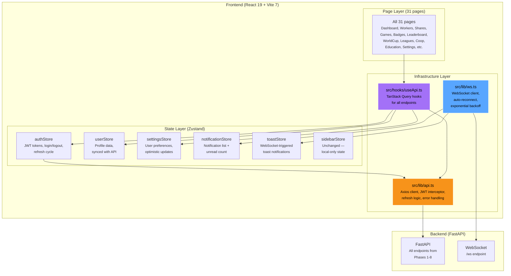
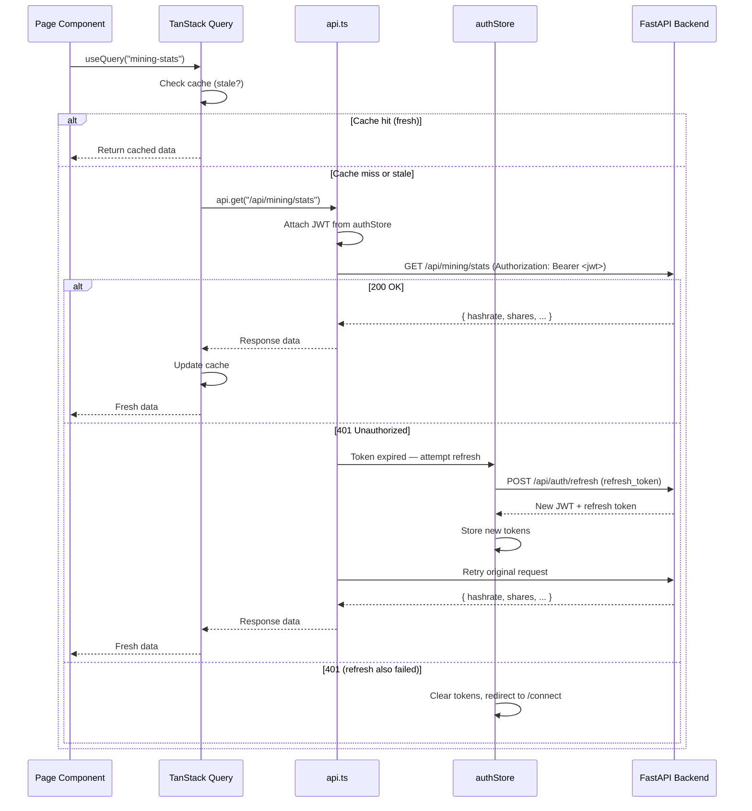

# Phase 9 — Frontend Integration

| Field        | Value                                          |
| ------------ | ---------------------------------------------- |
| **Duration** | 5 weeks                                        |
| **Status**   | Not Started                                    |
| **Owner**    | TBD                                            |
| **Depends**  | Phase 8 — Education System                     |
| **Blocks**   | Phase 10 — Production Readiness               |

---

## 9.1 Objectives

1. **Replace ALL mock data imports** across every frontend page with real API calls, creating a seamless connection between the React dashboard and the FastAPI backend.
2. **Integrate TanStack Query v5** for data fetching, caching, background refetching, and optimistic updates across all pages.
3. **Wire all 6 Zustand stores to backend APIs** — authStore (JWT flow), userStore (profile API), settingsStore (settings API), notificationStore (notification API + WebSocket), toastStore (WebSocket events), sidebarStore (unchanged).
4. **Build 3 core infrastructure files** — `src/lib/api.ts` (API client), `src/lib/ws.ts` (WebSocket client), `src/hooks/useApi.ts` (TanStack Query hooks) — without deleting mock data (gated behind `VITE_USE_MOCKS=true`).
5. **Achieve zero TypeScript errors** and comprehensive test coverage with Playwright E2E tests, Vitest unit tests, and axe-core accessibility tests.

---

## 9.2 Architecture Overview



### 9.2.1 Data Flow — Request Lifecycle



---

## 9.3 Core Infrastructure Files

### 9.3.1 API Client — `src/lib/api.ts`

```typescript
/**
 * api.ts — Centralized API client with JWT interceptor and token refresh.
 *
 * Features:
 * - Axios instance with base URL from VITE_API_URL
 * - Automatic JWT attachment via request interceptor
 * - Automatic 401 → token refresh → retry via response interceptor
 * - Request deduplication during refresh
 * - Type-safe request methods
 */

import axios, {
  type AxiosInstance,
  type AxiosRequestConfig,
  type InternalAxiosRequestConfig,
} from "axios";
import { useAuthStore } from "@/stores/authStore";

const BASE_URL = import.meta.env.VITE_API_URL || "http://localhost:8000";

// Create Axios instance
const apiClient: AxiosInstance = axios.create({
  baseURL: BASE_URL,
  timeout: 30_000,
  headers: {
    "Content-Type": "application/json",
  },
});

// --- Request Interceptor: Attach JWT ---
apiClient.interceptors.request.use(
  (config: InternalAxiosRequestConfig) => {
    const token = useAuthStore.getState().accessToken;
    if (token) {
      config.headers.Authorization = `Bearer ${token}`;
    }
    return config;
  },
  (error) => Promise.reject(error),
);

// --- Response Interceptor: Handle 401 + Token Refresh ---
let isRefreshing = false;
let failedQueue: Array<{
  resolve: (token: string) => void;
  reject: (error: unknown) => void;
}> = [];

const processQueue = (error: unknown, token: string | null = null) => {
  failedQueue.forEach((prom) => {
    if (token) {
      prom.resolve(token);
    } else {
      prom.reject(error);
    }
  });
  failedQueue = [];
};

apiClient.interceptors.response.use(
  (response) => response,
  async (error) => {
    const originalRequest = error.config;

    // Only handle 401s that haven't been retried
    if (error.response?.status !== 401 || originalRequest._retry) {
      return Promise.reject(error);
    }

    // Don't try to refresh if this IS the refresh request
    if (originalRequest.url?.includes("/auth/refresh")) {
      useAuthStore.getState().logout();
      return Promise.reject(error);
    }

    originalRequest._retry = true;

    if (isRefreshing) {
      // Another request is already refreshing — queue this one
      return new Promise((resolve, reject) => {
        failedQueue.push({
          resolve: (token: string) => {
            originalRequest.headers.Authorization = `Bearer ${token}`;
            resolve(apiClient(originalRequest));
          },
          reject,
        });
      });
    }

    isRefreshing = true;

    try {
      const refreshToken = useAuthStore.getState().refreshToken;
      if (!refreshToken) {
        throw new Error("No refresh token");
      }

      const response = await apiClient.post("/api/auth/refresh", {
        refresh_token: refreshToken,
      });

      const { access_token, refresh_token: newRefreshToken } = response.data;
      useAuthStore.getState().setTokens(access_token, newRefreshToken);

      processQueue(null, access_token);

      // Retry the original request
      originalRequest.headers.Authorization = `Bearer ${access_token}`;
      return apiClient(originalRequest);
    } catch (refreshError) {
      processQueue(refreshError, null);
      useAuthStore.getState().logout();
      return Promise.reject(refreshError);
    } finally {
      isRefreshing = false;
    }
  },
);

// --- Typed API Methods ---

export const api = {
  get: <T = unknown>(url: string, config?: AxiosRequestConfig) =>
    apiClient.get<T>(url, config).then((r) => r.data),

  post: <T = unknown>(url: string, data?: unknown, config?: AxiosRequestConfig) =>
    apiClient.post<T>(url, data, config).then((r) => r.data),

  put: <T = unknown>(url: string, data?: unknown, config?: AxiosRequestConfig) =>
    apiClient.put<T>(url, data, config).then((r) => r.data),

  patch: <T = unknown>(url: string, data?: unknown, config?: AxiosRequestConfig) =>
    apiClient.patch<T>(url, data, config).then((r) => r.data),

  delete: <T = unknown>(url: string, config?: AxiosRequestConfig) =>
    apiClient.delete<T>(url, config).then((r) => r.data),
};

export default api;
```

### 9.3.2 WebSocket Client — `src/lib/ws.ts`

```typescript
/**
 * ws.ts — WebSocket client with auto-reconnect and exponential backoff.
 *
 * Features:
 * - Auto-reconnect on disconnect with exponential backoff
 * - JWT authentication via query parameter
 * - Typed event handlers
 * - Heartbeat ping/pong
 * - Connection state management
 */

import { useAuthStore } from "@/stores/authStore";
import { useNotificationStore } from "@/stores/notificationStore";
import { useToastStore } from "@/stores/toastStore";

type WSEventHandler = (data: unknown) => void;

const WS_URL = import.meta.env.VITE_WS_URL || "ws://localhost:8000/ws";

// Backoff configuration
const INITIAL_BACKOFF_MS = 1_000;
const MAX_BACKOFF_MS = 30_000;
const BACKOFF_MULTIPLIER = 2;
const HEARTBEAT_INTERVAL_MS = 30_000;

class WebSocketClient {
  private ws: WebSocket | null = null;
  private handlers: Map<string, Set<WSEventHandler>> = new Map();
  private reconnectTimer: ReturnType<typeof setTimeout> | null = null;
  private heartbeatTimer: ReturnType<typeof setInterval> | null = null;
  private backoff = INITIAL_BACKOFF_MS;
  private isManualClose = false;
  private _isConnected = false;

  get isConnected(): boolean {
    return this._isConnected;
  }

  connect(): void {
    if (this.ws?.readyState === WebSocket.OPEN) return;

    const token = useAuthStore.getState().accessToken;
    if (!token) {
      console.warn("[WS] No auth token, skipping connection");
      return;
    }

    this.isManualClose = false;

    try {
      this.ws = new WebSocket(`${WS_URL}?token=${token}`);

      this.ws.onopen = () => {
        console.info("[WS] Connected");
        this._isConnected = true;
        this.backoff = INITIAL_BACKOFF_MS;
        this.startHeartbeat();
      };

      this.ws.onmessage = (event) => {
        try {
          const msg = JSON.parse(event.data);
          this.dispatch(msg.type, msg.data);
        } catch {
          console.warn("[WS] Failed to parse message", event.data);
        }
      };

      this.ws.onclose = (event) => {
        console.info(`[WS] Disconnected (code: ${event.code})`);
        this._isConnected = false;
        this.stopHeartbeat();

        if (!this.isManualClose && event.code !== 4001) {
          this.scheduleReconnect();
        }
      };

      this.ws.onerror = (error) => {
        console.error("[WS] Error", error);
      };
    } catch (error) {
      console.error("[WS] Connection failed", error);
      this.scheduleReconnect();
    }
  }

  disconnect(): void {
    this.isManualClose = true;
    this.stopHeartbeat();
    if (this.reconnectTimer) {
      clearTimeout(this.reconnectTimer);
      this.reconnectTimer = null;
    }
    if (this.ws) {
      this.ws.close(1000, "Manual disconnect");
      this.ws = null;
    }
    this._isConnected = false;
  }

  on(event: string, handler: WSEventHandler): () => void {
    if (!this.handlers.has(event)) {
      this.handlers.set(event, new Set());
    }
    this.handlers.get(event)!.add(handler);

    // Return unsubscribe function
    return () => {
      this.handlers.get(event)?.delete(handler);
    };
  }

  send(type: string, data: unknown = {}): void {
    if (this.ws?.readyState === WebSocket.OPEN) {
      this.ws.send(JSON.stringify({ type, ...data }));
    }
  }

  private dispatch(type: string, data: unknown): void {
    // Route to registered handlers
    const handlers = this.handlers.get(type);
    if (handlers) {
      handlers.forEach((handler) => handler(data));
    }

    // Built-in routing to Zustand stores
    switch (type) {
      case "notification":
        useNotificationStore.getState().addNotification(data as never);
        break;
      case "pong":
        // Heartbeat response — connection is alive
        break;
      case "toast":
        useToastStore.getState().addToast(data as never);
        break;
    }
  }

  private scheduleReconnect(): void {
    if (this.reconnectTimer) return;

    console.info(`[WS] Reconnecting in ${this.backoff}ms...`);
    this.reconnectTimer = setTimeout(() => {
      this.reconnectTimer = null;
      this.connect();
    }, this.backoff);

    // Exponential backoff with cap
    this.backoff = Math.min(this.backoff * BACKOFF_MULTIPLIER, MAX_BACKOFF_MS);
  }

  private startHeartbeat(): void {
    this.heartbeatTimer = setInterval(() => {
      this.send("ping");
    }, HEARTBEAT_INTERVAL_MS);
  }

  private stopHeartbeat(): void {
    if (this.heartbeatTimer) {
      clearInterval(this.heartbeatTimer);
      this.heartbeatTimer = null;
    }
  }
}

// Singleton instance
export const wsClient = new WebSocketClient();
export default wsClient;
```

### 9.3.3 TanStack Query Hooks — `src/hooks/useApi.ts`

```typescript
/**
 * useApi.ts — TanStack Query hooks for all backend endpoints.
 *
 * Organized by domain: mining, games, gamification, competition, social, education.
 * Each hook wraps a useQuery or useMutation with proper types, keys, and stale times.
 */

import {
  useQuery,
  useMutation,
  useQueryClient,
  type UseQueryOptions,
} from "@tanstack/react-query";
import api from "@/lib/api";
import type { WeeklyGameData } from "@/types/game";

// --- Query Key Factory ---
export const queryKeys = {
  // Mining
  miningStats: ["mining", "stats"] as const,
  workers: ["mining", "workers"] as const,
  shares: (page: number) => ["mining", "shares", page] as const,
  difficulty: ["mining", "difficulty"] as const,
  blocks: ["mining", "blocks"] as const,
  hashrate: ["mining", "hashrate"] as const,

  // Games
  weeklyGameData: ["games", "weekly-data"] as const,
  gameHistory: ["games", "history"] as const,
  lotteryCurrentKey: ["lottery", "current"] as const,
  lotteryStats: ["lottery", "stats"] as const,

  // Gamification
  userXP: ["gamification", "xp"] as const,
  badges: ["gamification", "badges"] as const,
  streaks: ["gamification", "streaks"] as const,
  level: ["gamification", "level"] as const,

  // Competition
  leaderboard: (period: string) => ["leaderboard", period] as const,
  myRankings: ["leaderboard", "me"] as const,
  competitions: ["competitions"] as const,
  competition: (id: string) => ["competitions", id] as const,
  leagues: ["leagues"] as const,
  league: (id: string) => ["leagues", id] as const,

  // Social
  myCoop: ["coop", "mine"] as const,
  notifications: ["notifications"] as const,
  unreadCount: ["notifications", "unread-count"] as const,
  activityFeed: ["activity"] as const,
  publicProfile: (id: string) => ["public", "miners", id] as const,

  // Education
  tracks: ["education", "tracks"] as const,
  track: (id: string) => ["education", "tracks", id] as const,
  lesson: (trackId: string, lessonId: string) =>
    ["education", "tracks", trackId, "lessons", lessonId] as const,
  progress: ["education", "progress"] as const,
  recommendations: ["education", "recommendations"] as const,

  // User
  profile: ["user", "profile"] as const,
  settings: ["user", "settings"] as const,
};

// --- Mining Hooks ---

export function useMiningStats() {
  return useQuery({
    queryKey: queryKeys.miningStats,
    queryFn: () => api.get("/api/mining/stats"),
    staleTime: 30_000, // 30 seconds
    refetchInterval: 30_000,
  });
}

export function useWorkers() {
  return useQuery({
    queryKey: queryKeys.workers,
    queryFn: () => api.get("/api/mining/workers"),
    staleTime: 60_000,
  });
}

export function useHashrateHistory() {
  return useQuery({
    queryKey: queryKeys.hashrate,
    queryFn: () => api.get("/api/mining/hashrate/history"),
    staleTime: 60_000,
  });
}

// --- Game Hooks ---

export function useWeeklyGameData() {
  return useQuery<WeeklyGameData>({
    queryKey: queryKeys.weeklyGameData,
    queryFn: () => api.get("/api/games/weekly-data"),
    staleTime: 5 * 60_000, // 5 minutes
  });
}

export function usePlayGame() {
  const qc = useQueryClient();
  return useMutation({
    mutationFn: (data: { game_type: string; result_data?: object }) =>
      api.post("/api/games/play", data),
    onSuccess: () => {
      qc.invalidateQueries({ queryKey: queryKeys.gameHistory });
    },
  });
}

export function useLotteryCurrent() {
  return useQuery({
    queryKey: queryKeys.lotteryCurrentKey,
    queryFn: () => api.get("/api/lottery/current"),
    staleTime: 5 * 60_000,
  });
}

// --- Gamification Hooks ---

export function useUserXP() {
  return useQuery({
    queryKey: queryKeys.userXP,
    queryFn: () => api.get("/api/gamification/xp"),
    staleTime: 60_000,
  });
}

export function useBadges() {
  return useQuery({
    queryKey: queryKeys.badges,
    queryFn: () => api.get("/api/gamification/badges"),
    staleTime: 5 * 60_000,
  });
}

// --- Competition Hooks ---

export function useLeaderboard(period: string, page = 0) {
  return useQuery({
    queryKey: [...queryKeys.leaderboard(period), page],
    queryFn: () =>
      api.get(`/api/leaderboard/${period}`, { params: { offset: page * 50 } }),
    staleTime: 5 * 60_000,
  });
}

export function useMyRankings() {
  return useQuery({
    queryKey: queryKeys.myRankings,
    queryFn: () => api.get("/api/leaderboard/me"),
    staleTime: 5 * 60_000,
  });
}

// --- Social Hooks ---

export function useMyCoop() {
  return useQuery({
    queryKey: queryKeys.myCoop,
    queryFn: () => api.get("/api/coops/mine"),
    staleTime: 60_000,
    retry: false, // 404 if not in a coop — not an error
  });
}

export function useJoinCoop() {
  const qc = useQueryClient();
  return useMutation({
    mutationFn: (invite_code: string) =>
      api.post("/api/coops/join", { invite_code }),
    onSuccess: () => {
      qc.invalidateQueries({ queryKey: queryKeys.myCoop });
    },
  });
}

export function useNotifications(limit = 20) {
  return useQuery({
    queryKey: queryKeys.notifications,
    queryFn: () =>
      api.get("/api/notifications", { params: { limit } }),
    staleTime: 30_000,
  });
}

export function useUnreadCount() {
  return useQuery({
    queryKey: queryKeys.unreadCount,
    queryFn: () => api.get("/api/notifications/unread-count"),
    staleTime: 10_000,
    refetchInterval: 30_000,
  });
}

// --- Education Hooks ---

export function useTracks() {
  return useQuery({
    queryKey: queryKeys.tracks,
    queryFn: () => api.get("/api/education/tracks"),
    staleTime: 10 * 60_000,
  });
}

export function useLesson(trackId: string, lessonId: string) {
  return useQuery({
    queryKey: queryKeys.lesson(trackId, lessonId),
    queryFn: () =>
      api.get(`/api/education/tracks/${trackId}/lessons/${lessonId}`),
    staleTime: 10 * 60_000,
    enabled: !!trackId && !!lessonId,
  });
}

export function useCompleteLesson() {
  const qc = useQueryClient();
  return useMutation({
    mutationFn: (lessonId: string) =>
      api.post(`/api/education/lessons/${lessonId}/complete`),
    onSuccess: () => {
      qc.invalidateQueries({ queryKey: queryKeys.progress });
      qc.invalidateQueries({ queryKey: queryKeys.recommendations });
      qc.invalidateQueries({ queryKey: queryKeys.userXP });
      qc.invalidateQueries({ queryKey: queryKeys.badges });
    },
  });
}

// --- Settings (Optimistic Updates) ---

export function useSettings() {
  return useQuery({
    queryKey: queryKeys.settings,
    queryFn: () => api.get("/api/user/settings"),
    staleTime: 5 * 60_000,
  });
}

export function useUpdateSettings() {
  const qc = useQueryClient();
  return useMutation({
    mutationFn: (data: object) => api.patch("/api/user/settings", data),
    onMutate: async (newSettings) => {
      // Optimistic update
      await qc.cancelQueries({ queryKey: queryKeys.settings });
      const previous = qc.getQueryData(queryKeys.settings);
      qc.setQueryData(queryKeys.settings, (old: object) => ({
        ...old,
        ...newSettings,
      }));
      return { previous };
    },
    onError: (_err, _vars, context) => {
      // Rollback on error
      qc.setQueryData(queryKeys.settings, context?.previous);
    },
    onSettled: () => {
      qc.invalidateQueries({ queryKey: queryKeys.settings });
    },
  });
}
```

---

## 9.4 Zustand Store Wiring

### 9.4.1 Store-to-API Mapping

| Zustand Store       | Backend Connection                                      | Auth Flow                        |
|---------------------|--------------------------------------------------------|----------------------------------|
| `authStore`         | `POST /api/auth/connect` → JWT + refresh token         | BIP-322 signature or Lightning   |
| `userStore`         | `GET /api/user/profile`, `PATCH /api/user/profile`     | JWT required                     |
| `settingsStore`     | `GET /api/user/settings`, `PATCH /api/user/settings`   | JWT + optimistic updates         |
| `notificationStore` | `GET /api/notifications`, `WS notification events`     | JWT + WebSocket                  |
| `toastStore`        | `WS toast events` (mining, rewards, etc.)              | WebSocket push                   |
| `sidebarStore`      | *No backend connection* — local UI state only          | N/A                              |

### 9.4.2 Mock Data Gating

```typescript
/**
 * Environment flag to toggle between mock data and real API.
 * Set VITE_USE_MOCKS=true in .env.development for local dev without backend.
 */
export const USE_MOCKS = import.meta.env.VITE_USE_MOCKS === "true";

/**
 * Conditional import helper.
 * In production, mock data is never bundled (tree-shaken out).
 */
export async function getMockOrApi<T>(
  mockImport: () => Promise<{ default: T }>,
  apiCall: () => Promise<T>,
): Promise<T> {
  if (USE_MOCKS) {
    const mod = await mockImport();
    return mod.default;
  }
  return apiCall();
}
```

---

## 9.5 Pages to Update

Every data-dependent page must be updated to use TanStack Query hooks. Mock imports are not deleted but gated behind `VITE_USE_MOCKS`.

### 9.5.1 Page Update Matrix

| # | Page                    | File Path                              | Hooks Used                                         | Loading State    |
|---|------------------------|----------------------------------------|----------------------------------------------------|------------------|
| 1 | Dashboard              | `src/pages/Dashboard.tsx`              | useMiningStats, useHashrateHistory, useUserXP      | Skeleton grid    |
| 2 | Workers                | `src/pages/mining/WorkersPage.tsx`     | useWorkers                                         | Skeleton table   |
| 3 | Shares                 | `src/pages/mining/SharesPage.tsx`      | useShares (paginated)                              | Skeleton list    |
| 4 | Difficulty             | `src/pages/mining/DifficultyPage.tsx`  | useDifficulty                                      | Skeleton meter   |
| 5 | Blocks                 | `src/pages/mining/BlocksPage.tsx`      | useBlocks                                          | Skeleton cards   |
| 6 | GameHub                | `src/pages/games/GameHub.tsx`          | useWeeklyGameData, useLotteryCurrent               | Skeleton cards   |
| 7 | HammerGame             | `src/pages/games/HammerGame.tsx`       | useWeeklyGameData, usePlayGame                     | Skeleton         |
| 8 | HorseRace              | `src/pages/games/HorseRace.tsx`        | useWeeklyGameData, usePlayGame                     | Skeleton         |
| 9 | SlotMachine            | `src/pages/games/SlotMachine.tsx`      | useWeeklyGameData, usePlayGame                     | Skeleton         |
| 10| ScratchCard            | `src/pages/games/ScratchCard.tsx`      | useWeeklyGameData, usePlayGame                     | Skeleton         |
| 11| BadgesPage             | `src/pages/profile/BadgesPage.tsx`     | useBadges                                          | Skeleton grid    |
| 12| StreaksPage             | `src/pages/profile/StreaksPage.tsx`     | useStreaks                                         | Skeleton         |
| 13| LevelPage              | `src/pages/profile/LevelPage.tsx`      | useUserXP                                          | Skeleton         |
| 14| ProfilePage            | `src/pages/profile/ProfilePage.tsx`    | useProfile, useMiningStats                         | Skeleton         |
| 15| LeaderboardPage        | `src/pages/leaderboard/LeaderboardPage.tsx` | useLeaderboard (4 tabs), useMyRankings       | Skeleton table   |
| 16| WorldCupPage           | `src/pages/worldcup/WorldCupPage.tsx`  | useCompetition, useCompetitionGroups               | Skeleton bracket |
| 17| MatchDetailPage        | `src/pages/worldcup/MatchDetailPage.tsx` | useMatch                                         | Skeleton         |
| 18| RegisterPage           | `src/pages/worldcup/RegisterPage.tsx`  | useRegisterCompetition                             | Form             |
| 19| MyTeamPage             | `src/pages/worldcup/MyTeamPage.tsx`    | useMyTeam                                          | Skeleton         |
| 20| LeaguesPage            | `src/pages/leagues/LeaguesPage.tsx`    | useLeagues, useLeague                              | Skeleton table   |
| 21| CoopDashboard          | `src/pages/coop/CoopDashboard.tsx`     | useMyCoop                                          | Skeleton         |
| 22| CreateCoopPage         | `src/pages/coop/CreateCoopPage.tsx`    | useCreateCoop                                      | Form             |
| 23| JoinCoopPage           | `src/pages/coop/JoinCoopPage.tsx`      | useJoinCoop                                        | Form             |
| 24| EducationLanding       | `src/pages/education/EducationLanding.tsx` | useTracks                                      | Skeleton cards   |
| 25| LearnHub               | `src/pages/education/LearnHub.tsx`     | useTrack, useProgress                              | Skeleton         |
| 26| LessonPage             | `src/pages/education/LessonPage.tsx`   | useLesson, useCompleteLesson                       | Skeleton         |
| 27| SettingsPage           | `src/pages/settings/SettingsPage.tsx`  | useSettings, useUpdateSettings                     | Skeleton form    |
| 28| ConnectPage            | `src/pages/ConnectPage.tsx`            | useConnect (mutation)                              | Form             |
| 29| PublicLeaderboardPage  | `src/pages/public/PublicLeaderboardPage.tsx` | useLeaderboard                              | Skeleton table   |
| 30| PublicMinerPage        | `src/pages/public/PublicMinerPage.tsx` | usePublicProfile                                   | Skeleton         |
| 31| GiftPage               | `src/pages/GiftPage.tsx`              | usePublicProfile                                   | Skeleton         |

### 9.5.2 Error Boundary Strategy

```typescript
/**
 * Per-section error boundaries prevent one failing API from breaking the whole page.
 * Used in Dashboard (5 sections), and any page with multiple data sources.
 */
import { ErrorBoundary } from "react-error-boundary";

function SectionErrorFallback({ error, resetErrorBoundary }) {
  return (
    <div className="rounded-lg border border-red-500/20 bg-red-500/5 p-4">
      <p className="text-sm text-red-400">Failed to load this section.</p>
      <button
        onClick={resetErrorBoundary}
        className="mt-2 text-xs text-red-300 underline"
      >
        Retry
      </button>
    </div>
  );
}

// Usage in Dashboard:
<ErrorBoundary FallbackComponent={SectionErrorFallback}>
  <HashrateChart />
</ErrorBoundary>

<ErrorBoundary FallbackComponent={SectionErrorFallback}>
  <LiveShareFeed />
</ErrorBoundary>
```

---

## 9.6 Database Schema

**No new backend tables or endpoints.** Phase 9 is a frontend-only phase that consumes existing backend APIs from Phases 1-8.

---

## 9.7 API Endpoints

**No new endpoints.** Phase 9 consumes all existing endpoints from Phases 1-8. The complete endpoint inventory being consumed:

| Phase | Endpoint Count | Categories                              |
|-------|----------------|-----------------------------------------|
| 1-3   | ~10            | Auth, mining stats, worker management   |
| 4     | ~8             | XP, badges, streaks, levels             |
| 5     | 7              | Games, lottery                          |
| 6     | 15             | Leaderboards, competitions, leagues     |
| 7     | 17             | Coops, notifications, activity, profiles|
| 8     | 6              | Education tracks, lessons, progress     |
| **Total** | **~63**    | **All consumed by Phase 9 frontend**    |

---

## 9.8 Testing

### 9.8.1 Vitest Unit Tests

| # | Test Case                                         | Module                   | Assertions                                              |
|---|--------------------------------------------------|--------------------------|----------------------------------------------------------|
| 1 | API client — attaches JWT header                  | `test_api.ts`            | Authorization header present                             |
| 2 | API client — 401 triggers refresh                 | `test_api.ts`            | Refresh endpoint called, original retried                |
| 3 | API client — refresh failure → logout             | `test_api.ts`            | authStore.logout() called                                |
| 4 | API client — concurrent 401s deduplicated         | `test_api.ts`            | Only one refresh request sent                            |
| 5 | WS client — connect with token                    | `test_ws.ts`             | WebSocket opened with token param                        |
| 6 | WS client — auto-reconnect on close               | `test_ws.ts`             | Reconnects after backoff delay                           |
| 7 | WS client — exponential backoff                   | `test_ws.ts`             | 1s → 2s → 4s → 8s → ... → 30s cap                      |
| 8 | WS client — heartbeat ping/pong                   | `test_ws.ts`             | Ping sent every 30s                                      |
| 9 | WS client — notification routing                  | `test_ws.ts`             | Notification events → notificationStore                  |
| 10| Query keys — uniqueness                           | `test_hooks.ts`          | No duplicate keys across all domains                     |
| 11| Mock gating — VITE_USE_MOCKS=true                | `test_mocks.ts`          | Mock data returned, no API call                          |
| 12| Mock gating — VITE_USE_MOCKS=false               | `test_mocks.ts`          | API called, mock not imported                            |
| 13| Optimistic update — settings                      | `test_hooks.ts`          | Cache updated before API response                        |
| 14| Optimistic update — rollback on error              | `test_hooks.ts`          | Cache reverted to previous value                         |
| 15| Error boundary — renders fallback                  | `test_errors.ts`         | Error boundary catches, shows retry button               |

### 9.8.2 Playwright E2E Tests

| # | Test Case                                         | Flow                                                             |
|---|--------------------------------------------------|------------------------------------------------------------------|
| 1 | Auth flow — connect wallet                        | /connect → sign → dashboard (JWT stored)                         |
| 2 | Auth flow — token refresh                         | Force expire → action → silent refresh → action succeeds         |
| 3 | Auth flow — logout                                | Logout → redirect to /connect → auth-guarded routes blocked      |
| 4 | Dashboard — loads real data                       | /dashboard → all 5 sections render (not skeletons)               |
| 5 | Mining — workers page                             | /mining/workers → table renders with worker rows                 |
| 6 | Mining — shares page (paginated)                  | /mining/shares → paginate → next page loads                      |
| 7 | Games — hammer game                               | /games/hammer → weekly data renders → play → session recorded    |
| 8 | Games — slot machine                              | /games/slots → reels render from hash                            |
| 9 | Gamification — badges page                        | /badges → badges grid renders                                    |
| 10| Gamification — level page                         | /profile/level → XP bar renders                                  |
| 11| Leaderboard — 4 tabs                              | /leaderboard → switch weekly/monthly/alltime/country             |
| 12| World Cup — groups and bracket                    | /world-cup → group tables + bracket render                       |
| 13| Leagues — table with zones                        | /leagues → table with promotion/relegation zones                 |
| 14| Coop — create flow                                | /coop/create → submit → invite code shown                        |
| 15| Coop — join flow                                  | /coop/join → enter code → dashboard shows coop                   |
| 16| Education — lesson completion                     | /education/1/1-1 → read → complete → XP toast                   |
| 17| Settings — update + optimistic                    | /settings → toggle → immediate UI update                         |
| 18| Notifications — real-time push                    | Trigger event → toast appears → notification in panel            |
| 19| Public profile — privacy enforcement              | Disable public → visit /public/miners/{id} → 404                |
| 20| Mobile responsive — bottom tab bar                | Viewport 390px → bottom tab bar renders, sidebar hidden          |

### 9.8.3 Accessibility Tests (axe-core)

```typescript
/**
 * Accessibility test suite using @axe-core/playwright.
 * Run on every page to ensure WCAG 2.1 AA compliance.
 */

import { test, expect } from "@playwright/test";
import AxeBuilder from "@axe-core/playwright";

const pages = [
  "/dashboard",
  "/mining/workers",
  "/mining/shares",
  "/games",
  "/games/hammer",
  "/badges",
  "/leaderboard",
  "/world-cup",
  "/leagues",
  "/coop",
  "/education",
  "/settings",
  "/profile",
];

for (const page of pages) {
  test(`a11y: ${page} has no violations`, async ({ page: pw }) => {
    await pw.goto(page);
    const results = await new AxeBuilder({ page: pw }).analyze();
    expect(results.violations).toEqual([]);
  });
}
```

### 9.8.4 Coverage Targets

- **Vitest unit tests:** 85%+ on `api.ts`, `ws.ts`, `useApi.ts`
- **Playwright E2E:** 20 test cases covering all user flows
- **Accessibility:** 0 axe-core violations on all 13 major pages
- **TypeScript:** 0 errors (`tsc --noEmit`)

```bash
# Unit tests
npx vitest run --coverage --coverage.thresholds.lines=85

# E2E tests
npx playwright test

# Type check
npx tsc --noEmit

# Accessibility
npx playwright test tests/a11y/
```

---

## 9.9 Deliverables Checklist

- [ ] `src/lib/api.ts` — Axios client with JWT interceptor and refresh logic
- [ ] `src/lib/ws.ts` — WebSocket client with auto-reconnect and exponential backoff
- [ ] `src/hooks/useApi.ts` — TanStack Query hooks for all endpoints
- [ ] TanStack Query v5 installed and configured (`QueryClientProvider`)
- [ ] `VITE_USE_MOCKS=true` gate — mock data preserved, not deleted
- [ ] authStore wired to JWT flow (`/api/auth/connect`, `/api/auth/refresh`)
- [ ] userStore wired to profile API
- [ ] settingsStore wired to settings API with optimistic updates
- [ ] notificationStore wired to notification API + WebSocket push
- [ ] toastStore wired to WebSocket event routing
- [ ] Dashboard page — real API data
- [ ] Workers page — real API data
- [ ] Shares page — real API data (paginated)
- [ ] Difficulty page — real API data
- [ ] Blocks page — real API data
- [ ] GameHub — real API data
- [ ] Hammer, Horse Race, Slots, Scratch Card — real API data + play recording
- [ ] Badges, Streaks, Level pages — real API data
- [ ] ProfilePage — real API data
- [ ] LeaderboardPage (4 tabs) — real API data
- [ ] WorldCupPage, MatchDetail, Register, MyTeam — real API data
- [ ] LeaguesPage — real API data
- [ ] CoopDashboard, CreateCoop, JoinCoop — real API data
- [ ] Education pages (Landing, LearnHub, Lesson) — real API data
- [ ] SettingsPage — real API data with optimistic updates
- [ ] ConnectPage — real auth flow
- [ ] Public pages (Leaderboard, MinerProfile) — real API data
- [ ] Error boundaries on all data-dependent sections
- [ ] Loading skeletons on all pages
- [ ] 0 TypeScript errors (`tsc --noEmit`)
- [ ] Vitest unit tests: 15 test cases
- [ ] Playwright E2E tests: 20 test cases
- [ ] axe-core accessibility: 0 violations on 13 pages

---

## 9.10 Week-by-Week Schedule

### Week 1 — Infrastructure Layer

- Install TanStack Query v5, configure `QueryClientProvider`
- Build `src/lib/api.ts` (Axios client, JWT interceptor, refresh)
- Build `src/lib/ws.ts` (WebSocket client, auto-reconnect, backoff)
- Build `src/hooks/useApi.ts` (query key factory, first batch of hooks)
- Implement `VITE_USE_MOCKS` gate
- Wire authStore to JWT flow
- Write unit tests for api.ts and ws.ts (tests 1-9)

### Week 2 — Core Pages (Mining + Games)

- Wire Dashboard (5 sections with error boundaries)
- Wire Workers, Shares (paginated), Difficulty, Blocks pages
- Wire GameHub, Hammer, Horse Race, Slots, Scratch Card
- Add loading skeletons to all wired pages
- Wire toastStore to WebSocket events

### Week 3 — Gamification + Competition Pages

- Wire BadgesPage, StreaksPage, LevelPage, ProfilePage
- Wire LeaderboardPage (4 tabs)
- Wire WorldCupPage, MatchDetailPage, RegisterPage, MyTeamPage
- Wire LeaguesPage
- Wire userStore to profile API

### Week 4 — Social + Education + Settings

- Wire CoopDashboard, CreateCoopPage, JoinCoopPage
- Wire EducationLanding, LearnHub, LessonPage
- Wire SettingsPage with optimistic updates
- Wire notificationStore to notification API + WebSocket
- Wire ConnectPage to real auth flow
- Wire PublicLeaderboardPage, PublicMinerPage, GiftPage
- Add error boundaries to all remaining pages

### Week 5 — Testing & Polish

- Playwright E2E tests (20 test cases)
- axe-core accessibility audit (13 pages)
- Fix all TypeScript errors
- Mobile responsive verification
- Performance audit (bundle size, query waterfalls)
- Coverage report and gap filling
- Code review and Phase 9 sign-off

---

## 9.11 Risk Register

| Risk                                                  | Impact | Likelihood | Mitigation                                                          |
|-------------------------------------------------------|--------|------------|---------------------------------------------------------------------|
| TanStack Query bundle size increase                   | Medium | Medium     | Tree-shaking; measured: ~12KB gzipped; acceptable                   |
| WebSocket reconnect storms after server restart       | High   | Medium     | Exponential backoff with jitter; max 30s between attempts           |
| JWT refresh race condition                            | High   | Low        | Request queue during refresh; only one refresh in-flight            |
| Mock data diverges from real API shapes               | High   | High       | Shared TypeScript types; CI test against real backend shapes        |
| 401 redirect loop                                     | High   | Low        | Guard: don't refresh if already refreshing; max 1 retry per request|
| Query waterfall (sequential data fetching)            | Medium | Medium     | Parallel queries in page loaders; prefetch on route transition      |
| Bundle size regression                                | Medium | Medium     | CI budget check; current ~397KB gzipped + ~12KB TanStack = ~409KB  |

---

*Phase 9 is the culmination of all backend work — it connects the beautiful frontend built in Phases 1-11 to the real mining data flowing through Phases 1-8 of the backend. No new backend code is written; this is pure frontend integration.*
