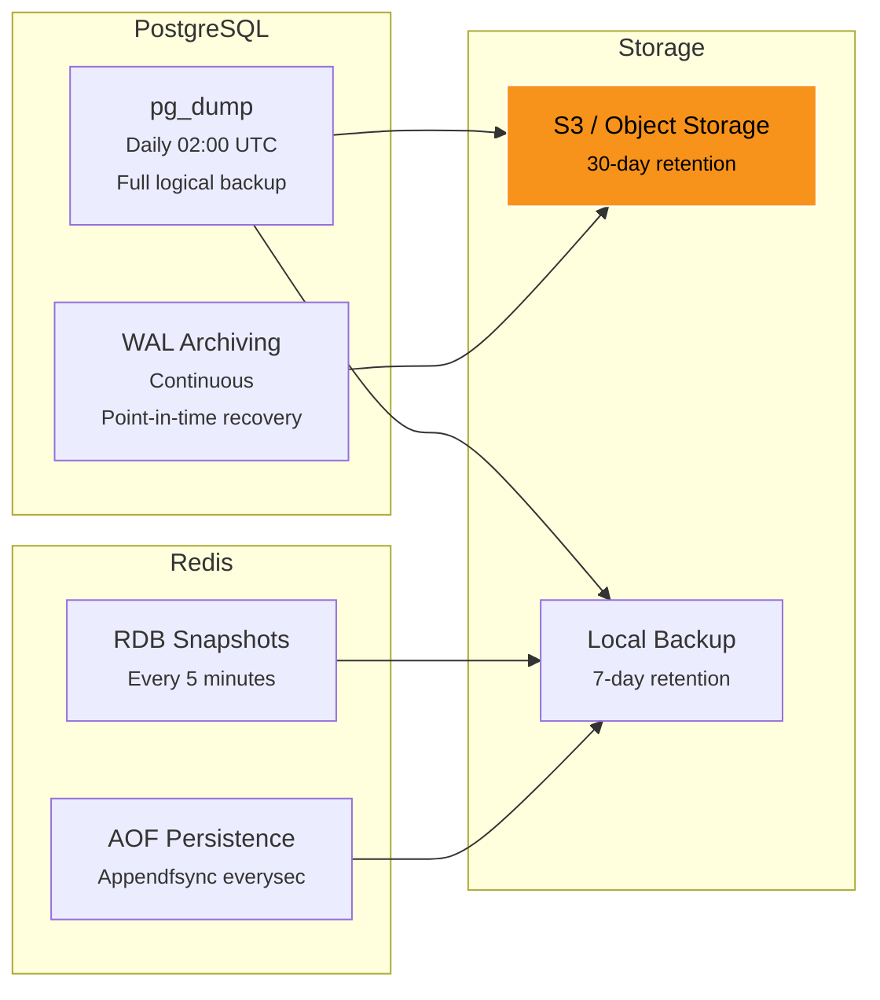

# Phase 10 — Production Readiness

| Field        | Value                                          |
| ------------ | ---------------------------------------------- |
| **Duration** | 4 weeks                                        |
| **Status**   | Not Started                                    |
| **Owner**    | TBD                                            |
| **Depends**  | Phase 9 — Frontend Integration                 |
| **Blocks**   | Public Launch                                  |

---

## 10.1 Objectives

1. **Complete a security audit** against OWASP Top 10, covering SQL injection, XSS, CSRF, authentication bypass, and rate limiting across all ~63 API endpoints.
2. **Optimize performance** via query analysis (EXPLAIN ANALYZE), missing index identification, connection pooling tuning, and Redis pool configuration.
3. **Implement tiered rate limiting** — unauthenticated (30/min), authenticated (120/min), WebSocket (60 msg/min), API keys (600/min) — to protect against abuse while not impacting legitimate users.
4. **Deploy comprehensive monitoring** with Prometheus metrics, Grafana dashboards (4 dashboards), and alerting (error rate > 1%, latency p99 > 500ms, worker offline > 30min).
5. **Establish production operations** — automated backups, Docker Compose production config, health checks, zero-downtime deployments, and an audit log for security-sensitive actions.

---

## 10.2 Architecture Overview

```mermaid
graph TB
    subgraph "Security Layer"
        OWASP["OWASP Top 10 Audit<br/><small>SQL injection, XSS, CSRF,<br/>auth bypass, rate limiting</small>"]
        PYDANTIC["Pydantic Strict Mode<br/><small>Input validation on<br/>all 63 endpoints</small>"]
        RATE["Rate Limiter<br/><small>Sliding window per tier<br/>Redis-backed</small>"]
        AUDIT["Audit Log<br/><small>Security-sensitive actions<br/>immutable append-only</small>"]
    end

    subgraph "Performance Layer"
        QUERY["Query Optimization<br/><small>EXPLAIN ANALYZE,<br/>missing indexes</small>"]
        POOL["Connection Pooling<br/><small>asyncpg min=5 max=20<br/>Redis max=20</small>"]
        CACHE["Cache Strategy<br/><small>Redis TTLs,<br/>invalidation rules</small>"]
    end

    subgraph "Monitoring Layer"
        PROM["Prometheus<br/><small>prometheus-fastapi-<br/>instrumentator</small>"]
        GRAF["Grafana<br/><small>4 dashboards</small>"]
        ALERT["Alerting<br/><small>Error rate, latency,<br/>worker offline</small>"]
    end

    subgraph "Operations Layer"
        DOCKER["Docker Compose<br/><small>Production config,<br/>health checks</small>"]
        BACKUP["Backup Strategy<br/><small>pg_dump daily,<br/>WAL archiving,<br/>Redis RDB+AOF</small>"]
        DEPLOY["Zero-Downtime<br/><small>Rolling updates,<br/>health checks</small>"]
    end

    OWASP --> PYDANTIC
    PYDANTIC --> RATE
    RATE --> AUDIT

    QUERY --> POOL
    POOL --> CACHE

    PROM --> GRAF --> ALERT

    DOCKER --> BACKUP --> DEPLOY

    style OWASP fill:#ff6b6b,stroke:#fff,color:#000
    style PROM fill:#f7931a,stroke:#fff,color:#000
    style DOCKER fill:#58a6ff,stroke:#fff,color:#000
```



---

## 10.3 Security Audit

### 10.3.1 OWASP Top 10 Checklist

| # | OWASP Category                    | Risk Area in TBG                           | Status | Mitigation                                                |
|---|-----------------------------------|--------------------------------------------|--------|-----------------------------------------------------------|
| 1 | A01: Broken Access Control        | Auth bypass on protected endpoints         | [ ]    | JWT verification on all protected routes; role checks     |
| 2 | A02: Cryptographic Failures       | JWT secret exposure, weak hashing          | [ ]    | RS256 JWT; bcrypt for any passwords; secrets in Vault     |
| 3 | A03: Injection                    | SQL injection via raw queries              | [ ]    | Parameterized queries everywhere; Pydantic strict mode    |
| 4 | A04: Insecure Design              | Missing rate limits, no audit trail        | [ ]    | Tiered rate limiting; audit_log table                     |
| 5 | A05: Security Misconfiguration    | Debug mode, default credentials, CORS      | [ ]    | Strict CORS; no debug in production; rotate all defaults  |
| 6 | A06: Vulnerable Components        | Outdated dependencies with CVEs            | [ ]    | `pip-audit` + `npm audit` in CI; automated Dependabot     |
| 7 | A07: Auth Failures                | Brute force on auth endpoints              | [ ]    | Rate limit /auth/* to 5/min per IP; lockout after 10 fails|
| 8 | A08: Software/Data Integrity      | Unsigned JWT, unverified updates           | [ ]    | RS256 signed JWTs; Docker image digest verification       |
| 9 | A09: Logging/Monitoring Failures  | Missing security event logging             | [ ]    | Audit log for all auth/admin actions; centralized logging |
| 10| A10: SSRF                         | No outbound requests from user input       | [ ]    | Only Claude API for recaps; no user-controlled URLs       |

### 10.3.2 SQL Injection Audit

```python
"""
security_audit.py — Scan all raw SQL queries for injection risks.

Every text() query in the codebase must use :param placeholders.
No f-strings or .format() with user input in SQL.
"""

import ast
import sys
from pathlib import Path


RISKY_PATTERNS = [
    "f\"SELECT",
    "f'SELECT",
    ".format(",
    "% (",
    "f\"INSERT",
    "f'INSERT",
    "f\"UPDATE",
    "f'UPDATE",
    "f\"DELETE",
    "f'DELETE",
]


def scan_file(filepath: Path) -> list[str]:
    """Scan a Python file for potential SQL injection patterns."""
    issues = []
    content = filepath.read_text()

    for i, line in enumerate(content.split("\n"), 1):
        for pattern in RISKY_PATTERNS:
            if pattern in line and "test" not in str(filepath):
                issues.append(f"{filepath}:{i}: Potential SQL injection: {line.strip()}")

    return issues


def audit_sql_injection(root: Path) -> list[str]:
    """Scan all Python files for SQL injection risks."""
    all_issues = []
    for py_file in root.rglob("*.py"):
        issues = scan_file(py_file)
        all_issues.extend(issues)
    return all_issues


# Run as: python -m app.security_audit
if __name__ == "__main__":
    issues = audit_sql_injection(Path("app"))
    if issues:
        print(f"FAIL: {len(issues)} potential SQL injection risks found:")
        for issue in issues:
            print(f"  {issue}")
        sys.exit(1)
    else:
        print("PASS: No SQL injection risks detected.")
```

### 10.3.3 Input Validation — Pydantic Strict Mode

```python
"""
All request schemas use Pydantic strict mode to prevent type coercion attacks.
"""

from pydantic import BaseModel, Field, ConfigDict


class StrictBaseModel(BaseModel):
    """Base model with strict mode enabled for all API schemas."""
    model_config = ConfigDict(strict=True)


class CreateCooperativeRequest(StrictBaseModel):
    name: str = Field(..., min_length=3, max_length=100, pattern=r"^[\w\s\-]+$")
    description: str = Field("", max_length=500)


class JoinCooperativeRequest(StrictBaseModel):
    invite_code: str = Field(..., min_length=8, max_length=8, pattern=r"^[A-Z0-9]+$")


class CompleteLesonRequest(StrictBaseModel):
    lesson_id: str = Field(..., pattern=r"^\d+-\d+$")


class UpdateSettingsRequest(StrictBaseModel):
    """
    Partial settings update. All fields optional.
    Nested objects validated strictly.
    """
    display_name: str | None = Field(None, min_length=2, max_length=50)
    country_code: str | None = Field(None, min_length=2, max_length=3)
    notification_preferences: dict | None = None
    privacy: dict | None = None
    mining: dict | None = None
    sound_mode: str | None = Field(None, pattern=r"^(off|subtle|full)$")
```

### 10.3.4 CORS Configuration

```python
"""
CORS configuration — strict in production, permissive in development.
"""

from fastapi.middleware.cors import CORSMiddleware

PRODUCTION_ORIGINS = [
    "https://thebitcoingame.com",
    "https://www.thebitcoingame.com",
    "https://app.thebitcoingame.com",
]

DEVELOPMENT_ORIGINS = [
    "http://localhost:5173",
    "http://localhost:3000",
    "http://127.0.0.1:5173",
]


def configure_cors(app, environment: str):
    origins = PRODUCTION_ORIGINS if environment == "production" else DEVELOPMENT_ORIGINS

    app.add_middleware(
        CORSMiddleware,
        allow_origins=origins,
        allow_credentials=True,
        allow_methods=["GET", "POST", "PUT", "PATCH", "DELETE", "OPTIONS"],
        allow_headers=["Authorization", "Content-Type"],
        max_age=3600,  # Cache preflight for 1 hour
    )
```

---

## 10.4 Rate Limiting

### 10.4.1 Tiered Rate Limits

| Tier              | Limit       | Window  | Scope    | Backend                  |
|-------------------|-------------|---------|----------|--------------------------|
| Unauthenticated   | 30 req/min  | Sliding | Per IP   | Redis sliding window     |
| Authenticated     | 120 req/min | Sliding | Per user | Redis sliding window     |
| WebSocket         | 60 msg/min  | Sliding | Per conn | In-memory counter        |
| API Keys          | 600 req/min | Sliding | Per key  | Redis sliding window     |
| Auth endpoints    | 5 req/min   | Sliding | Per IP   | Redis (brute force guard)|

### 10.4.2 Implementation

```python
"""
rate_limiter.py — Redis-backed sliding window rate limiter.
"""

import time
import logging
from typing import Optional

import redis.asyncio as redis
from fastapi import Request, HTTPException

logger = logging.getLogger("rate_limiter")


class RateLimiter:
    """
    Sliding window rate limiter backed by Redis sorted sets.

    Uses ZADD with timestamp scores for precise sliding windows.
    Each request adds a member; expired members are cleaned up.
    """

    def __init__(self, redis_client: redis.Redis):
        self.redis = redis_client

    async def check(
        self,
        key: str,
        limit: int,
        window_seconds: int = 60,
    ) -> tuple[bool, dict]:
        """
        Check if a request is within rate limits.

        Returns:
            (allowed, info) where info contains remaining, reset_at, etc.
        """
        now = time.time()
        window_start = now - window_seconds

        pipe = self.redis.pipeline()

        # Remove expired entries
        pipe.zremrangebyscore(key, 0, window_start)

        # Count current entries
        pipe.zcard(key)

        # Add current request
        pipe.zadd(key, {f"{now}:{id(key)}": now})

        # Set TTL on the key
        pipe.expire(key, window_seconds + 1)

        results = await pipe.execute()
        current_count = results[1]

        remaining = max(0, limit - current_count - 1)
        allowed = current_count < limit

        info = {
            "limit": limit,
            "remaining": remaining,
            "reset_at": int(now + window_seconds),
            "window_seconds": window_seconds,
        }

        if not allowed:
            logger.warning("Rate limit exceeded for key: %s (%d/%d)", key, current_count, limit)

        return allowed, info


class RateLimitMiddleware:
    """FastAPI middleware for rate limiting."""

    TIER_LIMITS = {
        "unauth": (30, 60),     # 30 req/min
        "auth": (120, 60),      # 120 req/min
        "api_key": (600, 60),   # 600 req/min
        "auth_endpoint": (5, 60),  # 5 req/min (brute force guard)
    }

    def __init__(self, redis_client: redis.Redis):
        self.limiter = RateLimiter(redis_client)

    async def __call__(self, request: Request, call_next):
        # Determine tier and key
        tier, key = self._classify_request(request)
        limit, window = self.TIER_LIMITS[tier]

        allowed, info = await self.limiter.check(
            f"ratelimit:{tier}:{key}", limit, window
        )

        if not allowed:
            raise HTTPException(
                status_code=429,
                detail="Rate limit exceeded",
                headers={
                    "X-RateLimit-Limit": str(info["limit"]),
                    "X-RateLimit-Remaining": "0",
                    "X-RateLimit-Reset": str(info["reset_at"]),
                    "Retry-After": str(info["window_seconds"]),
                },
            )

        response = await call_next(request)

        # Add rate limit headers
        response.headers["X-RateLimit-Limit"] = str(info["limit"])
        response.headers["X-RateLimit-Remaining"] = str(info["remaining"])
        response.headers["X-RateLimit-Reset"] = str(info["reset_at"])

        return response

    def _classify_request(self, request: Request) -> tuple[str, str]:
        """Classify request into rate limit tier and extract key."""
        # Auth endpoints get stricter limits
        if request.url.path.startswith("/api/auth"):
            client_ip = request.client.host if request.client else "unknown"
            return "auth_endpoint", client_ip

        # Check for API key
        api_key = request.headers.get("X-API-Key")
        if api_key:
            return "api_key", api_key

        # Check for JWT (authenticated user)
        auth_header = request.headers.get("Authorization", "")
        if auth_header.startswith("Bearer "):
            # Extract user_id from JWT (lightweight check)
            from app.auth import decode_token_lightweight
            user_id = decode_token_lightweight(auth_header[7:])
            if user_id:
                return "auth", user_id

        # Unauthenticated
        client_ip = request.client.host if request.client else "unknown"
        return "unauth", client_ip
```

---

## 10.5 Performance Optimization

### 10.5.1 Query Analysis

```sql
-- ================================================================
-- Query Performance Audit
-- Run EXPLAIN ANALYZE on all hot queries and verify execution plans
-- ================================================================

-- 1. Weekly game data query (Phase 5 — high frequency)
EXPLAIN (ANALYZE, BUFFERS, FORMAT TEXT)
SELECT
    payload->>'user' AS user_id,
    MAX((payload->>'sdiff')::float) AS best_difficulty,
    COUNT(*) AS total_shares
FROM mining_events
WHERE event_type = 'share_submitted'
  AND (payload->>'accepted')::boolean = true
  AND ts >= '2026-02-16T00:00:00Z'
  AND ts < '2026-02-23T00:00:00Z'
  AND payload->>'user' = 'bc1qtest123'
GROUP BY payload->>'user';

-- Expected: Index Scan on idx_events_type_ts, then filter by user
-- If Seq Scan: add composite index

-- 2. Leaderboard rebuild (Phase 6 — every 5 min)
EXPLAIN (ANALYZE, BUFFERS, FORMAT TEXT)
SELECT
    payload->>'user' AS user_id,
    MAX((payload->>'sdiff')::float) AS best_difficulty
FROM mining_events
WHERE event_type = 'share_submitted'
  AND (payload->>'accepted')::boolean = true
  AND ts >= '2026-02-16T00:00:00Z'
GROUP BY payload->>'user';

-- Expected: parallel Seq Scan (large dataset); may benefit from materialized view
-- Target: < 5 seconds for 1M+ events

-- 3. Notification list (Phase 7 — high frequency)
EXPLAIN (ANALYZE, BUFFERS, FORMAT TEXT)
SELECT * FROM notifications
WHERE user_id = 'bc1qtest123'
  AND is_read = false
ORDER BY created_at DESC
LIMIT 20;

-- Expected: Index Scan on idx_notif_user_unread
-- Target: < 5ms

-- ================================================================
-- Missing Index Candidates
-- ================================================================

-- Mining events: user + time composite (for per-user weekly queries)
CREATE INDEX CONCURRENTLY idx_events_user_ts
ON mining_events ((payload->>'user'), ts DESC)
WHERE event_type = 'share_submitted';

-- Mining events: accepted shares only (partial index)
CREATE INDEX CONCURRENTLY idx_events_accepted_shares
ON mining_events (ts DESC, (payload->>'user'))
WHERE event_type = 'share_submitted'
  AND (payload->>'accepted')::boolean = true;

-- Lottery results: user lookup with time ordering
CREATE INDEX CONCURRENTLY idx_lottery_results_user_time
ON lottery_results (user_id, created_at DESC);

-- Game sessions: analytics queries
CREATE INDEX CONCURRENTLY idx_game_sessions_analytics
ON game_sessions (game_type, week_start, played_at DESC);
```

### 10.5.2 Connection Pooling Configuration

```python
"""
database.py — Production connection pool configuration.
"""

import asyncpg
import redis.asyncio as redis


async def create_db_pool() -> asyncpg.Pool:
    """
    Create an asyncpg connection pool with production settings.

    min_size=5: Always keep 5 connections warm (avoid cold start)
    max_size=20: Cap at 20 to prevent DB overload
    command_timeout=30: Kill queries running > 30s
    """
    return await asyncpg.create_pool(
        dsn=settings.DATABASE_URL,
        min_size=5,
        max_size=20,
        max_inactive_connection_lifetime=300,  # Recycle after 5 min idle
        command_timeout=30,
        server_settings={
            "statement_timeout": "30000",       # 30s statement timeout
            "idle_in_transaction_session_timeout": "60000",  # 60s idle tx timeout
            "jit": "off",                       # Disable JIT for consistent latency
        },
    )


def create_redis_pool() -> redis.Redis:
    """
    Create a Redis connection pool.

    max_connections=20: Match DB pool size
    socket_timeout=5: Fail fast on unresponsive Redis
    retry_on_timeout=True: Auto-retry on transient timeouts
    """
    return redis.Redis(
        host=settings.REDIS_HOST,
        port=settings.REDIS_PORT,
        db=0,
        max_connections=20,
        socket_timeout=5,
        socket_connect_timeout=5,
        retry_on_timeout=True,
        health_check_interval=30,
        decode_responses=True,
    )
```

---

## 10.6 Monitoring

### 10.6.1 Prometheus Integration

```python
"""
monitoring.py — Prometheus metrics for FastAPI.

Uses prometheus-fastapi-instrumentator for automatic HTTP metrics
plus custom application-level metrics.
"""

from prometheus_client import Counter, Histogram, Gauge, Info
from prometheus_fastapi_instrumentator import Instrumentator

# --- Automatic HTTP metrics ---
instrumentator = Instrumentator(
    should_group_status_codes=True,
    should_ignore_untemplated=True,
    should_respect_env_var=False,
    excluded_handlers=["/health", "/metrics"],
    env_var_name="ENABLE_METRICS",
)

# --- Custom Application Metrics ---

# Mining
mining_shares_total = Counter(
    "tbg_mining_shares_total",
    "Total shares processed",
    ["status"],  # accepted, rejected
)
mining_blocks_found = Counter(
    "tbg_mining_blocks_found_total",
    "Total blocks found",
)
mining_active_workers = Gauge(
    "tbg_mining_active_workers",
    "Currently connected mining workers",
)
mining_hashrate = Gauge(
    "tbg_mining_pool_hashrate_ths",
    "Pool total hashrate in TH/s",
)

# Gamification
gamification_xp_awarded = Counter(
    "tbg_gamification_xp_awarded_total",
    "Total XP awarded",
    ["source"],  # mining, lottery, education, badge
)
gamification_badges_awarded = Counter(
    "tbg_gamification_badges_awarded_total",
    "Total badges awarded",
    ["badge_id"],
)
gamification_lottery_draws = Counter(
    "tbg_gamification_lottery_draws_total",
    "Total lottery draws executed",
)

# WebSocket
ws_connections = Gauge(
    "tbg_ws_active_connections",
    "Active WebSocket connections",
)
ws_messages_sent = Counter(
    "tbg_ws_messages_sent_total",
    "Total WebSocket messages sent",
    ["event_type"],
)

# Infrastructure
db_pool_size = Gauge("tbg_db_pool_size", "Database pool size")
db_pool_free = Gauge("tbg_db_pool_free", "Free database connections")
redis_pool_size = Gauge("tbg_redis_pool_size", "Redis pool size")
redis_pool_active = Gauge("tbg_redis_pool_active", "Active Redis connections")

# Rate limiting
rate_limit_hits = Counter(
    "tbg_rate_limit_hits_total",
    "Rate limit rejections",
    ["tier"],  # unauth, auth, api_key, auth_endpoint
)

# App info
app_info = Info("tbg_app", "Application metadata")
app_info.info({
    "version": "1.0.0",
    "environment": "production",
})


def setup_monitoring(app):
    """Configure Prometheus monitoring on the FastAPI app."""
    instrumentator.instrument(app)
    instrumentator.expose(app, endpoint="/metrics", include_in_schema=False)
```

### 10.6.2 Grafana Dashboards

#### Dashboard 1: API Overview

| Panel                        | Type        | Query                                                          |
|------------------------------|-------------|----------------------------------------------------------------|
| Request Rate (global)        | Time series | `sum(rate(http_requests_total[5m]))`                           |
| Error Rate %                 | Gauge       | `sum(rate(http_requests_total{status=~"5.."}[5m])) / sum(rate(http_requests_total[5m])) * 100` |
| Latency p50/p95/p99          | Time series | `histogram_quantile(0.99, http_request_duration_seconds_bucket)` |
| Active Connections           | Stat        | `tbg_ws_active_connections`                                    |
| Rate Limit Rejections        | Time series | `sum(rate(tbg_rate_limit_hits_total[5m])) by (tier)`           |
| Top 10 Slowest Endpoints     | Table       | `topk(10, avg by (handler)(rate(http_request_duration_seconds_sum[5m])))` |

#### Dashboard 2: Mining

| Panel                        | Type        | Query                                                          |
|------------------------------|-------------|----------------------------------------------------------------|
| Pool Hashrate                | Time series | `tbg_mining_pool_hashrate_ths`                                 |
| Active Workers               | Stat        | `tbg_mining_active_workers`                                    |
| Share Rate                   | Time series | `sum(rate(tbg_mining_shares_total[5m])) by (status)`           |
| Blocks Found (all time)      | Stat        | `tbg_mining_blocks_found_total`                                |
| Rejected Share %             | Gauge       | Rejected / Total * 100                                         |

#### Dashboard 3: Gamification

| Panel                        | Type        | Query                                                          |
|------------------------------|-------------|----------------------------------------------------------------|
| XP Awarded Rate              | Time series | `sum(rate(tbg_gamification_xp_awarded_total[1h])) by (source)` |
| Badges Awarded Today         | Stat        | `increase(tbg_gamification_badges_awarded_total[24h])`         |
| Lottery Draws                | Stat        | `tbg_gamification_lottery_draws_total`                          |
| Active Game Sessions         | Time series | `sum(rate(http_requests_total{handler="/api/games/play"}[5m]))`|

#### Dashboard 4: Infrastructure

| Panel                        | Type        | Query                                                          |
|------------------------------|-------------|----------------------------------------------------------------|
| DB Pool Utilization          | Gauge       | `(tbg_db_pool_size - tbg_db_pool_free) / tbg_db_pool_size * 100` |
| Redis Pool Utilization       | Gauge       | `tbg_redis_pool_active / tbg_redis_pool_size * 100`            |
| DB Query Latency             | Heatmap     | Custom histogram                                                |
| Redis Command Latency        | Time series | Custom histogram                                                |
| System CPU                   | Time series | `system_cpu_usage` (node exporter)                              |
| System Memory                | Gauge       | `system_memory_usage` (node exporter)                           |
| Disk Usage                   | Gauge       | `node_filesystem_avail_bytes`                                   |

### 10.6.3 Alert Rules

```yaml
# prometheus/alerts/tbg-backend.yml
groups:
  - name: tbg_critical
    rules:
      - alert: HighErrorRate
        expr: >
          sum(rate(http_requests_total{status=~"5.."}[5m])) /
          sum(rate(http_requests_total[5m])) > 0.01
        for: 5m
        labels:
          severity: critical
        annotations:
          summary: "API error rate above 1% ({{ $value | humanizePercentage }})"
          runbook: "https://runbooks.thebitcoingame.com/high-error-rate"

      - alert: HighLatency
        expr: histogram_quantile(0.99, http_request_duration_seconds_bucket) > 0.5
        for: 5m
        labels:
          severity: critical
        annotations:
          summary: "API p99 latency above 500ms ({{ $value }}s)"

      - alert: WorkerOffline
        expr: >
          tbg_mining_active_workers == 0 AND
          tbg_mining_active_workers offset 30m > 0
        for: 30m
        labels:
          severity: critical
        annotations:
          summary: "All mining workers offline for 30+ minutes"

      - alert: DatabaseDown
        expr: up{job="postgresql"} == 0
        for: 30s
        labels:
          severity: critical
        annotations:
          summary: "PostgreSQL is unreachable"

      - alert: RedisDown
        expr: up{job="redis"} == 0
        for: 30s
        labels:
          severity: critical
        annotations:
          summary: "Redis is unreachable"

  - name: tbg_warning
    rules:
      - alert: HighDBPoolUtilization
        expr: (tbg_db_pool_size - tbg_db_pool_free) / tbg_db_pool_size > 0.8
        for: 5m
        labels:
          severity: warning
        annotations:
          summary: "DB connection pool above 80% utilization"

      - alert: RateLimitSpike
        expr: sum(rate(tbg_rate_limit_hits_total[5m])) > 100
        for: 5m
        labels:
          severity: warning
        annotations:
          summary: "High rate of rate limit rejections ({{ $value }}/s)"

      - alert: DiskSpaceLow
        expr: node_filesystem_avail_bytes{mountpoint="/"} / node_filesystem_size_bytes{mountpoint="/"} < 0.15
        for: 10m
        labels:
          severity: warning
        annotations:
          summary: "Disk space below 15% on {{ $labels.instance }}"
```

---

## 10.7 Backup & Operations

### 10.7.1 Backup Strategy



### 10.7.2 Backup Configuration

```yaml
# docker-compose.prod.yml — backup service
services:
  backup:
    image: prodrigestivill/postgres-backup-local:16
    environment:
      POSTGRES_HOST: db
      POSTGRES_DB: thebitcoingame
      POSTGRES_USER: tbg
      POSTGRES_PASSWORD_FILE: /run/secrets/db_password
      SCHEDULE: "0 2 * * *"           # Daily at 02:00 UTC
      BACKUP_KEEP_DAYS: 7
      BACKUP_KEEP_WEEKS: 4
      BACKUP_KEEP_MONTHS: 6
      HEALTHCHECK_PORT: 8080
    volumes:
      - ./backups/postgresql:/backups
    secrets:
      - db_password
    depends_on:
      db:
        condition: service_healthy
```

```ini
# postgresql.conf — WAL archiving
wal_level = replica
archive_mode = on
archive_command = 'test ! -f /backups/wal/%f && cp %p /backups/wal/%f'
archive_timeout = 300
```

```conf
# redis.conf — persistence
save 300 1          # RDB: snapshot if >=1 key changed in 300s
save 60 1000        # RDB: snapshot if >=1000 keys changed in 60s
appendonly yes
appendfsync everysec
```

### 10.7.3 Docker Compose Production

```yaml
# docker-compose.prod.yml
version: "3.9"

services:
  api:
    build:
      context: .
      dockerfile: Dockerfile.prod
    environment:
      - DATABASE_URL=postgresql://tbg:${DB_PASSWORD}@db:5432/thebitcoingame
      - REDIS_URL=redis://redis:6379/0
      - JWT_SECRET_FILE=/run/secrets/jwt_secret
      - ENVIRONMENT=production
    ports:
      - "8000:8000"
    depends_on:
      db:
        condition: service_healthy
      redis:
        condition: service_healthy
    deploy:
      replicas: 2
      update_config:
        parallelism: 1
        delay: 30s
        order: start-first       # Zero-downtime rolling update
      restart_policy:
        condition: on-failure
        delay: 5s
        max_attempts: 3
    healthcheck:
      test: ["CMD", "curl", "-f", "http://localhost:8000/health"]
      interval: 10s
      timeout: 5s
      retries: 3
      start_period: 30s
    secrets:
      - jwt_secret
      - db_password

  db:
    image: timescale/timescaledb:latest-pg16
    environment:
      POSTGRES_DB: thebitcoingame
      POSTGRES_USER: tbg
      POSTGRES_PASSWORD_FILE: /run/secrets/db_password
    volumes:
      - pgdata:/var/lib/postgresql/data
      - ./backups/wal:/backups/wal
    healthcheck:
      test: ["CMD-SHELL", "pg_isready -U tbg -d thebitcoingame"]
      interval: 10s
      timeout: 5s
      retries: 5
    secrets:
      - db_password

  redis:
    image: redis:7-alpine
    command: redis-server /usr/local/etc/redis/redis.conf
    volumes:
      - ./redis.conf:/usr/local/etc/redis/redis.conf
      - redisdata:/data
    healthcheck:
      test: ["CMD", "redis-cli", "ping"]
      interval: 10s
      timeout: 5s
      retries: 5

  prometheus:
    image: prom/prometheus:v2.50.0
    volumes:
      - ./prometheus/prometheus.yml:/etc/prometheus/prometheus.yml
      - ./prometheus/alerts:/etc/prometheus/alerts
      - promdata:/prometheus
    ports:
      - "9090:9090"

  grafana:
    image: grafana/grafana:10.3.0
    volumes:
      - ./grafana/dashboards:/var/lib/grafana/dashboards
      - ./grafana/provisioning:/etc/grafana/provisioning
      - grafanadata:/var/lib/grafana
    ports:
      - "3001:3000"
    environment:
      - GF_SECURITY_ADMIN_PASSWORD_FILE=/run/secrets/grafana_password
    secrets:
      - grafana_password

secrets:
  jwt_secret:
    file: ./secrets/jwt_secret.txt
  db_password:
    file: ./secrets/db_password.txt
  grafana_password:
    file: ./secrets/grafana_password.txt

volumes:
  pgdata:
  redisdata:
  promdata:
  grafanadata:
```

---

## 10.8 Audit Log

```sql
-- ================================================================
-- Phase 10: Audit Log Table
-- ================================================================

CREATE TABLE audit_log (
    id              UUID PRIMARY KEY DEFAULT gen_random_uuid(),
    timestamp       TIMESTAMPTZ NOT NULL DEFAULT NOW(),
    user_id         VARCHAR(128),
    action          VARCHAR(50) NOT NULL,
    resource_type   VARCHAR(50) NOT NULL,
    resource_id     VARCHAR(200),
    ip_address      VARCHAR(45),
    user_agent      VARCHAR(500),
    details         JSONB NOT NULL DEFAULT '{}'::jsonb,
    status          VARCHAR(20) NOT NULL DEFAULT 'success'
                    CHECK (status IN ('success', 'failure', 'denied'))
);

CREATE INDEX idx_audit_timestamp ON audit_log (timestamp DESC);
CREATE INDEX idx_audit_user ON audit_log (user_id, timestamp DESC);
CREATE INDEX idx_audit_action ON audit_log (action, timestamp DESC);
CREATE INDEX idx_audit_resource ON audit_log (resource_type, resource_id);

-- Audit log is append-only. No UPDATE or DELETE permissions.
-- Retention: 1 year (pg_cron cleanup).
```

### 10.8.1 Audit Log Service

```python
"""
audit_service.py — Immutable audit log for security-sensitive actions.
"""

from datetime import datetime, timezone
from uuid import uuid4

from sqlalchemy.ext.asyncio import AsyncSession
from fastapi import Request


AUDITED_ACTIONS = {
    "auth.login",
    "auth.logout",
    "auth.token_refresh",
    "auth.failed_login",
    "user.settings_updated",
    "user.profile_updated",
    "coop.created",
    "coop.member_removed",
    "coop.dissolved",
    "admin.cache_cleared",
    "admin.audit_viewed",
    "admin.stats_viewed",
}


async def audit_log(
    db: AsyncSession,
    action: str,
    resource_type: str,
    resource_id: str = None,
    user_id: str = None,
    request: Request = None,
    details: dict = None,
    status: str = "success",
):
    """Record an audit log entry."""
    await db.execute(text("""
        INSERT INTO audit_log
            (id, timestamp, user_id, action, resource_type, resource_id,
             ip_address, user_agent, details, status)
        VALUES
            (:id, :ts, :uid, :action, :rtype, :rid,
             :ip, :ua, :details, :status)
    """), {
        "id": str(uuid4()),
        "ts": datetime.now(timezone.utc),
        "uid": user_id,
        "action": action,
        "rtype": resource_type,
        "rid": resource_id,
        "ip": request.client.host if request and request.client else None,
        "ua": request.headers.get("User-Agent", "")[:500] if request else None,
        "details": json.dumps(details or {}),
        "status": status,
    })
    await db.commit()
```

---

## 10.9 API Endpoints

| # | Method | Path                            | Description                              | Auth       |
|---|--------|---------------------------------|------------------------------------------|------------|
| 1 | GET    | `/metrics`                      | Prometheus metrics endpoint              | None       |
| 2 | GET    | `/api/admin/stats`              | System statistics (users, miners, shares)| Admin      |
| 3 | GET    | `/api/admin/audit`              | Query audit log (paginated)              | Admin      |
| 4 | POST   | `/api/admin/cache/clear`        | Clear Redis cache (emergency)            | Admin      |

### 10.9.1 Health Check Endpoint

```python
@app.get("/health")
async def health_check():
    """
    Health check endpoint for Docker and load balancer.
    Checks: database, Redis, disk space.
    """
    checks = {}

    # Database
    try:
        async with get_db() as db:
            await db.execute(text("SELECT 1"))
        checks["database"] = "healthy"
    except Exception:
        checks["database"] = "unhealthy"

    # Redis
    try:
        await redis_client.ping()
        checks["redis"] = "healthy"
    except Exception:
        checks["redis"] = "unhealthy"

    all_healthy = all(v == "healthy" for v in checks.values())
    return JSONResponse(
        status_code=200 if all_healthy else 503,
        content={"status": "healthy" if all_healthy else "degraded", "checks": checks},
    )
```

---

## 10.10 Testing

### 10.10.1 Penetration Testing (OWASP Checklist)

| # | Test                                        | Tool                | Target                      | Pass Criteria                    |
|---|---------------------------------------------|---------------------|-----------------------------|----------------------------------|
| 1 | SQL injection on all text inputs            | sqlmap + manual     | All 63 endpoints            | No injection found               |
| 2 | XSS via user-submitted content              | ZAP + manual        | Display name, coop name     | No XSS in rendered output        |
| 3 | CSRF on state-changing endpoints            | Manual              | POST/PUT/PATCH/DELETE       | CORS blocks cross-origin         |
| 4 | Authentication bypass                       | Manual + Burp       | Protected endpoints         | 401 without valid JWT            |
| 5 | JWT manipulation (alg=none, expired, tampered)| jwt_tool          | All auth endpoints          | All rejected correctly           |
| 6 | Rate limit validation                       | Custom script       | All tiers                   | 429 returned at correct limits   |
| 7 | CORS validation                             | curl                | Cross-origin requests       | Only allowed origins pass        |
| 8 | Directory traversal                         | Manual              | File-serving endpoints      | No path traversal possible       |
| 9 | Sensitive data in responses                 | Manual review       | All endpoints               | No passwords, secrets, PII leak  |
| 10| HTTP security headers                       | securityheaders.com | Production URL              | A+ rating                        |

### 10.10.2 Load Testing (Locust)

```python
"""
locustfile.py — Load testing with Locust.

Targets:
- 1000 concurrent users
- 5000 requests/second sustained
- 95th percentile latency < 200ms
"""

from locust import HttpUser, task, between, events
import random


class TBGUser(HttpUser):
    wait_time = between(0.5, 2.0)
    host = "http://localhost:8000"

    def on_start(self):
        """Authenticate on start."""
        response = self.client.post("/api/auth/connect", json={
            "btc_address": f"bc1qtest{random.randint(1000, 9999)}",
            "signature": "test_sig",
        })
        if response.status_code == 200:
            self.token = response.json()["access_token"]
            self.client.headers["Authorization"] = f"Bearer {self.token}"

    @task(10)
    def get_mining_stats(self):
        self.client.get("/api/mining/stats")

    @task(5)
    def get_weekly_game_data(self):
        self.client.get("/api/games/weekly-data")

    @task(3)
    def get_leaderboard(self):
        period = random.choice(["weekly", "monthly", "alltime"])
        self.client.get(f"/api/leaderboard/{period}")

    @task(2)
    def get_notifications(self):
        self.client.get("/api/notifications?limit=20")

    @task(2)
    def get_education_tracks(self):
        self.client.get("/api/education/tracks")

    @task(1)
    def complete_lesson(self):
        lesson_id = random.choice(["1-1", "1-2", "1-3", "2-1", "2-2"])
        self.client.post(f"/api/education/lessons/{lesson_id}/complete")

    @task(1)
    def get_badges(self):
        self.client.get("/api/gamification/badges")
```

```bash
# Run load test
locust -f locustfile.py \
    --users 1000 \
    --spawn-rate 50 \
    --run-time 30m \
    --host http://localhost:8000 \
    --csv results/loadtest \
    --html results/loadtest.html
```

### 10.10.3 WebSocket Stress Test

```python
"""
ws_stress_test.py — WebSocket stress test.

Target: 100 concurrent connections with continuous event delivery.
"""

import asyncio
import websockets
import json
import time


async def ws_client(client_id: int, url: str, duration: int):
    """Single WebSocket client that maintains connection for `duration` seconds."""
    start = time.time()
    messages_received = 0

    async with websockets.connect(f"{url}?token=test_token_{client_id}") as ws:
        while time.time() - start < duration:
            try:
                msg = await asyncio.wait_for(ws.recv(), timeout=5.0)
                messages_received += 1
            except asyncio.TimeoutError:
                # Send heartbeat
                await ws.send(json.dumps({"type": "ping"}))

    return messages_received


async def run_stress_test(
    url: str = "ws://localhost:8000/ws",
    concurrent: int = 100,
    duration: int = 300,  # 5 minutes
):
    """Run WebSocket stress test with `concurrent` connections."""
    tasks = [
        ws_client(i, url, duration)
        for i in range(concurrent)
    ]

    results = await asyncio.gather(*tasks, return_exceptions=True)

    successful = sum(1 for r in results if isinstance(r, int))
    failed = sum(1 for r in results if isinstance(r, Exception))
    total_messages = sum(r for r in results if isinstance(r, int))

    print(f"Results: {successful} connected, {failed} failed, {total_messages} messages received")
    assert successful >= concurrent * 0.95, f"Too many failures: {failed}/{concurrent}"
```

### 10.10.4 Chaos Testing

| # | Scenario                         | Method                           | Expected Behavior                                |
|---|----------------------------------|----------------------------------|--------------------------------------------------|
| 1 | Kill API container               | `docker stop api`                | Health check fails → auto-restart in <10s        |
| 2 | Kill database                    | `docker stop db`                 | API returns 503, recovers when DB returns        |
| 3 | Kill Redis                       | `docker stop redis`              | Rate limiting disabled; leaderboards stale; recovers |
| 4 | Network partition (API ↔ DB)     | `iptables -A OUTPUT -p tcp --dport 5432 -j DROP` | API returns 503, auto-recovers |
| 5 | Disk full                        | `fallocate -l 100G /tmp/fill`    | Logging stops, API continues serving from memory |
| 6 | Clock skew (+1 hour)             | `date -s "+1 hour"`             | JWT validation fails gracefully, no crash        |
| 7 | Redis memory full                | `redis-cli CONFIG SET maxmemory 1mb` | Eviction policy kicks in; API degrades gracefully |
| 8 | Backup restore test              | Restore from latest pg_dump      | All data recovered, application starts normally  |

### 10.10.5 Rate Limiting Validation

```bash
# Validate unauthenticated rate limit: 30/min
for i in $(seq 1 35); do
    status=$(curl -s -o /dev/null -w "%{http_code}" http://localhost:8000/api/education/tracks)
    echo "Request $i: HTTP $status"
done
# Expected: requests 1-30 → 200, requests 31-35 → 429

# Validate authenticated rate limit: 120/min
TOKEN="eyJ..."
for i in $(seq 1 125); do
    status=$(curl -s -o /dev/null -w "%{http_code}" \
        -H "Authorization: Bearer $TOKEN" \
        http://localhost:8000/api/mining/stats)
    echo "Request $i: HTTP $status"
done
# Expected: requests 1-120 → 200, requests 121-125 → 429
```

---

## 10.11 Deliverables Checklist

- [ ] OWASP Top 10 audit completed (10-point checklist)
- [ ] SQL injection scan — 0 risks found across all raw queries
- [ ] Pydantic strict mode enabled on all request schemas
- [ ] CORS configured (production origins only)
- [ ] HTTP security headers (HSTS, X-Frame-Options, CSP, etc.)
- [ ] Rate limiting: unauth 30/min, auth 120/min, WS 60/min, API keys 600/min
- [ ] Rate limit middleware with Redis sliding window
- [ ] Rate limit headers on all responses (X-RateLimit-*)
- [ ] Query analysis: EXPLAIN ANALYZE on all hot queries
- [ ] Missing indexes identified and created
- [ ] Connection pooling: asyncpg min=5 max=20, Redis max=20
- [ ] `audit_log` table created with migration
- [ ] Audit log service recording all security-sensitive actions
- [ ] Prometheus metrics: prometheus-fastapi-instrumentator + custom metrics
- [ ] Grafana Dashboard 1: API Overview
- [ ] Grafana Dashboard 2: Mining
- [ ] Grafana Dashboard 3: Gamification
- [ ] Grafana Dashboard 4: Infrastructure
- [ ] Alert rules: error rate > 1%, latency p99 > 500ms, worker offline > 30min
- [ ] PostgreSQL backup: daily pg_dump + WAL archiving
- [ ] Redis backup: RDB snapshots + AOF persistence
- [ ] Docker Compose production config with health checks
- [ ] Zero-downtime rolling update configuration
- [ ] Health check endpoint (`/health`)
- [ ] Admin endpoints: stats, audit, cache clear
- [ ] Penetration testing: 10-point OWASP checklist passed
- [ ] Load testing: 1000 concurrent users, 5000 req/sec
- [ ] WebSocket stress test: 100 concurrent + continuous events
- [ ] Chaos testing: 8 scenarios tested and documented
- [ ] Backup restore test: successful recovery verified
- [ ] Rate limiting validation: all tiers tested

---

## 10.12 Week-by-Week Schedule

### Week 1 — Security Audit & Hardening

- OWASP Top 10 audit across all 63 endpoints
- SQL injection scan (automated + manual)
- Enable Pydantic strict mode on all request schemas
- Configure CORS for production
- Implement rate limiting middleware (all 4 tiers)
- Create audit_log table and service
- JWT validation hardening (alg pinning, expiry checks)

### Week 2 — Performance & Monitoring

- Run EXPLAIN ANALYZE on all hot queries
- Create missing indexes (CONCURRENTLY)
- Configure connection pooling (asyncpg + Redis)
- Install prometheus-fastapi-instrumentator
- Implement custom application metrics
- Create 4 Grafana dashboards
- Configure alert rules

### Week 3 — Operations & Backup

- Docker Compose production configuration
- Health check endpoint
- Zero-downtime rolling update configuration
- PostgreSQL backup: daily pg_dump + WAL archiving
- Redis backup: RDB + AOF
- Admin endpoints (stats, audit, cache clear)
- Backup restore verification test

### Week 4 — Testing & Launch Readiness

- Penetration testing (10-point OWASP checklist)
- Load testing with Locust (1000 users, 5000 req/sec)
- WebSocket stress test (100 concurrent)
- Chaos testing (8 scenarios)
- Rate limiting validation (all tiers)
- Security audit report
- Performance benchmark report
- Go/no-go checklist for public launch
- Code review and Phase 10 sign-off

---

## 10.13 Risk Register

| Risk                                                  | Impact | Likelihood | Mitigation                                                          |
|-------------------------------------------------------|--------|------------|---------------------------------------------------------------------|
| Zero-day vulnerability in dependency                  | High   | Low        | Dependabot alerts; weekly pip-audit + npm audit; rapid patching     |
| Load test reveals bottleneck at 500 users             | High   | Medium     | Query optimization; horizontal scaling (2+ API replicas); caching   |
| Backup restore fails                                  | High   | Low        | Monthly restore drill; pg_restore tested in CI; checksums verified  |
| Rate limiter Redis failure → no rate limiting          | High   | Low        | Fallback to in-memory rate limiter; Redis persistence + replication |
| Alert fatigue from too many warnings                  | Medium | High       | Tune thresholds after 1 week of production data; group alerts       |
| Docker container OOM killed under load                | Medium | Medium     | Set memory limits (2GB per API container); monitor with cAdvisor    |
| SSL certificate expiry                                | High   | Low        | cert-manager with auto-renewal; 30-day-before alert                 |

---

*Phase 10 is the final gate before public launch. No new features — every change is about making existing features safe, fast, observable, and recoverable. When Phase 10 is complete, The Bitcoin Game is production-ready.*
