# CKPool Service — Master Plan

## The Bitcoin Game Mining Engine

**Version:** 1.0
**Date:** February 2026
**License:** GPLv3 (inherited from ckpool-solo by Con Kolivas)
**Classification:** This document is internal. The mining engine source code itself is open-source under GPLv3.

---

## Table of Contents

1. [Overview](#1-overview)
2. [Architecture](#2-architecture)
3. [Communication Flows](#3-communication-flows)
4. [Component Breakdown](#4-component-breakdown)
5. [Event System Design](#5-event-system-design)
6. [Data Flow Diagrams](#6-data-flow-diagrams)
7. [Bitcoin Node Integration](#7-bitcoin-node-integration)
8. [Licensing & Open-Source Strategy](#8-licensing--open-source-strategy)
9. [Future: Decentralized Mining (User-Run Pools)](#9-future-decentralized-mining)
10. [Roadmap Summary](#10-roadmap-summary)

---

## 1. Overview

The CKPool Service is the core mining engine of The Bitcoin Game platform. It is a forked and extended version of **ckpool-solo** (GPLv3, by Con Kolivas), the same software that powers `solo.ckpool.org` — the most established solo Bitcoin mining pool.

### What This Service Does

- Accepts Stratum V1 connections from Bitcoin miners (ASICs, Bitaxes, etc.)
- Validates submitted shares against the current network difficulty
- Tracks per-user and per-worker difficulty, hashrate, and share statistics
- Detects block solves and submits them to the Bitcoin network via Bitcoin Core
- Emits structured events to our proprietary event pipeline for gamification

### What This Service Does NOT Do

- It does NOT handle user authentication (that's the API layer)
- It does NOT compute gamification logic (badges, XP, streaks — that's the Game Engine)
- It does NOT serve the dashboard (that's the React frontend)
- It does NOT store long-term data (that's TimescaleDB/PostgreSQL via the event pipeline)

### Why Fork ckpool-solo?

| Consideration | Decision |
|---|---|
| Battle-tested at scale | solo.ckpool.org handles thousands of miners |
| Purpose-built for solo mining | Each miner mines to their own BTC address |
| Efficient C implementation | Epoll-based, handles 100k+ connections |
| Active maintenance by Con Kolivas | Regular updates, security patches |
| GPLv3 license allows modification | Must keep modifications open-source |
| ZMQ support for block notifications | Instant new-block detection |

---

## 2. Architecture

### High-Level System Architecture

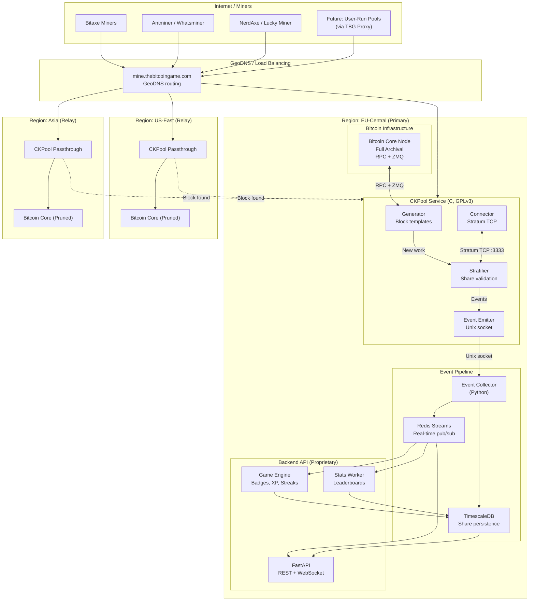

### CKPool Internal Architecture

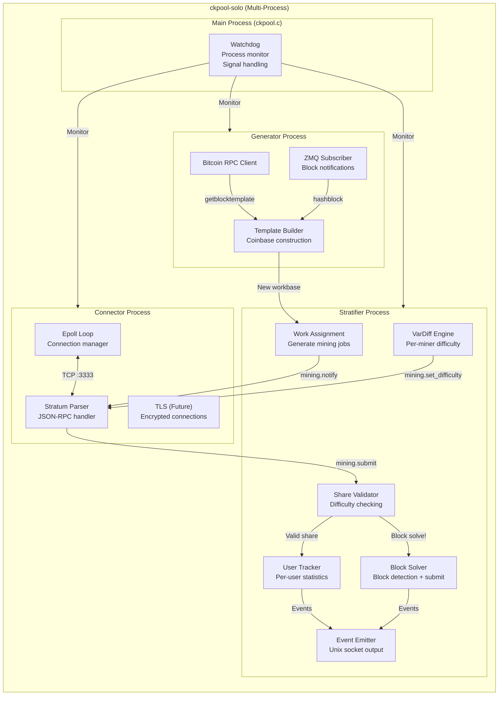

---

## 3. Communication Flows

### 3.1 Miner Connection Flow

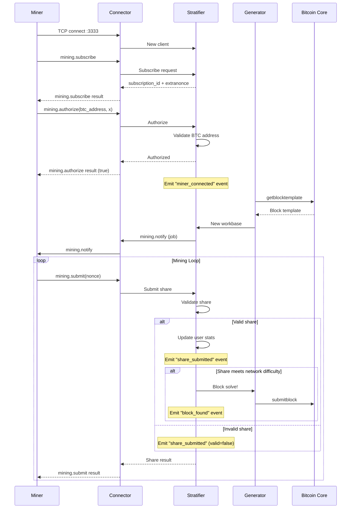

### 3.2 Event Pipeline Flow

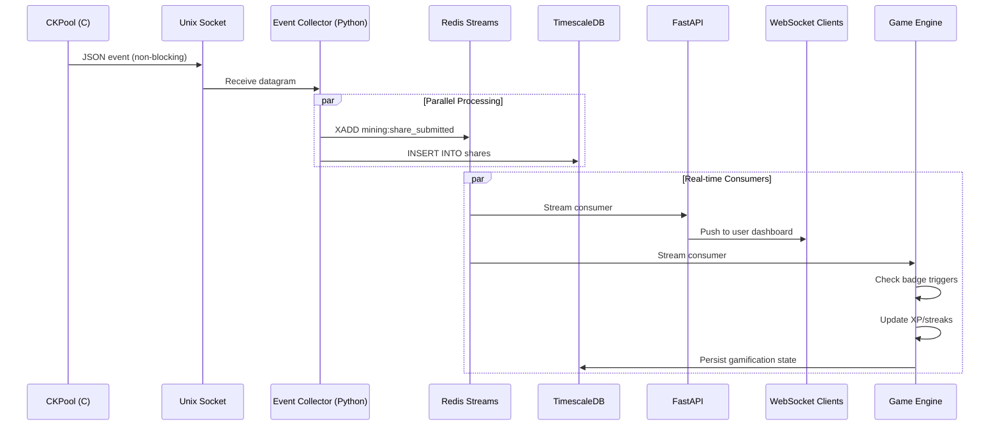

### 3.3 Block Found Flow (Critical Path)

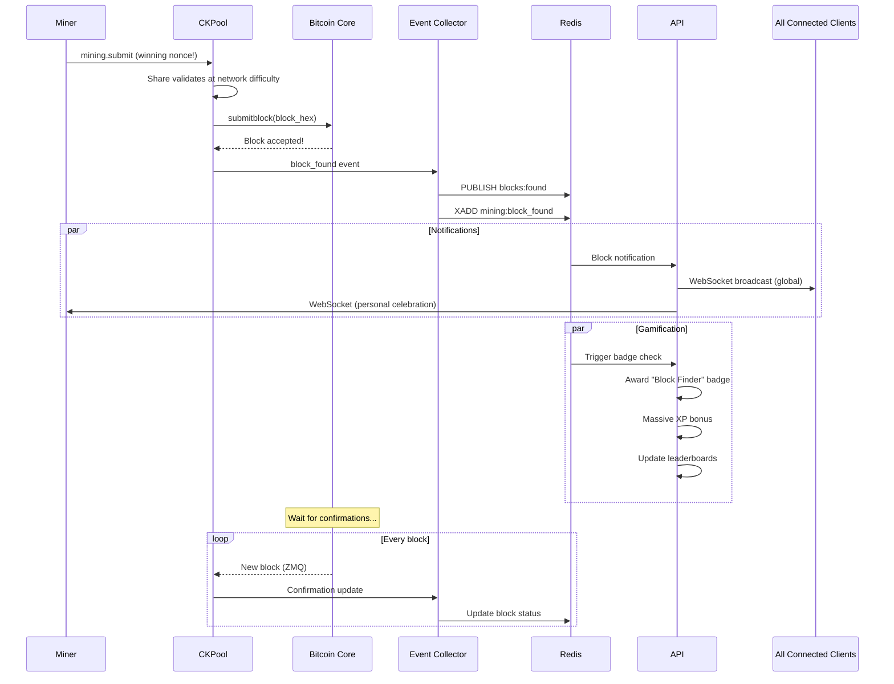

---

## 4. Component Breakdown

### 4.1 CKPool Processes

| Process | Source File | Responsibility | Our Modifications |
|---|---|---|---|
| **Main** | `ckpool.c` | Process orchestration, watchdog, signal handling, config loading | Minimal — add event socket config |
| **Generator** | `generator.c` | Bitcoin Core RPC, block templates, coinbase TX construction, ZMQ listener | Custom coinbase signatures per user |
| **Stratifier** | `stratifier.c` | Share validation, vardiff, user/worker tracking, block solve detection | **Heavy** — event emission, enhanced diff tracking, best-diff-per-week |
| **Connector** | `connector.c` | TCP connection management, Stratum JSON-RPC I/O, epoll event loop | Minimal — future TLS support |

### 4.2 Support Libraries

| File | Purpose | Modifications |
|---|---|---|
| `libckpool.c/h` | Networking, threading, JSON, logging utilities | Add event socket helpers |
| `bitcoin.c/h` | Address validation, script construction | Extend for taproot (bc1p) addresses |
| `sha2.c/h` | SHA256 implementation (SIMD-optimized via yasm) | None planned |
| `ckpool.h` | Core struct definitions (`ckpool_t`, config) | Add event config fields |

### 4.3 Configuration

```json
{
    "btcd": [{
        "url": "127.0.0.1:8332",
        "auth": "rpcuser",
        "pass": "rpcpassword",
        "notify": true
    }],
    "btcsig": "/TheBitcoinGame/",
    "blockpoll": 100,
    "donation": 0.0,
    "serverurl": ["0.0.0.0:3333"],
    "mindiff": 512,
    "startdiff": 10000,
    "maxdiff": 0,
    "update_interval": 30,
    "version_mask": "1fffe000",
    "nonce1length": 4,
    "nonce2length": 8,
    "logdir": "/var/log/tbg-mining",
    "zmqblock": "tcp://127.0.0.1:28332",
    "maxclients": 100000,
    "events": {
        "enabled": true,
        "socket_path": "/tmp/ckpool/events.sock",
        "include": ["share_submitted", "block_found", "miner_connected",
                     "miner_disconnected", "diff_updated", "hashrate_update",
                     "new_block_network", "share_best_diff"]
    }
}
```

---

## 5. Event System Design

### 5.1 Event Types

The event system is the bridge between the open-source mining engine and our proprietary gamification platform. Events are emitted as JSON over a Unix domain socket (DGRAM, non-blocking).

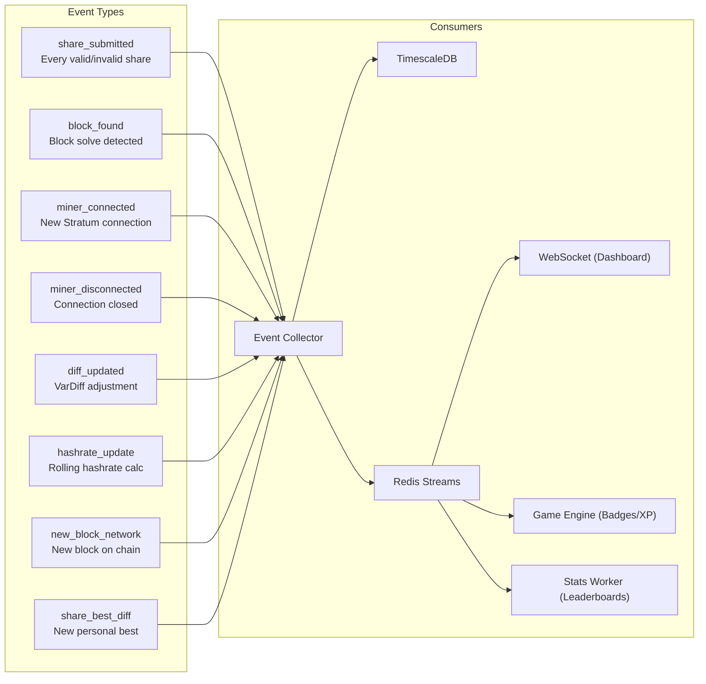

### 5.2 Event Schemas

```json
// share_submitted
{
    "event": "share_submitted",
    "timestamp": 1708617600000000,
    "data": {
        "user": "bc1q...",
        "worker": "bitaxe-living-room",
        "difficulty": 1024,
        "share_diff": 2847193472,
        "valid": true,
        "nonce": "a8f3b2c1",
        "nonce2": "00000000deadbeef",
        "job_id": "4a2",
        "ip": "192.168.1.100"
    }
}

// block_found
{
    "event": "block_found",
    "timestamp": 1708617600000000,
    "data": {
        "user": "bc1q...",
        "worker": "bitaxe-living-room",
        "height": 891234,
        "hash": "0000000000000000000234abc...",
        "prev_hash": "0000000000000000000123def...",
        "reward": 3.125,
        "fees": 0.04823,
        "difficulty": 100847293444,
        "nonce": "a8f3b2c1",
        "coinbase_sig": "/TheBitcoinGame:SatoshiHunter/"
    }
}

// miner_connected
{
    "event": "miner_connected",
    "timestamp": 1708617600000000,
    "data": {
        "user": "bc1q...",
        "worker": "bitaxe-living-room",
        "ip": "192.168.1.100",
        "user_agent": "bitaxe/2.3.0",
        "protocol": "stratum_v1",
        "initial_diff": 512
    }
}

// miner_disconnected
{
    "event": "miner_disconnected",
    "timestamp": 1708617600000000,
    "data": {
        "user": "bc1q...",
        "worker": "bitaxe-living-room",
        "session_duration": 86400,
        "shares_submitted": 47832,
        "best_diff_session": 2847193472,
        "reason": "timeout"
    }
}

// share_best_diff (emitted when a share beats the user's current week best)
{
    "event": "share_best_diff",
    "timestamp": 1708617600000000,
    "data": {
        "user": "bc1q...",
        "worker": "bitaxe-living-room",
        "new_best_diff": 4231847293,
        "previous_best_diff": 2847193472,
        "period": "week",
        "week_number": 8,
        "alltime_best": false
    }
}
```

---

## 6. Data Flow Diagrams

### 6.1 Share Processing Pipeline

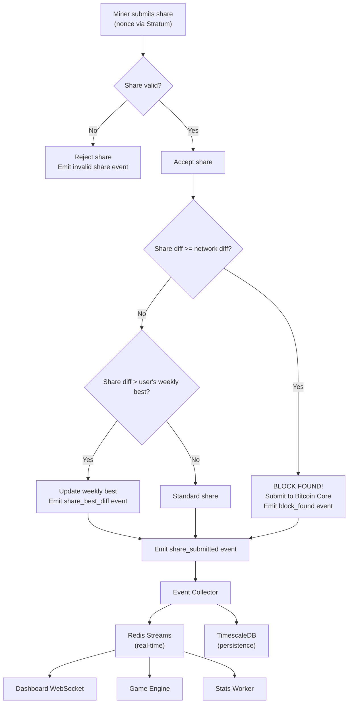

### 6.2 Network Difficulty Update Flow

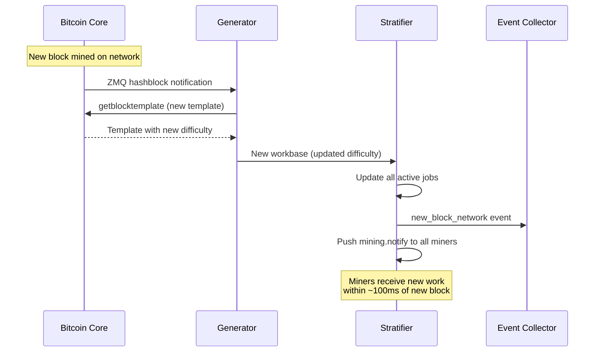

---

## 7. Bitcoin Node Integration

### 7.1 Node Requirements

| Requirement | Value | Reason |
|---|---|---|
| Software | Bitcoin Core v27+ | Latest consensus rules, taproot support |
| Mode | Full archival (no pruning) | Need full UTXO set for template construction |
| RPC enabled | Yes | `getblocktemplate`, `submitblock`, `getblockchaininfo` |
| ZMQ enabled | `zmqpubhashblock` | Instant new-block notifications (<100ms) |
| Network | Mainnet (production), Signet/Testnet (dev) | Signet for deterministic testing |
| Geo-distribution | Primary (EU) + 2 relays (US, Asia) | Minimize miner latency |
| Relay nodes | Pruned acceptable | Only need recent blocks for relay |

### 7.2 RPC Methods Used

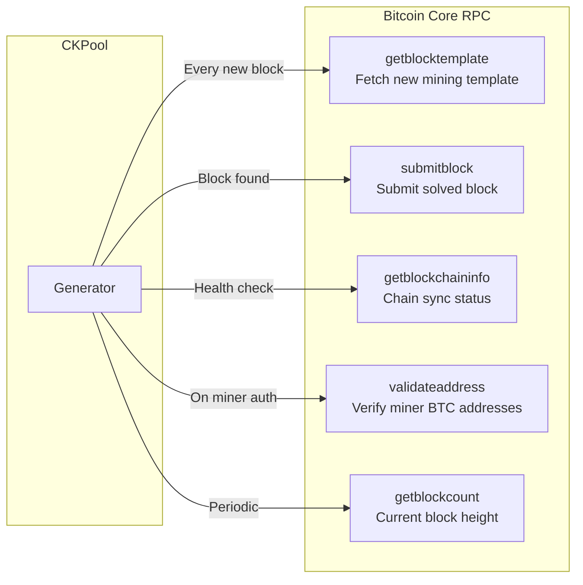

### 7.3 ZMQ Configuration

```
# bitcoin.conf
zmqpubhashblock=tcp://127.0.0.1:28332
zmqpubrawtx=tcp://127.0.0.1:28333  # Optional: for future mempool features
```

CKPool's Generator subscribes to `hashblock` for instant new-block detection, replacing the polling fallback (`blockpoll: 100ms`). This ensures miners receive new work within ~100ms of a new block appearing on the network, minimizing stale shares.

---

## 8. Licensing & Open-Source Strategy

### 8.1 GPL Compliance Architecture

```mermaid
graph TB
    subgraph GPL["GPLv3 — Open Source (MUST be public)"]
        CKP["ckpool-solo fork<br/>(C code)"]
        EVT["Event emitter module<br/>(C code, part of ckpool)"]
        CFG["Configuration schemas"]
        BUILD["Build system<br/>(autotools)"]
    end

    subgraph Boundary["Process Boundary (Unix Socket)"]
        SOCK["Unix Domain Socket<br/>events.sock"]
    end

    subgraph Proprietary["Proprietary — Private"]
        EC["Event Collector (Python)"]
        API["FastAPI Backend"]
        GAME["Game Engine"]
        DASH["React Dashboard"]
    end

    CKP --> EVT
    EVT -->|"JSON datagrams"| SOCK
    SOCK -->|"Separate process"| EC
    EC --> API
    EC --> GAME
    API --> DASH

    style GPL fill:#1a4731,stroke:#3fb950
    style Proprietary fill:#4a1a1a,stroke:#f85149
    style Boundary fill:#1a3a4a,stroke:#58a6ff
```

### 8.2 Key Legal Points

1. **ckpool is GPLv3** — Any modifications to the C source code MUST remain GPLv3 and be published.
2. **Process boundary is clean** — The event emitter outputs data via a Unix domain socket. The Event Collector is a separate process and can be any license.
3. **No GPL contamination** — Our API, dashboard, game engine are cleanly separated by the process boundary. They consume data from Redis/PostgreSQL, not directly from ckpool code.
4. **Our fork repository** will be public on GitHub with full source, build instructions, and documentation.
5. **Upstream attribution** — We credit Con Kolivas and the original ckpool project prominently in README, LICENSE, and coinbase signature.

### 8.3 Open-Source Deliverables

| File | Purpose |
|---|---|
| `README.md` | Project overview, build instructions, configuration |
| `LICENSE` | GPLv3 full text |
| `CONTRIBUTING.md` | How to contribute, code style, PR process |
| `CHANGELOG.md` | Version history of our modifications |
| `docs/architecture.md` | Technical architecture of the fork |
| `docs/events.md` | Event system documentation |
| `docs/configuration.md` | Full configuration reference |
| `docs/building.md` | Build from source guide |
| `docs/testing.md` | Test suite documentation |
| `docs/deployment.md` | Production deployment guide |

---

## 9. Future: Decentralized Mining

> **Note:** This feature is documented here for architectural planning. It is NOT in the current implementation scope. See `docs/ckpool-service/decentralized-mining.md` for full details.

### 9.1 Vision

Allow users to run their own Bitcoin nodes, pools, and miners at home and still participate in The Bitcoin Game platform. Users submit their verified shares, block headers, and mining proofs to our servers via a lightweight proxy.

### 9.2 Why This Matters

- Maximum decentralization — miners run their own infrastructure
- Users choose their own transactions (censorship resistance)
- Aligns with Bitcoin's ethos of self-sovereignty
- Makes The Bitcoin Game a platform, not just a pool

### 9.3 Architecture Impact on Current Design

To support this in the future, the current ckpool and backend design must:

1. **Abstract the share source** — The event pipeline should not assume all shares come from our ckpool instance. Design the `share_submitted` event schema to include a `source` field.
2. **Separate validation from collection** — The backend must be able to validate shares independently of ckpool (using block headers and difficulty targets).
3. **Support multiple input channels** — Redis Streams should handle events from both our ckpool AND the future proxy service.
4. **User identity is BTC address** — Already the case. Solo miners connecting via proxy use the same BTC address identity.

See the dedicated document for full proxy design, verification mechanisms, and anti-fraud measures.

---

## 10. Roadmap Summary

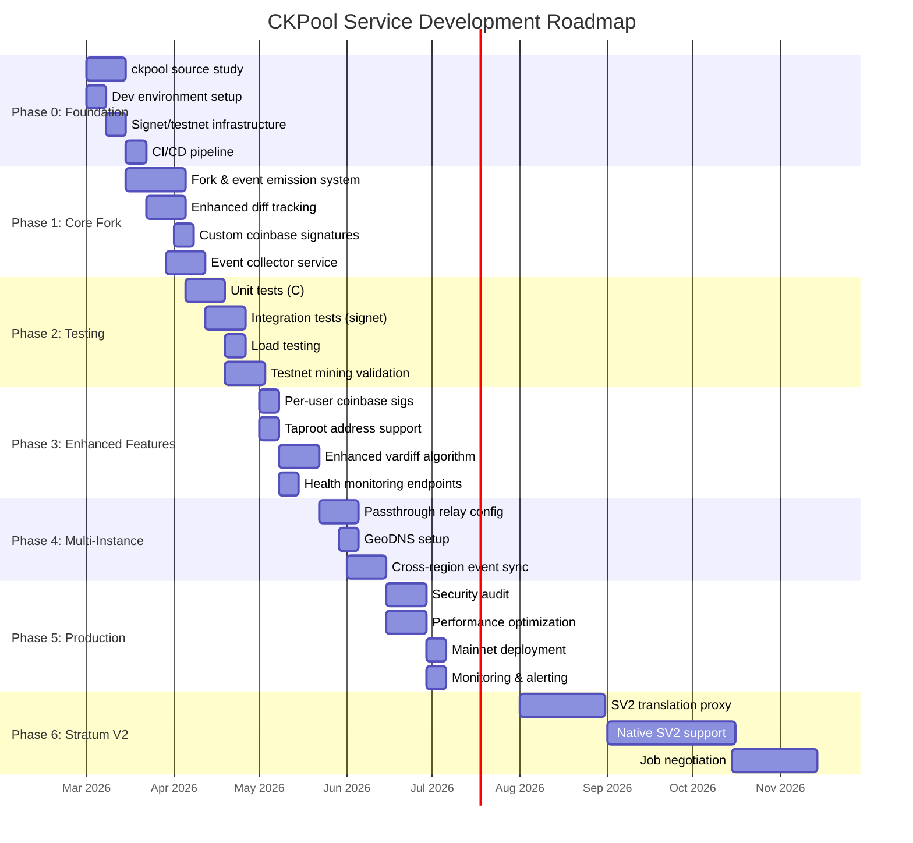

### Phase Overview

| Phase | Name | Duration | Key Deliverables |
|---|---|---|---|
| 0 | Foundation & Research | 3 weeks | Dev environment, signet setup, CI/CD |
| 1 | Core Fork & Event System | 4 weeks | Event emission, diff tracking, collector |
| 2 | Testing Infrastructure | 3 weeks | Unit tests, integration tests, testnet validation |
| 3 | Enhanced Features | 3 weeks | Custom coinbase, taproot, improved vardiff |
| 4 | Multi-Instance & Geo-Distribution | 3 weeks | Relay nodes, GeoDNS, cross-region sync |
| 5 | Production Hardening | 3 weeks | Security audit, optimization, mainnet deploy |
| 6 | Stratum V2 | 3 months | SV2 proxy, native support, job negotiation |

**Detailed phase plans:** See `docs/ckpool-service/roadmap/` directory.

---

*This document is a living plan. Update as architecture decisions are validated and scope evolves.*
