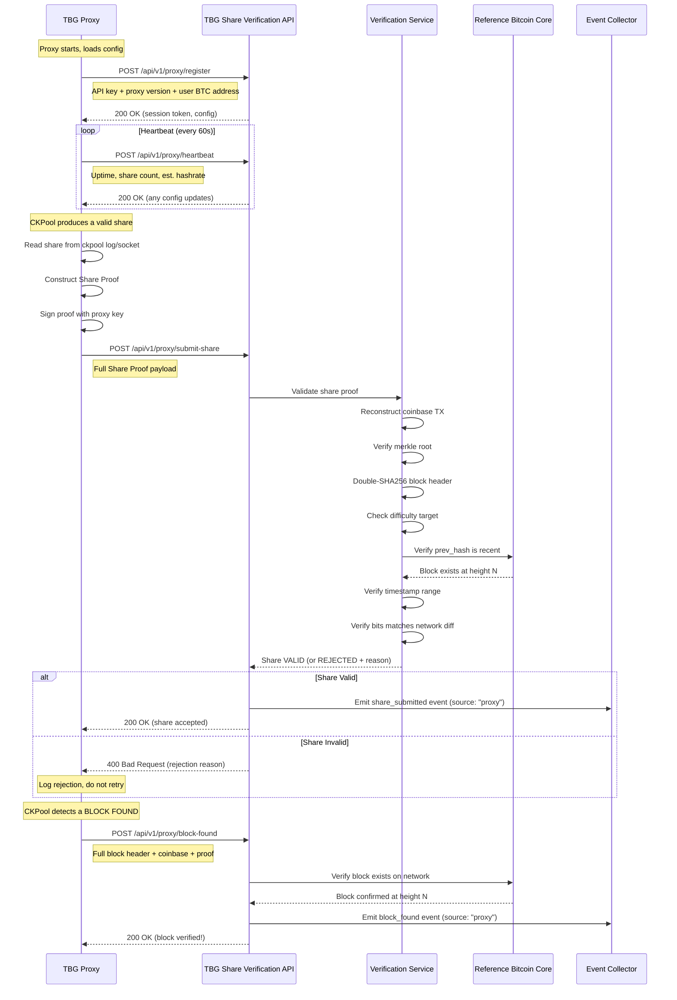
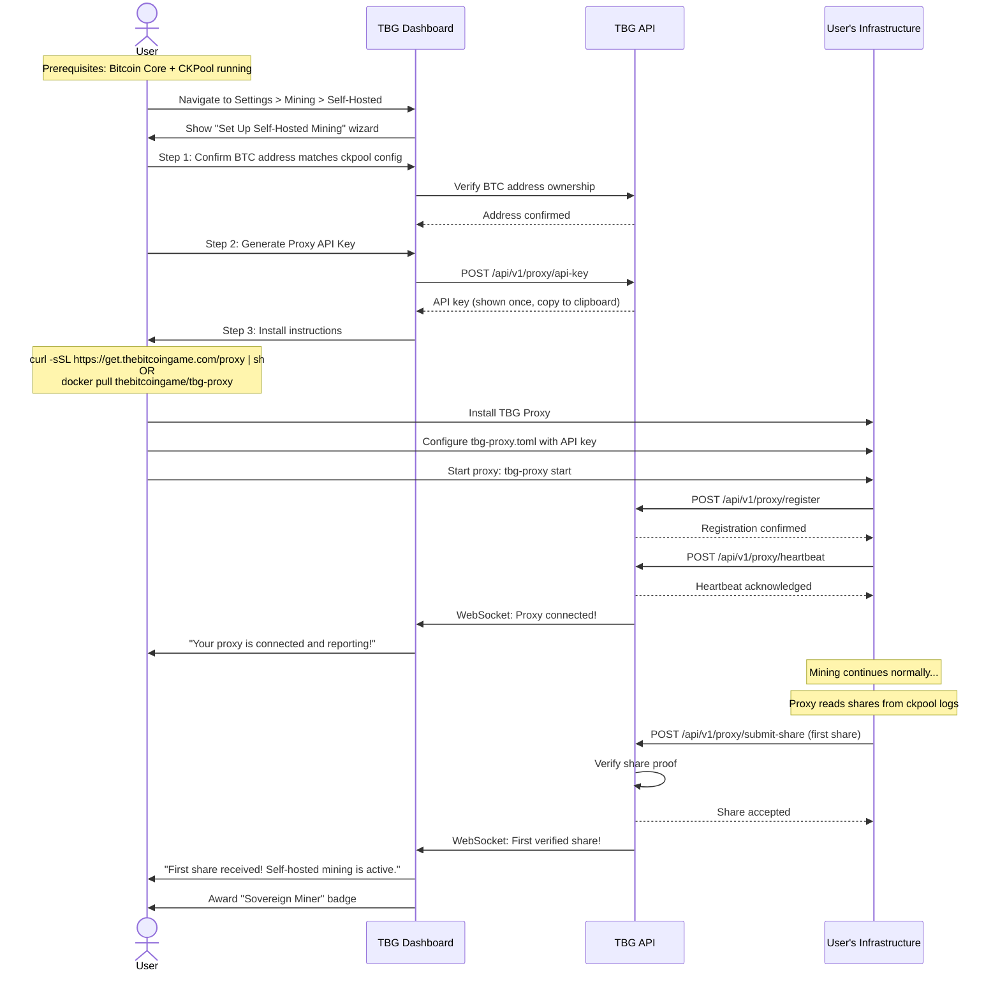
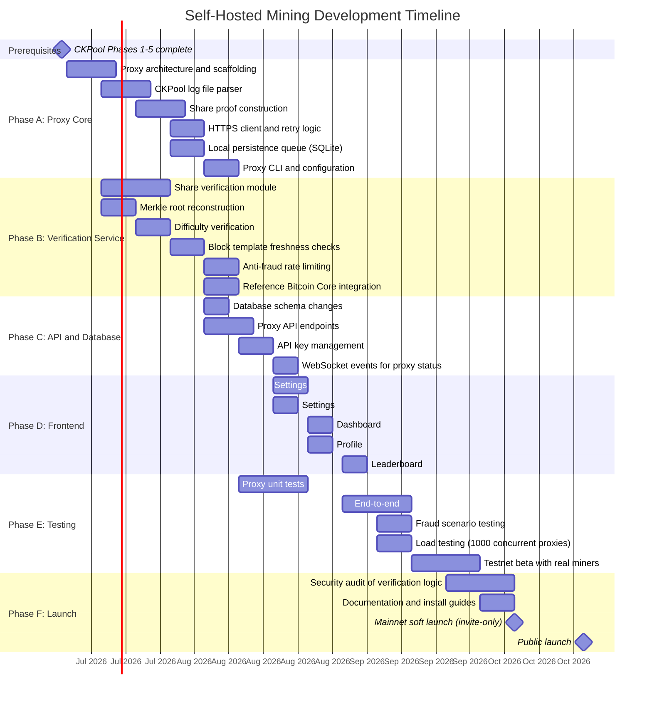

# Decentralized Mining — Self-Hosted Infrastructure Integration

## The Bitcoin Game: From Pool to Platform

**Version:** 1.0
**Date:** February 2026
**Status:** Future Feature (Architectural Planning)
**Classification:** Internal strategic document
**Depends on:** CKPool Service Master Plan (00-master-plan.md), Phases 1-5 complete

---

## Table of Contents

1. [Vision and Motivation](#1-vision-and-motivation)
2. [Architecture Overview](#2-architecture-overview)
3. [The TBG Proxy Design](#3-the-tbg-proxy-design)
4. [Share Verification and Anti-Fraud](#4-share-verification-and-anti-fraud)
5. [Impact on Current Architecture](#5-impact-on-current-architecture)
6. [Design for Future-Proofing Current Implementation](#6-design-for-future-proofing-current-implementation)
7. [Competitive Feature Considerations](#7-competitive-feature-considerations)
8. [User Experience](#8-user-experience)
9. [Implementation Timeline](#9-implementation-timeline)
10. [Open Questions](#10-open-questions)

---

## 1. Vision and Motivation

### 1.1 The Problem with Centralized Solo Mining

Today, The Bitcoin Game operates a single hosted ckpool-solo instance. Miners connect their Bitaxes, Antminers, and NerdAxes to `mine.thebitcoingame.com:3333` via Stratum V1. We control the pool, the block templates, the transaction selection, and the event pipeline. This is the simplest architecture and provides the highest level of trust for competitive features.

But it contradicts a core principle of Bitcoin: **sovereignty**.

The most dedicated Bitcoin miners do not merely run ASICs. They run full nodes. They select their own transactions. They construct their own block templates. They may run their own ckpool instances at home, pointing their miners at `localhost:3333`. These users are the ideological backbone of the Bitcoin mining ecosystem, and they are currently locked out of The Bitcoin Game's gamification features because we have no way to see their shares.

### 1.2 The Vision

Transform The Bitcoin Game from a **pool with gamification** into a **platform for solo miners** — regardless of where their infrastructure lives.

A miner running a Bitaxe at home, connected to their own ckpool instance, backed by their own Bitcoin Core node, choosing their own transactions, should be able to:

- See their shares on The Bitcoin Game dashboard in real time
- Earn badges, XP, and streaks just like hosted miners
- Appear on leaderboards
- Participate in the World Cup and Leagues
- Trigger the Block Found celebration if they solve a block
- Be recognized as a sovereign miner in the community

### 1.3 Why This Matters

| Principle | How Self-Hosted Mining Supports It |
|---|---|
| **Decentralization** | Miners run their own nodes and pools, reducing single points of failure |
| **Censorship resistance** | Miners choose which transactions to include in their block templates |
| **Self-sovereignty** | Users own their entire mining stack, top to bottom |
| **Transaction selection** | No reliance on a third-party pool operator for template construction |
| **Network health** | More full nodes = stronger Bitcoin network |
| **Community value** | Self-hosted miners are the most engaged, knowledgeable users |

### 1.4 Strategic Positioning

This feature positions The Bitcoin Game uniquely in the market:

- **Not a pool.** A platform. Pools are commodity infrastructure. Platforms create ecosystems.
- **Not custody.** Users mine to their own addresses, with their own infrastructure. We never touch funds.
- **Not trust-based.** Share proofs are cryptographically verifiable. We do not take anyone's word for their hashrate.
- **Network effect.** Every self-hosted miner who joins the platform adds value for all participants (leaderboard competition, cooperative mining pools, social features).

---

## 2. Architecture Overview

### 2.1 Two Mining Modes

The Bitcoin Game supports two distinct modes of operation, unified by a common event pipeline and gamification engine.

| Aspect | Hosted Mining | Self-Hosted Mining |
|---|---|---|
| **Pool** | TBG-operated ckpool-solo | User-operated ckpool (or compatible) |
| **Bitcoin Node** | TBG-operated Bitcoin Core | User-operated Bitcoin Core |
| **Stratum endpoint** | `mine.thebitcoingame.com:3333` | `localhost:3333` (user's machine) |
| **Transaction selection** | TBG selects transactions | User selects transactions |
| **Block template** | TBG's Generator process | User's Generator process |
| **Share validation** | Internal (ckpool Stratifier) | External (TBG Proxy + API verification) |
| **Event transport** | Unix domain socket (local) | HTTPS REST API (internet) |
| **Trust level** | Full (Level 1) | Verified External (Level 2) |
| **Latency** | Sub-millisecond (local socket) | Variable (internet round-trip) |
| **Setup complexity** | Connect miner, done | Install node + pool + proxy |

### 2.2 High-Level Architecture

```mermaid
graph TB
    subgraph HostedMode["Hosted Mining Mode"]
        direction TB
        HM["Miners<br/>(Bitaxe, Antminer, etc.)"]
        HC["TBG CKPool<br/>mine.thebitcoingame.com:3333"]
        HN["TBG Bitcoin Core<br/>Full Node"]
        HE["Event Emitter<br/>Unix Socket"]

        HM -->|"Stratum V1"| HC
        HC <-->|"RPC + ZMQ"| HN
        HC -->|"Events"| HE
    end

    subgraph SelfHostedMode["Self-Hosted Mining Mode"]
        direction TB
        SM["User's Miners<br/>(Bitaxe, Antminer, etc.)"]
        SC["User's CKPool<br/>localhost:3333"]
        SN["User's Bitcoin Core<br/>Full Node"]
        SP["TBG Proxy<br/>(Go/Rust daemon)"]

        SM -->|"Stratum V1"| SC
        SC <-->|"RPC + ZMQ"| SN
        SC -->|"Log files /<br/>Unix Socket"| SP
    end

    subgraph TBGBackend["The Bitcoin Game Backend"]
        direction TB
        EC["Event Collector<br/>(Python)"]
        SVC["Share Verification<br/>Service"]
        REDIS["Redis Streams"]
        TSDB["TimescaleDB"]
        API["FastAPI<br/>REST + WebSocket"]
        GAME["Game Engine<br/>Badges, XP, Streaks"]
        STATS["Stats Worker<br/>Leaderboards"]
        BTCREF["Reference Bitcoin Core<br/>(for verification)"]
    end

    subgraph Frontend["Dashboard"]
        DASH["React Frontend<br/>Unified view of both modes"]
    end

    HE -->|"Unix Socket"| EC
    SP -->|"HTTPS REST API<br/>(Share Proofs)"| SVC
    SVC -->|"Verified events"| EC
    SVC <-->|"Verify prev_hash,<br/>difficulty, templates"| BTCREF

    EC --> REDIS
    EC --> TSDB
    REDIS --> API
    REDIS --> GAME
    REDIS --> STATS
    TSDB --> API
    API --> DASH

    style HostedMode fill:#0d1117,stroke:#3fb950,stroke-width:2px
    style SelfHostedMode fill:#0d1117,stroke:#f7931a,stroke-width:2px
    style TBGBackend fill:#0d1117,stroke:#58a6ff,stroke-width:2px
    style Frontend fill:#0d1117,stroke:#a371f7,stroke-width:2px
```



### 2.3 Key Design Principle: Convergence at the Event Collector

Both modes converge at the same Event Collector. From the Game Engine's perspective, a verified share from a self-hosted miner is structurally identical to a share from our hosted pool. The only difference is the `source` field in the event payload.

This means:
- **No separate gamification logic** for self-hosted miners.
- **No separate dashboard views** (though source indicators are shown).
- **No separate badge definitions** (though some badges may be mode-specific).
- The entire downstream pipeline (Redis, TimescaleDB, Game Engine, Stats Worker, WebSocket) is shared.

---

## 3. The TBG Proxy Design

### 3.1 Overview

The TBG Proxy is a lightweight, open-source daemon that users install alongside their ckpool instance. It reads mining events from ckpool's output, packages them into cryptographically verifiable share proofs, and submits them to The Bitcoin Game's REST API over HTTPS.

The proxy is intentionally minimal. It does not modify ckpool, does not interfere with the mining process, and does not require elevated permissions. It is a read-only observer of the user's mining activity.

### 3.2 Technical Specifications

| Attribute | Value |
|---|---|
| **Language** | Go (primary candidate) or Rust |
| **Binary size** | Target < 10 MB statically linked |
| **Memory footprint** | Target < 50 MB RSS |
| **Dependencies** | None (statically linked, single binary) |
| **Platforms** | Linux (amd64, arm64), macOS (amd64, arm64) |
| **License** | MIT or Apache 2.0 (not GPL — separate process, separate codebase) |
| **Distribution** | GitHub releases, Docker image, Homebrew tap, AUR package |

### 3.3 How the Proxy Reads Mining Data

The proxy supports multiple input modes, depending on the user's ckpool configuration:

```mermaid
graph LR
    subgraph CKPool["User's CKPool Instance"]
        LOG["Share log files<br/>/var/log/ckpool/"]
        SOCK["Unix Socket<br/>(if event emitter enabled)"]
        STRATUM["Stratum port :3333<br/>(passive listener)"]
    end

    subgraph Proxy["TBG Proxy"]
        FW["File Watcher<br/>(inotify/kqueue)"]
        SR["Socket Reader"]
        SL["Stratum Listener<br/>(backup mode)"]
        PP["Proof Packager"]
        TQ["Transmission Queue<br/>(persistent, at-least-once)"]
        HB["Heartbeat Generator"]
    end

    LOG -->|"Tail share logs"| FW
    SOCK -->|"Read events"| SR
    STRATUM -->|"Passive sniff"| SL

    FW --> PP
    SR --> PP
    SL --> PP

    PP --> TQ
    HB --> TQ

    TQ -->|"HTTPS POST<br/>to TBG API"| API["TBG Share<br/>Verification API"]

    style Proxy fill:#0d1117,stroke:#f7931a
```



**Input Mode Priority:**

1. **Unix Socket (preferred):** If the user runs our modified ckpool fork with the event emitter, the proxy reads structured JSON events directly from the Unix socket. Highest fidelity.
2. **Log File Tailing (default):** Standard ckpool-solo writes share data to log files. The proxy tails these files (using `inotify` on Linux, `kqueue` on macOS) and parses share entries. Works with unmodified ckpool.
3. **Stratum Passive Listener (fallback):** The proxy can be configured as a man-in-the-middle between the miner and ckpool, passively observing Stratum messages. Most complex, least recommended.

### 3.4 What the Proxy Sends

For each valid share observed, the proxy constructs a **Share Proof** containing all the data needed for independent verification.

```json
{
    "proof_version": 1,
    "proxy_version": "0.3.0",
    "timestamp": 1708617600000,
    "user_btc_address": "bc1qxyz...",
    "worker_name": "bitaxe-garage",
    "share_proof": {
        "block_header": {
            "version": 536870912,
            "prev_hash": "0000000000000000000234abc...",
            "merkle_root": "a1b2c3d4e5f6...",
            "timestamp": 1708617598,
            "bits": "17034219",
            "nonce": 2847193472
        },
        "coinbase_tx": "01000000010000...output_with_user_btc_address...00000000",
        "coinbase_tx_hash": "d4e5f6a1b2c3...",
        "merkle_branch": [
            "hash1...",
            "hash2...",
            "hash3...",
            "hash4..."
        ],
        "extranonce1": "a8f3b2c1",
        "extranonce2": "00000000deadbeef",
        "share_difficulty": 65536,
        "resulting_hash": "00000000f3a2b1c4..."
    },
    "block_height": 891234,
    "network_difficulty": 100847293444.123,
    "signature": "ed25519_signature_of_payload..."
}
```

### 3.5 Proxy Communication Protocol



### 3.6 Proxy Reliability

The proxy must handle unreliable network conditions gracefully:

- **Local persistence queue:** Shares are written to a local SQLite database before transmission. If the API is unreachable, shares queue up and are retried with exponential backoff.
- **At-least-once delivery:** Shares may be submitted more than once. The API deduplicates by `(block_header_hash, nonce, extranonce2)` tuple.
- **Graceful degradation:** If the proxy is down, mining continues unaffected. Shares are simply not reported to TBG during downtime.
- **Catchup on restart:** When the proxy restarts, it processes any unsubmitted shares from the local queue and resumes tailing from the last known position in ckpool logs.

### 3.7 Proxy Configuration

```toml
# tbg-proxy.toml

[general]
api_key = "tbg_proxy_sk_live_..."
user_btc_address = "bc1qxyz..."
log_level = "info"

[ckpool]
# Input mode: "socket", "logfile", or "stratum"
mode = "logfile"
# For logfile mode:
log_directory = "/var/log/ckpool/"
# For socket mode:
socket_path = "/tmp/ckpool/events.sock"
# For stratum mode:
stratum_host = "127.0.0.1"
stratum_port = 3333

[api]
endpoint = "https://api.thebitcoingame.com/v1/proxy"
timeout_seconds = 10
retry_max = 5
retry_backoff_base = 2

[heartbeat]
interval_seconds = 60

[queue]
database_path = "/var/lib/tbg-proxy/queue.db"
max_pending = 100000
```

---

## 4. Share Verification and Anti-Fraud

This is the most critical section of the document. The entire credibility of self-hosted mining on The Bitcoin Game depends on our ability to verify that submitted shares represent real computational work, performed recently, by the claimed user.

### 4.1 What We Need to Verify

For every share proof submitted by a TBG Proxy, we must answer five questions:

1. **Is this real work?** Does the block header hash actually meet the claimed difficulty target?
2. **Is this recent work?** Was the share computed against a current block template, not replayed from the past?
3. **Is this the user's work?** Does the coinbase transaction pay to the user's registered BTC address?
4. **Is the proof internally consistent?** Does the merkle root in the header actually correspond to the coinbase TX + merkle branch?
5. **Is the difficulty claim accurate?** Does the resulting hash truly meet the stated share difficulty?

### 4.2 Verification Method

#### Step-by-Step Verification Process

```mermaid
flowchart TD
    A["Receive Share Proof<br/>from TBG Proxy"] --> B["Parse & validate<br/>proof structure"]
    B -->|"Malformed"| REJECT1["REJECT: Invalid proof format"]
    B -->|"Valid structure"| C["Step 1: Verify coinbase TX<br/>contains user's BTC address"]
    C -->|"Address not found"| REJECT2["REJECT: Coinbase does not<br/>pay to registered address"]
    C -->|"Address found"| D["Step 2: Hash coinbase TX<br/>to get coinbase TX hash"]
    D --> E["Step 3: Compute merkle root<br/>from coinbase hash + merkle branch"]
    E --> F{"Step 4: Merkle root matches<br/>block header merkle_root?"}
    F -->|"No match"| REJECT3["REJECT: Merkle root mismatch<br/>(proof is inconsistent)"]
    F -->|"Match"| G["Step 5: Double-SHA256<br/>the 80-byte block header"]
    G --> H{"Step 6: Resulting hash <=<br/>share difficulty target?"}
    H -->|"No"| REJECT4["REJECT: Hash does not meet<br/>claimed difficulty"]
    H -->|"Yes"| I["Step 7: Verify prev_hash<br/>against reference node"]
    I -->|"Unknown block"| REJECT5["REJECT: prev_hash is not<br/>a known recent block"]
    I -->|"Known block"| J["Step 8: Verify prev_hash<br/>is within last N blocks"]
    J -->|"Too old"| REJECT6["REJECT: Stale share<br/>(block template too old)"]
    J -->|"Recent"| K["Step 9: Verify timestamp<br/>is within acceptable range"]
    K -->|"Out of range"| REJECT7["REJECT: Timestamp<br/>out of bounds"]
    K -->|"In range"| L["Step 10: Verify bits field<br/>matches network difficulty"]
    L -->|"Mismatch"| REJECT8["REJECT: Difficulty bits<br/>do not match network"]
    L -->|"Match"| M["Step 11: Check nonce<br/>uniqueness (dedup)"]
    M -->|"Duplicate"| REJECT9["REJECT: Duplicate nonce<br/>(already submitted)"]
    M -->|"Unique"| ACCEPT["ACCEPT: Share is valid<br/>Emit share_submitted event"]

    style ACCEPT fill:#1a4731,stroke:#3fb950,stroke-width:2px
    style REJECT1 fill:#4a1a1a,stroke:#f85149
    style REJECT2 fill:#4a1a1a,stroke:#f85149
    style REJECT3 fill:#4a1a1a,stroke:#f85149
    style REJECT4 fill:#4a1a1a,stroke:#f85149
    style REJECT5 fill:#4a1a1a,stroke:#f85149
    style REJECT6 fill:#4a1a1a,stroke:#f85149
    style REJECT7 fill:#4a1a1a,stroke:#f85149
    style REJECT8 fill:#4a1a1a,stroke:#f85149
    style REJECT9 fill:#4a1a1a,stroke:#f85149
```



#### Detailed Verification Steps

**Step 1: Coinbase Address Verification**

Parse the raw coinbase transaction and verify that at least one output pays to the user's registered BTC address. This ensures the user is actually mining to their own address and not submitting proofs from someone else's mining operation.

```
coinbase_tx_raw -> decode -> outputs[] -> check scriptPubKey matches user's BTC address
```

Supported address types: P2PKH (1...), P2SH (3...), P2WPKH (bc1q...), P2TR (bc1p...).

**Step 2: Coinbase Transaction Hashing**

Compute the double-SHA256 of the raw coinbase transaction to get the coinbase TX hash (txid). This is the leaf node of the merkle tree.

```
coinbase_txid = SHA256(SHA256(coinbase_tx_raw))
```

**Step 3: Merkle Root Reconstruction**

Using the coinbase txid and the provided merkle branch (a list of sibling hashes at each level of the tree), recompute the merkle root:

```
current = coinbase_txid
for each branch_hash in merkle_branch:
    current = SHA256(SHA256(current + branch_hash))
computed_merkle_root = current
```

**Step 4: Merkle Root Comparison**

Compare `computed_merkle_root` with the `merkle_root` field in the submitted block header. If they do not match, the proof is internally inconsistent: either the coinbase was tampered with, or the merkle branch is wrong.

**Step 5: Block Header Hashing**

Construct the 80-byte block header from its six fields (version, prev_hash, merkle_root, timestamp, bits, nonce) and compute the double-SHA256:

```
header = version(4) + prev_hash(32) + merkle_root(32) + timestamp(4) + bits(4) + nonce(4)
block_hash = SHA256(SHA256(header))
```

**Step 6: Difficulty Verification**

Convert `block_hash` to a 256-bit integer and verify it is less than or equal to the target derived from the claimed share difficulty. This proves that real computational work was performed.

```
target = difficulty_to_target(claimed_share_difficulty)
assert int(block_hash) <= target
```

**Step 7-8: Block Template Freshness**

Query our reference Bitcoin Core node to verify that `prev_hash` corresponds to a real block and that it is recent (within the last 6 blocks). This prevents replay attacks where a user resubmits old share proofs.

```
block_info = bitcoin_rpc.getblock(prev_hash)
assert block_info is not None                    # Block exists
assert current_height - block_info.height <= 6   # Block is recent
```

**Step 9: Timestamp Validation**

Verify the block header timestamp is within an acceptable range:
- Not more than 2 hours in the future (Bitcoin consensus rule)
- Not before the median time of the last 11 blocks
- Within a reasonable window of the current time (allowing for network latency)

**Step 10: Network Difficulty Verification**

Verify the `bits` field in the block header matches the current network difficulty. A miner cannot forge an easier difficulty target because we independently verify this field.

**Step 11: Nonce Uniqueness**

Check that the tuple `(prev_hash, merkle_root, nonce, extranonce2)` has not been previously submitted. This prevents duplicate submissions (either accidental or intentional inflation of share counts).

### 4.3 Anti-Fraud Measures

#### 4.3.1 Replay Attacks

**Threat:** A user saves valid share proofs and resubmits them later to inflate their share count.

**Mitigation:**
- Shares are only accepted if `prev_hash` points to one of the last 6 blocks on the Bitcoin blockchain. A share computed against block N becomes invalid once block N+6 is mined (approximately 60 minutes).
- Nonce uniqueness tracking prevents resubmission of identical share proofs within the validity window.
- The proxy signs each submission with a timestamp, and the server rejects proofs with server-receive-time significantly deviating from the proof timestamp.

#### 4.3.2 Difficulty Inflation

**Threat:** A user claims their shares are higher difficulty than they actually are, to earn more XP/leaderboard points.

**Mitigation:**
- We independently compute the block hash by double-SHA256 of the header. The resulting hash is a mathematical fact that cannot be faked. We derive the share difficulty from the hash ourselves, ignoring the user's claimed difficulty.

#### 4.3.3 Fake Coinbase Transaction

**Threat:** A user modifies the coinbase transaction to include their address but does not actually mine with it (uses someone else's share proofs and swaps in their address).

**Mitigation:**
- If the coinbase TX is modified, the coinbase txid changes, which changes the merkle root, which changes the block header hash. The entire proof becomes internally inconsistent. Steps 3-4 of verification will fail.
- It is computationally infeasible to find a different coinbase TX that produces the same merkle root (SHA256 collision resistance).

#### 4.3.4 Rate Limiting and Anomaly Detection

**Threat:** A user submits shares at a rate that is physically impossible for their claimed hardware.

**Mitigation:**
- Track the expected share rate based on the user's average share difficulty and the time between submissions.
- If a user with a single Bitaxe (~500 GH/s) is submitting shares at a rate consistent with 100 TH/s, flag the account for review.
- Use statistical analysis: the time between shares at a given difficulty should follow an exponential distribution. Deviations from this distribution indicate anomalous behavior.
- Rate limits per API key: maximum shares per minute, configurable per user tier.

#### 4.3.5 Block Found Verification

**Threat:** A user claims to have found a block that they did not actually mine.

**Mitigation:**
- For block-found claims, we verify the block exists on the Bitcoin network via our reference node.
- We verify the coinbase transaction in the actual block (not just the proof) contains the user's BTC address.
- We verify the block's hash matches the proof submitted.
- We cross-reference the block's timestamp and height.
- Block found events are additionally verified by waiting for at least 1 confirmation.

#### 4.3.6 Timestamp Manipulation

**Threat:** A user manipulates timestamps to appear to be mining during streak-qualifying periods when they were not.

**Mitigation:**
- Share timestamps are validated against the block template's `prev_hash` (which anchors the share to a specific point in blockchain time).
- Server-side receive timestamps are recorded independently and used for streak/gamification calculations, not the client-submitted timestamps.
- Acceptable drift between proof timestamp and server receive time: 5 minutes maximum.

#### 4.3.7 Nonce Recycling

**Threat:** A user computes one valid share and submits it multiple times with trivial modifications.

**Mitigation:**
- Full deduplication on `(prev_hash, merkle_root, nonce, extranonce1, extranonce2)`. Any field change invalidates the proof (merkle root changes, header hash changes).
- The extranonce space is tracked per user. If a user submits shares with extranonce values outside their assigned range, they are rejected.

### 4.4 What We Cannot Verify

Intellectual honesty requires acknowledging the limitations of external share verification. These are inherent to any system where the mining hardware is outside our control.

| Limitation | Description | Risk Level | Mitigation |
|---|---|---|---|
| **Hardware ownership** | We cannot verify the user owns the hardware that computed the share. They could be using rented hashrate, a friend's ASIC, or cloud mining. | Low | This is acceptable. We verify the work is real and the address is theirs. How they obtained the hashrate is their business. |
| **Exact hashrate** | We can only estimate hashrate from share submission rate. The estimate has significant variance, especially for low-hashrate miners. | Medium | Use statistical models with wide confidence intervals. Do not display proxy-sourced hashrate with false precision. |
| **Forced coinbase content** | We cannot force users to include our coinbase signature (`/TheBitcoinGame/`) in their blocks. Self-hosted miners choose their own coinbase. | Low | We identify users by their BTC payout address, not coinbase signature. The signature is a nice-to-have, not a requirement. |
| **Proof sharing / collusion** | Two colluding users could share proof data. User A runs mining hardware, User B submits the proofs as their own. | Low | The proofs must contain User B's BTC address in the coinbase. User A would have to mine to User B's address, which means User B gets the block reward if a block is found. Economic incentives make this impractical. |
| **Withholding shares** | A user could selectively submit only their best shares, inflating their average difficulty. | Medium | Track share rate vs expected rate for claimed hashrate. A user submitting unusually infrequent but high-difficulty shares is statistically detectable. |

### 4.5 Trust Levels

The trust level system allows The Bitcoin Game to apply appropriate credibility to mining data from different sources.

```mermaid
flowchart TD
    subgraph TrustLevels["Trust Level Classification"]
        direction TB

        L1["Level 1: Full Trust<br/><b>Hosted Mining</b><br/>━━━━━━━━━━━━━━<br/>User connects to TBG ckpool<br/>We control the entire stack<br/>Share validation is internal<br/>All events are first-party"]

        L2["Level 2: Verified External<br/><b>Self-Hosted with TBG Proxy</b><br/>━━━━━━━━━━━━━━<br/>User runs own pool + node<br/>TBG Proxy sends share proofs<br/>Every share cryptographically verified<br/>Anti-fraud checks applied"]

        L3["Level 3: Partial Trust<br/><b>Self-Reported Stats</b><br/>━━━━━━━━━━━━━━<br/>User manually enters hashrate<br/>No cryptographic proof<br/>Limited feature access<br/>Cannot participate in competitions"]

        L1 --> L2 --> L3
    end

    subgraph Features["Feature Access by Trust Level"]
        direction TB

        F1["<b>Level 1 Features</b><br/>All platform features<br/>Full competitive access<br/>Betting/wagering eligible<br/>Highest leaderboard weight"]

        F2["<b>Level 2 Features</b><br/>All gamification (badges, XP, streaks)<br/>Leaderboard participation<br/>World Cup / Leagues eligible<br/>Cooperative mining eligible<br/>No betting/wagering"]

        F3["<b>Level 3 Features</b><br/>Dashboard viewing only<br/>Community features<br/>Education content<br/>No competitive features<br/>No leaderboards"]
    end

    L1 -.-> F1
    L2 -.-> F2
    L3 -.-> F3

    style L1 fill:#1a4731,stroke:#3fb950,stroke-width:2px
    style L2 fill:#2a3a1a,stroke:#f7931a,stroke-width:2px
    style L3 fill:#3a2a1a,stroke:#8b949e,stroke-width:2px
    style F1 fill:#1a4731,stroke:#3fb950
    style F2 fill:#2a3a1a,stroke:#f7931a
    style F3 fill:#3a2a1a,stroke:#8b949e
```



#### Trust Level Decision Tree for Competitive Features

```mermaid
flowchart TD
    START["User participates<br/>in competitive feature"] --> Q1{"What is the<br/>mining source?"}

    Q1 -->|"Hosted (L1)"| Q2{"Feature type?"}
    Q1 -->|"Proxy (L2)"| Q3{"Feature type?"}
    Q1 -->|"Self-reported (L3)"| DENY["Not eligible for<br/>competitive features"]

    Q2 -->|"Leaderboard"| L1_LB["Full participation<br/>Standard scoring"]
    Q2 -->|"World Cup / League"| L1_WC["Full participation<br/>Standard scoring"]
    Q2 -->|"Betting / Wagering"| L1_BET["Eligible"]
    Q2 -->|"Badges / XP"| L1_XP["Full XP rates"]

    Q3 -->|"Leaderboard"| Q4{"Leaderboard type?"}
    Q3 -->|"World Cup / League"| Q5{"Competition policy?"}
    Q3 -->|"Betting / Wagering"| DENY2["Not eligible<br/>(highest trust required)"]
    Q3 -->|"Badges / XP"| L2_XP["Full XP rates<br/>(same as hosted)"]

    Q4 -->|"Combined"| L2_LB_C["Participate with<br/>'verified external' badge"]
    Q4 -->|"Hosted-only"| L2_LB_H["Not eligible<br/>(hosted shares only)"]
    Q4 -->|"Self-hosted"| L2_LB_S["Full participation"]

    Q5 -->|"Mixed allowed"| L2_WC_Y["Participate with<br/>'verified external' badge"]
    Q5 -->|"Hosted only"| L2_WC_N["Not eligible"]

    style DENY fill:#4a1a1a,stroke:#f85149
    style DENY2 fill:#4a1a1a,stroke:#f85149
    style L1_LB fill:#1a4731,stroke:#3fb950
    style L1_WC fill:#1a4731,stroke:#3fb950
    style L1_BET fill:#1a4731,stroke:#3fb950
    style L1_XP fill:#1a4731,stroke:#3fb950
    style L2_XP fill:#2a3a1a,stroke:#f7931a
    style L2_LB_C fill:#2a3a1a,stroke:#f7931a
    style L2_LB_S fill:#2a3a1a,stroke:#f7931a
    style L2_WC_Y fill:#2a3a1a,stroke:#f7931a
```



---

## 5. Impact on Current Architecture

### 5.1 Changes Needed in Event Pipeline

The current event pipeline (documented in `00-master-plan.md`, Section 5) assumes all events originate from our ckpool instance via Unix domain socket. Self-hosted mining adds a second input channel.

#### Current Flow

```
CKPool -> Unix Socket -> Event Collector -> Redis + TimescaleDB
```

#### Future Flow

```
CKPool -> Unix Socket ─────────────────────> Event Collector -> Redis + TimescaleDB
TBG Proxy -> HTTPS -> Share Verification API -> Event Collector -> Redis + TimescaleDB
```

**Required Changes:**

1. **Add `source` field to all events.** Every event in the pipeline must carry a `source` field indicating its origin:
   - `"hosted"` — from our ckpool instance (full trust)
   - `"proxy"` — from a TBG Proxy (verified external)
   - `"self_reported"` — from user manual input (partial trust)

2. **Event Collector accepts multiple inputs.** Currently, it only listens on a Unix domain socket. It must also accept events from the Share Verification Service (which receives them from the HTTPS API). The simplest approach: the verification service writes validated events to a second Unix socket or to Redis directly.

3. **Share Verification Service.** A new microservice (Python or Go) that:
   - Accepts share proofs via HTTPS REST API
   - Performs the 11-step verification described in Section 4.2
   - Emits verified events into the same pipeline as hosted events
   - Maintains a reference Bitcoin Core RPC connection for block validation

### 5.2 Changes Needed in Database Schema

#### `shares` table

```sql
-- Add to existing shares table
ALTER TABLE shares ADD COLUMN source VARCHAR(20) NOT NULL DEFAULT 'hosted';
-- 'hosted' | 'proxy' | 'self_reported'

ALTER TABLE shares ADD COLUMN proof_data JSONB;
-- For proxy-submitted shares, stores the full share proof for audit.
-- NULL for hosted shares (proof is implicit — we validated it internally).
-- Structure: { block_header, coinbase_tx_hash, merkle_branch, extranonce1, extranonce2 }

ALTER TABLE shares ADD COLUMN verification_status VARCHAR(20) DEFAULT 'verified';
-- 'verified' (passed all checks) | 'pending' (awaiting verification) | 'flagged' (anomaly detected)

ALTER TABLE shares ADD COLUMN proxy_id UUID;
-- References the proxy instance that submitted this share. NULL for hosted shares.

-- Index for efficient source-based queries
CREATE INDEX idx_shares_source ON shares (source);
CREATE INDEX idx_shares_proxy_id ON shares (proxy_id);
```

#### `workers` table

```sql
ALTER TABLE workers ADD COLUMN source VARCHAR(20) NOT NULL DEFAULT 'hosted';
ALTER TABLE workers ADD COLUMN proxy_version VARCHAR(20);
-- e.g., "0.3.0" — helps track which proxy versions are deployed

ALTER TABLE workers ADD COLUMN last_proxy_heartbeat TIMESTAMPTZ;
-- NULL for hosted workers. Updated on each proxy heartbeat.
```

#### `users` table

```sql
ALTER TABLE users ADD COLUMN mining_mode VARCHAR(20) NOT NULL DEFAULT 'hosted';
-- 'hosted' | 'self_hosted' | 'hybrid'
-- 'hybrid' means the user has both hosted and self-hosted miners active

ALTER TABLE users ADD COLUMN trust_level INTEGER NOT NULL DEFAULT 1;
-- 1 = Full Trust (hosted), 2 = Verified External (proxy), 3 = Partial Trust
-- If hybrid, trust level is determined per-feature (see Section 7)
```

#### New table: `proxy_instances`

```sql
CREATE TABLE proxy_instances (
    id UUID PRIMARY KEY DEFAULT gen_random_uuid(),
    user_id UUID NOT NULL REFERENCES users(id),
    api_key_hash VARCHAR(64) NOT NULL,  -- SHA256 of the API key
    proxy_version VARCHAR(20),
    created_at TIMESTAMPTZ NOT NULL DEFAULT NOW(),
    last_heartbeat TIMESTAMPTZ,
    last_share_at TIMESTAMPTZ,
    status VARCHAR(20) NOT NULL DEFAULT 'active',
    -- 'active' | 'inactive' | 'suspended' | 'revoked'
    total_shares_submitted BIGINT DEFAULT 0,
    total_shares_rejected BIGINT DEFAULT 0,
    estimated_hashrate DOUBLE PRECISION,  -- TH/s
    ip_address INET,
    metadata JSONB  -- OS, architecture, ckpool version, etc.
);

CREATE INDEX idx_proxy_api_key ON proxy_instances (api_key_hash);
CREATE INDEX idx_proxy_user ON proxy_instances (user_id);
```

#### New table: `share_verifications`

```sql
CREATE TABLE share_verifications (
    id BIGSERIAL PRIMARY KEY,
    share_id BIGINT REFERENCES shares(id),
    proxy_id UUID REFERENCES proxy_instances(id),
    submitted_at TIMESTAMPTZ NOT NULL DEFAULT NOW(),
    verification_result VARCHAR(20) NOT NULL,
    -- 'accepted' | 'rejected_merkle' | 'rejected_difficulty' | 'rejected_stale'
    -- | 'rejected_duplicate' | 'rejected_address' | 'rejected_timestamp' | 'rejected_bits'
    rejection_reason TEXT,
    verification_duration_ms INTEGER,  -- How long verification took
    proof_hash VARCHAR(64)  -- SHA256 of the proof payload for dedup
);

-- Hypertable for TimescaleDB
SELECT create_hypertable('share_verifications', 'submitted_at');
```

### 5.3 Changes Needed in Backend API

#### New Endpoints

| Endpoint | Method | Description | Auth |
|---|---|---|---|
| `/api/v1/proxy/register` | POST | Register a new proxy instance | User JWT |
| `/api/v1/proxy/api-key` | POST | Generate API key for a proxy | User JWT |
| `/api/v1/proxy/api-key/{id}` | DELETE | Revoke a proxy API key | User JWT |
| `/api/v1/proxy/submit-share` | POST | Submit a share proof for verification | Proxy API Key |
| `/api/v1/proxy/submit-batch` | POST | Submit multiple share proofs (batch) | Proxy API Key |
| `/api/v1/proxy/heartbeat` | POST | Proxy health check / heartbeat | Proxy API Key |
| `/api/v1/proxy/block-found` | POST | Report a block found | Proxy API Key |
| `/api/v1/proxy/status` | GET | Get proxy instance status | Proxy API Key |
| `/api/v1/user/proxies` | GET | List user's proxy instances | User JWT |
| `/api/v1/user/proxies/{id}` | GET | Get proxy instance details | User JWT |

#### Authentication

Proxy API keys are separate from user JWT tokens. They are:
- Generated via the dashboard (Settings > API Keys section)
- Scoped to a single proxy instance
- Prefixed with `tbg_proxy_sk_live_` (production) or `tbg_proxy_sk_test_` (testnet)
- Stored as SHA256 hashes in the database (never stored in plain text)
- Revocable at any time from the dashboard
- Rate-limited per key (configurable, default: 100 shares/minute)

#### Request/Response Examples

**POST /api/v1/proxy/submit-share**

Request:
```json
{
    "proof_version": 1,
    "proxy_version": "0.3.0",
    "timestamp": 1708617600000,
    "share_proof": {
        "block_header": {
            "version": 536870912,
            "prev_hash": "0000000000000000000234abc...",
            "merkle_root": "a1b2c3d4e5f6...",
            "timestamp": 1708617598,
            "bits": "17034219",
            "nonce": 2847193472
        },
        "coinbase_tx": "01000000010000...00000000",
        "merkle_branch": ["hash1...", "hash2...", "hash3..."],
        "extranonce1": "a8f3b2c1",
        "extranonce2": "00000000deadbeef",
        "share_difficulty": 65536
    },
    "worker_name": "bitaxe-garage",
    "block_height": 891234
}
```

Response (accepted):
```json
{
    "status": "accepted",
    "share_id": "share_proxy_891234_a8f3b2c1_2847193472",
    "verified_difficulty": 65536,
    "verified_hash": "00000000f3a2b1c4...",
    "server_timestamp": 1708617601234
}
```

Response (rejected):
```json
{
    "status": "rejected",
    "reason": "merkle_root_mismatch",
    "detail": "Computed merkle root does not match block header. Coinbase TX may be invalid.",
    "server_timestamp": 1708617601234
}
```

### 5.4 Changes Needed in CKPool Design

**Good news: Minimal changes are required to ckpool itself.**

The TBG Proxy is a separate process that reads from ckpool's output. It does not modify ckpool's code, configuration, or behavior. The proxy operates at the operating system level (reading log files or listening on a Unix socket).

The only change needed in our ckpool fork is one that should be made regardless of the proxy feature:

1. **Add `source: "hosted"` to all event payloads.** This is a one-line change in the event emitter code. It costs nothing and ensures the event schema is future-proof from day one.

```c
// In the event emitter (stratifier.c)
// Before:
json_object_set_new(event, "event", json_string("share_submitted"));
json_object_set_new(event, "timestamp", json_integer(timestamp_us));
json_object_set_new(event, "data", data);

// After:
json_object_set_new(event, "event", json_string("share_submitted"));
json_object_set_new(event, "timestamp", json_integer(timestamp_us));
json_object_set_new(event, "source", json_string("hosted"));  // <-- Add this
json_object_set_new(event, "data", data);
```

The rest of the self-hosted mining infrastructure lives entirely outside of ckpool:
- The proxy is a separate Go/Rust binary.
- The Share Verification Service is a separate Python/Go service.
- The API endpoints are in the FastAPI backend.
- The database schema changes are in PostgreSQL/TimescaleDB.

This separation is intentional and important. It means:
- No GPL implications for the proxy or verification service.
- No risk of breaking ckpool's mining functionality.
- The proxy can be developed and deployed independently.
- Users running vanilla ckpool (without our fork) can still use the proxy (via log file tailing mode).

---

## 6. Design for Future-Proofing Current Implementation

These are specific, actionable items to implement during the current CKPool Phases 1-5 that will prevent painful refactoring when self-hosted mining is eventually built.

### 6.1 Include `source` Field in All Events (Phase 1)

**Cost:** Trivial (one line of C per event type).
**Impact:** Every downstream consumer already handles the field from day one.

Add `"source": "hosted"` to every event emitted by our ckpool fork. The Event Collector, Redis consumers, and database inserts all include this field from the start. When proxy events arrive later, they simply have `"source": "proxy"` instead.

### 6.2 Design Share Validation as a Separate Module (Phase 1-2)

**Cost:** Moderate (architecture decision, not extra code).
**Impact:** The verification logic needed for proxy shares already exists as a testable, reusable module.

When implementing share validation tests in Phase 2, extract the core validation logic (double-SHA256 of header, difficulty check, merkle root computation) into a standalone Python module that can:
- Be used in integration tests for the hosted pool
- Be reused as-is in the future Share Verification Service
- Accept a share proof as input and return valid/invalid

```python
# share_validator.py — usable in both test suite and future verification service
class ShareValidator:
    def validate(self, share_proof: ShareProof) -> ValidationResult:
        """Validate a share proof independently of ckpool."""
        # Step 1-11 from Section 4.2
        ...
```

### 6.3 Use BTC Address as Universal Identity (Already Done)

**Cost:** Zero (this is already the case).
**Impact:** Self-hosted miners are identified by the same BTC address they mine to.

CKPool-solo already uses the BTC address as the username (`mining.authorize(btc_address, password)`). The entire platform's user identity is anchored to the BTC address. Self-hosted miners use the same address in their coinbase transaction, creating a natural identity bridge.

**Do not add any identity mechanism that requires ckpool-specific authentication.** The BTC address is the universal key.

### 6.4 Keep the Event Pipeline Input Pluggable (Phase 1)

**Cost:** Low (design decision in the Event Collector).
**Impact:** Adding the proxy as a second event source requires zero refactoring of the collector.

Design the Event Collector to accept events from any source that produces valid JSON matching the event schema. Internally, the collector should not care whether an event came from a Unix socket, an HTTP endpoint, or a Redis stream.

```python
# event_collector.py
class EventCollector:
    def __init__(self):
        self.sources: list[EventSource] = []

    def add_source(self, source: EventSource):
        """Add a new event source. Could be Unix socket, HTTP, etc."""
        self.sources.append(source)

    async def run(self):
        """Process events from all sources."""
        async for event in merge_sources(self.sources):
            await self.process(event)
```

### 6.5 Store Raw Share Data When Available (Phase 1)

**Cost:** Low (JSONB column, nullable).
**Impact:** Enables retroactive verification and audit trails.

Even for hosted shares, store enough raw data to reconstruct the share proof if needed. This includes at minimum: nonce, extranonce1, extranonce2, job_id, and the resulting hash. This data is already available in the `share_submitted` event.

For proxy shares, the full proof payload is stored in the `proof_data` JSONB column.

### 6.6 Design Leaderboards with Source Awareness (Phase 3+)

**Cost:** Low (add WHERE clause capability).
**Impact:** Leaderboards can be filtered by source without schema changes.

When building the Stats Worker and leaderboard computation, ensure all aggregation queries can be filtered by `source`:

```sql
-- Combined leaderboard (all sources)
SELECT user_btc_address, SUM(share_diff) as total_diff
FROM shares WHERE week = current_week GROUP BY 1 ORDER BY 2 DESC;

-- Hosted-only leaderboard
SELECT user_btc_address, SUM(share_diff) as total_diff
FROM shares WHERE week = current_week AND source = 'hosted' GROUP BY 1 ORDER BY 2 DESC;

-- Self-hosted leaderboard
SELECT user_btc_address, SUM(share_diff) as total_diff
FROM shares WHERE week = current_week AND source = 'proxy' GROUP BY 1 ORDER BY 2 DESC;
```

The `source` column index makes these queries efficient. The leaderboard UI can toggle between views.

---

## 7. Competitive Feature Considerations

Self-hosted mining introduces a philosophical question: should shares from different trust levels compete on equal footing?

### 7.1 Default Policy

| Feature | Hosted (L1) | Proxy (L2) | Self-Reported (L3) |
|---|---|---|---|
| **Dashboard stats** | Full access | Full access | View only |
| **Badges** | All eligible | All eligible | Social badges only |
| **XP and Levels** | Full XP rate | Full XP rate | No XP from shares |
| **Streaks** | Full tracking | Full tracking | No streak credit |
| **Weekly Leaderboard** | Separate + Combined | Separate + Combined | Not eligible |
| **Monthly Leaderboard** | Separate + Combined | Separate + Combined | Not eligible |
| **All-Time Leaderboard** | Combined | Combined | Not eligible |
| **Country Leaderboard** | Combined | Combined | Not eligible |
| **World Cup** | Eligible | Eligible (with badge) | Not eligible |
| **Leagues** | Eligible | Eligible (with badge) | Not eligible |
| **Cooperative Mining** | Eligible | Eligible | Social member only |
| **Betting/Wagering** | Eligible | Not eligible | Not eligible |
| **Block Found Celebration** | Full | Full (after network verification) | Not applicable |

### 7.2 Leaderboard Strategy

**Three leaderboard views:**

1. **Combined Leaderboard:** All verified shares (hosted + proxy) compete together. This is the primary view. A small badge icon next to each miner indicates their source.

2. **Hosted Leaderboard:** Only shares from TBG's ckpool. For purists and for features requiring the highest trust level.

3. **Self-Hosted Leaderboard:** Only shares from TBG Proxy. Celebrates the self-sovereignty community.

The default view is Combined. Users can toggle between views. Competition organizers (World Cup, Leagues) can choose which view applies to their competition.

### 7.3 Rationale for Betting Exclusion

Betting and wagering features require the highest trust level because:
- Financial stakes raise the incentive for fraud
- Even cryptographically verified shares have the limitations described in Section 4.4
- Regulatory considerations may require tighter control over competition integrity
- The cost-benefit ratio favors caution: betting is a small feature, fraud risk is non-trivial

This restriction can be relaxed in the future as the proxy system matures and anti-fraud measures are battle-tested.

### 7.4 Badge Differentiation

Some badges should be exclusive to self-hosted miners, celebrating their commitment to sovereignty:

| Badge | Description | Rarity |
|---|---|---|
| **Sovereign Miner** | Run your own node, pool, and proxy | Epic |
| **Full Stack** | Mine a share through your own full stack | Rare |
| **Node Runner** | Maintain a proxy connection for 30 consecutive days | Rare |
| **Block Builder** | Find a block with your own block template | Legendary |
| **Decentralist** | Be one of the first 100 self-hosted miners on TBG | Epic |

---

## 8. User Experience

### 8.1 Self-Hosted Mining Setup Flow



### 8.2 Dashboard Integration

The dashboard shows self-hosted mining data alongside hosted mining data, with clear visual indicators of the source.

**Mining Source Indicator:**
- Hosted shares: no indicator (default)
- Proxy shares: small shield icon with "Self-Hosted" tooltip
- Hybrid mode: combined view with per-share source indicators

**Settings Page Additions:**
- **Mining > Self-Hosted Setup:** Setup wizard (Steps 1-3 above)
- **API Keys > Proxy Keys:** List, create, revoke proxy API keys
- **Mining > Proxy Status:** Real-time status of connected proxies (version, uptime, share rate, estimated hashrate)

**Profile Page Additions:**
- Mining mode badge: "Hosted Miner", "Sovereign Miner", or "Hybrid Miner"
- Self-hosted mining stats section (if applicable)
- Proxy uptime and reliability score

### 8.3 Installation Methods

The TBG Proxy should be installable through multiple channels to minimize friction:

| Method | Command | Target Audience |
|---|---|---|
| **Shell script** | `curl -sSL https://get.thebitcoingame.com/proxy \| sh` | Linux users |
| **Docker** | `docker run -d thebitcoingame/tbg-proxy` | Docker users |
| **Homebrew** | `brew install thebitcoingame/tap/tbg-proxy` | macOS users |
| **AUR** | `yay -S tbg-proxy` | Arch Linux users |
| **Binary download** | GitHub Releases page | Manual install |
| **From source** | `go install github.com/thebitcoingame/tbg-proxy@latest` | Developers |

### 8.4 Monitoring and Troubleshooting

The proxy includes built-in diagnostics:

```bash
# Check proxy status
tbg-proxy status

# Output:
# TBG Proxy v0.3.0
# Status: Connected
# API Endpoint: https://api.thebitcoingame.com/v1/proxy
# CKPool Input: /var/log/ckpool/ (logfile mode)
# Uptime: 3d 14h 22m
# Shares submitted: 47,832
# Shares rejected: 12 (0.025%)
# Pending in queue: 0
# Last share: 4s ago
# Est. hashrate: 1.2 TH/s
# Last heartbeat: 12s ago

# Test connectivity
tbg-proxy test

# Output:
# Testing API connectivity... OK (142ms)
# Testing CKPool log access... OK
# Testing Bitcoin Core RPC (optional)... OK (block 891234)
# All checks passed.

# View recent share submissions
tbg-proxy log --tail 20
```

---

## 9. Implementation Timeline

### 9.1 Prerequisites

Self-hosted mining requires the following to be complete and stable before development begins:

- [x] CKPool Phase 1: Core Fork and Event System (event emission, `source` field)
- [ ] CKPool Phase 2: Testing Infrastructure (share validation module)
- [ ] CKPool Phase 3: Enhanced Features (per-user coinbase, taproot support)
- [ ] CKPool Phase 5: Production Hardening (mainnet deployment, stable API)
- [ ] Backend API: Stable REST API with user authentication
- [ ] Frontend: Dashboard, Settings page, Badge system operational

### 9.2 Development Phases



### 9.3 Estimated Effort

| Phase | Duration | Team |
|---|---|---|
| Phase A: Proxy Core | 5 weeks | 1 backend engineer (Go/Rust) |
| Phase B: Verification Service | 4 weeks | 1 backend engineer (Python) |
| Phase C: API and Database | 3 weeks | 1 backend engineer (Python/FastAPI) |
| Phase D: Frontend | 3 weeks | 1 frontend engineer (React/TypeScript) |
| Phase E: Testing | 4 weeks | 1 QA + 1 backend engineer |
| Phase F: Launch | 3 weeks | Full team |

**Total: approximately 10-12 weeks of active development**, with testing and launch overlapping with development of later phases.

Phases A and B can be developed in parallel (different engineers, different codebases). Phase C depends on B (API must validate shares). Phase D depends on C (frontend needs API endpoints). Phase E is continuous.

### 9.4 Staffing

This feature can be developed by a team of 2-3 engineers:

1. **Proxy Engineer** (Go or Rust): Builds the TBG Proxy binary. Focus on reliability, platform compatibility, and minimal resource usage.
2. **Backend Engineer** (Python/FastAPI): Builds the Share Verification Service, API endpoints, and database schema changes. Can also handle the Event Collector modifications.
3. **Frontend Engineer** (React/TypeScript): Builds the dashboard integration, setup wizard, and leaderboard source toggle. This person is already on the team.

---

## 10. Open Questions

The following decisions remain open and should be resolved before implementation begins.

### 10.1 Technical Decisions

| # | Question | Options | Recommendation | Status |
|---|---|---|---|---|
| 1 | **Proxy language** | Go vs Rust | Go (faster development, easier cross-compilation, strong concurrency primitives, familiar to more developers) | Pending |
| 2 | **Proxy license** | MIT vs Apache 2.0 | MIT (simpler, more permissive, aligns with Bitcoin ecosystem norms) | Pending |
| 3 | **Share submission protocol** | REST vs gRPC vs WebSocket | REST with batch endpoint (simplest, firewall-friendly, cacheable, retryable) | Pending |
| 4 | **Verification service language** | Python (match backend) vs Go (match proxy) | Python (reuses existing FastAPI codebase, share validation is not performance-critical) | Pending |
| 5 | **Maximum share staleness** | 3 blocks vs 6 blocks vs 10 blocks | 6 blocks (~60 minutes). Balances anti-replay with tolerance for proxy downtime/latency. | Pending |
| 6 | **Nonce dedup storage** | In-memory (Redis) vs on-disk (TimescaleDB) | Redis with TTL matching staleness window. Fast lookups, automatic expiry. | Pending |
| 7 | **Proof data retention** | 30 days vs 90 days vs indefinite | 90 days in hot storage (TimescaleDB), then archive to cold storage. Enables audits. | Pending |

### 10.2 Product Decisions

| # | Question | Context | Status |
|---|---|---|---|
| 8 | **Should self-hosted miners pay a fee?** | Hosted miners implicitly pay via pool infrastructure costs (even at 0% fee, we bear server costs). Self-hosted miners use our API for free. Is a small monthly subscription appropriate? Or is the platform value (more users, more competition) worth the API cost? | Pending |
| 9 | **Should we require a minimum share difficulty from proxies?** | Very low difficulty shares are expensive to verify and store. A minimum difficulty (e.g., 65536) reduces server load while still being achievable for Bitaxe-class miners. | Pending |
| 10 | **How do we handle Stratum V2 for self-hosted?** | Stratum V2 has native job negotiation, which is the whole point of self-hosted mining. Should the proxy also support SV2-compatible pools (not just ckpool)? | Pending |
| 11 | **Should we open-source the Share Verification Service?** | Transparency builds trust. If users can see exactly how we verify shares, they are more confident in the system. But it also reveals our anti-fraud logic to potential attackers. | Pending |
| 12 | **How do we handle proxy downtime for streaks?** | If a user's proxy is down for 2 hours due to internet issues, should their streak break? Hosted miners have no such risk (their shares are always recorded). Should we add a grace period for proxy-sourced streaks? | Pending |
| 13 | **Should self-hosted miners appear differently on the public leaderboard?** | A badge/icon indicating "self-hosted" adds transparency but could create a second-class perception. Alternatively, treat all verified shares equally on the public view. | Pending |
| 14 | **What about pools other than ckpool?** | Some users may run cgminer, braiins, or other pool software. Should the proxy support these? Log formats differ. This significantly increases proxy complexity. | Pending |

### 10.3 Security Decisions

| # | Question | Context | Status |
|---|---|---|---|
| 15 | **Should we require mutual TLS for proxy connections?** | Standard HTTPS with API key may be sufficient. Mutual TLS adds complexity but prevents API key theft from resulting in unauthorized share submission. | Pending |
| 16 | **How do we handle a compromised proxy API key?** | Immediate revocation is obvious. But what about shares already submitted with the compromised key? Retroactive invalidation could unfairly penalize the user if the compromise was brief. | Pending |
| 17 | **Should the proxy sign share proofs with a separate key?** | An ed25519 signature per proof allows us to verify the proof was generated by the registered proxy instance, not crafted by hand. Adds complexity but strengthens non-repudiation. | Pending |
| 18 | **What is the ban policy for detected fraud?** | Options: temporary suspension, permanent ban, public disclosure. Need to balance deterrence with fairness (false positives are possible). | Pending |

### 10.4 Infrastructure Decisions

| # | Question | Context | Status |
|---|---|---|---|
| 19 | **Do we need a dedicated reference Bitcoin Core node for verification?** | The verification service needs to check prev_hash validity and network difficulty. Can it share the existing node, or does the additional RPC load require a separate instance? | Pending |
| 20 | **How do we scale the verification service?** | At 1000 proxies each submitting 1 share/second, we need to verify 1000 shares/second. Each verification involves multiple SHA256 operations and a Bitcoin Core RPC call. Horizontal scaling? Caching? | Pending |
| 21 | **Should proxy-submitted events go through a separate Redis stream?** | Isolation prevents proxy traffic from affecting hosted mining event processing. But it complicates consumers that need both sources. | Pending |

---

## Appendix A: Glossary

| Term | Definition |
|---|---|
| **Share** | A proof of computational work submitted by a miner. Meets a difficulty target lower than the network difficulty. |
| **Share Proof** | A complete, self-contained data package that allows independent verification of a share. Includes block header, coinbase TX, merkle branch, and extranonce values. |
| **Block Header** | 80-byte structure containing: version, prev_hash, merkle_root, timestamp, bits (difficulty target), nonce. |
| **Coinbase Transaction** | The first transaction in a block, created by the miner. Contains the block reward payout address and optional data (like pool signatures). |
| **Merkle Branch** | A list of sibling hashes needed to reconstruct the merkle root from a leaf node (the coinbase TX hash). |
| **Extranonce** | Additional nonce space beyond the 4-byte nonce in the block header. Split into extranonce1 (assigned by pool) and extranonce2 (incremented by miner). |
| **VarDiff** | Variable difficulty. The pool adjusts the share difficulty target per miner to maintain a consistent share submission rate. |
| **Stratum V1** | The mining communication protocol used between miners and pools. JSON-RPC over TCP. |
| **Stratum V2** | The next-generation mining protocol with encryption, binary framing, and job negotiation (allowing miners to select transactions). |
| **TBG Proxy** | The Bitcoin Game Proxy. A lightweight daemon that reads mining data from a user's ckpool instance and submits verified share proofs to TBG's API. |
| **Trust Level** | A classification of mining data credibility. Level 1 (hosted, full trust), Level 2 (proxy, verified external), Level 3 (self-reported, partial trust). |

## Appendix B: Related Documents

| Document | Location | Description |
|---|---|---|
| CKPool Master Plan | `docs/ckpool-service/00-master-plan.md` | Complete architecture of the hosted mining engine |
| Event System Design | `00-master-plan.md`, Section 5 | Event types, schemas, and pipeline design |
| Roadmap | `docs/ckpool-service/roadmap/` | Phase-by-phase implementation plans |
| Frontend Architecture | `dashboard/` | React frontend codebase |

---

*This document describes a future feature that is not in the current implementation scope. It exists to guide architectural decisions made today so that self-hosted mining can be added later without painful refactoring. All designs are subject to revision as the core platform matures and real-world requirements become clearer.*

*Last updated: February 2026*
