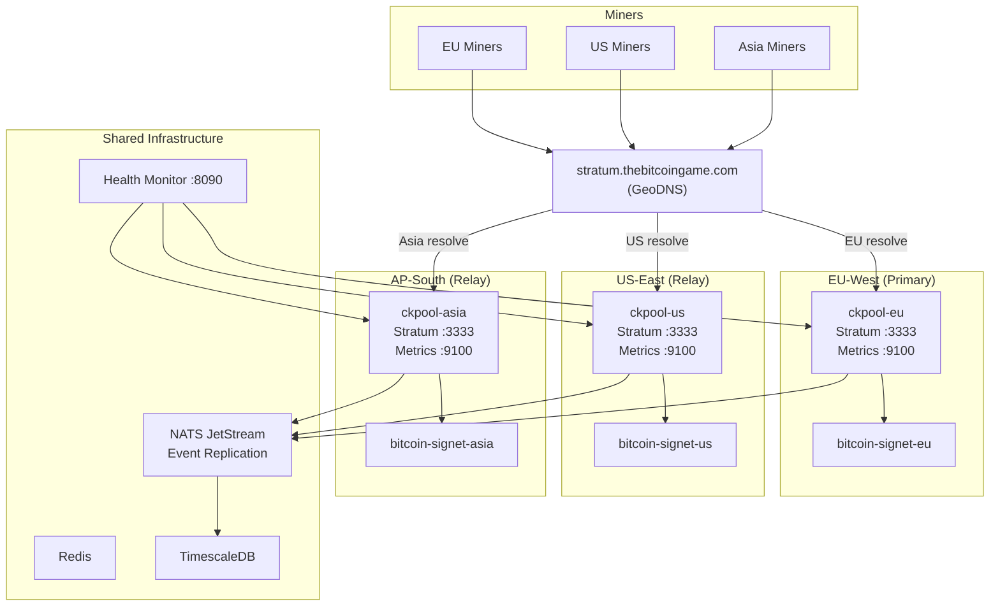

# GeoDNS for Multi-Region Mining -- TheBitcoinGame

## Overview

GeoDNS routes miners to the closest regional ckpool instance based on their
geographic location. This reduces network latency between miner and pool, which
directly reduces stale shares. In a mining pool, every millisecond of latency
increases the probability that a submitted share arrives after the pool has
already moved to a new job (new block template), making the share stale and
worthless.

TheBitcoinGame runs three ckpool instances across three regions. GeoDNS resolves
`stratum.thebitcoingame.com` to the IP of the nearest healthy region. If a
region goes down, DNS health checks detect the failure and stop advertising that
region's IP, causing miners to reconnect to the next closest region
automatically.

---

## Architecture

### Region Summary

| Region   | Role    | Stratum Port | Metrics Port | Simulated Latency to EU |
|----------|---------|:------------:|:------------:|:-----------------------:|
| eu-west  | Primary | 3333         | 9100         | 0 ms                   |
| us-east  | Relay   | 3333         | 9100         | ~80 ms +/- 10 ms       |
| ap-south | Relay   | 3333         | 9100         | ~150 ms +/- 20 ms      |

In production, each region runs on a separate server with its own public IP.
The Docker Compose multi-region stack (`docker-compose.multi-region.yml`)
simulates this locally using separate Docker networks and `tc netem` for
artificial latency on relay containers.

---

## Why GeoDNS Matters for Mining

Mining pools use the Stratum protocol. When a pool distributes a new job to
miners (triggered by a new block on the network), miners must receive that job
as fast as possible. If a miner submits a share for an old job (because the new
job arrived late due to latency), the share is **stale**.

Stale shares waste the miner's hashrate -- they contributed real electricity and
computation but the work was discarded. For the pool, a high stale rate reduces
effective hashrate and block-finding probability.

**Impact of latency on stale rate:**

| One-Way Latency | Approximate Stale Rate Impact |
|:---------------:|:-----------------------------:|
| < 20 ms         | Negligible (< 0.1%)          |
| 50 - 80 ms      | ~0.2 - 0.5%                  |
| 150 - 200 ms    | ~0.5 - 1.5%                  |
| > 300 ms         | > 2% (unacceptable)           |

GeoDNS keeps miners connected to the closest ckpool instance, minimizing
one-way latency to under 50 ms for most miners worldwide. Combined with DNS
health checks, it also provides automatic failover when a region becomes
unreachable.

---

## DNS Record Structure

The hostname `stratum.thebitcoingame.com` resolves differently depending on
where the DNS query originates:

| Query Origin       | Resolved IP        | Target Region |
|--------------------|--------------------|:-------------:|
| Europe / Africa    | `<eu-west-ip>`     | eu-west       |
| Americas           | `<us-east-ip>`     | us-east       |
| Asia / Oceania     | `<ap-south-ip>`    | ap-south      |
| Default (fallback) | `<eu-west-ip>`     | eu-west       |

All three records use a **60-second TTL** to allow fast failover. See the
failover policy doc for TTL trade-offs.

---

## Health Check Endpoints

Each region exposes two health-checkable endpoints:

| Endpoint         | Port | Protocol | What It Proves                     |
|------------------|:----:|:--------:|------------------------------------|
| Stratum listener | 3333 | TCP      | ckpool is accepting connections    |
| Prometheus metrics | 9100 | HTTP   | ckpool is processing and reporting |

The aggregated health monitor runs on port **8090** and polls all three
regions. It exposes `GET /health` which returns JSON with per-region status
(`healthy`, `unhealthy`, or `unreachable`).

---

## Documentation Index

| Document | Description |
|----------|-------------|
| [Route53 Setup](./route53-setup.md) | AWS Route53 geolocation routing configuration |
| [Cloudflare Setup](./cloudflare-setup.md) | Cloudflare load balancing with geo-steering |
| [Failover Policy](./failover-policy.md) | Health checks, failover order, TTL, recovery |
| [Monitoring](./monitoring.md) | DNS verification, alerting, Grafana dashboards |

---

## Quick Reference

- **Stratum hostname:** `stratum.thebitcoingame.com`
- **Stratum port:** `3333` (all regions)
- **Miner config:** `stratum+tcp://stratum.thebitcoingame.com:3333`
- **Health monitor:** `http://<health-monitor-host>:8090/health`
- **DNS TTL:** 60 seconds
- **Health check interval:** 15 seconds (configurable via `POLL_INTERVAL`)
