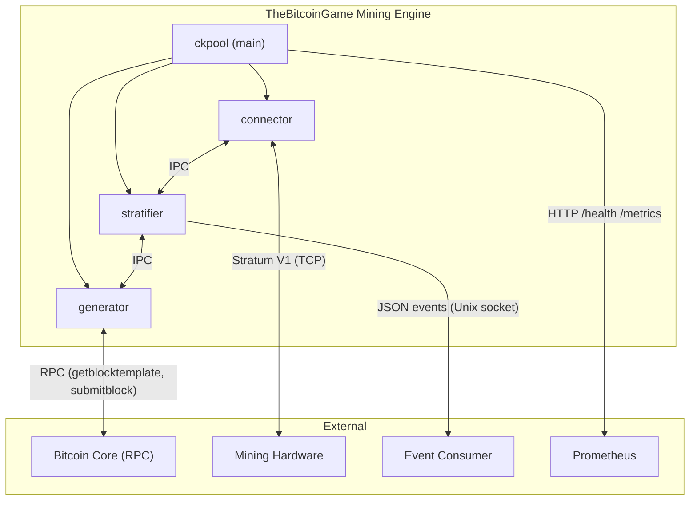
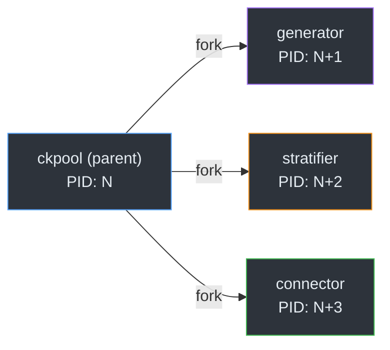
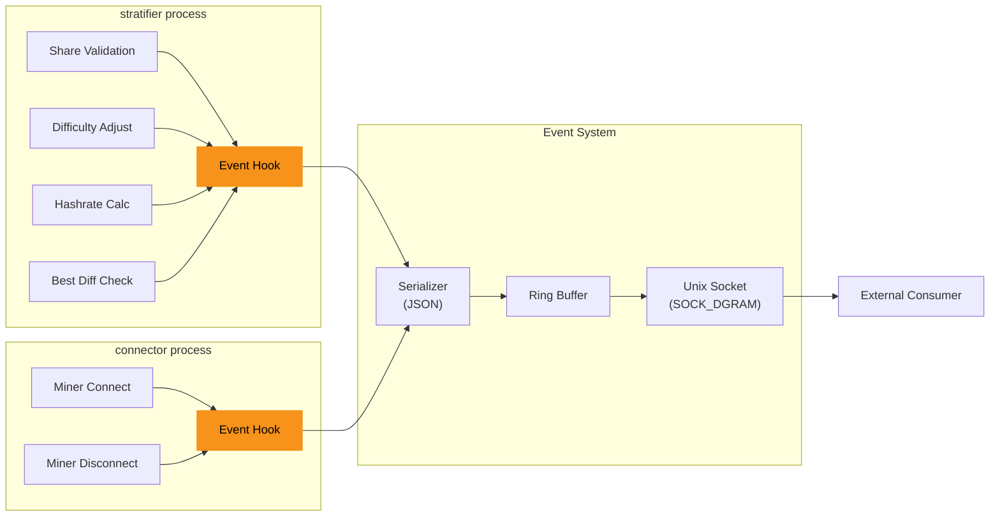
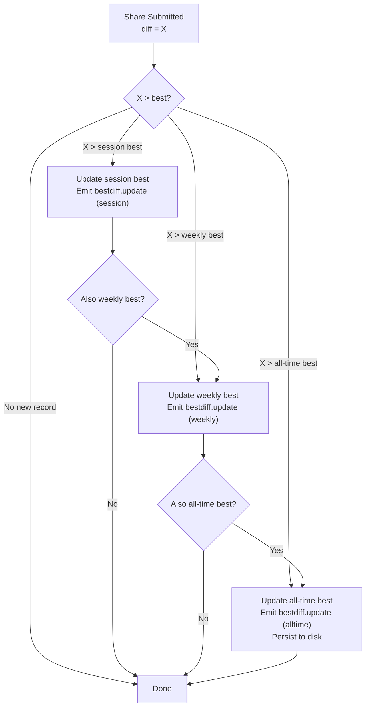
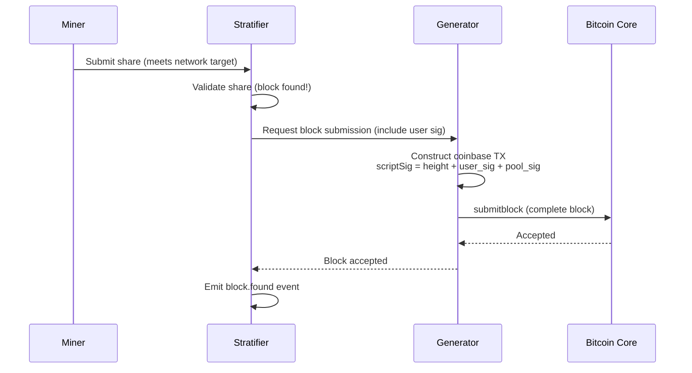
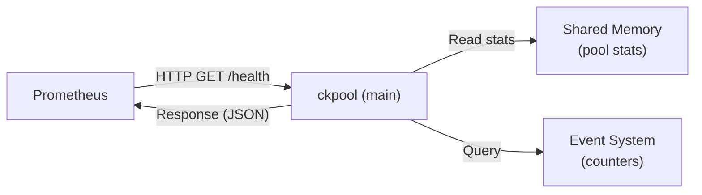

# Architecture

This document describes the technical architecture of TheBitcoinGame Mining Engine, focusing on how our modifications integrate with ckpool's existing multi-process design.

## Table of Contents

- [Overview](#overview)
- [Multi-Process Architecture](#multi-process-architecture)
- [Process Responsibilities](#process-responsibilities)
- [Inter-Process Communication](#inter-process-communication)
- [Event Emission System](#event-emission-system)
- [Key Data Structures](#key-data-structures)
- [Difficulty Tracking](#difficulty-tracking)
- [Coinbase Signature Flow](#coinbase-signature-flow)
- [Health Monitoring](#health-monitoring)
- [Integration Points](#integration-points)

---

## Overview

ckpool uses a multi-process architecture where a parent process (`ckpool`) forks four child processes, each responsible for a distinct function. Processes communicate via Unix domain sockets and shared memory. This design provides isolation (a crash in one process doesn't take down others) and allows each process to be optimized for its specific workload.

Our modifications are additive. We do not alter the multi-process model, the stratum protocol handling, or the share validation logic. Instead, we hook into well-defined points in the existing code to emit events, track difficulty records, and support new address formats.



## Multi-Process Architecture

When `ckpool` starts, it forks the following child processes:



Each process runs its own event loop and manages its own resources. The parent process monitors children and restarts them if they crash.

### Process Lifecycle

1. **Startup**: Parent reads configuration, sets up IPC channels, forks children.
2. **Running**: Each child enters its main loop. The parent monitors child health via signals.
3. **Shutdown**: Parent sends `SIGTERM` to children, waits for clean exit, then exits itself.
4. **Crash recovery**: If a child dies unexpectedly, the parent re-forks it with the same configuration.

## Process Responsibilities

### ckpool (Main/Parent)

- Parses configuration file (`ckpool.conf`)
- Forks and monitors child processes
- Handles signal routing (`SIGUSR1` for log rotation, `SIGTERM` for shutdown)
- Manages the runtime directory (`-s` flag) containing PID files and sockets
- **Our addition**: Initializes and tears down the event system; hosts the health HTTP endpoint

### generator

- Communicates with Bitcoin Core via JSON-RPC
- Calls `getblocktemplate` to fetch new block templates
- Constructs coinbase transactions
- Submits solved blocks via `submitblock`
- **Our addition**: Inserts per-user coinbase signature text when constructing coinbase transactions

### stratifier

- Implements the Stratum V1 protocol server-side logic
- Manages miner subscriptions, authorizations, and sessions
- Validates submitted shares against the current work target
- Implements variable difficulty adjustment per miner
- Calculates rolling hashrate estimates
- **Our addition**: Emits events after share validation, difficulty adjustment, hashrate recalculation, and best-difficulty updates; maintains per-user difficulty records

### connector

- Handles raw TCP connections from miners
- Manages socket I/O (epoll-based on Linux)
- Routes incoming stratum messages to the stratifier
- Routes outgoing stratum messages from the stratifier to miners
- Handles connection timeouts and cleanup
- **Our addition**: Emits `miner.connected` and `miner.disconnected` events

## Inter-Process Communication

Processes communicate through two mechanisms:

### Unix Domain Sockets (Primary)

Each process pair has a dedicated Unix domain socket for message passing. Messages are JSON-encoded and newline-delimited.

```
ckpool <-> generator:   /tmp/ckpool/generator
ckpool <-> stratifier:  /tmp/ckpool/stratifier
ckpool <-> connector:   /tmp/ckpool/connector
connector <-> stratifier: /tmp/ckpool/stратifier (via parent relay)
```

### Shared Memory

The stratifier uses shared memory segments for high-frequency data that multiple processes need to read:

- Current work templates (shared with connector for `mining.notify`)
- Global pool statistics (hashrate, share counts)

### Signals

- `SIGUSR1`: Triggers log file rotation in all processes
- `SIGUSR2`: Triggers statistics dump
- `SIGTERM`: Initiates clean shutdown

## Event Emission System

The event system is our primary addition to ckpool. It provides a way for external applications to observe mining activity in real time without modifying the mining logic.

### Architecture



### Design Principles

1. **Non-blocking**: Event emission never blocks the mining critical path. If the socket buffer is full, events are dropped silently.
2. **Fire-and-forget**: The mining engine does not wait for acknowledgment from event consumers. There is no back-pressure.
3. **Zero-copy where possible**: Event data is constructed from values already in memory (share diff, client address, etc.), not by re-querying.
4. **Configurable scope**: Operators can choose which event types to emit, reducing overhead for deployments that only need a subset.

### Implementation Details

The event system consists of three layers:

1. **Event hooks**: Inline calls placed after key operations in the stratifier and connector. These construct a `json_t` object representing the event.
2. **Serializer**: Converts the `json_t` object to a compact JSON string. Uses jansson's `json_dumps()` with `JSON_COMPACT` flag.
3. **Socket writer**: Sends the serialized JSON as a single datagram to the Unix domain socket. If `sendto()` would block, the event is dropped and a counter is incremented.

```c
// Simplified event emission flow
void event_emit(json_t *event)
{
    char *json_str;

    if (!event_socket_active)
        return;

    // Add common envelope fields
    json_object_set_new(event, "event_id", json_string(generate_uuid()));
    json_object_set_new(event, "timestamp", json_string(iso8601_now()));
    json_object_set_new(event, "pool_instance", json_string(pool_id));

    json_str = json_dumps(event, JSON_COMPACT);
    if (!json_str)
        return;

    // Non-blocking send
    if (sendto(event_fd, json_str, strlen(json_str), MSG_DONTWAIT,
               (struct sockaddr *)&event_addr, sizeof(event_addr)) < 0) {
        events_dropped++;
    }

    free(json_str);
}
```

See [events.md](events.md) for the full event type catalog and JSON schemas.

## Key Data Structures

### `stratum_instance_t` (Modified)

Represents a connected miner. Our modifications add difficulty tracking fields:

```c
typedef struct stratum_instance {
    /* ... existing fields ... */

    /* TheBitcoinGame additions */
    double best_diff_session;      /* Best difficulty this session */
    double best_diff_weekly;       /* Best difficulty this week (rolling) */
    double best_diff_alltime;      /* Best difficulty all-time */
    time_t weekly_reset_time;      /* When the weekly window started */
    char *custom_coinbase_sig;     /* Per-user coinbase text (nullable) */
} stratum_instance_t;
```

### `event_config_t` (New)

Configuration for the event emission system:

```c
typedef struct event_config {
    bool enabled;                  /* Master enable/disable */
    char *socket_path;             /* Path to Unix domain socket */
    int socket_fd;                 /* Socket file descriptor */
    uint32_t event_mask;           /* Bitmask of enabled event types */
    size_t buffer_hwm;             /* High-water mark for ring buffer */
    uint64_t events_emitted;       /* Counter: total events emitted */
    uint64_t events_dropped;       /* Counter: events dropped (buffer full) */
} event_config_t;
```

### `bestdiff_record_t` (New)

Persisted difficulty record:

```c
typedef struct bestdiff_record {
    char address[128];             /* Miner address (username) */
    double best_session;           /* Current session best */
    double best_weekly;            /* Current weekly best */
    double best_alltime;           /* All-time best */
    time_t session_start;          /* When this session started */
    time_t weekly_window_start;    /* Start of current weekly window */
    time_t alltime_achieved;       /* When all-time best was set */
} bestdiff_record_t;
```

## Difficulty Tracking

The enhanced difficulty tracking system extends ckpool's existing per-miner difficulty tracking with three scoped windows:



### Storage

- **Session best**: In-memory only. Stored in `stratum_instance_t`. Resets when the miner disconnects.
- **Weekly best**: In-memory with periodic disk flush. The weekly window is a rolling 7-day period that resets at Monday 00:00 UTC.
- **All-time best**: Persisted to `bestdiff.db` in the ckpool runtime directory. Loaded on startup. Written synchronously when a new all-time record is achieved.

## Coinbase Signature Flow

When a block is found, the solving miner's custom coinbase text is included in the coinbase transaction:



### Signature Priority

1. Per-user `custom_coinbase_sig` (if set and non-empty)
2. Pool-level `btcsig` from `ckpool.conf`
3. Default: `"ckpool"`

### Size Constraints

The coinbase scriptSig has a maximum size. After accounting for the block height push (required by BIP34) and other mandatory data, approximately 80 bytes remain for custom text. Signatures exceeding this limit are truncated with no error (a warning is logged).

## Health Monitoring

The health endpoint runs in the main (parent) process and exposes pool status over HTTP:



The endpoint is a minimal HTTP server (no external dependencies) that listens on a configurable port (default: 8080) and responds to `GET /health` with a JSON payload:

```json
{
    "status": "healthy",
    "uptime_seconds": 86400,
    "miners_connected": 12,
    "hashrate_ths": 1.23,
    "shares_per_second": 4.56,
    "last_block_found": "2025-01-15T10:30:00Z",
    "events": {
        "emitted": 1234567,
        "dropped": 0
    }
}
```

The optional `/metrics` endpoint outputs the same data in Prometheus exposition format.

## Integration Points

This section maps our modifications to specific locations in the ckpool source code. This is useful for code reviewers and future contributors.

| File | Function/Area | Modification |
|---|---|---|
| `ckpool.c` | `main()` | Initialize event system after config parse; start health endpoint |
| `ckpool.c` | `sighandler()` | Clean shutdown of event socket and health endpoint |
| `stratifier.c` | `submit_share()` | Emit `share.submitted` event before validation |
| `stratifier.c` | `test_share()` | Emit `share.accepted` and `block.found` events; update best-diff records |
| `stratifier.c` | `update_diff()` | Emit `difficulty.update` event |
| `stratifier.c` | `calc_hashrate()` | Emit `hashrate.update` event |
| `stratifier.c` | `auth_client()` | Load per-user coinbase sig and best-diff records |
| `stratifier.c` | `disconnect_client()` | Reset session best; emit `miner.disconnected` |
| `connector.c` | `accept_client()` | Emit `miner.connected` event |
| `connector.c` | `client_timeout()` | Emit `miner.disconnected` event |
| `generator.c` | `gen_coinbase()` | Insert per-user coinbase signature text |
| `generator.c` | Bech32m validation | Add Taproot address validation path |

### New Files

| File | Purpose |
|---|---|
| `src/events.c` | Event system implementation (emit, socket, buffer) |
| `src/events.h` | Event system header (types, config struct, public API) |
| `src/bestdiff.c` | Best difficulty tracking and persistence |
| `src/bestdiff.h` | Best difficulty header |
| `src/health.c` | HTTP health endpoint server |
| `src/health.h` | Health endpoint header |
| `src/bech32m.c` | BIP350 Bech32m encoding/decoding for Taproot |
| `src/bech32m.h` | Bech32m header |
