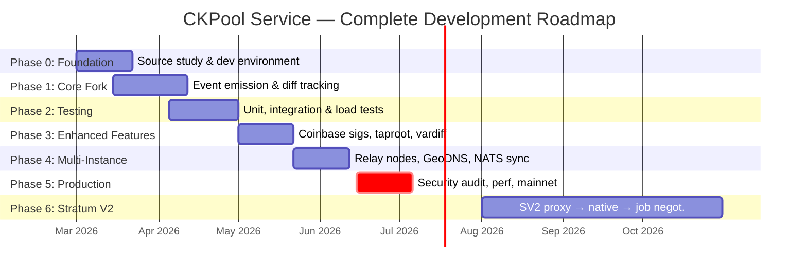

# CKPool Service -- Development Roadmap

**Version:** 1.0
**Date:** February 2026
**Maintainer:** The Bitcoin Game Engineering Team
**License:** GPLv3 (inherited from ckpool-solo by Con Kolivas)

---

## Introduction

This document provides a high-level overview of the CKPool service development roadmap for The Bitcoin Game. The roadmap is organized into seven phases, progressing from research and environment setup through to Stratum V2 integration with full miner transaction selection.

The CKPool service is the core mining engine -- a fork of ckpool-solo (GPLv3) extended with event emission, enhanced difficulty tracking, custom coinbase signatures, and multi-region distribution. The event pipeline (C ckpool --> Unix socket --> Python Event Collector --> Redis Streams + TimescaleDB --> FastAPI + Game Engine) bridges the open-source mining engine with our proprietary gamification platform.

For the full system architecture and design rationale, see the [Master Plan](../00-master-plan.md).

---

## Visual Timeline

---

## Phase Index

| Phase | Name | Duration | Start | End | Status | Document |
|---|---|---|---|---|---|---|
| **0** | Foundation & Research | 3 weeks | Mar 1 | Mar 21 | Planned | [phase-00-foundation.md](./phase-00-foundation.md) |
| **1** | Core Fork & Event System | 4 weeks | Mar 15 | Apr 12 | Planned | [phase-01-core-fork.md](./phase-01-core-fork.md) |
| **2** | Testing Infrastructure | 3 weeks | Apr 5 | Apr 26 | Planned | [phase-02-testing.md](./phase-02-testing.md) |
| **3** | Enhanced Features | 3 weeks | May 1 | May 21 | Planned | [phase-03-enhanced-features.md](./phase-03-enhanced-features.md) |
| **4** | Multi-Instance & Geo-Distribution | 3 weeks | May 22 | Jun 11 | Planned | [phase-04-multi-instance.md](./phase-04-multi-instance.md) |
| **5** | Production Hardening | 3 weeks | Jun 15 | Jul 4 | Planned | [phase-05-production.md](./phase-05-production.md) |
| **6** | Stratum V2 Integration | 3 months | Aug 1 | Oct 31 | Planned | [phase-06-stratum-v2.md](./phase-06-stratum-v2.md) |

### Phase Summaries

**Phase 0 -- Foundation & Research:** Study the ckpool-solo source code, set up the development environment with Bitcoin Core on signet/testnet, establish CI/CD pipeline, and configure the build system for the fork.

**Phase 1 -- Core Fork & Event System:** Implement the event emission system (Unix domain socket, JSON datagrams), enhanced difficulty tracking (per-user best-diff-per-week), custom coinbase signature support, and the Python event collector service.

**Phase 2 -- Testing Infrastructure:** Build out unit tests for C code (share validation, address parsing, event emission), integration tests on signet (end-to-end mining flow), and load testing infrastructure (simulated miners at scale).

**Phase 3 -- Enhanced Features:** Per-user coinbase signature customization, taproot (bc1p) address support via bech32m, enhanced VarDiff algorithm (faster ramp-up, reconnect memory, EMA dampening), health monitoring endpoints for Prometheus, and AsicBoost version-rolling verification.

**Phase 4 -- Multi-Instance & Geo-Distribution:** Deploy relay ckpool instances in US-East and Asia alongside the EU primary. Implement passthrough mode for relays, configure GeoDNS routing (mine.thebitcoingame.com), deploy NATS JetStream for cross-region event synchronization, and build failover logic.

**Phase 5 -- Production Hardening:** Security audit (C code review, Stratum protocol fuzzing, rate limiting), performance optimization (CPU profiling, memory pooling, 100k connection scalability), mainnet deployment with gradual rollout, monitoring/alerting (Prometheus + Grafana + PagerDuty), and backup/disaster recovery.

**Phase 6 -- Stratum V2 Integration:** Three sub-phases over three months. Phase A deploys an SRI Translation Proxy for immediate SV2 support (encryption, bandwidth reduction). Phase B integrates native SV2 pool support via Rust FFI bindings into ckpool. Phase C implements Job Negotiation, enabling miners to select their own transactions -- the pinnacle of mining decentralization.

---

## Dependencies

```mermaid
graph LR
    P0["Phase 0<br/>Foundation"]
    P1["Phase 1<br/>Core Fork"]
    P2["Phase 2<br/>Testing"]
    P3["Phase 3<br/>Enhanced Features"]
    P4["Phase 4<br/>Multi-Instance"]
    P5["Phase 5<br/>Production"]
    P6["Phase 6<br/>Stratum V2"]

    P0 -->|"Dev env ready"| P1
    P1 -->|"Event system working"| P2
    P1 -->|"Core features done"| P3
    P2 -->|"Test harness ready"| P3
    P3 -->|"Health endpoints"| P4
    P4 -->|"Multi-region infra"| P5
    P5 -->|"Mainnet stable"| P6

    style P5 fill:#4a1a1a,stroke:#f85149
    style P6 fill:#3a2a1a,stroke:#d4a843
```

| Dependency | From | To | What Must Be Done |
|---|---|---|---|
| Dev environment | Phase 0 | Phase 1 | Signet node running, build system configured, CI green |
| Event system | Phase 1 | Phase 2 | Event emission compiles and runs, collector receives events |
| Test harness | Phase 2 | Phase 3 | Unit test framework operational, integration test environment on signet |
| Core features | Phase 1 | Phase 3 | Share validation, event emission, basic VarDiff all functional |
| Health endpoints | Phase 3 | Phase 4 | Prometheus `/metrics` endpoint live (needed for GeoDNS health checks) |
| Multi-region infra | Phase 4 | Phase 5 | All three regions deployed and mining (on testnet/signet) |
| Mainnet stability | Phase 5 | Phase 6 | Mainnet running with real miners, zero critical issues for 2+ weeks |

### Parallel Work Opportunities

Some phases have overlapping timelines because sub-tasks can proceed in parallel:

- **Phase 1 + Phase 2 overlap (1 week):** Testing infrastructure setup can begin while Phase 1 finalizes the event collector.
- **Phase 3 features are independent:** Taproot support, VarDiff improvements, and health monitoring have no internal dependencies and can be developed in parallel by different engineers.
- **Phase 5 Bitcoin Core sync:** The 2-week mainnet IBD runs in the background while security audit and performance work proceed.
- **Phase 6 sub-phases are sequential** but each is independently deployable.

---

## Resource Requirements

| Phase | Engineers | Infrastructure | External Dependencies |
|---|---|---|---|
| 0 | 1 C/Systems | 1 dev server, Bitcoin Core signet | None |
| 1 | 2 (C + Python) | Dev server + CI runner | None |
| 2 | 1--2 (C + Python) | Signet infrastructure, CI | None |
| 3 | 2 C/Systems | Same as Phase 2 | BIP341 test vectors, Redis |
| 4 | 2 (Systems + DevOps) | 3 servers (EU/US/Asia), DNS | AWS Route53, NATS license (open source) |
| 5 | 2--3 (Systems + Security + DevOps) | Production servers, monitoring stack | PagerDuty, Grafana Cloud (optional) |
| 6 | 2 (C + Rust) | Same as Phase 5 + SRI test environment | SRI (open source), Rust toolchain |

---

## Risk Register

| Risk | Probability | Impact | Mitigation |
|---|---|---|---|
| ckpool upstream breaking change | Low | Medium | Pin to specific commit, monitor upstream |
| Bitcoin Core mainnet sync delay | Medium | Low | Start sync 2 weeks early (Phase 5) |
| SV2 specification changes | Low | High | Engage with SRI community, attend dev calls |
| 100k connection target not met | Medium | Medium | Profile early (Phase 5), optimize or scale horizontally |
| Security vulnerability in C code | Medium | Critical | Fuzzing (Phase 5), security audit, compiler hardening |
| Cross-region latency higher than expected | Low | Medium | Benchmark early (Phase 4), add more relay regions if needed |
| Rust FFI integration complexity | Medium | Medium | Prototype FFI in Phase B week 1, have fallback to proxy |
| GPL compliance issue | Low | Critical | Legal review before public fork, strict process boundary |

---

## Definition of Done

The CKPool service is considered production-ready when **all** of the following criteria are met:

### Functional Completeness

- [ ] Stratum V1 endpoint accepting miners on mainnet (:3333)
- [ ] Event emission system operational (all 8+ event types)
- [ ] Event pipeline flowing: ckpool --> collector --> Redis + TimescaleDB --> API
- [ ] Per-user coinbase signatures working (visible in mined blocks)
- [ ] Taproot (bc1p) addresses supported
- [ ] Enhanced VarDiff stable across all miner types (Bitaxe, ASIC, intermittent)
- [ ] Multi-region deployment: 3 regions (EU, US, Asia) with GeoDNS

### Reliability

- [ ] Zero crashes in 30-day mainnet production window
- [ ] Auto-recovery from any single component failure (ckpool, Bitcoin Core, NATS, Redis)
- [ ] Relay independent mode tested and operational
- [ ] Disaster recovery procedure tested and documented (RTO <48h)
- [ ] Backup strategy operational (TimescaleDB WAL archiving, Redis RDB, config in git)

### Performance

- [ ] 100,000 concurrent connection capacity verified via load test
- [ ] Share submission P99 latency <10ms (same region)
- [ ] Event emission latency <1ms (P99)
- [ ] Stale share rate <0.5% (all regions)
- [ ] Template propagation <200ms to farthest relay

### Security

- [ ] Security audit completed (code review + protocol fuzzing)
- [ ] All fuzzer-discovered crashes fixed
- [ ] Rate limiting operational on all public endpoints
- [ ] Input validation hardened on all miner-supplied data
- [ ] Compiler hardening flags enabled (stack canaries, FORTIFY_SOURCE, PIE, RELRO)
- [ ] No known vulnerabilities in any dependency

### Observability

- [ ] Prometheus metrics exposed and scraped (all metrics from catalog)
- [ ] Grafana dashboards operational (3+ dashboards)
- [ ] PagerDuty alerts configured (critical: <5min response, warning: <30min)
- [ ] Runbooks documented for all critical alert scenarios

### Stratum V2 (Post-Launch Enhancement)

- [ ] SV2 endpoint operational on mainnet (:3334)
- [ ] Native SV2 support (no translation proxy required)
- [ ] Job Negotiation operational (miners can select own transactions)
- [ ] Gamification integration for SV2 features ("Sovereign Miner" badge)

---

## Milestone Timeline

```mermaid
graph LR
    M1["Milestone 1<br/>Mar 21<br/><b>Dev Environment Ready</b><br/>Signet mining operational"]
    M2["Milestone 2<br/>Apr 12<br/><b>Event System Live</b><br/>Events flowing on signet"]
    M3["Milestone 3<br/>May 1<br/><b>Test Suite Green</b><br/>All tests passing"]
    M4["Milestone 4<br/>May 21<br/><b>Feature Complete</b><br/>All enhanced features done"]
    M5["Milestone 5<br/>Jun 11<br/><b>Multi-Region Operational</b><br/>3 regions mining on signet"]
    M6["Milestone 6<br/>Jul 4<br/><b>Mainnet Launch</b><br/>Production mining live"]
    M7["Milestone 7<br/>Oct 31<br/><b>SV2 Complete</b><br/>Job Negotiation operational"]

    M1 --> M2 --> M3 --> M4 --> M5 --> M6 --> M7

    style M6 fill:#4a1a1a,stroke:#f85149
    style M7 fill:#3a2a1a,stroke:#d4a843
```

| Milestone | Date | Gate Criteria |
|---|---|---|
| **M1: Dev Environment Ready** | Mar 21, 2026 | ckpool compiles, Bitcoin Core signet synced, CI pipeline green |
| **M2: Event System Live** | Apr 12, 2026 | Events emitted from ckpool, collector receives and persists, dashboard shows signet data |
| **M3: Test Suite Green** | May 1, 2026 | All unit tests pass, integration tests pass on signet, load test baseline established |
| **M4: Feature Complete** | May 21, 2026 | Taproot, custom coinbase sigs, enhanced VarDiff, health monitoring all operational |
| **M5: Multi-Region Operational** | Jun 11, 2026 | 3 regions mining on signet, GeoDNS routing, NATS event sync, failover tested |
| **M6: Mainnet Launch** | Jul 4, 2026 | Security audit passed, performance targets met, mainnet mining live (invite-only) |
| **M7: SV2 Complete** | Oct 31, 2026 | Native SV2 + Job Negotiation operational on mainnet |

---

*For detailed implementation plans, click through to the individual phase documents above.*
*This roadmap is a living document. Update as timelines shift and scope evolves.*
