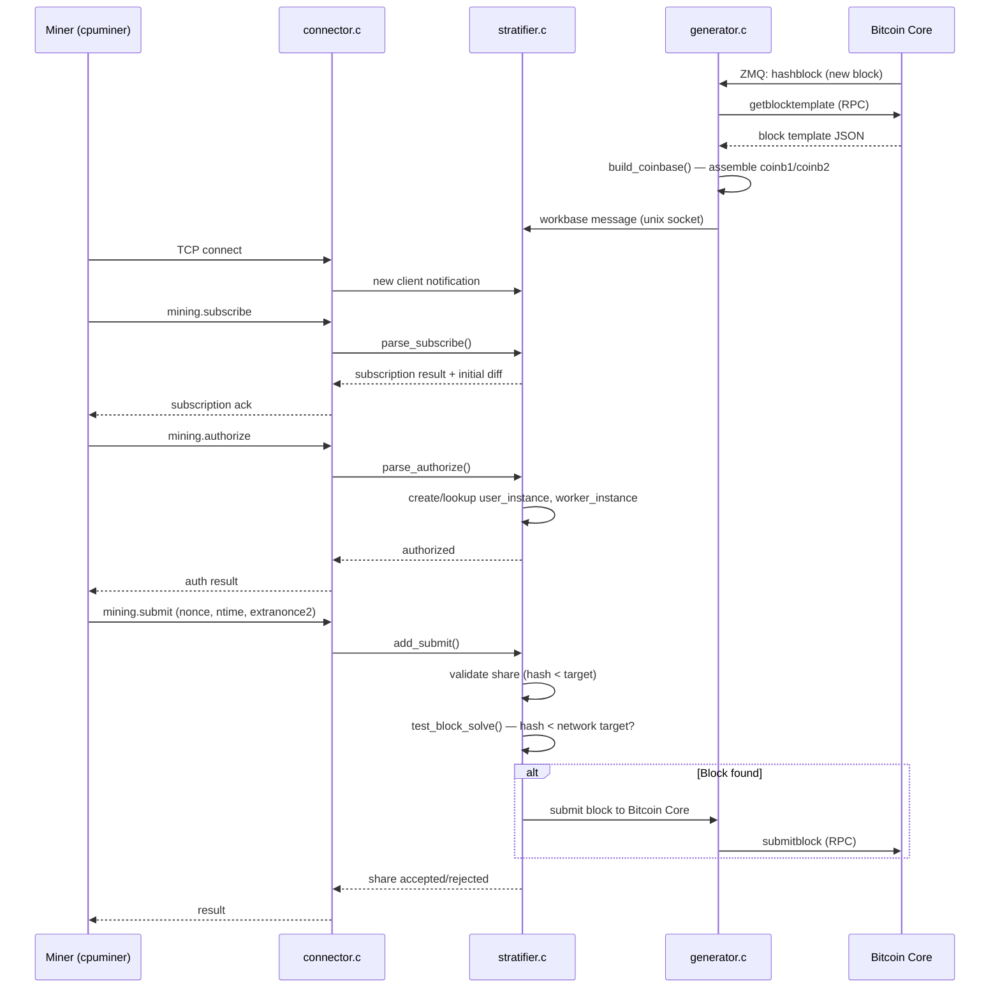
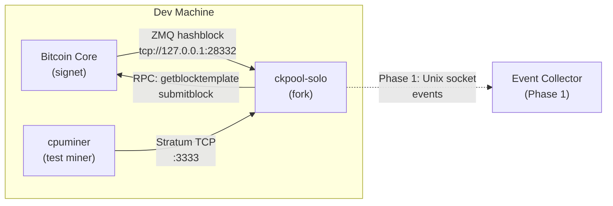
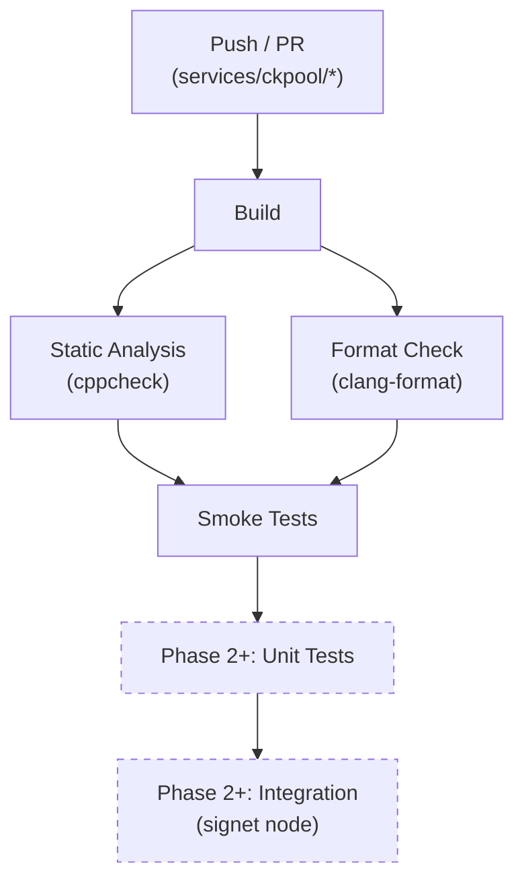

# Phase 0 — Foundation & Research

| Field        | Value                              |
| ------------ | ---------------------------------- |
| **Duration** | 3 weeks                            |
| **Status**   | Not Started                        |
| **Owner**    | TBD                                |
| **Depends**  | None (first phase)                 |
| **Blocks**   | Phase 1 — Core Fork & Event System |

---

## 0.1 Objectives

1. **Deep-dive the ckpool-solo source** — build a working mental model of the stratum lifecycle from socket accept to share submission, block solve, and coinbase assembly.
2. **Stand up a reproducible dev environment** — deterministic builds, Bitcoin Core on signet, and a cpuminer instance that can submit test shares.
3. **Establish CI/CD** — every push to the fork must compile cleanly, pass a minimal smoke-test, and survive static analysis.
4. **Document architectural decisions** — capture the knowledge as ADRs so future contributors can onboard in hours, not days.

---

## 0.2 ckpool Source Code Study

ckpool-solo (by Con Kolivas, GPLv3) is a compact, single-process, event-loop C program. The entire mining server — stratum protocol, difficulty management, block assembly, and Bitcoin RPC communication — lives in roughly 15 000 lines across six principal files.

### 0.2.1 File-by-File Study Plan

| # | File              | Lines (approx) | Study Focus                                                                                     | Priority |
|---|-------------------|-----------------|-------------------------------------------------------------------------------------------------|----------|
| 1 | `ckpool.c`        | ~1 200          | Process lifecycle, signal handling, child process management, config parsing                    | High     |
| 2 | `stratifier.c`    | ~5 500          | **Core target.** Stratum protocol, share validation, difficulty management, block solve testing | Critical |
| 3 | `generator.c`     | ~1 800          | Block template (GBT) requests, coinbase construction, Bitcoin RPC calls                         | Critical |
| 4 | `connector.c`     | ~1 500          | Socket accept, client read/write, JSON frame parsing                                           | High     |
| 5 | `bitcoin.c`       | ~800            | Address validation, script assembly, base58/bech32                                              | Medium   |
| 6 | `libckpool.c`     | ~2 500          | Utility layer: logging, memory, sockets, JSON helpers, locking primitives                       | Medium   |

### 0.2.2 Key Data Structures

These structures carry state through the entire stratum lifecycle. Understanding their fields, lifetimes, and locking semantics is a prerequisite for Phase 1 modifications.

```c
/* --- stratifier.c --- */

typedef struct stratum_instance {
    UT_hash_handle  hh;              /* hash table handle (uthash) */
    int64_t         id;              /* unique connection id */
    char            address[INET6_ADDRSTRLEN]; /* client IP */
    int             fd;              /* file descriptor */
    user_instance_t *user_instance;  /* parent user */
    worker_instance_t *worker_instance;
    double          diff;            /* current share difficulty */
    double          best_diff;       /* best diff this session */
    tv_t            ldc;             /* last diff change */
    /* ... */
} stratum_instance_t;

typedef struct user_instance {
    UT_hash_handle  hh;
    char            username[128];
    double          best_diff;       /* best diff ever (vanilla) */
    int64_t         shares;          /* total shares (vanilla) */
    /* --- Phase 1 additions (documented here for reference) --- */
    // double       best_diff_session;
    // double       best_diff_week;
    // double       best_diff_alltime;
    // int64_t      total_shares_week;
    // int          current_week;
} user_instance_t;

typedef struct worker_instance {
    UT_hash_handle  hh;
    user_instance_t *user_instance;
    char            workername[128];
    double          best_diff;
    int64_t         shares;
    /* ... */
} worker_instance_t;

/* --- generator.c --- */

typedef struct workbase {
    int64_t  id;
    char     prevhash[68];
    char     coinb1[512];            /* coinbase part 1 */
    char     coinb2[512];            /* coinbase part 2 */
    int      merkles;
    char     merklehash[16][68];
    char     bbversion[12];
    char     nbit[12];
    char     ntime[12];
    double   diff;                   /* network difficulty */
    /* ... */
} workbase_t;
```

### 0.2.3 Stratum Lifecycle Walkthrough



### 0.2.4 Study Deliverables

- [ ] Annotated source notes for each of the 6 files
- [ ] Data structure reference sheet (fields, types, lifetimes, locking)
- [ ] Stratum lifecycle document with sequence diagrams
- [ ] VarDiff algorithm walkthrough (exponential moving average, retarget interval)
- [ ] Block template flow from Bitcoin Core ZMQ to miner notification

---

## 0.3 Development Environment Setup

### 0.3.1 Build Dependencies

```bash
# Ubuntu 22.04 / Debian 12
sudo apt update && sudo apt install -y \
    build-essential \
    autoconf \
    automake \
    libtool \
    pkg-config \
    yasm \
    libzmq3-dev \
    libjson-c-dev \
    libcurl4-openssl-dev \
    libssl-dev \
    git \
    valgrind \
    cppcheck \
    clang-format

# macOS (Homebrew)
brew install autoconf automake libtool pkg-config yasm \
    zeromq json-c curl openssl@3 cppcheck clang-format
```

### 0.3.2 ckpool Build Verification

```bash
git clone https://bitbucket.org/ckolivas/ckpool-solo.git /opt/ckpool-solo
cd /opt/ckpool-solo

# Vanilla build (must succeed before any modifications)
./autogen.sh
./configure --prefix=/usr/local
make -j$(nproc)

# Verify binary
./src/ckpool --help
```

### 0.3.3 Bitcoin Core — Signet

Signet is preferred over testnet3 because it has deterministic block times (~10 min), virtually no spam, and is the standard for protocol development testing.

```bash
# Install Bitcoin Core 27.x
BITCOIN_VERSION=27.1
wget "https://bitcoincore.org/bin/bitcoin-core-${BITCOIN_VERSION}/bitcoin-${BITCOIN_VERSION}-x86_64-linux-gnu.tar.gz"
tar xzf "bitcoin-${BITCOIN_VERSION}-x86_64-linux-gnu.tar.gz"
sudo install -m 0755 -o root -g root bitcoin-${BITCOIN_VERSION}/bin/* /usr/local/bin/

# Create signet data directory
mkdir -p ~/.bitcoin/signet
```

**`~/.bitcoin/bitcoin.conf`**

```ini
# --- Network ---
signet=1
[signet]

# --- RPC (for ckpool) ---
server=1
rpcuser=ckpool
rpcpassword=ckpool_dev_password_change_me
rpcallowip=127.0.0.1
rpcbind=127.0.0.1
rpcport=38332

# --- ZMQ (for ckpool block notifications) ---
zmqpubhashblock=tcp://127.0.0.1:28332
zmqpubrawblock=tcp://127.0.0.1:28333

# --- Performance ---
dbcache=512
maxmempool=256
```

```bash
# Start bitcoind and wait for IBD (signet is small, ~5 GB)
bitcoind -daemon
bitcoin-cli -signet getblockchaininfo
```

### 0.3.4 ckpool Signet Configuration

**`/etc/ckpool/ckpool.conf`** (for development)

```json
{
    "btcd": [
        {
            "url": "127.0.0.1:38332",
            "auth": "ckpool",
            "pass": "ckpool_dev_password_change_me",
            "notify": "tcp://127.0.0.1:28332"
        }
    ],
    "btcaddress": "tb1q_YOUR_SIGNET_ADDRESS_HERE",
    "btcsig": "/The Bitcoin Game/",
    "blockpoll": 500,
    "nonce1length": 4,
    "nonce2length": 8,
    "update_interval": 30,
    "mindiff": 1,
    "startdiff": 1,
    "maxdiff": 0,
    "logdir": "/var/log/ckpool"
}
```

### 0.3.5 cpuminer for Test Share Submission

```bash
# Build cpuminer-multi
git clone https://github.com/tpruvot/cpuminer-multi.git
cd cpuminer-multi
./autogen.sh
./configure
make -j$(nproc)

# Mine against local ckpool on signet
./cpuminer \
    -a sha256d \
    -o stratum+tcp://127.0.0.1:3333 \
    -u tb1q_YOUR_SIGNET_ADDRESS.worker1 \
    -p x \
    --no-longpoll \
    --threads 1
```

### 0.3.6 Environment Architecture



---

## 0.4 CI/CD Pipeline

### 0.4.1 GitHub Actions Workflow

```yaml
# .github/workflows/ckpool-build.yml
name: ckpool Build & Lint

on:
  push:
    paths:
      - 'services/ckpool/**'
  pull_request:
    paths:
      - 'services/ckpool/**'

jobs:
  build:
    runs-on: ubuntu-22.04
    steps:
      - uses: actions/checkout@v4
        with:
          submodules: recursive

      - name: Install dependencies
        run: |
          sudo apt-get update
          sudo apt-get install -y \
            build-essential autoconf automake libtool \
            pkg-config yasm libzmq3-dev libjson-c-dev \
            libcurl4-openssl-dev libssl-dev valgrind cppcheck

      - name: Build ckpool
        working-directory: services/ckpool
        run: |
          ./autogen.sh
          ./configure
          make -j$(nproc)

      - name: Static analysis (cppcheck)
        working-directory: services/ckpool
        run: |
          cppcheck --enable=all --error-exitcode=1 \
            --suppress=missingIncludeSystem \
            --inline-suppr \
            src/

      - name: Check formatting (clang-format)
        working-directory: services/ckpool
        run: |
          find src/ -name '*.c' -o -name '*.h' | \
            xargs clang-format --dry-run --Werror

  smoke-test:
    needs: build
    runs-on: ubuntu-22.04
    steps:
      - uses: actions/checkout@v4
        with:
          submodules: recursive

      - name: Install dependencies
        run: |
          sudo apt-get update
          sudo apt-get install -y \
            build-essential autoconf automake libtool \
            pkg-config yasm libzmq3-dev libjson-c-dev \
            libcurl4-openssl-dev libssl-dev

      - name: Build
        working-directory: services/ckpool
        run: |
          ./autogen.sh && ./configure && make -j$(nproc)

      - name: Smoke test — binary starts and prints help
        working-directory: services/ckpool
        run: |
          ./src/ckpool --help | grep -q "Usage"

      - name: Smoke test — config file parsing
        working-directory: services/ckpool
        run: |
          echo '{"btcd":[{"url":"127.0.0.1:38332","auth":"test","pass":"test"}],"btcaddress":"tb1qw508d6qejxtdg4y5r3zarvary0c5xw7kxpjzsx"}' > /tmp/test.conf
          timeout 3 ./src/ckpool -c /tmp/test.conf -n || true
          # -n = no-daemon; exits with error because bitcoind is not running,
          # but the config should parse without segfault
```

### 0.4.2 Pipeline Stages



---

## 0.5 Testing Requirements — Phase 0

These are the minimum acceptance criteria before Phase 0 can be marked complete.

### 0.5.1 ckpool Builds Successfully

| # | Test                                         | Method                          | Pass Criteria                        |
|---|----------------------------------------------|---------------------------------|--------------------------------------|
| 1 | `./autogen.sh` completes                     | Manual + CI                     | Exit code 0                          |
| 2 | `./configure` detects all deps               | Manual + CI                     | No `checking for ... no` on required |
| 3 | `make` produces `src/ckpool` binary          | Manual + CI                     | Binary exists, is executable         |
| 4 | `cppcheck` reports no errors                 | CI                              | Exit code 0                          |
| 5 | Binary prints help text                      | `./src/ckpool --help`           | Outputs usage string                 |

### 0.5.2 Signet Mining Works with cpuminer

| # | Test                                         | Method                          | Pass Criteria                                  |
|---|----------------------------------------------|---------------------------------|------------------------------------------------|
| 6 | Bitcoin Core signet fully synced             | `bitcoin-cli getblockchaininfo` | `"initialblockdownload": false`                |
| 7 | ZMQ notifications flowing                    | `python3 zmq_listener.py`      | Receives `hashblock` on new signet block       |
| 8 | ckpool starts and connects to bitcoind       | Process logs                    | `Connected to bitcoind` in log                 |
| 9 | cpuminer connects to ckpool                  | cpuminer stdout                 | `Stratum detected` message                     |
| 10| cpuminer submits shares                      | cpuminer stdout + ckpool log    | `Accepted` shares in both logs                 |
| 11| ckpool receives new block template via ZMQ   | ckpool log                      | `Block hash changed` after signet block        |

### 0.5.3 ZMQ Notification Flow Verification

```python
#!/usr/bin/env python3
"""zmq_listener.py — Verify Bitcoin Core ZMQ notifications are working."""
import zmq
import binascii

context = zmq.Context()
socket = context.socket(zmq.SUB)
socket.connect("tcp://127.0.0.1:28332")
socket.setsockopt_string(zmq.SUBSCRIBE, "hashblock")

print("Listening for hashblock notifications on signet...")
print("(Wait for next signet block, ~10 min)")

while True:
    msg = socket.recv_multipart()
    topic = msg[0].decode()
    body = binascii.hexlify(msg[1]).decode()
    seq = int.from_bytes(msg[2], byteorder="little")
    print(f"[{topic}] block={body[:16]}... seq={seq}")
```

---

## 0.6 Deliverables Checklist

| # | Deliverable                                             | Owner | Status |
|---|---------------------------------------------------------|-------|--------|
| 1 | Annotated source notes for all 6 core ckpool files      | TBD   | [ ]    |
| 2 | Data structure reference document                       | TBD   | [ ]    |
| 3 | Stratum lifecycle sequence diagram                      | TBD   | [ ]    |
| 4 | VarDiff algorithm analysis                              | TBD   | [ ]    |
| 5 | ckpool fork repo initialized under `services/ckpool/`   | TBD   | [ ]    |
| 6 | Dev environment setup script (`scripts/setup-dev.sh`)   | TBD   | [ ]    |
| 7 | Bitcoin Core signet running and synced                   | TBD   | [ ]    |
| 8 | ckpool builds and starts against signet                  | TBD   | [ ]    |
| 9 | cpuminer submits shares to ckpool on signet             | TBD   | [ ]    |
| 10| ZMQ listener script verifies block notifications        | TBD   | [ ]    |
| 11| GitHub Actions CI pipeline — build + lint + smoke       | TBD   | [ ]    |
| 12| ADR-001: Why we fork ckpool-solo (not Stratum V2, etc.) | TBD   | [ ]    |
| 13| ADR-002: Signet vs testnet3 for development             | TBD   | [ ]    |
| 14| ADR-003: Mono-repo structure and GPL boundary           | TBD   | [ ]    |

---

## 0.7 Week-by-Week Schedule

### Week 1 — Source Study & Environment

- Read and annotate `ckpool.c`, `libckpool.c`, `connector.c`
- Install all build dependencies
- Build ckpool from vanilla source (verify clean build)
- Install and sync Bitcoin Core signet
- Write `scripts/setup-dev.sh` automation

### Week 2 — Deep Dive & Mining Flow

- Read and annotate `stratifier.c` (critical — largest file)
- Read and annotate `generator.c` and `bitcoin.c`
- Document data structures with locking semantics
- Configure ckpool for signet, start it
- Connect cpuminer, verify share submission end-to-end

### Week 3 — CI/CD & Documentation

- Create GitHub Actions workflow (build + lint + smoke)
- Write ADRs (001, 002, 003)
- Produce final stratum lifecycle diagram
- Document VarDiff algorithm with examples
- Run all Phase 0 acceptance tests
- Phase 0 review and sign-off

---

## 0.8 Risk Register

| Risk                                          | Impact | Likelihood | Mitigation                                                  |
|-----------------------------------------------|--------|------------|-------------------------------------------------------------|
| ckpool build fails on macOS (dev machines)    | Medium | Medium     | Docker dev container; CI is Ubuntu-only anyway               |
| Signet IBD takes too long                     | Low    | Low        | Signet chain is small (~5 GB); use `assumevalid`            |
| ckpool source uses undocumented uthash macros | Medium | High       | Study uthash.h separately; it is a well-known single-header |
| Team lacks C experience                       | High   | Medium     | Pair programming; Phase 0 is study-only, no code changes    |
| ZMQ version mismatch                          | Low    | Low        | Pin libzmq3-dev; test in CI container                        |

---

*Phase 0 produces no code changes to ckpool. Its sole purpose is to build the team's understanding and the infrastructure that Phase 1 depends on.*
