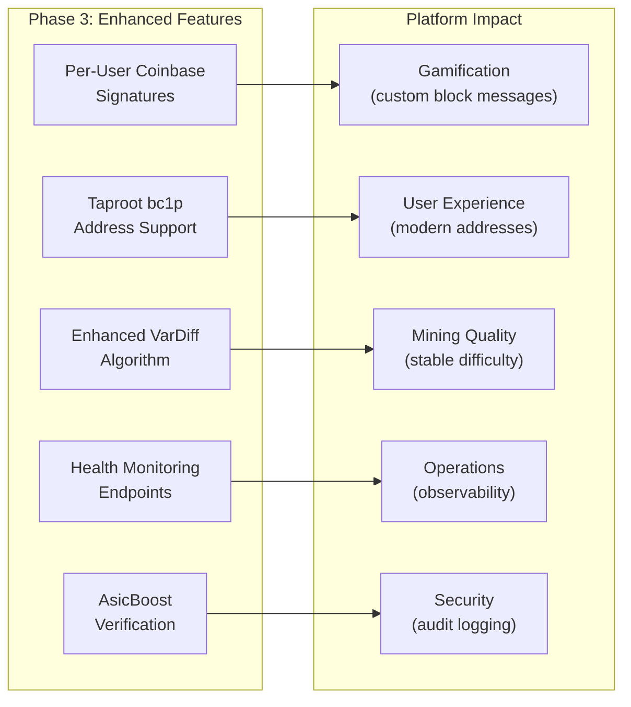
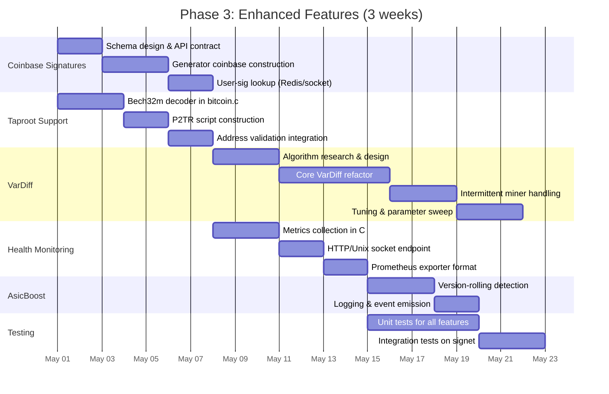
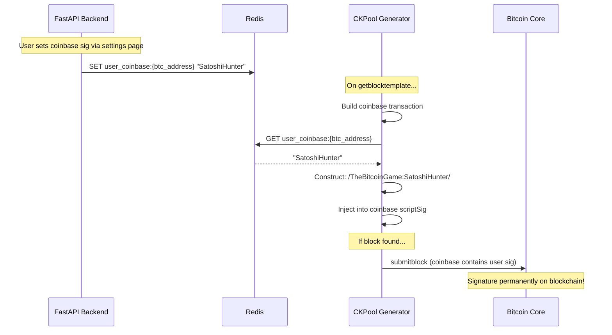
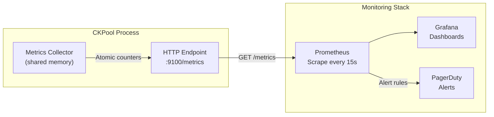

# Phase 3: Enhanced Features

**Duration:** 3 weeks (May 1 -- May 21, 2026)
**Prerequisites:** Phase 2 (Testing Infrastructure) completed
**Branch:** `feature/phase-3-enhanced`

---

## Table of Contents

1. [Overview](#1-overview)
2. [Per-User Coinbase Signatures](#2-per-user-coinbase-signatures)
3. [Taproot (bc1p) Address Support](#3-taproot-bc1p-address-support)
4. [Enhanced VarDiff Algorithm](#4-enhanced-vardiff-algorithm)
5. [Health Monitoring](#5-health-monitoring)
6. [AsicBoost Verification & Logging](#6-asicboost-verification--logging)
7. [Testing](#7-testing)
8. [Deliverables Checklist](#8-deliverables-checklist)

---

## 1. Overview

Phase 3 elevates the ckpool fork from "functional solo pool" to "feature-rich mining platform." Each feature in this phase directly feeds the gamification layer or operational reliability of The Bitcoin Game.



### Timeline



---

## 2. Per-User Coinbase Signatures

### 2.1 Motivation

When a solo miner finds a block, the coinbase transaction is permanently etched into the Bitcoin blockchain. Allowing users to customize their coinbase signature transforms block-finding from a financial event into a **personal, shareable moment** -- a core gamification mechanic.

Example coinbase messages:
- `/TheBitcoinGame:SatoshiHunter/` (user-chosen nickname)
- `/TheBitcoinGame:Block891234:LFG/` (auto-generated with height)
- `/TheBitcoinGame:TeamBitaxe/` (cooperative name)

### 2.2 Constraints

| Constraint | Value | Reason |
|---|---|---|
| Max coinbase script size | 100 bytes (BIP34) | Protocol limit |
| Reserved prefix | `/TheBitcoinGame:` | 17 bytes -- brand attribution |
| Reserved suffix | `/` | 1 byte -- delimiter |
| BIP34 height encoding | 4--9 bytes | Required by consensus |
| Available for user text | ~73 bytes | Depends on height encoding length |
| Allowed characters | `[A-Za-z0-9_\-.:!#]` | Safe ASCII subset, no control chars |

### 2.3 Architecture



### 2.4 Implementation Details

#### generator.c Modifications

```c
/* New: Fetch user-specific coinbase signature */
static char *get_user_coinbase_sig(const ckpool_t *ckp, const char *btc_address)
{
    char *user_sig = NULL;

    /* Query Redis or local cache for user's custom signature */
    if (ckp->events_enabled && btc_address) {
        user_sig = fetch_user_sig_from_cache(ckp, btc_address);
    }

    /* Validate: ASCII-safe subset only */
    if (user_sig && !validate_coinbase_sig(user_sig)) {
        LOGWARNING("Invalid coinbase sig for %s, using default", btc_address);
        free(user_sig);
        user_sig = NULL;
    }

    return user_sig; /* NULL = use default pool sig */
}

/* Modified: coinbase construction in generate_coinbase() */
static void construct_coinbase_sig(char *sig_buf, size_t max_len,
                                   const char *pool_sig,
                                   const char *user_sig)
{
    if (user_sig && strlen(user_sig) > 0) {
        snprintf(sig_buf, max_len, "/%s:%s/", pool_sig, user_sig);
    } else {
        snprintf(sig_buf, max_len, "/%s/", pool_sig);
    }
}
```

#### Signature Lookup Strategy

To avoid blocking the generator process on Redis lookups:

1. **Background cache refresh** -- A dedicated thread periodically syncs user signatures from Redis into a local hash table (every 30s)
2. **Cache-first lookup** -- Generator reads from in-memory hash table (O(1), no I/O)
3. **Fallback** -- If cache miss, use pool default `/TheBitcoinGame/`
4. **Cache invalidation** -- When a user updates their signature via the API, a Redis Pub/Sub message triggers immediate cache refresh

```c
/* Signature cache: thread-safe hash table */
typedef struct user_sig_entry {
    char btc_address[128];
    char coinbase_sig[74];  /* Max user portion */
    time_t last_updated;
    UT_hash_handle hh;
} user_sig_entry_t;

static user_sig_entry_t *sig_cache = NULL;
static pthread_rwlock_t sig_cache_lock = PTHREAD_RWLOCK_INITIALIZER;
```

### 2.5 Event Schema Extension

When a block is found with a custom signature, the `block_found` event includes it:

```json
{
    "event": "block_found",
    "data": {
        "user": "bc1q...",
        "coinbase_sig": "/TheBitcoinGame:SatoshiHunter/",
        "coinbase_sig_custom": true,
        "height": 891234
    }
}
```

### 2.6 Validation Rules

```c
/* Allowed characters in user-supplied coinbase signature */
static bool validate_coinbase_sig(const char *sig)
{
    if (!sig || strlen(sig) == 0 || strlen(sig) > MAX_USER_SIG_LEN)
        return false;

    for (const char *p = sig; *p; p++) {
        if (!isalnum(*p) && *p != '_' && *p != '-' &&
            *p != '.' && *p != ':' && *p != '!' && *p != '#')
            return false;
    }

    /* No profanity filter here -- that's the API layer's job */
    return true;
}
```

---

## 3. Taproot (bc1p) Address Support

### 3.1 Motivation

Taproot (BIP341/BIP350) addresses use bech32m encoding (`bc1p...`) and are increasingly adopted. Many modern wallets default to taproot. Without support, users with taproot-only wallets cannot mine on The Bitcoin Game.

### 3.2 Address Format Comparison

| Type | Prefix | Encoding | Example | Script |
|---|---|---|---|---|
| Legacy (P2PKH) | `1...` | Base58Check | `1A1zP1eP5Q...` | OP_DUP OP_HASH160 ... |
| Nested SegWit (P2SH-P2WPKH) | `3...` | Base58Check | `3J98t1WpEZ...` | OP_HASH160 ... |
| Native SegWit (P2WPKH) | `bc1q...` | Bech32 | `bc1qw508d6q...` | OP_0 <20-byte hash> |
| **Taproot (P2TR)** | **`bc1p...`** | **Bech32m** | **`bc1p5cyxnux...`** | **OP_1 <32-byte key>** |

### 3.3 Implementation in bitcoin.c

#### Bech32m Decoding

The existing `bitcoin.c` in ckpool supports bech32 (for `bc1q` addresses). We extend it with bech32m per BIP350.

```c
/* BIP350: Bech32m uses a different constant than Bech32 */
#define BECH32_CONST  1
#define BECH32M_CONST 0x2bc830a3

/* Determine encoding based on witness version */
static int bech32_expected_encoding(int witness_version)
{
    if (witness_version == 0)
        return BECH32_CONST;   /* v0 = bech32 (P2WPKH, P2WSH) */
    return BECH32M_CONST;      /* v1+ = bech32m (Taproot, future) */
}

/* Validate bech32m checksum */
static bool verify_bech32m_checksum(const char *hrp, const uint8_t *data,
                                     size_t data_len)
{
    uint32_t polymod = bech32_polymod(hrp, data, data_len);
    return polymod == BECH32M_CONST;
}
```

#### P2TR Script Construction

```c
/* Construct P2TR output script from a bc1p address */
static bool address_to_p2tr_script(const char *address,
                                    uint8_t *script, size_t *script_len)
{
    uint8_t witness_program[32];
    int witness_version;
    size_t program_len;

    /* Decode bech32m address */
    if (!bech32m_decode(&witness_version, witness_program, &program_len, address))
        return false;

    /* P2TR: witness version must be 1, program must be 32 bytes */
    if (witness_version != 1 || program_len != 32)
        return false;

    /* Script: OP_1 OP_PUSHBYTES_32 <32-byte-x-only-pubkey> */
    script[0] = 0x51;          /* OP_1 (witness version 1) */
    script[1] = 0x20;          /* OP_PUSHBYTES_32 */
    memcpy(&script[2], witness_program, 32);
    *script_len = 34;

    return true;
}
```

#### Updated Address Validation

```c
/* Extended validate_address() to handle all address types */
bool validate_address(const char *address, bool *is_taproot)
{
    *is_taproot = false;

    /* Legacy P2PKH: starts with '1' */
    if (address[0] == '1')
        return validate_base58check(address, 0x00);

    /* P2SH: starts with '3' */
    if (address[0] == '3')
        return validate_base58check(address, 0x05);

    /* Bech32/Bech32m: starts with 'bc1' */
    if (strncasecmp(address, "bc1", 3) == 0) {
        int witness_version;
        uint8_t program[40];
        size_t program_len;

        /* Try bech32 first (witness v0) */
        if (address[3] == 'q' || address[3] == 'Q') {
            return bech32_decode(&witness_version, program, &program_len, address)
                   && witness_version == 0
                   && (program_len == 20 || program_len == 32);
        }

        /* Bech32m (witness v1 = taproot) */
        if (address[3] == 'p' || address[3] == 'P') {
            bool valid = bech32m_decode(&witness_version, program, &program_len, address)
                         && witness_version == 1
                         && program_len == 32;
            if (valid)
                *is_taproot = true;
            return valid;
        }
    }

    return false;
}
```

### 3.4 Coinbase Output for Taproot Addresses

When a miner authorizes with a `bc1p...` address, the coinbase transaction must pay to a P2TR output instead of P2WPKH. This requires changes in `generator.c` where the coinbase output script is constructed.

```c
/* In generate_coinbase(): select output script based on address type */
if (is_taproot) {
    address_to_p2tr_script(user_address, output_script, &script_len);
} else if (is_segwit) {
    address_to_p2wpkh_script(user_address, output_script, &script_len);
} else {
    address_to_p2pkh_script(user_address, output_script, &script_len);
}
```

---

## 4. Enhanced VarDiff Algorithm

### 4.1 Motivation

The variable difficulty (VarDiff) algorithm adjusts the mining difficulty per client to target a consistent share rate. The stock ckpool VarDiff works well for stable, always-on miners but has shortcomings for The Bitcoin Game's user base:

| Miner Type | Hashrate | Behavior | Stock VarDiff Issue |
|---|---|---|---|
| Bitaxe (USB) | 500 GH/s--1 TH/s | Restarts frequently, WiFi drops | Ramp-up too slow after reconnect |
| NerdAxe / Lucky Miner | 1--5 TH/s | Intermittent, hobbyist schedule | Difficulty oscillates on connect/disconnect |
| Antminer S19 | 100+ TH/s | Stable, 24/7 operation | Ramp-up to optimal diff is slow |
| Whatsminer M50S | 120+ TH/s | Stable, 24/7 operation | Works fine with stock VarDiff |

### 4.2 Algorithm Improvements

#### 4.2.1 Faster Ramp-Up for High-Hashrate Miners

**Problem:** A miner with 100 TH/s at `startdiff: 10000` will submit thousands of shares per second, flooding the system until VarDiff catches up.

**Solution:** Exponential ramp-up with early detection.

```c
/* Enhanced initial difficulty estimation */
static int64_t estimate_initial_diff(double time_for_first_share,
                                      int64_t current_diff)
{
    /* If the first share came in much faster than target, jump aggressively */
    double share_rate = 1.0 / time_for_first_share;
    double target_rate = 1.0 / TARGET_SHARE_INTERVAL;  /* e.g., 1 share/10s */

    if (share_rate > target_rate * 4.0) {
        /* Miner is 4x+ faster than expected: jump difficulty */
        int64_t estimated_diff = current_diff * (share_rate / target_rate);

        /* Cap the jump at 64x current diff per step */
        int64_t max_jump = current_diff * 64;
        return MIN(estimated_diff, max_jump);
    }

    return 0; /* No jump needed */
}
```

#### 4.2.2 Reconnection Memory (Difficulty Persistence)

**Problem:** When a Bitaxe restarts (firmware update, WiFi reconnect, power cycle), it reconnects and starts at `startdiff` again, wasting time ramping back up.

**Solution:** Remember the last known difficulty per worker and restore it on reconnect.

```c
/* Difficulty memory: persisted per worker */
typedef struct worker_diff_memory {
    char worker_name[128];     /* "bc1q...:bitaxe-office" */
    int64_t last_stable_diff;  /* Last difficulty that was stable for >5min */
    time_t last_seen;          /* When we last saw this worker */
    double avg_hashrate;       /* Rolling average hashrate */
    UT_hash_handle hh;
} worker_diff_memory_t;

/* On miner reconnect: restore previous difficulty */
static int64_t get_reconnect_diff(const char *worker_name, int64_t default_diff)
{
    worker_diff_memory_t *entry;

    pthread_rwlock_rdlock(&diff_memory_lock);
    HASH_FIND_STR(diff_memory, worker_name, entry);
    pthread_rwlock_unlock(&diff_memory_lock);

    if (entry) {
        time_t age = time(NULL) - entry->last_seen;

        /* If worker was seen within the last 24h, restore its difficulty */
        if (age < 86400) {
            LOGINFO("Restoring diff %ld for reconnected worker %s (last seen %lds ago)",
                    entry->last_stable_diff, worker_name, age);
            return entry->last_stable_diff;
        }
    }

    return default_diff;
}
```

#### 4.2.3 Smoother Adjustments with Dampening

**Problem:** Stock VarDiff can oscillate when share rates fluctuate naturally (variance in mining is inherent). This causes unnecessary `mining.set_difficulty` messages.

**Solution:** Exponential moving average (EMA) with dampening factor.

```c
/* Smoothed VarDiff calculation */
typedef struct enhanced_vardiff {
    double ema_share_rate;      /* Exponential moving average of share rate */
    double ema_alpha;           /* EMA smoothing factor (0.1 = very smooth) */
    int64_t current_diff;       /* Current assigned difficulty */
    int adjustment_count;       /* Number of adjustments this session */
    time_t last_adjustment;     /* Timestamp of last difficulty change */
    int stable_intervals;       /* Consecutive intervals without adjustment */
} enhanced_vardiff_t;

static int64_t calculate_new_diff(enhanced_vardiff_t *vd, double measured_share_rate)
{
    /* Update EMA */
    vd->ema_share_rate = vd->ema_alpha * measured_share_rate +
                         (1.0 - vd->ema_alpha) * vd->ema_share_rate;

    double target_rate = 1.0 / TARGET_SHARE_INTERVAL;
    double ratio = vd->ema_share_rate / target_rate;

    /* Dead band: don't adjust if within 20% of target */
    if (ratio > 0.8 && ratio < 1.2) {
        vd->stable_intervals++;
        return vd->current_diff; /* No change */
    }

    /* Dampening: reduce adjustment magnitude for stability */
    double dampening = 0.5; /* Apply only 50% of the calculated change */
    double adjustment = 1.0 + (ratio - 1.0) * dampening;

    int64_t new_diff = (int64_t)(vd->current_diff * adjustment);

    /* Enforce minimum adjustment cooldown (30 seconds) */
    if (time(NULL) - vd->last_adjustment < 30)
        return vd->current_diff;

    /* Clamp to configured min/max */
    new_diff = MAX(new_diff, MIN_DIFF);
    new_diff = MIN(new_diff, MAX_DIFF);

    vd->current_diff = new_diff;
    vd->last_adjustment = time(NULL);
    vd->adjustment_count++;

    return new_diff;
}
```

### 4.3 VarDiff Event Extension

```json
{
    "event": "diff_updated",
    "data": {
        "user": "bc1q...",
        "worker": "bitaxe-living-room",
        "old_diff": 512,
        "new_diff": 2048,
        "reason": "fast_ramp",
        "ema_share_rate": 3.2,
        "target_share_rate": 0.1,
        "reconnect_restored": false,
        "session_adjustments": 3
    }
}
```

### 4.4 Configuration Parameters

```json
{
    "vardiff": {
        "target_share_interval": 10,
        "retarget_interval": 30,
        "ema_alpha": 0.3,
        "dampening": 0.5,
        "dead_band_percent": 20,
        "fast_ramp_threshold": 4.0,
        "fast_ramp_max_jump": 64,
        "reconnect_memory_ttl": 86400,
        "min_adjustment_interval": 30
    }
}
```

---

## 5. Health Monitoring

### 5.1 Motivation

Production observability is non-negotiable. ckpool currently logs to files, but we need machine-readable metrics for Prometheus/Grafana dashboards, alerting, and capacity planning.

### 5.2 Metrics Catalog

| Metric | Type | Description | Labels |
|---|---|---|---|
| `ckpool_connected_miners` | Gauge | Current connected miner count | `region` |
| `ckpool_shares_total` | Counter | Total shares submitted | `valid`, `region` |
| `ckpool_shares_rate` | Gauge | Shares per second (1m rolling) | `region` |
| `ckpool_hashrate_total` | Gauge | Total pool hashrate (TH/s) | `region` |
| `ckpool_blocks_found_total` | Counter | Blocks found since startup | `region` |
| `ckpool_stale_shares_total` | Counter | Stale/rejected shares | `reason` |
| `ckpool_uptime_seconds` | Gauge | Process uptime | -- |
| `ckpool_memory_bytes` | Gauge | RSS memory usage | `process` |
| `ckpool_bitcoin_height` | Gauge | Latest known block height | -- |
| `ckpool_bitcoin_connected` | Gauge | Bitcoin Core RPC reachable (0/1) | -- |
| `ckpool_event_queue_depth` | Gauge | Pending events in emission queue | -- |
| `ckpool_event_emit_latency_us` | Histogram | Event emission latency | `event_type` |
| `ckpool_vardiff_adjustments_total` | Counter | VarDiff adjustments made | `direction` |
| `ckpool_connection_errors_total` | Counter | Failed connection attempts | `reason` |
| `ckpool_asicboost_miners` | Gauge | Miners using version rolling | -- |

### 5.3 Architecture



### 5.4 Implementation

We implement a lightweight HTTP endpoint directly in ckpool, running on a dedicated thread. This avoids external dependencies and keeps the metrics path fast.

```c
/* metrics.c -- Lightweight Prometheus metrics endpoint */

#include <sys/socket.h>
#include <netinet/in.h>

typedef struct ckpool_metrics {
    /* Counters (only increment) */
    _Atomic uint64_t shares_valid;
    _Atomic uint64_t shares_invalid;
    _Atomic uint64_t shares_stale;
    _Atomic uint64_t blocks_found;
    _Atomic uint64_t vardiff_adjustments_up;
    _Atomic uint64_t vardiff_adjustments_down;
    _Atomic uint64_t connection_errors;
    _Atomic uint64_t asicboost_sessions;

    /* Gauges (can go up or down) */
    _Atomic int64_t connected_miners;
    _Atomic int64_t event_queue_depth;
    _Atomic int64_t bitcoin_height;
    _Atomic int32_t bitcoin_connected;

    /* Derived (calculated on scrape) */
    time_t start_time;
} ckpool_metrics_t;

static ckpool_metrics_t g_metrics;

/* Format metrics in Prometheus exposition format */
static int format_metrics(char *buf, size_t buflen)
{
    int written = 0;
    time_t uptime = time(NULL) - g_metrics.start_time;

    written += snprintf(buf + written, buflen - written,
        "# HELP ckpool_uptime_seconds Time since process start\n"
        "# TYPE ckpool_uptime_seconds gauge\n"
        "ckpool_uptime_seconds %ld\n\n"
        "# HELP ckpool_connected_miners Current connected miners\n"
        "# TYPE ckpool_connected_miners gauge\n"
        "ckpool_connected_miners %ld\n\n"
        "# HELP ckpool_shares_total Total shares submitted\n"
        "# TYPE ckpool_shares_total counter\n"
        "ckpool_shares_total{valid=\"true\"} %lu\n"
        "ckpool_shares_total{valid=\"false\"} %lu\n\n"
        "# HELP ckpool_blocks_found_total Blocks found\n"
        "# TYPE ckpool_blocks_found_total counter\n"
        "ckpool_blocks_found_total %lu\n\n",
        uptime,
        atomic_load(&g_metrics.connected_miners),
        atomic_load(&g_metrics.shares_valid),
        atomic_load(&g_metrics.shares_invalid),
        atomic_load(&g_metrics.blocks_found));

    /* ... additional metrics ... */

    return written;
}

/* HTTP handler thread */
static void *metrics_thread(void *arg)
{
    int server_fd = socket(AF_INET, SOCK_STREAM, 0);
    /* Bind to :9100, accept connections, serve /metrics */
    /* ... */
    return NULL;
}
```

### 5.5 Alternative: Unix Socket Metrics

For environments where an HTTP port is undesirable (e.g., locked-down firewall), metrics can also be served via a Unix domain socket. A sidecar `ckpool-exporter` process reads the socket and exposes HTTP for Prometheus.

```
# Scrape via Unix socket
curl --unix-socket /tmp/ckpool/metrics.sock http://localhost/metrics
```

### 5.6 Grafana Dashboard Panels

| Panel | Visualization | Query |
|---|---|---|
| Connected Miners | Stat + Sparkline | `ckpool_connected_miners` |
| Pool Hashrate | Time series (TH/s) | `ckpool_hashrate_total` |
| Share Rate | Time series (shares/s) | `rate(ckpool_shares_total[5m])` |
| Invalid Share % | Gauge (0--100%) | `rate(ckpool_shares_total{valid="false"}[5m]) / rate(ckpool_shares_total[5m])` |
| Blocks Found | Counter | `ckpool_blocks_found_total` |
| Event Latency | Heatmap | `ckpool_event_emit_latency_us` |
| Uptime | Stat | `ckpool_uptime_seconds` |
| Bitcoin Core Status | Status light | `ckpool_bitcoin_connected` |

---

## 6. AsicBoost Verification & Logging

### 6.1 Background

AsicBoost is a mining optimization that reduces energy consumption by ~15--20% by manipulating the Bitcoin block header's version field. **Version rolling** (overt AsicBoost) is the legitimate, on-chain implementation supported via BIP310.

ckpool already supports `mining.configure` with `version-rolling` via the `version_mask` config. Phase 3 adds **verification and logging** to:

1. Detect which miners are using version rolling
2. Log version-rolling patterns for analytics
3. Emit events for the gamification layer (e.g., "Efficient Miner" badge)

### 6.2 Implementation

```c
/* In stratifier.c: share validation */
static void check_asicboost(stratum_instance_t *client,
                             uint32_t submitted_version,
                             uint32_t job_version)
{
    uint32_t version_bits = submitted_version ^ job_version;
    uint32_t mask = client->version_mask;

    /* Check if version bits were rolled within the allowed mask */
    if (version_bits != 0 && (version_bits & ~mask) == 0) {
        /* Legitimate version rolling (overt AsicBoost) */
        client->asicboost_active = true;
        client->asicboost_rolls++;

        if (!client->asicboost_logged) {
            LOGINFO("AsicBoost detected for %s:%s (mask: 0x%08x)",
                    client->user_instance->username,
                    client->workername, mask);
            client->asicboost_logged = true;

            /* Emit event for gamification */
            emit_asicboost_event(client, version_bits);
        }
    } else if (version_bits != 0 && (version_bits & ~mask) != 0) {
        /* Version bits modified OUTSIDE allowed mask -- suspicious */
        LOGWARNING("Invalid version rolling for %s:%s "
                   "(submitted: 0x%08x, job: 0x%08x, mask: 0x%08x)",
                   client->user_instance->username,
                   client->workername,
                   submitted_version, job_version, mask);
    }
}
```

### 6.3 AsicBoost Event

```json
{
    "event": "asicboost_detected",
    "data": {
        "user": "bc1q...",
        "worker": "antminer-s19-rack3",
        "version_mask": "0x1fffe000",
        "version_bits_rolled": "0x04000000",
        "first_detection": true
    }
}
```

---

## 7. Testing

### 7.1 Unit Tests

| Test Suite | File | Coverage |
|---|---|---|
| Bech32m decoding | `test_bech32m.c` | Valid bc1p addresses, invalid checksums, wrong witness version, edge cases |
| P2TR script construction | `test_p2tr.c` | Script bytes verification against known test vectors (BIP341) |
| Address validation (all types) | `test_address.c` | Legacy, P2SH, P2WPKH, P2TR, invalid addresses, testnet/signet addresses |
| Coinbase signature validation | `test_coinbase_sig.c` | Length limits, allowed characters, injection attempts, empty string |
| Coinbase construction | `test_coinbase.c` | Default sig, custom sig, oversized sig truncation, multi-byte UTF8 rejection |
| VarDiff EMA calculation | `test_vardiff.c` | Ramp-up, dampening, dead band, min/max clamping, reconnect memory |
| Metrics formatting | `test_metrics.c` | Prometheus format compliance, counter monotonicity, gauge accuracy |
| AsicBoost detection | `test_asicboost.c` | Valid rolling, invalid mask, no rolling, edge cases |

### 7.2 Integration Tests

```bash
# Signet integration test suite
./tests/integration/run_phase3_tests.sh

# Test 1: Taproot address mining
# Connect with bc1p address, submit shares, verify coinbase output
python3 tests/integration/test_taproot_mining.py --signet

# Test 2: Custom coinbase signature
# Set user sig in Redis, mine block, verify sig in coinbase
python3 tests/integration/test_coinbase_sig.py --signet

# Test 3: VarDiff ramp-up
# Simulate high-hashrate miner, verify fast ramp-up behavior
python3 tests/integration/test_vardiff_rampup.py --signet

# Test 4: VarDiff reconnect memory
# Connect, disconnect, reconnect -- verify difficulty restored
python3 tests/integration/test_vardiff_reconnect.py --signet

# Test 5: Metrics endpoint
# Scrape /metrics, verify Prometheus format, check counter values
python3 tests/integration/test_health_metrics.py

# Test 6: AsicBoost logging
# Send shares with version rolling, verify event emission
python3 tests/integration/test_asicboost.py --signet
```

### 7.3 Performance Tests

| Test | Target | Method |
|---|---|---|
| VarDiff ramp-up time (100 TH/s miner) | < 60 seconds to optimal diff | Simulated miner, measure time to stable diff |
| Metrics endpoint latency | < 5ms per scrape | `wrk -t4 -c10 -d30s http://localhost:9100/metrics` |
| Coinbase sig cache lookup | < 1us | Microbenchmark with 10,000 cached entries |
| Bech32m decode | < 10us per address | Microbenchmark, 1M iterations |

---

## 8. Deliverables Checklist

### Week 1 (May 1--7)

- [ ] Bech32m decoder implemented in `bitcoin.c`
- [ ] P2TR (taproot) script construction implemented
- [ ] Address validation extended for `bc1p` addresses
- [ ] Unit tests for all address types passing (including BIP341 test vectors)
- [ ] Coinbase signature schema designed and API contract agreed with backend team
- [ ] User signature cache (hash table + rwlock) implemented in generator
- [ ] Coinbase construction modified to support per-user signatures
- [ ] Coinbase signature validation function implemented

### Week 2 (May 8--14)

- [ ] Enhanced VarDiff: EMA-based calculation with dampening
- [ ] Enhanced VarDiff: fast ramp-up for high-hashrate miners
- [ ] Enhanced VarDiff: reconnect memory (difficulty persistence per worker)
- [ ] VarDiff configuration parameters exposed in ckpool.conf
- [ ] Metrics collection infrastructure (`ckpool_metrics_t` with atomic counters)
- [ ] HTTP metrics endpoint on dedicated thread (`:9100/metrics`)
- [ ] Prometheus exposition format compliance verified
- [ ] Unix socket metrics alternative implemented

### Week 3 (May 15--21)

- [ ] AsicBoost version-rolling detection and logging
- [ ] AsicBoost event emission
- [ ] All unit tests passing (8 test suites)
- [ ] All integration tests passing on signet
- [ ] Performance benchmarks meeting targets
- [ ] VarDiff parameter tuning completed (signet simulation with mixed miner profiles)
- [ ] Grafana dashboard JSON exported and committed
- [ ] Documentation updated: event schema additions, new config parameters, metrics catalog
- [ ] Code review completed
- [ ] Merged to `develop` branch

---

*Phase 3 depends on: Phase 2 (Testing Infrastructure) for test harness and signet environment.*
*Phase 4 (Multi-Instance) depends on: Phase 3 for health monitoring endpoints.*
