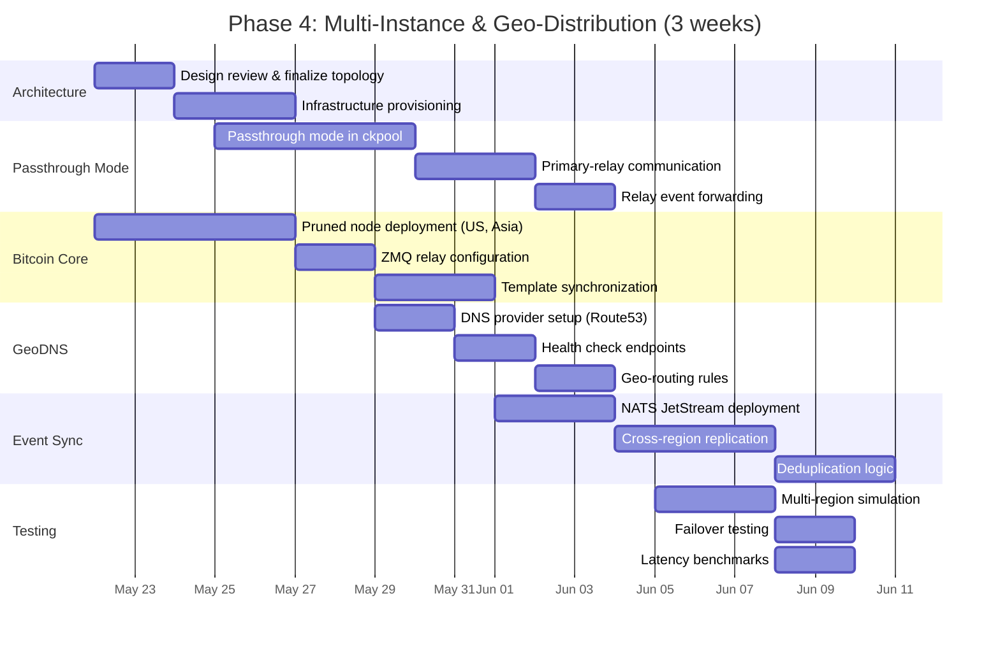
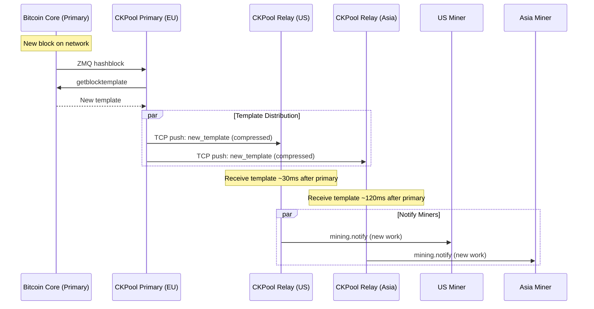
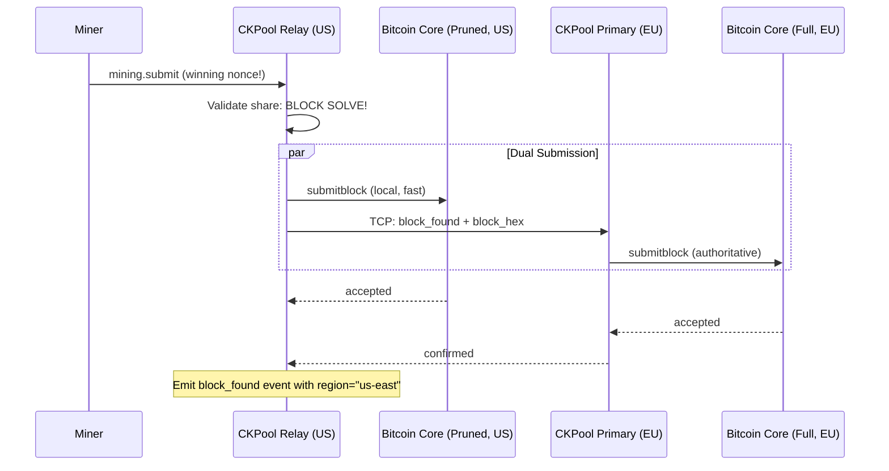
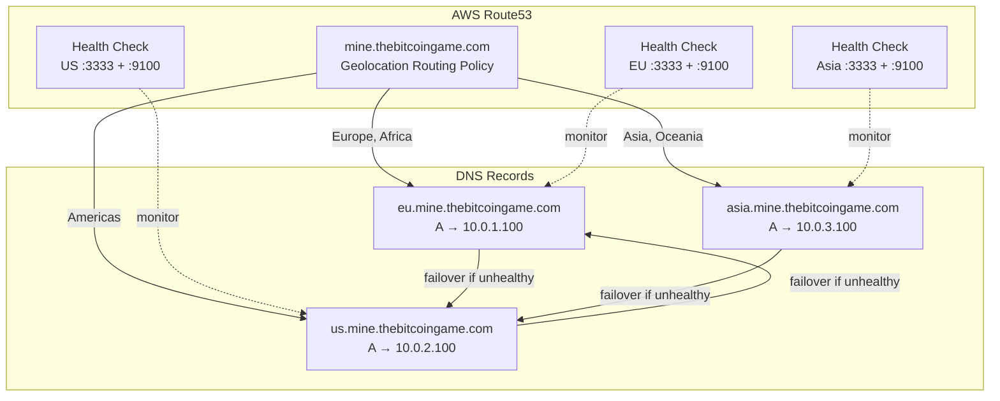
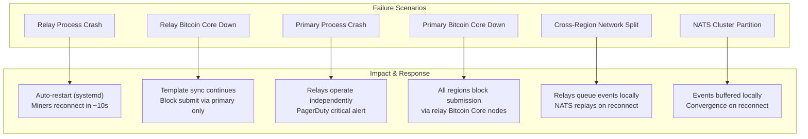

# Phase 4: Multi-Instance & Geo-Distribution

**Duration:** 3 weeks (May 22 -- June 11, 2026)
**Prerequisites:** Phase 3 (Enhanced Features) completed -- health monitoring required
**Branch:** `feature/phase-4-multi-instance`

---

## Table of Contents

1. [Overview](#1-overview)
2. [Multi-Region Architecture](#2-multi-region-architecture)
3. [CKPool Passthrough Mode](#3-ckpool-passthrough-mode)
4. [Bitcoin Core Relay Nodes](#4-bitcoin-core-relay-nodes)
5. [GeoDNS Configuration](#5-geodns-configuration)
6. [Cross-Region Event Synchronization](#6-cross-region-event-synchronization)
7. [Failover Strategy](#7-failover-strategy)
8. [Network Latency Optimization](#8-network-latency-optimization)
9. [Testing](#9-testing)
10. [Deliverables Checklist](#10-deliverables-checklist)

---

## 1. Overview

Solo mining is a global activity. A miner in Tokyo connecting to a server in Frankfurt adds ~250ms of round-trip latency, which means:

- Delayed work updates after new blocks (increased stale share rate)
- Slower share submission acknowledgment
- Higher chance of orphaned blocks if the miner solves a block

Phase 4 deploys ckpool relay instances in three geographic regions, routing miners to their nearest instance via GeoDNS. All events converge on the primary instance for unified processing by the game engine.

### Timeline



---

## 2. Multi-Region Architecture

### 2.1 Region Topology

```mermaid
graph TB
    subgraph Internet["Global Miners"]
        EU_M["European Miners<br/>(~40% of users)"]
        US_M["Americas Miners<br/>(~35% of users)"]
        AS_M["Asia-Pacific Miners<br/>(~25% of users)"]
    end

    subgraph DNS["GeoDNS Layer"]
        GEO["mine.thebitcoingame.com<br/>AWS Route53 Geo-routing"]
    end

    subgraph EU["EU-Central (Frankfurt) — PRIMARY"]
        direction TB
        CKP_EU["CKPool Primary<br/>:3333 Stratum<br/>:9100 Metrics"]
        BTC_EU["Bitcoin Core<br/>Full Archival<br/>~600GB"]
        NATS_EU["NATS JetStream<br/>Event Hub"]
        PIPE_EU["Event Pipeline<br/>Redis + TimescaleDB"]
        API_EU["FastAPI + Game Engine"]
    end

    subgraph US["US-East (Virginia) — RELAY"]
        direction TB
        CKP_US["CKPool Relay<br/>:3333 Stratum<br/>:9100 Metrics"]
        BTC_US["Bitcoin Core<br/>Pruned (~10GB)"]
        NATS_US["NATS Leaf Node"]
    end

    subgraph ASIA["Asia (Tokyo) — RELAY"]
        direction TB
        CKP_ASIA["CKPool Relay<br/>:3333 Stratum<br/>:9100 Metrics"]
        BTC_ASIA["Bitcoin Core<br/>Pruned (~10GB)"]
        NATS_ASIA["NATS Leaf Node"]
    end

    EU_M --> GEO
    US_M --> GEO
    AS_M --> GEO

    GEO -->|"EU miners"| CKP_EU
    GEO -->|"US miners"| CKP_US
    GEO -->|"Asia miners"| CKP_ASIA

    CKP_EU <--> BTC_EU
    CKP_US <--> BTC_US
    CKP_ASIA <--> BTC_ASIA

    CKP_EU --> NATS_EU
    CKP_US --> NATS_US
    CKP_ASIA --> NATS_ASIA

    NATS_US -.->|"Replicate events"| NATS_EU
    NATS_ASIA -.->|"Replicate events"| NATS_EU

    NATS_EU --> PIPE_EU
    PIPE_EU --> API_EU

    CKP_US -.->|"Block found<br/>(TCP relay)"| CKP_EU
    CKP_ASIA -.->|"Block found<br/>(TCP relay)"| CKP_EU

    style EU fill:#1a3a1a,stroke:#3fb950
    style US fill:#1a2a3a,stroke:#58a6ff
    style ASIA fill:#3a2a1a,stroke:#d4a843
```



### 2.2 Region Specifications

| Property | EU-Central (Primary) | US-East (Relay) | Asia (Relay) |
|---|---|---|---|
| **Provider** | Hetzner / OVH | AWS / Vultr | AWS Tokyo / Linode |
| **ckpool mode** | Full (generator + stratifier) | Passthrough | Passthrough |
| **Bitcoin Core** | Full archival (~600GB) | Pruned (~10GB) | Pruned (~10GB) |
| **Event pipeline** | Full (Redis + TimescaleDB + API) | NATS leaf node only | NATS leaf node only |
| **Stratum port** | :3333 | :3333 | :3333 |
| **Metrics port** | :9100 | :9100 | :9100 |
| **Estimated latency to miners** | <30ms (EU) | <30ms (Americas) | <50ms (Asia-Pacific) |
| **vCPU / RAM** | 8 vCPU / 32GB | 4 vCPU / 16GB | 4 vCPU / 16GB |
| **Storage** | 1TB NVMe | 100GB SSD | 100GB SSD |

---

## 3. CKPool Passthrough Mode

### 3.1 Concept

In passthrough mode, a ckpool relay instance handles the Stratum TCP connections from miners locally (fast) but delegates critical operations to the primary:

| Operation | Where It Runs | Why |
|---|---|---|
| TCP connection accept | Relay (local) | Minimize miner latency |
| Stratum JSON-RPC parsing | Relay (local) | Minimize miner latency |
| `mining.subscribe` response | Relay (local) | Extranonce assigned locally |
| `mining.authorize` | Relay (local, validated against local Bitcoin Core) | Fast address validation |
| `mining.notify` (new work) | Relay (synced from primary via template push) | Single source of truth for templates |
| Share validation | Relay (local) | Fast accept/reject response |
| VarDiff | Relay (local) | Per-connection, no cross-region dependency |
| Block template generation | **Primary only** | Single getblocktemplate source |
| Block submission | **Primary** (with relay fallback) | Ensure fastest submission |
| Event emission | Relay (local) → NATS → Primary | Events generated locally, replicated |

### 3.2 Template Synchronization

The primary generates block templates from its full Bitcoin Core node and pushes them to all relays. This ensures all miners across all regions work on the same block template.



### 3.3 Implementation

#### Relay Configuration

```json
{
    "mode": "passthrough",
    "primary": {
        "host": "primary.internal.thebitcoingame.com",
        "port": 8880,
        "auth_token": "relay-shared-secret",
        "template_push_port": 8881,
        "reconnect_interval": 5
    },
    "btcd": [{
        "url": "127.0.0.1:8332",
        "auth": "rpcuser",
        "pass": "rpcpassword",
        "notify": true
    }],
    "region": "us-east",
    "serverurl": ["0.0.0.0:3333"],
    "events": {
        "enabled": true,
        "socket_path": "/tmp/ckpool/events.sock",
        "nats_url": "nats://nats.internal:4222",
        "nats_subject": "mining.events.us-east"
    }
}
```

#### Passthrough Process Architecture

```c
/* In passthrough mode, the generator does NOT call getblocktemplate.
 * Instead, it receives templates from the primary over a persistent TCP
 * connection. */

typedef struct relay_connection {
    int fd;                     /* TCP socket to primary */
    char *primary_host;
    int primary_port;
    char *auth_token;
    bool connected;
    time_t last_template;
    pthread_t recv_thread;      /* Background thread receiving templates */
} relay_connection_t;

/* Receive template from primary (background thread) */
static void *relay_template_receiver(void *arg)
{
    relay_connection_t *relay = (relay_connection_t *)arg;

    while (keeprunning) {
        if (!relay->connected) {
            relay_reconnect(relay);
            sleep(relay->reconnect_interval);
            continue;
        }

        char *template_json = relay_recv_message(relay);
        if (template_json) {
            /* Parse and apply as if it came from local Bitcoin Core */
            apply_workbase_from_template(template_json);
            relay->last_template = time(NULL);
            free(template_json);
        }
    }
    return NULL;
}
```

### 3.4 Block Submission Path

When a relay detects a block solve, it must submit as fast as possible. The relay attempts **dual submission** -- to both its local pruned Bitcoin Core and the primary's full node.



---

## 4. Bitcoin Core Relay Nodes

### 4.1 Pruned Node Configuration

Relay regions run pruned Bitcoin Core nodes. These are sufficient for:
- Address validation (`validateaddress`)
- Block submission (`submitblock`) -- the node relays to the network
- New block notifications (ZMQ `hashblock`)
- Health checks (`getblockchaininfo`)

They are NOT sufficient for:
- `getblocktemplate` -- requires full UTXO set (templates come from primary)
- Historical block data queries

```ini
# bitcoin.conf (relay -- pruned mode)
server=1
prune=10000            # Keep ~10GB of recent blocks
txindex=0              # No transaction index needed

rpcuser=ckpool_relay
rpcpassword=<strong-random>
rpcallowip=127.0.0.1

zmqpubhashblock=tcp://127.0.0.1:28332

# Performance tuning
dbcache=2048           # 2GB database cache
maxconnections=40      # Enough peers for block propagation
blocksonly=0           # Need mempool for submitblock relay

# Network
listen=1
maxuploadtarget=5000   # 5GB/day upload limit
```

### 4.2 Full Archival Node (Primary)

```ini
# bitcoin.conf (primary -- full archival)
server=1
txindex=1              # Full transaction index
prune=0                # No pruning -- full archival

rpcuser=ckpool_primary
rpcpassword=<strong-random>
rpcallowip=127.0.0.1

zmqpubhashblock=tcp://127.0.0.1:28332
zmqpubrawtx=tcp://127.0.0.1:28333

# Performance tuning
dbcache=8192           # 8GB database cache
maxconnections=125     # Standard full node
par=4                  # 4 script verification threads
rpcthreads=8           # Handle concurrent RPC from ckpool

# Network
listen=1
```

### 4.3 Storage Comparison

| Component | Primary (Full) | Relay (Pruned) |
|---|---|---|
| Blockchain data | ~600GB (growing) | ~10GB (fixed) |
| UTXO set | ~8GB | ~8GB |
| Transaction index | ~35GB | N/A |
| Total disk | ~650GB | ~20GB |
| Initial sync time | ~24--48 hours | ~6--12 hours |

---

## 5. GeoDNS Configuration

### 5.1 DNS Architecture



### 5.2 Route53 Configuration

```yaml
# Terraform / IaC configuration
resource "aws_route53_record" "mine_geo_eu" {
  zone_id = aws_route53_zone.thebitcoingame.zone_id
  name    = "mine.thebitcoingame.com"
  type    = "A"
  ttl     = 30  # Low TTL for fast failover

  geolocation_routing_policy {
    continent = "EU"  # Europe
  }

  set_identifier  = "eu"
  health_check_id = aws_route53_health_check.eu.id

  records = ["<EU_IP>"]
}

resource "aws_route53_record" "mine_geo_us" {
  zone_id = aws_route53_zone.thebitcoingame.zone_id
  name    = "mine.thebitcoingame.com"
  type    = "A"
  ttl     = 30

  geolocation_routing_policy {
    continent = "NA"  # North America
  }

  set_identifier  = "us"
  health_check_id = aws_route53_health_check.us.id

  records = ["<US_IP>"]
}

resource "aws_route53_record" "mine_geo_asia" {
  zone_id = aws_route53_zone.thebitcoingame.zone_id
  name    = "mine.thebitcoingame.com"
  type    = "A"
  ttl     = 30

  geolocation_routing_policy {
    continent = "AS"  # Asia
  }

  set_identifier  = "asia"
  health_check_id = aws_route53_health_check.asia.id

  records = ["<ASIA_IP>"]
}

# Default: route to EU (primary) if geo-location unknown
resource "aws_route53_record" "mine_geo_default" {
  zone_id = aws_route53_zone.thebitcoingame.zone_id
  name    = "mine.thebitcoingame.com"
  type    = "A"
  ttl     = 30

  geolocation_routing_policy {
    country = "*"  # Default
  }

  set_identifier = "default"
  records        = ["<EU_IP>"]
}
```

### 5.3 Health Check Configuration

Route53 health checks verify that both the Stratum port and the metrics endpoint are responsive:

| Check | Target | Interval | Failure Threshold | Failover |
|---|---|---|---|---|
| Stratum TCP | `:3333` TCP connect | 10s | 3 failures (30s) | Route to next-nearest region |
| Metrics HTTP | `:9100/metrics` HTTP 200 | 10s | 3 failures (30s) | Route to next-nearest region |

### 5.4 Direct Region Endpoints

For advanced users who want to pin to a specific region:

| Endpoint | Region | Use Case |
|---|---|---|
| `mine.thebitcoingame.com` | Auto (GeoDNS) | Default for all users |
| `eu.mine.thebitcoingame.com` | EU-Central | Force EU connection |
| `us.mine.thebitcoingame.com` | US-East | Force US connection |
| `asia.mine.thebitcoingame.com` | Asia | Force Asia connection |

---

## 6. Cross-Region Event Synchronization

### 6.1 Why NATS JetStream

The event pipeline must converge all regional events to the primary for unified processing. Requirements:

| Requirement | Solution |
|---|---|
| At-least-once delivery | NATS JetStream with acknowledgments |
| Cross-datacenter replication | NATS leaf nodes with automatic reconnect |
| Low latency | NATS kernel-bypass networking, <5ms intra-DC |
| Ordering guarantee | Per-subject ordering in JetStream |
| Deduplication | Message ID-based dedup window |
| Backpressure | Stream limits + consumer flow control |

### 6.2 NATS Topology

```mermaid
graph TB
    subgraph EU["EU-Central (Primary)"]
        NATS_HUB["NATS Server (Hub)<br/>JetStream enabled<br/>:4222"]
        STREAM["JetStream Stream:<br/>MINING_EVENTS<br/>Retention: WorkQueue<br/>MaxAge: 24h"]
        CON_PIPE["Consumer: event-pipeline<br/>Durable, AckExplicit"]
        CON_GAME["Consumer: game-engine<br/>Durable, AckExplicit"]
    end

    subgraph US["US-East (Relay)"]
        NATS_US["NATS Server (Leaf)<br/>:4222"]
        PUB_US["Publisher:<br/>ckpool-relay-us"]
    end

    subgraph ASIA["Asia (Relay)"]
        NATS_ASIA["NATS Server (Leaf)<br/>:4222"]
        PUB_ASIA["Publisher:<br/>ckpool-relay-asia"]
    end

    subgraph LOCAL_EU["EU Events"]
        PUB_EU["Publisher:<br/>ckpool-primary-eu"]
    end

    PUB_EU -->|"mining.events.eu"| NATS_HUB
    PUB_US -->|"mining.events.us"| NATS_US
    PUB_ASIA -->|"mining.events.asia"| NATS_ASIA

    NATS_US -.->|"Leaf connection<br/>(TLS, auto-reconnect)"| NATS_HUB
    NATS_ASIA -.->|"Leaf connection<br/>(TLS, auto-reconnect)"| NATS_HUB

    NATS_HUB --> STREAM
    STREAM --> CON_PIPE
    STREAM --> CON_GAME

    style EU fill:#1a3a1a,stroke:#3fb950
    style US fill:#1a2a3a,stroke:#58a6ff
    style ASIA fill:#3a2a1a,stroke:#d4a843
```



### 6.3 NATS Configuration

#### Hub Server (EU Primary)

```conf
# nats-server.conf (EU Hub)
server_name: tbg-nats-eu
listen: 0.0.0.0:4222

jetstream {
    store_dir: /data/nats/jetstream
    max_mem: 2GB
    max_file: 50GB
}

# Leaf node connections from relays
leafnodes {
    listen: 0.0.0.0:7422
    tls {
        cert_file: /etc/nats/certs/server.crt
        key_file: /etc/nats/certs/server.key
        ca_file: /etc/nats/certs/ca.crt
    }
    authorization {
        token: "<relay-auth-token>"
    }
}

# Cluster (for EU high-availability, optional)
# cluster { ... }
```

#### Leaf Server (Relay)

```conf
# nats-server.conf (US Relay)
server_name: tbg-nats-us
listen: 127.0.0.1:4222

leafnodes {
    remotes [
        {
            url: "tls://nats-hub.internal.thebitcoingame.com:7422"
            credentials: "/etc/nats/relay.creds"
            tls {
                ca_file: /etc/nats/certs/ca.crt
            }
        }
    ]
}
```

### 6.4 Stream & Subject Design

```
# Subject hierarchy
mining.events.{region}.{event_type}

# Examples:
mining.events.eu.share_submitted
mining.events.us.block_found
mining.events.asia.miner_connected
mining.events.*.share_submitted     # All regions, share events
mining.events.>                     # All events, all regions
```

#### JetStream Stream Definition

```bash
nats stream add MINING_EVENTS \
    --subjects "mining.events.>" \
    --storage file \
    --retention work \
    --max-age 24h \
    --max-bytes 10GB \
    --discard old \
    --dupe-window 2m \
    --replicas 1
```

### 6.5 Event Deduplication

Each event includes a unique `event_id` (UUID v7 for time-ordering). NATS JetStream deduplicates within a 2-minute window. The event collector also maintains a Bloom filter for longer-window dedup.

```json
{
    "event_id": "0190a3b4-7c8d-7000-b123-456789abcdef",
    "event": "share_submitted",
    "region": "us-east",
    "timestamp": 1716556800000000,
    "data": { ... }
}
```

### 6.6 Event Pipeline Integration

```python
# event_collector.py -- NATS consumer
import nats
from nats.js import JetStreamContext

async def consume_events(js: JetStreamContext):
    """Consume events from all regions via JetStream."""

    sub = await js.subscribe(
        "mining.events.>",
        durable="event-pipeline",
        deliver_policy=nats.js.api.DeliverPolicy.ALL,
        ack_policy=nats.js.api.AckPolicy.EXPLICIT,
    )

    async for msg in sub.messages:
        event = json.loads(msg.data)

        # Dedup check (Bloom filter + Redis SET)
        if await is_duplicate(event["event_id"]):
            await msg.ack()
            continue

        # Process event
        await process_event(event)

        # Persist to TimescaleDB + publish to Redis Streams
        await persist_event(event)
        await publish_realtime(event)

        await msg.ack()
```

---

## 7. Failover Strategy

### 7.1 Failure Scenarios



### 7.2 Relay Independent Operation

When a relay loses contact with the primary, it transitions to **independent mode**:

1. **Template generation**: Relay's local Bitcoin Core (even pruned) can generate templates via `getblocktemplate` -- it has a full UTXO set in memory. Template quality may be slightly lower (smaller mempool), but mining continues.
2. **Block submission**: Relay submits to local Bitcoin Core, which relays to the network.
3. **Event buffering**: NATS leaf node queues events locally until hub reconnects.
4. **Miner impact**: Zero downtime for miners. They may see slightly different block templates.

```c
/* Relay failover logic in generator.c */
static void check_primary_connection(relay_connection_t *relay)
{
    if (!relay->connected) {
        time_t disconnected_for = time(NULL) - relay->last_connected;

        if (disconnected_for > FAILOVER_THRESHOLD_SECONDS) {
            LOGWARNING("Primary unreachable for %lds, switching to independent mode",
                       disconnected_for);
            relay->independent_mode = true;
            /* Start local getblocktemplate polling */
            start_local_template_generation();
        }
    } else if (relay->independent_mode) {
        LOGNOTICE("Primary reconnected, switching back to passthrough mode");
        relay->independent_mode = false;
        stop_local_template_generation();
    }
}
```

### 7.3 Failover Timeline

| Time | Event | System State |
|---|---|---|
| T+0s | Primary ckpool crashes | Relays continue serving miners |
| T+5s | NATS leaf detects disconnection | Events buffered locally |
| T+10s | Relay health check detects primary down | Independent mode activated |
| T+10s | systemd restarts primary ckpool | Primary recovering |
| T+15s | Primary ckpool back online | Templates resume |
| T+20s | NATS reconnects | Buffered events replay |
| T+30s | Full normal operation | All events converged |
| T+30s | Route53 health check passes | DNS routing normalized |

### 7.4 PagerDuty Alert Mapping

| Alert | Severity | Condition | Response |
|---|---|---|---|
| Relay process down | Warning | Relay health check fails | Auto-restart + on-call notification |
| Primary process down | Critical | Primary health check fails | Immediate page, manual intervention |
| Cross-region split (>5min) | Critical | NATS leaf disconnected | Verify network, check ISP |
| Event replication lag (>30s) | Warning | NATS consumer lag metric | Investigate bottleneck |
| Template sync delay (>500ms) | Warning | Template push latency metric | Check inter-region bandwidth |

---

## 8. Network Latency Optimization

### 8.1 Latency Budget

The critical path for share submission:

```
Miner → [internet] → Relay → [validate share] → Response → [internet] → Miner
```

| Segment | Budget | Optimization |
|---|---|---|
| Internet (miner to relay) | <30ms (same continent) | GeoDNS routing |
| TCP + TLS handshake | 0ms (persistent connection) | Already persistent |
| Stratum JSON parse | <0.1ms | Efficient C parser |
| Share validation (hash check) | <0.1ms | SHA256 hardware acceleration |
| Response serialization | <0.1ms | Pre-allocated buffers |
| Internet (relay to miner) | <30ms (same continent) | GeoDNS routing |
| **Total round-trip** | **<62ms** | |

### 8.2 Stale Share Mitigation

Stale shares occur when a miner submits work for a block that has already been found on the network. The primary concern is the time between a new block appearing and the miner receiving updated work.

```
New block on network
  → Bitcoin Core detects (ZMQ)          ~0-2s (depends on propagation)
  → Primary generates new template       ~50ms
  → Template pushed to relays            ~30-120ms (cross-region)
  → Relay sends mining.notify            ~1ms
  → Miner receives new work              ~30ms
  Total: ~100ms-2.2s
```

**Optimization**: Relays also subscribe to their local Bitcoin Core's ZMQ. If the relay's local node sees a new block BEFORE the primary pushes a template, the relay can proactively notify miners to stop working on the old block (send a `mining.notify` with `clean_jobs=true`) before the new template arrives.

```c
/* In relay generator: local ZMQ new-block handler */
static void relay_on_local_new_block(const char *blockhash)
{
    LOGINFO("Relay detected new block %s via local ZMQ", blockhash);

    /* If we haven't received a new template from primary yet,
     * send clean_jobs to miners to minimize stale shares */
    if (!have_pending_template_from_primary()) {
        LOGINFO("Sending preemptive clean_jobs before primary template");
        send_clean_jobs_to_all_miners();
    }
}
```

### 8.3 Latency Monitoring

Each relay reports latency metrics to Prometheus:

| Metric | Description |
|---|---|
| `ckpool_relay_template_latency_ms` | Time from primary template generation to relay receipt |
| `ckpool_relay_primary_rtt_ms` | Round-trip time to primary |
| `ckpool_relay_stale_shares_percent` | Percentage of stale shares (should be <0.5%) |
| `ckpool_relay_independent_mode` | 1 if operating independently, 0 if passthrough |
| `ckpool_nats_replication_lag_ms` | Event replication latency to hub |

---

## 9. Testing

### 9.1 Multi-Region Simulation

Use Docker Compose to simulate the full multi-region topology on a single machine with artificial network latency.

```yaml
# docker-compose.multi-region.yml
version: "3.9"

services:
  # Primary (EU) -- no artificial latency
  ckpool-primary:
    build: .
    command: ["ckpool", "-c", "/etc/ckpool/primary.conf"]
    networks:
      eu_net:
        ipv4_address: 172.20.1.10

  bitcoind-primary:
    image: bitcoin/bitcoin:27
    command: ["bitcoind", "-signet", "-server=1"]
    networks:
      eu_net:
        ipv4_address: 172.20.1.11

  nats-hub:
    image: nats:2.10
    command: ["-js", "-c", "/etc/nats/hub.conf"]
    networks:
      eu_net:
        ipv4_address: 172.20.1.20

  # Relay (US) -- 80ms latency to EU
  ckpool-relay-us:
    build: .
    command: ["ckpool", "-c", "/etc/ckpool/relay-us.conf"]
    networks:
      us_net:
        ipv4_address: 172.20.2.10
    cap_add: ["NET_ADMIN"]  # For tc netem

  bitcoind-relay-us:
    image: bitcoin/bitcoin:27
    command: ["bitcoind", "-signet", "-server=1", "-prune=1000"]
    networks:
      us_net:
        ipv4_address: 172.20.2.11

  # Relay (Asia) -- 200ms latency to EU
  ckpool-relay-asia:
    build: .
    command: ["ckpool", "-c", "/etc/ckpool/relay-asia.conf"]
    networks:
      asia_net:
        ipv4_address: 172.20.3.10
    cap_add: ["NET_ADMIN"]

  # Simulated latency bridge
  latency-bridge:
    image: alpine
    command: >
      sh -c "
        tc qdisc add dev eth1 root netem delay 40ms &&
        tc qdisc add dev eth2 root netem delay 100ms &&
        sleep infinity
      "
    networks:
      eu_net: {}
      us_net: {}
      asia_net: {}
    cap_add: ["NET_ADMIN"]

networks:
  eu_net:
    ipam: { config: [{ subnet: 172.20.1.0/24 }] }
  us_net:
    ipam: { config: [{ subnet: 172.20.2.0/24 }] }
  asia_net:
    ipam: { config: [{ subnet: 172.20.3.0/24 }] }
```

### 9.2 Test Scenarios

| Test ID | Scenario | Expected Result | Method |
|---|---|---|---|
| MR-01 | Miner connects to each region | Successful mining on all 3 regions | Automated Stratum client per region |
| MR-02 | Template propagation latency | US <100ms, Asia <200ms | Timestamp comparison in template push |
| MR-03 | Block found on relay | Block submitted, event reaches primary | Signet block mining via relay |
| MR-04 | Primary crash, relay continues | Miners uninterrupted, events buffered | Kill primary, verify relay mining |
| MR-05 | Primary recovery after crash | Events replay, templates resume | Restart primary, verify convergence |
| MR-06 | Network partition (relay isolated) | Relay enters independent mode | iptables block between regions |
| MR-07 | Network partition recovery | Events replay, no duplicates | Restore network, verify dedup |
| MR-08 | GeoDNS failover | DNS resolves to next-nearest region | Disable region health check |
| MR-09 | NATS cluster partition | Events buffered, replayed on reconnect | Kill NATS hub, verify buffer |
| MR-10 | Stale share rate under latency | <0.5% stale shares per relay | Simulate new blocks during mining |

### 9.3 Latency Benchmarks

| Metric | Target | Test Method |
|---|---|---|
| Share submission RTT (same region) | <5ms | Stratum client benchmark |
| Template propagation (EU → US) | <100ms | Instrumented template push |
| Template propagation (EU → Asia) | <200ms | Instrumented template push |
| Event replication (relay → primary) | <500ms | NATS consumer lag metric |
| GeoDNS failover time | <60s | Health check failure simulation |
| Independent mode activation | <15s | Primary kill test |

### 9.4 Chaos Engineering

```bash
# Chaos test suite for multi-region setup

# Test 1: Kill primary ckpool, verify relay continues
ssh primary "systemctl stop ckpool"
sleep 30
./verify_relay_mining.py --region us --expect-independent-mode
ssh primary "systemctl start ckpool"
sleep 30
./verify_event_convergence.py

# Test 2: Network partition between EU and US
ssh latency-bridge "iptables -A FORWARD -s 172.20.1.0/24 -d 172.20.2.0/24 -j DROP"
sleep 120
ssh latency-bridge "iptables -D FORWARD -s 172.20.1.0/24 -d 172.20.2.0/24 -j DROP"
sleep 60
./verify_no_duplicate_events.py
./verify_event_ordering.py

# Test 3: Bitcoin Core crash on relay
ssh relay-us "systemctl stop bitcoind"
sleep 60
./verify_relay_mining.py --region us --expect-template-from-primary
ssh relay-us "systemctl start bitcoind"

# Test 4: Simultaneous multi-failure
ssh primary "systemctl stop ckpool" &
ssh relay-asia "systemctl stop bitcoind" &
wait
sleep 120
./verify_us_relay_independent.py
./verify_asia_relay_degraded.py
```

---

## 10. Deliverables Checklist

### Week 1 (May 22--28)

- [ ] Multi-region architecture design reviewed and approved
- [ ] Infrastructure provisioned: US-East server, Asia server
- [ ] Pruned Bitcoin Core nodes deployed and synced (US, Asia)
- [ ] Pruned nodes verified: `getblockchaininfo`, ZMQ working
- [ ] Passthrough mode implemented in ckpool generator
- [ ] Template push protocol designed (primary → relay)
- [ ] Template push TCP connection implemented
- [ ] Template reception and application on relay side

### Week 2 (May 29 -- June 4)

- [ ] Relay event forwarding via Unix socket (same as primary, different subject)
- [ ] Dual block submission path (local + primary)
- [ ] Independent mode failover logic in relay
- [ ] NATS JetStream deployed on primary (hub server)
- [ ] NATS leaf nodes deployed on relays (US, Asia)
- [ ] JetStream stream configured (`MINING_EVENTS`)
- [ ] Event collector updated to consume from NATS (replacing direct socket for cross-region)
- [ ] Event deduplication (NATS dedup window + Bloom filter)
- [ ] GeoDNS configured in AWS Route53 (3 regions + default)
- [ ] Health checks configured for all regions

### Week 3 (June 5--11)

- [ ] Docker Compose multi-region simulation environment created
- [ ] All 10 multi-region test scenarios passing (MR-01 through MR-10)
- [ ] Latency benchmarks meeting targets
- [ ] Chaos engineering tests executed and documented
- [ ] Stale share rate verified <0.5% per relay
- [ ] Failover time verified <60s for all scenarios
- [ ] Direct region endpoints configured (eu/us/asia.mine.thebitcoingame.com)
- [ ] Prometheus metrics for relay-specific monitoring deployed
- [ ] Grafana dashboards updated with multi-region panels
- [ ] Runbook created: multi-region operations (failover procedures, scaling, maintenance)
- [ ] Documentation updated: architecture diagrams, configuration reference
- [ ] Code review completed
- [ ] Merged to `develop` branch

---

*Phase 4 depends on: Phase 3 (health monitoring endpoints for GeoDNS health checks).*
*Phase 5 (Production Hardening) depends on: Phase 4 for multi-region infrastructure to harden.*
