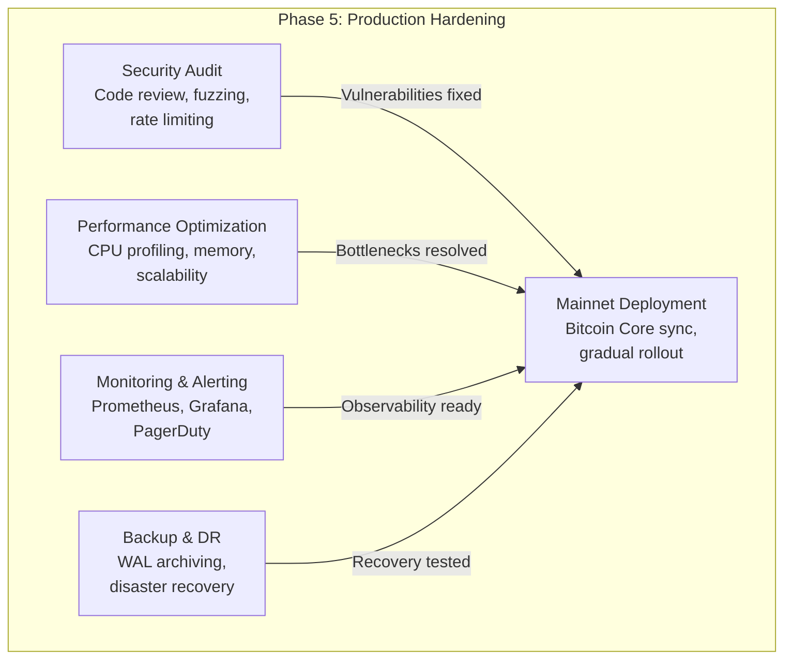
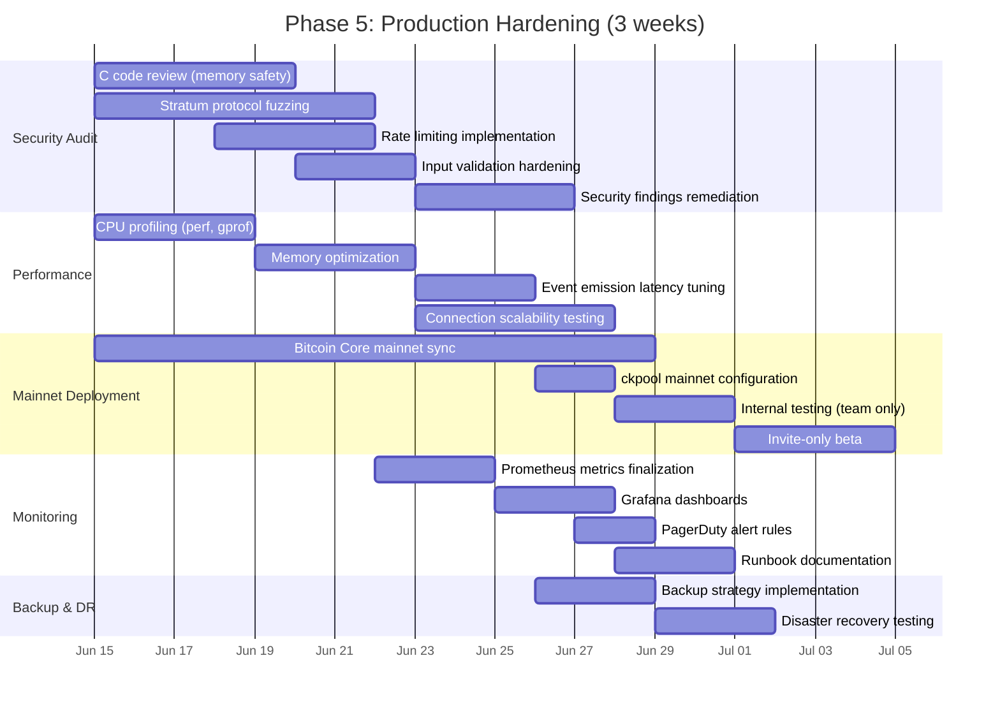
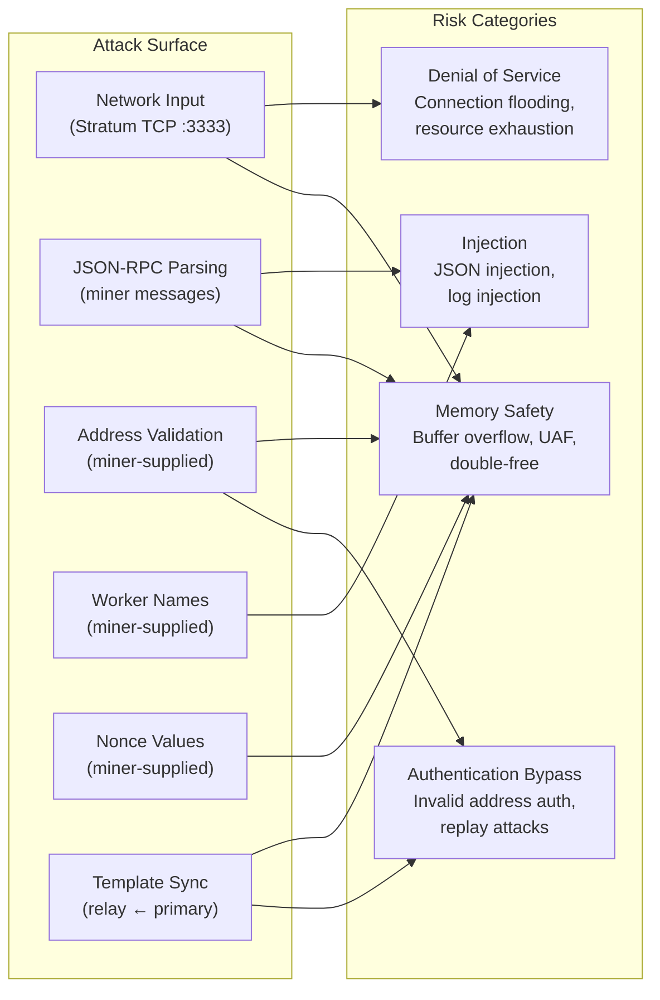
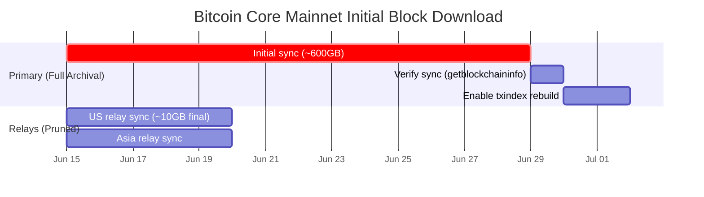
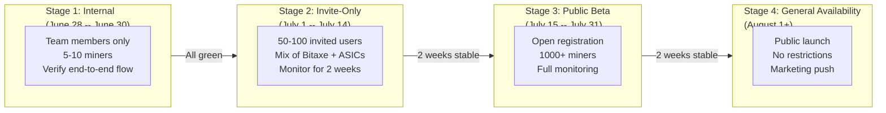
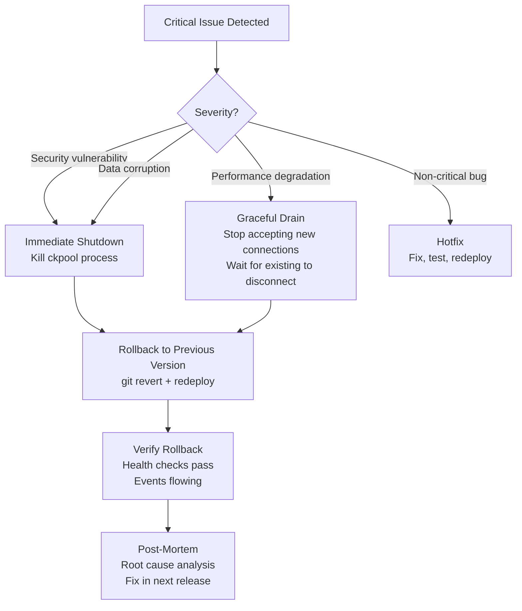
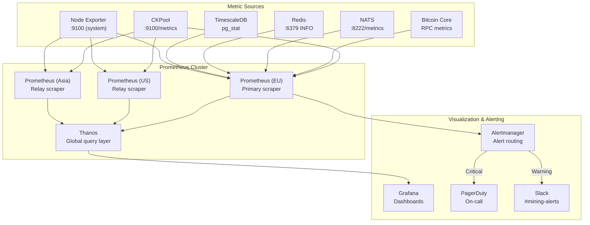
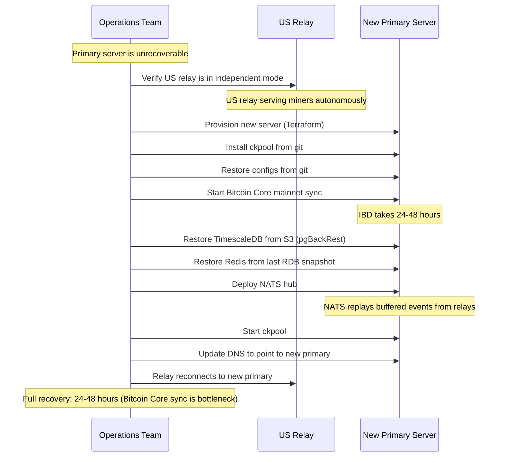
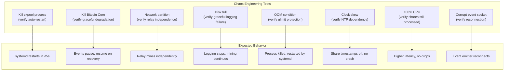

# Phase 5: Production Hardening

**Duration:** 3 weeks (June 15 -- July 4, 2026)
**Prerequisites:** Phase 4 (Multi-Instance & Geo-Distribution) completed
**Branch:** `feature/phase-5-production`

---

## Table of Contents

1. [Overview](#1-overview)
2. [Security Audit](#2-security-audit)
3. [Performance Optimization](#3-performance-optimization)
4. [Mainnet Deployment Checklist](#4-mainnet-deployment-checklist)
5. [Monitoring & Alerting](#5-monitoring--alerting)
6. [Backup & Disaster Recovery](#6-backup--disaster-recovery)
7. [Testing](#7-testing)
8. [Deliverables Checklist](#8-deliverables-checklist)

---

## 1. Overview

Phase 5 transitions the ckpool service from "works on testnet/signet" to "ready for real Bitcoin on mainnet." This phase is about eliminating risk: security vulnerabilities, performance bottlenecks, operational blind spots, and recovery gaps.

No new features are introduced. Every change in Phase 5 is about making existing features **safe, fast, observable, and recoverable**.



### Timeline



---

## 2. Security Audit

### 2.1 Scope

The security audit covers all C code modifications made in Phases 1--4, with particular focus on code that processes untrusted input from miners over the Stratum protocol.



### 2.2 Code Review Focus Areas

#### 2.2.1 Memory Safety

All C modifications are reviewed for:

| Vulnerability Class | Check | Tools |
|---|---|---|
| Buffer overflow | All `sprintf` → `snprintf`, bounds on all copies | Manual review, `-fsanitize=address` |
| Use-after-free | Lifetime analysis on all `malloc`/`free` pairs | AddressSanitizer, Valgrind |
| Double-free | Free-then-NULL pattern enforced | AddressSanitizer |
| Integer overflow | Arithmetic on user-supplied values checked | `-fsanitize=undefined`, manual review |
| Stack overflow | Recursive function depth bounded | Manual review, stack protector (`-fstack-protector-strong`) |
| Uninitialized memory | All variables initialized at declaration | `-Wuninitialized`, MemorySanitizer |
| Format string | No user input in format strings | `-Wformat-security`, manual review |

#### Compiler Hardening Flags

```makefile
# Makefile additions for production build
CFLAGS += -fstack-protector-strong    # Stack canaries
CFLAGS += -D_FORTIFY_SOURCE=2         # Buffer overflow detection
CFLAGS += -Wformat -Wformat-security  # Format string warnings
CFLAGS += -fPIE                       # Position-independent executable
LDFLAGS += -pie                       # PIE linking
LDFLAGS += -Wl,-z,relro,-z,now       # Full RELRO (GOT protection)
LDFLAGS += -Wl,-z,noexecstack        # Non-executable stack
```

#### 2.2.2 Input Validation Matrix

| Input | Source | Validation Required | Max Length |
|---|---|---|---|
| Bitcoin address | `mining.authorize` | Full address decode + checksum | 90 chars |
| Worker name | `mining.authorize` | Alphanumeric + `_-.` only | 128 chars |
| Nonce | `mining.submit` | Hex string, exact length | 8 chars (32-bit) |
| Nonce2 | `mining.submit` | Hex string, exact length | 16 chars (64-bit) |
| Job ID | `mining.submit` | Hex string, bounded | 8 chars |
| ntime | `mining.submit` | Hex string, 8 chars, range check | 8 chars |
| Version bits | `mining.submit` | Hex, within `version_mask` | 8 chars |
| User agent | `mining.subscribe` | Printable ASCII only | 256 chars |
| Coinbase signature | Redis cache | Pre-validated by API layer | 73 chars |
| Template JSON | Primary → relay | Authenticated channel, schema validated | 1MB max |

```c
/* Input validation: worker name */
static bool validate_worker_name(const char *name)
{
    if (!name || strlen(name) == 0 || strlen(name) > MAX_WORKER_NAME_LEN)
        return false;

    for (const char *p = name; *p; p++) {
        if (!isalnum(*p) && *p != '_' && *p != '-' && *p != '.')
            return false;
    }
    return true;
}

/* Input validation: hex string of exact length */
static bool validate_hex_string(const char *hex, size_t expected_len)
{
    if (!hex || strlen(hex) != expected_len)
        return false;

    for (size_t i = 0; i < expected_len; i++) {
        if (!isxdigit(hex[i]))
            return false;
    }
    return true;
}
```

### 2.3 Stratum Protocol Fuzzing

Use AFL++ (American Fuzzy Lop) and libFuzzer to fuzz the Stratum JSON-RPC parser and share validation logic.

#### Fuzzing Targets

| Target | Input | Goal |
|---|---|---|
| JSON-RPC parser | Malformed JSON strings | Find crashes in JSON parsing |
| `mining.subscribe` handler | Malformed subscribe params | Find crashes in subscribe logic |
| `mining.authorize` handler | Invalid addresses, long strings | Find auth bypass or crashes |
| `mining.submit` handler | Invalid nonces, bad job IDs | Find share validation crashes |
| Bech32m decoder | Malformed bech32m strings | Find decoder crashes |
| Coinbase sig validator | Adversarial strings | Find injection vectors |

#### Fuzzing Setup

```bash
# Build ckpool with AFL++ instrumentation
CC=afl-clang-fast CFLAGS="-fsanitize=address,undefined" \
    ./configure && make

# Create seed corpus from real Stratum messages
mkdir -p corpus/stratum_json
echo '{"id":1,"method":"mining.subscribe","params":["test/1.0"]}' > corpus/stratum_json/subscribe.json
echo '{"id":2,"method":"mining.authorize","params":["bc1qtest","x"]}' > corpus/stratum_json/authorize.json
echo '{"id":3,"method":"mining.submit","params":["bc1qtest","4a2","00000000deadbeef","6789abcd","a8f3b2c1"]}' > corpus/stratum_json/submit.json

# Run fuzzer (target: stratum_parse_message)
afl-fuzz -i corpus/stratum_json -o findings/ \
    -m 512 -t 1000 \
    ./fuzz_stratum_parser @@

# Run for minimum 24 hours, targeting 10M+ executions
```

#### libFuzzer Integration

```c
/* fuzz_stratum_parser.c -- libFuzzer target */
#include <stdint.h>
#include <stddef.h>

extern int parse_stratum_message(const char *buf, size_t len);

int LLVMFuzzerTestOneInput(const uint8_t *data, size_t size)
{
    /* Null-terminate the input */
    char *buf = malloc(size + 1);
    if (!buf) return 0;
    memcpy(buf, data, size);
    buf[size] = '\0';

    /* Parse as Stratum JSON-RPC message */
    parse_stratum_message(buf, size);

    free(buf);
    return 0;
}
```

### 2.4 Rate Limiting

Rate limiting protects against connection flooding and share spam from malicious clients.

#### Rate Limit Rules

| Resource | Limit | Window | Action on Exceed |
|---|---|---|---|
| New connections per IP | 10 | 60 seconds | Reject with TCP RST |
| Total connections per IP | 50 | Concurrent | Reject new connections |
| `mining.subscribe` per connection | 3 | 60 seconds | Disconnect |
| `mining.authorize` per connection | 5 | 60 seconds | Disconnect |
| `mining.submit` per connection | 1000 | 60 seconds | Soft-ban 5 minutes |
| Invalid shares per connection | 100 | 60 seconds | Disconnect |
| Total connections (global) | 100,000 | Concurrent | Reject lowest-priority |

#### Implementation

```c
/* rate_limit.c -- Token bucket rate limiter */

typedef struct rate_limiter {
    _Atomic uint32_t tokens;
    uint32_t max_tokens;
    uint32_t refill_rate;     /* tokens per second */
    time_t last_refill;
} rate_limiter_t;

typedef struct ip_rate_state {
    char ip[INET6_ADDRSTRLEN];
    rate_limiter_t connect_limiter;
    _Atomic int32_t active_connections;
    time_t first_seen;
    time_t last_seen;
    UT_hash_handle hh;
} ip_rate_state_t;

static ip_rate_state_t *ip_states = NULL;
static pthread_rwlock_t ip_states_lock = PTHREAD_RWLOCK_INITIALIZER;

/* Check if action is allowed for this IP */
static bool rate_limit_check(const char *ip, rate_limit_type_t type)
{
    ip_rate_state_t *state = get_or_create_ip_state(ip);
    rate_limiter_t *limiter;

    switch (type) {
        case RATE_CONNECT:
            limiter = &state->connect_limiter;
            break;
        /* ... other types ... */
    }

    /* Token bucket: refill tokens based on elapsed time */
    refill_tokens(limiter);

    /* Try to consume a token */
    uint32_t current = atomic_load(&limiter->tokens);
    if (current == 0) {
        LOGINFO("Rate limit exceeded for %s (type: %d)", ip, type);
        return false;
    }

    atomic_fetch_sub(&limiter->tokens, 1);
    return true;
}
```

---

## 3. Performance Optimization

### 3.1 CPU Profiling

#### Profiling Methodology

```bash
# Profile ckpool under load with perf
perf record -g -F 99 -p $(pidof ckpool) -- sleep 120

# Generate flame graph
perf script | stackcollapse-perf.pl | flamegraph.pl > flamegraph.svg

# Alternative: gprof (requires -pg build)
CFLAGS="-pg" ./configure && make
./ckpool -c test.conf &
sleep 300  # Mine under load
kill -TERM $(pidof ckpool)
gprof ckpool gmon.out > profile.txt
```

#### Expected Hotspots & Optimizations

| Hotspot | % CPU (est.) | Optimization |
|---|---|---|
| SHA256 double-hash (share validation) | 30--40% | Ensure hardware SHA256 (SHA-NI on x86, NEON on ARM) |
| JSON parsing (share submission) | 15--20% | Pre-allocated parse buffers, avoid malloc per message |
| Epoll event loop | 10--15% | Already efficient; verify no spurious wakeups |
| Difficulty comparison | 5--10% | Use leading-zero-bits shortcut before full comparison |
| Event emission (socket write) | 5% | Non-blocking write, batch events if possible |
| Logging | 5% | Async logging, reduce hot-path log verbosity |
| VarDiff calculation | 2--3% | Already lightweight, verify no redundant calculations |

#### SHA256 Hardware Acceleration

```c
/* Verify SHA256 hardware support at startup */
static void check_sha256_support(void)
{
#if defined(__x86_64__)
    /* Check for SHA-NI (Intel SHA Extensions) */
    uint32_t eax, ebx, ecx, edx;
    __cpuid_count(7, 0, eax, ebx, ecx, edx);
    if (ebx & (1 << 29)) {
        LOGNOTICE("SHA-NI hardware acceleration available");
        sha256_impl = sha256_ni;
    } else {
        LOGWARNING("SHA-NI not available, using software SHA256");
        sha256_impl = sha256_software;
    }
#elif defined(__aarch64__)
    /* ARM: Check for Crypto Extensions */
    /* ... */
#endif
}
```

### 3.2 Memory Optimization

#### Memory Budget

| Component | Current (est.) | Target | Strategy |
|---|---|---|---|
| Per-connection state | ~4KB | ~2KB | Reduce struct padding, pool allocators |
| User tracking (per user) | ~2KB | ~1.5KB | Compact hash tables |
| Work templates (active) | ~64KB each | ~64KB | Already compact |
| Event emission buffer | ~4KB per event | ~1KB | Pre-allocated ring buffer |
| Signature cache | ~100B per entry | ~100B | Already compact |
| VarDiff state (per connection) | ~128B | ~64B | Pack struct fields |
| **Total at 100k connections** | **~600MB** | **~300MB** | |

#### Pool Allocator for Hot Paths

```c
/* Pool allocator: pre-allocate slabs to avoid malloc in hot paths */

#define SLAB_SIZE 4096
#define POOL_INITIAL_SLABS 256

typedef struct memory_pool {
    void **free_list;
    size_t item_size;
    size_t items_per_slab;
    int total_allocated;
    int total_free;
    pthread_mutex_t lock;
} memory_pool_t;

static memory_pool_t share_pool;    /* Pre-allocated share structs */
static memory_pool_t event_pool;    /* Pre-allocated event buffers */

/* Initialize pool at startup */
void pool_init(memory_pool_t *pool, size_t item_size, int initial_count)
{
    pool->item_size = item_size;
    pool->items_per_slab = SLAB_SIZE / item_size;

    /* Pre-allocate initial slabs */
    for (int i = 0; i < initial_count; i++) {
        void *item = aligned_alloc(64, item_size);  /* Cache-line aligned */
        pool_return(pool, item);
    }
}

/* Allocation: O(1), no syscall */
void *pool_alloc(memory_pool_t *pool)
{
    pthread_mutex_lock(&pool->lock);
    void *item = pool->free_list;
    if (item) {
        pool->free_list = *(void **)item;
        pool->total_free--;
    }
    pthread_mutex_unlock(&pool->lock);

    if (!item) {
        /* Pool exhausted: allocate new slab */
        item = aligned_alloc(64, pool->item_size);
    }
    return item;
}
```

### 3.3 Event Emission Latency

**Target:** <1ms from share validation to event appearing on Unix socket.

#### Current Path

```
Share validated → JSON serialization → sendto() Unix socket → Event Collector reads
```

#### Optimization: Ring Buffer + Batch Emission

```c
/* Ring buffer for event batching */
#define EVENT_RING_SIZE 4096  /* Must be power of 2 */

typedef struct event_ring {
    char events[EVENT_RING_SIZE][EVENT_MAX_SIZE];
    _Atomic uint32_t write_pos;
    _Atomic uint32_t read_pos;
} event_ring_t;

static event_ring_t event_ring;

/* Hot path: enqueue event (lock-free) */
static void emit_event_fast(const char *json, size_t len)
{
    uint32_t pos = atomic_fetch_add(&event_ring.write_pos, 1) & (EVENT_RING_SIZE - 1);
    memcpy(event_ring.events[pos], json, len);
    event_ring.events[pos][len] = '\0';
}

/* Background thread: drain ring buffer to socket */
static void *event_emitter_thread(void *arg)
{
    int sock_fd = *(int *)arg;

    while (keeprunning) {
        uint32_t read = atomic_load(&event_ring.read_pos);
        uint32_t write = atomic_load(&event_ring.write_pos);

        if (read == write) {
            /* Ring empty: sleep briefly */
            usleep(100);  /* 0.1ms polling interval */
            continue;
        }

        /* Batch send: up to 64 events per syscall using writev() */
        struct iovec iov[64];
        int count = 0;

        while (read != write && count < 64) {
            uint32_t pos = read & (EVENT_RING_SIZE - 1);
            iov[count].iov_base = event_ring.events[pos];
            iov[count].iov_len = strlen(event_ring.events[pos]);
            count++;
            read++;
        }

        writev(sock_fd, iov, count);
        atomic_store(&event_ring.read_pos, read);
    }
    return NULL;
}
```

### 3.4 Connection Scalability

**Target:** 100,000 concurrent Stratum connections.

| Parameter | Value | Rationale |
|---|---|---|
| `ulimit -n` (file descriptors) | 200,000 | 100k connections + overhead |
| `net.core.somaxconn` | 65535 | Listen backlog |
| `net.ipv4.tcp_max_syn_backlog` | 65535 | SYN queue |
| `net.core.netdev_max_backlog` | 65535 | Network device backlog |
| `net.ipv4.tcp_tw_reuse` | 1 | Reuse TIME_WAIT sockets |
| `net.ipv4.ip_local_port_range` | 1024 65535 | Port range for outbound |
| Epoll mode | Edge-triggered | More efficient at scale |

#### Load Test Configuration

```bash
# Simulated miner load test using custom Stratum client
./stratum-load-test \
    --target mine.thebitcoingame.com:3333 \
    --miners 100000 \
    --ramp-up 300         # 300s ramp to full load \
    --share-interval 10   # 1 share per 10s per miner \
    --duration 3600       # 1 hour sustained \
    --report-interval 10  # Report metrics every 10s
```

#### Expected Results

| Metric | Target | Acceptable |
|---|---|---|
| Connections established | 100,000 | >95,000 |
| Share processing rate | 10,000/s | >8,000/s |
| P99 share RTT | <10ms | <50ms |
| CPU usage (8-core) | <60% | <80% |
| Memory usage | <2GB | <4GB |
| Event emission latency (P99) | <1ms | <5ms |
| Stale share rate | <0.1% | <0.5% |
| Connection error rate | <0.01% | <0.1% |

---

## 4. Mainnet Deployment Checklist

### 4.1 Bitcoin Core Mainnet Sync



#### Primary Node Configuration (Mainnet)

```ini
# bitcoin.conf (mainnet, primary)
chain=main
server=1
txindex=1
prune=0

rpcuser=ckpool_primary
rpcpassword=<64-char-random>
rpcallowip=127.0.0.1
rpcport=8332

zmqpubhashblock=tcp://127.0.0.1:28332
zmqpubrawtx=tcp://127.0.0.1:28333

dbcache=8192
maxconnections=125
par=4
rpcthreads=8

# Security
rpcbind=127.0.0.1
disablewallet=1
```

### 4.2 CKPool Mainnet Configuration

```json
{
    "btcd": [{
        "url": "127.0.0.1:8332",
        "auth": "ckpool_primary",
        "pass": "<64-char-random>",
        "notify": true
    }],
    "btcsig": "/TheBitcoinGame/",
    "blockpoll": 100,
    "donation": 0.0,
    "serverurl": ["0.0.0.0:3333"],
    "mindiff": 512,
    "startdiff": 10000,
    "maxdiff": 0,
    "update_interval": 30,
    "version_mask": "1fffe000",
    "nonce1length": 4,
    "nonce2length": 8,
    "logdir": "/var/log/tbg-mining",
    "zmqblock": "tcp://127.0.0.1:28332",
    "maxclients": 100000,
    "events": {
        "enabled": true,
        "socket_path": "/var/run/ckpool/events.sock",
        "include": ["share_submitted", "block_found", "miner_connected",
                     "miner_disconnected", "diff_updated", "hashrate_update",
                     "new_block_network", "share_best_diff", "asicboost_detected"]
    },
    "vardiff": {
        "target_share_interval": 10,
        "retarget_interval": 30,
        "ema_alpha": 0.3,
        "dampening": 0.5,
        "dead_band_percent": 20,
        "reconnect_memory_ttl": 86400
    },
    "metrics": {
        "enabled": true,
        "port": 9100,
        "path": "/metrics"
    },
    "rate_limits": {
        "connections_per_ip_per_minute": 10,
        "max_connections_per_ip": 50,
        "max_shares_per_minute": 1000,
        "max_invalid_shares_per_minute": 100
    }
}
```

### 4.3 Gradual Rollout Plan



#### Stage Gate Criteria

| Gate | From | To | Criteria |
|---|---|---|---|
| Gate 1 | Internal | Invite-Only | Zero crashes in 48h, all events flowing, dashboard displays real mainnet data |
| Gate 2 | Invite-Only | Public Beta | Zero crashes in 2 weeks, <0.5% stale shares, block submission verified (if any found), user feedback positive |
| Gate 3 | Public Beta | GA | Zero crashes in 2 weeks, scalability validated at 1000+ miners, all alerts tuned, runbooks tested |

### 4.4 Rollback Plan

If a critical issue is discovered at any stage:



#### Rollback Commands

```bash
# Emergency shutdown
sudo systemctl stop ckpool

# Rollback to previous version
cd /opt/ckpool
git checkout v1.0.0-rc.$(( $(cat VERSION) - 1 ))
make clean && make
sudo systemctl start ckpool

# Verify
curl -s http://localhost:9100/metrics | grep ckpool_uptime_seconds
```

---

## 5. Monitoring & Alerting

### 5.1 Monitoring Architecture



### 5.2 Grafana Dashboards

#### Dashboard 1: CKPool Overview

| Panel | Type | Query |
|---|---|---|
| Connected Miners (global) | Stat | `sum(ckpool_connected_miners)` |
| Pool Hashrate | Time series | `sum(ckpool_hashrate_total)` |
| Blocks Found (all time) | Stat | `sum(ckpool_blocks_found_total)` |
| Share Rate (global) | Time series | `sum(rate(ckpool_shares_total[5m]))` |
| Invalid Share % | Gauge | `sum(rate(ckpool_shares_total{valid="false"}[5m])) / sum(rate(ckpool_shares_total[5m])) * 100` |
| Event Emission Latency | Heatmap | `ckpool_event_emit_latency_us` |
| Regional Distribution | Pie chart | `ckpool_connected_miners` by `region` |

#### Dashboard 2: Per-Region Detail

| Panel | Type | Query |
|---|---|---|
| Region Health | Status map | `up{job="ckpool"}` by region |
| Template Sync Latency | Time series | `ckpool_relay_template_latency_ms` |
| Stale Share Rate | Time series | `ckpool_relay_stale_shares_percent` |
| NATS Replication Lag | Time series | `ckpool_nats_replication_lag_ms` |
| Independent Mode | Status | `ckpool_relay_independent_mode` |

#### Dashboard 3: Bitcoin Core

| Panel | Type | Query |
|---|---|---|
| Block Height | Stat | `ckpool_bitcoin_height` |
| Sync Status | Status light | `ckpool_bitcoin_connected` |
| Mempool Size | Time series | `bitcoin_mempool_size` |
| RPC Latency | Time series | `bitcoin_rpc_latency_ms` |
| Peer Count | Stat | `bitcoin_peer_count` |

### 5.3 Alert Rules

```yaml
# prometheus/alerts/ckpool.yml
groups:
  - name: ckpool_critical
    rules:
      - alert: CKPoolProcessDown
        expr: up{job="ckpool"} == 0
        for: 30s
        labels:
          severity: critical
        annotations:
          summary: "CKPool process is down on {{ $labels.instance }}"
          runbook: "https://runbooks.thebitcoingame.com/ckpool-down"

      - alert: BitcoinCoreDesync
        expr: ckpool_bitcoin_connected == 0
        for: 60s
        labels:
          severity: critical
        annotations:
          summary: "Bitcoin Core unreachable from CKPool"
          runbook: "https://runbooks.thebitcoingame.com/bitcoin-core-desync"

      - alert: ZeroSharesReceived
        expr: rate(ckpool_shares_total[5m]) == 0 and ckpool_connected_miners > 0
        for: 5m
        labels:
          severity: critical
        annotations:
          summary: "No shares received for 5 minutes despite {{ $value }} connected miners"

      - alert: BlockSubmitFailed
        expr: increase(ckpool_block_submit_failures_total[1h]) > 0
        labels:
          severity: critical
        annotations:
          summary: "Block submission to Bitcoin Core failed!"
          runbook: "https://runbooks.thebitcoingame.com/block-submit-failed"

  - name: ckpool_warning
    rules:
      - alert: HighInvalidShareRate
        expr: >
          rate(ckpool_shares_total{valid="false"}[5m]) /
          rate(ckpool_shares_total[5m]) > 0.05
        for: 10m
        labels:
          severity: warning
        annotations:
          summary: "Invalid share rate above 5% on {{ $labels.instance }}"

      - alert: HighEventLatency
        expr: histogram_quantile(0.99, ckpool_event_emit_latency_us) > 5000
        for: 5m
        labels:
          severity: warning
        annotations:
          summary: "P99 event emission latency above 5ms"

      - alert: RelayTemplateDelay
        expr: ckpool_relay_template_latency_ms > 500
        for: 5m
        labels:
          severity: warning
        annotations:
          summary: "Template sync to {{ $labels.region }} relay exceeds 500ms"

      - alert: HighMemoryUsage
        expr: ckpool_memory_bytes / 1024 / 1024 / 1024 > 3
        for: 10m
        labels:
          severity: warning
        annotations:
          summary: "CKPool memory usage above 3GB on {{ $labels.instance }}"

      - alert: RelayIndependentMode
        expr: ckpool_relay_independent_mode == 1
        for: 60s
        labels:
          severity: warning
        annotations:
          summary: "Relay {{ $labels.region }} operating in independent mode"
```

### 5.4 PagerDuty Integration

| Severity | PagerDuty Behavior | Response Time |
|---|---|---|
| Critical | Page on-call engineer immediately | <5 minutes |
| Warning | Create incident, notify via Slack | <30 minutes |
| Info | Log to Slack #mining-monitoring | Next business day |

---

## 6. Backup & Disaster Recovery

### 6.1 What Needs Backup

| Component | Data | Size | Backup Frequency | RPO |
|---|---|---|---|---|
| ckpool configuration | `/etc/ckpool/*.conf` | <1KB | Git (every change) | 0 (always in git) |
| ckpool binary | `/opt/ckpool/` | ~1MB | Git (every release) | 0 |
| Bitcoin Core data | `/data/bitcoin/` | ~600GB | N/A (re-sync from network) | N/A |
| TimescaleDB | Share history, gamification | ~50GB (growing) | WAL archiving (continuous) | <1 minute |
| Redis | Real-time state, caches | ~1GB | RDB snapshots (every 5min) | <5 minutes |
| NATS JetStream | Event streams | ~10GB | File storage replication | <1 minute |
| SSL/TLS certificates | `/etc/nats/certs/` | <10KB | Encrypted backup | On change |
| Prometheus TSDB | Metrics history | ~20GB | Remote write to S3 | <15 minutes |

### 6.2 TimescaleDB Backup Strategy

```bash
# Continuous WAL archiving to S3
# postgresql.conf
archive_mode = on
archive_command = 'pgbackrest --stanza=tbg-mining archive-push %p'
wal_level = replica

# pgBackRest configuration
[tbg-mining]
pg1-path=/var/lib/postgresql/16/main
repo1-type=s3
repo1-s3-bucket=tbg-backups
repo1-s3-region=eu-central-1
repo1-retention-full=4      # Keep 4 full backups
repo1-retention-diff=14     # Keep 14 differential backups

# Backup schedule (cron)
# Full backup: weekly (Sunday 02:00 UTC)
0 2 * * 0 pgbackrest --stanza=tbg-mining backup --type=full

# Differential backup: daily (02:00 UTC, except Sunday)
0 2 * * 1-6 pgbackrest --stanza=tbg-mining backup --type=diff
```

### 6.3 Disaster Recovery Procedures

#### Scenario: Primary Server Total Loss



#### Recovery Time Objectives

| Component | RTO | Strategy |
|---|---|---|
| ckpool (Stratum serving) | <5 minutes | Relays continue in independent mode |
| Event pipeline (full) | <1 hour | Restore Redis + TimescaleDB, NATS replays |
| Bitcoin Core (full archival) | 24--48 hours | IBD from network (cannot be meaningfully accelerated) |
| Complete primary recovery | 24--48 hours | Bottlenecked by Bitcoin Core sync |

### 6.4 Configuration Management

All configuration is stored in git and deployed via automation:

```
infrastructure/
  ckpool/
    primary.conf.j2        # Jinja2 template (secrets from Vault)
    relay-us.conf.j2
    relay-asia.conf.j2
  bitcoin/
    bitcoin-primary.conf
    bitcoin-relay.conf
  nats/
    hub.conf
    leaf.conf
  prometheus/
    prometheus.yml
    alerts/
      ckpool.yml
      bitcoin.yml
  grafana/
    dashboards/
      ckpool-overview.json
      ckpool-regional.json
      bitcoin-core.json
```

---

## 7. Testing

### 7.1 Penetration Testing

| Test | Tool | Target | Goal |
|---|---|---|---|
| Stratum protocol abuse | Custom Python scripts | :3333 | Connection flood, malformed messages, auth bypass |
| Network scanning | nmap | All ports | Verify only expected ports are open |
| SSL/TLS audit (NATS) | testssl.sh | :7422 | Verify TLS 1.3, strong ciphers |
| Rate limit verification | Custom load generator | :3333 | Verify rate limits enforce correctly |
| Input fuzzing (long-duration) | AFL++ | Stratum parser | 48h+ fuzzing campaign |
| Dependency audit | `cargo audit` / CVE scan | All libraries | No known vulnerabilities |

### 7.2 Chaos Engineering



### 7.3 Load Test Results Documentation

All load test results must be documented with:

1. Test configuration (number of miners, share rate, duration)
2. System metrics (CPU, memory, network, disk I/O)
3. Application metrics (share rate, latency, error rate)
4. Flame graphs (CPU profiling)
5. Comparison with previous run (regression detection)
6. Pass/fail verdict against targets

---

## 8. Deliverables Checklist

### Week 1 (June 15--21)

- [ ] Bitcoin Core mainnet sync started on primary (runs for ~2 weeks)
- [ ] Bitcoin Core mainnet sync started on relay nodes (pruned, ~5 days)
- [ ] Security: C code review completed -- all modifications reviewed for memory safety
- [ ] Security: Compiler hardening flags enabled in production build
- [ ] Security: Stratum protocol fuzzing started (AFL++, 48h minimum campaign)
- [ ] Security: Rate limiting implemented (connection, subscribe, submit, invalid shares)
- [ ] Security: Input validation hardened for all miner-supplied fields
- [ ] Performance: CPU profiling completed with perf/flame graphs
- [ ] Performance: SHA256 hardware acceleration verified

### Week 2 (June 22--28)

- [ ] Security: Fuzzing campaign results analyzed, all crashes fixed
- [ ] Security: Penetration testing completed (Stratum abuse, network scan, TLS audit)
- [ ] Performance: Memory optimization (pool allocators for hot paths)
- [ ] Performance: Event emission ring buffer implemented (<1ms latency)
- [ ] Performance: Connection scalability test at 100k connections
- [ ] Performance: All performance targets met (see Section 3.4 table)
- [ ] Monitoring: Prometheus metrics finalized (all metrics from Phase 3 + new)
- [ ] Monitoring: Grafana dashboards created (3 dashboards, all panels)
- [ ] Monitoring: PagerDuty alert rules deployed (critical + warning)
- [ ] Monitoring: Runbook documentation for all critical alerts
- [ ] Backup: TimescaleDB WAL archiving to S3 configured
- [ ] Backup: Redis RDB snapshot schedule configured
- [ ] Backup: Configuration management in git verified
- [ ] CKPool mainnet configuration finalized
- [ ] Bitcoin Core primary mainnet sync completed

### Week 3 (June 29 -- July 4)

- [ ] Disaster recovery test: primary server simulated total loss + recovery
- [ ] Chaos engineering: all 8 scenarios tested and documented
- [ ] Load test results documented with flame graphs and metrics
- [ ] Mainnet internal testing: team miners connected, shares flowing, events processing
- [ ] Mainnet internal testing: end-to-end flow verified (miner → ckpool → events → dashboard)
- [ ] Rollback procedure tested on staging
- [ ] systemd service files finalized (auto-restart, resource limits, logging)
- [ ] Linux kernel tuning applied (sysctl for 100k connections)
- [ ] Relay nodes mainnet sync completed and verified
- [ ] All documentation updated: deployment guide, runbooks, architecture
- [ ] Security audit report finalized
- [ ] Performance benchmark report finalized
- [ ] Go/no-go decision for invite-only beta (Stage 2)
- [ ] Code review completed
- [ ] Merged to `main` branch, tagged as release candidate

---

*Phase 5 depends on: Phase 4 (multi-region infrastructure to harden).*
*Phase 6 (Stratum V2) is independent and can begin after Phase 5 mainnet deployment is stable.*
