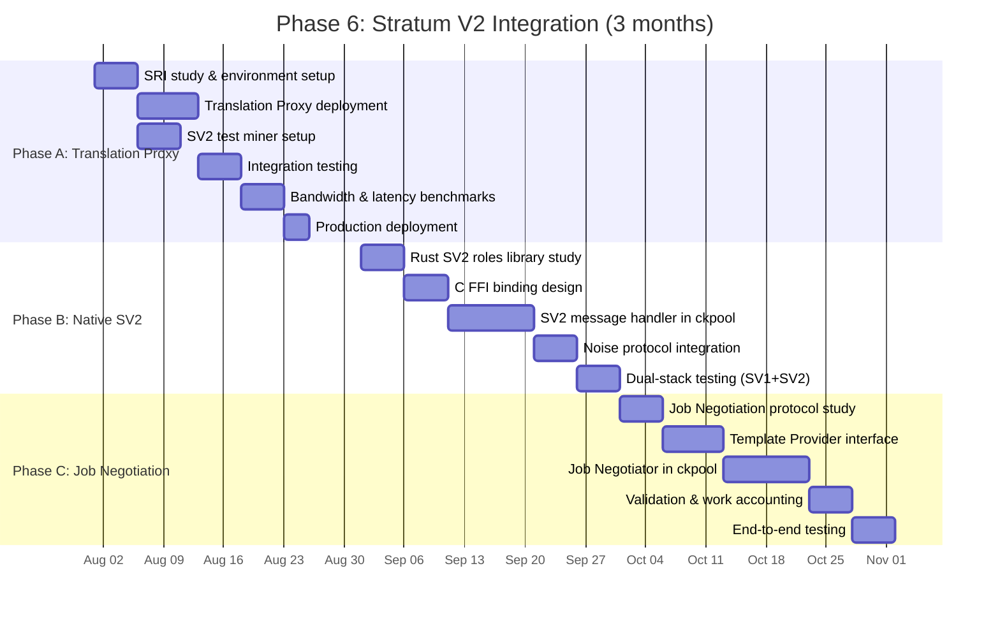
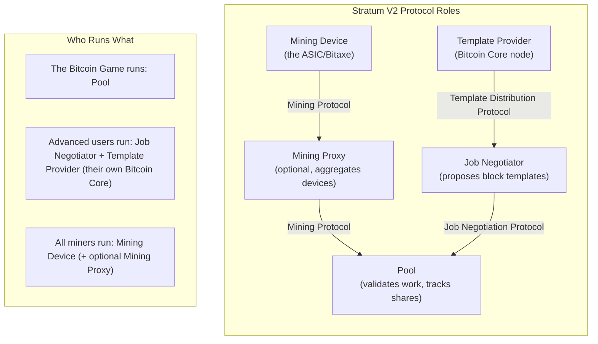
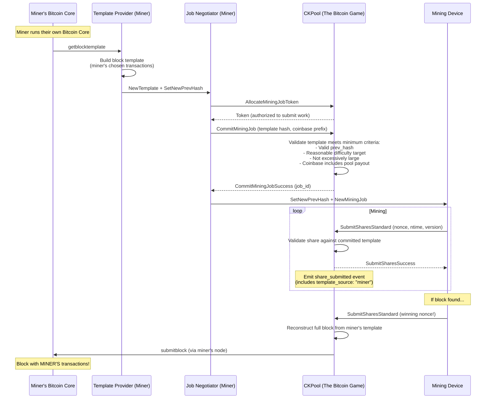

# Phase 6: Stratum V2 Integration

**Duration:** 3 months (August 1 -- October 31, 2026)
**Prerequisites:** Phase 5 (Production Hardening) completed, mainnet stable
**Branch:** `feature/phase-6-stratum-v2`

---

## Table of Contents

1. [Overview](#1-overview)
2. [Why Stratum V2](#2-why-stratum-v2)
3. [Phase A: SV2 Translation Proxy (Month 1)](#3-phase-a-sv2-translation-proxy)
4. [Phase B: Native SV2 Pool Support (Month 2)](#4-phase-b-native-sv2-pool-support)
5. [Phase C: Job Negotiation (Month 3)](#5-phase-c-job-negotiation)
6. [Testing](#6-testing)
7. [Deliverables Checklist](#7-deliverables-checklist)

---

## 1. Overview

Stratum V2 (SV2) is the next generation of the mining protocol, designed to address fundamental limitations of Stratum V1. For The Bitcoin Game, SV2 is not just a technical upgrade -- it is a **philosophical alignment**: miners choosing their own transactions is the ultimate expression of mining sovereignty, and it is core to our platform's mission.

Phase 6 is divided into three sub-phases, each deliverable independently:

```mermaid
graph LR
    subgraph PhaseA["Phase A (Month 1)<br/>Translation Proxy"]
        TP["SRI Translation Proxy<br/>SV2 miners → SV1 ckpool"]
        BEN_A["Benefits:<br/>Encryption<br/>Bandwidth reduction<br/>No ckpool changes"]
    end

    subgraph PhaseB["Phase B (Month 2)<br/>Native SV2 Support"]
        NAT["Native SV2 endpoint<br/>Rust FFI in ckpool"]
        BEN_B["Benefits:<br/>Lower latency<br/>No proxy overhead<br/>Full SV2 features"]
    end

    subgraph PhaseC["Phase C (Month 3)<br/>Job Negotiation"]
        JN["Full Job Negotiation<br/>Miner-selected transactions"]
        BEN_C["Benefits:<br/>Censorship resistance<br/>Decentralization<br/>Miner sovereignty"]
    end

    PhaseA -->|"Foundation"| PhaseB
    PhaseB -->|"Enables"| PhaseC

    style PhaseA fill:#1a2a3a,stroke:#58a6ff
    style PhaseB fill:#1a3a1a,stroke:#3fb950
    style PhaseC fill:#3a2a1a,stroke:#d4a843
```



### Timeline



---

## 2. Why Stratum V2

### 2.1 Protocol Comparison

| Feature | Stratum V1 | Stratum V2 |
|---|---|---|
| **Encryption** | None (plaintext JSON) | Noise Protocol (AEAD encryption) |
| **Bandwidth** | ~150 bytes/share (JSON) | ~50 bytes/share (binary) |
| **Transaction selection** | Pool chooses transactions | Miner can choose transactions |
| **Man-in-the-middle** | Vulnerable (hashrate hijacking) | Protected (authenticated encryption) |
| **Message format** | JSON-RPC (text) | Binary (fixed-size frames) |
| **Header-only mining** | Not possible | Supported (further bandwidth savings) |
| **Connection multiplexing** | One connection per worker | Multiple channels per connection |
| **Censorship resistance** | None (pool controls template) | Full (miner selects transactions) |

### 2.2 Relevance to The Bitcoin Game

| SV2 Feature | The Bitcoin Game Impact |
|---|---|
| **Encrypted connections** | Protects miners from ISP-level hashrate theft; important for home miners on shared networks |
| **Reduced bandwidth** | Critical for Bitaxe miners on WiFi; ~66% bandwidth reduction means fewer dropped shares |
| **Miner-selected transactions** | Core to our "Decentralized Mining" vision; users who run their own Bitcoin Core choose their own transactions |
| **Man-in-the-middle protection** | Home miners are especially vulnerable; SV2 eliminates this entire attack class |
| **Header-only mining** | Extreme bandwidth savings for low-power miners; a Bitaxe on cellular data becomes viable |

### 2.3 SV2 Architecture Roles



---

## 3. Phase A: SV2 Translation Proxy

### 3.1 Overview

The fastest path to SV2 support is deploying the **Stratum Reference Implementation (SRI) Translation Proxy**. This proxy sits between SV2 miners and our existing SV1 ckpool instance, translating protocol messages in both directions.

**Zero changes to ckpool required.** The proxy handles all SV2 complexity.

### 3.2 Architecture

```mermaid
graph TB
    subgraph Miners["Miners"]
        SV1_M["SV1 Miners<br/>(Antminer, Whatsminer)"]
        SV2_M["SV2 Miners<br/>(Bitaxe w/ SV2 firmware,<br/>future ASICs)"]
    end

    subgraph Proxy["SRI Translation Proxy<br/>(Rust binary)"]
        SV2_IN["SV2 Endpoint<br/>:3334 (encrypted, binary)"]
        TRANS["Protocol Translator<br/>SV2 ↔ SV1"]
        SV1_OUT["SV1 Client<br/>(connects to ckpool)"]
    end

    subgraph CKPool["CKPool (unchanged)"]
        SV1_IN["SV1 Endpoint<br/>:3333 (plaintext, JSON)"]
        STRAT["Stratifier<br/>(share validation)"]
    end

    SV1_M -->|"Stratum V1<br/>:3333"| SV1_IN
    SV2_M -->|"Stratum V2<br/>:3334 (encrypted)"| SV2_IN
    SV2_IN --> TRANS
    TRANS --> SV1_OUT
    SV1_OUT -->|"Stratum V1<br/>localhost:3333"| SV1_IN
    SV1_IN --> STRAT

    style Proxy fill:#1a2a3a,stroke:#58a6ff
```



### 3.3 SRI Translation Proxy Deployment

```bash
# Clone SRI (Stratum Reference Implementation)
git clone https://github.com/stratum-mining/stratum.git
cd stratum

# Build translation proxy
cd roles/translator
cargo build --release

# Configuration
cat > translator-config.toml << 'EOF'
# SRI Translation Proxy Configuration for The Bitcoin Game

# Upstream SV1 pool (our ckpool)
[upstream]
authority_public_key = ""  # No auth for local connection
pool_address = "127.0.0.1:3333"
pool_signature = "TheBitcoinGame"

# Downstream SV2 miners
[downstream]
listen_address = "0.0.0.0"
listen_mining_port = 3334
# Noise protocol keys (generated once, stored securely)
authority_public_key = "<generated-pub-key>"
authority_secret_key = "<generated-sec-key>"
cert_validity_duration = 3600

# Mining parameters
[mining]
min_individual_miner_hashrate = 500000000000  # 500 GH/s minimum
miner_hashrate_tolerance = 10  # 10% tolerance

# Logging
[logging]
level = "info"
file = "/var/log/tbg-mining/translator.log"
EOF

# Run
./target/release/translator -c translator-config.toml
```

### 3.4 DNS Configuration

```
mine.thebitcoingame.com      → :3333 (SV1, unchanged)
sv2.mine.thebitcoingame.com  → :3334 (SV2 via translation proxy)
```

Miners using SV2-capable firmware configure:
```
Pool URL: stratum+tcp://sv2.mine.thebitcoingame.com:3334
```

### 3.5 Benefits Delivered by Phase A

| Benefit | Measurement |
|---|---|
| Encryption | All SV2 connections use Noise Protocol (AEAD) |
| Bandwidth reduction | ~66% fewer bytes per share (binary vs JSON) |
| MitM protection | Authenticated encryption prevents hashrate hijacking |
| Zero ckpool changes | Translation proxy is a separate process |
| Backward compatible | SV1 miners unaffected, continue on :3333 |

### 3.6 Limitations of Phase A

| Limitation | Addressed In |
|---|---|
| Extra latency from proxy hop | Phase B (native SV2) |
| No job negotiation | Phase C |
| No header-only mining | Phase B (native SV2) |
| Translation proxy is another process to monitor | Phase B eliminates it |

---

## 4. Phase B: Native SV2 Pool Support

### 4.1 Overview

Phase B integrates the SV2 protocol directly into ckpool via Rust FFI bindings to the `stratum-v2` roles library. This eliminates the translation proxy, reduces latency, and enables full SV2 features including header-only mining.

### 4.2 Architecture

```mermaid
graph TB
    subgraph Miners["Miners"]
        SV1_M["SV1 Miners"]
        SV2_M["SV2 Miners"]
    end

    subgraph CKPool["CKPool (Modified)"]
        subgraph Connector["Connector Process"]
            SV1_EP["SV1 Endpoint<br/>:3333<br/>(JSON-RPC)"]
            SV2_EP["SV2 Endpoint<br/>:3334<br/>(Binary, Noise encrypted)"]
            SV2_LIB["SV2 Roles Library<br/>(Rust, via C FFI)"]
        end

        subgraph Core["Core Processes (Unchanged)"]
            STRAT["Stratifier"]
            GEN["Generator"]
        end
    end

    SV1_M -->|"SV1"| SV1_EP
    SV2_M -->|"SV2 (encrypted)"| SV2_EP
    SV2_EP --> SV2_LIB
    SV2_LIB -->|"Translated to<br/>internal format"| STRAT
    SV1_EP --> STRAT
    STRAT <--> GEN

    style SV2_EP fill:#1a3a1a,stroke:#3fb950
    style SV2_LIB fill:#1a3a1a,stroke:#3fb950
```



### 4.3 Rust FFI Binding Design

The SV2 roles library is written in Rust. We create C-compatible FFI bindings that ckpool's connector process can call.

```rust
// sv2_ffi/src/lib.rs -- C FFI bindings for SV2 pool role

use std::ffi::{CStr, CString};
use std::os::raw::{c_char, c_int, c_void};
use roles_logic_sv2::mining_sv2::*;

/// Opaque handle to SV2 pool state
pub struct Sv2PoolHandle {
    // Internal SV2 pool state
    pool: Pool,
    noise_config: NoiseConfig,
}

/// Initialize SV2 pool with Noise protocol keys
#[no_mangle]
pub extern "C" fn sv2_pool_init(
    listen_port: u16,
    authority_pub_key: *const c_char,
    authority_sec_key: *const c_char,
) -> *mut Sv2PoolHandle {
    let pub_key = unsafe { CStr::from_ptr(authority_pub_key) }
        .to_str()
        .expect("Invalid public key");
    let sec_key = unsafe { CStr::from_ptr(authority_sec_key) }
        .to_str()
        .expect("Invalid secret key");

    let handle = Box::new(Sv2PoolHandle {
        pool: Pool::new(listen_port),
        noise_config: NoiseConfig::new(pub_key, sec_key),
    });

    Box::into_raw(handle)
}

/// Accept a new SV2 connection (called from ckpool's epoll loop)
#[no_mangle]
pub extern "C" fn sv2_accept_connection(
    handle: *mut Sv2PoolHandle,
    client_fd: c_int,
) -> c_int {
    let handle = unsafe { &mut *handle };
    // Perform Noise handshake, register mining channel
    match handle.pool.accept(client_fd, &handle.noise_config) {
        Ok(_) => 0,
        Err(_) => -1,
    }
}

/// Process incoming SV2 message
/// Returns a C struct with the decoded message type and data
#[no_mangle]
pub extern "C" fn sv2_process_message(
    handle: *mut Sv2PoolHandle,
    client_fd: c_int,
    buf: *const u8,
    len: usize,
    out_msg: *mut Sv2Message,
) -> c_int {
    let handle = unsafe { &mut *handle };
    let data = unsafe { std::slice::from_raw_parts(buf, len) };

    match handle.pool.process(client_fd, data) {
        Ok(msg) => {
            unsafe { *out_msg = msg.into_c_repr() };
            0
        }
        Err(_) => -1,
    }
}

/// Send new mining job to SV2 miner
#[no_mangle]
pub extern "C" fn sv2_send_new_mining_job(
    handle: *mut Sv2PoolHandle,
    client_fd: c_int,
    job: *const Sv2MiningJob,
) -> c_int {
    // Encrypt and send SV2 NewMiningJob message
    // ...
    0
}

/// Cleanup
#[no_mangle]
pub extern "C" fn sv2_pool_destroy(handle: *mut Sv2PoolHandle) {
    if !handle.is_null() {
        unsafe { drop(Box::from_raw(handle)) };
    }
}
```

#### C Header (Generated)

```c
/* sv2_ffi.h -- Auto-generated C header for SV2 FFI bindings */

#ifndef SV2_FFI_H
#define SV2_FFI_H

#include <stdint.h>
#include <stddef.h>

typedef struct Sv2PoolHandle Sv2PoolHandle;

typedef struct {
    uint8_t msg_type;       /* 0=subscribe, 1=authorize, 2=submit, etc. */
    char user[128];
    char worker[128];
    uint32_t job_id;
    uint32_t nonce;
    uint32_t ntime;
    uint32_t version;
    int64_t share_diff;
} Sv2Message;

typedef struct {
    uint32_t job_id;
    uint8_t prev_hash[32];
    uint8_t coinbase1[256];
    size_t coinbase1_len;
    uint8_t coinbase2[256];
    size_t coinbase2_len;
    uint8_t merkle_branches[32][32];
    uint8_t merkle_branch_count;
    uint32_t version;
    uint32_t nbits;
    uint32_t ntime;
    int clean_jobs;
} Sv2MiningJob;

Sv2PoolHandle *sv2_pool_init(uint16_t listen_port,
                              const char *authority_pub_key,
                              const char *authority_sec_key);
int sv2_accept_connection(Sv2PoolHandle *handle, int client_fd);
int sv2_process_message(Sv2PoolHandle *handle, int client_fd,
                        const uint8_t *buf, size_t len,
                        Sv2Message *out_msg);
int sv2_send_new_mining_job(Sv2PoolHandle *handle, int client_fd,
                            const Sv2MiningJob *job);
void sv2_pool_destroy(Sv2PoolHandle *handle);

#endif /* SV2_FFI_H */
```

### 4.4 Integration in ckpool Connector

```c
/* In connector.c: dual-stack SV1 + SV2 */

static void setup_listeners(ckpool_t *ckp)
{
    /* Existing SV1 listener */
    setup_sv1_listener(ckp, ckp->sv1_port);  /* :3333 */

    /* New SV2 listener */
    if (ckp->sv2_enabled) {
        ckp->sv2_handle = sv2_pool_init(
            ckp->sv2_port,          /* :3334 */
            ckp->sv2_pub_key,
            ckp->sv2_sec_key
        );

        if (!ckp->sv2_handle) {
            LOGERR("Failed to initialize SV2 pool");
            return;
        }

        setup_sv2_listener(ckp, ckp->sv2_port);
        LOGNOTICE("SV2 endpoint listening on :%d", ckp->sv2_port);
    }
}

/* In the epoll event loop: handle both SV1 and SV2 */
static void process_client_message(client_t *client, char *buf, size_t len)
{
    if (client->protocol == PROTOCOL_SV2) {
        Sv2Message msg;
        int ret = sv2_process_message(ckp->sv2_handle, client->fd,
                                       (uint8_t *)buf, len, &msg);
        if (ret == 0) {
            /* Convert SV2 message to internal format and
             * pass to stratifier (same path as SV1) */
            process_share_from_sv2(client, &msg);
        }
    } else {
        /* Existing SV1 JSON-RPC path */
        process_json_rpc(client, buf, len);
    }
}
```

### 4.5 Build System Integration

```makefile
# Makefile additions for SV2 support

# Build Rust FFI library
sv2_ffi/target/release/libsv2_ffi.a:
	cd sv2_ffi && cargo build --release

# Link against Rust library
LDFLAGS += -Lsv2_ffi/target/release -lsv2_ffi
# Rust standard library deps (varies by platform)
LDFLAGS += -lpthread -ldl -lm

# Optional: disable SV2 support
ifdef NO_SV2
CFLAGS += -DNO_SV2
endif
```

### 4.6 Configuration

```json
{
    "sv2": {
        "enabled": true,
        "port": 3334,
        "authority_public_key": "<base58-encoded-pub-key>",
        "authority_secret_key": "<base58-encoded-sec-key>",
        "cert_validity_seconds": 3600,
        "min_miner_hashrate": 500000000000,
        "header_only_mining": true
    }
}
```

---

## 5. Phase C: Job Negotiation

### 5.1 Overview

Job Negotiation is the crown jewel of Stratum V2. It allows miners to **select their own transactions** for the blocks they mine, rather than accepting the pool's template. This is the most significant change for Bitcoin decentralization since P2Pool.

For The Bitcoin Game, this feature directly enables our "Decentralized Mining" vision:
- Users run their own Bitcoin Core node at home
- Their node selects which transactions to include in blocks
- The pool validates their work and tracks shares
- If the miner finds a block, it contains **their** chosen transactions

**Maximum censorship resistance. Maximum sovereignty.**

### 5.2 Job Negotiation Architecture

```mermaid
graph TB
    subgraph MinerHome["Miner's Home Setup"]
        BTC_M["Bitcoin Core<br/>(Miner's own node)"]
        TP_M["Template Provider<br/>(SRI component)"]
        JN_M["Job Negotiator<br/>(SRI component)"]
        ASIC["Mining Device<br/>(Bitaxe / ASIC)"]
    end

    subgraph TBG["The Bitcoin Game Infrastructure"]
        POOL["CKPool<br/>SV2 Pool Role"]
        BTC_P["Bitcoin Core<br/>(Pool's node)"]
        PIPE["Event Pipeline"]
    end

    BTC_M -->|"getblocktemplate"| TP_M
    TP_M -->|"Template Distribution<br/>Protocol"| JN_M
    JN_M -->|"Job Negotiation<br/>Protocol"| POOL
    ASIC -->|"Mining Protocol<br/>(SV2 encrypted)"| POOL

    POOL <-->|"Validation"| BTC_P
    POOL -->|"Events"| PIPE

    style MinerHome fill:#3a2a1a,stroke:#d4a843
    style TBG fill:#1a3a1a,stroke:#3fb950
```



### 5.3 How Job Negotiation Works



### 5.4 Template Validation Rules

The pool must validate miner-proposed templates to prevent abuse while preserving miner sovereignty:

| Rule | Description | Enforcement |
|---|---|---|
| Valid `prev_hash` | Template must build on the current chain tip | Reject if >1 block behind |
| Reasonable size | Block weight must be within protocol limits | Reject if >4MW |
| Coinbase includes pool payout | If using a payout model, ensure pool's share | Verify coinbase outputs |
| No double-spends | Transactions must not conflict with mempool | Advisory only (not strict) |
| Minimum fees | Template must include reasonable fee transactions | Advisory only |
| Timestamp range | `ntime` must be within acceptable range | Reject if >2h from current |

**Crucially, we do NOT enforce transaction selection policy.** The entire point of Job Negotiation is that miners choose their own transactions. We validate structural correctness, not content.

```c
/* Job negotiation: validate miner-proposed template */
typedef struct template_validation_result {
    bool valid;
    char reason[256];
    uint64_t template_fees;     /* Total fees in template */
    uint32_t template_weight;   /* Block weight */
    int tx_count;               /* Number of transactions */
} template_validation_result_t;

static template_validation_result_t validate_miner_template(
    const ckpool_t *ckp,
    const char *template_hash,
    const uint8_t *prev_hash,
    uint32_t ntime,
    const uint8_t *coinbase_prefix,
    size_t coinbase_prefix_len)
{
    template_validation_result_t result = { .valid = true };

    /* Check prev_hash matches current tip */
    if (memcmp(prev_hash, ckp->current_prev_hash, 32) != 0) {
        result.valid = false;
        snprintf(result.reason, sizeof(result.reason), "stale prev_hash");
        return result;
    }

    /* Check ntime is reasonable */
    time_t now = time(NULL);
    if (abs((int)(ntime - now)) > 7200) {  /* 2 hours */
        result.valid = false;
        snprintf(result.reason, sizeof(result.reason), "ntime out of range");
        return result;
    }

    /* Coinbase prefix validation (if pool payout required) */
    /* For solo mining: the entire block reward goes to the miner,
     * so no pool payout validation needed. */

    result.valid = true;
    return result;
}
```

### 5.5 Event Schema for Job Negotiation

```json
{
    "event": "share_submitted",
    "data": {
        "user": "bc1q...",
        "worker": "bitaxe-sovereign",
        "difficulty": 2048,
        "share_diff": 4231847293,
        "valid": true,
        "template_source": "miner",
        "miner_template_hash": "a1b2c3...",
        "miner_tx_count": 3847,
        "miner_template_fees_sat": 12500000
    }
}

{
    "event": "job_negotiated",
    "data": {
        "user": "bc1q...",
        "template_hash": "a1b2c3...",
        "tx_count": 3847,
        "total_fees_sat": 12500000,
        "block_weight": 3998421,
        "validation_result": "accepted"
    }
}
```

### 5.6 Gamification Integration

Job Negotiation opens new gamification opportunities:

| Feature | Description | Badge/Achievement |
|---|---|---|
| "Sovereign Miner" | First share with miner-selected transactions | Legendary badge |
| "Node Runner" | Connect with Job Negotiation active | Epic badge |
| "Censorship Resistor" | Include a transaction that other pools reject | Special badge |
| "Full Node" | Maintain Job Negotiation for 30 days | Monthly streak |
| "Template Crafter" | Build 1000 custom templates | Rare badge |
| Transaction diversity | Include more unique transactions than average | Weekly leaderboard category |

### 5.7 Connection to Decentralized Mining Vision

Phase C of Stratum V2 is the technical foundation for The Bitcoin Game's long-term vision of fully decentralized mining:

```mermaid
graph TB
    subgraph Today["Today: Centralized Solo Pool"]
        T1["The Bitcoin Game ckpool<br/>generates templates"]
        T2["All miners use pool's templates"]
        T3["Pool chooses transactions"]
    end

    subgraph PhaseC_Done["After Phase C: Hybrid"]
        P1["Pool generates default templates"]
        P2["Advanced miners propose own templates"]
        P3["Both paths validated by pool"]
    end

    subgraph Future["Future: Full Decentralization"]
        F1["Every miner runs own Bitcoin Core"]
        F2["Every miner selects own transactions"]
        F3["Pool only validates work + tracks shares"]
        F4["Maximum censorship resistance"]
    end

    Today -->|"Phase 6C"| PhaseC_Done
    PhaseC_Done -->|"Future phases"| Future

    style Future fill:#3a2a1a,stroke:#F7931A
```



---

## 6. Testing

### 6.1 Phase A Testing: Translation Proxy

| Test ID | Scenario | Expected Result | Method |
|---|---|---|---|
| SV2-A-01 | SV2 miner connects via proxy | Successful mining, shares counted | SRI test miner (`mining-device`) |
| SV2-A-02 | SV1 miner unaffected | Normal operation on :3333 | Existing SV1 test suite |
| SV2-A-03 | Encryption verification | All SV2 traffic encrypted | Packet capture (Wireshark) |
| SV2-A-04 | Bandwidth measurement | >50% reduction vs SV1 | Byte counter on SV2 vs SV1 for same hashrate |
| SV2-A-05 | Proxy crash recovery | Auto-restart, miners reconnect | Kill proxy, measure reconnection time |
| SV2-A-06 | MitM attempt on SV2 | Connection rejected | Proxy intercept test |
| SV2-A-07 | Mixed SV1+SV2 load | Both protocols work simultaneously | 50% SV1 + 50% SV2 load test |

### 6.2 Phase B Testing: Native SV2

| Test ID | Scenario | Expected Result | Method |
|---|---|---|---|
| SV2-B-01 | SV2 direct connection (no proxy) | Successful mining on :3334 | SRI test miner |
| SV2-B-02 | Noise handshake | Encrypted channel established | Protocol-level verification |
| SV2-B-03 | Header-only mining | Miner receives only header data | SV2 miner with header-only mode |
| SV2-B-04 | Dual-stack (SV1 :3333 + SV2 :3334) | Both protocols simultaneously | Mixed load test |
| SV2-B-05 | SV2 latency vs SV1 | SV2 share RTT <= SV1 share RTT | Comparative benchmark |
| SV2-B-06 | Rust FFI memory safety | No leaks under load | Valgrind + AddressSanitizer |
| SV2-B-07 | SV2 connection scalability | 10,000+ SV2 connections | Load test |
| SV2-B-08 | Translation proxy removal | Proxy no longer needed | Verify direct SV2 path |

### 6.3 Phase C Testing: Job Negotiation

| Test ID | Scenario | Expected Result | Method |
|---|---|---|---|
| SV2-C-01 | Miner proposes valid template | Template accepted, shares validated | SRI Job Negotiator + Template Provider |
| SV2-C-02 | Miner proposes stale template | Template rejected (stale prev_hash) | Delayed template submission |
| SV2-C-03 | Miner proposes oversized block | Template rejected (>4MW) | Crafted oversized template |
| SV2-C-04 | Template with unusual tx selection | Template accepted (we don't censor) | Template with low-fee txs |
| SV2-C-05 | Block found via miner template | Block submitted with miner's txs | Signet block mining with Job Negotiation |
| SV2-C-06 | Mixed: some miners with JN, some without | Both paths work simultaneously | Mixed miner load test |
| SV2-C-07 | Template validation performance | <10ms per template validation | Benchmark under load |
| SV2-C-08 | Event emission for JN shares | Events include `template_source: "miner"` | Event collector verification |

### 6.4 SV2 Protocol Compliance Tests

```bash
# Run SRI protocol compliance test suite
cd stratum-reference-implementation
cargo test --release -- --test-threads=1

# Test against our ckpool SV2 endpoint
SV2_POOL_URL=127.0.0.1:3334 cargo test -- sv2_compliance

# Noise protocol handshake tests
./tests/noise_handshake_test --endpoint 127.0.0.1:3334

# SV2 message format validation
./tests/message_format_test --endpoint 127.0.0.1:3334
```

---

## 7. Deliverables Checklist

### Month 1: Phase A -- Translation Proxy (August 1--31)

#### Week 1--2
- [ ] SRI codebase studied and understood (Translation Proxy role)
- [ ] Development environment set up with SRI + ckpool
- [ ] SRI Translation Proxy compiled and running locally
- [ ] SV2 test miner (`mining-device`) connected through proxy to ckpool
- [ ] Proxy configuration finalized for The Bitcoin Game deployment

#### Week 3
- [ ] Integration testing: SV2 miner → proxy → ckpool → events (all passing)
- [ ] SV1 regression testing: existing SV1 miners unaffected
- [ ] Bandwidth benchmarks: >50% reduction measured and documented
- [ ] Latency benchmarks: proxy overhead measured (<5ms acceptable)
- [ ] Encryption verification: packet capture confirms no plaintext

#### Week 4
- [ ] Production deployment: SV2 endpoint on `sv2.mine.thebitcoingame.com:3334`
- [ ] DNS configuration for SV2 endpoint
- [ ] Prometheus metrics for SV2 proxy (connections, throughput, errors)
- [ ] Grafana dashboard panel for SV2 connections
- [ ] Documentation: user-facing guide for connecting via SV2
- [ ] All Phase A tests passing (SV2-A-01 through SV2-A-07)

### Month 2: Phase B -- Native SV2 Pool Support (September 1--30)

#### Week 1--2
- [ ] SV2 roles library (Rust) studied
- [ ] C FFI binding design finalized (`sv2_ffi.h`)
- [ ] Rust FFI library compiled and linkable from C
- [ ] SV2 message handler integrated into ckpool connector

#### Week 3
- [ ] Noise Protocol handshake working natively in ckpool
- [ ] SV2 endpoint on :3334 without translation proxy
- [ ] Header-only mining support implemented
- [ ] Dual-stack (SV1 :3333 + SV2 :3334) running simultaneously

#### Week 4
- [ ] Memory safety verification (Valgrind + ASAN on SV2 FFI path)
- [ ] Scalability testing: 10,000+ SV2 connections
- [ ] Latency benchmarks: native SV2 vs proxy SV2 vs SV1
- [ ] Translation proxy deprecated (kept as fallback only)
- [ ] Build system updated: `make` builds both C + Rust
- [ ] All Phase B tests passing (SV2-B-01 through SV2-B-08)
- [ ] Documentation updated: architecture, build instructions

### Month 3: Phase C -- Job Negotiation (October 1--31)

#### Week 1--2
- [ ] Job Negotiation Protocol studied (SV2 spec)
- [ ] Template Provider interface defined
- [ ] `AllocateMiningJobToken` handler implemented
- [ ] `CommitMiningJob` handler implemented with template validation
- [ ] Template validation rules implemented (structural, not content-based)

#### Week 3
- [ ] Job Negotiator client tested (SRI reference implementation)
- [ ] Full end-to-end: miner proposes template → mines → finds block
- [ ] Mixed miner load: JN miners + standard miners simultaneously
- [ ] Work accounting correct for both JN and standard miners

#### Week 4
- [ ] Event schema extended: `template_source`, `miner_template_hash`
- [ ] Gamification integration: "Sovereign Miner" badge trigger via events
- [ ] Performance benchmarks: template validation <10ms
- [ ] All Phase C tests passing (SV2-C-01 through SV2-C-08)
- [ ] SV2 protocol compliance test suite passing
- [ ] Documentation: Job Negotiation user guide, architecture
- [ ] Blog post: "Miner-Selected Transactions on The Bitcoin Game"
- [ ] Code review completed
- [ ] Merged to `main`, tagged as release

---

### Overall Phase 6 Success Criteria

| Criterion | Measurement |
|---|---|
| SV2 endpoint live on mainnet | `sv2.mine.thebitcoingame.com:3334` accepting connections |
| Encryption for all SV2 connections | Noise Protocol verified via packet capture |
| Bandwidth reduction | >50% fewer bytes per share vs SV1 |
| Native SV2 (no proxy) | Direct SV2 in ckpool, proxy removed |
| Job Negotiation operational | Miners can propose own templates |
| Zero regression for SV1 miners | SV1 on :3333 fully unaffected |
| Performance targets met | Share RTT <10ms, template validation <10ms |
| Gamification triggers | "Sovereign Miner" badge earnable |

---

*Phase 6 depends on: Phase 5 (mainnet must be stable before SV2 integration).*
*Phase 6 enables: Decentralized Mining feature (user-run pools via Job Negotiation).*
